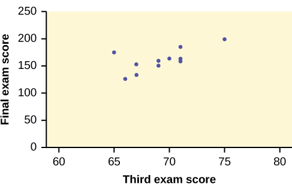
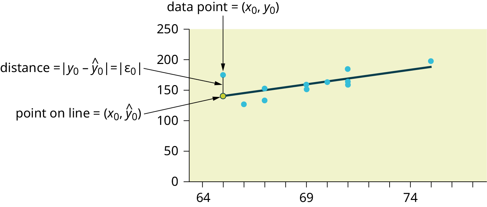

```{r set-options, include=FALSE, purl=FALSE}
# knitr pkg is needed throughout book
if (!"knitr" %in% installed.packages()) {
  install.packages("knitr", repos = "http://cran.rstudio.com")
}
library(knitr)

# Set output options
if (is_html_output()) {
  options(width = 80)
}
if (is_latex_output()) {
  options(width = 75)
}
options(digits = 7, bookdown.clean_book = TRUE, knitr.kable.NA = "NA")
opts_chunk$set(
  tidy = FALSE,
  out.width = "\\textwidth",
  fig.align = "center",
  comment = NA
)

# New dplyr warning message when running group_by() %>% summarize() that is not
# addressed in v1 (print edition). 
# See https://github.com/moderndive/ModernDive_book/issues/353
# v2 TODO: Remove this option and fix group_by() section in Ch3
options(dplyr.summarise.inform = FALSE)

# Install CRAN packages needed
needed_CRAN_pkgs <- c(
  # Packages used by book reader (except skimr, see below):
  "dygraphs", "fivethirtyeight", "gapminder", "ggplot2movies", "infer", "ISLR", 
  "janitor", "knitr", "moderndive", "nycflights13", "scales", "tidyverse", 
  "broom",
  
  # Packages only used internally for bookdown book building
  "devtools", "ggrepel", "here", "kableExtra", "mvtnorm", "patchwork", 
  "remotes", "rmarkdown", "sessioninfo", "viridis", "webshot"
)
new_pkgs <- needed_CRAN_pkgs[!(needed_CRAN_pkgs %in% installed.packages())]
if (length(new_pkgs)) {
  install.packages(new_pkgs, repos = "http://cran.rstudio.com")
}

# Install non-2.0 version of skimr so that histograms can be removed easily
# v2 TODO: Fix https://github.com/moderndive/ModernDive_book/issues/271
if (!"skimr" %in% installed.packages()) {
  remotes::install_version("skimr", version = "1.0.6", 
                           repos = "http://cran.rstudio.com")
}
```


# Introduction


<!--chapter:end:index.Rmd-->

# M1U: Course Syllabus

The syllabus for this course is available as a PDF through Canvas. However, it is also reproduced here for the purposes of annotation. 

## Overview

### Course

ICT/LIS 661-201: Introduction to Data Science

### Instructor

Spencer Greenhalgh, PhD

### Contact Information

* *Office*—341 Lucille Little Library Bldg.
* *Phone*—859.218.2294
* *Email*—spencer.greenhalgh@uky.edu
* *Zoom*—[https://uky.zoom.us/my/greenhalgh](https://uky.zoom.us/my/greenhalgh)

### Response Time

During the work week (but not the weekend!), I commit to respond to all emails within 24 hours. I expect you to regularly check Canvas and email for messages from me and to respond quickly.

### Office Hours

I will hold office hours in person or on Zoom (see above):

* Wednesday, 10am to 12pm
* Thursday, 11am to 1pm, or
* by appointment

While you are free to come by without an appointment, I suggest that you let me know when you plan to come to office hours.

### Meeting Schedule

This course takes place asynchronously on Canvas

## Required Materials

This course uses a free custom online textbook based on Creative Commons-licensed works such as [*Data Feminism*](https://data-feminism.mitpress.mit.edu/), OpenStax's [*Introductory Statistics()](https://openstax.org/details/books/introductory-statistics), and the "ModernDive" [*Statistical Inference Via Data Science*](https://moderndive.com/) textbook. 

## "Life is Difficult" Statement [inspired by [Dr. Andrew Heiss]

Recent years have been characterized by a global pandemic, increased (and overdue) attention to inequalities and injustices, and stressful political tensions; we might hope that the worst of all of these has passed, but the truth is that none of them have disappeared. This can be a difficult time to be in grad school.

**Despite these difficulties, I am fully committed to making sure that you learn everything you were hoping to learn from this class!** My late policy and willingness to make accommodations are generous even during normal times, and if your life is being turned upside down, I'm willing to be as flexible as you need me to be—so long as you are active in communicating with me.

If you feel like you're behind, not understanding everything, or just plain stressed, **do not suffer in silence**! I'm usually quick to respond to email and more than happy to meet with you.

## Basic Needs Statement [inspired by Dr. [Sara Goldrick-Rab](https://medium.com/@saragoldrickrab/basic-needs-security-and-the-syllabus-d24cc7afe8c9)]

Any student who has difficulty affording or accessing food to eat every day or who lacks a safe and stable place to live and believes this may affect their performance in the course is urged to [contact the Dean of Students](http://www.uky.edu/concern/) and to explore the resources listed at the bottom of [this page](https://uknow.uky.edu/campus-news/uk-working-ensure-food-and-housing-security-among-students). Furthermore, please notify me if you are comfortable in doing so.

## Course Information

### Course Description

This course will provide a foundation in the area of data science based on data curation and statistical analysis. The primary goal of this course is for students to learn data analysis concepts and techniques that facilitate making decisions from a rich data set. Students will investigate data concepts, metadata creation and interpretation, the general linear model, cluster analysis, and basics of information visualization. At the beginning, this course will introduce fundamentals about data and data standards and methods for organizing, curating, and preserving data for reuse. Then, we will focus on the inferential statistics: drawing conclusions and making decisions from data. This course will help students understand how to use data analysis tools, and especially, provide an opportunity to utilize an open source data analysis tool, R, for data manipulation, analysis, and visualization. Finally, in this course we will discuss diverse issues around data including technologies, behaviors, organizations, policies, and society. 

### Course Objectives—"I Can Statements"

The following "I can" statements will guide all of the learning and assessment activities throughout this course. Although these objectives have some overlap, activities within each module will clearly and specifically relate to a single objective, and larger assessments will implicitly ask you to demonstrate all of them. As we proceed throughout the semester, you should feel increasingly comfortable making these statements about yourself:

* I can express my understanding of philosophical, ethical, statistical, research, and other concepts underpinning data science.
* I can apply that understanding—in conjunction with R programming—to completing practical projects.
* I can connect conceptual and practical elements of data science to disciplinary and contextual knowledge.

### Course Assessment

Your grade for this course will be based on 100 points: 

* 90 points – 100.0 points = A
* 80 points – 89.9 points = B
* 70 points – 79.9 points = C
* 0 points – 69.9 points = E

These 100 points come from the following assessment activities, which should all be completed honestly and individually on Canvas:

#### Projects

Throughout the semester, you will complete four projects worth a total of 55 points:

* Project #1: Finding and Evaluating Data (10 points)
* Project #2: Exploring and Describing Data (10 points)
* Project #3: Building and Evaluating Models (10 points)
* Final Project: Reporting Data Analysis (25 points)

Detailed instructions for these projects can be found on Canvas.

#### Participation

Throughout the semester, you will earn 45 points from a series of participation activities. During each of the fifteen modules of the semester, you will complete three reading or participation activities (each worth one point) that will help you extend or apply your understanding of course content; while these activities vary from module to module, a plurality of modules involve annotating a reading from the textbook, completing a programming walkthrough with provided data, and then adapting (some of) the code from the walkthrough to work with your own data.

### Late Work Policy

Officially, each assignment is due at 11:59pm on the Sunday night indicated in Canvas. Practically speaking, however, I will grade without penalty (for graded assessments) and provide feedback on (for all assessments) anything that is turned in by the time I begin reviewing that assessment. However, I will not grade or provide feedback on any work that is completed after this time unless you have made other arrangements with me. Naturally, because my schedule varies from week to week and because I try to provide feedback as quickly as possible, your best bet is to turn in your work by the official deadline or—if life has thrown you a curveball—to get in touch with me ahead of time to make other arrangements.

### Prep Week

[UK policies](https://ombud.uky.edu/students/academic-policies/prep-days-reading-days) limit what I can assign during Week 16 of the course. However, I am "permitted to grade student participation," "collect regularly assigned homework," and "collect projects" so long as those assignments are scheduled ahead of time and, in the case of projects, there is nothing due during Finals Week. Please note that your final project meets these requirements and is due during Week 16.


## Course Policies

All of the policies listed on [this page](https://www.uky.edu/universitysenate/acadpolicy) are in effect for this course. 

## Code, Plagiarism, and Generative AI 

It is common practice in data science and programming communities to borrow code from other, more knowledgeable programmers. Indeed, many of the weekly activities in this class will explicitly involve copying or adapting code from our textbook, and you might find online or other sources helpful for figuring out how to complete a specific task for your class projects. When done properly, this is not plagiarism—in fact, it is good practice in data science.

**Nonetheless, you are ultimately responsible for completing assessments**, and plagiarism remains a serious concern for this course. Thus, [these rules](https://www.uky.edu/universitysenate/ao) related to academic offenses are also in effect for this course, and I will not tolerate their violation. If you consult other sources, please ensure that they support (rather than replace) your personal work, effort, initiative, and understanding. It is **your responsibility** to ensure that you understand what plagiarism is and how to avoid it; when in doubt, reach out to me with your questions.

Along these lines, I **strongly discourage** you from using any generative AI tool to write code or text for you. AI-generated output can include errors, and as a general rule, if you know enough to catch those errors, you know enough to generate that output yourself; conversely, generating that output yourself will help you further develop your knowledge more than relying on a tool. If you do use any generative AI in completing your work, you **must explicitly acknowledge it** in your submission—and you will assume responsibility for any errors the tool makes.

# Diversity, Equity, and Inclusion

## College Statement

The College of Communication and Information will build a collaborative environment for creativity, curiosity, and excellence grounded in the core values of diversity, justice, and equity. We are enriched by the diversity of cultures, perspectives, and talents in our community. We thrive together when we work to provide an equitable and welcoming experience that respects and empowers the unique contributions and circumstances of students, faculty, and staff from every race and ethnicity, nationality, gender identity and expression, sexual orientation, religion, citizenship status, age, veteran status, pregnancy and parenting status, and disability or health status. We are committed to ensuring every member of our College feels welcomed, well-served, and included. Please join us.

## University Statement

The University of Kentucky is committed to our core values of diversity and inclusion, mutual respect and human dignity, and a sense of community ([Governing Regulations XIV](https://www.uky.edu/regs/gr14)). We acknowledge and respect the seen and unseen diverse identities and experiences of all members of the university community (https://www.uky.edu/regs/gr14). These identities include but are not limited to those based on race, ethnicity, gender identity and expressions, ideas and perspectives, religious and cultural beliefs, sexual orientation, national origin, age, ability, and socioeconomic status. We are committed to equity and justice and providing a learning and engaging community in which every member is engaged, heard, and valued.

We strive to rectify and change behavior that is inconsistent with our principles and commitment to creating a safe, equitable, and anti-racist environment. If students encounter such behavior in a course, they are encouraged to speak with the instructor of record or the [college’s diversity officer](https://www.uky.edu/inclusiveexcellence/college-diversity-inclusion-officers/), who is charged with addressing concerns about diversity, equity, and inclusiveness (https://uky.edu/inclusiveexcellence/college-diversity-inclusion-officers). Students may also contact a faculty member within the department, program director, the director of undergraduate or graduate studies, the department chair, or the dean. To submit an official report of bias, hatred, racism, or identity-based violence, visit the Bias Incident Support Services [website](https://www.uky.edu/biss/report-bias-incident).

Please also consider the following resources related to diversity, equity, and inclusion:

### Bias Incident Support Services 

Bias Incident Support Services (BISS) provides confidential support and advocacy for any student, staff, or faculty member impacted by bias, hatred, and/or an act of identity-based violence. BISS staff aid impacted parties in accessing campus and community resources, including the Bias Incident Response Team, the University’s official reporting system for acts that negatively impact a sense of belonging. Campus and community consultation and educational opportunities centered on inclusion, diversity, equity and belonging is a resource also provided by BISS. For more detailed information please visit the BISS website (https://uky.edu/biss) or contact them via email (biss@uky.edu).

### Counseling Center

The UK Counseling Center (UKCC) provides a range of confidential psychological services to students enrolled in 6 credit hours or more, psychoeducational outreach programming (including QPR suicide prevention), and consultation to members of the UK community (students, faculty, staff, administrators, parents, concerned others). Please visit the UKCC’s website (https://uky.edu/counselingcenter) for more detailed information or call (859) 257-8701.

### Disability Resource Center

If you have a documented disability that requires academic accommodations, please inform your instructor as soon as possible during scheduled office hours. In order to receive accommodations in this course, you must provide your instructor with a Letter of Accommodation from the Disability Resource Center (DRC). The DRC coordinates campus disability services available to students with disabilities. It is located on the corner of Rose Street and Huguelet Drive in the Multidisciplinary Science Building, Suite 407. You can reach them via phone at (859) 257-2754, via email (drc@uky.edu) or visit their website (https://uky.edu/DisabilityResourceCenter).

### Martin Luther King Center

The Martin Luther King Center (MLKC) supports an inclusive learning environment where diversity and individual differences are understood, respected, and appreciated as a source of strength. The MLKC’s year-round programs and activities that focus on the importance of cultural awareness and cross-cultural understanding support its three primary goals: 1) sponsoring cultural and educational programming; 2) offering opportunities for student support and development; and 3) through programmatic linkages with a wide variety of civic and community agencies, promoting community outreach, engagement, and collaboration. Students can reach the MLKC via phone at (859) 257-4130, by visiting them in Gatton Student Center Suite A230, via email (mlkc@uky.edu), and by visiting the MLKC website (https://uky.edu/mlkc). 
If there are aspects within your experience here at UK that result in barriers to your inclusion or accurate assessment of achievement, please notify the instructor as soon as possible and/or email the Office for Institutional Diversity via email (vpid@uky.edu).

### Non-Discrimination / Title IX 

In accordance with federal law, UK is committed to providing a safe learning, living, and working environment for all members of the University community. The University maintains a comprehensive program which protects all members from discrimination, harassment, and sexual misconduct. For complete information about UK’s prohibition on discrimination and harassment on aspects such as race, color, ethnic origin, national origin, creed, religion, political belief, sex, and sexual orientation, please see the electronic version of UK’s Administrative Regulation 6:1 (“Policy on Discrimination and Harassment”) (https://www.uky.edu/regs/ar6-1). In accordance with Title IX of the Education Amendments of 1972, the University prohibits discrimination and harassment on the basis of sex in academics, employment, and all of its programs and activities. Sexual misconduct is a form of sexual harassment in which one act is severe enough to create a hostile environment based on sex and is prohibited between members of the University community and shall not be tolerated. For more details, please see the electronic version of Administrative Regulations 6:2 (“Policy and Procedures for Addressing and Resolving Allegations of Sexual Assault, Stalking, Dating Violence, Domestic Violence, and Sexual Exploitation”) (https://www.uky.edu/regs/ar6-2). Complaints regarding violations of University policies on discrimination, harassment, and sexual misconduct are handled by the Office of Institutional Equity and Equal Opportunity (Institutional Equity), which is located in 13 Main Building and can be reached by phone at (859) 257-8927. You can also visit Institutional Equity’s website (https://www.uky.edu/eeo). 

Faculty members are obligated to forward any report made by a student related to discrimination, harassment, and sexual misconduct to the Office of Institutional Equity. Students can confidentially report alleged incidences through the Violence Intervention and Prevention Center (https://www.uky.edu/vipcenter), Counseling Center (https://www.uky.edu/counselingcenter), or University Health Service (https://ukhealthcare.uky.edu/university-health-service/student-health). 

Reports of discrimination, harassment, or sexual misconduct may be made to Institutional Equity [here](https://www.uky.edu/universitysenate/).

### Office of LGBTQ* Resources 

UK is committed to supporting students and upholding the University’s efforts to promote inclusion among our community. UK faculty and staff employees support inclusion and diversity throughout the University, including the ways in which faculty structure classroom conversations and manage those dynamics. To assist in these efforts, students are welcome to provide the names and pronouns they prefer. One easy way to do this is by using the pronoun feature of UK’s Name Change Form. (More information about the form can be found on the Office of LGBTQ*’s website (https://uky.edu/lgbtq/forms-and-resources). Otherwise, students can provide this information to instructors directly.

Discrimination based on sexual orientation, gender expression, and gender identity is prohibited at UK. If you have questions about support, advocacy, and community-building services related to sexual orientation, gender expression, or gender identity, students are encouraged to visit the website of the Office of LGBTQ* Resources (https://uky.edu/lgbtq/forms-and-resources).

### Veterans Resource Center (VRC) 

Being both a member of the military community and a student can bring some complexities. If you are a member of the military or a military veteran or dependent, please let instructors know when these challenges arise. Drill schedules, calls to active duty, mandatory training exercises, issues with GI Bill disbursement, etc. can complicate your academic life. Let your instructor know if you experience complications.

The VRC is a great resource for members of our military family. If you have questions regarding your VA benefits or other related issues, the VRC has a full complement of staff to assist you. The VRC also provides study and lounge space, as well as free printing. Please visit the VRC website (https://uky.edu/veterans), email the VRC (vetcenter@uky.edu), visit them in the basement of Erikson Hall, or call the director, Colonel Tony Dotson, at (859) 257-1148.

If you are a military student serving in the National Guard or Reserve, it is in your best interest to let all of your instructors know that immediately. You might also consider sharing a copy of your training schedule. 

If you are a military student who is a member of the National Guard or Military Reserve and are called to duty for one-fifth or less of this semester, provide a copy of your military orders to the Director of the Veterans Resource Center (contact information above) once you become aware of the call to duty. (Please also provide the Director with a list of all your current courses and instructors.) The Director will verify the orders with the appropriate military authority and will, on the military student's behalf, notify their instructors as to the known extent of the absence.

Your absences will not be penalized and instructors will work with military students to create reasonable accommodations for making up missed assignments, quizzes, and tests.

### Violence Intervention and Prevention (VIP) Center 

If you experience an incident of sex- or gender-based discrimination or interpersonal violence, we encourage you to report it. While you may talk to a faculty member or TA/RA/GA, understand that as a "Responsible Employee" of the University these individuals MUST report any acts of violence (including verbal bullying and sexual harassment) to the University's Title IX Coordinator in the Institutional Equity Office. If you would like to speak with someone who may be able to afford you confidentiality, you can visit the Violence Intervention and Prevention (VIP) Center’s website (https://uky.edu/vipcenter/content/faq) (offices located in Bosworth Hall, 1st Floor; (859) 257-3574), the Counseling Center’s (CC) website (https://uky.edu/counselingcenter/student-resources), and the University Health Services (UHS) website (https://uky.edu/university-health-service/student-health/our-student-services). The VIP Center, CC, and UHS are confidential resources on campus. **The VIP Center accepts Zoom, phone, and walk-in appointments**.

## Course Schedule

### Module 1: Course Introduction (26 Aug - 1 Sep)

* read and annotate the course syllabus
* complete "Install R and RStudio" walkthrough
* introduce yourself to the class

### Module 2: Data Science (2 Sep - 8 Sep)

* read and annotate "The New(?) and Shiny(?) Science of Data"
* complete "Getting Started with Data in R" walkthrough
* complete "Set up GitHub" walkthrough


### Module 3: Reproducibility and Paradigms (9 Sep to 15 Sep)

* read and annotate "Research Paradigms and Reproducibility"
* complete "Using Projects and Scripts in R" walkthrough
* complete "Writing in R Markdown" walkthrough


### Module 4: Data Sharing (16 Sep - 22 Sep)

* read and annotate "The Value of Open Data"
* complete "Find a Dataset Relevant to You" walkthrough
* read and annotate "Show Your Work"
* **submit Project 1: Finding and Evaluating Data**

### Module 5: Theory and Ethics (23 Sep - 29 Sep)

* read and annotate "Numbers Don't Speak for Themselves"
* read and annotate "Are Ethics Enough in Data Science"
* reflect on theoretical and philosophical constraints in context

### Module 6: Data Cleaning (30 Sep - 6 Oct)

* read and annotate "Unicorns, Janitors, and Rock Stars"
* complete "Wrangling and Tidying Data" walkthrough
* practice wrangling and tidying your own data

### Module 7: Data Visualization (7 Oct - 13 Oct)

* read and annotate "Subjectivity in Data Visualization
* complete "Data Visualization" walkthrough
* practice visualizing your own data

### Module 8: Descriptive Statistics (14 Oct - 20 Oct)

* read and annotate "Statistics and Scientific Racism"
* complete "Descriptive Statistics" walkthrough
* calculate descriptive statistics for your own data
* **submit Project 2: Exploring and Describing Data**

### Module 9: Basic Regression (21 Oct - 27 Oct)

* read and annotate "Basic Regression"
* complete "Basic Regression" walkthrough
* perform a basic regression with your own data

### Module 10: Multiple Regression (28 Oct - 3 Nov)

* read and annotate "Consequences of Failed Predictions"
* complete "Multiple Regression" walkthrough
* perform a multiple regression with your own data

### Module 11: Statistical Sampling (4 Nov - 10 Nov)

* read and annotate "Samples and Populations"
* complete "Sampling" walkthrough
* explore sampling with your own data

### Module 12: Confidence Intervals (11 Nov - 17 Nov)

* read and annotate "Confident About What?"
* complete "Confidence Intervals" walkthrough
* explore confidence intervals with your own data

### Module 13: Hypothesis Testing (18 Nov - 24 Nov)

* read and annotate "The Danger of False Positives"
* complete "Hypothesis Testing" walkthrough
* explore hypothesis testing with your own data

### Module 14: Inferential Regression (25 Nov - 1 Dec)

* read and annotate "Small Stories vs. Big Data"
* complete "Inferential Regression" walkthrough
* perform an inferential regression with your own data
* **submit Project 3: Building and Evaluating Models**

### Module 15: Course Reflection (2 Dec - 8 Dec)

* reflect on your understanding of data science
* reflect on your application of data science
* reflect on your connection with data science

### Module 16: Final Project (9 Dec - 11 Dec)

* **submit Final Project: Reporting Data Analysis**

<!--chapter:end:01_module_1_understanding.Rmd-->

# M1A: Install R and RStudio

This content draws on material from [STAT 545](https://stat545.com/) by [Jenny Bryan](https://jennybryan.org/), licensed under [CC BY-SA 4.0](https://creativecommons.org/licenses/by-sa/4.0/)

Changes to the source material include addition of new material; light editing; rearranging, removing, and combining original material; adding and changing links; and adding first-person language from current author.

The resulting content is licensed under [CC BY-SA 4.0](http://creativecommons.org/licenses/by-nc-sa/4.0/).

## Introduction

My formal training is in education, so I have some strong opinions about what learning looks like and what good teaching ought to look like. In particular, I hold to a sociocultural view of learning that assumes that:

> knowledge is distributed in the world among individuals, the tools, artifacts, and books that they use, and the communities and practices in which they participate (Greeno et al., 1996, p. 20)

In other words, I can't teach you data science by merely rattling off a list of facts for you to memorize and then repeat at the appropriate time. Rather, if I'm going to effectively teach you data science, I need to introduce you to data science communities, have you use the tools that data scientists use, and have you act in the way that data scientists act.

In relation to this second point, R and RStudio are  software that are widely used in the world of data science, so becoming familiar with them is part of learning data science. Some data scientists prefer other software, and that's fine, but this is what we've decided on teaching here in UK's School of Information Science (and it's what I personally use, so I'm better suited to teaching it anyway).

This activity is about introducing you to this software and helping you set it up. Even if you have a pre-existing installation of R or RStudio, I highly recommend that you re-install both and get as current as possible. It can be considerably harder to run old software than new.

## R

[R](https://www.r-project.org/) is an open source programming language designed for statistics. Two things are important about that initial description:

First, R is *open source*, meaning that is freely available and that other programmers may add to it or modify it to their heart's content. This is good news—it means that in addition to the basic features of R, it is possible (and relatively easy) to add new features by installing and loading *packages*. We'll be doing plenty of that this semester.

Second, R is *designed for statistics*. That doesn't mean it can't be used for other things: In my research, I regularly use R, but I rarely use it for traditional statistics. Nonetheless, R is built with statistical needs and tasks in mind.

You can (and should now) install R from [CRAN](https://cloud.r-project.org/), the Comprehensive R Archive Network. I **highly recommend** you install a precompiled binary distribution for your operating system (as opposed to the source code). Follow the link for your operating system at the CRAN link in this paragraph. (You'll probably notice that version names for R are... eccentric!).

## RStudio

Programming in R can be done in a number of ways, but in this class, we'll be using an IDE (*[integrated development environment](https://en.wikipedia.org/wiki/Integrated_development_environment)*) called RStudio (developed by an organization called Posit).

To download RStudio Desktop, navigate to this [this link](https://posit.co/download/rstudio-desktop/). It will provide you with a link for downloading R; since you've already done that, you can ignore it. What you shouldn't ignore, though, is the link it will provide to download RStudio for your computer's operatins system.

It's important to understand that RStudio is one of many interfaces available for working with the R programming language. Another interface (simply called R) will also be installed on your computer as a result of installing the R language, and it will be possible to open R code in either the R interface or the RStudio interface. Make sure that you always open code in RStudio—not only do I find it cleaner and easier to work with code there, but RStudio also has some extra features that we'll be using throughout the semester.

## References

Greeno, J., Collins, A., & Resnick, L. (1996). Cognition and learning. In D. Berliner & R. Calfee (eds.), *Handbook of educational psychology* (pp. 15-46). Macmillan.

<!--chapter:end:02_module_1_application.Rmd-->

# M1C: Introduce Yourself to the Class

You will complete the Module 1 Connection activity on Canvas. Please navigate to the corresponding discussion board and respond to the following prompt:

> One of the hardest parts about teaching online classes is getting to know my students! For this week's connection activity, please introduce yourself to me and to your classmates. You might include details like your pronouns, what program you're in, your current (or expected future) job, and what you like to do for fun. I'd also be interested to hear why you're taking this class, what you're hoping to learn, and any big questions or concerns that you have.
> 
> As with all discussion posts in this course, I strongly encourage you to read over and respond to what your classmates have posted. However, as important as meaningful interaction is, I'm skeptical that it can be structured or required, so I will never require you to do so. That said, I do expect that you will make an effort to contribute to meaningful interaction within the class. To help with this, I'm experimenting with the "like" feature in Canvas discussions (and with sorting posts by the number of "likes" they receive, though you won't be able to see others' posts before adding your own). Feel free to use "liking" to add to this interaction!

<!--chapter:end:03_module_1_connection.Rmd-->

# M2U: The New(?) and Shiny(?) Science of Data

This chapter draws on material from:

* [Introduction: Why Data Science Needs Feminism](https://data-feminism.mitpress.mit.edu/pub/frfa9szd/release/6) by [Catherine D'Ignazio](http://www.kanarinka.com/) and [Lauren Klein](https://lklein.com/), licensed under [CC BY 4.0](https://creativecommons.org/licenses/by/4.0/)
* [1: The Power Chapter](https://data-feminism.mitpress.mit.edu/pub/vi8obxh7/release/4) by [Catherine D'Ignazio](http://www.kanarinka.com/) and [Lauren Klein](https://lklein.com/), licensed under [CC BY 4.0](https://creativecommons.org/licenses/by/4.0/)
* [Version 3: An Introduction to Data Science](https://surface.syr.edu/istpub/165/) by Jeffrey Stanton, licensed under [CC BY-NC-SA 3.0](https://creativecommons.org/licenses/by-nc-sa/3.0/)

Changes to the source material include adding new material; editing, reformatting, and rearranging of original material; adding links; adding or replacing images; changing the citation style; changing original authors' voice to third person; and adding first-person language from current author.

The resulting content is licensed under [CC BY-NC-SA 3.0](https://creativecommons.org/licenses/by-nc-sa/3.0/).

## Data, Data Science, and Big Data

*Data science* refers to an emerging area of work concerned with the collection, preparation, analysis, visualization, management, and preservation of large collections of information, sometimes referred to as *big data*.

### What Are Data?

To introduce *data science*, it makes sense that we ought to talk about *data* first. The word *data* is the plural of the the Latin word *datum*. One quick word before we continue: Because the word *data* is the plural of *datum*, I (and many people) prefer data as a plural noun—hence "What are Data?" for the section title. (In fact, I think it's funny to define data science as "the science of datums," but that's a terrible joke and I promise I won't do it again in this book). However, it's quite common in American English to treat data as a singular word—so common in fact, that you might notice me trip up and write "What is Data?" at some point. My opinion here is strong enough that I won't mind if you point out when I'm inconsistent but not so strong that I'm going to get picky about how you treat the word—go with whatever comes more naturally to you. 

Even though we rarely use the singular *datum*, it's worth briefly exploring its etymology. The word means "a given"—that is, something taken for granted. That's important: The word *data* was introduced in the mid-seventeenth century to supplement existing terms such as evidence and fact. Identifying information as *data*, rather than as either of those other two terms, served a rhetorical purpose (Poovey, 1998; Posner & Klein, 2017; Rosenberg, 2013). It converted otherwise debatable information into the solid basis for subsequent claims.

Modern usage of the word *data* started in the 1940s and 1950s as practical electronic computers began to input, process, and output data. When computers work with data, all of that data has to be broken down to individual *bits* as the "atoms" that make up data. A bit is a binary unit of data, meaning that it is only capable of representing one of two values: `0` and `1`. That doesn't carry a lot of information by itself (at best, "yes" vs. "no" or `TRUE` vs. `FALSE`). However, by combining bits, we can increase the amount of information that we transmit. For example, even a combination of just two bits can express four different values: `00`, `01`, `10` and `11`. Every time you add a new bit you double the number of possible messages you can send. So three bits would give eight options and four bits would give 16 options.

When we get up to eight bits—which provides 256 different combinations—we finally have something of a reasonably useful size to work with. Eight bits is commonly referred to as a *byte*—this term probably started out as a play on words with the word *bit* (and four bits is sometimes referred to as a *nibble* or a *nybble*, because nerds like jokes). A byte offers enough different combinations to encode all of the letters of the (English) alphabet, including capital and small letters. There is an old rulebook called ASCII—the American Standard Code for Information Interchange—which matches up patterns of eight bits with the letters of the alphabet, punctuation, and a few other odds and ends. For example the bit pattern `0100 0001` represents the capital letter `A` and the next higher pattern `0100 0010` represents capital `B`.

This is more background than anything else—most of the time (but not all of the time!) you don't need to know the details of what's going on here to carry out data science. However, it is important to have a foundational understanding that when we're working with data in this class, the computer is ultimately dealing with everything as bits and translating combinations of bits into words, pictures, numbers, and other formats that makes sense for humans. This background is also helpful for pointing out that just like the word *data* has connotations related to trustworthiness, it also has connotations of things that are digital and quantitative.

While all of these connotations are reasonable, it's important that we understand their limits. For example, while many people think of *data* as numbers alone, data can also consist of words or stories, colors or sounds, or any type of information that is systematically collected, organized, and analyzed. Some folks might resist that broad definition of data because "words or stories" told by a person don't feel as trustworthy or objective as numbers stored in a computer. 

However, one of the recurring themes of this course is to emphasize that data and data systems are not objective—even when they're digital and quantitative. When I was introducing ASCII a few paragraphs ago, there were two details in there that might have passed you by but that actually have pretty important consequences. First, I noted that ASCII can "encode all the letters of the (English) alphabet"; second, I mentioned that the "A" in ASCII stood for "American." Early computer systems in the United States were built around American English assumptions for what counts as a letter. This makes sense... but it has had consequences!

While most modern computer systems have moved on to more advanced character encoding systems (ones that include Latin letters, Chinese characters, Arabic script, and emoji, for example), there are still some really important computer systems that use limited encoding schemes like ASCII. In 2015, Tovin Lapin wrote a newspaper article about this, noting that:

> Every year in California thousands of parents choose names such as José, André, and Sofía for their children, often honoring the memory of a deceased grandmother, aunt or sibling. On the state-issued birth certificates, though, those names will be spelled incorrectly.
> 
> California, like several other states, prohibits the use of diacritical marks or accents on official documents. That means no tilde (~), no accent grave (`), no umlaut (¨) and certainly no cedilla (¸).
> 
> Although more than a third of the state population is Hispanic, and accents are used in the names of state parks and landmarks, the state bars their use on birth records.

There were attempts in 2014 to change this, but when lawmakers realized it would cost $10 million to update computer systems, things stalled. Moral of the story: even though ASCII is a straightforward technical system built on digital data with no real wiggle room for what means what, it's *still* subjective and biased. How we organize data and data systems matters!

So, even digital and quantitative data (systems) can be biased, which means that we ought to push lightly back against the rhetorical connotations of data as trustworthy. I'm not suggesting we throw data, science, and data science out the window and go with our gut and our opinions, but we shouldn't take for granted that a given dataset doesn't have its own subjectivity. Likewise, we ought to ask ourselves what information needs to become data before it can be trusted—or, more precisely, *whose* information needs to become data before it can be considered as fact and acted upon (Lanius, 2015; Porter, 1996).

### What Is Data Science?

If you think about it, *data science* is somewhat of an unintuitive name. As we noted earlier, *data* are more than numbers: they can be any type of information that is systematically collected, organized, and analyzed. Likewise, *science* simply implies a commitment to systematic methods of observation and experiment.

Given these definitions, *data science* clearly means something more limited than *science* that uses *data*. History, for example, is a commitment to systematic methods of observation and relies on information that is systematically collected, organized, and analyzed, but we (generally) shouldn't expect a historian to describe themselves (or be accepted) as a data scientist. Also relevant here is a critique by data and statistics expert Nate Silver, who once quipped that:

> I think data-scientist is a sexed up term for a statistician (Stats & Data Science Views, 2013)

There's a certain amount of hype, prestige, and even sexiness associated with the term data science, and this ought to encourage us to be critical about how the term is used. Is data science just statistics gussied up to sound cooler? If all scientists use data, who is allowed to have access to the hype, prestige, and sexiness associated with data science?

It is also important to acknowledge the elephant in the server room: the demographics of data science (and related occupations like software engineering and artificial intelligence research) do not represent the population as a whole. According to 2018 data from the US Bureau of Labor Statistics, released in 2018, only 26 percent of those in “computer and mathematical occupations” are women (US Bureau of Labor Statistics, 2019). Across all of those women, only 12 percent are Black or Latinx women, even though Black and Latinx women make up 22.5 percent of the US population. (Women of Color in Computing Collaborative, 2018). A report by the research group AI Now about the diversity crisis in artificial intelligence notes that women comprise only 15 percent of AI research staff at Facebook and 10 percent at Google (Myers, Whittaker, & Crawford, 2019). 

These numbers are probably not a surprise. The more surprising thing is that those numbers are getting worse, not better. According to a research report published by the American Association of University Women in 2015, women computer science graduates in the United States peaked in the mid-1980s at 37 percent, and we have seen a steady decline in the years since then to 26 percent today (Corbett & Hill, 2015). As “data analysts” (low-status number crunchers) have become rebranded as “data scientists” (high status researchers), women are being pushed out in order to make room for more highly valued and more highly compensated men (Fouad, 2014).

Disparities in the higher education pipeline aren't only along gender lines. The same report noted specific underrepresentation for Native American women, multiracial women, White women, and all Black and Latinx people. So is it really a surprise that each day brings a new example of data science being used to disempower and oppress minoritized groups? In 2018, it was revealed that Amazon had been developing an algorithm to screen its first-round job applicants. But because the model had been trained on the resumes of prior applicants, who were predominantly male, it developed an even stronger preference for male applicants. It downgraded resumes with the word women and graduates of women’s colleges. Ultimately, Amazon had to cancel the project (Gershgorn, 2018; Kraus, 2018). 

This example reinforces the work of Safiya Umoja Noble (2018), whose book, *Algorithms of Oppression*, has shown how both gender and racial biases are encoded into some of the most pervasive data-driven systems—including Google search, which boasts over five billion unique web searches per day. Noble describes how, as recently as 2016, comparable searches for “three Black teenagers” and “three White teenagers” turned up wildly different representations of those teens. The former returned mugshots, while the latter returned wholesome stock photography. Unequal representation among data scientists is all the worse for the way it can lead to biases in data science projects.

### What Does "Big Data" Mean?

One possible distinction between data science and statistics is the amount of data we're working with. Technology coverage in the 2010s (and continuing to the present) made it hard to resist the idea that *big data* represents some kind of revolution that has turned the whole world of information and technology topsy-turvy. But is this really true? Does big data change everything?

Business analyst Doug Laney suggested that three characteristics make big data different from what came before: volume, velocity, and variety. *Volume* refers to the sheer amount of data. *Velocity* focuses on how quickly data arrives as well as how quickly those data become "stale." Finally, *variety* reflects the fact that there may be many different kinds of data. Together, these three characteristics are often referred to as the "three Vs" model of big data.

Note, however, that even before the dawn of the computer age we’ve had a variety of data, some of which arrives quite quickly, and that can add up to quite a lot of total storage over time. Think, for example, of the large variety and volume of data that has arrived annually at Library of Congress since the 1800s! So, it is difficult to tell that big data is fundamentally a brand new thing.

Furthermore, there are some concerns that we should exercise when it comes to big data. For example, when a data set gets to a certain size (into the range of thousands of rows), conventional tests of statistical significance are meaningless, because even the most tiny and trivial results are statistically significant. We'll talk more about statistical significance later in the semester; for the time being, though, it suffices to say that statistical significance is how researchers have traditionally determined whether their results are important or not. If big data makes statistical significance more likely, then researchers who have access to more data will get more important results, whether or not that's actually true in practical terms! Besides that, the quality and suitability of the data matters a lot: More data does not always mean better data.

## The Many Skills of Data Science

Data science owes a lot to statistics and mathematics, so you'd be forgiven for thinking of a data scientist as a statistician in a white lab coat staring fixedly at blinking computer screens filled with scrolling numbers. This isn't quite the case, though: There is much to be accomplished in the world of data science for those of us who are more comfortable working with words, lists, photographs, sounds, and other kinds of information. 

In addition, data science is much more than simply analyzing data. There are many people who enjoy analyzing data and who could happily spend all day looking at histograms and averages, but for those who prefer other activities, data science offers a range of roles and requires a range of skills. Here are some skills that are particularly useful:

* **Learning the application domain**: A data scientist must quickly learn how the data will be used in a particular context.
* **Communicating with data users**: A data scientist must possess strong skills for learning the needs and preferences of users. Translating back and forth between the technical terms of computing and statistics and the vocabulary of the application domain is a critical skill.
* **Seeing the big picture of a complex system**: After developing an understanding of the application domain, a data scientist must imagine how data will move around among all of the relevant systems and people.
* **Knowing how data can be organized**: A data scientist must have a clear understanding about how data can be stored and linked, as well as about "metadata" (data that describes how other data are arranged).
* **Data transformation and analysis**: When data become available for the use of decision makers, a data scientist must know how to transform, summarize, and make inferences from the data. As noted above, being able to communicate the results of analyses to users is also a critical skill here.
* **Visualization and presentation**: Although numbers often have the edge in precision and detail, a good data display (e.g., a bar chart) can often be a more effective means of communicating re- sults to data users.
* **Attention to quality**: No matter how good a set of data may be, there is no such thing as perfect data. A data scientist must know the limitations of the data they work with, know how to quantify its accuracy, and be able to make suggestions for improving the quality of the data in the future.
* **Ethical reasoning**: If data are important enough to collect, they are often important enough to affect people’s lives. A data scientist must understand important ethical issues such as privacy and must be able to communicate the limitations of data to try to prevent misuse of data or analytical results.

While a keen understanding of numbers and mathematics is important, particularly for data analysis, a data scientist also needs to have excellent communication skills, be a great systems thinker, have a good eye for visual displays, and be highly capable of thinking critically about how data will be used to make decisions and affect people’s lives. Of course there are very few people who are good at all of these things, so some of the people interested in data will specialize in one area, while others will become experts in another area. Of course, this also highlights the importance of teamwork.

# Conclusion

We can't possibly cover all these skills in depth this semester, and even these skills are just the tip of the iceberg, which just emphasizes what a wide range is represented here. I hope their importance is clear, though—for example, which of these skills could have anticipated and responded to the problems involved with María showing up as Maria on a California birth certificate?

## References

Corbett, C., & Hill, C. (2015). *Solving the equation: The variables for women's success in engineering and computing*. American Association of University Women.

Fouad, N. A. (2014, August). *Learning in, but getting pushed back (and out)*. Paper presented at the American Psychological Association. https://www.apa.org/news/press/releases/2014/08/pushed-back.pdf

Gershgorn, D. (2018, October 22). Companies are on the hook if their hiring algorithms are biased. *Quartz*. https://qz.com/1427621/companies-are-on-the-hook-if-their-hiring-algorithms-are-biased

Kraus, R. (2018, October 10). Amazon used AI to promote diversity. Too bad it’s plagued with gender bias. *Mashable*. https://mashable.com/article/amazon-sexist-recruiting-algorithm-gender-bias-ai#VSsbMcGmvqqa

Lanius, C. (2015, January 12). Fact check: Your demand for statistical proof is racist. *Cyborgology*. https://thesocietypages.org/cyborgology/2015/01/12/fact-check-your-demand-for-statistical-proof-is-racist/

Lapan, T. (2015, April 11). California birth certificates and accents: O’Connor alright, Ramón and José is not. *The Guardian*. https://www.theguardian.com/us-news/2015/apr/11/california-birth-certifcates-accents-marks

Myers, S. W., Whittaker, M., & Carwford, K. (2019). *Discriminating systems: Gender, race and power in AI*. AI Now Institute. https://ainowinstitute.org/publication/discriminating-systems-gender-race-and-power-in-ai-2

Noble, S. U. (2018). *Algorithms of oppression: How search engines reinforce racism*. NYU Press.

Poovey, M. (1998). *A history of the modern fact: Problems of knowledge in the sciences of wealth and society*. University of Chicago Press.

Porter, T. M. (1996). *Trust in numbers: The pursuit of objectivity in science and public life*. Princeton University Press.

Posner, M., & Klein, L. F. (2017). Editor's introduction: Data as media. *Feminist Media Histories*, *3*(3), 1-8.

Rosenberg, D. (2013). *Data before the fact*. In L. Gitelman (Ed.), "Raw" data is an oxymoron. MIT Press.

Stats & Data Science Views. (2013, August 23). *Nate Silver: What I need from statisticians* [blog post]. https://www.statisticsviews.com/article/nate-silver-what-i-need-from-statisticians/

US Bureau of Labor Statistics (2019). BLS Data Viewer. https://beta.bls.gov/dataViewer/view/timeseries/LNU02070002Q

Women of Color in Computing Collaborative. (2018). *Data brief: Women and girls of color in computing*. https://www.wocincomputing.org/wp-content/uploads/2018/08/WOCinComputingDataBrief.pdf

<!--chapter:end:04_module_2_understanding.Rmd-->

# M2A: Getting Started with Data in R {#getting-started}

This content draws on material from *[Statistical Inference via Data Science: A ModernDive into R and the Tidyverse](https://moderndive.com/)* by [Chester Ismay](https://chester.rbind.io/) and [Albert Y. Kim](https://rudeboybert.rbind.io/), licensed under [CC BY-NC-SA 4.0](http://creativecommons.org/licenses/by-nc-sa/4.0/)

Changes to the source material include light editing of original material, removing original material, changing citation style, adding new material, and replacing original authors' "we" with an "I" for the current author.

The resulting content is licensed under [CC BY-NC-SA 4.0](http://creativecommons.org/licenses/by-nc-sa/4.0/).

```{r setup_getting_started, include=FALSE, purl=FALSE}
# Used to define Learning Check numbers:
chap <- 1
lc <- 0

# Set R code chunk defaults:
knitr::opts_chunk$set(
  echo = TRUE,
  eval = TRUE,
  warning = FALSE,
  message = TRUE,
  tidy = FALSE,
  purl = TRUE,
  out.width = "\\textwidth",
  fig.height = 4,
  fig.align = "center"
)

options(scipen = 99, digits = 3)

# Set random number generator see value for replicable pseudorandomness.
set.seed(76)
```

```{r message=FALSE, echo=FALSE, purl=FALSE}
# Packages needed internally, but not in text.
library(scales)
library(knitr)
```

## Introduction

Before we can start exploring data in R, there are some key concepts to understand first:

1. What are R and RStudio?
2. How do I code in R?
3. What are R packages?

If you are already somewhat familiar with these concepts, feel free to skip to Section \@ref(nycflights13) where we'll introduce our first dataset: all domestic flights departing one of the three main New York City (NYC) airports in 2013. This is a dataset we will explore in depth for much of the rest of this book.

## What are R and RStudio? {#r-rstudio}

Throughout this book, I will expect that you are using R via RStudio. First time users often confuse the two. At its simplest, R is like a car's engine\index{R} while RStudio is like a car's dashboard\index{RStudio} as illustrated in Figure \@ref(fig:R-vs-RStudio-1).

<!--
R: Engine            |  RStudio: Dashboard 
:-------------------------:|:-------------------------:
{ height=2.5in }  |  { height=2.5in }
-->

```{r R-vs-RStudio-1, echo=FALSE, fig.cap="Analogy of difference between R and RStudio.", out.width="95%", purl=FALSE}
include_graphics("images/shutterstock/R_vs_RStudio_1.png")
```

More precisely, R is a programming language that does the actual work of computing and calculating, while RStudio is (as we covered last week) an *integrated development environment (IDE)* that provides an interface by adding many convenient features and tools. So just as the way of having access to a speedometer, rearview mirrors, and a navigation system makes driving much easier, using RStudio's interface makes using R much easier as well. 

### Using R via RStudio

Much as we don't drive a car by interacting directly with the engine but rather by interacting with elements on the car's dashboard, we will use RStudio's interface instead of interacting with R directly. When you installed R and RStudio on your computer last week, you added two new *programs* (also called *applications*) you can open. We'll always work in RStudio and not in the R application. Figure \@ref(fig:R-vs-RStudio-2) shows what icon you should be clicking on your computer. 

```{r R-vs-RStudio-2, echo=FALSE, fig.cap="Icons of R versus RStudio on your computer.", out.width="90%", purl=FALSE}
include_graphics("images/logos/R_vs_RStudio.png")
```

After you open RStudio, you should see something similar to Figure \@ref(fig:RStudio-interface). (Note that there may be slight differences, since the interface is updated over time.)

```{r RStudio-interface, echo=FALSE, fig.cap="RStudio interface to R.", out.width="93%", purl=FALSE}
include_graphics("images/rstudio_screenshots/rstudio.png")
```

Note the three *panes* (that is, the three panels dividing the screen): 

* the *console pane*, 
* the *files pane*, 
* and the *environment pane*. 

Over the course of this chapter, you'll learn what purpose each of these panes serves. 


## How do I code in R? {#code}

Now that you're set up with R and RStudio, you are probably asking yourself, "OK, so how do I actually use R?". The first thing to note is that while other statistical software programs like Excel, SPSS, or Minitab provide [point-and-click](https://en.wikipedia.org/wiki/Point_and_click) interfaces, R is an [interpreted language](https://en.wikipedia.org/wiki/Interpreted_language). This means you have to type in commands written in *R code*. In other words, you have to code/program in R. Note that we'll use the terms "coding" and "programming" interchangeably in this book.

It is tempting to think that point-and-click software is superior to software that requires you to write your own code. We're used to thinking of point-and-click software as newer and more modern than writing text commands! However, writing your own code typically gives you more control and power over what your software is doing; plus, by asking you to be more involved in the statistical analysis, it actually encourages you to learn more along the way. Speaking personally, I found that I learned a lot more about statistical analysis once I started using R than I had when I was using point-and-click interfaces.

While it is not required to be a seasoned coder/computer programmer to use R, there is still a set of basic programming concepts that new R users need to understand. Consequently, while this course is not a course on programming, you will still learn just enough of these basic programming concepts needed to explore and analyze data effectively.


### Basic programming concepts and terminology {#programming-concepts}

In my opinion and experience, completing actual projects in R does much more to help you learn the software than a written description. So, rather than ask you to memorize terms and concepts, I'll ask you throughout the semester to complete walkthroughs (like this one) so that you'll "learn by doing." One important thing to help you with any of these walkthroughs is text formatting: I will always use a different font to distinguish regular text from `computer_code`.

That said, it can be helpful to lay out some basic definitions and describe some basic concepts; don't worry about committing all of this to memory, but you can come back here for clarification if you aren't sure what a term means later on.


* Basics: \index{programming language basics}
    + *console pane*: where you enter in commands. \index{console}
    + *running code*: the act of telling R to perform an act by giving it commands in the console.
    + *objects*: where values are saved in R. We'll show you how to *assign* values to objects and how to display the contents of objects. \index{objects}
    + *data types*: integers, doubles/numerics, logicals, and characters. \index{data types} :
      * integers are values like -1, 0, 2, 4092 
      * doubles or numerics are a larger set of values containing both the integers but also fractions and decimal values like -24.932 and 0.8 
      * logicals are either `TRUE` or `FALSE`
      * characters are text such as "muesli", "They Might Be Giants", "Homestar Runner is the greatest thing ever", and "this chocolate mint tea is delicious"; note that characters are often denoted with the quotation marks around them.
* *Vectors*: a series of values. These are created using the `c()` function, where `c()` stands for "combine" or "concatenate." For example, `c(6, 11, 13, 31, 90, 92)` creates a six element series of positive integer values \index{vectors}.
* *Factors*: *categorical data* are commonly represented in R as factors. \index{factors} Categorical data can also be represented as *strings*. This distinction will make more sense later, but don't worry about it too much now.
* *Data frames*: rectangular spreadsheets. They are representations of datasets in R where the rows correspond to *observations* and the columns correspond to *variables* that describe the observations. \index{data frame} We'll cover data frames later in Section \@ref(nycflights13).
* *Conditionals*: \index{conditionals}
  + You need to test for equality in R using `==` (and not `=`, which is typically used for assigning a value to an object). For example, `2 + 1 == 3` compares `2 + 1` to `3` and is correct R code, while `2 + 1 = 3` will return an error.
  + Boolean algebra: `TRUE`/`FALSE` statements and mathematical operators such as `<` (less than), `<=` (less than or equal), and `!=` (not equal to). \index{Boolean algebra} For example, `4 + 2 >= 3` will return `TRUE`, but `3 + 5 <= 1` will return `FALSE`.
  + Logical operators: `&` representing "and" as well as `|` representing "or." For example, `(2 + 1 == 3) & (2 + 1 == 4)` returns `FALSE` since both clauses are not `TRUE` (only the first clause is `TRUE`). On the other hand, `(2 + 1 == 3) | (2 + 1 == 4)` returns `TRUE` since at least one of the two clauses is `TRUE`. \index{operators!logical}
* *Functions*, also called *commands*: Functions perform tasks in R. They take in inputs called *arguments* and return outputs. You can either manually specify a function's arguments or use the function's *default values*. \index{functions} 
  + For example, the function `seq()` in R generates a sequence of numbers. If you just run `seq()` it will return the value 1. That doesn't seem very useful! This is because the default arguments are set as `seq(from = 1, to = 1)`. Thus, if you don't pass in different values for `from` and `to` to change this behavior, R just assumes all you want is the number 1. You can change the argument values by updating the values after the `=` sign. If we try out `seq(from = 2, to = 5)` we get the result `2 3 4 5` that we might expect. 
  + We'll work with functions a lot throughout this book and you'll get lots of practice in understanding their behaviors. To further assist you in understanding when a function is mentioned in the book, I'll also include the `()` after them as I  did with `seq()` above.

This list is by no means an exhaustive list of all the programming concepts and terminology needed to become a savvy R user; such a list would be so large it wouldn't be very useful, especially for novices. Rather, I feel this is a minimally viable list of programming concepts and terminology you need to know before getting started. You can learn the rest as you go. Remember that your mastery of all of these concepts and terminology will build as you practice more and more.


### Errors, warnings, and messages {#messages}

One thing that intimidates new R and RStudio users is how it reports *errors*, *warnings*, and *messages*. R reports errors, warnings, and messages in a glaring red font, which makes it seem like it is scolding you. However, seeing red text in the console is not always bad. More often than not, errors are our friends, in that they tell us what we need to fix to get done what we want.

R will show red text in the console pane in three different situations:

* **Errors**: \index{R!errors} When the red text is a legitimate error, it will be prefaced with "Error in…" and will try to explain what went wrong. Generally when there's an error, the code will not run. For example, we'll see in Subsection \@ref(package-use) if you see `Error in ggplot(...) : could not find function "ggplot"`, it means that the `ggplot()` function is not accessible because the package that contains the function (`ggplot2`) was not loaded with `library(ggplot2)`. Thus you cannot use the `ggplot()` function without the `ggplot2` package being loaded first.
* **Warnings**: \index{R!warnings} When the red text is a warning, it will be prefaced with "Warning:" and R will try to explain why there's a warning. Generally your code will still work, but with some caveats. For example, you will see in Section \@ref(viz) if you create a scatterplot based on a dataset where two of the rows of data have missing entries that would be needed to create points in the scatterplot, you will see this warning: `Warning: Removed 2 rows containing missing values (geom_point)`. R will still produce the scatterplot with all the remaining non-missing values, but it is warning you that two of the points aren't there.
* **Messages**: \index{R!messages} When the red text doesn't start with either "Error" or "Warning", it's *just a friendly message*. You'll see these messages when you load *R packages* in the upcoming Subsection \@ref(package-loading) or when you read data saved in spreadsheet files with the `read_csv()` function later on. These are helpful diagnostic messages and they don't stop your code from working. Additionally, you'll see these messages when you install packages too using `install.packages()` as discussed in Subsection \@ref(package-installation).

Remember, when you see red text in the console, *don't panic*. It doesn't necessarily mean anything is wrong. Rather:

* If the text starts with "Error", figure out what's causing it. <span style="color:red">Think of errors as a red traffic light: something is wrong!</span>
* If the text starts with "Warning", figure out if it's something to worry about. For instance, if you get a warning about missing values in a scatterplot and you know there are missing values, you're fine. If that's surprising, look at your data and see what's missing. <span style="color:gold">Think of warnings as a yellow traffic light: everything is working fine, but watch out/pay attention.</span>
* Otherwise, the text is just a message. Read it, wave back at R, and thank it for talking to you. <span style="color:green">Think of messages as a green traffic light: everything is working fine and keep on going!</span>


### Tips on learning to code {#tips-code}

Learning to code/program is quite similar to learning a foreign language. It can be daunting and frustrating at first. Such frustrations are common and it is normal to feel discouraged as you learn. However, just as with learning a foreign language, if you put in the effort and are not afraid to make mistakes, anybody can learn and improve. 

Here are a few useful tips to keep in mind as you learn to program:

* **Remember that computers are not actually that smart**: You may think your computer or smartphone is "smart," but really people spent a lot of time and energy designing them to appear "smart." In reality, you have to tell a computer everything it needs to do. Furthermore, the instructions you give your computer can't have any mistakes in them, nor can they be ambiguous in any way.
* **Take the "copy, paste, and tweak" approach**: Especially when you learn your first programming language or you need to understand particularly complicated code, it is often much easier to take existing code that you know works and modify it to suit your ends. This is as opposed to trying to type out the code from scratch. You can call this the *"copy, paste, and tweak"* approach. So, early on, I suggest not trying to write code from memory, but rather take existing examples from the book, then copy, paste, and tweak them to suit your goals. In fact, this will be an explicit part of many activities! After you start feeling more confident, you can slowly move away from this approach and write code from scratch. Think of the "copy, paste, and tweak" approach as training wheels for a child learning to ride a bike. After getting comfortable, they won't need them anymore. 
* **The best way to learn to code is by doing**: Rather than learning to code for its own sake, I find that learning to code goes much smoother when you have a goal in mind or when you are working on a particular project, like analyzing data that you are interested in and that is important to you. 
* **Practice is key**:  Just as the only method to improve your foreign language skills is through lots of practice and speaking, the only method to improving your coding skills is through lots of practice. Don't worry, however, you'll have plenty of opportunities to do so!

## What are R packages? {#packages}

Another point of confusion with many new R users is the idea of an R package. R packages \index{R!packages} extend the functionality of R by providing additional functions, data, and documentation. They are written by a worldwide community of R users and can be downloaded for free from the internet. 

For example, among the many packages we will use in this book are the `ggplot2` package for data visualization in Section \@ref(viz)\index{R packages!ggplot2}, the `dplyr` package for data wrangling in Section \@ref(wrangling)\index{R packages!dplyr}, the `moderndive` package that accompanies this book these walkthroughs are taken from, and the `infer` package for "tidy" and transparent statistical inference in Sections \@ref(confidence-intervals), \@ref(hypothesis-testing), and \@ref(inference-for-regression)\index{R packages!infer}.

A helpful analogy for R packages \index{R packages} is they are like apps you can download onto a mobile phone:

<!--
R: A new phone           |  R Packages: Apps you can download
:-------------------------:|:-------------------------:
{ height=2.5in } |  { height=2.5in }
-->

```{r R-vs-R-packages, echo=FALSE, fig.cap="Analogy of R versus R packages.", out.width="70%", purl=FALSE}
include_graphics("images/shutterstock/R_vs_R_packages.png")
```

In this analogy, R is like a new smartphone: while it has a certain amount of features when you use it for the first time, it doesn't have everything. R packages are like the apps you can download onto your phone from Apple's App Store or Android's Google Play. 

Let's continue this analogy by considering the Instagram app for editing and sharing pictures. Say you have purchased a new phone and you would like to share a photo you have just taken with friends on Instagram. You need to:

1. *Install the app*: Since your phone is new and does not include the Instagram app, you need to download the app from either the App Store or Google Play. You do this once and you're set for the time being. You might need to do this again in the future when there is an update to the app.
1. *Open the app*: Installing Instagram is great, but just because you've installed it doesn't mean that you can use it. To use it, you need to open it; in fact, every time you want to use it, you need to open it.

Once Instagram is on your phone and opened, you can then proceed to share your photo with your friends and family. The process is very similar for using an R package. You need to:

1. *Install the package*: This is like installing an app on your phone. Most packages are not installed by default when you install R and RStudio. Thus if you want to use a package for the first time, you need to install it first. Once you've installed a package, you likely won't install it again unless you want to update it to a newer version.
1. *"Load" the package*: "Loading" a package is like opening an app on your phone. Packages are not "loaded" by default when you start RStudio on your computer; you need to "load" each package you want to use every time you start RStudio.

Let's perform these two steps for the `ggplot2` package for data visualization.


### Package installation {#package-installation}

There are two ways to install an R package: an easy way and a more advanced way. I am going to be rude and not teach you the easy way! My reason for this is that for our class projects, you **have** to load things the more advanced way, so you might as well get into the habit now.

The recommended way to install a package is by typing `install.packages("ggplot2")` in the console pane of RStudio and pressing Return/Enter on your keyboard. Note that you must include the quotation marks around the name of the package.

Let's recap our analogy from earlier, because it's important: Much like an app on your phone, you only have to install a package once. However, if you want to update a previously installed package to a newer version, you need to reinstall it by repeating the earlier steps.

Now, on your own, repeat the earlier installation steps, but for the `dplyr`, `nycflights13`, and `knitr` packages. This will install the earlier mentioned `dplyr` package for data wrangling, the `nycflights13` package containing data on all domestic flights leaving a NYC airport in 2013, and the `knitr` package for generating easy-to-read tables in R. We'll use these packages in the next section.

Note that your output might be slightly different than the output displayed throughout the book, because packages get updated over time. This typically won't be cause for concern, but if you're worried about something, you can reach out to me and I can take a look.

### Package loading {#package-loading}

Recall that after you've installed a package, you need to "load it." In other words, you need to "open it." We do this by using the `library()` command. \index{R packages!loading} 

For example, to load the `ggplot2` package, run the following code in the console pane in RStudio. What do we mean by "run the following code"? Either type or copy-and-paste the following code into the console pane and then hit the Enter key. 

```{r, eval=FALSE}
library(ggplot2)
```

If after running the earlier code, a blinking cursor returns next to the `>` "prompt" sign, it means you were successful and the `ggplot2` package is now loaded and ready to use. If, however, you get a red "error message" that reads...\index{R packages!loading error}

```
Error in library(ggplot2) : there is no package called ‘ggplot2’
```

... it means that you didn't successfully install it. This is an example of an "error message" we discussed in Subsection \@ref(messages). If you get this error message, go back to Subsection \@ref(package-installation) on R package installation and make sure to install the `ggplot2` package before proceeding. 

Now, "load" the `dplyr`, `nycflights13`, and `knitr` packages as well by repeating the earlier steps. Note that you need quotation marks around package names for installing them—but not for loading them!

### Package use {#package-use}

One very common mistake new R users make when wanting to use particular packages is they forget to "load" them first by using the `library()` command we just saw. Remember: *you have to load each package you want to use every time you start RStudio.* 

Okay, technically speaking, this isn't 100% true. RStudio will often save our workspace from last time we had the program open, including any packages that we had loaded. You may find that you have packages loaded even if you didn't recently write and run the code to load them. However, you should get into the habit of loading packages every time you open RStudio and every time you work on something new. This will make sure that you never get an error!

In particular, when you submit your R Markdown projects (not the week-to-week work, but the "big" class projects), the process of *knitting* the project for submission will **not** save your workspace from earlier, and if you don't load your package in your project code, you will get an error. In a situation like this, if you don't first "load" a package, but attempt to use one of its features, you'll see an error message similar to:

```
Error: could not find function
```

This is a different error message than the one you just saw for a package not having been installed yet. R is telling you that you are trying to use a function in a package that has not yet been "loaded." R doesn't know where to find the function you are using. Almost all new users forget to do this when starting out, and it is a little annoying to get used to doing it. However, you'll remember with practice and after some time it will become second nature for you.


## Explore your first datasets {#nycflights13}

Let's put everything we've learned so far into practice and start exploring some real data! Data come to us in a variety of formats, from pictures to text to numbers. Throughout this book, we'll focus on datasets that are saved in "spreadsheet"-type format. This is probably the most common way data are collected and saved in many fields.  Remember from Subsection \@ref(programming-concepts) that these "spreadsheet"-type datasets are called _data frames_ in R. \index{data frame} We'll focus on working with data saved as data frames throughout this book.

Let's first load all the packages needed for this chapter, assuming you've already installed them. Read Section \@ref(packages) for information on how to install and load R packages if you haven't already.

```{r message=FALSE}
library(nycflights13)
library(dplyr)
library(knitr)
```

At the beginning of all subsequent chapters in this book, we'll always have a list of packages that you should have installed and loaded in order to work with that chapter's R code.

### `nycflights13` package

Many of us have flown on airplanes or know someone who has. Air travel has become an ever-present aspect of many people's lives. If you look at the Departures flight information board at an airport, you will frequently see that some flights are delayed for a variety of reasons. Are there ways that we can understand the reasons that cause flight delays?  

We'd all like to arrive at our destinations on time whenever possible. (Unless you secretly love hanging out at airports.  If you are one of these people, pretend for a moment that you are very much anticipating being at your final destination.)  Throughout this book, we're going to analyze data related to all domestic flights departing from one of New York City's three main airports in 2013: Newark Liberty International (EWR), John F. Kennedy International (JFK), and LaGuardia Airport (LGA). We'll access this data using the `nycflights13` \index{R packages!nycflights13} R package, which contains five datasets saved in five data frames:

```{r echo=FALSE, purl=FALSE}
# This redundant code is used for dynamic non-static in-line text output purposes
flights_rows <- flights %>%
  nrow() %>%
  comma()
flights_cols <- flights %>% ncol()
```

* `flights`: Information on all `r flights_rows` flights.
* `airlines`: A table matching airline names and their two-letter International Air Transport Association (IATA) airline codes (also known as carrier codes) for `r airlines %>% nrow()` airline companies. For example, "DL" is the two-letter code for Delta.
* `planes`: Information about each of the `r planes %>% nrow() %>% comma()` physical aircraft used.
* `weather`: Hourly meteorological data for each of the three NYC airports. This data frame has `r weather %>% nrow() %>% comma()` rows, roughly corresponding to the $365 \times 24 \times 3 = 26,280$ possible hourly measurements one can observe at three locations over the course of a year.
* `airports`: Names, codes, and locations of the `r airports %>% nrow() %>% comma()` domestic destinations.


### `flights` data frame

We'll begin by exploring the `flights` data frame and get an idea of its structure. Run the following code in your console, either by typing it or by copying-and-pasting it. Make sure that you only type (or copy-and-paste) the top of the two boxes below this paragraph. When walkthroughs in this book provide you with example code, there will typically be two boxes: The first will provide the code, and the second will provide the output from that code (preceded with `##` before each line to show that it's output, not code). In this case, that's the contents of the `flights` data frame, which will also show in your console once you've run the code yourself. However, note that depending on the size of your monitor, the output may vary slightly. 

```{r load_flights}
flights
```

Let's unpack this output:

* ``A tibble: `r flights_rows` x `r flights_cols` ``: A `tibble` is a specific kind of data frame in R.\index{tibble}  This particular data frame has
    + `` `r flights_rows` `` rows corresponding to different *observations*. Here, each observation is a flight.
    + `` `r flights_cols` `` columns corresponding to `r flights_cols` *variables* describing each observation.
* `year`, `month`, `day`, `dep_time`, `sched_dep_time`, `dep_delay`, and `arr_time` are the different columns; that is, they're the different variables of this dataset.
* We then have a preview of the first 10 rows of observations corresponding to the first 10 flights. R is only showing the first 10 rows, because if it showed all `` `r flights_rows` `` rows, it would overwhelm your screen.
* ```r (flights %>% nrow() - 10) %>% comma()` more rows`` indicating to us that there are `r (flights %>% nrow() - 10) %>% comma()` more rows of data
* ```r flights_cols - 8` more variables:`` and then a list of the `r flights_cols - 8` that could not fit in this screen.

Unfortunately, this output does not allow us to explore the data very well, but it does give a nice preview. Let's look at some different ways to explore data frames.


### Exploring data frames {#exploredataframes}

There are many ways to get a feel for the data contained in a data frame such as `flights`. Here are three functions that take as their "argument" (their input) the data frame in question. I've also included a fourth method for exploring one particular column of a data frame:

1. using the `View()` function, which brings up RStudio's built-in data viewer
1. using the `glimpse()` function, which is included in the `dplyr` package
1. using the `kable()` function, which is included in the `knitr` package
1. using the `$` "extraction operator," which is used to view a single variable/column in a data frame

**1. `View()`**:

Run `View(flights)` \index{R packages!utils!View()} in your console in RStudio, either by typing it or cutting-and-pasting it into the console pane. Explore this data frame in the resulting pop up viewer. You should get into the habit of viewing any data frames you encounter. Note the uppercase `V` in `View()`. R is case-sensitive, so you'll get an error message if you run `view(flights)` instead of `View(flights)`.

By running `View(flights)`, we can explore the different *variables* listed in the columns. Observe that there are many different types of variables.  Some of the variables like `distance`, `day`, and `arr_delay` are what we will call *quantitative* variables. \index{quantitative} These variables are numerical in nature.  Other variables here are \index{categorical} *categorical*.

Note that if you look in the leftmost column of the `View(flights)` output, you will see a column of numbers. These are the row numbers of the dataset. If you glance across a row with the same number, say row 5, you can get an idea of what each row is representing. This will allow you to identify what object is being described in a given row by taking note of the values of the columns in that specific row. This is often called the *observational unit*.\index{observational unit} The observational unit in this example is an individual flight departing from New York City in 2013. You can identify the observational unit by determining what "thing" is being measured or described by each of the variables. We'll talk more about observational units in Subsection \@ref(identification-vs-measurement-variables) on *identification* and *measurement* variables.

A quick note: `View()` is a very helpful function, but you should never include it in the code for your R Markdown class projects. For reasons we don't have to get into, it doesn't play nice with the *knitting* process that prepares that code for submission to Canvas, and it will create unneeded stress in your life.

**2. `glimpse()`**:

The second way we'll cover to explore a data frame is using the `glimpse()` function \index{dplyr!glimpse()} included in the \index{dplyr|seealso{R packages!dplyr}} `dplyr` package. Thus, you can only use the `glimpse()` function after you've loaded the `dplyr` package by running `library(dplyr)`. This function provides us with an alternative perspective for exploring a data frame than the `View()` function:

```{r}
glimpse(flights)
```

Observe that `glimpse()` will give you the first few entries of each variable in a row after the variable name.  In addition, the *data type* (see Subsection \@ref(programming-concepts)) of the variable is given immediately after each variable's name inside `< >`.  Here, `int` and `dbl` refer to "integer" and "double", which are computer coding terminology for quantitative/numerical variables. "Doubles" take up twice the size to store on a computer compared to integers. 

In contrast, `chr` refers to "character", which is computer terminology for text data. In most forms, text data, such as the `carrier` or `origin` of a flight, are categorical variables. The `time_hour` variable is another data type: `dttm`. These types of variables represent date and time combinations. However, we won't work with dates and times this semester; you can always read more about this in other data science books like [*Introduction to Data Science*](https://datasciencebook.ca/) by Tiffany-Anne Timbers, Melissa Lee, and Trevor Campbell or [*R for Data Science*](https://r4ds.had.co.nz/dates-and-times.html) by Hadley Wickham and Garrett Grolemund. 

**3. `kable()`**:

The final way to explore the entirety of a data frame is using the `kable()` \index{knitr!kable()} function from the \index{knitr|seealso{R packages!knitr}} `knitr` package. Let's explore the different carrier codes for all the airlines in our dataset two ways. Run both of these lines of code in the console:

```{r eval=FALSE}
airlines
kable(airlines)
```

At first glance, it may not appear that there is much difference in the outputs. However, when using tools for producing reproducible reports such as [R Markdown](http://rmarkdown.rstudio.com/lesson-1.html) (as we will be doing for our projects in this class), the latter code produces output that is much more legible and reader-friendly. You'll see us use this reader-friendly style in many places in the book when we want to print a data frame as a nice table.

**4. `$` operator**

Lastly, the `$` operator \index{operators!dollar sign} allows us to extract and then explore a single variable within a data frame. For example, run the following in your console

```{r eval=FALSE}
airlines$name
```

We used the `$` operator to extract only the `name` variable and return it as a vector of length 16\index{vectors}. We'll only be occasionally exploring data frames using the `$` operator, instead favoring the `View()` and `glimpse()` functions.


### Identification and measurement variables {#identification-vs-measurement-variables}

There is a subtle difference between the kinds of variables that you will encounter in data frames. There are *identification variables* and *measurement variables*. For example, let's explore the `airports` data frame by showing the output of `glimpse(airports)`:

```{r}
glimpse(airports)
```

The variables `faa` and `name` are what we will call *identification variables*, variables that uniquely identify each observational unit. In this case, the identification variables uniquely identify airports. Such variables are mainly used in practice to uniquely identify each row in a data frame. `faa` gives the unique code provided by the FAA for that airport, while the `name` variable gives the longer official name of the airport. The remaining variables (`lat`, `lon`, `alt`, `tz`, `dst`, `tzone`) are often called *measurement* or *characteristic* variables: variables that describe properties of each observational unit. For example, `lat` and `long` describe the latitude and longitude of each airport. 

Furthermore, sometimes a single variable might not be enough to uniquely identify each observational unit: combinations of variables might be needed. While it is not an absolute rule, for organizational purposes it is considered good practice to have your identification variables in the leftmost columns of your data frame.

### Help files

Another nice feature of R are help files, which provide documentation for various functions and datasets. You can bring up help files by adding a `?` \index{operators!?} before the name of a function or data frame and then run this in the console. You will then be presented with a page showing the corresponding documentation if it exists.  For example, let's look at the help file for the `flights` data frame.

```{r eval=FALSE}
?flights
```

The help file should pop up in the Help pane of RStudio. If you have questions about a function or data frame included in an R package, you should get in the habit of consulting the help file right away.

## Conclusion

Does this chapter contain everything you need to know? Absolutely not. To try to include everything in this chapter would make the chapter so large it wouldn't be useful! Instead, we've covered a minimally viable set of tools to explore data in R. As I said earlier, the best way to add to your toolbox is to get into RStudio and run and write code as much as possible.

If you are new to the world of coding, R, and RStudio and feel you could benefit from a more detailed introduction, you can check out the short book, [*Getting Used to R, RStudio, and R Markdown*](https://rbasics.netlify.app/), by Chester Ismay and Patrick C. Kennedy. It includes screencast recordings that you can follow along and pause as you learn. This book also contains an introduction to R Markdown, a tool used for reproducible research in R.

(ref:ismay-book) Preview of *Getting Used to R, RStudio, and R Markdown*.

```{r echo=FALSE, fig.cap="(ref:ismay-book)", out.height=if(is_latex_output()) "1.6in", purl=FALSE}
include_graphics("images/copyright/getting-used-to-R.png")
```   


<!--chapter:end:05_module_2_application.Rmd-->

# M2C: Set up GitHub

This chapter draws on material from:

[Happy Git and GitHub for the useR](https://happygitwithr.com/index.html) by [Jenny Bryan](https://jennybryan.org/), licensed under [CC BY-NC 4.0](http://creativecommons.org/licenses/by-nc/4.0/)

Changes to the source material include addition of new material; light editing; rearranging and removing original material; adding and changing links; and adding first-person language from current author.

The resulting content is licensed under [CC BY-NC 4.0](http://creativecommons.org/licenses/by-nc/4.0/)

## Introduction

[Git](https://git-scm.com/) is a *version control system*. Its original purpose was to help groups of developers work collaboratively on big software projects. Git manages the evolution of a set of files—called a *repository*—in a sane, highly structured way. Think of it as the more powerful cousin of the “Track Changes” features from Microsoft Word.

## Git—and GitHub—in Data Science

Git has been re-purposed by the data science community to manage the motley collection of files that make up typical data analytical projects, which often consist of data, figures, reports, and source code.

A solo data scientist, working on a single computer, will benefit from adopting version control—but not nearly enough to justify the pain of installation and workflow upheaval. There are much easier ways to get versioned back ups of your files, if that’s all you’re worried about.

This is where hosting services like [GitHub](https://github.com/), [Bitbucket](https://bitbucket.org), and [GitLab](https://about.gitlab.com/) come in. They provide a home for your Git-based projects on the internet. Think of this as Dropbox or Google Drive for code. The service acts as a distribution channel or clearinghouse for your Git-managed project. It allows other people to see your stuff, sync up with you, and perhaps even make changes. These hosting providers improve upon traditional Unix Git servers with well-designed web-based interfaces. There are clear advantages to using one of these services:

First, if someone needs to see your work or if you want them to try out your code, they can easily get it from GitHub. If they use Git, they can clone or fork your repository. If they don’t use Git, they can still browse your project on GitHub like a normal website and even grab everything by downloading a zip archive.

Second, if you care deeply about someone else’s project, such as an R package you use heavily, you can track its development on GitHub. You can watch the repository to get notified of major activity. You can fork it to keep your own copy. You can modify your fork to add features or fix bugs and send them back to the owner as a proposed change.

## GitHub in ICT/LIS 661

In this class, you will be accessing projects through GitHub. If you need feedback or help with your code, we'll also use GitHub to send it back and forth. We won't be using GitHub to its fullest extent, but this will at least give you some basic familiarity with the software. We are using GitHub—and not Bitbucket or GitLab—because GitHub is widely used in the R community, and because it's what I'm most familiar with. However, it's worth pointing out that the GitHub company has [a history of controversy](https://en.wikipedia.org/wiki/GitHub#Controversies) and that it has recently come under [increased criticism](https://sfconservancy.org/blog/2022/jun/30/give-up-github-launch/) from the same open source community that GitHub claims to serve. For the time being, I am continuing to use GitHub (personally and for this class), but I'm not thrilled about it. As we'll discuss throughout the semester, it's important to be attentive to ethics and values in data science, and I don't think this is any exception.

## Setting Up GitHub

The remainder of this walkthrough is focused on helping you get GitHub set up for this class. 

### Creating a GitHub Account

First things first, head on over to [github.com](https://github.com) and create an account. If you aren't already using GitHub and are not sure you'll be using GitHub in the future, I recommend creating an account with your *@uky.edu* address, but you're welcome to use a GitHub account you already have or to use a personal address if you think you'll want to use this service more in the future. Here are some tips for picking a GitHub username:

* Incorporate your actual name! People like to know who they’re dealing with. Also makes your username easier for people to guess or remember.
* Reuse your username from other contexts, e.g., Twitter or Slack. But, of course, someone with no GitHub activity will probably be squatting on that.
* Pick a username you will be comfortable revealing to your future boss.
* Shorter is better than longer.
* Be as unique as possible in as few characters as possible. In some settings GitHub auto-completes or suggests usernames.
* Make it timeless. Don’t highlight your current university, employer, or place of residence.
* Avoid the use of upper vs. lower case to separate words. I highly recommend all lowercase. Usernames aren't case sensitive in GitHub, but using all lowercase is kinder to people who may be working with GitHub data. A better strategy for word separation is to use a hyphen (-) or underscore (_).

### Setting up a GitHub Repository for Class

In this next section, I've tried to be as specific as possible in providing instructions. However, past experience has shown me that what I see on my computer while walking through these steps isn't always exactly what other people see due to operating system or other differences. If something doesn't match perfectly what you see, use common sense to figure out the next best option.

Once you've created a GitHub account, please navigate to [this GitHub repository](https://github.com/greenhas/ICT_LIS_661_2024), which contains some crucial files for our class. If you have your browser window open wide enough, you should see a green *Use this template* button to the right of the menu above the list of files and directories (or folders) Click that button and, if prompted, click on *Create a new repository*. 

The next interface has a few different sections in it. You can ignore the first few options and then go down to where it says *Owner*: Make sure it lists your username there! 

If/as you continue to work with RStudio and GitHub, you'll get a feel for what kind of directory names are most helpful to you, but I'm mandating a consistent format for selfish reasons: So that I can easily keep track of dozens of different respositories this semester. Give this project a name that follows this format:

`yourlastname_yourfirstname_661`

That is, my project would be named `Greenhalgh_Spencer_661`.

You can skip the *Description* line, but make sure to set your repository to *Private*. This is important so that your homework for this class isn't publicly accessible!

Once you've finished all the steps on this interface, GitHub will take you to the page for your repository. Find the *Settings* button near the top right of the page (if you can't see it, you may need to make your browser window larger), and click on that.

Once you're in settings, navigate to *Collaborators* and then *Add people*. Then, enter my GitHub username, `greenhas`. Having access to your repository will make helping you with your code much easier in the future!

### Installing GitHub Desktop

Once you've done all this, navigate to [desktop.github.com](https://desktop.github.com) and download the GitHub Desktop client. Open it up and make sure to associate it with your GitHub account.

There are plenty of other ways to use Git and GitHub, including the command line and RStudio itself, and if you're serious about data science, I recommend learning more about both of those options (the [Happy Git and GitHub for the useR](https://happygitwithr.com/index.html) website is helpful and thorough). You're even free to try them this semester, but remember that my instructions are always going to assume you're using this client. That's because I find GitHub Desktop to be the most user-friendly approach to GitHub, and since our goals for this class are just a basic introduction to the service, it's going to do the trick.

Once you've signed in to GitHub Desktop, navigate to *File* and then *Clone Repository*. This will bring up a list of repositories that you have on GitHub for you to choose from; in this context, "clone" simply means to create a local copy of the repository on your computer. 

Pay attention to the Local Path option. By default, GitHub Desktop will create the local copy of your files within:

* a folder that has the same name as the repository, which is placed within:

* either a Documents folder or the main user folder of your computer

You're free to change this, but I strongly recommend sticking with the default folder name, and unless you have strong opinions about where to keep your files, it's probably a good idea to stick with the default filepath, too. Wherever you end up storing your repository folder, **pay close attention**—you'll be navigating back to it to complete your work throughout the semester.

### Files and Folders

A quick note here: Over the past few years, professors in technical fields have [increasingly noticed](https://www.theverge.com/22684730/students-file-folder-directory-structure-education-gen-z) that their students aren't as familiar with computers' file and folder systems as they are. When I was learning to use computers, it was **critical** that you know which files were in which folders in order to find them. In recent decades, the rise of cloud storage services (especially search-heavy ones like Google Drive), mobile operating systems, and other developments have made it so that your everyday computer user doesn't have to (and, in the case of mobile devices, maybe can't?) navigate through the different folders on their computer to save or retrieve files.

However, if you're working with programming tasks (like we are this semester), you **do** need to know where files are saved on your computer, what folders other folders are stored in, and that sort of thing. Not paying close attention to this is going to create at least mild inconveniences for you and, if you're unlucky, more serious errors that will get in the way of your work. Please, please, please spend some time early on in this class to get to know Windows Explorer (on Windows) or Finder (on macOS). Pay very close attention to where you've saved files, where those locations "live" on your computer, and that sort of thing.

## Moving Forward

As things currently stand, your repository isn't really doing a whole lot, but that's okay. We'll return to GitHub next week as we learn some more about file and project management in RStudio, and practice good GitHub habits throughout the semester.

<!--chapter:end:06_module_2_connection.Rmd-->

# M3U: Research Paradigms and Reproducibility

This chapter draws on material from:

* *[Statistical Inference via Data Science: A ModernDive into R and the Tidyverse](https://moderndive.com/)* by [Chester Ismay](https://chester.rbind.io/) and [Albert Y. Kim](https://rudeboybert.rbind.io/), licensed under [CC BY-NC-SA 4.0](http://creativecommons.org/licenses/by-nc-sa/4.0/)

* [Open Education Science](https://doi.org/10.1177/2332858418787466) by [Tim van der Zee](https://scholar.google.com/citations?user=vsuJSN0AAAAJ) and [Justin Reich](https://tsl.mit.edu/team/justin-reich/), licensed under [CC BY-NC 4.0](https://www.creativecommons.org/licenses/by-nc/4.0/)

Changes to the source material include removal of original material, the addition of new material, combining of sources, editing of original material for a different audience, and addition of first-person language from current author..

The resulting content is licensed under [CC BY-NC-SA 4.0](http://creativecommons.org/licenses/by-nc-sa/4.0/).

## Introduction

One goal of this reading is helping you understand the importance of *reproducible analyses*. The hope is to get you into the habit of making your data science analyses *reproducible* from the very beginning. Reproducibility means a lot of things in terms of different scientific fields, but they are all concerned with a common goal: Is research conducted in a way that another researcher could follow the steps and get similar results? The importance placed on reproducibility comes in part from a growing belief that a substantial portion of published research findings may actually report false positives—or, at the very least, overestimate the importance of a study's findings (Simmons et al., 2011). Ioannidis (2005) went so far as to title an article “Why Most Published Research Findings Are False,” describing several problems in medical research that lead to false positive rates.

If you can reproduce someone else's research and get the same results, that suggests that the findings of the original study are on solid ground. However, if you try to follow their steps and get different results, there may be reason to question what the original researchers had to say. This is pretty straight forward, but reproducing someone else's work isn't as easy as it might seem. Most researchers in training eventually realize that short summaries of research methods in journal articles tidy over much of the complexity and messiness in research—especially research that involves humans. These summaries spare readers from trivial details, but they can also misrepresent important elements of the research process. However, if our goal is to provide practitioners, policymakers, and other researchers with data, theory, and explanations that lead to practical improvements, we need to provide them with a way to judge the quality and contextual relevance of research. That judgment depends in turn on how researchers choose to share the methods and processes behind their work.

In data science, there is a particular emphasis on what is known as *computational reproducibility*. This refers to being able to pass all of one’s data analysis, datasets, and conclusions to someone else and have them get exactly the same results on their machine. This has obvious benefits for scientific concerns about reproducibility! In fact, one of my friends in graduate school had a job doing reproducibility for a political science journal. Anyone submitting research to be published in the journal also had to submit all of their data analysis, datasets, and conclusions. The paper to be published would be submitted to traditional peer review, but my friend would also review all of the submitted materials to make sure that there weren't any discrepancies or errors in the data, analysis, and results described in the paper.

There are also practical and personal benefits to computational reproducibility. In a traditional scientific workflow, you might do your statistical work and data visualization in RStudio and then write up your results in a word processor, pasting in helpful plots that you'd generated in RStudio. This isn't a terrible demand on your time, but what if you discover a mistake partway through? Or what if someone gives you good advice on a late draft of your paper that leads you to make some changes to your data analysis? In a traditional workflow, you'd need to step through the entire process again: redo the analyses, redo the data visualization, rewrite the paper, repaste the plots. This is error prone and a frustrating use of time. In contrast, with the right software—and, more importantly, the right mindset—there are ways to include analysis and writing in the same document. Not only does this allow a colleague to easily reproduce all of the steps you've taken, but it might actually save you from having to redo work! This allows for data scientists to spend more time interpreting results and considering assumptions instead of spending time restarting an analysis from scratch or following a list of steps that may be different from machine to machine.

Really committing to reproducibility means building new habits; it takes practice and will be difficult at times. Hopefully, though, you’ll see just why it is so important for you to keep track of your code and document it well to help yourself later and any potential collaborators as well.

## Reproducibility and Paradigms

I should make it clear from the beginning that I am an imperfect example of reproducibility. Part of this is because this is a difficult process—I'm still developing good habits and trying to get rid of bad habits. However, I also have philosophical differences with reproducibility as I've described it here. This isn't to say that I disagree with the importance of reproducibility itself: I think it's a fine idea, and I'm even going to enforce a certain level of it in this class! However, the reasons that reproducibility *is* important are often tied to basic assumptions that data scientists typically make about how the world works. While I draw heavily from data science techniques in my research, I also draw from research traditions that do not share the same assumptions as data science. 

### An Example Paradigm

To explain more what I mean by this, let's think about some of the assumptions that are implicitly present in my description of reproducibility in the previous section:

**Everyone ought to get the same results every time**: As described above, reproducibility is related to a belief that different scientists should get similar results if individually performing the same analysis. If two scientists don't come to the same answer when asking similar questions, that's seen as a problem. People who work separately ought to come to the same conclusions.

**Research should be a series of nice, neat decisions**: The basic idea of reproducibility is that it should be possible to provide a clear checklist that describes the steps that scientists took when carrying out an analysis. This only works if individual decisions can be clearly distinguished from each other and then communicated to another in a methodical way.

**Research is meant to inform practitioners and policymakers**: Part of the reasoning behind making a research study reproducible is giving people confidence in the study's findings; part of the reasoning behind giving people confidence in the study's findings is so that other people can act on those findings. This perspective sees research as useful when it translates into specific actions that other stakeholders can take.

Each of these three assumptions about research can be understood as connecting to a deeper assumption about how the world works and the resulting role of research: **The world—including things and people in it—work in consistent, predictable ways; the point of research (including data science) is to figure out how the world works so that we can get the outcomes we want**. In research settings, these collections of assumptions (and underlying worldview) are often referred to as a paradigm.

These aren't terrible assumptions, and this isn't a bad paradigm! They've driven most of scientific progress and a lot of effective decision-making over the past couple of centuries. However, they're not the only way of thinking about the world. Let me provide a recent example from my data science-adjacent research that rejects these assumptions in favor of a different set of assumptions.

### Another Example Paradigm

In mid-2019, I used R (and other software) to collect screenshots of about 1,400 tweets associated with a specific Twitter hashtag. The organizers of the hashtag claim that people who use the hashtag are simply members of a particular church and that their goal is to defend that church against its critics. However, outside observers have argued that participants in the hashtag are heavily influenced by toxic, far-right online communities and believe that these tweets are more motivated by white nationalism than religious beliefs. Over the course of several years, I worked with a colleague to carefully study each of these tweets so that we could come to some conclusions about what's happening in this hashtag. Here are some of the assumptions that we had about our research:

**Different people might come to different conclusions**: My co-researcher and I understood while studying these tweets that we might understand them differently. I grew up in the church that this hashtag is associated with, so I pick up on a lot of subtle references that my colleague doesn't. However, as a woman, she picks up on subtle misogyny that sometimes sails right over my (masculine) head. We have different lived experiences, and we know that if we analyzed this data separately, we would probably come to different conclusions—that's exactly why we're working together.

**Research involves complex, messy decisions**: What's the point at which two researchers become confident that a 280-character post on Twitter includes a reference to white nationalism? The group that my colleague and I were studying was skilled at ambiguity and subtle references, so it's not often the case that they clearly embrace extreme political views. It would be a mistake to ignore these views just because they're not always easy to pin down, but it would also be irresponsible to exaggerate our conclusions. There's no clear checklist for determining whether a tweet includes references to white nationalism—instead, we have to engage in lengthy discussions and make difficult calls.

**The goal of research is to develop understanding**: I hope that our research makes some kind of difference in the world, and I know that my colleague does too. However, after reviewing our data and our conclusions, it's not as if we have a list of specific actions that someone can take in response to our research. Who is that "someone" anyway? Twitter users? The church that this group claims to be loyal to? The group itself? Any of those populations could hypothetically learn something from what we have to say, but it would be a stretch to say that there's a clear and immediate takeaway from our research. Our goal is to simply to document our findings in the hopes of increasing readers' understanding of this kind of phenomenon.

Each of our three assumptions about researchers can be understood as connecting to a paradigm we share: **The world—including things and people in it—are rich, complex, and difficult to perfectly summarize; the point of research is to try to capture some of that richness so that we can better appreciate details and context**.

Some scientists are hostile to the idea of any paradigm except the first one and would be dismissive of the kind of research that I've just described. However, I'm confident that many data scientists acknowledge the existence and value of different research paradigms. Their response might be that the first paradigm works particularly well for data science, but that there's no harm in using the second paradigm in other kinds of research. In fact, they might suggest that even if I did use R for that research project, it doesn't really count as data science (to be honest, I'd agree with this evaluation, but remember what we've already read about what gets to count as data science!).

### Why Do Paradigms Matter?

In that case, what's the point of making a big deal about paradigms here? If reproducibility is based on a paradigm about the predictability of the world, and if data science embraces that paradigm, why emphasize the existence of other paradigms? That's a good question, but there's an answer that's just as good. In short, while it's very useful to assume that the world is neatly ordered and predictable (remember all of those scientific and technological developments over the past couple of centuries?), it's also possible to overemphasize that assumption—and overemphasis carries with it important ethical consequences.

Let's consider a concrete example related to data science. In recent years, there's been considerable interest in *sentencing algorithms*. In other words, human judges are fallible and biased and might hand out different sentences for the same crime based not on an objective interpretation of the law but on their subjective responses to the accused. Wouldn't it be great if we could come up with a computer program that would take in the facts of a case and information about the criminal and spit out an appropriate, fair sentence that a potentially biased judge couldn't interfere with? The influence of the first paradigm ought to be clear here: Decisions ought to be *consistent*, so let's boil down sentencing to a neat checklist-like *algorithm* that uses data to make a *recommendation* and make a practical difference.

In theory, this sounds great—an application of data science that could make a real difference in the world. However, there are plenty of critics of this approach (including me). No one disputes that human judges are fallible and biased, and it would be fantastic to come up with a way of sentencing criminals that wouldn't be as influenced by personal prejudices. The issue isn't with the intent, it's with the underlying paradigm. Critics of sentencing algorithms argue that in valuing consistency, predictable algorithms, and clear-cut recommendations, they overlook ways in which the world doesn't actually work like that!

For example, a sentencing algorithm would likely be trained on sentences given by human judges, and use those as the basis for the supposedly objective decision. However, as we've already established, human judges are fallible and biased; for example, we might (and almost certainly would!) find that judges give harsher sentences to criminals of color than white criminals. A sentencing algorithm that used race as a factor in determining sentences would therefore treat "non-white" as a statistically-valid reason to recommend a harsher sentence, simply because that's the pattern that it was trained on. Rather than replace human bias, the algorithm would learn from it—but because humans tend to believe computers are more objective than humans, that bias would be harder to argue against! In a sense, this is a *worse* outcome, because it inherits bias but disguises it as an objective measure.

This criticism implicitly adopts the second paradigm that I've described in this sentence: The process of sentencing a criminal is too rich and complex to distill down to a computational decision. More importantly, it points out a weakness of the first paradigm: A belief that the world *is* consistent and predictable is actually sometimes just a preference for things that *seem* consistent and predictable. That is, data scientists sometimes fall into the trap of believing that a consistent and predictable solution to a problem is better, when a solution that acknowledges complexity and nuance might feel less efficient but would do better at avoiding harm.

## Supporting Reproducibility

If I am sometimes resistant to calls for reproducibility, it is because I think the paradigm that these calls assume doesn't always hold up. However, there's nothing half-hearted about my teaching you about reproducibility in this class—it's impossible to deny that there are amazing benefits to making your data science work reproducible (so long as data scientists critically examine their own paradigms).

Let's consider an example that I like a lot. [Josh Rosenberg](https://joshuamrosenberg.com/) is one of my data science heroes. We went to grad school together, and 90% of what I know about R is thanks to him; if I have questions about R or data science, Josh is the first person I go to. When we were still in grad school, Josh participated in a study in which:

> independent analysts used the same dataset to test two hypotheses regarding the effects of scientists’ gender and professional status on verbosity during group meetings (Schweinsberg et al., 2021, p. 230)

In other words, Josh and dozens of other researchers (the list of contributors to this study is literally a page long) were all given the same data and encouraged to test the same hypotheses. However, apart from the data and the hypotheses, the organizers of the study were intentionally skimpy on details. For example, it was up to individual researchers to determine how to best measure "professional status" using the available data, what statistical tests to use, etc. As a result,

> Researchers reported radically different analyses and dispersed empirical outcomes, in a number of cases obtaining significant effects in opposite directions for the same research question. (Schweinsberg et al., 2021, p. 230)

In short, even though they were all given the same prompts and the same data, researchers made very different analytical decisions and came to very different results, sometimes producing conflicting (but individually compelling) findings. The article reports that

> Subjective researcher decisions play a critical role in driving the reported empirical results, underscoring the need for open data, systematic robustness checks, and transparency regarding both analytic paths taken and not taken. (Schweinsberg et al., 2021, p. 230)

That is, scientists make *lots* of decisions when analyzing data. Even if they're using the same data and asking the same questions, different, equally-qualified scientists might make wildly different decisions. In theory, any research article is supposed to contain a detailed section of how any analysis was completed, but as we've already read, word limits and researchers' attention spans are too short for articles to cover every decision that could potentially make a difference.

*This* is why reproducibility is important. If you can carefully document every decision you made, every line of code you wrote, and every other aspect of your analysis, other people will know not just what data you used and what questions you asked, but how—in very specific terms—you asked those questions. This is an undeniably good thing.

So, how do we support reproducibility in practical terms? Here are a few—with a focus on how they play out in traditional academic research:

### Open Design

Research design is essential to any study as it dictates the scope and use of the study. This phase includes formulating the key research question(s), designing methods to address these questions, and making decisions about practical and technical aspects of the study. Typically, this entire phase is the private affair of the involved researchers. In many studies, the hypotheses are obscured or even unspecified until the authors are preparing an article for publication. Readers often cannot determine how hypotheses and other aspects of the research design have changed over the course of a study since usually only the final version of a study design is published.

Moreover, there is compelling evidence that much of what does get published is misleading or incomplete in important ways. A meta-analysis (that is, research on other research) found that 33% of authors admitted to questionable research practices, such as “dropping data points based on a gut feeling,” “concealment of relevant findings,” and/or “withholding details of methodology” (Fanelli, 2009). Given that these numbers are based on self-reports and thus suspect to social desirability bias, it is plausible that these numbers are underestimates.

For *Open Design*, researchers make every reasonable effort to give readers access to a truthful account of the design of a study and how that design changed over the duration of the study. Since study designs can be complex, this often means publishing different elements of a study design in different places. For instance, many academic journals publish short methodological summaries in the full text of an article and allow more detailed supplementary materials of unlimited length online. In addition, analytic code might be published in a linked GitHub account, and data might be published in an online repository. These various approaches allow for more detail about methods to be published, with convenient summaries for general readers and more complete specifics for specialists and those interested in replication and reproduction. There are also a variety of approaches for increasing transparency by publishing a time-stamped record of methodological decisions before publication: a strategy known as preregistration. *Preregistration* is the practice of documenting and sharing the hypotheses, methodology, analytic plans, and other relevant aspects of a study before it is conducted (Gehlbach & Robinson, 2018; Nosek et al., 2015).

### Open Analysis

*Open Analysis* is the systematic reproduction of analytic methods conducted by other researchers—it's the main support for reproducibility that has come up in this reading. Reproducing research is central to scientific progress because any individual study is generally insufficient to make robust or generalizable claims—the kinds that others could clearly act on. It is only after ideas are tested and replicated in various conditions and contexts and results "meta-analyzed" across studies that more durable scientific principles and precepts can be established.

One form of replication is a reproduction study, where researchers attempt to faithfully reproduce the results of a study using the same data and analyses. Such studies are dependent on *Open Design*, so that replication researchers can use the same methodological techniques but also the same exclusion criteria, coding schemes, and other analytic steps that allow for faithful replication. In recent years, perhaps the most famous reproduction study was by Thomas Herndon, a graduate student at UMass Amherst who discovered that two Harvard economists, Carmen Reinhart and Kenneth Rogoff, had failed to include five columns in an averaging operation in an Excel spreadsheet (The Data Team, 2016). After averaging across the full data set, the claims in the study had a much weaker empirical basis. Ouch!

In data science, where statistical code is central to conducting analyses, the sharing of that code is one way to make analytic methods more transparent. GitHub and similar repositories allow researchers to store code, track revisions, and share with others—GitHub's importance for reproducibility is a major reason that we're using it in this course. At a minimum, these repositories allow researchers to publicly post analytic code in a transferable, machine-readable platform. Used more fully, GitHub repositories can allow researchers to share preregistered codebases that present a proposed implementation of hypotheses, final code as used in publication, and all of the changes in between. Simply making code “available on request” will not be as powerful as creating additional mechanisms that encourage researchers to proactively share their analytic code: as a requirement for journal or conference submissions, as an option within study preregistrations, or in other venues. Reinhart and Rogoff’s politically consequential error might have been discovered much sooner if their analyses had been made available along with publication rather than after the idiosyncratic query of an individual researcher.

### Open Publication

Open Access (OA) literature is digital, online, available to read free of charge, and free of most copyright and licensing restrictions (Suber, 2004). Most for-profit publishers obtain all the rights to a scholarly work and give back limited rights to the authors. With Open Access, the authors retain copyright for their article and the right to allow anyone to download and reprint provided that the authors and source are cited, for example under a Creative Commons Attribution License (CC BY 4.0). Opening access increases the ability of researchers, policymakers, and practitioners to leverage scientific findings for the public good.

Sharing a publicly accessible *preprint* can also be used to receive comments and feedback from fellow scientists, a form of informal peer review. *Preprints* are publicly shared manuscripts that have not (yet) been peer reviewed. A variety of peer-reviewed journals acknowledge the benefits of preprints. Across the physical and computer sciences, repositories such as ArXiv have dramatically changed publication practices and instituted a new form of public peer review across blogs and social media. In the social sciences, the Social Science Research Network and SocArXiv offer additional repositories for preprints and white papers. Preprints enable more iterative feedback from the scientific community and provide public venues for work that address timely issues or otherwise would not benefit from formal peer review.

Whereas historically peer review has been considered a major advantage over these forms of nonreviewed publishing, the limited amount of available evidence suggests that the typically closed peer-review process has no to limited benefits (Bruce et al., 2016; Jefferson et al., 2002). Public scholarly scrutiny may prove to be an excellent complement, or perhaps even an alternative, to formal peer review.

## Conclusion

Data science is a field that values *reproducibility*, and we're going to practice being reproducible as part of this course. It's important to recognize that the value of reproducibility is based off of certain assumptions about what good research is and how the world works; those assumptions do not always hold up, and they can even be dangerous if we're not careful about them. However, that doesn't change the fact that there are real, powerful benefits to reproducibility.

## References

Bruce, R., Chauvin, A., Trinquart, L., Ravaud, P., & Boutron, I. (2016). Impact of interventions to improve the quality of peer review of biomedical journals: A systematic review and meta- analysis. *BMC Medicine*, *14*(1), 85. https://doi.org/10.1186/s12916-016-0631-5

The Data Team. (2016, September 7). Excel Errors and science papers. *The Economist*. Retrieved from https://www.economist.com/blogs/graphicdetail/2016/09/daily-chart-3

Fanelli, D. (2009). How many scientists fabricate and falsify research? A systematic review and meta-analysis of survey data. *PloS One*, *4*(5), e5738. https://doi.org/10.1371/journal.pone.0005738

Gehlbach, H., & Robinson, C. D. (2018). Mitigating illusory results through preregistration in education. *Journal of Research on Educational Effectiveness*, *11*, 296–315. https://doi.org/10.1080/1934574 7.2017.1387950

Ioannidis, J. P. (2005). Why most published research findings are false. *PLoS Medicine*, *2*(8), e124. https://doi.org/10.1371/journal.pmed.0020124

Jefferson, T., Alderson, P., Wager, E., & Davidoff, F. (2002). Effects of editorial peer review: A systematic review. *JAMA*, *287*(21), 2784–2786. https://doi.org/10.1001/jama.287.21.2784

Nosek, B. A., & Lakens, D. (2014). Registered reports: A method to increase the credibility of published results. *Social Psychology*, *45*, 137–141. https://doi.org/10.1027/1864-9335/a000192

Schweinsberg, M., Feldman, M., Staub, N., van den Akker, O. R., van Aert, R. C. M., van Assen, M. A. L. M., Liu, Y., Althoff, T., Heer, J., Kale, A., Mohamed, Z., Amireh, H., Prasad, V. V., Bernstein, A., Robinson, E., Snellman, K., Sommer, S. A., Otner, S. M. G., ... Ulhmann, E. L. (2021). Same data, different conclusions: Radical dispersion in empirical results when independent analysts operationalize and test the same hypothesis. *Organizational Behavior and Human Decision Processes*, *165*, 228-249. https://doi.org/10.1016/j.obhdp.2021.02.003

Simmons, J. P., Nelson, L. D., & Simonsohn, U. (2011). False-positive psychology: Undisclosed flexibility in data collection and analysis allows presenting anything as significant. *Psychological Science*, *22*(11), 1359–1366. https://doi.org/10.1177/0956797611417632

Suber, P. (2004, June 21). Open Access overview. Retrieved from https://legacy.earlham.edu/~peters/fos/overview.htm

<!--chapter:end:07_module_3_understanding.Rmd-->

# M3A: Using Projects and Scripts in R

This content draws on material from:

* [STAT 545](https://stat545.com/) by [Jenny Bryan](https://jennybryan.org/), licensed under [CC BY-SA 4.0](https://creativecommons.org/licenses/by-sa/4.0/)
* *[Statistical Inference via Data Science: A ModernDive into R and the Tidyverse](https://moderndive.com/)* by [Chester Ismay](https://chester.rbind.io/) and [Albert Y. Kim](https://rudeboybert.rbind.io/), licensed under [CC BY-NC-SA 4.0](http://creativecommons.org/licenses/by-nc-sa/4.0/)

Changes to the source material include addition of new material; light editing; rearranging, removing, and combining original material; adding and changing links; and adding first-person language from current author.

The resulting content is licensed under [CC BY-NC-SA 4.0](http://creativecommons.org/licenses/by-nc-sa/4.0/).

## Introduction

A couple of years ago, I had to make an official correction to my most-cited research study. My co-author and I were revisiting some of the calculations in the study as part of a separate project, and we found some discrepancies between the published results and the results that my co-author was getting. It turned out that back in 2017, we hadn't been working off of the same data file when working on separate parts of the paper, and that created small-but-embarrassing inconsistencies between what we had published and what the actual results were. When you're doing data science work, it's very important to keep things organized!

We've run some code in R already, but how we manage that code can be really important. In this walkthrough, we'll learn some more R and RStudio features before learning more about *scripts* and *Projects* in R. By way of reminder, whenever you see a "code chunk," you should type (or copy) the code and run it on your own; however, remember also that output looks a lot like code chunks but doesn't need to be run! Any box that immediately follows a code chunk is just output: It's there for you to compare your results against, not for you to copy and paste. Likewise, text that is marked as code but is in the middle of a paragraph doesn't need to be run; it's just a way of showing that something *is* code.

## More About R and RStudio

Begin this walkthrough by starting RStudio. By way of reminder, as you open up the program, you should see something similar to Figure \@ref(fig:RStudio-interface-2).

```{r RStudio-interface-2, echo=FALSE, fig.cap="RStudio interface to R.", out.width="93%", purl=FALSE}
include_graphics("images/rstudio_screenshots/rstudio.png")
```

Note again the three *panes* (that is, the three panels dividing the screen): 

* the *console pane*, 
* the *files pane*, 
* and the *environment pane*. 

Let's spend some more time in the Console, which is where we interact with the live R process.

The following code tells R to assign the result of `3 * 4` (that is, 3 times 4) to an *object* called `x` and then asks R to "inspect" the object (that is, retrieve its contents). Go ahead and run it on your own:

```{r}
x <- 3 * 4
x
```

All R statements where you create object —"assignments"—have this form: `objectName <- value`. It is technically possible to use `=` to make assignments, too, but it's a pretty bad idea, for reasons we don't need to go into here. Yes, it takes a bit more effort, but always make assignments with `<-`.

Object names cannot start with a digit and cannot contain certain other characters such as a comma or a space. It's important to get into good habits with naming your objects. Many people use some kind of regular pattern in naming objects with multiple words: `i_use_snake_case`, `other.people.use.periods`, and `evenOthersUseCamelCase`


Make another assignment by running this code:
```{r}
this_is_a_really_long_name <- 2.5
```

To inspect this object, try out RStudio's completion facility: type the first few characters of `this_is_a_really_long_name`, press TAB, add characters until you disambiguate, then press return.

Now, make another assignment:
```{r}
stromae_rocks <- 2 ^ 3
```

What happens if we try to run the following code to inspect our new object?
```{r error=TRUE}
stromaerocks
```

There's an implicit contract when you work with a scripting language like R: The computer will do tedious computation for you, but you must be completely precise in your instructions. Typos matter. Case matters. Details matter. I am always happy to help you troubleshoot, but *please* make sure that you've checked the details of your code first. It's amazing how often errors come down to mistyping something.

R has a mind-blowing collection of built-in functions that are accessed like so: `functionName(argument1 = value1, argument2 = value2, and so on)`. The details look different from function to function, but they typically follow this pattern.

Let's try functions using `seq()`, which makes regular sequences of numbers. While we're at it, we'll demo more helpful features of RStudio.

Type `se` and hit TAB. A pop up shows you possible completions. Specify `seq()` by typing more to disambiguate or using the up/down arrows to select. Notice the floating tool-tip-type help that pops up, reminding you of a function's arguments. If you want even more help, press F1 as directed to get the full documentation in the help tab of the lower right pane. You can also run a function with a `?` in front of it (for example, `?seq()`) to bring up the same help documentation.

Now type the open parenthesis (`(`) and notice the automatic addition of the closing parenthesis and the placement of cursor in the middle.  Type the arguments `1, 10` and hit return. RStudio also exits the parenthetical expression for you. These little features are the things that can make RStudio really useful (though I'll also admit that they sometimes get in the way, too).

```{r}
seq(1, 10)
```

Note that even though we ran this function, we didn't assign the results to an object. That means that we can see the results in the Console, but we won't be able to retrieve them later! If we want to hold onto the results of a function, we need to assign it to an object.

Make this assignment and notice that RStudio helps with quotation marks in the same way that it helps with parentheses.
```{r}
yo <- "hello world"
```

If you just make an assignment, you don't get to see the value, so then you're tempted to immediately inspect.

```{r}
y <- seq(1, 10)
y
```

This common action can be shortened by surrounding the assignment with parentheses, which causes assignment and "print to screen" to happen.

```{r}
(y <- seq(1, 10))
```

Not all functions have (or require) arguments:
```{r}
date()
```

Note that the output you get after running `date()` ought to be different than the output above... can you figure out why?

Now look at your workspace in the upper right Environment pane. The workspace is where user-defined objects accumulate. You ought to see all of the objects that we've created so far in this walkthrough. You can also get a listing of these objects with these other commands:

```{r results = 'hide'}
objects()
ls()
```

If you want to remove the object named `y`, you can do this:

```{r}
rm(y)
```

To remove everything:

```{r}
rm(list = ls())
```

You can also click the broom in RStudio's Environment pane to remove everything. Sometimes this is helpful when troubleshooting code.

## The Console and the Workspace

One day you will need to quit R, go do something else and return to your analysis later. One day you will have multiple analyses going that use R and you want to keep them separate. One day you will need to bring data from the outside world into R and send numerical results and figures from R back out into the world.

To handle these real life situations, you need to make two decisions:

* What from your analysis needs to be saved?
* Where does your analysis need to be saved?

In the R code that we've written so far, we've run all of our code in the Console, and it's been saved to the workspace. This has been sufficient for how we've done things so far, but it's not a great long-term solution. 

Anything that we type into the Console gets saved into your "R history." You *can* retrieve code from your R history by pressing the up arrow when your cursor is in the Console. This can be helpful for something you just typed, but it's also a hassle to go all the way through your R history to find something that you typed hours (or even just minutes) ago. 

When you quit RStudio, it will generally prompt you to save your workspace; if you do, it will load it back automatically for you when you next open RStudio. This is also handy, but even though you have the *results* of your work, you don't have easy access to the *process* that you took to get there. (That is, objects in your workspace are not easily *reproducible*). If you need to redo analysis, you're going to either redo a lot of typing (making mistakes all the way) or will have to mine your R history (using those arrow keys in the console) for the commands you used. 

A better use of your time and psychic energy is to keep your "good" R code in a *script* for future reuse—and to keep your related scripts bundled together into a *project*. In other words, you can do one-off, temporary, or unimportant things in the Console, but most of your code is worth saving—especially if you need help troubleshooting it!

## Holding Onto Code

The rest of this walkthrough will demonstrate how to write code in a way that lets you hold onto it later. This can be really helpful for you (for example, when you want to adapt code from a class activity for one of your projects), and it's also really helpful for me (for example, when I want to see all the code you ran when helping you troubleshoot an activity).

### RStudio Projects

Keeping all the files associated with a project organized together—input data, R scripts, analytical results, figures—is such a wise and common practice that RStudio has built-in support for this.

Let's make a project for you to use during the rest of this semester. In RStudio, navigate to *File* and then *New Project*. When prompted, click on *Existing Directory* and then navigate to the folder for the GitHub repository that you created last week. Then, quit RStudio, open up the file interface for your operating system, and make your way to that folder. You should now see a `.Rproj` file within that folder (with the same name as the folder). If you click on that `.Rproj` file, it will open up a project-specific window for RStudio, including an interface in the bottom-right corner that shows all the files and folders associated with your project. Since all of your work for this class will all be stored in this single project, it may not be clear during this semester just how useful this can be—trust me, it's darn useful. 

Now that you've created this project file, I **always** recommend opening it instead of just RStudio. This is the only project file that you need to create for this class! However, following this advice means remembering where the project file is being stored. Remember my harping on last week about the importance of understanding where files and folders are stored on your computer? This is one of many examples of why that matters in this class.

Before going any further in this walkthrough—or this class—take the time to make sure that you can navigate to your project file in either Windows Explorer (for Windows) or Finder (for macOS). Trust me, **this is worth your time**. The point of a project folder and project file is to have all of your files saved in the same place and to be able to open them up in a consistent interface every time. If you don't know how to do this, you may end up with class files saved in three or four different places on your computer, and that will lead to wasted time and increased stress. So, again, **take the time to figure this out now**—and ask me for help if you need it.

As I mentioned before, once you know how to navigate to your project file, I strongly recommend that you only ever open RStudio by double-clicking on that icon. Likewise, any and all of your work in class ought to be saved to the folder that your project file lives in.

### Using Scripts

The point of a project is to keep multiple files together. Any file that contains code is what we call a *script*. Again, holding onto your code (instead of just running it through the console) will make your life easier and make it easier for me to help you when you need it.

Think of a script in RStudio as being similar to a script in a play, with the console in RStudio similar to the stage on which a play takes place. Sure, the console is where the magic really happens, but the script is the authoritative record of what *should* be happening. Saving code to a script (like writing down a script for a play) lets us know what the expectations are, makes it easier to repeat a performance, and serves as a record for what happened (assuming that we followed the script).

Unless I tell you otherwise, whenever you're starting a new activity in R, you should navigate through *File*, *New File*, and *New R Script* in RStudio, give that file a clear name, and save that file *to your project folder*. If you save this file anywhere else, it's going to make your life harder. **Once again, make sure that you know where your project folder lives on your computer**! It is traditional to save R scripts with a `.R` or `.r` suffix. Follow this convention unless you have some extraordinary reason not to. Use helpful names for your scripts so that you can find them afterward!

Running code within a script file works differently than running it in the console, so you ought to get familiar with these extra steps: to execute code within a script, you should highlight the code you want to execute and either click the Run button at the top of script window or use the keyboard shortcut Ctrl+Enter (Windows) or CMD+Enter (macOS). In theory, scripts are meant to be run all at once, and if you click the Run button without highlighting code, that's what it will do. However, I (and many other R users) frequently use scripts in this kind of piecemeal way, running bits of code at a time, but keeping the whole script as a backup.

### Backing Up Your Project Folder

Make sure to save your scripts and other files regularly! However, unlike cloud services like Dropbox or Google Drive, simply saving a file to your project folder is not sufficient to sync it to GitHub. At regular intervals, you should open GitHub Desktop, navigate to your project repository, and click the button in the top right corner (which will read either *Fetch origin* or *Pull origin*—if, after clicking *Fetch origin*, it now reads *Pull origin*, you'll want to click it again). If I've made changes to your repository, those changes will now sync to your local files. Then, if there are changed files in the appropriate window of the interface, you should enter a *Summary* in the appropriate field, click the *Commit* button, and then click *Push* origin in the top-right corner. It's not until you've successfully pushed your files to GitHub that they are backed up and available for me to request and review!

It's important to note Git and GitHub are notorious for running into syncing issues. We are using it lightly enough that I don't expect to run into anything major, but please don't hesitate to reach out if you run into something you can't solve on your own!

## Conclusion 

When helping you figure out an issue you're having with code, I will usually *insist* on getting access to your data and scripts through your GitHub repository and will usually *not* look over scripts and data that you send me via email. This means that you need to be in the habit of:

* saving your code to scripts,
* saving your scripts to your project folder, and
* backing up your project folder through GitHub.

Please get into this habit early—it will be helpful for you throughout the semester and *even more* helpful for any data science work you do after this class.

<!--chapter:end:08_module_3_application.Rmd-->

# M3C: Writing in R Markdown

This content draws on material from:

[R Markdown: The Definitive Guide](https://bookdown.org/yihui/rmarkdown/) by [Yihui Xie](https://yihui.org/), [J. J. Allaire](https://github.com/jjallaire), and [Garrett Grolemund](https://scholar.google.com/citations?user=wgdI_m4AAAAJ), licensed under [CC BY-NC-SA 4.0](http://creativecommons.org/licenses/by-nc-sa/4.0/)

Changes to the source material include addition of new material; light editing; removing original material; and adding first-person language from current author.

The resulting content is licensed under [CC BY-NC-SA 4.0](http://creativecommons.org/licenses/by-nc-sa/4.0/).

## Introduction

Scripts are helpful for saving code for later, but to be truly reproducible, we often need to save more than just code. An *R Markdown* document can help us write a combination of text and code and then export it as a single document. This can be helpful for when you want to share your code, your results, and your thoughts on your results all together. This is helpful for this class in a number of ways!

First, *this entire textbook* is written in R Markdown. *Understanding* chapters typically don't have any code to go with them, but I can write text just fine. As we'll see shortly, formatting the text requires me to use code rather than the kind of buttons that we'd use in Microsoft Word or Google Docs, but otherwise, it's not that much different than writing in another kind of word processor. For walkthroughs, though, I not only need to write out instructions, but I also need to show you what code to run and what output you should expect to see. I tried doing that in another platform for the first edition of this textbook, and it was miserable; R Markdown is making me a much happier camper!

Second, *your class projects* will all be submitted in R Markdown documents. It does mean asking you to learn a little bit about R Markdown, but it's really useful for submitting and grading your assessments. Imagine that for each project, I asked you to submit your code, your data, and a separate Word file that contained your reflections. That would just be a hassle for both of us! With an R Markdown file, you can include your code, automatically show your results, and comment on what you found, all in a single document that you submit through Canvas. 

*R Markdown* builds on *Markdown*, a simple markup language (notice the pun?) that is popular in many ICT communities, including data science. A markup language is a way of using code to format text—HTML and XML are markup languages that you may be familiar with. Precisely speaking, R Markdown is based on Pandoc-flavored Markdown. There are many "flavors" of Markdown invented by different people, and Pandoc's flavor is the best suited for data science work for a number of reasons. You can find the full documentation of Pandoc's Markdown at https://pandoc.org/MANUAL.html. If you really want to learn about R Markdown, you ought to consult that document; however, the truth is that we're using it pretty lightly this semester, so this short walkthrough ought to do the trick.

## Markdown syntax

*Syntax* is a programming term that refers to what code needs to be used how in order to produce a desired result. Of course, syntax is also used to refer to human languages—this is one of the many ways that learning to program resembles learning a new language.

R syntax and Markdown syntax are two different things, and an R script and an R Markdown (`.Rmd`) document work in two different ways. In an `.Rmd` document, RStudio will expect that you are writing normal text (not code) unless and until you specify that you want to write some code. In the rest of the document, it's assumed that you're writing with Markdown.

The following sections go over some of the options that you have available when writing with Markdown. Pay close attention to syntax—we established earlier in this module that programming in R requires paying close attention to detail. There is often no room for typos or doing things "slightly differently." That is also true of Markdown, but if you pay very close attention to the examples and advice below, things should go pretty smoothly.

### Inline formatting

Inline text will be _italic_ if surrounded by underscores or asterisks, e.g., `_text_` or `*text*`. **Bold** text is produced using a pair of double asterisks (`**text**`). A pair of tildes (`~`) turn text to a subscript (e.g., `H~3~PO~4~` renders H~3~PO~4~). A pair of carets (`^`) produce a superscript (e.g., `Cu^2+^` renders Cu^2+^). To mark text as `inline code`, use a pair of backticks, e.g., `` `code` ``.

Hyperlinks are created using the syntax `[text](link)`; for example, `[here's a link to our Canvas](https://uk.instructure.com/courses/2097720/)`. The syntax for images is similar: just add an exclamation mark, e.g., ``. Footnotes are put inside the square brackets after a caret `^[]`, e.g., `^[This is a footnote.]`.

### Block-level elements

Section headers can be written after a number of pound signs, e.g.,

```markdown
# First-level header

## Second-level header

### Third-level header
```

If you do not want a certain heading to be numbered, you can add `{-}` or `{.unnumbered}` after the heading, e.g.,

```markdown
# Preface {-}
```

Unordered list items start with `*`, `-`, or `+`, and you can nest one list within another list by indenting the sub-list, e.g.,

```markdown
- one item
- one item
- one item
    - one more item
    - one more item
    - one more item
```

The output is:

- one item
- one item
- one item
    - one more item
    - one more item
    - one more item

Ordered list items start with numbers (you can also nest lists within lists), e.g.,

```markdown
1. the first item
2. the second item
3. the third item
    - one unordered item
    - one unordered item
```

The output does not look too much different with the Markdown source:

1. the first item
2. the second item
3. the third item
    - one unordered item
    - one unordered item

Blockquotes are written after `>`, e.g.,

```markdown
> "I thoroughly disapprove of duels. If a man should challenge me,
  I would take him kindly and forgivingly by the hand and lead him
  to a quiet place and kill him."
>
> --- Mark Twain
```

The actual output:

> "I thoroughly disapprove of duels. If a man should challenge me,
  I would take him kindly and forgivingly by the hand and lead him
  to a quiet place and kill him."
>
> --- Mark Twain


In general, you'd better leave at least one empty line between adjacent but different elements, e.g., a header and a paragraph. This is to avoid ambiguity to the Markdown renderer. For example, does "`#`" indicate a header below?

```markdown
In R, the character
# indicates a comment.
```

And does "`-`" mean a bullet point below?

```markdown
The result of 5
- 3 is 2.
```

Different flavors of Markdown may produce different results if there are no blank lines. 

### R code chunks

You can insert an R code chunk\index{code chunk} either using the RStudio toolbar (the `Insert` button) or the keyboard shortcut `Ctrl + Alt + I` (`Cmd + Option + I` on macOS). That will create a little block in your document that begins with ```` ```{r}````  and ends with  ```` ``` ````. You can also manually type those characters onto two separate lines to create the code chunk. Once the code chunk is in place, you can type regular R code in there, run it, and see the output. 

There are a lot of things you can do in a code chunk, and you have fine control over all these output via chunk options. However, we don't need to worry about those here—or even later on, since I have your code chunks set up for you in your project files.

## Trying out R Markdown

This walkthrough hasn't been very interactive thus far! Let's fix that by trying out some of the Markdown that we've been reading about. In RStudio, navigate to *File*, *New File*, and then *R Markdown*. On the next interface, just click on *Create Empty Document* in the bottom left corner.

Once you have that file open, try writing a document that incorporates some of the formatting above. At regular intervals, click the *Knit* button to ask RStudio to transform your Markdown code into a formatted document. If something didn't work as you expected, go back to the documentation above and pay close attention to details!

<!--chapter:end:09_module_3_connection.Rmd-->

# M4U: The Value of Open Data

This chapter draws on material from [Open Education Science](https://doi.org/10.1177/2332858418787466) by [Tim van der Zee](https://scholar.google.com/citations?user=vsuJSN0AAAAJ) and [Justin Reich](https://tsl.mit.edu/team/justin-reich/), licensed under [CC BY-NC 4.0](https://www.creativecommons.org/licenses/by-nc/4.0/).

Changes to the source material include removal of original material, the addition of new material, combining of sources, and editing of original material for a different audience.

The resulting content is licensed under [CC BY-NC 4.0](https://www.creativecommons.org/licenses/by-nc/4.0/).

## Introduction

This reading's focus on open data is closely related to a previous reading's focus on reproducibility, which means that there's value in revisiting the idea of *paradigms*. I'll use some different examples and language here, but you ought to be able to see how what I've written here connects with our previous discussion.

A great way to remember what paradigms are and how they differ is to compare molecular biology (my spouse’s major in college) and French (my major in college). A professor of molecular biology (or of any of the other “hard sciences”) assumes that there is a predictable reality behind what they’re studying. That is, organic molecules work in particular, quasi-universal ways, and if you can figure that out, you can introduce established causes to bring about desired effects. This is often called a *positivist* paradigm, with "positivist" having connotations of "rational" and "data-driven."

In contrast, a professor of French (or any of the other disciplines in the humanities) assumes that what they’re studying is important, but largely arbitrary. French is decidedly not universal—it’s something that humans made up instead of discovered. Plus, it doesn't apply to most humans and isn't consistent across the humans that it does apply to (for example, French-speaking people from Switzerland count differently than French-speaking people from Canada—they can't even agree on numbers). Thus, while you could try to talk about French in terms of cause and effect, most French professors are more interested in understanding and describing French than in predicting it. This is often called an *interpretivist* paradigm, underlining its focus on trying to understand humans' semi-arbitrary meaning-making.

In between the hard sciences and the humanities, there's a large, important mega-discipline we can call the social sciences, which includes library and information sciences, technology studies, education research, and many applications of data science. There's a fair bit of dispute within the social sciences about whether they ought to be modeled after the hard sciences (with a positivist paradigm) or the humanities (with an interpretivist paradigm—or one of a few others we haven't covered here). That is, when we're studying people and people-related phenomena, can we assume that there are quasi-universal laws that govern and therefore predict human behavior in the same way we can of atoms, chemicals, and molecules? Or, is it safer to assume that people's behavior is context-dependent rather than universal and something to be understood rather than predicted?

Based on what I've already shared, it shouldn't surprise you that I am more of an interpretivist than a positivist—my research is much more interested in describing and understanding phenomena because I'm skeptical about the possibility or value of predicting human behavior. That said, I have a healthy respect for positivism, and I'll be the first to admit that trying to determine cause and effect is more directly "useful" than trying to document contextual variations in human behavior. I prefer the interpretivist paradigm, but the fact is that we need positivist views, too.

## Positivism and the Need for Data

Even the most committed positivist will acknowledge that even if there are universal laws governing the behavior of atoms, bacteria, humans, or organizations, it can be tremendously difficult to determine what those laws are, especially since a lot of the easy stuff was figured out centuries or decades ago by folks like Newton, Mendel, and Curie.

To identify a cause and effect relationship with a great degree of confidence requires a few things, including access to appropriate data. Appropriate data can cost a lot of money to gather, be difficult to gather, take a lot of time to gather, or all of the above. As we've touched on previously, modern information and communication technologies make it a lot easier to collect data than ever before, but just because one researcher has collected data doesn't necessarily mean that they will share it with others. Many researchers—understandably—take the stance that "if I put all the effort into gathering this data, I'm not going to give it to others to analyze for free."

Nonetheless, governments and research funding agencies are increasingly requiring the scientists they fund to share their data as a condition of that funding. In parallel, work is being done to think more comprehensively about how to collect, manage, and share data in appropriate, responsible ways. These open science efforts overlap considerably with the push for reproducibility that we've already discussed; if there is a difference, I would describe it as a difference between quality and quantity. 

Reproducibility largely argues that:

1. testable science leads to better science, 
2. sharing scientific materials allows for testing science, and 
3. sharing scientific materials therefore makes for better science. 

Open science largely argues that 

1. more science leads to better science, 
2. sharing data allows for more science, and 
3. sharing data therefore makes for better science. 

In general terms, I think that both of these arguments are sound and that locking down scientific data is morally questionable—however, we'll see later that there are privacy issues closely connected with data sharing.

## Sharing Data

In this chapter, I will use the term *Open Data* to the practice of proactively sharing the data associated with a study (often along with materials, analysis code, and other important elements of a study, in the spirit of reproducibility) on a public repository such as GitHub, the [Open Science Framework](https://osf.io/), or others. Research data include all data that are collected or generated during scientific (or other) research. Although data science is chiefly concerned with *quantitative* data (that is, data in the form of numbers), many scientists will also share non-numeric *qualitative* data that they have collected, including texts, visual stimuli, interview transcripts, log data, diaries, and any other materials that were used or produced in a study.

I mentioned above that there's a great deal of overlap between open science efforts and reproducibility efforts, so there shouldn't be any surprise that Open Data supports both! In line with the statement that scholarly work should be verifiable, Open Data is the philosophy that authors should, as much as is practical, make all the relevant data publicly available so they can be inspected, verified, reused, and further built on. That is, you might use someone else's research data in order to check their work—or you might be researching something similar, so the fact that they've already collected relevant data is going to save you time and effort. There are strong scientific ideals underpinning both: The U.S. National Research Council (1997) stated that “Freedom of inquiry, the full and open availability of scientific data on an international basis, and the open publication of results are cornerstones of basic research” (p. 2).

## Sharing Data and Privacy

Sharing data is not a dichotomous issue: That is, it's not a simple decision of "yes, I'm sharing my data" or "no, I'm not sharing my data." Rather, researchers have to decide 1) what data to share 2) with whom and 3)  when. Let's look at some examples from the discipline of education, which is my professional background.

In the U.S., the National Center for Education Statistics (NCES) makes a wide variety of data sets publicly available for policymakers and researchers. This is good news! For several years, I've done research on how teachers use social media, and a few years ago, I put my head together with some other researchers to collectively ask whether teachers' Twitter use in different U.S. states might have a connection with what education looks like in those states. We had the Twitter data, but it would have been really difficult for the three of us (especially with our barely existent budget) to come up with meaningful measures of what education policy looked like across different states. Luckly, there were gobs of data just waiting for us to download and consider on the NCES website!

However, it's not hard to imagine educational data that shouldn't be available for any researcher who wants it. Examples related to the National Assessment of Education Progress (a regular assessment of what students in the United States know) demonstrate the need to balance privacy and opennness.

For example, school-level data (which contain no personally identifiable information) are made easily accessible through public data sets. In contrast, student-level data are maintained with far stricter guidelines for accessibility and use—as they should be. However, statistical summaries, documentation of data collection methods, and codebooks of data are made easily and widely available.

## How to Share Data

The most common approach to open data is simply making data "available on request." A scientist mentions somewhere that they've collected some interesting data and asks people to get in touch with them if they want access to it.

However, this approach simply doesn't work. In one study, researchers requested data from 140 authors with articles published in journals that required authors to share data on request, but only 25.7% of these data sets were actually shared (Wicherts, Borsboom, Kats, & Molenaar, 2006). What is even more worrying is that reluctance to share data is associated with weaker evidence and a higher prevalence of apparent errors in the reporting of statistical results (Wicherts, Bakker, & Molenaar, 2011). To increase the transparency of research, data should be shared proactively on a publicly accessible repository. GitHub can—and is—used for this, but other services are better equipped for it.

Long-term and discoverable storage is advisable for data that are unique (i.e., can be produced just once) or that involved a considerable amount of resources to generate. These features are often true for qualitative and quantitative data alike. The value of shared data depends on quality of its documentation. Simply placing a data set online somewhere, without any explanation of its content, structure, and origin, is of limited value. A critical aspect of Open Data is ensuring that research data are findable (in a certified repository) as well as clearly documented by metadata and process documents (this is why GitHub, which doesn't explicitly support this, isn't as good for this sort of thing).

In case research data cannot be shared at all, due to privacy issues or legal requirements, it is typically still possible to at least share metadata: information about the scope, structure, and content of the data set. For example, even though I'm generally excited about the idea of open science, I'm generally reluctant to share my Twitter data. For example, in the study I described above, we didn't ask teachers for permission to collect their tweets before I studied them; that seems to me like a (perhaps justifiable) violation of privacy, so it's important to me to protect these teachers' privacy in other ways. So, I would never share the full set of data that I have, but when my co-authors and I did publish on this, we shared a summary of the data that leaves out any individual-level considerations.

In addition, researchers can share “process documents,” which outline how, when, and where the data were collected and processed. In both cases (metadata and process documentation), transparency can be increased even when the research data themselves are not shared. New data-sharing repositories like [Dataverse](https://dataverse.org/) allow institutions or individual researchers to create data projects and share different elements of that project under different requirements so that some elements are accessible publicly and others require data use agreements (King, 2007).

## Benefits of Sharing Data

Open Data can improve the scientific process both during and after publication, in keeping with the connections to reproducibility and open science that we've made earlier.

Without access to the data underlying a paper that is to be reviewed, peer reviewers are substantially hindered in their ability to assess the evidential value of the claims. Allowing reviewers to audit statistical calculations will have a positive effect on reducing the number of calculation errors, unsupported claims, and erroneous descriptive statistics that are later found in the published literature (Nuijten, Hartgerink, van Assen, Epskamp, & Wicherts, 2016; Van der Zee, Anaya, & Brown, 2017).

Open Data also enables secondhand analyses and increases the value of gathering data, which require direct access to the data and cannot be performed using only the summary statistics typically presented in a paper. Data collection can be a lengthy and costly process, which makes it economically wasteful to not share this valuable commodity. Open Data is a research accelerator that can speed up the process of establishing new important findings (Pisani et al., 2016; Woelfle, Olliaro, & Todd, 2011).

## Downsides of Sharing Data

Perhaps the strongest objection to Open Data sharing concerns issues of privacy protection. Safeguarding the identity and other valuable information of research participants is of utmost importance and takes priority over data sharing, but these are not mutually exclusive endeavors. Sharing data is not a binary decision, and there is a growing body of research around differential privacy that suggests a variegated approach to data sharing (Daries et al., 2014; Gaboardi et al., 2016; Wood et al., 2014).

Even when a data set cannot be shared publicly in its entirety, it may be possible to share de-identified data or, as a minimum, information about the shape and structure of the data (i.e., metadata). Daries et al. (2014) provided one case study of a de-identified data set from MOOC learners, which was too “blurred” for accurately estimating distributions or correlations about the population but could provide useful insights about the structure of the data set and opportunities for hypothesis generation. However, it should also be noted that it is sometimes easier to "re-identify" data than people think—especially in the world of big data:

> According to a paper ... in Scientific Reports ... [r]esearchers at MIT and the Université Catholique de Louvain, in Belgium, analyzed data on 1.5 million cellphone users in a small European country over a span of 15 months and found that just four points of reference, with fairly low spatial and temporal resolution, was enough to uniquely identify 95 percent of them.
> 
> In other words, to extract the complete location information for a single person from an “anonymized” data set of more than a million people, all you would need to do is place him or her within a couple of hundred yards of a cellphone transmitter, sometime over the course of an hour, four times in one year. A few Twitter posts would probably provide all the information you needed, if they contained specific information about the person’s whereabouts. (Hardesty, 2013)

For textual data, such as transcripts from interviews and other forms of qualitative research, there are tools that allow researchers to quickly de-identify large bodies of texts, but textual data can also be deeply personal, so I'd personally have misgivings about sharing that data with others.

Even when a whole data set cannot be shared, subsets might be shareable to provide more insight into coding techniques or other analytic approaches. Privacy concerns should absolutely shape decisions about what researchers choose to share, and researchers should pay particular attention to implications for informed consent and data collection practices, but research into differential privacy shows that openness and privacy can be balanced in thoughtful ways.

Another concern with data sharing is “scooping” and problems with how research production is incentivized. Researchers are often under a lot of pressure to produce a lot of research, and research is nearly always judged on whether it contributes something new to human understanding. So, sharing your own data could potentially allow someone else to do an analysis that you were hoping to publish, and I don't blame people for worrying about that. Furthermore, data scientists often work in the corporate world, and companies are probably even more protective of their data, since they don't want competitors to see it.

However, it's also possible to go too far with this concern. For example, in an editorial in the New England Journal of Medicine, Longo and Drazen (2016) stated that: “There is concern among some front-line researchers that the system will be taken over by what some researchers have characterized as ‘research parasites’” (para. 3). Specifically, these authors were concerned that scholars might “parasitically” use data gathered by others; they suggested that data should instead be shared “symbiotically,” for example by demanding that the original researchers will be given co-author status on all papers that use data gathered by them. This editorial, and especially the framing of scholars as “parasites” for reusing valuable data, sparked considerable discussion. In fact, this discussion resulted in the “Research Parasite Award,” which reclaimed the derisive reference in the service of genuinely celebrating rigorous secondary analysis.

## Incentives for Sharing Data

These concerns—and their connection to how scientific research works—demonstrates the need to provide incentives for sharing data. The U.S. National Research Council (1997) has argued: “The value of data lies in their use. Full and open access to scientific data should be adopted as the international norm for the exchange of scientific data derived from publicly funded research” (p. 10).

There are various ways to make better use of the data that we have already generated, such as data sets with persistent identifiers, so they can be properly cited by whoever has reused the data. This way, the data collectors continue to benefit from sharing their data as they will be repeatedly cited and have proof of how their data have been fundamental to others’ research. There is evidence that Open Data increase citation rates (Piwowar, Day, & Fridsma, 2007), and other institutional actors could play a role in elevating the status of Open Data.

An increasing number of academic journals have started to award special badges that will be shown on a paper that is accompanied by publicly available data in an Open Access repository. Journal policies can also have a strong positive effect on the prevalence of Open Data (Nuijten et al., 2017). Scholarly societies and  research foundations could create new awards for the contribution of valuable data sets in education research. Perhaps most importantly, promotion and tenure committees in universities should recognize the value of contributing data sets to the public good and ensure that young scholars can be recognized for those contributions.

## Conclusion

Open data is an important component of the data science community, and it's also important for supporting reproducibility and advancing science. Like other components of reproducibility, the value of open data emerges from a particular set of assumptions about how science works, and other scientific perspectives can help raise concerns about privacy and other issues. Nonetheless, so long as it is done responsibly, sharing data is a good and important thing.

## References

Daries, J. P., Reich, J., Waldo, J., Young, E. M., Whittinghill, J., Ho, A. D., . . . Chuang, I. (2014). Privacy, anonymity, and big data in the social sciences. *Communications of the ACM*, *57*(9),
56–63. https://doi.org/10.1145/2643132

Gaboardi, M., Honaker, J., King, G., Nissim, K., Ullman, J., & Vadhan, S. (2016). *PSI: A private data sharing interface*. Retrieved from https://arxiv.org/abs/1609.04340

Hardesty, L. (2013). How hard is it to 'de-anonymize' cellphone data? *MIT News*. https://news.mit.edu/2013/how-hard-it-de-anonymize-cellphone-data

King, G. (2007). An introduction to the dataverse network as an infrastructure for data sharing. *Sociological Methods & Research*, *36*(2), 173-199. https://doi.org/10.1177/0049124107306660

Longo, D. L., & Drazen, J. M. (2016). Data sharing. *New England Journal of Medicine*, *374*(3). https://doi.org/10.1056/NEJMe1516564

National Research Council. (1997). *Bits of power: Issues in global access to scientific data*. Washington, DC: National Academy Press.

Nuijten, M. B., Borghuis, J., Veldkamp, C. L. S., Alvarez, L. D., van Assen, M. A. L. M., & Wicherts, J. M. (2017, July 13). *Journal data sharing policies and statistical reporting inconsistencies in psychology*. Retrieved from https://osf.io/preprints/psyarxiv/sgbta

Nuijten, M. B., Hartgerink, C. H., van Assen, M. A., Epskamp, S., & Wicherts, J. M. (2016). The prevalence of statistical reporting errors in psychology (1985–2013). *Behavior Research Methods*, *48*(4), 1205–1226. https://doi.org/10.3758/s13428-015-0664-2

Piwowar, H. A., Day, R. S., & Fridsma, D. B. (2007). Sharing detailed research data is associated with increased citation rate. *PloS One*, *2*(3), e308. https://doi.org/10.1371/journal.pone.0000308

Pisani, E., Aaby, P., Breugelmans, J. G., Carr, D., Groves, T., Helinski, M., . . . Mboup, S. (2016). Beyond open data: Realising the health benefits of sharing data. *BMJ*, 355. https://doi.org/10.1136/bmj.i5295

Van der Zee, T., Anaya, J., & Brown, N. J. L. (2017). Statistical heartburn: An attempt to digest four pizza publications from the Cornell Food and Brand Lab. *BMC Nutrition*, *3*(54). https://doi.org/10.1186/s40795-017-0167-x

Wicherts, J. M., Bakker, M., & Molenaar, D. (2011). Willingness to share research data is related to the strength of the evidence and the quality of reporting of statistical results. *PloS One*, *6*(11), e26828. https://doi.org/10.1371/journal.pone.0026828

Wicherts, J. M., Borsboom, D., Kats, J., & Molenaar, D. (2006). The poor availability of psychological research data for reanalysis. *American Psychologist*, *61*(7), 726–728. https://doi.org/10.1037/0003-066X.61.7.726

Woelfle, M., Olliaro, P., & Todd, M. H. (2011). Open science is a research accelerator. *Nature Chemistry*, *3*(10), 745–748. https://doi.org/10.1038/nchem.1149

Wood, A., O’Brien, D., Altman, M., Karr, A., Gasser, U., Bar- Sinai, M., . . . Wojcik, M. J. (2014). *Integrating approaches to privacy across the research lifecycle: Long-term longitudinal studies*. Retrieved from https://papers.ssrn.com/sol3/papers.cfm?abstract_id=2469848

<!--chapter:end:10_module_4_understanding.Rmd-->

# M4A: Find a Dataset Relevant To You

## Introduction

*Connection* activities play a big part in this class. Understanding and application of data science are both great, but neither is very useful if you can't bring them into a specific situation and make them work for you. With that in mind, most future connection activities (and all of your projects) are going to expect that you have access to a data set that you feel a personal or professional connection to. Ideally, you'd find a data set that is connected to your (present, past, or hoped-for future) professional context, whether that's retrieved from your workplace (with permission, of course) or at least contextually relevant. However, I've also enjoyed seeing 661 students work with personally meaningful datasets related to Pokémon, Spotify, sports, or other interests. While I'm going to encourage you to pick something professionally relevant, the most important thing is that you work with something interesting. 

This activity is all about finding one such relevant data set. If you find a solid data set today (one that meets the explicit and implicit requirements of projects and activities), you may be able to stick with it throughout the rest of the semester. However, if you get bored with a data set—or realize that your go-to data set won't work for a particular activity—you can always find something else. 

## Signs of a Good Dataset

Before we get into the details, here are some important characteristics you'll want to look for in data sets:

* at least 100 observations (rows) and 5 variables (columns)
  * depending on the activity, you'll probably want at least 5 quantitative variables (i.e., numbers); other variables are great, but they aren't compatible with a lot of the statistical techniques we'll be talking about
  * although we challenge this idea in our class, more data is often better from a statistical point of view; if you can find a dataset with at least 1,000 observations and 10 variables, that will probably make things easier for you
* stored in a spreadsheet file format
  * personally, I prefer `.csv`; I find it easier to work with, and it's standard in data science circles
  * `.xsl` and `.xslx` Excel spreadsheets are also common and supported by data import functions; however, I'll be focusing on `.csv` when providing assistance, so you will either have to do some extra research to adapt my code, or you'll want to convert your spreadsheet to `.csv` 
* "tidy" data
  * if you can find datasets that advertise themselves as tidy (1 observation per row, 1 variable per column), that will probably save you some hassle
  * that said, we won't cover tidy data until later in the semester, and it's not always easy to tell whether another party's dataset is tidy, so don't stress too much about this
  
## Finding a Good Dataset

Okay, now for the finding! There are plenty of sources for interesting data on the internet. The [Kaggle collection of datasets](https://www.kaggle.com/datasets) is full of freely-available data ranging from the serious to the silly. It's a great place to look if you don't know where else to go. Governments of all kinds and sizes also collect data: You might search for federal, state, or local collections of "open data" if you think there might be something interesting for you there. A workplace is a good place to check for data so long as you can be sure that you have permission to do so. Finally, there are a lot of datasets associated with R packages. You can do some searching for one of those right now or pay close attention to the ones that we meet over the next few weeks; you might find one that you want to return to!

Once you've found the dataset you want to work with (at least for now), give it a short-but-descriptive name. If it's a file format other than a `.csv`, you should either convert it into a `.csv` or be ready to look up how to load a file in another format into R, since I won't be providing those directions. Once the file is ready to be used, move it to the `activity_data` folder inside the project folder that you previously created for this class. Then, open up GitHub Desktop to *commit* this change to your project and *push* the changes so that they sync with the GitHub website. 

I mentioned above that you're free to stick with this data throughout the rest of the semester or that you can switch to new datasets whenever you feel like it. If you ever switch to a new dataset, make sure that you follow the steps above (giving it a short-but-descriptive name, ensuring it's a `.csv` or that you know how to load other data types, placing it in your `activity_data` folder, and committing and pushing your changes in GitHub Desktop) every time.  

## Loading Your Dataset {#loading-dataset}

I've already emphasized in a couple of walkthroughs up to this point that it's important to be attentive to details when working in R. This is especially true when it comes to loading data into R. Up to this point, we have only worked with data that is preloaded in R packages; so long as you've properly loaded the package in question, you've loaded the data as well. A lot of our walkthroughs will only ever ask you to work with this data. However, later in the course, you'll be adapting code from the walkthroughs to work with your own data; more importantly, you'll be working with your own data when completing course projects.

When you're working with your own data, you need to make sure it gets loaded into RStudio before your code can work with it. Let's practice doing that now. We're going to learn to do this through code. There is also a way to do this through the RStudio interface instead of typing out the code, but I'm not going to cover it here. My reasons for doing so are multiple. To begin with, I always load my data through code, so I honestly don't know how to do it the other way off the top of my head. 

Of course, I could look it up, but I also have other strong reasons for not covering this. Loading your data through the interface may be more straightforward when you're completing walkthroughs and one-off activities, but: 

* it is *not reproducible*, and it makes it harder for me to troubleshoot your code if you need any help, and 
* it *does not play nice* with the `.Rmd` documents that you will use to submit your class projects, so you will *have to* load through code for the projects

To practice loading data, start by creating a new script in RStudio. Last week, we emphasized that saving your code in scripts is *really* helpful for referencing it later. You might want to give this script a name like `data_loading.R` or something like that, to make it easy to reference in the future in case you need a refresher on how to load your own data. Please note that with future activities, I'm going to assume that you're creating a new script for each activity and that you're giving it a descriptive name—you won't get advice like this in all walkthroughs! However, we're still in the early stages of working with R, so a reminder here might be helpful!

We're going to use two packages as part of our loading process: `tidyverse` and `here`. Chances are that you don't have these packages installed yet, so you can do that now by running `install.packages("tidyverse")` and `install.packages("here")`. I recommend running this code in the Console. I've put a lot of emphasis on saving code in a script, but there's always code that is so unimportant that it doesn't need to be saved. This includes installing packages, which is almost always a one-and-done thing that doesn't need to be repeated (at least, not for a while). Besides, if you include installation code in the `.Rmd` files for your class projects, it creates all sorts of problems.

Now, let's go ahead and load those packages:

```{r}
library(tidyverse)
library(here)
```

We're going to cover the `tidyverse` package in more detail in a couple of weeks, so for now, just trust me that it's important and necessary. The `here` package, on the other hand, is worth getting into now. For any program on a computer to work with a file, it has to know where that file is so that it can access it. Modern programs on modern computers make this process so easy for us that we often don't have to pay attention to the details of where a file is. R, on the other hand, is not so generous; it usually needs specific instructions for where to find a file before it can load it. 

The point of the `here` package is to make giving those specific instructions a bit easier for us. Let's see what I mean by running the function `here()` now that we have the package of the same name loaded:

```{r}
here()
```

This is another case where the output that you see in the book is different than the output you'll see where you run this code—and that's the point of `here()`! What this function does is to figure out the *filepath* for the folder that contains the R project you're working in. So, the output that I get when I run `here()` is the location of the R project associated with this textbook; it's also formatted the way that macOS (the operating system I'm currently using) formats locations. You ought to get output that tells you the location of the R project that you set up for this class and that formats it in the way that your operating system formats locations. Think of `here()` as a shortcut that takes you to the main folder that you're working in; that way, you only have to provide the extra detail beyond that. (At the risk of repeating myself, though, this emphasizes the importance of **finding and working in the expected main folder**. If you're not doing that, `here()` won't be as helpful.)

For example, if you've followed the directions in the previous section, you should have your dataset for this activity saved in the `activity_data` folder. I also have a dataset—called `Twitter_hashtags.csv`—saved in my `activity_data` folder. If I run the following code, it tells R that I I'm looking inside my project folder (what the `here()` function figures out on its own) to find a subfolder called `activity_data` inside that project folder, to find a file called `Twitter_hashtags.csv` inside that subfolder. The result is the exact location of the file on my computer, providing a lot more information that I didn't have to type out on my own!

```{r}
here("activity_data","Twitter_hashtags.csv")
```

When you run this code, it's unlikely that your dataset is named `Twitter_hashtags.csv`, so you should replace that with the name of your file. Likewise, as we saw above, your output should also look different because the location of your project folder is different than the location of mine! No matter how different your output looks, though, you ought to notice how much shorter your `here()` argument is than the exact location that you might otherwise have to type out. That's why `here()` is useful!

In fact, let's get to the good stuff. Now that I have the exact location of my dataset on my computer, I can put that inside the `read_csv()` function, which (as the name suggests), loads `.csv` files into RStudio. With the following code, I'm going to read my data in and save it as an object called `df` (short for dataframe—it's a lazy-but-handy default name for the object containing your data).

```{r}
df <- read_csv(here("activity_data","Twitter_hashtags.csv"))
```
You should run this code yourself. You can give your object a more descriptive name than `df` if you want, but you absolutely have to change `Twitter_hashtags.csv` to the name of your file if you want this to work! Once again, you should expect your output to look different than mine; *my output* is a quick summary of *my data*; *your output* will be a quick summary of *your data*.

The explanation-to-code ratio of this walkthrough is pretty high—higher than is ideal. The important part is that you remember this last line of code that you ran; so long as you save your data to the `activity_data` subfolder in your project folder and replace `Twitter_hashtags.csv` with the name of *your* dataset, this code will be a reliable way for you to load data into R. Knowing how to do this will be very useful for you for class projects and other activities. The rest of the explanation is just to emphasize how important this line of code is!

<!--chapter:end:11_module_4_application.Rmd-->

# M4C: Show Your Work

This chapter draws on material from [7. Show Your Work](https://data-feminism.mitpress.mit.edu/pub/0vgzaln4/release/3) by [Catherine D'Ignazio](http://www.kanarinka.com/) and [Lauren Klein](https://lklein.com/), licensed under [CC BY 4.0](https://creativecommons.org/licenses/by/4.0/).

Changes to the source material include light editing, adding new material, deleting original material, rearranging material, changing the citation style, adding links, replacing images, changing original authors' voice to third person, and adding first-person language from current author.

The resulting content is licensed under [CC BY 4.0](https://creativecommons.org/licenses/by/4.0/).

## Introduction

Earlier this semester, each of you set up an account with GitHub. As of June 2018, this online code-management platform had over twenty-eight million users worldwide. By allowing users to create web-based repositories of source code (among other forms of content) to which project teams of any size can then contribute, GitHub makes collaborating on a single piece of software or a website or even a book much easier than it has ever been before (this book is hosted in GitHub, as is a book on [data science in education](https://datascienceineducation.com/) written by my friend Josh and his co-authors).

Unfortunately, though, there's a gender dynamic present to this "much easier." A 2016 study found that female GitHub users were less likely to have their contributions accepted if they identified themselves in their user profiles as women. The authors do not appear to have considered nonbinary genders, although they do maintain a category for "gender-neutral" usernames that cannot be categorized as either men's or women's names (Terrell et al,. 2017). Critics of GitHub’s commitment to inclusivity, or the lack thereof, also point to the company’s internal politics. In 2014, GitHub’s cofounder was forced to resign after allegations of sexual harassment were brought to light (Miller, 2014). More recently, in 2018, Agnes Pak, a former top attorney at GitHub, sued the company for allegedly altering her performance reviews after she complained about her gender and race contributing to a lower compensation package, giving them the grounds to fire her (Baron, 2018). Pak’s suit came shortly after transgender software developer Coraline Ada Ehmke declined a significant severance package in 2017 so that she could talk publicly about her negative experience of working at GitHub (Ehmke, 2017). Clearly, GitHub has several major issues of corporate culture that it must address.

But a corporate culture that is hostile to women does not necessarily preclude other feminist interventions, and GitHub makes one important one: Its platform helps show the work of writing collaborative code. In addition to basic project management tools, like bug tracking and feature requests, the GitHub platform also generates visualizations of each team member’s contributions to a project’s codebase. Area charts, arranged in small multiples, allow viewers to compare the quantity, frequency, and duration of any particular member’s contributions. A line graph reveals patterns in the day of the week when those contributions took place. And a flowchart-like diagram of the relationships between various branches of the project’s code helps to acknowledge any sources for the project that might otherwise go uncredited, as well as any additional projects that might build upon the project’s initial work.

Coding is work, as anyone who’s ever programmed anything knows well. But it’s not always work that is easy to see. The same is true for collecting, analyzing, and visualizing data. We tend to marvel at the scale and complexity of an interactive visualization like the [Ship Map](https://www.shipmap.org/), which plots the paths of the global merchant fleet over the course of the 2012 calendar year. By showing every single sea voyage, the Ship Map exposes the networks of waterways that constitute our global product supply chain. However, we are less often exposed to the networks of processes and people that help constitute the visualization itself—from the seventy-five corporate researchers at Clarksons Research UK who assembled and validated the underlying dataset, to the academic research team at University College London institute that developed the data model, to the design team at Kiln that transformed the data model into the visualization that we see. And that is to say nothing of the tens of thousands of commercial ships that served as the source of data in the first place. Visualizations like the Ship Map involve the work of many hands.

Unfortunately, however, when releasing a data product to the public, we tend not to credit the many hands who perform this work. We often cite the source of the dataset, and the names of the people who designed and implemented the code and graphic elements. But we rarely dig deeper to discover who created the data in first place, who collected the data and processed them for use, and who else might have labored to make creations like the Ship Map possible. Admittedly, this information is sometimes hard to find. Likewise, when project teams (or individuals) are already operating at full capacity, or under budgetary strain, this information can—ironically—simply be too much additional work to pursue (see Martin, 2010). Even in cases in which there are both resources and desire, information about the range of the contributors to any particular project sometimes can’t be found at all.

## Invisible Labor

But the various difficulties we encounter when trying to acknowledge this work reflects a larger problem in what information studies scholar Miriam Posner (2018) calls our data supply chain. Like the contents of the ships visualized on the Ship Map, about which we only know sparse details—the map can tell us if a shipping container was loaded onto the boat, but not what the shipping container contains—the invisible labor involved in data work, as Posner argues, is something that corporations have an interest in keeping out of public view.

To put it more simply, it’s not a coincidence that much of the work that goes into designing a data product—visualization, algorithm, model, app—remains invisible and uncredited. In our capitalist society, we tend to value work that we can see. This is the result of a system in which the cultural worth of any particular form of work is directly connected to the price we pay for it; because a service costs money, we recognize its larger value. More often than not, though, the reverse also holds true: We fail to recognize the larger value of the services we get for free.

When, in the early 1970s, the International Feminist Collective launched the Wages for Housework campaign, it was this phenomenon of *invisible labor*—labor that was unpaid and therefore unvalued—that the group was trying to expose (see Federici, 1975). The precise term they used to describe this work was *reproductive labor*, which comes from the classical economic distinction between the paid and therefore economically *productive* labor of the marketplace, and the unpaid and therefore economically *unproductive* labor of everything else. By reframing this latter category of work as *reproductive* labor, rather than simply (and inaccurately) unproductive labor, groups like the International Feminist Collective sought to emphasize how the range of tasks that the term encompassed, like cooking and cleaning and child-rearing, were precisely the tasks that enabled those who performed “productive” labor, like office or factory work, to continue to do so.

The Wages for Housework movement began in Italy and migrated to the United States with the help of labor organizer and theorist Silvia Federici. It eventually claimed chapters in several American cities, and did important consciousness-raising work. Still, as prominent feminists like Angela Davis pointed out, while housework might have been unpaid for White women, women of color—especially Black women in the United States—had long been paid, albeit not well, for their housework in other people’s homes: “Because of the added intrusion of racism, vast numbers of Black women have had to do their own housekeeping and other women’s home chores as well” (Davis, 1983).

Here, Davis is making an important point about racialized labor: just as housework is structured along the lines of gender, it is also structured along the lines of race and class. The domestic labor of women of color was and remains underwaged labor, as feminist labor theorists would call it, and its low cost was what permitted (and continues to permit) many White middle- and upper-class women to participate in the more lucrative waged labor market instead.

Since the 1970s, the term *invisible labor* has come to encompass the various forms of labor, unwaged, underwaged, and even waged, that are rendered invisible because they take place inside of the home, because they take place out of sight, or because they lack physical form altogether. Visit this Internet Archive capture of the now-defunct [WagesforFacebook.com](https://web.archive.org/web/20240121144310/http://wagesforfacebook.com/) and you’ll find a version of the Wages for Housework argument updated for a new form of invisible work.

This invisible labor can be found all over the web, as digital labor theorists such as Tiziana Terranova (2000) have helped us to understand. “They call it sharing. We call it stealing,” is one of the statements that scrolls down the screen in large black type. The word *it* refers to work that most of us perform every day, in the form of our Facebook likes, Instagram posts, and Twitter tweets. The point made by Laurel Ptak, the artist behind Wages for Facebook—a point also made by Terranova—is that the invisible unpaid labor of our likes and tweets is precisely what enables the Facebooks and Twitters of the world to profit and thrive.

## The Invisible Labor of Data Science

The world of data science is able to profit and thrive because of unpaid invisible labor as well. Perhaps my "favorite" example of this is from the very geeky xkcd webcomic, which once ran the following comic:


[Self Driving](https://xkcd.com/1897/) by [Randall Munroe](https://xkcd.com/) is licensed under [CC BY-NC 2.5](https://creativecommons.org/licenses/by-nc/2.5/)

Have you ever wondered why these distinctive [CAPTCHA](https://en.wikipedia.org/wiki/CAPTCHA) tests require you to do image identification? Or why they're so often related to roads, signs, and vehicles? The idea behind a CAPTCHA test is to require a human to do a task that an automated system can't do. That's a pretty good way of telling a human from an automated system! Ironically, though, those aggregated human tasks are often used to train automated systems to work better. Google (who owns the popular [reCAPTCHA](https://en.wikipedia.org/wiki/ReCAPTCHA) system) uses CAPTCHA tests to train systems for automated image recognition—which has obvious benefits if you're developing self-driving cars.

Ever since reading this comic, I've gotten angry whenever I complete one of these. Not only does such-and-such a website believe that I'm a robot, but the only way to prove my humanity is to do free work for Google. All I get out of it is to continue to the website I want, but Google is in a position to make gobs of money based on my (and millions of others') free labor.

Other *crowdsourcing* projects (helping Netflix with its recommendation algorithm, helping a newspaper go through interesting documents, etc.) are framed as acts of benevolence (and, in the case of Netflix, an opportunity to win a million-dollar prize). People should want to contribute to these projects, their proponents claimed, since their labor would further the public good. It's also worth pointing out, though, that when he coined the term in the mid-2000s, Jeff Howe argued that crowdsourcing was a powerful way to tap networked knowledge for corporate use. “The labor isn’t always free, but it costs a lot less than paying traditional employees,” he wrote (Howe, 2006).

Plus, Ashe Dryden, the software developer and diversity consultant, points out that people can only help crowdsource if they have the inclination and the time (Dryden, 2014). Think back to that study of GitHub. If you were a woman and you knew your contributions to a programming project were less likely to be accepted than if you were a man, would that motivate you to contribute the project?

Or, for another example, consider Wikipedia. Although the exact gender demographics of Wikipedia contributors are unknown, numerous surveys have indicated that those who contribute content to the crowdsourced encyclopedia are between 84 percent and 91.5 percent men (Hills & Shaw, 2013; Wikimedia, n.d.). Why? It could be that there, too, edits are less likely to be accepted if they come from women editors (Whose Knowledge, n.d.). It could also be attributed to Wikipedia’s exclusionary editing culture and technological infrastructure, as science and technology studies (STS) scholars Heather Ford and Judy Wajcman (2017) have argued. And there is also reason to go back to the housework argument. Dryden cites a 2011 study showing that women in twenty-nine countries spend more than twice as much time on household tasks than men do, even when controlling for women who hold full-time jobs (Miranda, 2011). Like the other estimates of gender cited here, the study did not consider nonbinary genders or same-sex (or other non-heterotypical) households. But even as a rough estimate, it seems that women simply don’t have as much time.

## Time and Money

In capitalist societies, it’s very often the case that time is money. But it’s also important to remember to ask whose time is being spent and whose money is being saved. The premise behind Amazon’s Mechanical Turk—or MTurk, as the crowdsourcing platform is more commonly known—is that data scientists want to save their own time and their own bottom line. The MTurk website touts its access to a global marketplace of “on-demand Workers,” who are advertised as being more “scalable and cost-effective” than the “time consuming [and] expensive” process of hiring actual employees (Amazon Mechanical Turk, n.d.)

Thus, MTurk is a marketplace for crowdsourced human labor—individuals and businesses that have “human intelligence tasks” can set up jobs for online workers to complete. Often repetitive, like describing images or taking surveys, the jobs are compensated in tiny financial increments that don’t add up to a minimum hourly wage—not to mention a living wage. However, a recent study by the Pew Research Center showed that 51 percent of US-based Turkers, as they are known, hold college degrees, and 88 percent are below the age of fifty, among other metrics that would otherwise rank them among the most desired demographic for salaried employees (Hitlin, 2016).

This form of underwaged work is also increasingly outsourced from the United States to countries with fewer (or worse) labor laws and fewer (or worse) opportunities for economic advancement. A 2010 University of California, Irvine study measured a 20 percent drop in the number of US-based Turkers over the eighteen months that it monitored (Ross et al., 2010). This trend has continued, the real-time MTurk tracker shows. (The gender split, interestingly, has evened out over time.)

Even at resource-rich companies like Amazon and Google, the work of data entry is profoundly undervalued in proportion to the knowledge it helps to create. Andrew Norman Wilson’s 2011 documentary [Workers Leaving the Googleplex](https://vimeo.com/15852288) exposes how the workers tasked with scanning the books for the Google Books database are hired as a separate but unequal class of employee, with ID cards that restrict their access to most of the Google campus and that prevent them from enjoying the company’s famed employee perks.

## Crediting Data Work

The emphasis on giving formal credit for a broad range of work derives from feminist practices of citation. Feminist theorist Sara Ahmed describes this practice as a way of resisting how certain types of people—usually cis and White and male—“take up spaces by screening out others” (Ahmed, 2013). When those other people are screened out, they become invisible, and their contributions go unrecognized. The *screening techniques* (as Ahmed terms them) that lead to their erasure are not always intentional, but they are, unfortunately, self-perpetuating. Ahmed gives the example of sinking into a leather armchair that is comfortable because it’s molded to the shape of your body over time. You probably wouldn’t notice how the chair would be uncomfortable for those who haven’t spent time sitting in it—those with different bodies or with different demands on their time. Which is why those of us who occupy those comfortable leather seats—or, more likely in the design world, molded plastic Eames chairs—must remain vigilant in reminding ourselves of the additional forms of labor, and the additional people, that our own data work rests upon.

This gets complicated quickly even on the scale of a single data science project. The names of all the people and the work they perform are not always easy to locate—if they can be located at all. But taking steps to document all the people who work on a particular project at the time that it is taking place can help to ensure that a record of that work remains after the project has been completed. In fact, this is among the four core principles that comprise the Collaborators’ Bill of Rights, a document developed by an interdisciplinary team of librarians, staff technologists, scholars, and postdoctoral fellows in 2011 in response to the proliferation of types of positions, at widely divergent ranks, that were being asked to contribute to data-based (and other digital) projects ("Collaborators' Bill of Rights", 2011; see also Di Pressi et al., 2018).

When designing data products from a feminist perspective, we must similarly aspire to show the work involved in the entire lifecycle of the project. This remains true even as it can be difficult to name each individual involved or when the work may be collective in nature and not able to be attributed to a single source. In these cases, we might take inspiration from the Next System Project, a research group aimed at documenting and visualizing alternative economic systems (Gibson-Graham & the Community Economies Collective, 2017). In one report, the group compiled information on the diversity of community economies operating in locations as far-ranging as Negros Island, in the Philippines; Québec province, in Canada; and the state of Kerala, in India. The report employs the visual metaphor of an iceberg, in which wage labor is positioned at the tip of the iceberg, floating above the water, while dozens of other forms of labor—informal lending, consumer cooperatives, and work within families, among others—are positioned below the water, providing essential economic ballast but remaining out of sight.

But in more instances than you might think, the labor associated with data work can
be surfaced through the data themselves. For instance, historian Benjamin Schmidt (2017), whose research centers on the role of government agencies in shaping public knowledge, decided to visualize the metadata associated with the digital catalog of the US Library of Congress, the largest library in the world. Schmidt’s initial goal was to understand the collection and the classification system that structured the catalog. But in the process of visualizing the catalog records, he discovered something else: a record of the labor of the cataloguers themselves. When he plotted the year that each book’s record was created against the year that the book was published (you can see the plot [here](https://4.bp.blogspot.com/-d38P9An3g80/WRt7LiGNGjI/AAAAAAAAIdM/B7Tne8WH3C0ch3Vn35TChvSQ9SwllMSQwCLcB/s1600/MARC.png)), he saw some unusual patterns in the image: shaded vertical lines, step-like structures, and dark vertical bands that didn’t match up with what one might otherwise assume would be a basic two-step process of (1) acquire a book and (2) enter it in.

The shaded vertical lines, Schmidt soon realized, showed the point at which the cataloguers began to turn back to the books that had been published before the library went digital, filling in the online catalogue with older books. The step-like patterns indicated the periods of time, later in the process, when the cataloguers returned to specific subcollections of the library, entering in the data for the entire set of books in a short period of time. And the horizontal lines? Well, given that they appear only in the years 1800 and 1900, Schmidt inferred that they indicated missing publication information, as best practices for library cataloguing dictate that the first year of the century be entered when the exact publication date is unknown.

With an emphasis on showing the work, these visual artifacts should also prompt us to consider just how much physical work was involved in converting the library’s paper records to digital form. The darker areas of the chart don’t just indicate a larger number of books entered into the catalog, after all. They also indicate the people who typed them all in. (Schmidt estimates the total number of records at ten million and growing.) Similarly, the step-like formations don’t just indicate a higher volume of data entry. They indicate strategic decisions made by library staff to return to specific parts of the collection and reflect those staff members’ prior knowledge of the gaps that needed to be filled—in other words, their intellectual labor as well. Schmidt’s visualization helps to show how the dataset always points back to the *data setting*—to use Yanni Loukissas’s helpful phrase—as well as to the people who labored in that setting to produce the data that we see.

## Crediting Emotional Labor and Care Work

In addition to the invisible labor of data work, there is also labor that remains hidden because we are not trained to think of it as labor at all. This is what is known as emotional labor, and it’s another form of work that feminist theory has helped to bring to light. As described by feminist sociologist Arlie Hochschild (2012), *emotional labor* describes the work involved in managing one’s feelings, or someone else’s, in response to the demands of society or a particular job. Hochschild coined the term in the late 1970s to describe the labor required of service industry workers, such as flight attendants, who are required to manage their own fear while also calming passengers during adverse flight conditions, and generally work to ensure that flight passengers feel cared for and content. In the decades that followed, the notion of emotional labor was supplemented by a related concept, *affective labor*, so that the work of projecting a feeling (the definition of emotion) could be distinguished from the work of experiencing the feeling itself (the definition of affect).

We can see both emotional and affective labor at work all across the technology industry today. Consider, for instance, how call center workers and other technical support specialists must exert a combination of affective and emotional labor, as well as technical expertise, to absorb the rage of irate customers (affective labor), reflect back their sympathy (emotional labor), and then help them with—for instance—the configuration of their wireless router (technical expertise; see Brophy & Woodcock, 2019). In the workplace, we might also consider the affective labor required by women and minoritized groups, in all situations, who must take steps to disprove (or simply ignore) the sexist, racist, or otherist assumptions they face—about their technical ability or about anything else. And they must do so while also performing the emotional labor that ensures that they do not threaten those who hold those assumptions, who often also hold positions of power over them. Are there ways to visualize these forms of labor, giving visual presence—and therefore acknowledgement and credit—to these outlays of work?

## Show Your Work

Data work is part of a larger ecology of knowledge, one that must be both sustainable and socially just. Like the ship paths visualized on the Ship Map or the source code stored on GitHub, the network of people who contribute to data projects is vast and complex. Showing this work is an essential component of feminist data science. An emphasis on labor opens the door to the interdisciplinary area of data production studies: taking a data visualization, model, or product and tracing it back to its material conditions and contexts, as well as to the quality and character of the work and the people required to make it. This kind of careful excavation can be undertaken in academic, journalistic, or general contexts, in all cases helping to make more clearly visible—and therefore to value—the work that data science rests upon.

We can also look to the data themselves in order to honor the range of forms of invisible labor involved in data science. Who is credited on each project? Whose work has been “screened out”? While one strategy is to show the work behind making data products themselves, another strategy for honoring work of all forms is to use data science to show the work of people (mostly women) who labor in other sectors of the economy, those that involve emotional labor, domestic work, and care work. Designing in solidarity with domestic workers can begin to challenge the structural inequalities that relegate their work to the margins in the first place.

This point brings us back to ideas about power that we will read about throughout this semester. Power imbalances are everywhere in data science: in our datasets, in our data products, and in the environments that enable our data work. Showing the work is crucial to ensure that undervalued and invisible labor receives the credit it deserves, as well as to understand the true cost and planetary consequences of data work.

## References

Ahmed, S. (2013, September 11). Making feminist points. *Feministkilljoys* [blog]. https://feministkilljoys.com/2013/09/11/making-feminist-points/

Amazon Mechanical Turk. (n.d.). https://www.mturk.com/ (accessed April 22, 2019).

Baron, E. (2018, October 1) GitHub paid executive less because she's Asian and female, fired her for complaining: Lawsuit. *Mercury News*. https://www.mercurynews.com/2018/10/01/github-paid-executive-less-because-shes-asian-and-female-fired-her-for-complaining-lawsuit/

Brophy, E., & Woodcock, J. (2019, February 14). The call centre seen from below: Issue 4.3 editorial. *Notes from Below*. https://notesfrombelow.org/article/call-centre-seen-below-issue-43-editorial

"Collaborators' Bill of Rights." (2011). In *Off the tracks: Laying new lines for digital humanities scholars*. MediaCommons.

Davis, A. (1983). *Women, race, & class*. Penguin Random House.

Di Pressi, H., Gorman, S., Posner, M., Sasayma, R., & Schmitt (with contributions from R. Crooks, M. Driscoll, A. Earhart, S. Keralis, T. Naiman, & T. Presner). (2018, June 8). *A student collaborators' bill of rights*. https://humtech.ucla.edu/news/a-student-collaborators-bill-of-rights/

Dryden, A. (2014, April 29). *Programming diversity*. Talk at Mix-IT, Lyon, France. https://www.ashedryden.com/mixit-programming-diversity

Ehmke, C. A. (2017, July 5). Antisocial coding: My year at GitHub. *Coraline Ada Ehmke* [blog]. https://where.coraline.codes/blog/my-year-at-github/

Federici, S. (1975). *Wages against housework*. Power of Women Collective and Falling Water Press.

Ford, H., & Wajcman, J. (2017). "Anyone can edit", not everyone does: Wikipedia's infrastructure and the gender gap. *Social Studies of Science*, *47*(4), 511-527.

Gibson-Graham, J. K., & the Community Economies Collective. (2017, February 27). *Cultivating Community Economies*. Next System Project. https://thenextsystem.org/cultivating-community-economies

Hill, B. M., & Shaw, A. (2013). The Wikipedia gender gap revisited: Characterizing survey response bias with propensity score estimation. *PLOS One*, *8*(6), 1-5.

Hitlin, P. (2016, July 11). Research in the crowdsourcing age, a case study. *Pew Research Center: Internet & Technology*. https://www.pewresearch.org/internet/2016/07/11/research-in-the-crowdsourcing-age-a-case-study/

Hochschild, A. R. (2012). *The managed heart: Commercialization of human feeling* (3rd ed.). University of California Press.

Howe, J. (2006, January 6). The rise of crowdsourcing. *WIRED*. https://www.wired.com/2006/06/crowds/

Martin, J. L. (2010). Life's a beach but you're an ant, and other unwelcome news for the sociology of culture. *Poetics*, *38*(2), 229-244.

Miller, C. C. (2014, April 21). Github founder resigns after investigation. New York Times. https://archive.nytimes.com/bits.blogs.nytimes.com/2014/04/21/github-founder-resigns-after-investigation/

Miranda, V. (2011). Cooking, caring and volunteering: Unpaid work around the world. *OECD Social, Employment and Migration Papers*, *116*. https://www.oecd.org/berlin/47258230.pdf

Posner, M. (2018, April). See no evil. *Logic Magazine*. https://logicmag.io/scale/see-no-evil/

Ross, J., Irani, L., Silberman, M. S., Zaldivar, A., & Tomlinson, B. Who are the crowdworkers? Shifting demographics in Mechanical Turk. In *CHI 2010: Imagine All the People* (pp. 2863-2872).

Schmidt, B. M. (2017, May 16). A brief visual history of MARC cataloging at the Library of Congress. *Sapping Attention* [blog]. http://sappingattention.blogspot.com/2017/05/a-brief-visual-history-of-marc.html

Terranova, T. (2000). Free labor: Producing culture for the digital economy. *Social Text*, *18*(2), 33-58.

Terrell, J., Kofink, A., Middleton, J., Rainear, C., Murphy-Hill, E., Parnin, C., & Stallings, J. (2017). Gender differences and bias in open source: Pull request acceptance of women versus men. *PeerJ Computer Science*, *3*(e111).

Whose Knowledge. (n.d.). *#VisibleWikiWomen 2019*. https://whoseknowledge.org/initiatives/visiblewikiwomen-2019/

Wikimedia. (n.d.). *Editor Survey 2011/Executive Summary*. https://meta.wikimedia.org/wiki/Editor_Survey_2011/Executive_Summary

<!--chapter:end:12_module_4_connection.Rmd-->

# M5U: Numbers Don't Speak for Themselves

This chapter draws on material from [6. The Numbers Don't Speak for Themselves](https://data-feminism.mitpress.mit.edu/pub/czq9dfs5/release/3) by [Catherine D'Ignazio](http://www.kanarinka.com/) and [Lauren Klein](https://lklein.com/), licensed under [CC BY 4.0](https://creativecommons.org/licenses/by/4.0/).

Changes to the source material include light editing, adding new material, deleting original material, rearranging material, changing the citation style, adding links, replacing images, changing original authors' voice to third person, and adding first-person language from current author.

The resulting content is licensed under [CC BY 4.0](https://creativecommons.org/licenses/by/4.0/).

## Introduction

In April 2014, 276 young women were kidnapped from their high school in the town of Chibok in northern Nigeria. Boko Haram, a militant terrorist group, claimed responsibility for the attacks. The press coverage, both in Nigeria and around the world, was fast and furious. [SaharaReporters.com](https://saharareporters.com/) challenged the government’s ability to keep its students safe. CNN covered parents’ anguish. The Japan Times connected the kidnappings to the increasing unrest in Nigeria’s northern states. And the BBC told the story of a girl who had managed to evade the kidnappers. Several weeks after this initial reporting, the popular blog FiveThirtyEight published its own data-driven story about the event, titled “Kidnapping of Girls in Nigeria Is Part of a Worsening Problem” (Chalabi, 2014). The story reported skyrocketing rates of kidnappings. It asserted that in 2013 alone there had been more than 3,608 kidnappings of young women. Charts and maps accompanied the story to visually make the case that abduction was at an all-time high—here's [a link](https://fivethirtyeight.com/wp-content/uploads/2014/05/chalabi-datalab-kidnap.png?w=610) to one prominent one.

Shortly thereafter, the news website had to issue an apologetic retraction because its numbers were just plain wrong. The outlet had used the Global Database of Events, Language and Tone (GDELT) as its data source. GDELT is a big data project led by computational social scientist Kalev Leetaru. It collects news reports about events around the world and parses the news reports for actors, events, and geography with the aim of providing a comprehensive set of data for researchers, governments, and civil society. GDELT tries to focus on conflict—for example, whether conflict is likely between two countries or whether unrest is sparking a civil war—by analyzing media reports.

However, as political scientist Erin Simpson pointed out to FiveThirtyEight in a widely cited Twitter thread (archived [here](https://web.archive.org/web/20140528062637/https://storify.com/AthertonKD/if-a-data-point-has-no-context-does-it-have-any-me)), GDELT’s primary data source is media reports. The project is not at a stage at which its data can be used to make reliable claims about independent cases of kidnapping. The kidnapping of schoolgirls in Nigeria was a single event. There were thousands of global media stories about it. Although GDELT de-duplicated some of those stories to a single event, it still logged, erroneously, that hundreds of kidnapping events had happened that day. The FiveThirtyEight report had counted each of those GDELT pseudoevents as a separate kidnapping incident.

The error was embarrassing for FiveThirtyEight, not to mention for the reporter, but it also helps to illustrate some of the larger problems related to data found “in the wild.” First, the hype around “big data” leads to projects like GDELT wildly overstating the completeness and accuracy of its data and algorithms. On the website and in publications, the project leads have stated that GDELT is “an initiative to construct a catalog of human societal-scale behavior and beliefs across all countries of the world, connecting every person, organization, location, count, theme, news source, and event across the planet into a single massive network that captures what’s happening around the world, what its context is and who’s involved, and how the world is feeling about it, every single day" (Leetaru, n.d.).

## Bigger is not Always Better

This boasting by GDELT is typical of projects that ignore context, fetishize size, and inflate their technical and scientific capabilities. In doing so, they tap into patriarchial, cis-masculinist, totalizing fantasies of world domination as enacted through data capture and analysis. In fact, D'Ignazio and Klein (the original authors of this material) make a pointed comparison between masculinity and data science in terms of obsession with... size... that I have edited out here. You can read their comparison at the link in the attributions above—or review Gieseking (2018), which uses similar wordplay to make an important critique of big data.

In GDELT’s case, the question is whether we should take its claims of big data at face value or whether the emphasis on size is trying to trick funding organizations into giving the project massive amounts of research funding. (This trick has worked many times before.) The GDELT technical documentation does not provide any more clarity as to whether it is counting media reports (as Simpson asserts) or single events.

The database FiveThirtyEight used is called the GDELT Event Database, which certainly makes it sound like it’s counting events. The GDELT documentation states that “if an event has been seen before it will not be included again,” which also makes it sound like it’s counting events. And a 2013 research paper related to the project confirms that GDELT is indeed counting events, but only events that are unique to specific publications. So it’s counting events, but with an asterisk. Compounding the matter, the documentation offers no guidance as to what kinds of research questions are appropriate to ask the database or what the limitations might be. People like Simpson who are familiar with the area of research known as event detection may know to not believe (1) the title of the database, (2) the documentation, and (3) the marketing hype. But how would outsiders, let alone newcomers to the platform, ever know that?

Here, we're focusing on GDELT, but the truth is that it’s not very different from any number of other data repositories out there on the web. There are a proliferating number of portals, observatories, and websites that make it possible to download all manner of government, corporate, and scientific data. Consider application programming interfaces (APIs): programs that serve as go-betweens allowing individual users to access data stored by digital platforms. There are APIs that make it possible to write little programs to query massive datasets (like, for instance, all of Twitter) and download them in a structured way.

There are test datasets for network analysis, machine learning, social media, and image recognition. There are fun datasets, curious datasets, and newsletters that inform readers of datasets to explore for journalism or analysis: You may enjoy exploring datasets about [dogs in Zurich](https://www.kaggle.com/datasets/kmader/dogs-of-zurich), [UFO sightings](https://www.kaggle.com/datasets/NUFORC/ufo-sightings), or [a list of abandoned shopping carts in Bristol rivers](https://www.data.gov.uk/dataset/452bee2c-28ea-4a2f-8005-16b9afdd8ba9/abandoned-shopping-trolleys-in-bristol-rivers). My favorite is perhaps [this dataset](https://data.gov.be/en/node/480499) of all the murals in Brussels inspired by the proud Franco-Belgian comics tradition; in fact, this is such a perfect combination of my personal interests in French, comics, and data that I feel obligated to specify that the original authors of this material included this reference—I didn't add it after the fact.

In our current moment, we tend to think of this unfettered access to information as an inherent good. And in many ways, it is kind of amazing that one can just look up and download data on, for instance, pigeon racing, the length of guinea pig teeth, or [every single person accused of witchcraft in Scotland between 1562 and 1736](https://data.world/history/scottish-witchcraft). Personally, I've benefited tremendously from this! I'm not exaggerating when I say I owe my career in great part to the ability to download truckloads and truckloads of tweets. (However, under current Twitter—or "X," I guess—leadership, this ability has disappeared for me and many other researchers.)

However, it's also easy to let this convenient access to data distract us from other important commitments in data science.

## Theory

The word *theory* gets tossed around a lot when discussing science and scientific research, but sometimes people attribute different meanings or values to it. You may have heard someone disparage some scientific conclusion as "just a theory," suggesting that the word has a flavor of "less than fact." That's not entirely wrong, but it's easy to see how the word *theory* can—and has—been abused by over-emphasizing that flavor. In response, some scientists and science educators will emphasize that a theory is actually the result of tremendous amounts of scientific inquiry, and theories related to evolution and climate change are much more trustworthy than their detractors would have you believe. This is an appropriate and accurate response, but all of this talk about the truth values associated with *theory* (as compared to *fact*) actually sidesteps an important component of what theory actually is—and that component is key to our understanding and use of theory as it pertains to data science.

Let's take a look at a definition from one of my textbooks from grad school to bring our attention to the elements of theory that we care about. Maxwell (2013) suggests that we can understand theory as:

> a conception or model of what is out there that you plan to study, and of what is going on with these things and why (p. 39)

That is, if a *phenomenon* is a thing we want to study (likely in relationship to other phenomena—that is, other things we want to study), a *theory* is a description of the relationship between all of those different things. For example, one of my preferred theoretical *perspectives* is that of literacies (as those of you who have taken my LIS 618 class will remember). In short, this theoretical perspective suggests that people in different contexts use different technologies (or the same technologies in different ways) to express and understand meaning. Thus, when I began my dissertation research and started working with data from 60ish different Twitter hashtags used by teachers in different U.S. states and Canadian provinces or territories, my *literacies* perspective suggested that there ought to be differences in the activity in those hashtags based on contextual differences. By trying to describe the differences between hashtags, I could get a glimpse at how teachers in different contexts valued different features of Twitter.

This example is a good start, but you might notice that this study was pretty descriptive and exploratory—it wasn't interested in determining a clear cause-effect relationship. In positivist sciences, like data science, a theory isn't just a relationship between phenomena, it's a *causal* relationship between phenomena. More X causes more Y. More X causes more Y, but only if Z remains steady. More X causes more Y, and a combination of more Y and more Z causes more A. Remember that positivist sciences are concerned largely with predictions—*theories* give us the means by which to make and test predictions. In the context of research, Maxwell (2013) writes that

> The function of this theory is to inform the rest of your design—to help you to assess and refine your goals, develop realistic and relevant research questions, select appropriate methods, and identify potential validity threats to your conclusions. It also helps you justify your research... (pp. 39-40)

In short, if a given theory suggests that more X causes more Y, then as a researcher, your job is to figure out how to measure X, how to measure Y, and what statistical tests can help you determine if more X does indeed cause more Y in the context that you're doing research in. Your results will then add to our collective understanding of that theory. After all, it is true that a theory isn't quite the same as fact—especially in the social sciences, theories are always being poked, prodded, tested, challenged, and refined. Theories are necessarily abstract and necessarily make particular assumptions—it's worth asking (always in good faith) if something important has been abstracted out, or if a given assumption actually holds true.

That said, if there's been a lot of research about a particular theory, then professionals may find it trustworthy enough to make practical decisions based on that theory. If researchers have compellingly demonstrated that more X causes more Y, and if more Y is desired in a particular workplace, then the obvious solution is more X.

## The Importance of Theory

To oversimplify things a bit (okay, a lot), the traditional (positivist) research process involves two main phases. In the first phase, researchers collect some data, explore that data, and then use that data to generate a theory. In the second phase, other researchers ask a question, identify a theory that ought to predict the answer to that question, collect data to test that prediction, and publish their results, offering new insights into the theory. In the traditional research process, data is assumed to be difficult to come by, so—as we read earlier—researchers focus their efforts on collecting only that data that the theory directs them to.

However, as we've discussed in previous weeks, we live in a world in which data is not sparse. In a 2008 *Wired* article, “The End of Theory,” editor Chris Anderson made the now-infamous claim that “the numbers speak for themselves” (Anderson, 2008). His main assertion was that the advent of big data would soon allow data scientists to conduct analyses at the scale of the entire human population, without needing to restrict their analysis to a smaller sample. To understand his claim, you need to understand one of the basic premises of statistics, which we'll revisit (though not uncritically) later in the semester.

Statistical inference is based on the idea of sampling: that you can infer things about a large-scale phenomenon by studying a random and/or representative sample of people or things making up that phenomenon and then mapping those findings back on the phenomenon as a whole. Say that you want to know who all of the voters in the US will vote for in a coming presidential election. You couldn’t contact all of them, of course, but you could call three thousand of them on the phone and then use those results to predict how the rest of the people would likely vote. There would also need to be some statistical modeling and theory involved, because how do you know that those three thousand people are an accurate representation of the whole population? This is where Anderson made his intervention: at the point at which we have data collected on the entire population, we no longer need modeling or any other “theory” to first test and then prove. We can look directly at the data themselves.

Now, you can’t write an article claiming that the basic structure of scientific inquiry is obsolete and not expect some pushback. Anderson wrote the piece to be provocative, and sure enough, it prompted numerous responses and debates, including those that challenge the idea that this argument is a “new” way of thinking in the first place (for example, in the early seventeenth century, Francis Bacon argued for a form of inductive reasoning, in which the scientist gathers data, analyzes them, and only thereafter forms a hypothesis; see Mazzocchi, 2015).

Lack of novelty was not the only critique, though. One of Anderson’s major examples is Google Search. Google’s search algorithms don’t need to have a hypothesis about why some websites have more incoming links—other pages that link to the site—than others; they just need a way to determine the number of links so they can use that number to determine the popularity and relevance of the site in search results. We no longer need causation, Anderson (2008) insists: “Correlation is enough.” But what happens when the number of links is also highly correlated with sexist, racist, and pornographic results?

The influence of racism, sexism, and colonialism is precisely what we see described in *Algorithms of Oppression*, information studies scholar Safiya Umoja Noble’s study of the harmful stereotypes about Black and Latinx women perpetuated by search algorithms such as Google’s. Noble demonstrates that Google Search results do not simply correlate with our racist, sexist, and colonialist society; that society causes the racist and sexist results. More than that, Google Search *reinforces* these oppressive views by ranking results according to how many other sites link to them. The rank order, in turn, encourages users to continue to click on those same sites.

Here, correlation without context is clearly not enough because it recirculates racism and sexism and perpetuates inequality. In fact, not only does correlation fail to capture the whole picture, but we can actually *use theory* to account for the racism, sexism, and colonialism that are associated with Google results! A theoretical perspective that sees technological platforms (like Google) as having specific values (rather than being neutral tools; see van Dijck, 2013) gives us the conceptual tools we need to ask ourselves what the Google software values (say, popularity in the form of hyperlinks) and what it doesn't actively value (say, anti-racism and feminism). Taking the data at face value—like Anderson would have us do—misses a huge part of what's going on here.

## Research isn't Just Empirical

Let's continue along these lines. One of the things that sets scientific research apart is its *empiricism.* That is, research is empirical—it's based on data. However, it's easy to forget that research isn't *just* empirical. Scientific research represents a particular branch of philosophy, so to be done properly, we need to have our philosophical caps on, not just our data ones. Berry (2011) argues that the sources of big data we now have access to:

> provide destabilising amounts of knowledge and information that lack the regulating force of philosophy (p. 8)

When we use theory as a guiding force—instead of just relying on data—this helps us consider research from a philosophical point of view. It forces us to state our assumptions out loud and gives us additional means of evaluating research. To give a specific example, let's consider a Sheriff's Office in the Tampa, Florida area that received criticism for collecting student information from schools, matching it up with other data, and using data science techniques to predict which students "could 'fall into a life of crime'" (Bedi & McGrory, 2020).

I admittedly don't know all the details about what this Sheriff's Office is (was?) doing, and I have a number of objections to this project based on what I do know, but let's use this story as a starting point for a hypothetical situation. You'll notice that some of the details I include in this hypothetical example are similar to those I raised when discussing a previous hypothetical example of an algorithm that makes sentencing recommendations for criminals. This isn't to be redundant but rather to emphasize how widespread these issues are.

More data is generally more helpful for making predictions, so if I had the job of predicting future criminals (and I didn't immediately resign from the job), I would use all the school, county, and other data I could find to start making these predictions. One of the first things I'd do is look at current criminals, collect all the data I could about them, and use that data to determine what to look for in students that might serve as a red flag.

Now, let's imagine that people of color are disproportionately represented among the criminal population of the county I'm in. This could be due to a number of factors, including a relationship between race and socioeconomic status (that is, race predicts socioeconomic status because of centuries of White people enriching themselves at the expense of people of color, and socioeconomic status predicts criminal activity). Alternatively, the local police could be more likely—even unintentionally—to arrest a person of color for something that they would give a White person a pass for (that is, unconscious bias influences patterns of arrest, and patterns of arrest—not patterns of crime—influence demographics of arrests). In short, it would be irresponsible and disgustingly racist to argue that there is something inherent to race that makes a person more likely to be a criminal.

Let's say that these additional factors *aren't* accounted for in my data but that my data *do* say that there are proportionally more people of color in the criminal records that I have access to. As a result, in my number crunching, it's possible that I come up with a statistically-defensible argument that race predicts criminal activity. If I'm committed to theory, I'm going to have to explicitly argue to my supervisors that I'm operating off of a theoretical perspective that race causes criminal activity. At that point, I would hope that my supervisors would recognize that theory as inexcusably racist, dismiss that as a valid way of predicting future criminal activity, and send me back to the drawing board.

However, if I have Anderson-like faith that the data will tell me everything I need to know, that intermediary step of evaluating and justifying the theory may not be necessary. There's no philosophical oversight of the causal and other relationships that I'm proposing, and it's easy for terrible decisions to be rubber stamped in the name of objective data.

In fact, things get worse: With advanced data science techniques like machine learning, it's possible to develop a tool that makes predictions but is not transparent about the criteria that it uses to make those predictions. In short, that tool does not allow its "theory" to be evaluated. It's entirely possible that these tools are based on racist "theory" that is not (or cannot be!) properly evaluated. This ought to worry us.

## The Importance of Context

We should also consider the ways that the importance of context pushes back on Anderson's argument. One of the central tenets of feminist thinking is that all knowledge is *situated*. A less academic way to put this is that *context matters*. When approaching any new source of knowledge, whether it be a dataset or dinner menu (or a dataset of dinner menus; see Muñoz & Rawson, 2019), it’s essential to ask questions about the social, cultural, historical, institutional, and material conditions under which that knowledge was produced, as well as about the identities of the people who created it.

Rather than seeing knowledge artifacts, like datasets, as raw input that can be simply fed into a statistical analysis or data visualization, a feminist approach insists on connecting data back to the context in which they were produced. This context allows us, as data scientists, to better understand any functional limitations of the data and any associated ethical obligations, as well as how the power and privilege that contributed to their making may be obscuring the truth.

The major issue with much of the data that can be downloaded from web portals or through APIs is that they come without context or metadata. If you are lucky, you might get a paragraph about where the data are from or a data dictionary that describes what each column in a particular spreadsheet means, but more often than not, you don't even get that.

Let's consider an example of data about government procurement. The data may not look very technically complicated, but you still have to figure out how the business process behind them works. How does the government run the bidding process? How does it decide who gets awarded a contract? Are all the bids published here, or just the ones that were awarded contracts? What do terms like competition, cooperation agreement, and terms of collaboration mean to the data publisher? Without answers to even some of these questions—to say nothing of the local knowledge required to understand how power is operating in this particular ecosystem—it would be difficult to even begin a responsible, accurate data exploration or analysis project, even if the data are easily accessible and seem straightforward.

This scenario is not uncommon. Most data arrive on our computational doorstep context-free. And this lack of context becomes even more of a liability when accompanied by the kind of marketing hype we see in GDELT and similar projects. In fact, the 1980s version of these claims is what led Donna Haraway to propose the concept of situated knowledge in the first place (see Haraway, 1988).

Subsequent feminist work has drawn on the concept of situated knowledge to elaborate ideas about ethics and responsibility in relation to knowledge-making. Along this line of thinking, it becomes the responsibility of the person evaluating that knowledge, or building upon it, to ensure that its “situatedness” is taken into account. For example, information studies scholar Christine Borgman advocates for understanding data in relation to the “knowledge infrastructure” from which they originate. As Borgman (2015) defines it, a knowledge infrastructure is “an ecology of people, practices, technologies, institutions, material objects, and relationships.” In short, it is the context that makes the data possible.

There’s another reason that context is necessary for making sense of correlation, and it has to do with how racism, sexism, and other forces of oppression enter into the environments in which data are collected. The next example has to do with sexual assault and violence. If you do not want to read about these topics, you may want to wrap up your reading here.

In April 1986, Jeanne Clery, a student at Lehigh University, was sexually assaulted and murdered in her dorm room. Her parents later found out that there had been thirty-eight violent crimes at Lehigh in the prior three years, but nobody had viewed that as important data that should be made available to parents or to the public. The Clerys mounted a campaign to improve data collection and communication efforts related to crimes on college campuses, and it was successful: the Jeanne Clery Act was passed in 1990, requiring all US colleges and universities to make on-campus crime statistics available to the public.

So we have an ostensibly comprehensive national dataset about an important public topic. In 2016, three students in Catherine’s D'Ignazio data journalism class at Emerson College—Patrick Torphy, Michaela Halnon, and Jillian Meehan—downloaded the Clery Act data and began to explore it, hoping to better understand the *rape culture* that has become pervasive on college campuses across the United States. The term rape culture was coined by second-wave feminists in the 1970s to denote a society in which male sexual violence is normalized and pervasive, victims are blamed, and the media exacerbates the problem. Rape culture includes jokes, music, advertising, laws, words, and images that normalize sexual violence. In 2017, following the election of a US president who joked about sexual assault on the campaign trail and the exposé of Harvey Weinstein’s predatory behavior in Hollywood, high-profile women began speaking out against rape culture with the #MeToo hashtag. #MeToo, a movement started over a decade ago by activist Tarana Burke, encourages survivors to break their silence and build solidarity to end sexual violence.

These students soon became puzzled, however. Williams College, a small, wealthy liberal arts college in rural Massachusetts, seemed to have an epidemic of sexual assault, whereas Boston University (BU), a large research institution in the center of the city, seemed to have strikingly few cases relative to its size and population (not to mention that several high-profile sexual assault cases at BU had made the news in recent years). The students were suspicious of these numbers, and investigated further. After comparing the Clery Act data with anonymous campus climate surveys, consulting with experts, and interviewing survivors, they discovered, paradoxically, that the truth was closer to the reverse of the picture that the Clery Act data suggested.

For example, many of the colleges with higher reported rates of sexual assault were actually places where more institutional resources were being devoted to support for survivors. This is important context, and clearly adds considerations that the original data did not cover. Note, though, that we still need "the regulating force of philosophy" (Berry, 2011, p. 8) to help us puzzle this out. Even with additional context, this data could be interpreted in a number of ways, and philosophy and theory are key for helping us figure out what's going on here. For example, a bad faith actor might argue that "more support for survivors leads to more sexual assault" and conclude that universities should actually provide less support for survivors. This theory strikes me as unlikely (and irresponsible)—it doesn't stand up to philosophical inquiry. Rather, it seems *much* more likely to me that providing more support for survivors creates an environment where people are more comfortable reporting sexual assault. In short, in a faint echo of the GDELT controversy, we have to understand reports of sexual assault as distinct from actual instances of sexual assault. Context, theory, and data are all critical parts of coming to the right conclusion.

Indeed, the context and theory that we've considered also helps explain the colleges with lower numbers. The Clery Act requires colleges and universities to provide annual reports of sexual assault and other campus crimes, and there are stiff financial penalties for not reporting. But the numbers are self-reported, and there are also strong financial incentives for colleges not to report. No college wants to tell the government—let alone parents of prospective students—that it has a high rate of sexual assault on campus. This is compounded by the fact that survivors of sexual assault often do not want to come forward—because of social stigma, the trauma of reliving their experience, or the resulting lack of social and psychological support.

Mainstream culture has taught survivors that their experiences will not be treated with care and that they may in fact face more harm, blame, and trauma if they do come forward. In fact, my undergraduate alma mater—a conservative, religious university—has sometimes interpreted reports of sexual assault as admissions of sexual activity outside of marriage and disciplined survivors instead of supporting them. Is it any surprise that some students might hesitate to report sexual assault?

There are further power differentials reflected in the data when race and sexuality are taken into account. For example, in 2014, twenty-three students filed a complaint against Columbia University, alleging that Columbia was systematically mishandling cases of rape and sexual violence reported by LGBTQ students. Zoe Ridolfi-Starr, the lead student named in the complaint, told the *Daily Beast*, “We see complete lack of knowledge about the specific dynamics of sexual violence in the queer community, even from people who really should be trained in those issues” (Golden, 2014).

## Conclusion

Data alone clearly do not show the whole picture, and even context without theory can be misleading. We need all three, and we must not fall into the trap of believing that numbers don't speak for themselves.

## References

Anderson, C. (2008). The end of theory: The data deluge makes the scientific method obsolete. *Wired*. https://www.wired.com/2008/06/pb-theory/

Bedi, N., & McGrory, K. (2020, November 19). Pasco's sheriff uses grades and abuse histories to label schoolchildren potential criminals. The kids and their parents don't know. *Tampa Bay Times*. https://projects.tampabay.com/projects/2020/investigations/police-pasco-sheriff-targeted/school-data/

Berry, D. M. (2011). The computational turn: Thinking about the digital humanities. *Culture Machine*, *12(*.

Borgman, C. L. (2015). *Big data, little data, no data: Scholarship in the networked world*. MIT Press.

Chalabi, M. (2014, May 8). Kidnapping of girls in Nigeria is part of a worsening problem. *FiveThirtyEight*. https://fivethirtyeight.com/features/nigeria-kidnapping/

Gieseking, J. J. (2018). Size matters to lesbians, too: Queer feminist interventions into the scale of big data. *Professional Geographer*, *70(*(1), 150-156.

Golden, A. (2014, April 30). Is Columbia University mishandling LGBT rape cases? *Daily Beast*. https://www.thedailybeast.com/is-columbia-university-mishandling-lgbt-rape-cases?ref=scroll

Haraway, D. (1988). Situated knowledges: The science question in feminism and the privilege of partial perspective. *Feminist Studies*, *14*(3), 575-599.

Leetaru, K. (n.d.). *The GDELT Project*. GDELT. https://www.gdeltproject.org/

Maxwell, J. A. (2013). *Qualitative research design: An interactive approach* (3rd edition). SAGE Publications, Inc.

Mazzocchi, F. (2015). Could big data be the end of theory in science? *EMBO Reports*, *16*(10), 1250-1255.

Muñoz, T., & Rawson, K. (2016). Data dictionary. *Curating Menus*. http://curatingmenus.org/data_dictionary/

van Dijck, J. (2013). *The culture of connectivity: A critical history of social media*. Oxford University Press.

<!--chapter:end:13_module_5_understanding.Rmd-->

# M5A: Are Ethics Enough in Data Science?

This chapter draws on material from:

* [Data Science as Political Action: Grounding Data Science in a Politics of Justice](https://doi.org/10.23919/JSC.2021.0029) by [Ben Green](https://www.benzevgreen.com/), licensed under [CC BY 4.0](https://creativecommons.org/licenses/by/4.0/).

* [2. Collect, Analyze, Imagine, Teach](https://data-feminism.mitpress.mit.edu/pub/ei7cogfn/release/4) by [Catherine D'Ignazio](http://www.kanarinka.com/) and [Lauren Klein](https://lklein.com/), licensed under [CC BY 4.0](https://creativecommons.org/licenses/by/4.0/).

Changes to the source material include removal of original material, reformatting original material, addition of new material, combining of sources, and editing of original material for a different audience.

The resulting content is licensed under [CC BY 4.0](https://creativecommons.org/licenses/by/4.0/)

## A Note on Sources

For most readings in this class, I tend to add my personal voice when adapting material from other authors. This reading includes arguments from the original authors on topics that I'm not as informed on, and so you'll notice a distinct lack of first-person language here as compared to in other readings. This doesn't mean that I'm repudiating these arguments—I wouldn't include this material if I didn't think it were worth our time—just that I'm still processing some of the arguments myself.

## Introduction

The field of data science has entered a period of reflection and reevaluation. Alongside its rapid growth in both size and stature in recent years, data science has become beset by controversies and scrutiny. Machine learning algorithms that guide decisions in areas such as hiring, healthcare, criminal sentencing, and welfare are often biased, inscrutable, and proprietary (Anwin et al., 2016; Buolamwini & Gebru, 2018; Eubanks, 2018; Obermeyer et al., 2019; O'Neil, 2017; Wexler, 2018). Algorithms that drive social media feeds manipulate people’s emotions (Kramer et al., 2014), spread misinformation (Vosoughi et al., 2018), and amplify political extremism (Nicas, 2018). Facilitating these and other algorithms are massive datasets, often gained illicitly or without meaningful consent, that reveal sensitive and intimate information about people (de Montjoye et al., 2015; Kosinski et al., 2013; Rosenberg et al., 2018; Thompson & Warzel, 2019)

Many individuals and organizations responded to these controversies by advocating for a focus on ethics in training and practice (Green, 2021). Data ethics represents a growing interdisciplinary effort—both critical and computational—to ensure that the ethical issues brought about by our increasing reliance on data-driven systems are identified and addressed. Thus far, the major trend has been to emphasize the issue of “bias,” and the values of “fairness, accountability, and transparency” in mitigating its effects. The broad motivation behind these efforts is the assumption that, if only data scientists were more attuned to the ethical implications of their work, many harms associated with data science could be avoided.

This is a promising development, especially for technical fields that have not historically foregrounded ethical issues, and as funding mechanisms for research on data and ethics proliferate. However, addressing bias in a dataset is a tiny technological Band-Aid for a much larger problem. Even the values of "fairness, accountability, and transparency," which seek to address instances of bias in data-driven systems, are themselves non-neutral, as they locate the source of the bias in individual people and specific design decisions.

In short, these concepts may do good work, but they ultimately keep the roots of the problem in place. In other words, they maintain the current structure of power, even if they don’t intend to, because they let structural issues off the hook. They direct data scientists’ attention toward seeking technological fixes instead of social and political solutions. Sometimes those fixes are necessary and important. But as technology scholars Julia Powles and Helen Nissenbaum (2018) assert, “Bias is real, but it’s also a captivating diversion.” There is a more fundamental problem that must also be addressed: we do not all arrive in the present with equal power or privilege. Hundreds of years of history and politics and culture have brought us to the present moment. This is a reality of our lives as well as our data.

## Ethics vs. Politics

In practice, technology ethics suffer from some significant limitations (Green, 2021): 

* First, technology ethics principles are abstract and lack mechanisms to ensure that engineers follow ethical principles.
* Second, technology ethics has a myopic focus on individual engineers and on technology design, overlooking the structural sources of technological harms. 
* Third, technology ethics is subsumed into corporate logics and practices rather than substantively altering behavior. 

All told, the rise of technology ethics often reflects a practice dubbed “ethics-washing”: tech companies deploying the language of ethics to resist more structural reforms that would curb their power and profits.

Thus, while ethics provides useful frameworks to help data scientists reflect on their practice and the impacts of their work, these approaches are insufficient for generating a data science that avoids social harms and that promotes social justice. The normative responsibilities of data scientists cannot be managed through a narrow professional ethics that lacks normative weight and supposes that, with some reflection and a commitment to best practices, data scientists will make the “right” decisions that lead to “good” technology. Instead of relying on vague moral principles that obscure the structural drivers of injustice, data scientists must engage in politics: the process of negotiating between competing perspectives, values, and goals.

In other words, we must recognize data science as a form of political action. Data scientists must recognize themselves as political actors engaged in normative constructions of society. In turn, data scientists must evaluate their efforts according to the downstream impacts on people’s lives.

In this context, *politics* and *political* do not refer to partisan or electoral debates about specific parties and candidates. Instead, these terms have a broader meaning that transcends activity directly pertaining to the government, its laws, and its representatives. Two aspects of politics are particularly important:

* First, politics is everywhere in the social world. As defined by politics professor Adrian Leftwich (1984), “politics is at the heart of all collective social activity, formal and informal, public and private, in all human groups, institutions, and societies”.
* Second, politics has a broad reach. Political scientist Harold Lasswell (1936) describes politics as “who gets what, when, how." The “what” here could mean many things: money, goods, status, influence, respect, rights, and so on.

Understood in these terms, politics comprises any activities that affect or make claims about the who, what, when, and how in social groups, both small and large.

Data scientists are political actors in that they play an increasingly powerful role in determining the distribution of rights, status, and goods across many social contexts. As data scientists develop tools that inform important social and political decisions—who receives a job offer, what news people see, where police patrols—they shape social outcomes around the world. Data scientists are some of today’s most powerful (and obscured) political actors, structuring how institutions conceive of problems and make decisions.

## Why Politics?

This section responds to three arguments that are commonly invoked by data scientists when they are challenged to take political stances regarding their work. These arguments have been expressed in a variety of public and private settings and will be familiar to anyone who has engaged in discussions about the social responsibilities of data scientists.

These are by no means the only arguments proffered in this larger debate, nor do they represent any sort of unified position among data scientists. Nonetheless, the three positions considered here are among the most common and compelling arguments made against a politically oriented data science. Any promotion of a more politically engaged data science must contend with them.

### Argument 1: "I am Just an Engineer"

This first argument represents a common attitude among engineers. In this view, although engineers develop new tools, their work does not determine how a tool will be used. Artifacts are seen as neutral objects that lack any inherent normative character and that can simply be used in good or bad ways. By this logic, engineers bear no responsibility for the impacts of their creations.

It is common for data scientists to argue that the impacts of technology are unknowable. However, by articulating their limited role as neutral researchers, data scientists provide themselves with an excuse to abdicate responsibility for the social and political impacts of their work. When a paper that used neural networks to classify crimes as gang-related was challenged for its potentially harmful effects on minority communities, a senior author on the paper deflected responsibility by arguing, “It’s basic research” (Hutson, 2018).

Although it is common for engineers to see themselves as separate from politics, many scholars have thoroughly articulated how technology embeds politics and shapes social outcomes. As political theorist Langdon Winner (1986) describes:

> “technological innovations are similar to legislative acts or political foundings that establish a framework for public order that will endure over many generations. For that reason, the same careful attention one would give to the rules, roles, and relationships of politics must also be given to such things as the building of highways, the creation of television networks, and the tailoring of seemingly insignificant features on new machines. The issues that divide or unite people in society are settled not only in the institutions and practices of politics proper, but also, and less obviously, in tangible arrangements of steel and concrete, wires and semiconductors, and nuts and bolts.”

Even though technology does not conform to conventional notions of politics, it often shapes society in much the same way as laws, elections, and judicial opinions. In this sense, “the scientific workplace functions as a key site for the production of social and political order” (Jasanoff, 2003). Thus, as with many other types of scientists, data scientists possess “a source of fresh power that escapes the routine and easy definition of a stated political power” (Latour, 1983).

There are many examples of engineers developing and deploying technologies that, by structuring behavior and shifting power, shape aspects of society. As one example, when automobiles were introduced onto city streets in the 1920s, they created chaos and conflict in the existing social order (Norton, 2011). Many cities turned to traffic engineers as “disinterested experts” whose scientific methods could provide a neutral and optimal solution. But the engineers’ solution contained unexamined assumptions and values, namely, that “traffic efficiency worked for the benefit of all”. As traffic engineers changed the timings of traffic signals to enable cars to flow freely, their so-called solution “helped to redefine streets as motor thoroughfares where pedestrians did not belong”. These actions by traffic engineers helped shape the next several decades of automobile-focused urban development in US cities.

Although these particular outcomes could be chalked up to unthoughtful design, any decisions that the traffic engineers made would have had some such impact: determining how to time streetlights requires judgments about what outcomes and whose interests to prioritize. Whatever they and the public may have believed, traffic engineers were never “just” engineers optimizing society “for the benefit of all”. Instead, they were engaged in the process—via formulas and signal timings—of defining which street uses should be supported and which should be constrained. The traffic engineers may not have decreed by law that streets were for cars, but their technological intervention assured this outcome by other means.

Data scientists today risk repeating this pattern of designing tools with inherently political characters yet largely overlooking their own agency and responsibility. By imagining an artificially limited role for themselves, engineers create an environment of scientific development that requires few moral or political responsibilities. But this conception of engineering has always been a mirage. Developing any technology contributes to the particular “social contract implied by building that technological system in a particular form” (Winner, 1986).

Of course, we must also resist placing too much responsibility on data scientists. The point is not that, if only they recognized their social impacts, engineers could themselves solve social issues. Technology is at best just one tool among many for addressing complex social problems (Green, 2019). Nor should we uncritically accept the social influence that data scientists have. Having unelected and unaccountable technical experts make core decisions about governance away from the public eye imperils essential notions of how a democratic society ought to function. As Science, Technology, and Society (STS) scholar Sheila Jasanoff (2006) argues, “The very meaning of democracy increasingly hinges on negotiating the limits of the expert’s power in relation to that of the publics served by technology.”

Nonetheless, the design and implementation of technology does rely, at some level, on trained practitioners. This raises several questions that animate the rest of this article. What responsibilities should data scientists bear? How must data scientists reconceptualize their scientific and societal roles in light of these responsibilities?

### Argument 2: "We Shouldn't Take Political Stances"

Data scientists adhering to this second argument likely accept the response to Argument 1 but feel stuck, unsure how to appropriately act as more than “just” an engineer. “Sure, I am developing tools that impact people’s lives”, they may acknowledge, before asking, “But is not the best thing to just be as neutral as possible?”

Although it is understandable how data scientists come to this position, their desire for neutrality suffers from two important failings. First, neutrality is an unachievable goal, as it is impossible to engage in science or politics without being influenced by one’s background, values, and interests. Second, striving to be neutral is not itself a politically neutral position. Instead, it is a fundamentally conservative one—not in a partisan sense, but in the sense that it is committed to maintaining the status quo.

An ethos of objectivity has long been prevalent among scientists. Since the nineteenth century, objectivity has evolved into a set of widespread ethical and normative scientific practices. Conducting good science—and being a good scientist—meant suppressing one’s own perspective so that it would not contaminate the interpretations of observations (Daston & Galison, 2007).

Yet this conception of science was always rife with contradictions and oversights. Knowledge is shaped and bounded by the social contexts that generated it. This insight forms the backbone of standpoint theory, which articulates that “nothing in science can be protected from cultural influence—not its methods, its research technologies, its conceptions of nature’s fundamental ordering principles, its other concepts, metaphors, models, narrative structures, or even formal languages” (Harding, 1998). Although scientific standards of objectivity account for certain kinds of individual subjectivity, they are too narrowly construed: “methods for maximizing objectivism have no way of detecting values, interests, discursive resources, and ways of organizing the production of knowledge that first constitute scientific problems, and then select central concepts, hypotheses to be tested, and research designs” (Harding, 1998).

Every aspect of science is imbued with the characteristics and interests of those who produce it. This does not invalidate every scientific finding as arbitrary, but it points to science’s contingency and reliance on its practitioners. All research and engineering are developed within particular institutions and cultures and with particular problems and purposes in mind.

Just as it is impossible to conduct science in any truly neutral way, there is no such thing as a neutral (or apolitical) approach to politics. As philosopher Roberto Unger (1987) writes, political neutrality is an “illusory and ultimately idolatrous goal” because “no set of practices and institutions can be neutral among conceptions of the good."

Instead of being neutral and apolitical, attempts to be neutral and apolitical embody an implicitly conservative (that is, status quo-preserving) approach. Because neutrality does not mean value-free—it means acquiescence to dominant social and political values, freezing the status quo in place. Neutrality may appear to be apolitical, but that is only because the status quo is taken as a neutral default. Anything that challenges the status quo—which efforts to promote social justice must do by definition—will therefore be seen as political. But efforts for reform are no more political than efforts to resist reform or even the choice simply to not act, both of which preserve existing systems.

Although surely not the intent of every scientist and engineer who strives for neutrality, broad cultural conceptions of science as neutral entrench the perspectives of dominant social groups, who are the only ones entitled to legitimate claims of neutrality. For example, many scholars have noted that neutrality is defined by a masculine perspective, making it impossible for women to be seen as objective or for neutral positions to consider female standpoints (Harding, 1998; Lloyd, 1993; Keller, 1985; MacKinnon, 1982). The voices of Black women are particularly subjugated as partisan and anecdotal (Collins, 2000). Because of these perceptions, when people from marginalized groups critique scientific findings, they are cast off as irrational, political, and representing a particular perspective (Haraway, 1988). In contrast, the practices of science and the perspectives of the dominant groups that uphold it are rarely considered to suffer from the same maladies.

Data science exists on this political landscape. Whether articulated by their developers or not, machine learning systems already embed political stances. Overlooking this reality merely allows these political judgments to pass without scrutiny, in turn granting data science systems with more credence and legitimacy than they deserve.

Predictive policing algorithms offer a particularly pointed example of how striving to remain neutral entrenches and legitimize existing political conditions. The issue is not simply that the training data behind predictive policing algorithms are biased due to a history of overenforcement in minority neighborhoods. In addition, our very definitions of crime and how to address it are the product of racist and classist historical processes. Dating back to the eras of slavery and reconstruction, cultural associations of Black men with criminality have justified extensive police forces with broad powers (Butler, 2017). The War on Drugs, often identified as a significant cause of mass incarceration, emerged out of an explicit agenda by the Nixon administration to target people of color (Alexander, 2012; Baum, 2016). Meanwhile, crimes like wage theft (when employers deny employees wages or benefits to which they are legally entitled) are systemically underenforced by police and do not even register as relevant to conversations about predictive policing—even though wage theft steals more value than other kinds of theft combined (Meixell & Eisenbrey, 2014).

Moreover, predictive policing rests on a model of policing that is itself unjust. Predictive policing software could exist only in a society that deploys vast punitive resources to prevent social disorder, following “broken windows” tactics. Policing has always been far from neutral: “the basic nature of the law and the police, since its earliest origins, is to be a tool for managing inequality and maintaining the status quo” (Vitale, 2017). The issues with policing are not flaws of training or methods or “bad apple” officers, but are endemic to policing itself (Butler, 2017; Vitale, 2017).

Against this backdrop, choosing to develop predictive policing algorithms is not neutral. Accepting common definitions of crime and how to address it may seem to allow data scientists to remove themselves from politics, but instead upholds historical politics of social hierarchy.

Although predictive policing represents a notably salient example of how data science cannot be neutral, the same could be said of all applied data science. Biased data are certainly one piece of the story, but so are existing social and political conditions, definitions and classifications of social problems, and the set of institutions that respond to those problems. None of these factors are neutral and removed from politics. And while data scientists are of course not responsible for creating these aspects of society, they are responsible for choosing how to interact with them. Neutrality in the face of injustice only reinforces that injustice. When engaging with aspects of the world steeped in history and politics, in other words, it is impossible for data scientists to not take political stances.

This does not mean that every data scientist should share a singular political vision! That would be wildly unrealistic. It is precisely because the field (and world) hosts a diversity of normative perspectives that we must surface political debates and recognize the role they play in shaping data science practice. Nor is my argument meant to suggest that articulating one’s political commitments is a simple task. Normative ideals can be complex and conflicting, and one’s own principles can evolve over time. Data scientists need not have precise answers about every political question. However, they must act in light of articulated principles and grapple with the uncertainty that surrounds these ideals.

### Argument 3: “Don't Let the Perfect Be the Enemy of the Good”

Following the responses to Arguments 1 and 2, data scientists asserting this third argument likely acknowledge that their creations will unavoidably have social impacts and that neutrality is not possible. Yet still holding out against a thorough political engagement, they fall back on a seemingly pragmatic position: because data science tools can improve society in incremental but important ways, we should support their development rather than argue about what a perfect solution might be.

Despite being the most sophisticated of the three arguments, this position suffers from several underdeveloped principles. First, data science lacks robust theories regarding what “perfect” and “good” actually entail. As a result, the field typically adopts a superficial approach to reform that involves making vague (almost tautological) claims about what social conditions are desirable. Second, this argument fails to articulate how to evaluate or navigate the relationship between the perfect and the good. Efforts to promote social good thus tend to take for granted that technology-centric incremental reform is an appropriate strategy for social progress. Yet, considered from a perspective of substantive equality and anti-oppression, many data science efforts to do good are not, in fact, consistently doing good.

#### Data Science Lacks a Thorough Definition of "Good"

Across the broad world of data science, from academic institutes to conferences to companies to volunteer organizations, “social good” (or just “good”) has become a popular term. While this is both commendable and exciting, the field has not developed (nor even much debated) any working definitions of the term “social good” to guide its efforts. Instead, the field seems to operate on a “know it when you see it” approach, relying on rough proxies such as crime = bad, poverty = bad, and so on. There is, of course, extensive literature (spanning philosophy, STS, and other fields) that considers what is socially desirable, yet data science efforts to promote “social good” rarely reference this literature.

This lack of definition leads to “data science for social good” projects that span a wide range of conflicting political orientations. For example, some work under the “social good” umbrella is explicitly developed to enhance police accountability and promote non-punitive alternatives to incarceration (Bauman et al., 2018; Carton et al., 2016). In contrast, other work under the “social good” label aims to enhance police operations. One such paper aimed to classify gang crimes in Los Angeles (Hutson, 2018; Seo et al., 2018) This project involved taking for granted the legitimacy of the Los Angeles Police Department’s gang data—a notoriously biased type of data (Felton, 2018) from a police department that has a long history of abusing minorities in the name of gang suppression (Vitale, 2017). That such politically disparate and conflicting work could be similarly characterized as “social good” should prompt a reconsideration of the core terms and principles. When the term encompasses everything, it means nothing.

The point is not that there exists a single optimal definition of “social good”, nor that every data scientist should agree on one set of principles. Instead, there is a multiplicity of perspectives that must be openly acknowledged to surface debates about what “good” actually entails. Currently, however, the field lacks the language and perspective to sufficiently evaluate and debate differing visions of what is “good”. By framing their notions of “good” in such vague and undefined terms, data scientists get to have their cake and eat it too: They can receive praise and publications based on broad claims about solving social challenges while avoiding substantive engagement with social and political impacts.

Most dangerously, data science’s vague framing of social good allows those already in power to present their normative judgments about what is “good” as neutral facts that are difficult to challenge. As discussed earlier, neutrality is an impossible goal and attempts to be neutral tend to reinforce the status quo. If the field does not openly debate definitions of “perfect” and “good”, the assumptions and values of dominant groups will tend to win out. Projects that purport to enhance social good but fail to reflexively engage with the political context are likely to reproduce the exact forms of social oppression that many working towards “social good” seek to dismantle.

#### Pursuing an Incremental "Good" Can Reinforce Oppression

Even if data scientists acknowledge that “social good” is often poorly defined, they may still adhere to the argument that “we should not let the perfect be the enemy of the good”. “After all”, they might say, “is not some solution, however imperfect, better than nothing?” As one paper asserts, “we should not delay solutions over concerns of optimal” outcomes (Sylvester & Raff, 2018).

At this point the second failure of Argument 3 becomes clear: It tells us nothing about the relationship between the perfect and the good. Although data scientists generally acknowledge that data science cannot provide perfect solutions to social problems, the field typically takes for granted that incremental reforms using data science contribute to the “social good”. On this logic, we should applaud any attempts to alleviate issues such as crime, poverty, and discrimination. Meanwhile, because “the perfect” represents an unrealizable utopia we should not waste time and energy debating the ideal solution.

Although efforts to promote “social good” using data science can be productive, pursuing such applications without a rigorous theory of social change can lead to harmful consequences. A reform that seems desirable from a narrow perspective focused on immediate improvements can be undesirable from a broader perspective focused on long-term, structural reforms. Understood in these terms, the dichotomy between the idealized “perfect” and the incremental “good” is a false one: articulating visions of an ideal society is an essential step for developing and evaluating incremental reforms. In order to rigorously conceive of and compare potential incremental reforms, we must first debate and refine our conceptions of the society we want to create; following those ideals, we can then evaluate whether potential incremental reforms push society in the desired direction. Because there is a multiplicity of imagined “perfects”, which in turn suggest an even larger multiplicity of incremental “goods,” reforms must be evaluated based on what type of society they promote in both the short and long term. In other words, rather than treating any incremental reform as desirable, data scientists must recognize that different incremental reforms can push society down drastically different paths.

When attempting to achieve reform, an essential task is to evaluate the relationship between incremental changes and long-term agendas for a more just society. As social philosopher André Gorz (1961) proposes, we must distinguish between “reformist reforms” and “non- reformist reforms." Gorz explains, “A reformist reform is one which subordinates its objectives to the criteria of rationality and practicability of a given system and policy.” In contrast, a non-reformist reform “is conceived not in terms of what is possible within the framework of a given system and administration, but in view of what should be made possible in terms of human needs and demands.”

Reformist and non-reformist reforms are both categories of incremental reform, but they are conceived through distinct processes. Reformist reformers start within existing systems, looking for ways to improve them. In contrast, non-reformist reformers start beyond existing systems, looking for ways to achieve emancipatory social conditions. Because of the distinct ways that these two types of reforms are conceived, the pursuit of one versus the other can lead to widely divergent social and political outcomes.

The solutions proposed by data scientists are almost entirely reformist reforms. The standard logic of data science—grounded in accuracy and efficiency—tends toward accepting and working within the parameters of existing systems. Data science interventions are therefore typically proposed to improve the performance of a system rather than to substantively alter it. And while these types of reforms have value under certain conditions, such an ethos of reformist reforms is unequipped to identify and pursue the larger changes that are necessary across many institutions. This approach may even serve to entrench and legitimize the status quo. From the standpoint of existing systems, it is impossible to imagine alternative ways of structuring society—when reform is conceived in this way, “only the most narrow parameters of change are possible and allowable” (Lorde, 1984).

In this sense, data science’s dominant strategy of pursuing a reformist, incremental good resembles an algorithm pursuing the strategy of making immediate improvements in the *local* vicinity of the status quo. Although this strategy can be useful for simple problems, it is unreliable in complex search spaces: We may quickly find a local maximum but will never reach a further-afield terrain of far better solutions. Moves that are immediately beneficial can be counterproductive for finding the global optimum. Similarly, although reformist reforms can lead to certain improvements, a strategy limited to reformist reforms cannot guide robust responses to complex political problems. Reforms that appear desirable within the narrow scope of a reformist strategy can be counterproductive for achieving structural reforms. Even though the optimal political solution is rarely achievable (and is often subject to significant debate), it is necessary to fully characterize the space of possible reforms and to evaluate how reliably different approaches can generate more egalitarian outcomes.

The point is not that data science is incapable of improving society. However, data science interventions must be evaluated against alternative reforms as just one of many options, rather than compared merely against the status quo as the only possible reform. There should not be a default presumption that machine learning provides an appropriate reform for every problem.

## Conclusion

In sum, attempts by data scientists to avoid politics overlook technology’s social impacts, privilege the status quo, and narrow the range of possible reforms. The field of data science will be unable to meaningfully advance social justice without accepting itself as political.

## References

Alexander, M. (2012). *The new Jim Crow: Mass incarceration in the age of colorblindness*. The New Press.

Anwin, J., Larson, J., Mattu, S., & Kirchner, L. (2016). Machine bias. *ProPublica*. https://www.propublica.org/article/machine-bias- risk-assessments-in-criminal-sentencing

Baum, D. (2016). Legalize it all. *Harper's Magazine*. https://harpers.org/archive/2016/04/legalize-it-all/

Bauman, M. J., Boxer, K. S., Lin, T.-Y., Salmon, E., Naveed, H., Haynes, L., Walsh, J., Helsby, J., Yoder, S., Sullivan, R., et al. (2018). Reducing incarceration through prioritized interventions. *Proceedings of the 1st ACM SIGCAS conference on computing and sustainable societies*. Association for Computing Machinery.

Buolamwini, J., & Gebru, T. (2018). Gender shades: Intersectional accuracy disparities in commercial gender classification. *Proceedings of the 1st Conference on Fairness, Accountability and Transparency*, *81*, 77-91. 

Butler, P. (2017). *Chokehold: Policing Black men*. The New Press.

Carton, S., Helsby, J., Joseph, K., Mahmud, A., Park, Y., Walsh, J., Cody, C., Patterson, E., Haynes, L., & Ghani, R. (2016). Identifying police officers at risk of adverse events. *Proceedings of the 22nd ACM SIGKDD international conference on knowledge discovery and data mining*. Association for Computing Machinery.

Collins, P. H. (2000). *Black feminist thought: Knowledge, consciouness, and the politics of empowerment*. Routledge.

Daston, L., & Galison, P. (2007). *Objectivity*. Zone Books.

de Montjoye, Y.-A., Radaelli, L., Singh, V. K., & Pentland, A. S. (2015). Unique in the shopping mall: On the reidentifiability of credit card metadata. *Science*, *347*(6221), 536-539.

Felton, E. (2018, March 15). Gang databases are a life sentence for Black and Latino communities. *Pacific Standard*. https://psmag.com/social-justice/gang-databases-life-sentence-for-black-and-latino-communities

Gorz, A. (1967). *Strategy for labor*. Beacon Press.

Green, B. (2021). The contestation of tech ethics: A sociotechnical approach to technology ethics in practice. *Journal of Social Computing*, *2*(3), 209-225 https://doi.org/10.23919/JSC.2021.0018.

Green, B. (2020). The false promise of risk assessments: Epistemic reform and the limits of fairness. In *Proceedings of the 2020 conference on fairness, accountability, and transparency* (pp. 594-606).

Green, B. (2019). *The smart enough city: Putting technology in its place to reclaim our urban future*. MIT Press.

Eubanks, V. (2018). *Automating inequality: How high-tech tools profile, polics, and punish the poor*. St. Martin's Press.

Haraway, D. (1988). Situated knowledges: The science question in feminism and the privilege of partial perspective. *Feminist Studies*, *14*(3), 575-599.

Harding, S. (1998). *Is science multicultural? Postcolonialisms, feminisms, and epistemologies.* Indiana University Press.

Hutson, M. (2018, February 28). Artificial intelligence could identify gang crimes—and ignite an ethical firestorm. *Science*. https://edtechbooks.org/-uYJu

Jasanoff, S. (2003). In a constitutional moment: Science and social order at the millennium. In B. Joerges & H. Nowotny (Eds.), *Social studies of science and technology: Looking back, ahead* (p. 155-180). Springer.

Jasanoff, S. (2006). Technology as a site and object of politics. In R. E. Goodin & C. Tilly (Eds.), *The Oxford handbook of contextual political analysis* (pp. 745-763). Oxford University Press.

Karakatsanis, A. (2019). The punishment bureaucracy: How to think about "criminal justice reform." *The Yale Law Journal Forum*, *128*, 848-935.

Keller, E. F. (1985). *Reflections on gender and science*. Yale University Press.

Kosinski, M., Stillwell, D., & Graepel, T. (2013). Private traits and attributes are predictable from digital records of human behavior. *Proceedings of the National Academy of Sciences of the United States of America*, *110*(15), 5802-5805.

Kramer, A. D. I., Guillory, J. E., & Hancock, J. T. (2014). Experimental evidence of massive-scale emotional contagion through social networks. *Proceedings of the National Academy of Sciences*, *111*(24), 8788-8790.

Lasswell, H. D. (1936). *Politics: Who gets what, when, how*. Whittlesey House.

Latour, B. (1983). Give me a laboratory and I will raise the world. In K. Knorr-Cetina & M. J. Mulkay (Eds.), *Science Observed: Perspectives on the social study of science* (pp 141-170). Sage.

Leftwich, A. (1984). Politics: people, resources, and power. In A. Leftwich (Ed.), *What is politics? The activity and its study* (pp. 62-84). Basil Blackwell.

Lloyd, G. (1993). Maleness, metaphor, and the "crisis" of reason. In L. M. Antony & C. E. Witt (Eds.), *A mind of one's own: Feminist essays on reason and objectivity*. Westview Press.

Lorde, A. (1984). *Sister outsider: Essays & speeches*. Crossing Press.

MacKinnon, C. A. (1982). Feminism, Marxism, method, and the state: An agenda for theory. *Signs: Journal of Women in Culture and Society*, *7*(3), 515-544.

McLeod, A. M. (2013). Confronting criminal law's violence: The possibilities of unfinished alternatives. *Unbound: Harvard Journal of the Legal Left*, *8*, 109-132.

Meixell, B., & Eisenbrey, R. (2014, September 11). An epidemic of wage theft is costing workers hundreds of millions of dollars a year. *Economic Policy Institute*. https://www.epi.org/publication/epidemic-wage-theft-costing-workers-hundreds/

Nicas, J. (2018, February 7). How YouTube drives people to the internet's darkest corners. *Wall Street Journal*. https://www.wsj.com/articles/how-youtube-drives-viewers-to-the-internets-darkest-corners-1518020478

Norton, P. D. (2011). *Fighting traffic: The dawn of the motor age in the American city*. MIT Press.

Obermeyer, Z., Powers, B., Vogeli, C., & Mullainathan, S. (2019). Dissecting racial bias in an algorithm used to manage the health of populations. *Science*, *366*(6464), 447-453.

O'Neil, C. (2017) *Weapons of math destruction: How big data increases inequality and threatens democracy*. Broadway Books.

Powles, J. (2018, December 7). The seductive diversion of 'solving' bias in artifical intelligence. *Medium*. https://medium.com/s/story/the-seductive-diversion-of-solving-bias-in-artificial-intelligence-890df5e5ef53

Rosenberg, M., Confessore, N., & Cadwalladr, C. (2018, March 17). How Trump consultants exploited the Facebook data of millions. *New York Times*. https://edtechbooks.org/-RJPW

Seo, S., Chan, H., Brantingham, P. J., Leap, J., Vayanos, P., Tambe, M., & Liu, Y. (2018). Partially generative neural networks for gang crime classification with partial information. *Proceedings of the 2018 AAAI/ACM conference on AI, ethics and society (AIES)*. Association for the Advancement of Artificial Intelligence.

Sylvester & Raff (2018). What about applied fairness? Paper presented at *The 35th International Conference on Machine Learning*. Stockholm, Sweden.

Thompson, S. A., & Warzel, C. (2019, December 20). How to track President Trump. *New York Times*. https://www.nytimes.com/interactive/2019/12/20/opinion/location-data-national-security.html

Unger, R. M. (1987). *False necessity: Anti-necessitarian social theory in the service of radical democracy*. Cambridge University Press.

Vitale, A. S. (2017). *The end of policing*. Verso Books.

Vosoughi, S., Roy, D., & Aral, S. (2018). The spread of true and false news online. *Science*, *359*(6380), 1146-1151.

Wexler, R. (2018). Life, liberty, and trade secrets: Intellectual property in the criminal justice system. *Stanford Law Review*, *70*(5), 1343-1429.

Winner, L. (1986). *The whale and the reactor: A search for limits in an age of high technology*. University of Chicago Press.

<!--chapter:end:14_module_5_application.Rmd-->

# M5C: Reflect on Theoretical and Philosophical Constraints

You will complete the Module 5 Connection activity on Canvas. Please navigate to the corresponding discussion board and respond to the following prompt:

> Earlier in this module, we established that theory and philosophy can play a helpfully constraining role in data science. To be clear, data is tremendously helpful for re-evaluating theory and philosophy, and if the data are telling us something different than our theory and philosophy, that's something worth paying attention to. Much of the history of science is letting data tell us when and where our philosophical commitments are wrong—the data show that the earth revolves around the sun no matter how committed our philosophy is to keeping the earth at the center of the universe. However, we've also established that numbers don't speak for themselves, and we must also use theory and philosophy to ground and question our findings. For example, even if we found that installing government-run cameras inside citizens' homes was very helpful for catching criminals, our philosophical commitments to human privacy and dignity ought to tell us that this isn't an acceptable policy solution.
> 
> Knowing when to let data override theory and philosophy and when to let theory and philosophy override what the data seem to be telling us is a tricky balance—but we have to be committed to both. In a world where data is increasingly seen as having all the answers, it is especially important that we use theory and philosophy to keep data in check.
> 
> Think about a professional context—a current job, past job, or hoped-for future job—where you could potentially apply your data science or other research skills. What are the theoretical or philosophical commitments that are widely held in that context? Then think about the ways that those commitments could constrain what data you collect, how you interpret data analysis, and how you would act on data. Are some "data-driven decisions" out of the picture? Is that a good thing? A bad thing? Both?
> 
> After thinking about these questions, write a short response to this discussion post that addresses some of the answers that you came up with. Focus in particular on how theory and philosophy might provide a helpful constraint when deciding how to use or act on data.

<!--chapter:end:15_module_5_connection.Rmd-->

# M6U: Unicorns, Janitors, and Rock Stars


This chapter draws on material from:

* [5. Unicorns, Janitors, Ninjas, Wizards, and Rock Stars](https://data-feminism.mitpress.mit.edu/pub/2wu7aft8/release/3) by [Catherine D'Ignazio](http://www.kanarinka.com/) and [Lauren Klein](https://lklein.com/), licensed under [CC BY 4.0](https://creativecommons.org/licenses/by/4.0/).
* [Machine learning's crumbling foundations](https://pluralistic.net/2021/08/19/failure-cascades/#dirty-data) by [Cory Doctorow](https://craphound.com/), licensed under [CC BY 4.0](https://creativecommons.org/licenses/by/4.0/).

Changes to the source material include light editing, adding new material, deleting original material, combining matieral, rearranging material, changing the citation style, adding links, replacing images, changing original authors' voice to third person, and adding first-person language from current author.

The resulting content is licensed under [CC BY 4.0](https://creativecommons.org/licenses/by/4.0/).


## Introduction

In Spring 2017, Bloomberg News ran an article with the provocative title “America’s Rich Get Richer and the Poor Get Replaced by Robots” (Giudice & Lu, 2017). Using census data, the authors reported that income inequality is widening across the nation. San Francisco is leading the pack, with an income gap of almost half a million dollars between the richest and the poorest twenty percent of residents. As in other places, the wealth gap has race and gender dimensions. In the Bay Area, people of color earn sixty-eight cents for every dollar earned by White people, and 59 percent of single mothers live in poverty (National Equity Atlas, 2018). San Francisco also has the lowest proportion of children to adults in any major US city, and—since 2003—an escalating rate of evictions.

Although the San Francisco Rent Board collects data on these evictions, it does not track where people go after they are evicted, how many of those people end up homeless, or which landlords are responsible for systematically evicting major blocks of the city. In 2013, the Anti-Eviction Mapping Project (AEMP) stepped in. The initiative is a self-described collective of “housing justice activists, researchers, data nerds, artists, and oral historians.” It is a multiracial group with significant, though not exclusive, project leadership by women. The AEMP is mapping eviction, and doing so through a collaborative, multimodal, and—yes—quite messy process.

If you visit [antievictionmap.com](https://antievictionmap.com/), you won’t actually find a single map. There are several maps linked from the homepage: maps of displaced residents, of evictions, of tech buses, of property owners, of the Filipino diaspora, of the declining numbers of Black residents in the city, and more. The AEMP has a distinct way of working that is grounded in its stated commitment to antiracist, feminist, and decolonial methodologies (Anti-Eviction Mapping Project, 2016). Most of the projects happen in collaboration with nonprofits and community-based organizations. Additional projects originate from within the collective. For example, the group recently published an atlas of the Bay Area called *Counterpoints: A San Fancisco Bay Area Atlas of Displacement & Resistance* (Anti-Eviction Mapping Project, 2021), which covers topics such as migration and relocation, gentrification and the prison pipeline, Indigenous and colonial histories of the region, and speculation about the future.

One of the AEMP’s longest-standing collaborations is with the Eviction Defense Collaborative (EDC), a nonprofit that provides court representation for people who have been evicted. Although the city does not collect data on the race or income of evictees, the EDC does collect those demographics, and it works with 90 percent of the tenants whose eviction cases end up in San Francisco courts (Eviction Defense Collaborative, 2016). In 2014, the EDC approached the AEMP to help produce its annual report and in return offered to share its demographic data with the organization. Since then, the two groups have continued to work together on EDC annual reports, as well as additional analyses of evictions with a focus on race. The AEMP has also gone on to produce reports with tenants’ rights organizations, timelines of gentrification with Indigenous students, oral histories with grants from anthropology departments, and murals with arts organizations, as well as maps and more maps.

Some of the AEMP’s maps are designed to leverage the ability of data visualization to make patterns visible at a glance. For example, the *Tech Bus Stop Eviction Map* produced in 2014 plots the locations of three years of Ellis Act evictions (Anti-Eviction Mapping Project, n.d.-a). This is a form of “no-fault” eviction in which landlords can claim that they are going out of the rental business. In many cases, this is so that they can convert the building to a condominium and sell the units at significant profit. San Francisco has seen almost five thousand invocations of the Ellis Act since 1994. On [the map](https://www.antievictionmappingproject.net/2011-2013.png), the AEMP plotted Ellis Act evictions in relationship to the location of technology company bus stops. Starting in the 2000s, tech companies with campuses in Silicon Valley began offering private luxury buses as a perk to attract employees who wanted to live in downtown San Francisco but didn’t want the hassle of commuting. Colloquially known as “the Google buses” because Google was the most visible company to implement the practice, these vehicles use public bus stops—illegally at first—to shuttle employees to their offices in comfort (and also away from the public transportation system, which would otherwise reap the benefits of their fares; see Solnit, 2013). Because a new, wealthy clientele began to seek condos near the bus stops, property values soared—and so did the rate of evictions of long-time neighborhood residents. The AEMP analysis showed that, between 2011 and 2013, 69 percent of no-fault evictions occurred within four blocks of a tech bus stop. The map makes that finding plain.

## Intentionally Challenging Data Visualization

But other AEMP maps are intentionally designed not to depict a clear correlation between evictions and place. In [Narratives of Displacement and Resistance](https://www.antievictionmappingproject.net/narratives.html) (Anti-Eviction Mapping Project, n.d.-a), five thousand evictions are each represented as a differently sized red bubble, so the base map of San Francisco is barely visible underneath. On top of this red sea, sky-blue bubbles dot the locations where the AEMP has conducted interviews with displaced residents, as well as activists, mediamakers, and local historians. Clicking on a blue bubble sets one of the dozens of oral histories in motion—for instance, the story of Phyllis Bowie, a resident facing eviction from her one-bedroom apartment. “I was born and raised in San Francisco proudly,” she begins. Bowie goes on to recall how she returned from the Air Force and worked like crazy for two years at her own small business, building up an income record that would make her eligible for a lease-to-own apartment in Midtown, the historically Black neighborhood where she had grown up. In 2015, however, the city broke the master lease and took away the rent control on her building. Now tenants like Bowie, who moved there with the promise of homeownership, are facing skyrocketing rents that none of them can afford. Bowie is leading rent strikes and organizing the building’s tenants, but their future is uncertain.

This uncertainty is carried over into the design of the map, which uses a phenomenon that is often discouraged in data visualization—*occlusion*—to drive home its point. Occlusion typically refers to the “problem” that occurs when some marks (like the eviction dots) obscure other important features (like the whole geography of the city). But here it underscores the point that there are very few patterns to detect when the entire city is covered in big red eviction bubbles and abundant blue story dots. Put another way, the whole city is a pattern, and that pattern is the problem—much more than a problem of information design.

In this way, the *Narratives* map enacts dissent from San Francisco city policies in the same way that it enacts dissent from the conventions of information design. It refuses both the clarity and cleanliness associated with the best practices of data visualization and the homogenizing and “cleanliness” associated with the forces of gentrification that lead to evictions in the first place (see Naegler, 2012). The visual point of the map is simple and exhortative: there are too many evictions. And there are too many eviction stories. The map does not efficiently reveal how evictions data may be correlated with Bay Area Rapid Transit (BART) stops, income, Google bus stops, or any other potential dimensions of the data. Even finding the *Narratives* map is difficult, given the sheer number of maps and visualizations on the AEMP website. There is no “master dashboard” that integrates all the information that the AEMP has collected into a single interface. But all these design choices reinforce the main purpose of the AEMP: to document the effects of displacement and to resist it through critical and creative means.

The AEMP thus offers a rich set of examples of feminist counterdata collection and countervisualization strategies. Individually and together, the maps illustrate how Katie Lloyd Thomas, founding member of the feminist art architecture collective *taking place*, envisions “partiality and contestation” taking place in graphical design. “Rather than tell one ‘true’ story of consensus, [the drawing/graphic] might remember and acknowledge multiple, even contradictory versions of reality,” she explains (Thomas, 2016). The *Narratives* map populates its landscape with these contradictory realities. It demonstrates that behind each eviction is a person—a person like Bowie, with a unique voice and a unique story. The voices we hear are diverse, multiple, specific, divergent— and deliberately so.

In so doing, the *Narratives* map, and the AEMP more generally, exemplify another feminist principle of data science: embrace pluralism. Embracing pluralism in data science means valuing many perspectives and voices and doing so at all stages of the process—from collection to cleaning to analysis to communication. It also means attending to the ways in which data science methods can inadvertently work to suppress those voices in the service of clarity, cleanliness, and control. Many of our received ideas about data science work against pluralistic meaning-making processes, and one goal of data feminism is to change that.

## Sexy Scientists and... Drab Janitors?

Data cleaning holds a special kind of mythos in data science. “It is often said that 80% of data analysis is spent on the process of cleaning and preparing the data,” writes Hadley Wickham (2014) in the first sentence of the abstract of “Tidy Data,” his widely cited paper. Wickham is also the author of the *tidyr* package for R, which we'll work with later this week. Wickham’s package shares the sentiment expressed in his paper: that data are inherently messy and need to be tidied and tamed. As we've already learned, Wickham went on to create the “tidyverse,” an expanded set of packages that formalize a clear workflow for processing data, which have been developed by a team of equally enthusiastic contributors.

Articles in the popular and business press corroborate this insistence on tidiness, as well as its pressing need. In *Harvard Business Review*, the work of the data scientist is glorified in terms of this tidying function: “At ease in the digital realm, they are able to bring structure to large quantities of formless data and make analysis possible” (Davenport & Patil, 2012). Here, the intrepid analyst wrangles orderly tables from unstructured chaos. According to the article, it’s “the sexiest job of the 21st century."

Along these same lines, people who work with data are often called *unicorns* (because they are rare and have special skills), *wizards* (because they can do magic), *ninjas* (because they execute complicated, expert moves), or *rock stars* (because they outperform others). However, the data analyst’s work is sometimes described as far less attractive. A 2014 article equated the task of cleaning data to the low-wage maintenance work of “janitors” (Lohr, 2014).

This kind of classist comparison overlooks how undervalued the latter kind of work is (whether it's janitorial or data cleaning). Obtaining good data and/or cleaning up bad data is tedious, repetitive grunt-work. It's unglamorous, time-consuming, and low-waged. Cleaning data is the equivalent of sterilizing surgical implements–vital, high-skilled, and invisible unless someone fails to do it. It's work performed by anonymous, low-waged adjuncts to the surgeon, who is the star of the show and who gets credit for the success of the operation.

The title of a Google Research team (Sambasivan et al., 2021) paper beautifully summarizes how this is playing out in machine learning, one major application of data science: "Everyone wants to do the model work, not the data work: Data cascades in high-stakes AI." The paper analyzes machine learning failures from a cross-section of high-stakes projects (health diagnostics, anti-poaching, etc) in East Africa, West Africa and India. They trace the failures of these projects to data-quality, and drill into the factors that caused the data problems.

The failures stem from a variety of causes. First, data-gathering and cleaning are low-waged, invisible, and thankless work. Front-line workers who produce the data —like medical professionals who have to do extra data-entry—are not compensated for extra work. Often, no one even bothers to explain what the work is for. Some of the data-cleaning workers are atomized pieceworkers, such as those who work for Amazon's Mechanical Turk, who lack both the context in which the data was gathered and the context for how it will be used. This data is passed to model-builders, who lack related domain expertise. The hastily labeled X-ray of a broken bone, annotated by an unregarded and overworked radiologist, is passed onto a data scientist who knows nothing about broken bones and can't assess the labels.

This is an age-old problem in automation, pre-dating computer science and even computers. The "scientific management" craze that started in the 1880s saw technicians observing skilled workers with stopwatches and clipboards, then restructuring the workers' jobs by fiat. Rather than engaging in the anthropological, *interpretive* work that Clifford Geertz called "thick description," the management "scientists" discarded workers' qualitative experience, then treated their own *positivist* assessments as quantitative and thus authoritative.

Bad data make bad models. Bad models instruct people to make ineffective or harmful interventions. Those bad interventions produce more bad data, which is fed into more bad models—it's a "data-cascade." GIGO (Garbage In, Garbage Out) was already a bedrock of statistical practice before the term was coined in 1957. Statistical analysis and inference cannot proceed from bad data.

Producing good data and validating datasets are the kind of unsexy, undercompensated maintenance work that all infrastructure requires—and, as with other kinds of infrastructure, it is undervalued by journals, academic departments, funders, corporations, and governments. But all technological debts accrue punitive interest. The decision to operate on bad data because good data is in short supply isn't like looking for your car-keys under the lamp-post—it's like driving with untrustworthy brakes and a dirty windscreen.

## Strangers in the Dataset

It's pretty clear that we ought to value data cleaning more (both in terms of the language we use and the money we pay). Data cleaners must be able to tame the chaos of information overload. They must “scrub” and “cleanse” dirty data. And they must undertake deliberate action—either extraordinary or mundane—to put data back in their proper place. However, it's also worth being more critical about assumptions and anxieties about the need for tidiness, cleanliness, and order.

But what might be lost in the process of dominating and disciplining data? Whose perspectives might be lost in that process? And, conversely, whose perspectives might be additionally imposed? The ideas expressed by Wickham, and by the press, carry the assumption that all data scientists, in all contexts, value cleanliness and control over messiness and complexity. But as the example of the AEMP demonstrates, these are not the requirements, nor the goals, of all data projects.

In fact, Rawson and Muñoz (2019) caution that cleaning can function as a “diversity-hiding trick” (p. 290). In the perceived "messiness" of data, there is actually rich information about the circumstances under which it was collected. Data studies scholar Yanni Loukissas (2019) concurs. Rather than talking about datasets, he advocates that we talk about data settings—his term to describe both the technical and the human processes that affect what information is captured in the data collection process and how the data are then structured.

As an example of how the data setting matters, Loukissas tells the story of being at a hackathon in Cambridge, Massachusetts, where he began to explore a dataset from the Clemson University Library, located in South Carolina. He stumbled across a puzzling record in which the librarian had noted the location of the item as “upstate.” Such a designation is, of course, relational to the place of collection. For South Carolinians, *upstate* is a very legible term that refers to the westernmost region of the state, where Clemson is located. But it does not hold the same meaning for a person from New York, where *upstate* refers to its own northern region, nor does it hold the same meaning for a person sitting at a hackathon in Massachusetts, which does not have an *upstate* part of the state.

Had someone at the hackathon written the entry from where they sat, they might have chosen to list the ten or so counties that South Carolinians recognize as *upstate*, so as to be more clearly legible to a wider geographic audience. But there is meaning conveyed by the term that would not be conveyed by other, more general ways of indicating the same region. Only somebody already located in South Carolina would have referred to that region in that way. From that usage of the term, we can reason that the data were originally collected in South Carolina. This information is not included elsewhere in the library record.

It is because of records like this one that the process of cleaning and tidying data can be so complicated and, at times, can be a destructive rather than constructive act. One way to think of it is like chopping off the roots of a tree that connects it to the ground from which it grew. It’s an act that irreversibly separates the data from their context.

We might relate the growth of tools like *tidyr* that help to trim and tidy data to another human intervention into the environment: the proliferation of street names and signs that transformed the landscape of the nineteenth-century United States. Geographer Reuben Rose-Redwood (2008) describes how, for example, prior to the Revolutionary War, very few streets in Manhattan had signs posted at intersections. Street names, such as they existed, were vernacular and related to the particularity of a spot—for example, “Take a right at the red house.”

But with the increased mobility of people and things—think of the postal system, the railroads, or the telegraph—street names needed to become systematized. Rose-Redwood calls this the production of “legible urban spaces.” Then, as now, there is high economic value to legible urban spaces, particularly for large corporations (we’re looking at you, Amazon) to deliver boxes of anything and everything directly to people’s front doors. This is a point that Rose-Redwood makes with respect to the nineteenth century as well. It wasn’t just the mail carrier who needed these signs. Rather, the street names were for the “stranger, merchant, or businessman”—this from an 1838 Philadelphia business directory—who came from elsewhere to operationalize a new landscape in the service of their own profit.

The point here is that *one does not need street names for navigation until one has strangers in the landscape*. Likewise, many data do not need cleaning until there are *strangers in the dataset*. The Clemson University Library dataset was perfectly clear to Clemson’s own librarians. But once hackers in Cambridge get their hands on it, *upstate* started to make a lot less sense, and it was not at all helpful in producing, for instance, a map of all the library records in the United States. Put more generally, once the data scientists involved in a project are not from within the community, once the place of analysis changes, once the scale of the project shifts, or once a single dataset needs to be combined with others—then we have strangers in the dataset.

These rock stars and ninjas are strangers in the dataset because, like the hackers in Cambridge, they often sit at one, two, or many levels removed from the collection and maintenance process of the data that they work with. This is a *negative externality*—an inadvertent third-party consequence—that arises when working with open data, application programming interfaces (APIs), and the vast stores of training data available online. These data appear available and ready to mobilize, but what they represent is not always well-documented or easily understood by outsiders. Being a stranger in the dataset is not an inherently bad thing, but it carries significant risk of what renowned postcolonial scholar Gayatri Spivak (2010) calls *epistemic violence*—the harm that dominant groups like colonial powers wreak by privileging their paradigms and ways of knowing over local and Indigenous ways.

## Sharing Work and Sharing Credit

This problem is compounded by the belief that data work is a solitary undertaking. This is reflected in the fact that unicorns are unique by definition, and wizards, ninjas, and rock stars are also all people who seem to work alone. This is a fallacy, of course; every rock star requires a backing band, and if we’ve learned anything from Harry Potter, it’s that any particular tap of the wand is the culmination of years of education, training, and support. Wizards, ninjas, rock stars, and janitors each have something else in common: they are assumed to be men.

If you doubt this assertion, try doing a Google image search and count how many male-presenting wizards and janitors you see before you get to a single female-presenting one. Or consider why news articles about “data janitors” don’t describe them as doing “cleaning lady” work? Like janitorial work, which is disproportionately undertaken by working-class people of color, the idea of the data ninja also carries racist connotations (Data USA, n.d.; Ti, 2016).

And there’s even more: shared among the first four terms—unicorns, wizards, ninjas, rock stars—is a focus on the individual’s extraordinary technical expertise and their ability to prevail when others cannot. We might have more accurately said “his ability to prevail” because these ideas about individual mastery and prevailing against steep odds are, of course, also associated with men.

There is a “genius” in the world of eviction data—it is Matthew Desmond, designated as such by the MacArthur Foundation for his work on poverty and eviction in the United States. He is a professor and director of the Eviction Lab at Princeton University, which has been working for several years to compile a national database of evictions and make it available to the general public. Although the federal government collects national data on foreclosures, there is no national database of evictions, something that is desperately needed for the many communities where housing is in crisis.

Initially, the Eviction Lab had approached community organizations like the AEMP to request their data. The AEMP wanted to know more—about privacy protections and how the Eviction Lab would keep the data from falling into landlord hands. Instead of continuing the conversation, the Eviction Lab turned to a real estate data broker and purchased data of lower quality. But in an article written by people affiliated with the AEMP and other housing justice organizations, the authors state, “AEMP and Tenants Together have found three-times the amount of evictions in California as Desmond’s Eviction Lab show (Aiello et al., 2018).

As Desmond tells it in an interview with Catherine D'Ignazio, this decision was due to a change in the lab’s data collection strategy. “We’re a research lab, so one thing that’s important to us is the data cleaning process. If you want to know does Chicago evict more people than Boston, you’ve got to compare apples to apples.” In Desmond’s view, it is more methodologically sound to compare datasets that have been already aggregated and standardized. And yet Desmond acknowledges that Eviction Lab’s data for the state of California is undercounting evictions; there is even a message on the site that makes that explicit. So here’s an ethical quandary: Does one choose cleaner data at a larger scale that is relatively easy and quick to purchase? Or more accurate data at a local scale for which one has to engage and build trust with community groups?

In this case, the priority was placed on speed at the expense of establishing trusted relationships with actors on the ground, and on broad national coverage at the expense of local accuracy. Though the Eviction Lab is doing important work, continued decisions that prioritize speed and comprehensiveness can’t help but maintain the cultural status of the solitary “genius,” effectively downplaying the work of coalitions, communities, and movements that are—not coincidentally—often led primarily by women and people of color.

## Conclusion

What might be gained if we not only recognized but also valued the fact that data work involves multiple voices and multiple types of expertise? What if producing new social relationships—increasing community solidarity and enhancing social cohesion—was valued (and funded) as much as acquiring data? This could lead to a multiplication of projects like the AEMP: projects that do demonstrable good with data and do so together with the communities they seek to support.

## References

Aiello, D., Bates, L., Graziani, T., Herring, C., Maharawal, M. McElory, E. Phan, P., & Purser, G. (2018, August 22). Eviction lab misses the mark. *ShelterForce*. https://shelterforce.org/2018/08/22/eviction-lab-misses-the-mark/

Anti-Eviction Mapping Project (2016). About/Acerca De Nosotros. https://www.antievictionmap.com/about

Anti-Eviction Mapping Project (2021). *Counterpoints: A San Francisco Bay Area atlas of displacement & resistance*. PM Press.

Anti-Eviction Mapping Project (n.d.-a). Narratives of displacement and resistance. http://www.antievictionmappingproject.net/narratives.html

Anti-Eviction Mapping Project (n.d.-b). Tech bus stops and no-fault evictions. https://www.antievictionmappingproject.net/techbusevictions.html

Data USA. (n.d.). Janitors & building cleaners: Race & ethnicity. https://datausa.io/profile/soc/janitors-building-cleaners

Davenport, T. H., & Patil, D. J. (2012). Data scientist: The sexiest job of the 21st century. *Harvard Business Review*. https://hbr.org/2012/10/data-scientist-the-sexiest-job-of-the-21st-century

Eviction Defense Collaborative. (2016). City of change: Fighting for San Francisco's vanishing communities. http://www.antievictionmappingproject.net/EDC_2016.pdf

Giudice, V. D., & Lu, W. (2017, April 26). America's rich get richer and the poor get replaced by robots. *Bloomberg.com*. https://www.bloomberg.com/news/articles/2017-04-26/america-s-rich-poor-divide-keeps-ballooning-as-robots-take-jobs

Lohr, S. (2014, August 17). For big-data scientists, "janitor work" is key hurdle to insights. *New York Times*. https://www.nytimes.com/2014/08/18/technology/for-big-data-scientists-hurdle-to-insights-is-janitor-work.html

Loukissas, Y. A. (2019). *All data are local: Thinking critically in a data-driven society*. MIT Press.

Naegler, L. (2012). *Gentrification and resistance: cultural criminology, control, and the commodification of urban protest in Hamburg*. LIT Verlag.

National Equity Atlas. (2018). *Wages: Median (old) San Francisco-Oakland-Fremont, CA Area*. http://nationalequityatlas.org/indicators/Wages:_Median_(old)/Over_time:7616/San_Francisco-Oakland-Fremont,_CA_Metro_Area/false/

Rawson, K., & Muñoz, T. (2019). Against cleaning. In M. K. Gold & Lauren F. Klein (Eds.), *Debates in the digital humanities 2019*. University of Minnesota Press.

Rose-Redwood, R. S. (2008). Indexing the great ledger of the community: Urban house numbering, city directories, and the production of spatial legibility. *Journal of Historical Geography*, *34*(2), 286-310.

Sambasivan, N., Kapania, S., Highfill, H., Akrong, D., Paritosh, P., & Aroyo, L. (2021). "Everyone wants to do the model work, not the data work": Data cascades in high-stakes AI. In *CHI conference on human factors in computing systems (CHI '21)*. ACM.

Solnit, R. (2013). Diary. *London Review of Books*, *35*(3), 34-35. https://www.lrb.co.uk/v35/n03/rebecca-solnit/diary

Spivak, G. C. (2010). *Can the subaltern speak? Reflection on the history of an idea*. Columbia University Press.

Thomas, K. L. (2016). Lines in practice: Thinking architectural representation through feminist critiques of geometry. *Geography Research Forum*, *21*, 57-76.

Ti, A. (2016, September 21). Team, we have to give up on ninja. *Angry Asian Man* [blog]. http://blog.angryasianman.com/2016/09/team-we-have-to-give-up-on-ninja.html

United Way. (2017). Snapshot of poverty: San Francisco County. https://uwba.org/wp-content/uploads/2017/10/SanFrancisco-Snapshot.pdf

Wickham, H. (2014). Tidy data. *Journal of Statistical Software*, *59*(10), 1-23.

<!--chapter:end:16_module_6_understanding.Rmd-->

# M6A: Wrangling and Tidying Data {#wrangling-tidying}

This content draws on material from *[Statistical Inference via Data Science: A ModernDive into R and the Tidyverse](https://moderndive.com/)* by [Chester Ismay](https://chester.rbind.io/) and [Albert Y. Kim](https://rudeboybert.rbind.io/), licensed under [CC BY-NC-SA 4.0](http://creativecommons.org/licenses/by-nc-sa/4.0/)

Changes to the source material include addition of new material; light editing; rearranging, removing, and combining original material; adding and changing links; and adding first-person language from current author.

The resulting content is licensed under [CC BY-NC-SA 4.0](http://creativecommons.org/licenses/by-nc-sa/4.0/).

## Introduction

Two weeks ago, we learned about importing a dataset into R. However, sometimes the dataset that we've found isn't precisely the data that we need. In this walkthrough, we'll practice *wrangling* data and *tidying* data—two skills that help us transform the data we have into the data we want. 

## Wrangling

In this section, we'll cover a series of functions from the `dplyr` package for data wrangling that will allow you to take a data frame and "wrangle" it (transform it) to suit your needs. Such functions include:

1. `filter()` a data frame's existing rows to only pick out a subset of them.
1. `mutate()` its existing columns/variables to create new ones. For example, convert hourly temperature recordings from degrees Fahrenheit to degrees Celsius.
1. `arrange()` its rows. For example, sort rows of a dataframe in ascending or descending order of a particular variable.
1. `select()` a data frame's existing columns to only pick out a subset of them.
1. `rename()` the columns of a data frame.
1. return the `top_n()` values of a particular variable.

Notice how I've used `computer_code` font to describe the actions we want to take on our data frames. This is because the `dplyr` package for data wrangling has intuitively verb-named functions that are easy to remember. 

There is a further benefit to learning to use the `dplyr` package for data wrangling: its similarity to the database querying language [SQL](https://en.wikipedia.org/wiki/SQL) (pronounced "sequel" or spelled out as "S", "Q", "L"). SQL (which stands for "Structured Query Language") is used to manage large databases quickly and efficiently and is widely used by many institutions with a lot of data. While SQL is a topic left for a book or a course on database management, keep in mind that once you learn `dplyr`, you can learn SQL more easily. 

### Needed packages {-#wrangling-packages}

Let's load all the packages needed for our wrangling practice (this assumes you've already installed them). If needed, read Section \@ref(packages) for information on how to install and load R packages.

```{r, message=FALSE}
library(dplyr)
library(nycflights13)
```

```{r message=FALSE, warning=FALSE, echo=FALSE, purl=FALSE}
# Packages needed internally, but not in text.
library(kableExtra)
library(readr)
library(stringr)
library(scales)
library(knitr)
```


### The pipe operator: `%>%` {#piping}

Before we start data wrangling, let's first introduce a nifty tool that gets loaded with the `dplyr` package: the \index{operators!pipe} pipe operator `%>%`. The pipe operator allows us to combine multiple operations in R into a single sequential *chain* of actions.

Let's start with a hypothetical example. (Because this is a hypothetical example, please note that you do not need to—and cannot really—execute the dummy code in this section.) Say you would like to perform a hypothetical sequence of operations on a hypothetical data frame `x` using hypothetical functions `f()`, `g()`, and `h()`:

1. Take `x` *then*
1. Use `x` as an input to a function `f()` *then*
1. Use the output of `f(x)` as an input to a function `g()` *then*
1. Use the output of `g(f(x))` as an input to a function `h()`

One way to achieve this sequence of operations is by using nesting parentheses as follows:

```{r, eval=FALSE, purl=FALSE}
h(g(f(x)))
```

This code isn't so hard to read since we are applying only three functions: `f()`, then `g()`, then `h()`; furthermore, each of these functions has a short name—and only has one argument. However, you can imagine that this will get progressively harder to read as the number of functions applied in your sequence increases and the arguments in each function increase as well. 

This is where the pipe operator `%>%` comes in handy. `%>%` takes the output of one function and then "pipes" it to be the input of the next function. With this in mind, one helpful trick is to read `%>%` as "then" or "and then." For example, you can obtain the same output as the hypothetical sequence of functions as follows:

```{r, eval=FALSE, purl=FALSE}
x %>% 
  f() %>% 
  g() %>% 
  h()
```

You would read this sequence as:

1. Take `x` *then*
1. Use this output as the input to the next function `f()` *then*
1. Use this output as the input to the next function `g()` *then*
1. Use this output as the input to the next function `h()`

While both approaches (nested parentheses and pipes) achieve the same goal, the latter is much more human-readable because you can clearly read the sequence of operations line-by-line. But what are the hypothetical `x`, `f()`, `g()`, and `h()`?  Throughout this walkthrough on data wrangling:

1. The starting value `x` will be a data frame. For example, the \index{R packages!nycflights13} `flights` data frame we explored in Section \@ref(nycflights13).
1. The sequence of functions, here `f()`, `g()`, and `h()`, will mostly be a sequence of any number of the data wrangling verb-named functions we listed in the introduction to this walkthrough
1. The result will be the transformed/modified data frame that you want.

### `filter` rows {#filter}

```{r filter, fig.cap="Diagram of filter() rows operation.", echo=FALSE, purl=FALSE}
include_graphics("images/cheatsheets/filter.png")
```

The \index{dplyr!filter} `filter()` function here works much like the "Filter" option in Microsoft Excel; it allows you to specify criteria about the values of a variable in your dataset and then filter out only the rows that match that criteria.

Let's see what I mean by taking the `flights` dataset that we've used in the past and turning it into a slimmer dataset that includes only flights from New York City to Portland, Oregon.  The `dest` destination code (or airport code) for Portland, Oregon is `"PDX"`. Run the following and look at the results in RStudio's spreadsheet viewer to ensure that only flights heading to Portland are chosen here:

```{r, eval=FALSE}
portland_flights <- flights %>% 
  filter(dest == "PDX")
View(portland_flights)
```

Note the order of the code. First, take the `flights` data frame *then* `filter()` the data frame so that only those where the `dest` equals `"PDX"` are included. We test for equality using the double equal sign \index{operators!==} `==` and not a single equal sign `=`. Trying to run `filter(dest = "PDX")` will yield an error. This is a convention across many programming languages, but if you are new to coding, you'll probably forget to use the double equal sign `==` a few times before you get the hang of it. (To be honest, it's taken me more than a few times to get into this habit!)

You can use other operators \index{operators} beyond just the `==` operator that tests for equality:

- `>` corresponds to "greater than"
- `<` corresponds to "less than"
- `>=` corresponds to "greater than or equal to"
- `<=` corresponds to "less than or equal to"
- `!=` corresponds to "not equal to." The `!` is used in many programming languages to indicate "not"

Furthermore, you can combine multiple criteria using operators that make comparisons:

- `|` corresponds to "or"
- `&` corresponds to "and"

To see many of these in action, let's filter `flights` for all rows that departed from JFK *and* were heading to Burlington, Vermont (`"BTV"`) or Seattle, Washington (`"SEA"`) *and* departed in the months of October, November, or December. Run the following:

```{r, eval=FALSE}
btv_sea_flights_fall <- flights %>% 
  filter(origin == "JFK" & (dest == "BTV" | dest == "SEA") & month >= 10)
View(btv_sea_flights_fall)
```

Note that even though we might say "all flights leaving Burlington, Vermont *and* Seattle, Washington" to another human, for a computer to understand, we have to specify that we really mean "all flights leaving Burlington, Vermont *or* leaving Seattle, Washington." For a given row in the data, `dest` can be `"BTV"`, or `"SEA"`, or something else, but not both `"BTV"` and `"SEA"` at the same time. Furthermore, note the careful use of parentheses around `dest == "BTV" | dest == "SEA"`.

We can often skip the use of `&` and just separate our conditions with a comma. The previous code will return the identical output `btv_sea_flights_fall` as the following code:

```{r, eval=FALSE}
btv_sea_flights_fall <- flights %>% 
  filter(origin == "JFK", (dest == "BTV" | dest == "SEA"), month >= 10)
View(btv_sea_flights_fall)
```

Let's present another example that uses the \index{operators!not} `!` "not" operator to pick rows that *don't* match a criteria. As mentioned earlier, the `!` can be read as "not." Here we are filtering rows corresponding to flights that didn't go to Burlington, VT or Seattle, WA.

```{r, eval=FALSE}
not_BTV_SEA <- flights %>% 
  filter(!(dest == "BTV" | dest == "SEA"))
View(not_BTV_SEA)
```

Again, note the careful use of parentheses around the `(dest == "BTV" | dest == "SEA")`. If we didn't use parentheses, like with the following code:

```{r, eval=FALSE}
flights %>% filter(!dest == "BTV" | dest == "SEA")
```

We would be returning all flights not headed to `"BTV"` *or* those headed to `"SEA"`, which is an entirely different resulting data frame. 

Now say we have a larger number of airports we want to filter for, say `"SEA"`, `"SFO"`, `"PDX"`, `"BTV"`, and `"BDL"`. We could continue to use the `|` (*or*) \index{operators!or} operator:

```{r, eval=FALSE}
many_airports <- flights %>% 
  filter(dest == "SEA" | dest == "SFO" | dest == "PDX" | 
         dest == "BTV" | dest == "BDL")
```

but as we progressively include more airports, this will get unwieldy to write. A slightly shorter approach uses the `%in%` \index{operators!in} operator along with the `c()` function. Recall from Subsection \@ref(programming-concepts) that the `c()` function "combines" or "concatenates" values into a single *vector* of values. \index{vectors}

```{r, eval=FALSE}
many_airports <- flights %>% 
  filter(dest %in% c("SEA", "SFO", "PDX", "BTV", "BDL"))
View(many_airports)
```

What this code is doing is filtering `flights` for all flights where `dest` is in the vector of airports `c("BTV", "SEA", "PDX", "SFO", "BDL")`. Both outputs of `many_airports` are the same, but as you can see the latter takes much less energy to code. The `%in%` operator is useful for looking for matches commonly in one vector/variable compared to another.

As a final note, we recommend that `filter()` should often be among the first verbs you consider applying to your data. This cleans your dataset to only those rows you care about, or put differently, it narrows down the scope of your data frame to just the observations you care about. 

### `mutate` existing variables {#mutate}

```{r select, fig.cap="Diagram of mutate() columns.", echo=FALSE, purl=FALSE, out.height='80%', out.width='80%'}
include_graphics("images/cheatsheets/mutate.png")
```

Another common transformation of data is to create/compute new variables based on existing ones. For example, say you are more comfortable thinking of temperature in degrees Celsius (&deg;C) instead of degrees Fahrenheit (&deg;F). The formula to convert temperatures from &deg;F to &deg;C is

$$
\text{temp in C} = \frac{\text{temp in F} - 32}{1.8}
$$

We can apply this formula to the `temp` variable using the `mutate()` \index{dplyr!mutate()} function from the `dplyr` package, which takes existing variables and mutates them to create new ones. 

```{r, eval=TRUE}
weather <- weather %>% 
  mutate(temp_in_C = (temp - 32) / 1.8)
```

In this code, we `mutate()` the `weather` data frame by creating a new variable `temp_in_C = (temp - 32) / 1.8` and then *overwrite* the original `weather` data frame. Why did we overwrite the data frame `weather`, instead of assigning the result to a new data frame like `weather_new`? As a rough rule of thumb, as long as you are not losing original information that you might need later, it's acceptable practice to overwrite existing data frames with updated ones, as we did here. On the other hand, why did we not overwrite the variable `temp`, but instead created a new variable called `temp_in_C`?  Because if we did this, we would have erased the original information contained in `temp` of temperatures in Fahrenheit that may still be valuable to us.

Let's consider another example. Passengers are often frustrated when their flight departs late, but aren't as annoyed if, in the end, pilots can make up some time during the flight.  This is known in the airline industry as _gain_, and we will create this variable using the `mutate()` function:

```{r}
flights <- flights %>% 
  mutate(gain = dep_delay - arr_delay)
```

Let's take a look at only the `dep_delay`, `arr_delay`, and the resulting `gain` variables for the first 5 rows in our updated `flights` data frame in Table \@ref(tab:first-five-flights).

```{r first-five-flights, echo=FALSE, purl=FALSE}
flights %>% 
  select(dep_delay, arr_delay, gain) %>% 
  slice(1:5) %>% 
  kable(
    caption = "First five rows of departure/arrival delay and gain variables"
  ) %>%
  kable_styling(position = "center", latex_options = "hold_position")
```

The flight in the first row departed 2 minutes late but arrived 11 minutes late, so its "gained time in the air" is a loss of 9 minutes, hence its `gain` is 2 - 11 = -9. On the other hand, the flight in the fourth row departed a minute early (`dep_delay` of -1) but arrived 18 minutes early (`arr_delay` of -18), so its "gained time in the air" is $-1 - (-18) = -1 + 18 = 17$ minutes, hence its `gain` is +17.

To close out our discussion on the `mutate()` function to create new variables, note that we can create multiple new variables at once in the same `mutate()` code. Furthermore, within the same `mutate()` code we can refer to new variables we just created. As an example, consider the `mutate()` code Wickham and Grolemund (2017) show in [Chapter 5](https://r4ds.had.co.nz/transform.html) of *R for Data Science*:

```{r}
flights <- flights %>% 
  mutate(
    gain = dep_delay - arr_delay,
    hours = air_time / 60,
    gain_per_hour = gain / hours
  )
```

### `arrange` and sort rows {#arrange}

One of the most commonly performed data wrangling tasks is to sort a data frame's rows in the alphanumeric order of one of the variables. The `dplyr` package's `arrange()` function \index{dplyr!arrange()} allows us to sort/reorder a data frame's rows according to the values of the specified variable.

Suppose we are interested in determining the most frequent destination airports for all domestic flights departing from New York City in 2013:

```{r}
freq_dest <- flights %>% 
  group_by(dest) %>% 
  summarize(num_flights = n())
freq_dest
```

Observe that by default the rows of the resulting `freq_dest` data frame are sorted in alphabetical order of `dest`ination. Say instead we would like to see the same data, but sorted from the most to the least number of flights (`num_flights`) instead:

```{r}
freq_dest %>% 
  arrange(num_flights)
```

This is, however, the opposite of what we want. The rows are sorted with the least frequent destination airports displayed first. This is because `arrange()` always returns rows sorted in ascending order by default. To switch the ordering to be in "descending" order instead, we use the `desc()` \index{dplyr!desc()} function as so:

```{r}
freq_dest %>% 
  arrange(desc(num_flights))
```

### `select` variables {#select}

```{r selectfig, fig.cap="Diagram of select() columns.", echo=FALSE, purl=FALSE}
include_graphics("images/cheatsheets/select.png")
```

```{r echo=FALSE, purl=FALSE}
# This redundant code is used for dynamic non-static in-line text output purposes
# :: operator used as output was wrong otherwise
flights_cols <- nycflights13::flights %>%
  ncol() 
```

We've seen that the `flights` data frame in the `nycflights13` package contains `r flights_cols` different variables. You can identify the names of these `r flights_cols` variables by running the `glimpse()` function from the `dplyr` package:

```{r, eval=FALSE}
glimpse(flights)
```

However, say you only need two of these `r flights_cols` variables, say `carrier` and `flight`. You can `select()` \index{dplyr!select()} these two variables:

```{r, eval=FALSE}
flights %>% 
  select(carrier, flight)
```

This function makes it easier to explore large datasets since it allows us to limit the scope to only those variables we care most about. For example, if we `select()` only a smaller number of variables as is shown in Figure \@ref(fig:selectfig), it will make viewing the dataset in RStudio's spreadsheet viewer more digestible.

Let's say instead you want to drop, or de-select, certain variables. For example, consider the variable `year` in the `flights` data frame. This variable isn't quite a "variable" because it is always `2013` and hence doesn't change. Say you want to remove this variable from the data frame. We can deselect `year` by using the `-` sign:

```{r, eval=FALSE}
flights_no_year <- flights %>% select(-year)
```

Another way of selecting columns/variables is by specifying a range of columns:

```{r, eval=FALSE}
flight_arr_times <- flights %>% select(month:day, arr_time:sched_arr_time)
flight_arr_times
```

This will `select()` all columns between `month` and `day`, as well as between `arr_time` and `sched_arr_time`, and drop the rest. 

The `select()` function can also be used to reorder columns when used with the `everything()` helper function.  For example, suppose we want the `hour`, `minute`, and `time_hour` variables to appear immediately after the `year`, `month`, and `day` variables, while not discarding the rest of the variables. In the following code, `everything()` will pick up all remaining variables: 

```{r, eval=FALSE}
flights_reorder <- flights %>% 
  select(year, month, day, hour, minute, time_hour, everything())
glimpse(flights_reorder)
```

Lastly, the helper functions `starts_with()`, `ends_with()`, and `contains()` can be used to select variables/columns that match those conditions. As examples,

```{r, eval=FALSE}
flights %>% select(starts_with("a"))
flights %>% select(ends_with("delay"))
flights %>% select(contains("time"))
```


### `rename` variables {#rename}

Another useful function is \index{dplyr!rename()} `rename()`, which as you may have guessed changes the name of variables. Suppose we want to only focus on `dep_time` and `arr_time` and change `dep_time` and `arr_time` to be `departure_time` and `arrival_time` instead in the `flights_time` data frame:

```{r, eval=FALSE}
flights_time_new <- flights %>% 
  select(dep_time, arr_time) %>% 
  rename(departure_time = dep_time, arrival_time = arr_time)
glimpse(flights_time_new)
```

Note that in this case we used a single `=` sign within the `rename()`. For example, `departure_time = dep_time` renames the `dep_time` variable to have the new name `departure_time`. This is because we are not testing for equality like we would using `==`. Instead we want to assign a new variable `departure_time` to have the same values as `dep_time` and then delete the variable `dep_time`. Note that new `dplyr` users often forget that the new variable name comes before the equal sign. <!-- We usually remember this as "New Before, Old After" or NBOA. -->


### `top_n` values of a variable

We can also return the top `n` values of a variable using the `top_n()` \index{dplyr!top\_n()} function. For example, we can return a data frame of the top 10 destination airports in the dataframe we've already established. Observe that we set the number of values to return to `n = 10` and `wt = num_flights` to indicate that we want the rows corresponding to the top 10 values of `num_flights`. See the help file for `top_n()` by running `?top_n` for more information. 

```{r, eval=FALSE}
freq_dest %>% top_n(n = 10, wt = num_flights)
```

Let's further `arrange()` these results in descending order of `num_flights`:

```{r, eval=FALSE}
freq_dest  %>% 
  top_n(n = 10, wt = num_flights) %>% 
  arrange(desc(num_flights))
```

## Tidying Data

```{r setup_tidy, include=FALSE, purl=FALSE}
# Used to define Learning Check numbers:
chap <- 4
lc <- 0

# Set R code chunk defaults:
opts_chunk$set(
  echo = TRUE,
  eval = TRUE,
  warning = FALSE,
  message = TRUE,
  tidy = FALSE,
  purl = TRUE,
  out.width = "\\textwidth",
  fig.height = 4,
  fig.align = "center"
)

# Set output digit precision
options(scipen = 99, digits = 3)

# In kable printing replace all NA's with blanks
options(knitr.kable.NA = "")

# Set random number generator see value for replicable pseudorandomness.
set.seed(76)
```

In Subsection \@ref(programming-concepts), I introduced the concept of a \index{data frame} data frame in R: a rectangular spreadsheet-like representation of data where the rows correspond to observations and the columns correspond to variables describing each observation.  In Section \@ref(nycflights13), we started exploring our first data frame: the `flights` data frame included in the `nycflights13` package. 

In the first section of this walkthrough, we learned how to take existing data frames and transform/modify them to suit our ends. In this second section, we extend some of these ideas by discussing a type of data formatting called "tidy" data. You will see that having data stored in "tidy" format is about more than just what the everyday definition of the term "tidy" might suggest: having your data "neatly organized." Instead, we define the term "tidy" as it's used by data scientists who use R, outlining a set of rules by which data is saved.

Knowing about tidy data was not necessary earlier because all the data we used were already in "tidy" format. In this walkthrough, we'll now see that this format is essential to using the tools we've covered. Furthermore, it will also be useful for future walkthroughs as we cover future ideas.

### Needed packages {-#tidy-packages}

Let's load all the packages needed for this walkthrough (this assumes you've already installed them). If needed, read Section \@ref(packages) for information on how to install and load R packages.

```{r message=FALSE}
library(dplyr)
library(readr)
library(tidyr)
library(nycflights13)
library(fivethirtyeight)
library(here)
```

```{r message=FALSE, echo=FALSE, purl=FALSE}
# Packages needed internally, but not in text.
library(kableExtra)
library(stringr)
library(scales)
```

### Importing data {#csv}

Up to this point, most of our activities have used data stored inside of an R package, though we *have* practiced importing data from an outside source in Section \@ref(loading-dataset). It's time to put that practice to use!

To practice tidying data, we need to load a *Comma Separated Values* `.csv` \index{CSV file} file, the same format that I encouraged you to find for your personal dataset.  You can think of a `.csv` file as a bare-bones spreadsheet where:

* Each line in the file corresponds to one row of data/one observation.
* Values for each line are separated with commas. In other words, the values of different variables are separated by commas in each row.
* The first line is often, but not always, a *header* row indicating the names of the columns/variables.

The `.csv` file we're interested in here is `dem_score.csv`—it is found in the `activity_data` subfolder of your class project folder and contains ratings of the level of democracy in different countries spanning 1952 to 1992. Let's use the `read_csv()` function from the `readr` package (with some help from the `@here` package) to read it from your computer, import it into R, and save it in a data frame called `dem_score`.

```{r message=FALSE}
library(readr)
dem_score <- read_csv(here("activity_data","dem_score.csv"))
dem_score
```


In this `dem_score` data frame, the minimum value of `-10` corresponds to a highly autocratic nation, whereas a value of `10` corresponds to a highly democratic nation. Note also that backticks surround the different variable names.  Variable names in R by default are not allowed to start with a number nor include spaces, but we can get around this fact by surrounding the column name with backticks. We'll revisit the `dem_score` data frame in a case study in the upcoming Section \@ref(case-study-tidy).

Note that the `read_csv()` function included in the `readr` package is different than the `read.csv()` function that comes installed with R. While the difference in the names might seem trivial (an `_` instead of a `.`), the `read_csv()` function is, in my opinion, easier to use since it can more easily read data off the web and generally imports data at a much faster speed. Furthermore, the `read_csv()` function included in the `readr` saves data frames as `tibbles` by default. 

### "Tidy" data {#tidy-data-ex}

With our data imported, let's learn about the concept of "tidy" data format with a motivating example from the `fivethirtyeight` package. The `fivethirtyeight` package provides access to the datasets used in many articles published by the data journalism website, [FiveThirtyEight.com](https://fivethirtyeight.com/). For a complete list of all `r nrow(data(package = "fivethirtyeight")[[3]])` datasets included in the `fivethirtyeight` package, check out the package webpage by going to: <https://fivethirtyeight-r.netlify.app/articles/fivethirtyeight.html>.\index{R packages!fivethirtyeight}

Let's focus our attention on the `drinks` data frame and look at its first 5 rows:

```{r, echo=FALSE, purl=FALSE}
drinks %>%
  head(5)
```

After reading the help file by running `?drinks`, you'll see that `drinks` is a data frame containing results from a survey of the average number of servings of beer, spirits, and wine consumed in `r drinks %>% nrow()` countries. This data was originally reported on FiveThirtyEight.com in Mona Chalabi's article: ["Dear Mona Followup: Where Do People Drink The Most Beer, Wine And Spirits?"](https://fivethirtyeight.com/features/dear-mona-followup-where-do-people-drink-the-most-beer-wine-and-spirits/). It's important to note that Chalabi is no longer with FiveThirtyEight and [has been sharply critical](https://x.com/MonaChalabi/status/1270715883531300866) of the organization since her leaving.

Let's apply some of the data wrangling verbs we learned in Section \@ref(wrangling) on the `drinks` data frame:

1. `filter()` the `drinks` data frame to only consider 4 countries: the United States, China, Italy, and Saudi Arabia, *then*
1. `select()` all columns except `total_litres_of_pure_alcohol` by using the `-` sign, *then*
1. `rename()` the variables `beer_servings`, `spirit_servings`, and `wine_servings` to `beer`, `spirit`, and `wine`, respectively.

and save the resulting data frame in `drinks_smaller`:

```{r}
drinks_smaller <- drinks %>% 
  filter(country %in% c("USA", "China", "Italy", "Saudi Arabia")) %>% 
  select(-total_litres_of_pure_alcohol) %>% 
  rename(beer = beer_servings, spirit = spirit_servings, wine = wine_servings)
drinks_smaller
```

Let's compare this way of organizing the data with an alternative:

```{r, purl=FALSE}
drinks_smaller_tidy <- drinks_smaller %>% 
  pivot_longer(names_to = "type", 
               values_to = "servings", 
               cols = -country)
drinks_smaller_tidy
```

```{r echo=FALSE, purl=FALSE}
# This redundant code is used for dynamic non-static in-line text output purposes
n_row_drinks <- drinks_smaller_tidy %>% nrow()
n_alcohol_types <- drinks_smaller_tidy %>%
  select(type) %>%
  n_distinct()
n_countries <- drinks_smaller_tidy %>%
  select(country) %>%
  n_distinct()
```

Observe that while `drinks_smaller` and `drinks_smaller_tidy` are both rectangular in shape and contain the same `r n_row_drinks` numerical values (`r n_alcohol_types` alcohol types by `r n_countries` countries), they are formatted differently. `drinks_smaller` is formatted in what's known as \index{wide data format} ["wide"](https://en.wikipedia.org/wiki/Wide_and_narrow_data) format, whereas `drinks_smaller_tidy` is formatted in what's known as ["long/narrow"](https://en.wikipedia.org/wiki/Wide_and_narrow_data#Narrow) format.

In the context of doing data science in R, long/narrow format \index{long data format} is also known as "tidy" format. In order to use the packages that we prefer in this class, your input data frames *must* be in "tidy" format. Thus, all non-"tidy" data must be converted to "tidy" format first. Before we convert non-"tidy" data frames like `drinks_smaller` to "tidy" data frames like `drinks_smaller_tidy`, let's define "tidy" data.

### Definition of "tidy" data {#tidy-definition}

You have surely heard the word "tidy" in your life:

* "Tidy up your room!"
* "Write your homework in a tidy way so it is easier to provide feedback."
* Marie Kondo's best-selling book, [_The Life-Changing Magic of Tidying Up: The Japanese Art of Decluttering and Organizing_](https://www.powells.com/book/-9781607747307), and Netflix TV series [_Tidying Up with Marie Kondo_](https://www.netflix.com/title/80209379).
* "I am not by any stretch of the imagination a tidy person, and the piles of unread books on the coffee table and by my bed have a plaintive, pleading quality to me - 'Read me, please!'" - Linda Grant

What does it mean for your data to be "tidy"? While "tidy" has a clear English meaning of "organized," the word "tidy" in data science using R means that your data follows a standardized format. We will follow Hadley Wickham's (2014) definition of *"tidy" data*  shown also in Figure \@ref(fig:tidyfig):

> A *dataset* is a collection of values, usually either numbers (if quantitative) or strings AKA text data (if qualitative/categorical). Values are organised in two ways. Every value belongs to a variable and an observation. A variable contains all values that measure the same underlying attribute (like height, temperature, duration) across units. An observation contains all values measured on the same unit (like a person, or a day, or a city) across attributes.
> 
> "Tidy" data is a standard way of mapping the meaning of a dataset to its structure. A dataset is messy or tidy depending on how rows, columns and tables are matched up with observations, variables and types. In *tidy data*:
>
> 1. Each variable forms a column.
> 2. Each observation forms a row.
> 3. Each type of observational unit forms a table.

(ref:tidy-r4ds) Tidy data graphic from *R for Data Science*.

```{r tidyfig, echo=FALSE, fig.cap="(ref:tidy-r4ds)", out.height="80%", out.width="80%", purl=FALSE}
include_graphics("images/r4ds/tidy-1.png")
```

For example, say you have the following table of stock prices in Table \@ref(tab:non-tidy-stocks):

```{r non-tidy-stocks, echo=FALSE, purl=FALSE}
stocks <- tibble(
  Date = as.Date("2009-01-01") + 0:4,
  `Boeing stock price` = paste("$", c("173.55", "172.61", "173.86", "170.77", "174.29"), sep = ""),
  `Amazon stock price` = paste("$", c("174.90", "171.42", "171.58", "173.89", "170.16"), sep = ""),
  `Google stock price` = paste("$", c("174.34", "170.04", "173.65", "174.87", "172.19"), sep = "")
) %>%
  slice(1:2)
stocks %>%
  kable(
    digits = 2,
    caption = "Stock prices (non-tidy format)",
    booktabs = TRUE,
    linesep = ""
  ) %>%
  kable_styling(
    font_size = ifelse(is_latex_output(), 10, 16),
    latex_options = c("hold_position")
  )
```

Although the data are neatly organized in a rectangular spreadsheet-type format, they do not follow the definition of data in "tidy" format. While there are three variables corresponding to three unique pieces of information (date, stock name, and stock price), there are not three columns. In "tidy" data format, each variable should be its own column, as shown in Table \@ref(tab:tidy-stocks). Notice that both tables present the same information, but in different formats. 

```{r tidy-stocks, echo=FALSE, purl=FALSE}
stocks_tidy <- stocks %>%
  rename(
    Boeing = `Boeing stock price`,
    Amazon = `Amazon stock price`,
    Google = `Google stock price`
  ) %>%
  #  gather(`Stock name`, `Stock price`, -Date)
  pivot_longer(
    cols = -Date,
    names_to = "Stock Name",
    values_to = "Stock Price"
  )
stocks_tidy %>%
  kable(
    digits = 2,
    caption = "Stock prices (tidy format)",
    booktabs = TRUE,
    linesep = ""
  ) %>%
  kable_styling(
    font_size = ifelse(is_latex_output(), 10, 16),
    latex_options = c("hold_position")
  )
```

Now we have the requisite three columns Date, Stock Name, and Stock Price. On the other hand, consider the data in Table \@ref(tab:tidy-stocks-2).

```{r tidy-stocks-2, echo=FALSE, purl=FALSE}
stocks <- tibble(
  Date = as.Date("2009-01-01") + 0:4,
  `Boeing Price` = paste("$", c("173.55", "172.61", "173.86", "170.77", "174.29"), sep = ""),
  `Weather` = c("Sunny", "Overcast", "Rain", "Rain", "Sunny")
) %>%
  slice(1:2)
stocks %>%
  kable(
    digits = 2,
    caption = "Example of tidy data" # ,
    #    booktabs = TRUE
  ) %>%
  kable_styling(
    font_size = ifelse(is_latex_output(), 10, 16),
    latex_options = c("hold_position")
  )
```

In this case, even though the variable "Boeing Price" occurs just like in our non-"tidy" data in Table \@ref(tab:non-tidy-stocks), the data *is* "tidy" since there are three variables corresponding to three unique pieces of information: Date, Boeing price, and the Weather that particular day.

### Converting to "tidy" data

In our walkthroughs so far, you've only seen data frames that were already in "tidy" format. Furthermore, for the rest of this book, you'll mostly only see data frames that are already in "tidy" format as well. However, this is not always the case with all datasets—including, perhaps, the dataset that you've chosen to work with for your class proejcts. If your original data frame is in wide (non-"tidy") format and you would like to use the packages we learn about, you will first have to convert it to "tidy" format. To do so, we recommend using the \index{tidyr!pivot\_longer()} `pivot_longer()` function in the `tidyr` package. 

Going back to our `drinks_smaller` data frame from earlier:

```{r}
drinks_smaller
```

We convert it to "tidy" format by using the `pivot_longer()` function from the `tidyr` package as follows:

```{r}
drinks_smaller_tidy <- drinks_smaller %>% 
  pivot_longer(names_to = "type", 
               values_to = "servings", 
               cols = -country)
drinks_smaller_tidy
```

We set the arguments to `pivot_longer()` as follows:

1. `names_to` here corresponds to the name of the variable in the new "tidy"/long data frame that will contain the *column names* of the original data. Observe how we set `names_to = "type"`. In the resulting `drinks_smaller_tidy`, the column `type` contains the three types of alcohol `beer`, `spirit`, and `wine`. Since `type` is a variable name that doesn't appear in `drinks_smaller`, we use quotation marks around it. You'll receive an error if you just use `names_to = type` here.
1. `values_to` here is the name of the variable in the new "tidy" data frame that will contain the *values* of the original data. Observe how we set `values_to = "servings"` since each of the numeric values in each of the `beer`, `wine`, and `spirit` columns of the `drinks_smaller` data corresponds to a value of `servings`. In the resulting `drinks_smaller_tidy`, the column `servings` contains the `r n_countries` $\times$ `r n_alcohol_types` = `r n_row_drinks` numerical values. Note again that `servings` doesn't appear as a variable in `drinks_smaller` so it again needs quotation marks around it for the `values_to` argument.
1. The third argument `cols` is the columns in the `drinks_smaller` data frame you either want to or don't want to "tidy." Observe how we set this to `-country` indicating that we don't want to "tidy" the `country` variable in `drinks_smaller` and rather only `beer`, `spirit`, and `wine`. Since `country` is a column that appears in `drinks_smaller` we don't put quotation marks around it.

The third argument here of `cols` is a little nuanced, so let's consider code that's written slightly differently but that produces the same output: 

```{r, eval=FALSE}
drinks_smaller %>% 
  pivot_longer(names_to = "type", 
               values_to = "servings", 
               cols = c(beer, spirit, wine))
```

Note that the third argument now specifies which columns we want to "tidy" with `c(beer, spirit, wine)`, instead of the columns we don't want to "tidy" using `-country`. We use the `c()` function to create a vector of the columns in `drinks_smaller` that we'd like to "tidy." Note that since these three columns appear one after another in the `drinks_smaller` data frame, we could also do the following for the `cols` argument:

```{r, eval=FALSE}
drinks_smaller %>% 
  pivot_longer(names_to = "type", 
               values_to = "servings", 
               cols = beer:wine)
```

Converting "wide" format data to "tidy" format often confuses new R users. The only way to learn to get comfortable with the `pivot_longer()` function is with practice, practice, and more practice using different datasets. For example, run `?pivot_longer` and look at the examples in the bottom of the help file. We'll show another example of using `pivot_longer()` to convert a "wide" formatted data frame to "tidy" format in Section \@ref(case-study-tidy). 


#### `nycflights13` package

Recall the `nycflights13` package with data about all domestic flights departing from New York City in 2013. Let's revisit the `flights` data frame by running `View(flights)`. We saw that `flights` has a rectangular shape, with each of its `r flights %>% nrow() %>% comma()` rows corresponding to a flight and each of its `r flights %>% ncol()` columns corresponding to different characteristics/measurements of each flight. This satisfied the first two criteria of the definition of "tidy" data from Subsection \@ref(tidy-definition): that "Each variable forms a column" and "Each observation forms a row." But what about the third property of "tidy" data that "Each type of observational unit forms a table"?

Recall that we saw in Subsection \@ref(exploredataframes) that the observational unit for the `flights` data frame is an individual flight. In other words, the rows of the `flights` data frame refer to characteristics/measurements of individual flights. Also included in the `nycflights13` package are other data frames with their rows representing different observational units:

* `airlines`: translation between two letter IATA carrier codes and airline company names (`r airlines %>% nrow()` in total). The observational unit is an airline company.
* `planes`: aircraft information about each of `r planes %>% nrow() %>% comma()` planes used, i.e., the observational unit is an aircraft.
* `weather`: hourly meteorological data (about `r weather %>% count(origin) %>% .[["n"]] %>% mean() %>% round() %>% comma()` observations) for each of the three NYC airports, i.e., the observational unit is an hourly measurement of weather at one of the three airports.
* `airports`: airport names and locations. The observational unit is an airport.

The organization of the information into these five data frames follows the third "tidy" data property: observations corresponding to the same observational unit should be saved in the same table, i.e., data frame. You could think of this property as the old English expression: "birds of a feather flock together." 

### Case study: Democracy in Guatemala {#case-study-tidy}

In this section, we'll show you another example of how to convert a data frame that isn't in "tidy" format ("wide" format) to a data frame that is in "tidy" format ("long/narrow" format). We'll do this using the `pivot_longer()` function from the `tidyr` package again. 

Let's use the `dem_score` data frame we imported in Section \@ref(csv), but focus on only data corresponding to Guatemala.

```{r}
guat_dem <- dem_score %>% 
  filter(country == "Guatemala")
guat_dem
```

Let's lay out the grammar of graphics we saw in Section \@ref(grammarofgraphics). 

Now we are stuck in a predicament, much like with our `drinks_smaller` example in Section \@ref(tidy-data-ex). We see that we have a variable named `country`, but its only value is `"Guatemala"`.  We have other variables denoted by different year values.  Unfortunately, the `guat_dem` data frame is not "tidy."

We need to take the values of the columns corresponding to years in `guat_dem` and convert them into a new "names" variable called `year`. Furthermore, we need to take the democracy score values in the inside of the data frame and turn them into a new "values" variable called `democracy_score`. Our resulting data frame will have three columns:  `country`, `year`, and `democracy_score`. Recall that the `pivot_longer()` function in the `tidyr` package does this for us:

```{r}
guat_dem_tidy <- guat_dem %>% 
  pivot_longer(names_to = "year", 
               values_to = "democracy_score", 
               cols = -country,
               names_transform = list(year = as.integer)) 
guat_dem_tidy
```

We set the arguments to `pivot_longer()` as follows:

1. `names_to` is the name of the variable in the new "tidy" data frame that will contain the *column names* of the original data. Observe how we set `names_to = "year"`.  In the resulting `guat_dem_tidy`, the column `year` contains the years where Guatemala's democracy scores were measured.
1. `values_to` is the name of the variable in the new "tidy" data frame that will contain the *values* of the original data. Observe how we set `values_to = "democracy_score"`. In the resulting `guat_dem_tidy` the column `democracy_score` contains the 1 $\times$ 9 = 9 democracy scores as numeric values.
1. The third argument is the columns you either want to or don't want to "tidy." Observe how we set this to `cols = -country` indicating that we don't want to "tidy" the `country` variable in `guat_dem` and rather only variables `1952` through `1992`. 
1. The last argument of `names_transform` tells R what type of variable `year` should be set to. Without specifying that it is an `integer` as we've done here, `pivot_longer()` will set it to be a character value by default.


## `tidyverse` package {#tidyverse-package}

At the beginning of our tidying walkthrough, we loaded the following three packages (as well as `here`), which are among the most frequently used R packages for data science:

```{r, eval=FALSE, purl=FALSE}
library(dplyr)
library(readr)
library(tidyr)
```

Recall that `dplyr` is for data wrangling, `readr` is for importing spreadsheet data into R, and `tidyr` is for converting data to "tidy" format. There is a much quicker way to load these packages than by individually loading them: by installing and loading the `tidyverse` package. The `tidyverse` package acts as an "umbrella" package whereby installing/loading it will install/load multiple packages at once for you. 

After installing the `tidyverse` package as you would a normal package (as seen in Section \@ref(packages)), running:

```{r, eval=FALSE, purl=FALSE}
library(tidyverse)
```

would be the same as running:

```{r, eval=FALSE, purl=FALSE}
library(ggplot2)
library(dplyr)
library(readr)
library(tidyr)
library(purrr)
library(tibble)
library(stringr)
library(forcats)
```

We'll cover `ggplot2` in a future walk through, but the other packages are more than we need in 661. You can check out *[R for Data Science](https://r4ds.had.co.nz/)* to learn about these packages.

For the remainder of this book, we'll start every walkthrough by running `library(tidyverse)`, instead of loading the various component packages individually. The `tidyverse` "umbrella" package gets its name from the fact that all the functions in all its packages are designed to have common inputs and outputs: data frames are in "tidy" format. This standardization of input and output data frames makes transitions between different functions in the different packages as seamless as possible. For more information, check out the [tidyverse.org](https://www.tidyverse.org/) webpage for the package.

## References

Grolemund, G., & Wickham, H. (2017). *R for Data Science* (1st edition). O’Reilly Media. https://r4ds.had.co.nz/.

Wickham, H. (2014). Tidy data. *Journal of Statistical Software*, *59*(10). https://www.jstatsoft.org/index.php/jss/article/view/v059i10/v59i10.pdf. 

<!--chapter:end:17_module_6_application.Rmd-->

# M6C: Practice Wrangling and Tidying Your Own Data

You will complete the Module 6 Connection activity on Canvas. Please navigate to the corresponding discussion board and respond to the following prompt:

> We've hit a point in the semester where our connection activities will turn toward repeating the application activities with an eye on your own data. This is helpful for practicing these data science tasks—and for ensuring that you feel comfortable carrying them out for your data for the upcoming projects.
> 
> To get credit for this assignment, please repeat at least one significant portion of this week's application activity, adapting the code to work for your own data. It's ultimately up to you how much of the activity you choose to repeat with your data. On one hand, the more that you do, the better prepared you'll be for upcoming projects. On the other hand, sometimes a particular part of a walkthrough just isn't relevant for your data—or you run into some issues early on that get in the way of completing the later stuff. In balancing these two "hands," think of this connection activity as an opportunity to get ready for the next project.
> 
When you're ready, take a screenshot of your work (you can visit [take-a-screenshot.org](https://www.take-a-screenshot.org)) for instructions on how to do this—please do not take a picture of your screen with a camera). Upload your screenshot to this discussion board along with a brief reflection on how the activity went. You can also post questions or concerns about the activity to this discussion board—they will not count as completing the activity, but I check this board regularly and will chime in with help. If you see a classmate who needs help and know how to provide that help, feel free to answer their question before I get there!

<!--chapter:end:18_module_6_connection.Rmd-->

# M7U: Subjectivity in Data Visualization

This chapter draws on material from: 

* [3. On Rational, Scientific, Objective Viewpoints from Mythical, Imaginary, Impossible Standpoints](https://data-feminism.mitpress.mit.edu/pub/5evfe9yd/release/50) by [Catherine D'Ignazio](http://www.kanarinka.com/) and [Lauren Klein](https://lklein.com/), licensed under [CC BY 4.0](https://creativecommons.org/licenses/by/4.0/).

Changes to the source material include light editing, adding new material, deleting original material, changing the citation style, adding links, replacing images, changing original authors' voice to third person, and adding first-person language from current author.

The resulting content is licensed under [CC BY 4.0](https://creativecommons.org/licenses/by/4.0/).

## Introduction

In 2012, twenty kindergarten children and six adults were shot and killed at an elementary school in Sandy Hook, Connecticut. In the wake of this unconscionable tragedy, and of the additional acts of gun violence that followed, the design firm [Periscopic](https://periscopic.com/#!/) began a new project: to visualize all the gun deaths that took place in the United States over the course of a calendar year. Although there is no shortage of prior work on the subject in the form of bar charts or line graphs, Periscopic, a company with the tagline “Do good with data,” took a different approach.

When you load [the project’s webpage](https://guns.periscopic.com/), you first see a single orange line that arcs up from the x-axis on the left-hand side of the screen. Then, the color abruptly changes to white. A small dot drops down, signifying a death from gun violence, and the age of the victim appears on the screen. The line continues to arc up across the screen and then down, coming back to rest on the x-axis, where a second phrase appears: “Could have lived to be...”, concluded with the life expectancy of that person. Then, a second line appears—the arc of another life. The animation speeds up and the arcs multiply. A counter at the top right displays how many years of life have been “stolen” from these victims of gun violence. After several excruciating minutes, the visualization completes its count for the year the user has picked. I'm writing this just after watching the visualization for 2018: 11,356 people killed, totaling 472,332 stolen years.

The visualization uses demographic data and rigorous statistical methods to arrive at these numbers, as is explained in the methods section on the site. But what makes Periscopic’s visualization so very different from a more conventional bar chart of similar information, such as [this one](https://www.washingtonpost.com/news/wonk/wp/2014/09/25/fbi-u-s-now-has-one-active-shooter-incident-every-three-weeks/) from Christopher Ingraham at the *Washington Post*? The projects share the proposition that gun deaths present a serious threat. But unlike the *Washington Post* bar chart, Periscopic’s work is framed around an emotion: loss. People are dying; their remaining time on earth has been stolen from them. These people have names and ages. They have parents and partners and children who suffer from that loss as well.

This message was clearly received, as was the project overall. It was featured in *Wired* magazine, and even won an *Information is Beautiful* award. But it also caused some stewing on the part of the visualization community. Alberto Cairo, the author of the visualization book *The Truthful Art*, expressed his concerns about the use of emotion and persuasion in the project: “Is it clear to a general audience that what they see is the work of professionals who actively shape data to support a cause, and not the product of automated processes?” (Cairo, 2013). At root for Cairo was the question of how detached and “neutral” a visualization should be. He wondered whether a visualization should be designed to evoke emotion.

The received wisdom in technical communication circles is, emphatically, “No.” In the recent book *A Unified Theory of Information Design*, authors Nicole Amare and Alan Manning (2016) state: “The plain style normally recommended for technical visuals is directed toward a deliberately neutral emotional field, a blank page in effect, upon which viewers are more free to choose their own response to the information.” Here, plainness is equated with the absence of design and thus greater freedom on the part of the viewer to interpret the results for themselves. Things like colors and icons work only to stir up emotions and cloud the viewer’s rational mind.

They’re not the first ones to posit this belief. In the field of data communication, any kind of ornament has long been viewed as suspect. Why? As historian of science Theodore Porter (1996) puts it, “Quantification is a technology of distance.” Distance, he further explains, is closely related to objectivity because it puts literal space between people and the knowledge they produce. This desire for separation is what underlies the nineteenth-century statistician Karl Pearson’s exhortation, echoed in Cairo’s comments about the Periscopic visualization, for people to set aside their “own feelings and emotions” when performing statistical work (Gray, 2019). The more plain, the more neutral; the more neutral, the more objective; and the more objective, the more true—or so this line of reasoning goes.

## Persuasion and the God Trick

But subjective persuasion is everywhere, even in spreadsheets. In fact, feminist philosopher Donna Haraway (1988) would likely argue that it is *especially* present in spreadsheets. In the 1980s, Haraway was among the first to connect the seeming neutrality and objectivity of data and their visual display to the ideas about distance that we’ve just discussed. She described data visualization, in particular, as “the god trick of seeing everything from nowhere.” The view from nowhere—from a distance, from up above, like a god—may be data visualization’s most signature feature. It’s also the most ethically complicated to navigate for the ways in which it masks the people, the methods, the questions, and the messiness that lies behind clean lines and geometric shapes. Haraway calls it a trick because it makes the viewer believe that they can see everything, all at once, from an imaginary and impossible standpoint. It’s also a trick because what appears to be everything, and what appears to be neutral, is always what she terms a partial perspective. In most cases of seemingly “neutral” visualizations, this perspective is the one of the dominant, default group.

The god trick and its underlying assumptions about neutrality and truth are baked into today’s best practices for data visualization. This is largely due to the influence of one man: the renowned statistical graphics expert Edward Tufte (2015). Back in the 1980s, Tufte invented a metric for measuring the amount of superfluous information included in a chart. He called it the data-ink ratio. In his view, a visualization designer should strive to use ink to display data alone. Any ink devoted to something other than the data themselves—such as background color, iconography, or embellishment—is a suspect and intruder to the graphic. Visual minimalism, according to this logic, appeals to reason first. As police officer Joe Friday says to every woman character on the American TV series *Dragnet*, “Just the facts, ma’am.” Decorative elements, on the other hand, are associated with messy feelings—or, worse, represent stealthy (and, according to Tufte, unscientific) attempts at emotional persuasion. Data visualization has even been named as “the unempathetic art” by designer Mushon Zer-Aviv (2015) because of its emphatic rejection of emotion.

The logic that sets up this false binary between emotion and reason is gendered, of course, because the belief that women are more emotional than men (and, by contrast, that men are more reasoned than women) is one of the most persistent stereotypes across many Western cultures. Indeed, psychologists have called it a *master stereotype* and puzzled over how it endures even when certain emotions—even extreme ones, like anger and pride—are simultaneously associated with men (see Shields, 2002). A central focus of feminist scholarship has been to challenge false binaries like this one between reason and emotion and to point out how they establish hierarchies as well. We'll discuss hierarchies and binaries elsewhere, but the important thing to note for now is how false binaries work to benefit a single one of Haraway’s partial perspectives: that of the group already at the top—elite White men.

How can we let go of this binary logic? Two additional questions help challenge this reductive way of thinking and the oppressive hierarchies that it supports. First, is visual minimalism really more neutral? And second, how might activating emotion—leveraging, rather than resisting, emotion in data visualization—help us learn, remember, and communicate with data? Exploring these questions helps get us closer to another feminist principle of data science: *embrace emotion and embodiment*.

## Visualization as Rhetoric

Information visualization has diverse origins. Its history is often traced from the explosion of European men mapping their colonial conquests in the late fifteenth and early sixteenth centuries, through the development of new visual typologies like the timeline and the bar chart in the seventeenth and eighteenth centuries, to the adoption of those forms by powerful nations as they amassed increasing amounts of data on the populations they sought to control. However, feminist scholars are increasingly challenging this simple narrative of progress, as well as its cast of characters, which is predominantly White and male. Whitney Battle-Baptiste and Britt Rusert (2018) recently published a new edition of the visualization work of W. E. B. Du Bois, the renowned Black sociologist and civil rights activist, who created his “data portraits” of African American life for the 1900 Paris Exposition. Laura Bliss (2016), in a blog post that went viral, called attention to the “narrative maps” of Shanawdithit, a member of the Beothuk (Newfoundland) tribe, which she created around 1829 at the urging of a visiting anthropologist. And Lauren Klein, one of original authors of the material in this reading, created a website that reanimates the historical charts of Elizabeth Palmer Peabody, the nineteenth-century editor and educator, who used visualization in her teaching (Klein et al., 2017).

Each of these early visualization designers understood how their images could function rhetorically. But in more recent history, many of data visualization’s theorists and practitioners have come from technical disciplines aligned with engineering and computer science and have not been trained in that most fundamental of Western communication theories. In his ancient Greek treatise, Aristotle defines *rhetoric* as “the faculty of observing in any given case the available means of persuasion” (Aristotle, 1954). But rhetoric isn’t only found in political speeches made by men dressed in tunics with wreaths on their heads. *Any communicating object* that reflects choices about the selection and representation of reality is a rhetorical object. Whether or not it is rhetorical (it always is) has nothing to do with whether or not it is true (it may or may not be). As some of you will remember (or may be interested in), we even discuss the rhetoric of video games (see Bogost, 2008) in my LIS 618 class—if a video game can be rhetorical, then it shouldn't surprise us that data visualization can as well.

The question of rhetoric matters because “a rhetorical dimension is present in every design,” (Hullman & Diakopoulos, 2011). This includes visualizations that do not deliberately intend to persuade people of a certain message. It especially and definitively includes those so-called neutral visualizations that do not appear to have an editorial hand. In fact, those might even be the most perniciously persuasive visualizations of all!

## Editorial Choices in Visualization

Editorial choices become most apparent when compared with alternative choices. For example, in his book *The Curious Journalist’s Guide to Data*, journalist Jonathan Stray (2016) discusses [a data story](https://archive.nytimes.com/www.nytimes.com/interactive/2012/10/05/business/economy/one-report-diverging-perspectives.html) from the *New York Times* about the September 2012 jobs report. The *New York Times* created two graphics from the report: one framed from the perspective of Democrats (the party in power at the time) and one framed from the perspective of Republicans. It's worth taking a pause here to check out the data story before moving on: Seeing the visualizations will be more helpful than simply reading the words that follow.

Either of these graphics, considered in isolation, appears to be neutral and factual. The data are presented with standard methods (line chart and area chart respectively) and conventional positionings (time on the x-axis, rates expressed as percentages on the y- axis, title placed above the graphic). There is a high data-ink ratio in both cases and very little in the way of ornamentation. But the graphics have significant editorial differences. The "Democrat" graphic emphasizes that unemployment is decreasing—in its title, the addition of the thick blue arrow pointing downward, and the annotation “Friday’s drop was larger than expected.” In contrast, the "Republican" graphic highlights the fact that unemployment has been steadily high for the past three years— through the use of the “8 percent unemployment” reference line, the choice to use an area chart instead of a line, and, of course, the title of the graphic. Since the 1950s, there has been a line of research focused on the important framing effects of titles of news articles on interpretation. More recently, scholars are showing that titles of visualizations are similarly important anchors for people to make sense of data graphics in popular media (see Borkin et al., 2016).

So neither graphic is *neutral*, but both graphics are *factual.* As Jonathan Stray (2016) says, “The constraints of truth leave a very wide space for interpretation.” When visualizing data, the only certifiable fact is that it’s impossible to avoid interpretation (unless you simply republish the September jobs report as your visualization, but then it wouldn’t be a visualization).

## Visualization as Ideological Work

Fields very close to visualization, like cartography, have long seen their work as ideological. But discussions of rhetoric, editorial choices, and power have been far less frequent in the field of data visualization. In 2011, Hullman and coauthor Nicholas Diakopoulos wrote an influential paper reasserting the importance of rhetoric for the data visualization community (Hullman & Diakopoulos, 2011). Their main argument was that visualizing data involves editorial choices: some things are necessarily highlighted, while others are necessarily obscured. When designers make these choices, they carry along with them framing effects, which is to say they have an impact on how people interpret the graphics and what they take away from them.

For example, it is standard practice to cite the source of one’s data. This functions on a practical level—so that readers may go out and download the data themselves. But this choice also functions as what Hullman and Diakopoulos call *provenance rhetoric* designed to signal the transparency and trustworthiness of the presentation source to end users. Establishing trust between the designers and their audience in turn increases the likelihood that viewers will believe what they see.

Other aspects of data visualization also work to displace viewers’ attention from editorial choices to reinforce a graphic’s perceived neutrality and “truthiness.” After doing a sociological analysis, Helen Kennedy and coauthors (2016) determined that four conventions of data visualization reinforce people’s perceptions of its factual basis: (1) two-dimensional viewpoints, (2) clean layouts, (3) geometric shapes and lines, and (4) the inclusion of data sources at the bottom. These conventions contribute to the perception of data visualization as objective, scientific, and neutral. Both unemployment graphics from the *New York Times* employ these conventions: the image space is two-dimensional and abstract; the layout is “clean,” meaning minimal and lacking embellishment beyond what is necessary to communicate the data; the lines representing employment rates vary smoothly and faithfully against a geometrically gridded background; and the source of the data is noted at the bottom. Either the Democrat or the Republican graphic would have been entirely plausible as a *New York Times* visualization, and very few of us would have thought to question the graphic’s framing of the data.

So if plain, “unemotional” visualizations are not neutral, but are actually extremely persuasive, then what does this mean for the concept of neutrality in general? Scientists and journalists are just some of the people who get nervous and defensive when questions about neutrality and objectivity come up. Auditors and accountants get nervous, too. They often assume that the only alternative to objectivity is a retreat into complete relativism and a world in which alternative facts reign and everyone gets a gold medal for having an opinion. But there are other options.

## Feminist Objectivity

Rather than valorizing the neutrality ideal and trying to expunge all human traces from a data product because of their bias, feminist philosophers have proposed a goal of more complete knowledge. Donna Haraway’s (1988) idea of the god trick comes from a larger argument about the importance of developing *feminist objectivity*. It’s not just data visualization but all forms of knowledge that are *situated*, she explains, meaning that they are produced by specific people in specific circumstances—cultural, historical, and geographic. Feminist objectivity is a tool that can account for the situated nature of knowledge and can bring together multiple—what she terms *partial*—perspectives. Sandra Harding (1995), who developed her ideas alongside Haraway, proposes a concept of *strong objectivity*. This form of objectivity works toward more inclusive knowledge production by centering the perspectives—or *standpoints*—of groups that are otherwise excluded from knowledge-making processes. This has come to be known as standpoint theory. To supplement these ideas, Linda Alcoff (1988) has introduced the idea of positionality, a concept that emphasizes how individuals come to knowledge-making processes from multiple positions, each determined by culture and context. All of these ideas offer alternatives to the quest for a universal objectivity—which is, of course, an unattainable goal.

The belief that universal objectivity should be our goal is harmful because it’s always only partially put into practice. This flawed belief is what provoked renowned cardiologist Dr. Nieca Goldberg (2002) to title her book *Women Are Not Small Men* because she found that heart disease in women unfolds in a fundamentally different way than in men. The vast majority of scientific studies—not just of heart disease, but of most medical conditions—are conducted on men, with women viewed as varying from this “norm” only by their smaller size (see also Criado-Perez, 2019). The key to fixing this problem is to acknowledge that all science, and indeed all work in the world, is undertaken by individuals. Each person occupies a particular perspective, as Haraway might say; a particular standpoint, as Harding might say; or a particular set of positionalities, as Alcott might say. And all would agree that research by only men and about only men cannot be universalized to make knowledge claims about all other people in the world.

Disclosing your subject position(s) is an important feminist strategy for being transparent about the limits of your—or anyone’s—knowledge claims. In an earlier reading, I described a research project I completed with a co-author examining 1,400 tweets associated with a Twitter hashtag claiming to be religious in nature but that our findings show to also be influenced by White nationalism. You may remember that I used this as an example of a research assumption that "different people might come to different conclusions." Because I'm deeply familiar with the religion in question, and my co-author is not, we see the data differently. Because my co-author has been the target of misogynistic abuse and I have not, we understand certain tweets differently. And yet, even the combination of our two perspectives do not add up to perfect objectivity: For example, both of us are straight, so despite our criticism of homophobic abuse in these tweets, it's unlikely that we caught everything that a queer researcher would have.

With all of this in mind, it was important in our published research to be clear who we were and what perspectives we brought to the table. Rather than viewing these positionalities as threats or as influences that might have biased our work, we embraced them as offering a set of valuable perspectives that could *frame* our work, while still recognizing that other people with other perspectives may have taken a different approach. This is standard practice in some circles of qualitative researchers, but it would be helpful for data scientists to embrace this approach as well. Each person’s intersecting subject positions are unique, and when applied to data science, they can generate creative and wholly new research questions.

## Data Visceralization

This embrace of multiple perspectives and positionalities helps to rebalance the hierarchy of reason over emotion in data visualization. How? Since the early 2000s, there has been an explosion of research about *affect*—the term that academics use to refer to emotions and other subjective feelings—from fields as diverse as neuroscience, geography, and philosophy. This work challenges the thinking that casts emotion out as irrational and illegitimate, even as it undeniably influences the social, political, and scientific processes of the world. Evelyn Fox Keller, a physicist turned philosopher, famously employed the Nobel Prize–winning research of geneticist Barbara McClintock to show how even the most profound of scientific discoveries are generated from a combination of experiment and insight, reason and emotion (see Keller & McClintock, 1984).

Once we embrace the idea of leveraging emotion in data visualization, we can truly appreciate what sets Periscopic’s “US Gun Deaths” graphic apart from the *Washington Post* graphic or from any number of other gun death charts that have appeared in newspapers and policy documents. The *Washington Post* graphic, for example, represents death counts as ticks on a generic bar chart. If we didn’t read the caption, we wouldn’t know whether we were counting gun deaths in the United States or haystacks in Kansas or exports from Malaysia or any other statistic. In contrast, the Periscopic visualization leads with loss, grief, and mourning—primarily through its rhetorical emphasis on counting “stolen years.” This draws the attention of viewers to “what could have been.” The counting is reinforced by the visual language for representing the “stolen years” as grey lines, appropriate for numbers that are rigorously determined but not technically facts because they come from a statistical model. The visualization also uses animation and pacing to help us first appreciate the scale of one life, and then compound that scale. The magnitude of the loss, especially when viewed in aggregate and over time, makes a statement of profound truth revealed to us through our own emotions. It is important to note that emotion and visual minimalism are not incompatible here; the Periscopic visualization shows us how emotion can be leveraged alongside visual minimalism for maximal effect.

Skilled data artists and designers know these things already, or at least intuit them. Like the Periscopic team, others are pushing the boundaries of what affective and embodied data visualization could look like. In 2010, [Kelly Dobson](https://www.media.mit.edu/people/monster/overview/) founded the Data Visceralization research group at the Rhode Island School of Design (RISD) Digital + Media graduate program. The goal for this group was not to visualize data but to visceralize it. Visual things are for the eyes, but visceralizations are representations of data that the whole body can experience, emotionally as well as physically—data that “we see, hear, feel, breathe and even ingest,” writes media theorist Luke Stark (2014).

The reasons for visceralizing data have to do with more than simply creative experimentation. First, humans are not two eyeballs attached by stalks to a brain computer. We are embodied, multisensory beings with cultures and memories and appetites. Second, people with visual disabilities need a way to access the data encoded in charts and dashboards as well. According to the World Health Organization (2018), 253 million people globally live with some form of visual impairment, on the spectrum from limited vision to complete blindness. For reasons of accessibility, Aimi Hamraie (2018), the director of the Mapping Access project at Vanderbilt University, advocates for a form of data visceralization, although not in those exact terms: “Rather than relying entirely on visual representations of data,” they explain, “digital-accessibility apps could expand access by incorporating ‘deep mapping,’ or collecting and surfacing information in multiple sensory formats.”

At the moment, however, examples of objects and events that make use of multiple sensory formats are more likely to be found in the context of research labs and galleries and museums. For example, in [A Sort of Joy (Thousands of Exhausted Things)](https://vimeo.com/133815147), the theater troupe Elevator Repair Service joined forces with the data visualization firm the Office of Creative Research to script a live performance based on metadata about the artworks held by New York’s Museum of Modern Art (MoMA). With 123,951 works in its collection, MoMA’s metadata consists of the names of artists, the titles of artworks, their media formats, and their time periods. But how does an artwork make it into the museum collection to begin with? Major art museums and their collection policies have long been the focus of feminist critique because the question of whose work gets collected translates into the question of whose work is counted in the annals of history.


[Guerrilla Girls - V&A Museum, London](https://flickr.com/photos/15979685@N08/15330478694) by [Eric Huybrechts](https://flickr.com/photos/15979685@N08/) is licensed [CC BY-SA-ND 2.0](https://creativecommons.org/licenses/by-nd/2.0/)

As you might guess, this history has mostly consisted of a parade of White male European “masters." In 1989, the Guerrilla Girls, an anonymous collective of women artists, published an infographic: *Do Women Have to Be Naked to Get into the Met. Museum?* The graphic makes a data-driven argument by comparing the gender statistics of artists collected by another New York museum, the Metropolitan Museum of Art (the Met) to the gender statistics of the subjects and models in the artworks. It was designed to be displayed on a billboard, but it was rejected by the sign company because it “wasn’t clear enough” (Guerilla Girls, 1995). The data seem pretty clear, though: the Met readily collects paintings in which women are the (naked) subjects but it collects very few artworks created by women artists themselves. After being thwarted by the sign company, the Guerrilla Girls then paid for the infographic to be printed on posters displayed throughout the New York City bus system, until the Metropolitan Transportation Authority (MTA) cancelled the contract.

*A Sort of Joy* deploys wholly different tactics to similar ends. The performance starts with a group of White men standing in a circle in the center of the room. They face out toward the audience, which surrounds them. The men are dressed like stereotypical museum visitors: collared shirts, slacks, and so on. Each wears headphones and holds an iPad on which the names of artists in the collection scroll by. “John,” the men say together. We see the iPads scrolling through all the names of the artists in the MoMA collection whose first name is John: John Baldessari, John Cage, John Lennon, John Waters, and so on. Three female performers, also wearing headphones and carrying iPads with scrolling names, pace around the circle of men. “Robert,” the men say together, and the names scroll through the Roberts alphabetically. The women are silent and keep walking. “David,” the men say together. It soon becomes apparent that the artists are sorted by first name, and then ordered by which first name has the most works in the collection. Thus, the Johns and Roberts and Davids come first, because they have the most works in the collection. But Marys have fewer works, and Mohameds and Marías are barely in the register. Several minutes later, after the men say “Michael,” “James,” “George,” “Hans,” “Thomas,” “Walter,” “Edward,” “Yan,” “Joseph,” “Martin,” “Mark,” “José,” “Louis,” “Frank,” “Otto,” “Max,” “Steven,” “Jack,” “Henry,” “Henri,” “Alfred,” “Alexander,” “Carl,” “Andre,” “Harry,” “Roger,” and “Pierre,” “Mary” finally gets her due, spoken by the female performers, the first sound they’ve made.

For audience members, the experience is slightly confusing at first. Why are the men in a circle? Why do they randomly speak someone’s name? And why are those women walking around so intently? But “Mary” becomes a kind of aha moment, highlighting the highly gendered nature of the collection—exactly the same kind of experience of insight that data visualization is so good at producing, according to researcher Martin Wattenberg (see Kosara et al., 2009). From that point on, audience members start to listen differently, eagerly awaiting the next female name. It takes more than three minutes for “Mary” to be spoken, and the next female name, “Joan,” doesn’t come for a full minute longer. “Barbara” follows immediately after that, and then the men return to reading: “Werner,” “Tony,” “Marcel,” “Jonathan.”

From a data analysis perspective, *A Sort of Joy* consists of simple operations: counting and grouping. A bar chart or a tree map of first names could easily have represented the same results. But presenting the dataset as a time-based experience makes the audience wait and listen and experience. It also runs counter to the mantra in information visualization expressed by researcher Ben Shneiderman (1996): “Overview first, zoom and filter, then details-on-demand.” In this data performance, we do not see the overview first. We hear and see and experience each datapoint one at a time and only slowly construct a sense of the whole. The different gender expressions, body movements, and verbal tones of the performers draw our collective attention to the issue of gender in the MoMA collection. We start to anticipate when the next woman’s name will arise. We feel the gender differential, rather than see it.

This feeling is affect. It comprises the emotions that arise when experiencing the performance, as well as the physiological reactions to the sounds and movements made by the performers, as well as the desires and drives that result—even if that drive is to walk into another room because the performance is disconcerting or just plain long.

Data visceralizations that leverage affect aren’t limited to major art institutions. Catherine D'Ignazio and artist Andi Sutton led walking tours of the future coastline of Boston based on sea level rise (D'Ignazio & Sutton, 2018). Interactive artist Mikhail Mansion (2011) made a leaning, bobbing chair that animatronically shifts based on real-time shifts in river currents. Nonprofit organizations in Tanzania staged a design competition for data-driven clothing that incorporated statistics about gender inequality and closed the project with a fashion runway show (Katuli, 2018). Artist Teri Rueb (2007) stages “sound encounters” between the geologic layers of a landscape and the human body that is affected by them. Simon Elvins (see Green, 2006) drew a giant paper map of pirate radio stations in London that you can actually listen to. A robot designed by Annina Rüst (2013) decorates real pies with pie charts about gender equality, and then visitors eat them.

## Conclusion

These projects may seem to be speaking to another part of brain (or belly) than your standard histograms or network maps, but there is something to be learned from the opportunities opened up by visceralizing data. Deliberately embracing emotions like wonder, confusion, humor, and solidarity enables a valuable form of data maximalism, one that allows for multisensory entry points, greater accessibility, and a range of learning preferences.

## References

Alcoff, L. (1988). Cultural feminism versus post-structuralism: The identity crisis in feminist theory. *Signs: Journal of Women in Culture and Society*, *13*(3), 405-436.

Aristotle. (1954). *The rhetoric and the poetics*. Random House.

Amare, N., & Manning, A. (2016). *A unified theory of information design: Visuals, text, and ethics*. Routledge.

Battle-Baptiste, W., & Rusert B. (2018). WEB Du Boi's data portraits: Visualizing black America. Chronicle Books.

Bliss, L. (2016, March 21). The hidden histories of maps made by women: Early North America. *CityLab*. https://www.citylab.com/design/2016/03/women-in-cartography-early-north-america/471609/

Bogost, I. (2008). The rhetoric of video games. In K. Salen (Ed.), *The ecology of games: Connecting youth, games, and learning*. The MIT Press.

Borkin, M. A., Bylinskii, Z., Kim, N. W., Bainbridge, C. M., Yeh, C. S., Borkin, D., Pfister, H., & Oliva, A. (2016). Beyond memorability: Visualization recognition and recall. *IEEE Transactions on visualization and computer graphics*, *22*(1), 519-528.

Cairo, A. (2013, April 3). Emotional data visualization: Periscopic's 'U.S. Gun Deaths' and the challenge of uncertainty. *Peachpit.* http://www.peachpit.com/articles/article.aspx?p=2036558

Guerrilla Girls. (1995). *Confessions of the guerrilla girls*. HarperCollins.

Criado-Perez, C. (2019). *Invisible women: Data bias in a world designed for men*. Abrams.

D'Ignazio, C., & Sutton, A. (2018). Boston coastline: Future past. *Kanarinka.com* http://www.kanarinka.com/project/boston-coastline-future-past/

Goldberg, N. (2002). Women are not small men: Life-saving strategies for preventing and healing heart disease in women*. Ballantine Books.

Gray, J. (2019). The data epic: Visualization practices for narrating life and death at a distance. In H. Kennedy & M. Engebretsen (Eds.), *Data visualization in society*. Amsterdam University Press.

Green, J.-A. (2006, July 11). Simon Elvins' Silent London. *Networked_Music_Review* [blog]. http://archive.turbulence.org/networked_music_review/2006/07/11/simon-elvins-silent-london/

Hamraie, A. (2018, November 6). A smart city is an accessible city. *Atlantic.* https://www.theatlantic.com/technology/archive/2018/11/city-apps-help-and-hinder-disability/574963/

Harding, S. (1995). "Strong objectivity": A response to the new objectivity question. *Synthese*, *104*(3), 331-349.

Hullman, J., & Diakopoulos, N. (2011). Visualization rhetoric: Framing effects in narrative visualization. *IEEE Transactions on Visualization and Computer Graphics*, *17*(12), 2231-2240.

Katuli, M. (2018, March 28). Young artists use fashion and data to promote dialog on sexual health. *Medium.* https://medium.com/data-zetu/young-artists-use-fashion-and-data-to-promote-dialog-on-sexual-health-517429662ec2

Keller, E. F., & McClintock, B. (1984). *A feeling for the organism: The life and work of Barbara McClintock* (10th anniversary edition). Freeman.

Kosara, R., Cohen, S., Cukier, J., & Wattenberg, M. (2009). Panel: Changing the world with visualization. *IEEE Visualization Conference Compendium*. IEEE.

Kennedy, H., Hill, R. L., Aiello, G., & Allen, W. (2016). The work that visualisation conventions do. *Information, Communication & Society*, *19*(6), 715-735.

Klein, L., Foster, C., Hayward, A., Pramer, E., & Negi, S. (2017). The shape of history: Reimagining Elizabeth Palmer Peabody's feminist visualization work. *Feminist Media Histories*, *3*(3), 149-153.

Haraway, D. (1988). Situated knowledges: The science question in feminism and the privilege of partial perspective. *Feminist Studies*, *14*(3), 575-599.

Mansion, M. (2011). *Two rivers*. https://vimeo.com/29885745

Porter, T. M. (1996). *Trust in numbers: The pursuit of objectivity in science and public life*. Princeton University Press.

Rueb, T. (2007). *Core sample—2007*. http://terirueb.net/core-sample-2007/

Rüst, A. (2013). *A piece of the pie chart*. http://www.anninaruest.com/pie/

Shields, S. A. (2002). *Speaking from the heart: Gender and the social meaning of emotion*. Cambridge University Press.

Shneiderman, B. (1996). The eyes have it: A task by data type taxonomy for information visualizations. *The Craft of Information Visualization*, 364-371.

Stark, L. (2014, May 19). Come on feel the data (and smell it). *Atlantic*. https://www.theatlantic.com/technology/archive/2014/05/data-visceralization/370899/

Stray, J. *The curious journalist's guide to data*. Columbia Journalism School.

Tufte, E. R. (2015). *The visual display of quantitative information* (2nd ed.). Graphics Press.

World Health Organization. (2018, October 11). Vision impairment and blindness. http://www.who.int/news-room/fact-sheets/detail/blindness-and-visual-impairment

Zer-Aviv, M. (2015, October 19). *DataViz—The UnEmpathetic art*. https://responsibledata.io/dataviz-the-unempathetic-art/

<!--chapter:end:19_module_7_understanding.Rmd-->

# M7A: Data Visualization {#viz}

This content draws on material from *[Statistical Inference via Data Science: A ModernDive into R and the Tidyverse](https://moderndive.com/)* by [Chester Ismay](https://chester.rbind.io/) and [Albert Y. Kim](https://rudeboybert.rbind.io/), licensed under [CC BY-NC-SA 4.0](http://creativecommons.org/licenses/by-nc-sa/4.0/)

Changes to the source material include addition of new material; light editing; rearranging, removing, and combining original material; adding and changing links; and adding first-person language from current author.

The resulting content is licensed under [CC BY-NC-SA 4.0](http://creativecommons.org/licenses/by-nc-sa/4.0/).

```{r setup-viz, include=FALSE, purl=FALSE}
# Used to define Learning Check numbers:
chap <- 2
lc <- 0

# Set R code chunk defaults:
opts_chunk$set(
  echo = TRUE,
  eval = TRUE,
  warning = FALSE,
  message = TRUE,
  tidy = FALSE,
  purl = TRUE,
  out.width = "\\textwidth",
  fig.height = 4,
  fig.align = "center"
)

# Set output digit precision
options(scipen = 99, digits = 3)

# In kable printing replace all NA's with blanks
options(knitr.kable.NA = "")

# Set random number generator see value for replicable pseudorandomness.
set.seed(76)
```

## Introduction

Let's continue developing your data science toolbox by exploring data visualization. By visualizing data, we gain valuable insights we couldn't immediately or easily obtain from just looking at the raw data values. We'll use the `ggplot2` package, as it provides an easy way to customize your plots. `ggplot2` is rooted in the data visualization theory known as _the grammar of graphics_, developed by Leland Wilkinson (2005). However, as we recently covered, `ggplot2` is included in the `tidyverse` package, so we'll actually load that instead.

At their most basic, graphics/plots/charts (you can use these terms more-or-less interchangeably) provide a nice way to explore the patterns in data, such as the presence of *outliers*, *distributions* of individual variables, and *relationships* between groups of variables. Graphics are designed to emphasize the findings and insights you want your audience to understand. This does, however, require a balancing act. On the one hand, you want to highlight as many interesting findings as possible. On the other hand, you don't want to include so much information that it overwhelms your audience.

As we will see, plots \index{plots} also help us to identify patterns and outliers in our data. We'll see that a common extension of these ideas is to compare the *distribution* \index{distribution} of one numerical variable, such as what are the center and spread of the values, as we go across the levels of a different categorical variable.


### Needed packages {-}

Let's load all the packages needed for this chapter (this assumes you've already installed them). Read Section \@ref(packages) for information on how to install and load R packages.

```{r message=FALSE}
library(nycflights13)
library(tidyverse)
library(moderndive)
```

```{r message=FALSE, echo=FALSE, purl=FALSE}
# Packages needed internally, but not in book.
library(dplyr)
library(gapminder)
library(kableExtra)
library(readr)
library(patchwork)
library(scales)
library(stringr)
```


## The grammar of graphics {#grammarofgraphics}

Let's start with a discussion of a theoretical framework for data visualization known as "the grammar of graphics." This framework serves as the foundation for the \index{R packages!ggplot2} `ggplot2` package which we'll use extensively in this chapter. \index{Grammar of Graphics, The} Think of how we construct and form sentences in English by combining different elements, like nouns, verbs, articles, subjects, objects, etc. We can't just combine these elements in any arbitrary order; we must do so following a set of rules known as a linguistic grammar. Similarly to a linguistic grammar, "the grammar of graphics" defines a set of rules for constructing *statistical graphics* by combining different types of *layers*. This grammar was created by Leland Wilkinson (2005) and has been implemented in a variety of data visualization software platforms like R, but also [Plotly](https://plot.ly/) and [Tableau](https://www.tableau.com/).

### Components of the grammar

In short, the grammar tells us that:

> **A statistical graphic is a `mapping` of `data` variables to `aes`thetic attributes of `geom`etric objects.**

Specifically, we can break a graphic into the following three essential components:

1. `data`: the dataset containing the variables of interest.
1. `geom`: the geometric object in question. This refers to the type of object we can observe in a plot. For example: points, lines, and bars.
1. `aes`: aesthetic attributes of the geometric object. For example, x/y position, color, shape, and size. Aesthetic attributes are *mapped* to variables in the dataset.

You might be wondering why I wrote the terms `data`, `geom`, and `aes` in a computer code type font. We'll see very shortly that we'll specify the elements of the grammar in R using these terms. However, let's first break down the grammar with an example.


### Gapminder data {#gapminder}

```{r, echo=FALSE, purl=FALSE}
gapminder_2007 <- gapminder %>%
  filter(year == 2007) %>%
  select(-year) %>%
  rename(
    Country = country,
    Continent = continent,
    `Life Expectancy` = lifeExp,
    `Population` = pop,
    `GDP per Capita` = gdpPercap
  )
```

In February 2006, a Swedish physician and data advocate named Hans Rosling gave a TED talk titled ["The best stats you've ever seen"](https://www.ted.com/talks/hans_rosling_shows_the_best_stats_you_ve_ever_seen) where he presented global economic, health, and development data from the website [gapminder.org](http://www.gapminder.org/tools/#_locale_id=en;&chart-type=bubbles). For example, for data on `r gapminder_2007 %>% nrow()` countries in 2007, let's consider only a few countries in Table \@ref(tab:gapminder-2007) as a peek into the data.

```{r gapminder-2007, echo=FALSE, purl=FALSE}
gapminder_2007 %>%
  head(3) %>%
  kable(
    digits = 2,
    caption = "Gapminder 2007 Data: First 3 of 142 countries" # ,
  ) %>%
  kable_styling(
    font_size = ifelse(is_latex_output(), 10, 16),
    latex_options = c("hold_position")
  )
```

Each row in this table corresponds to a country in 2007. For each row, we have `r gapminder_2007 %>% ncol()` columns:

1. **Country**: Name of country.
1. **Continent**: Which of the five continents the country is part of. Note that "Americas" includes countries in both North and South America and that Antarctica is excluded.
1. **Life Expectancy**: Life expectancy in years.
1. **Population**: Number of people living in the country.
1. **GDP per Capita**: Gross domestic product (in US dollars).

Now consider Figure \@ref(fig:gapminder), which plots this for all `r gapminder_2007 %>% nrow()` of the data's countries.

```{r gapminder, echo=FALSE, fig.cap="Life expectancy over GDP per capita in 2007.", fig.height=2.95, purl=FALSE}
gapminder_plot <- ggplot(
  data = gapminder_2007,
  mapping = aes(
    x = `GDP per Capita`,
    y = `Life Expectancy`,
    size = Population,
    color = Continent
  )
) +
  geom_point() +
  labs(x = "GDP per capita", y = "Life expectancy")

if (is_html_output()) {
  gapminder_plot
} else {
  gapminder_plot + scale_color_grey()
}
```

Let's view this plot through the grammar of graphics:

1. The `data` variable **GDP per Capita** gets mapped to the `x`-position `aes`thetic \index{ggplot2!aes()} of the points.
1. The `data` \index{ggplot2!data} variable **Life Expectancy** gets mapped to the `y`-position `aes`thetic of the points.
1. The `data` variable **Population** gets mapped to the `size` `aes`thetic of the points.
1. The `data` variable **Continent** gets mapped to the `color` `aes`thetic of the points.

We'll see shortly that `data` corresponds to the particular data frame where our data is saved and that "data variables" correspond to particular columns in the data frame. Furthermore, the type of `geom`etric object \index{ggplot2!geom} considered in this plot are points. That being said, while in this example we are considering points, graphics are not limited to just points. We can also use lines, bars, and other geometric objects.

Let's summarize the three essential components of the grammar in Table \@ref(tab:summary-table-gapminder):

```{r summary-table-gapminder, echo=FALSE, purl=FALSE}
tibble(
  `data variable` = c("GDP per Capita", "Life Expectancy", "Population", "Continent"),
  aes = c("x", "y", "size", "color"),
  geom = c("point", "point", "point", "point")
) %>%
  kable(
    caption = "Summary of the grammar of graphics for this plot",
    booktabs = TRUE,
    linesep = ""
  ) %>%
  kable_styling(
    font_size = ifelse(is_latex_output(), 10, 16),
    latex_options = c("hold_position")
  )
```


### Other components

There are other components of the grammar of graphics we can control as well. As you start to delve deeper into the grammar of graphics, you'll start to encounter these topics more frequently. In this book, we'll keep things simple and only work with these two additional components:

- `facet`ing breaks up a plot into several plots split by the values of another variable (Section \@ref(facets)) \index{ggplot2!facet}
- `position` adjustments for barplots (Section \@ref(geombar)) \index{ggplot2!position}

Other more complex components like `scales` and `coord`inate systems are left for a more advanced text such as [*R for Data Science*](http://r4ds.had.co.nz/data-visualisation.html#aesthetic-mappings) (Grolemund & Wickham, 2017). Generally speaking, the grammar of graphics allows for a high degree of customization of plots and also a consistent framework for easily updating and modifying them.


### ggplot2 package

In this book, we will use the `ggplot2` package for data visualization, which is an implementation of the `g`rammar of `g`raphics for R. As we noted earlier, a lot of the previous section was written in a computer code type font. This is because the various components of the grammar of graphics are specified in the `ggplot()` \index{ggplot2!ggplot()} function included in the `ggplot2` package. For the purposes of this book, we'll always provide the `ggplot()` function with the following arguments (i.e., inputs) at a minimum:

* The data frame where the variables exist: the `data` argument.
* The mapping of the variables to aesthetic attributes: the `mapping` argument which specifies the `aes`thetic attributes involved.

After we've specified these components, we then add *layers* to the plot using the `+` sign. The most essential layer to add to a plot is the layer that specifies which type of `geom`etric object we want the plot to involve: points, lines, bars, and others. Other layers we can add to a plot include the plot title, axes labels, visual themes for the plots, and facets (which we'll see in Section \@ref(facets)).

Let's now put the theory of the grammar of graphics into practice.


## Five named graphs - the 5NG {#FiveNG}

In order to keep things simple in this book, we will only focus on five different types of graphics, each with a commonly given name. We term these "five named graphs" or in abbreviated form, the **5NG**: \index{five named graphs}

1. scatterplots 
1. linegraphs
1. histograms
1. boxplots 
1. barplots

I'll also present some variations of these plots, but with this basic repertoire of five graphics in your toolbox, you can visualize a wide array of different variable types. Note that certain plots are only appropriate for categorical variables, while others are only appropriate for numerical variables. 

## 5NG#1: Scatterplots {#scatterplots}

The simplest of the 5NG are *scatterplots*, \index{scatterplots} also called *bivariate plots*. They allow you to visualize the *relationship* between two numerical variables. While you may already be familiar with scatterplots, let's view them through the lens of the grammar of graphics we presented in Section \@ref(grammarofgraphics). Specifically, we will visualize the relationship between the following two numerical variables in the `alaska_flights` data frame included in the \index{R packages!moderndive} `moderndive` package:

1. `dep_delay`: departure delay on the horizontal "x" axis and
1. `arr_delay`: arrival delay on the vertical "y" axis

for Alaska Airlines flights leaving NYC in 2013. In other words, `alaska_flights` does not consist of *all* flights that left NYC in 2013, but rather only those flights where `carrier` is `AS` (which is Alaska Airlines' carrier code).

### Scatterplots via `geom_point` {#geompoint}

Let's now go over the code that will create the desired scatterplot, while keeping in mind the grammar of graphics framework I introduced in Section \@ref(grammarofgraphics). Let's take a look at the code and break it down piece-by-piece.

```{r echo=FALSE, purl=FALSE, results="asis"}
if (is_latex_output()) {
  cat("**Note**: The printed version of this book uses `theme_light()` instead of the default `theme_grey()` for the plots created with `ggplot2` throughout the book. Bars and points are also converted to greyscale using `scale_color_grey()` and `scale_fill_grey()`. This helps with readability of the plots in the printed copy. As you follow along and run the code yourself, your plots will have a grey background instead of the white background in the printed book. Also, your plots will have colors beyond the greyscale versions provided in this printing.")
}
```

```{r, eval=FALSE}
ggplot(data = alaska_flights, mapping = aes(x = dep_delay, y = arr_delay)) + 
  geom_point()
```

Within the `ggplot()` \index{ggplot2!ggplot()} function, we specify two of the components of the grammar of graphics as arguments (i.e., inputs):

1. The `data` as the `alaska_flights` data frame via `data = alaska_flights`.
1. The `aes`thetic \index{ggplot2!mapping} `mapping` by setting `mapping = aes(x = dep_delay, y = arr_delay)`. Specifically, the variable `dep_delay` maps to the `x` position aesthetic, while the variable `arr_delay` maps to the `y` position.
        
We then add a layer to the `ggplot()` function call using the `+` sign. The added layer in question specifies the third component of the grammar: the `geom`etric object. In this case, the geometric object is set to be points by specifying `geom_point()`. After running these two lines of code in your console, you'll notice two outputs: a warning message and the graphic shown in Figure \@ref(fig:noalpha).

```{r noalpha, fig.cap="Arrival delays versus departure delays for Alaska Airlines flights from NYC in 2013.", fig.height=1.8, warning=TRUE, echo=FALSE, purl=FALSE}
ggplot(data = alaska_flights, mapping = aes(x = dep_delay, y = arr_delay)) +
  geom_point()
```

Let's first unpack the graphic in Figure \@ref(fig:noalpha). Observe that a *positive relationship* exists between `dep_delay` and `arr_delay`: as departure delays increase, arrival delays tend to also increase. Observe also the large mass of points clustered near (0, 0), the point indicating flights that neither departed nor arrived late. 

Let's turn our attention to the warning message. R is alerting us to the fact that five rows were ignored due to them being missing. For these 5 rows, either the value for `dep_delay` or `arr_delay` or both were missing (recorded in R as `NA`), and thus these rows were ignored in our plot.

Before we continue, let's make a few more observations about this code that created the scatterplot. Note that the `+` sign comes at the end of lines, and not at the beginning. You'll get an error in R if you put it at the beginning of a line. \index{ggplot2!+} When adding layers to a plot, you are encouraged to start a new line after the `+` (by pressing the Return/Enter button on your keyboard) so that the code for each layer is on a new line. As we add more and more layers to plots, you'll see this will greatly improve the legibility of your code.

To stress the importance of adding the layer specifying the `geom`etric object, consider Figure \@ref(fig:nolayers) where no layers are added. Because the `geom`etric object was not specified, we have a blank plot. At the risk of stating the obvious, this is not very useful!

```{r nolayers, fig.cap="A plot with no layers.", fig.height=2.5}
ggplot(data = alaska_flights, mapping = aes(x = dep_delay, y = arr_delay))
```

### Overplotting {#overplotting}

The large mass of points near (0, 0) in Figure \@ref(fig:noalpha) can cause some confusion since it is hard to tell the true number of points that are plotted. This is the result of a phenomenon called \index{overplotting} *overplotting*. As one may guess, this corresponds to points being plotted on top of each other over and over again. When overplotting occurs, it is difficult to know the number of points being plotted. There are two methods to address the issue of overplotting. Either by

1. Adjusting the transparency of the points or
1. Adding a little random "jitter", or random "nudges", to each of the points.

**Method 1: Changing the transparency**

The first way of addressing overplotting is to change the transparency/opacity of the points by setting the `alpha` argument in `geom_point()`. We can change the `alpha` argument to be any value between `0` and `1`, where `0` sets the points to be 100% transparent and `1` sets the points to be 100% opaque. By default, `alpha` is set to `1`. In other words, if we don't explicitly set an `alpha` value, R will use `alpha = 1`.

Note how the following code is identical to the code in Section \@ref(scatterplots) that created the scatterplot with overplotting, but with `alpha = 0.2` added to the `geom_point()` function:

```{r alpha, fig.cap="Arrival vs. departure delays scatterplot with alpha = 0.2.", fig.height=4.9}
ggplot(data = alaska_flights, mapping = aes(x = dep_delay, y = arr_delay)) + 
  geom_point(alpha = 0.2)
```

The key feature to note in Figure \@ref(fig:alpha) is that the transparency \index{ggplot2!alpha} \index{adding transparency to plots} of the points is cumulative: areas with a high-degree of overplotting are darker, whereas areas with a lower degree are less dark. Note furthermore that there is no `aes()` surrounding `alpha = 0.2`. This is because we are not mapping a variable to an aesthetic attribute, but rather merely changing the default setting of `alpha`. In fact, you'll receive an error if you try to change the second line to read `geom_point(aes(alpha = 0.2))`.

**Method 2: Jittering the points**

The second way of addressing overplotting is by *jittering* all the points. This means giving each point a small "nudge" in a random direction. You can think of "jittering" as shaking the points around a bit on the plot. Let's illustrate using a simple example first. Say we have a data frame with 4 identical rows of x and y values: (0,0), (0,0), (0,0), and (0,0). In Figure \@ref(fig:jitter-example-plot-1), we present both the regular scatterplot of these 4 points (on the left) and its jittered counterpart (on the right). 

```{r jitter-example-plot-1, fig.cap="Regular and jittered scatterplot.", echo=FALSE, fig.height=5, purl=FALSE}
jitter_example <- tibble(
  x = rep(0, 4),
  y = rep(0, 4)
)
jittered_plot_1 <- ggplot(data = jitter_example, mapping = aes(x = x, y = y)) +
  geom_point() +
  coord_cartesian(xlim = c(-0.025, 0.025), ylim = c(-0.025, 0.025)) +
  labs(title = "Regular scatterplot")
jittered_plot_2 <- ggplot(data = jitter_example, mapping = aes(x = x, y = y)) +
  geom_jitter(width = 0.01, height = 0.01) +
  coord_cartesian(xlim = c(-0.025, 0.025), ylim = c(-0.025, 0.025)) +
  labs(title = "Jittered scatterplot")
jittered_plot_1 + jittered_plot_2
```

In the left-hand regular scatterplot, observe that the 4 points are superimposed on top of each other. While we know there are 4 values being plotted, this fact might not be apparent to others. In the right-hand jittered scatterplot, it is now plainly evident that this plot involves four points since each point is given a random "nudge."  

Keep in mind, however, that jittering is strictly a visualization tool; even after creating a jittered scatterplot, the original values saved in the data frame remain unchanged. \index{ggplot2!geom\_jitter()}

To create a jittered scatterplot, instead of using `geom_point()`, we use `geom_jitter()`. Observe how the following code is very similar to the code that created the scatterplot with overplotting in Subsection \@ref(geompoint), but with `geom_point()` \index{ggplot2!geom\_point()} replaced with `geom_jitter()`. 

```{r jitter, fig.cap="Arrival versus departure delays jittered scatterplot.", fig.height=4.7}
ggplot(data = alaska_flights, mapping = aes(x = dep_delay, y = arr_delay)) + 
  geom_jitter(width = 30, height = 30)
```

In order to specify how much jitter to add, we adjusted the `width` and `height` arguments to `geom_jitter()`. This corresponds to how hard you'd like to shake the plot in horizontal x-axis units and vertical y-axis units, respectively. In this case, both axes are in minutes. How much jitter should we add using the `width` and `height` arguments? On the one hand, it is important to add just enough jitter to break any overlap in points, but on the other hand, not so much that we completely alter the original pattern in points.

As can be seen in the resulting Figure \@ref(fig:jitter), in this case jittering doesn't really provide much new insight. In this particular case, it can be argued that changing the transparency of the points by setting `alpha` proved more effective. When would it be better to use a jittered scatterplot? When would it be better to alter the points' transparency? There is no single right answer that applies to all situations. You need to make a subjective choice and own that choice. When confronted with overplotting, you might make both types of plots and see which one better emphasizes the point you are trying to make. 

### Summary

Scatterplots display the relationship between two numerical variables. They are among the most commonly used plots because they can provide an immediate way to see the trend in one numerical variable versus another. However, if you try to create a scatterplot where either one of the two variables is not numerical, you might get strange results. Be careful! 

With medium to large datasets, you may need to play around with the different modifications to scatterplots we saw such as changing the transparency/opacity of the points or by jittering the points. This tweaking is often a fun part of data visualization, since you'll have the chance to see different relationships emerge as you tinker with your plots.

## 5NG#2: Linegraphs {#linegraphs}

The next of the five named graphs are linegraphs. Linegraphs \index{linegraphs} show the relationship between two numerical variables when the variable on the x-axis, also called the *explanatory* variable\index{explanatory variable}, is of a sequential nature. In other words, there is an inherent ordering to the variable. 

The most common examples of linegraphs have some notion of time on the x-axis: hours, days, weeks, years, etc. Since time is sequential, we connect consecutive observations of the variable on the y-axis with a line. Linegraphs that have some notion of time on the x-axis are also called *time series* plots\index{time series plots}. Let's illustrate linegraphs using another dataset in the `nycflights13` \index{R packages!nycflights13} package: the `weather` data frame. 

Let's explore the `weather` data frame from the `nycflights13` package  by running `View(weather)` and `glimpse(weather)`. Furthermore let's read the associated help file by running `?weather` to bring up the help file.

Observe that there is a variable called `temp` of hourly temperature recordings in Fahrenheit at weather stations near all three major airports in New York City: Newark (`origin` code `EWR`), John F. Kennedy International (`JFK`), and LaGuardia (`LGA`). 

However, instead of considering hourly temperatures for all days in 2013 for all three airports, for simplicity let's only consider hourly temperatures at Newark airport for the first 15 days in January. This data is accessible in the `early_january_weather` data frame included in the `moderndive` package. In other words, `early_january_weather` contains hourly weather observations for `origin` equal to `EWR` (Newark's airport code), `month` equal to `1`, and `day` less than or equal to `15`. 

### Linegraphs via `geom_line` {#geomline}

Let's create a time series plot of the hourly temperatures saved in the `early_january_weather` data frame by using `geom_line()` to create a linegraph\index{ggplot2!geom\_line()}, instead of using `geom_point()` like we used previously to create scatterplots:

```{r hourlytemp, fig.cap="Hourly temperature in Newark for January 1-15, 2013."}
ggplot(data = early_january_weather, 
       mapping = aes(x = time_hour, y = temp)) +
  geom_line()
```

Much as with the `ggplot()` code that created the scatterplot of departure and arrival delays for Alaska Airlines flights in Figure \@ref(fig:noalpha), let's break down this code piece-by-piece in terms of the grammar of graphics:

Within the `ggplot()` function call, we specify two of the components of the grammar of graphics as arguments:

1. The `data` to be the `early_january_weather` data frame by setting `data = early_january_weather`.
1. The `aes`thetic `mapping` by setting `mapping = aes(x = time_hour, y = temp)`. Specifically, the variable `time_hour` maps to the `x` position aesthetic, while the variable `temp` maps to the `y` position aesthetic.

We add a layer to the `ggplot()` function call using the `+` sign. The layer in question specifies the third component of the grammar:  the `geom`etric object in question. In this case, the geometric object is a `line` set by specifying `geom_line()`. 


### Summary

Linegraphs, just like scatterplots, display the relationship between two numerical variables. However, it is preferred to use linegraphs over scatterplots when the variable on the x-axis (i.e., the explanatory variable) has an inherent ordering, such as some notion of time. 


## 5NG#3: Histograms {#histograms}

Let's consider the `temp` variable in the `weather` data frame once again, but unlike with the linegraphs in Section \@ref(linegraphs), let's say we don't care about its relationship with time, but rather we only care about how the values of `temp` *distribute*. In other words:

1. What are the smallest and largest values?
1. What is the "center" or "most typical" value?
1. How do the values spread out?
1. What are frequent and infrequent values?

One way to visualize this *distribution* \index{distribution} of this single variable `temp` is to plot them on a horizontal line as we do in Figure \@ref(fig:temp-on-line):

```{r temp-on-line, echo=FALSE, fig.height=0.8, fig.cap="Plot of hourly temperature recordings from NYC in 2013."}
ggplot(data = weather, mapping = aes(x = temp, y = factor("A"))) +
  geom_point() +
  theme(
    axis.ticks.y = element_blank(),
    axis.title.y = element_blank(),
    axis.text.y = element_blank()
  )
hist_title <- "Histogram of Hourly Temperature Recordings from NYC in 2013"
```

This gives us a general idea of how the values of `temp` distribute: observe that temperatures vary from around `r round(min(weather$temp, na.rm = TRUE), 0)`&deg;F (-11&deg;C) up to `r round(max(weather$temp, na.rm = TRUE), 0)`&deg;F (38&deg;C). Furthermore, there appear to be more recorded temperatures between 40&deg;F and 60&deg;F than outside this range. However, because of the high degree of overplotting in the points, it's hard to get a sense of exactly how many values are between say 50&deg;F and 55&deg;F.

What is commonly produced instead of Figure \@ref(fig:temp-on-line) is known as a \index{histograms} *histogram*. A histogram is a plot that visualizes the *distribution* of a numerical value as follows:

1. We first cut up the x-axis into a series of \index{histograms!bins} *bins*, where each bin represents a range of values. 
1. For each bin, we count the number of observations that fall in the range corresponding to that bin.
1. Then for each bin, we draw a bar whose height marks the corresponding count.

Let's drill-down on an example of a histogram, shown in Figure \@ref(fig:histogramexample).

```{r histogramexample, echo=FALSE, fig.cap="Example histogram.", fig.height=2, purl=FALSE}
ggplot(data = weather, mapping = aes(x = temp)) +
  geom_histogram(binwidth = 10, boundary = 70, color = "white")
```

Let's focus only on temperatures between 30&deg;F (-1&deg;C) and 60&deg;F (15&deg;C) for now. Observe that there are three bins of equal width between 30&deg;F and 60&deg;F. Thus we have three bins of width 10&deg;F each: one bin for the 30-40&deg;F range, another bin for the 40-50&deg;F range, and another bin for the 50-60&deg;F range. Since:

1. The bin for the 30-40&deg;F range has a height of around 5000. In other words, around 5000 of the hourly temperature recordings are between 30&deg;F and 40&deg;F.
1. The bin for the 40-50&deg;F range has a height of around 4300. In other words, around 4300 of the hourly temperature recordings are between 40&deg;F and 50&deg;F.
1. The bin for the 50-60&deg;F range has a height of around 3500. In other words, around 3500 of the hourly temperature recordings are between 50&deg;F and 60&deg;F.

All nine bins spanning 10&deg;F to 100&deg;F on the x-axis have this interpretation.


### Histograms via `geom_histogram` {#geomhistogram}

Let's now present the `ggplot()` code to plot your first histogram! Unlike with scatterplots and linegraphs, there is now only one variable being mapped in `aes()`: the single numerical variable `temp`. The y-aesthetic of a histogram, the count of the observations in each bin, gets computed for you automatically. Furthermore, the geometric object layer is now a `geom_histogram()`. \index{ggplot2!geom\_histogram()} After running the following code, you'll see the histogram in Figure \@ref(fig:weather-histogram) as well as warning messages. We'll discuss the warning messages first. 

```{r weather-histogram, warning=TRUE, fig.cap="Histogram of hourly temperatures at three NYC airports.", fig.height=2.3}
ggplot(data = weather, mapping = aes(x = temp)) +
  geom_histogram()
```

The first message is telling us that the histogram was constructed using `bins = 30` for 30 equally spaced bins. This is known in computer programming as a default value; unless you override this default number of bins with a number you specify, R will choose 30 by default. We'll see in the next section how to change the number of bins to another value than the default.

The second message is telling us something similar to the warning message we received when we ran the code to create a scatterplot of departure and arrival delays for Alaska Airlines flights in Figure \@ref(fig:noalpha): that because one row has a missing `NA` value for `temp`, it was omitted from the histogram. R is just giving us a friendly heads up that this was the case. 

Now let's unpack the resulting histogram in Figure \@ref(fig:weather-histogram). Observe that values less than 25&deg;F as well as values above 80&deg;F are rather rare. However, because of the large number of bins, it's hard to get a sense for which range of temperatures is spanned by each bin; everything is one giant amorphous blob. So let's add white vertical borders demarcating the bins by adding a `color = "white"` argument to `geom_histogram()` and ignore the warning about setting the number of bins to a better value:

```{r weather-histogram-2, message=FALSE, fig.cap="Histogram of hourly temperatures at three NYC airports with white borders.", fig.height=3}
ggplot(data = weather, mapping = aes(x = temp)) +
  geom_histogram(color = "white")
```

We now have an easier time associating ranges of temperatures to each of the bins in Figure \@ref(fig:weather-histogram-2). We can also vary the color of the bars by setting the \index{ggplot2!fill} `fill` argument. For example, you can set the bin colors to be "blue steel" by setting `fill = "steelblue"`:

```{r, eval=FALSE}
ggplot(data = weather, mapping = aes(x = temp)) +
  geom_histogram(color = "white", fill = "steelblue")
```

If you're curious, run \index{colors()} `colors()` to see all `r colors() %>% length()` possible choice of colors in R!


### Adjusting the bins {#adjustbins}

Observe in Figure \@ref(fig:weather-histogram-2) that in the 50-75&deg;F range there appear to be roughly 8 bins. Thus each bin has width 25 divided by 8, or  3.125&deg;F, which is not a very easily interpretable range to work with. Let's improve this by adjusting the number of bins in our histogram in one of two ways:

1. By adjusting the number of bins via the \index{geom\_histogram()!bins} `bins` argument to `geom_histogram()`. 
1. By adjusting the width of the bins via the \index{geom\_histogram()!binwidth} `binwidth` argument to `geom_histogram()`. 

Using the first method, we have the power to specify how many bins we would like to cut the x-axis up in. As mentioned in the previous section, the default number of bins is 30. We can override this default, to say 40 bins, as follows:

```{r, eval=FALSE}
ggplot(data = weather, mapping = aes(x = temp)) +
  geom_histogram(bins = 40, color = "white")
```

Using the second method, instead of specifying the number of bins, we specify the width of the bins by using the `binwidth` argument in the `geom_histogram()` layer. For example, let's set the width of each bin to be 10&deg;F.

```{r, eval=FALSE}
ggplot(data = weather, mapping = aes(x = temp)) +
  geom_histogram(binwidth = 10, color = "white")
```

We compare both resulting histograms side-by-side in Figure \@ref(fig:hist-bins). 

```{r hist-bins, message=FALSE, fig.cap= "Setting histogram bins in two ways.", echo=FALSE, purl=FALSE}
hist_1 <- ggplot(data = weather, mapping = aes(x = temp)) +
  geom_histogram(bins = 40, color = "white") +
  labs(title = "With 40 bins")
hist_2 <- ggplot(data = weather, mapping = aes(x = temp)) +
  geom_histogram(binwidth = 10, color = "white") +
  labs(title = "With binwidth = 10 degrees F")
hist_1 + hist_2
```

### Summary

Histograms, unlike scatterplots and linegraphs, present information on only a single numerical variable. Specifically, they are visualizations of the distribution of the numerical variable in question. 

## Facets {#facets}

Before continuing with the next of the 5NG, let's briefly introduce a new concept called *faceting*. Faceting is used when we'd like to split a particular visualization by the values of another variable. This will create multiple copies of the same type of plot with matching x and y axes, but whose content will differ. 

For example, suppose we were interested in looking at how the histogram of hourly temperature recordings at the three NYC airports we saw in Figure \@ref(fig:histogramexample) differed in each month. We could "split" this histogram by the 12 possible months in a given year. In other words, we would plot histograms of `temp` for each `month` separately. We do this by adding `facet_wrap(~ month)` layer. Note the `~` is a "tilde" and can generally be found on the key next to the "1" key on US keyboards. The tilde is required and you'll receive the error `Error in as.quoted(facets) : object 'month' not found` if you don't include it here. 

```{r eval=FALSE}
ggplot(data = weather, mapping = aes(x = temp)) +
  geom_histogram(binwidth = 5, color = "white") +
  facet_wrap(~ month)
```

```{r facethistogram, fig.cap="Faceted histogram of hourly temperatures by month.", echo=FALSE, purl=FALSE, fig.height=3.3}
month_facet <- ggplot(data = weather, mapping = aes(x = temp)) +
  geom_histogram(binwidth = 5, color = "white") +
  facet_wrap(~month)

if (is_latex_output()) {
  month_facet +
    theme(
      strip.text = element_text(colour = "black"),
      strip.background = element_rect(fill = "grey93")
    )
} else {
  month_facet
}
```

We can also specify the number of rows and columns in the grid by using the `nrow` and `ncol` arguments inside of \index{ggplot2!facet\_wrap()} `facet_wrap()`. For example, say we would like our faceted histogram to have 4 rows instead of 3. We simply add an `nrow = 4` argument to `facet_wrap(~ month)`.

```{r eval=FALSE}
ggplot(data = weather, mapping = aes(x = temp)) +
  geom_histogram(binwidth = 5, color = "white") +
  facet_wrap(~ month, nrow = 4)
```

```{r facethistogram2, fig.cap="Faceted histogram with 4 instead of 3 rows.", echo=FALSE, purl=FALSE, fig.height=3.3}
month_facet_4 <- ggplot(data = weather, mapping = aes(x = temp)) +
  geom_histogram(binwidth = 5, color = "white") +
  facet_wrap(~month, nrow = 4)

if (is_latex_output()) {
  month_facet_4 +
    theme(
      strip.text = element_text(colour = "black"),
      strip.background = element_rect(fill = "grey93")
    )
} else {
  month_facet_4
}
```

Observe in both Figures \@ref(fig:facethistogram) and \@ref(fig:facethistogram2) that as we might expect in the Northern Hemisphere, temperatures tend to be higher in the summer months, while they tend to be lower in the winter. 


## 5NG#4: Boxplots {#boxplots}

```{r, echo=FALSE, purl=FALSE}
n_nov <- weather %>%
  filter(month == 11) %>%
  nrow()
min_nov <- weather %>%
  filter(month == 11) %>%
  pull(temp) %>%
  min(na.rm = TRUE) %>%
  round(0)
max_nov <- weather %>%
  filter(month == 11) %>%
  pull(temp) %>%
  max(na.rm = TRUE) %>%
  round(0)
quartiles <- weather %>%
  filter(month == 11) %>%
  pull(temp) %>%
  quantile(prob = c(0.25, 0.5, 0.75)) %>%
  round(0)
five_number_summary <- tibble(
  temp = c(min_nov, quartiles, max_nov)
)
```

While faceted histograms are one type of visualization used to compare the distribution of a numerical variable split by the values of another variable, another type of visualization that achieves this same goal is a *side-by-side boxplot*. A boxplot \index{boxplots} is constructed from the information provided in the *[five-number summary](https://en.wikipedia.org/wiki/Five-number_summary)* of a numerical variable. 

To keep things simple for now, let's only consider the `r n_nov` hourly temperature recordings for the month of November, each represented as a jittered point in Figure \@ref(fig:nov1). 

```{r nov1, echo=FALSE, fig.cap="November temperatures represented as jittered points.", fig.height=1.7, purl=FALSE}
base_plot <- weather %>%
  filter(month %in% c(11)) %>%
  ggplot(mapping = aes(x = factor(month), y = temp)) +
  labs(x = "")
base_plot +
  geom_jitter(width = 0.075, height = 0.5, alpha = 0.1)
```

These `r n_nov` observations have the following *five-number summary*:

1. Minimum: `r min_nov`&deg;F
1. First quartile (25th percentile): `r quartiles[1]`&deg;F
1. Median (second quartile, 50th percentile): `r quartiles[2]`&deg;F
1. Third quartile (75th percentile): `r quartiles[3]`&deg;F
1. Maximum: `r max_nov`&deg;F

We'll read more about what each of these numbers represent in a bit!

In the leftmost plot of Figure \@ref(fig:nov2), let's mark these 5 values with dashed horizontal lines on top of the `r n_nov` points. In the middle plot of Figure \@ref(fig:nov2) let's add the *boxplot*. In the rightmost plot of Figure \@ref(fig:nov2), let's remove the points and the dashed horizontal lines for clarity's sake.

```{r nov2, echo=FALSE, fig.cap="Building up a boxplot of November temperatures.", fig.height=3, purl=FALSE}
boxplot_1 <- base_plot +
  geom_hline(data = five_number_summary, aes(yintercept = temp), linetype = "dashed") +
  geom_jitter(width = 0.075, height = 0.5, alpha = 0.1)
boxplot_2 <- base_plot +
  geom_boxplot() +
  geom_hline(data = five_number_summary, aes(yintercept = temp), linetype = "dashed") +
  geom_jitter(width = 0.075, height = 0.5, alpha = 0.1)
boxplot_3 <- base_plot +
  geom_boxplot()
boxplot_1 + boxplot_2 + boxplot_3
```

What the boxplot does is visually summarize the `r weather %>% filter(month == 11) %>% nrow()` points by cutting the `r n_nov` temperature recordings into *quartiles* at the dashed lines, where each quartile contains roughly `r n_nov` $\div$ 4 $\approx$ `r round(n_nov / 4)` observations. Thus

```{r echo=FALSE, purl=FALSE}
# This redundant code is used for dynamic non-static in-line text output purposes
quartile_1 <- quartiles[1] %>% round(3)
quartile_2 <- quartiles[2] %>% round(3)
quartile_3 <- quartiles[3] %>% round(3)
```
  
1. 25% of points fall below the bottom edge of the box, which is the first quartile of `r quartile_1`&deg;F. In other words, 25% of observations were below `r quartile_1`&deg;F.
1. 25% of points fall between the bottom edge of the box and the solid middle line, which is the median of `r quartile_2`&deg;F. Thus, 25% of observations were between `r quartile_1`&deg;F and `r quartile_2`&deg;F and 50% of observations were below `r quartile_2`&deg;F.
1. 25% of points fall between the solid middle line and the top edge of the box, which is the third quartile of `r quartile_3`&deg;F. It follows that 25% of observations were between `r quartile_2`&deg;F and `r quartile_3`&deg;F and 75% of observations were below `r quartile_3`&deg;F.
1. 25% of points fall above the top edge of the box. In other words, 25% of observations were above `r quartile_3`&deg;F.
1. The middle 50% of points lie within the *interquartile range (IQR)* \index{interquartile range (IQR)} between the first and third quartile. Thus, the IQR for this example is `r quartile_3` - `r quartile_1` = `r (quartiles[3] - quartiles[1]) %>% round(3)`&deg;F. The interquartile range is a measure of a numerical variable's *spread*.

Furthermore, in the rightmost plot of Figure \@ref(fig:nov2), we see the *whiskers* \index{boxplots!whiskers} of the boxplot. The whiskers stick out from either end of the box all the way to the minimum and maximum observed temperatures of `r min_nov`&deg;F and `r max_nov`&deg;F, respectively. However, the whiskers don't always extend to the smallest and largest observed values as they do here. They in fact extend no more than 1.5 $\times$ the interquartile range from either end of the box. In this case of the November temperatures, no more than 1.5 $\times$ `r (quartiles[3] - quartiles[1]) %>% round(3)`&deg;F = `r (1.5*(quartiles[3] - quartiles[1])) %>% round(3)`&deg;F from either end of the box. Any observed values outside this range get marked with points called *outliers*, which we'll see in the next section.

### Boxplots via `geom_boxplot` {#geomboxplot}

Let's now create a side-by-side boxplot \index{boxplots!side-by-side} of hourly temperatures split by the 12 months as we did previously with the faceted histograms. We do this by mapping the `month` variable to the x-position aesthetic, the `temp` variable to the y-position aesthetic, and by adding a `geom_boxplot()` layer:

```{r badbox, fig.cap="Invalid boxplot specification.", fig.height=2.4}
ggplot(data = weather, mapping = aes(x = month, y = temp)) +
  geom_boxplot()
```

```
Warning messages:
1: Continuous x aesthetic -- did you forget aes(group=...)? 
2: Removed 1 rows containing non-finite values (stat_boxplot). 
```

Observe in Figure \@ref(fig:badbox) that this plot does not provide information about temperature separated by month. The first warning message clues us in as to why. It is telling us that we have a "continuous", or numerical variable, on the x-position aesthetic. Boxplots, however, require a categorical variable to be mapped to the x-position aesthetic. The second warning message is identical to the warning message when plotting a histogram of hourly temperatures: that one of the values was recorded as `NA` missing. 

We can convert the numerical variable `month` into a `factor` categorical variable by using the `factor()` \index{factors} function. So after applying `factor(month)`, month goes from having numerical values just the 1, 2, ..., and 12 to having an associated ordering. With this ordering, `ggplot()` now knows how to work with this variable to produce the needed plot. 

```{r monthtempbox, fig.cap="Side-by-side boxplot of temperature split by month.", fig.height=4.2}
ggplot(data = weather, mapping = aes(x = factor(month), y = temp)) +
  geom_boxplot()
```

The resulting Figure \@ref(fig:monthtempbox) shows 12 separate "box and whiskers" plots similar to the rightmost plot of Figure \@ref(fig:nov2) of only November temperatures. Thus the different boxplots are shown "side-by-side."

* The "box" portions of the visualization represent the 1st quartile, the median (the 2nd quartile), and the 3rd quartile.
* The height of each box (the value of the 3rd quartile minus the value of the 1st quartile) is the interquartile range (IQR). It is a measure of the spread of the middle 50% of values, with longer boxes indicating more variability.
* The "whisker" portions of these plots extend out from the bottoms and tops of the boxes and represent points less than the 25th percentile and greater than the 75th percentiles, respectively. They're set to extend out no more than $1.5 \times IQR$ units away from either end of the boxes. We say "no more than" because the ends of the whiskers have to correspond to observed temperatures. The length of these whiskers show how the data outside the middle 50% of values vary, with longer whiskers indicating more variability.
* The dots representing values falling outside the whiskers are called \index{outliers} *outliers*. These can be thought of as anomalous ("out-of-the-ordinary") values.

It is important to keep in mind that the definition of an outlier is somewhat arbitrary and not absolute. In this case, they are defined by the length of the whiskers, which are no more than $1.5 \times IQR$ units long for each boxplot. Looking at this side-by-side plot we can see, as expected, that summer months (6 through 8) have higher median temperatures as evidenced by the higher solid lines in the middle of the boxes. We can easily compare temperatures across months by drawing imaginary horizontal lines across the plot. Furthermore, the heights of the 12 boxes as quantified by the interquartile ranges are informative too; they tell us about variability, or spread, of temperatures recorded in a given month. 

### Summary

Side-by-side boxplots provide us with a way to compare the distribution of a numerical variable across multiple values of another variable. One can see where the median falls across the different groups by comparing the solid lines in the center of the boxes. 

To study the spread of a numerical variable within one of the boxes, look at both the length of the box and also how far the whiskers extend from either end of the box. Outliers are even more easily identified when looking at a boxplot than when looking at a histogram as they are marked with distinct points.


## 5NG#5: Barplots {#geombar}

Both histograms and boxplots are tools to visualize the distribution of numerical variables. Another commonly desired task is to visualize the distribution of a categorical variable. This is a simpler task, as we are simply counting different categories within a categorical variable, also known as the \index{levels} *levels* of the categorical variable. Often the best way to visualize these different counts, also known as \index{frequencies} *frequencies*, is with barplots (also called barcharts).

One complication, however, is how your data is represented. Is the categorical variable of interest "pre-counted" or not? For example, run the following code that manually creates two data frames representing a collection of fruit: 3 apples and 2 oranges.

```{r}
fruits <- tibble(
  fruit = c("apple", "apple", "orange", "apple", "orange")
)
fruits_counted <- tibble(
  fruit = c("apple", "orange"),
  number = c(3, 2)
)
```

We see both the `fruits` and `fruits_counted` data frames represent the same collection of fruit. Whereas `fruits` just lists the fruit individually...

```{r fruits, echo=FALSE, purl=FALSE}
fruits
```

... `fruits_counted` has a variable `count` which represent the "pre-counted" values of each fruit. 

```{r fruitscounted, echo=FALSE, purl=FALSE}
fruits_counted
```

Depending on how your categorical data is represented, you'll need to add a different `geom`etric layer type to your `ggplot()` to create a barplot, as we now explore. 


### Barplots via `geom_bar` or `geom_col`

Let's generate barplots using these two different representations of the same basket of fruit: 3 apples and 2 oranges. Using the `fruits` data frame where all 5 fruits are listed individually in 5 rows, we map the `fruit` variable to the x-position aesthetic and add a \index{ggplot2!geom\_bar()} `geom_bar()` layer:

```{r geombar, fig.cap="Barplot when counts are not pre-counted.", fig.height=1.8}
ggplot(data = fruits, mapping = aes(x = fruit)) +
  geom_bar()
```

However, using the `fruits_counted` data frame where the fruits have been "pre-counted", we once again map the `fruit` variable to the x-position aesthetic, but here we also map the `count` variable to the y-position aesthetic, and add a \index{ggplot2!geom\_col()} `geom_col()` layer instead.

```{r, geomcol, fig.cap="Barplot when counts are pre-counted.", fig.height=2.5}
ggplot(data = fruits_counted, mapping = aes(x = fruit, y = number)) +
  geom_col()
```

Compare the barplots in Figures \@ref(fig:geombar) and \@ref(fig:geomcol). They are identical because they reflect counts of the same five fruits. However, depending on how our categorical data is represented, either "pre-counted" or not, we must add a different `geom` layer. When the categorical variable whose distribution you want to visualize

* Is *not* pre-counted in your data frame, we use `geom_bar()`.
* Is pre-counted in your data frame, we use `geom_col()` with the y-position aesthetic mapped to the variable that has the counts.

Let's now go back to the `flights` data frame in the `nycflights13` package and visualize the distribution of the categorical variable `carrier`. In other words, let's visualize the number of domestic flights out of New York City each airline company flew in 2013. Recall from Subsection \@ref(exploredataframes) when you first explored the `flights` data frame, you saw that each row corresponds to a flight. In other words, the `flights` data frame is more like the `fruits` data frame than the `fruits_counted` data frame because the flights have not been pre-counted by `carrier`. Thus we should use `geom_bar()` instead of `geom_col()` to create a barplot. Much like a `geom_histogram()`, there is only one variable in the `aes()` aesthetic mapping: the variable `carrier` gets mapped to the `x`-position. As a difference though, histograms have bars that touch whereas bar graphs have white space between the bars going from left to right.

(ref:geombar) Number of flights departing NYC in 2013 by airline using geom_bar().

```{r flightsbar, fig.cap="(ref:geombar)", fig.height=2.8}
ggplot(data = flights, mapping = aes(x = carrier)) +
  geom_bar()
```

Observe in Figure \@ref(fig:flightsbar) that United Airlines (UA), JetBlue Airways (B6), and ExpressJet Airlines (EV) had the most flights depart NYC in 2013. If you don't know which airlines correspond to which carrier codes, then run `View(airlines)` to see a directory of airlines. For example, B6 is JetBlue Airways. Alternatively, say you had a data frame where the number of flights for each `carrier` was pre-counted as in Table \@ref(tab:flights-counted).

```{r flights-counted, message=FALSE, echo=FALSE, purl=FALSE}
flights_counted <- flights %>%
  group_by(carrier) %>%
  summarize(number = n())
kable(flights_counted,
  digits = 3,
  caption = "Number of flights pre-counted for each carrier",
  booktabs = TRUE,
  longtable = TRUE,
  linesep = ""
) %>%
  kable_styling(
    font_size = ifelse(is_latex_output(), 10, 16),
    latex_options = c("hold_position")
  )
```

In order to create a barplot visualizing the distribution of the categorical variable `carrier` in this case, we would now use `geom_col()` instead of `geom_bar()`, with an additional `y = number` in the aesthetic mapping on top of the `x = carrier`. The resulting barplot would be identical to Figure \@ref(fig:flightsbar).

### Avoid pie charts!

One of the most common plots used to visualize the distribution of categorical data is the \index{pie charts} pie chart. While they may seem harmless enough, pie charts actually present a problem in that humans are unable to judge angles well. As Naomi Robbins (2013) describes in her book, *Creating More Effective Graphs*, we overestimate angles greater than 90 degrees and we underestimate angles less than 90 degrees. In other words, it is difficult for us to determine the relative size of one piece of the pie compared to another. 

Let's examine the same data used in our previous barplot of the number of flights departing NYC by airline in Figure \@ref(fig:flightsbar), but this time we will use a pie chart in Figure \@ref(fig:carrierpie). Try to answer the following questions:

* How much larger is the portion of the pie for ExpressJet Airlines (`EV`)  compared to US Airways (`US`)? 
* What is the third largest carrier in terms of departing flights?
* How many carriers have fewer flights than United Airlines (`UA`)?

```{r carrierpie, echo=FALSE, fig.cap="The dreaded pie chart.", fig.height=4.8, purl=FALSE}
if (is_html_output()) {
  ggplot(flights, mapping = aes(x = factor(1), fill = carrier)) +
    geom_bar(width = 1) +
    coord_polar(theta = "y") +
    theme(
      axis.title.x = element_blank(),
      axis.title.y = element_blank(),
      axis.ticks = element_blank(),
      axis.text.y = element_blank(),
      axis.text.x = element_blank(),
      panel.grid.major = element_blank(),
      panel.grid.minor = element_blank()
    ) +
    guides(fill = guide_legend(keywidth = 0.8, keyheight = 0.8))
} else {
  ggplot(flights, mapping = aes(x = factor(1), fill = carrier)) +
    geom_bar(width = 1) +
    coord_polar(theta = "y") +
    theme_light() +
    theme(
      axis.title.x = element_blank(),
      axis.title.y = element_blank(),
      axis.ticks = element_blank(),
      axis.text.y = element_blank(),
      axis.text.x = element_blank(),
      panel.grid.major = element_blank(),
      panel.grid.minor = element_blank()
    ) +
    guides(fill = guide_legend(keywidth = 0.8, keyheight = 0.8)) +
    scale_fill_grey()
}
```

While it is quite difficult to answer these questions when looking at the pie chart in Figure \@ref(fig:carrierpie), we can much more easily answer these questions using the barchart in Figure \@ref(fig:flightsbar). This is true since barplots present the information in a way such that comparisons between categories can be made with single horizontal lines, whereas pie charts present the information in a way such that comparisons must be made by \index{pie charts!problems with} comparing angles. 

### Two categorical variables {#two-categ-barplot}

Barplots are a very common way to visualize the frequency of different categories, or levels, of a single categorical variable. Another use of barplots is to visualize the *joint* distribution of two categorical variables at the same time. Let's examine the *joint* distribution of outgoing domestic flights from NYC by `carrier` as well as `origin`. In other words, the number of flights for each `carrier` and `origin` combination. 

For example, the number of WestJet flights from `JFK`, the number of WestJet flights from `LGA`, the number of WestJet flights from `EWR`, the number of American Airlines flights from `JFK`, and so on. Recall the `ggplot()` code that created the barplot of `carrier` frequency in Figure \@ref(fig:flightsbar):

```{r, eval=FALSE}
ggplot(data = flights, mapping = aes(x = carrier)) + 
  geom_bar()
```

We can now map the additional variable `origin` by adding a `fill = origin` inside the `aes()` aesthetic mapping.

```{r eval=FALSE}
ggplot(data = flights, mapping = aes(x = carrier, fill = origin)) +
  geom_bar()
```

```{r flights-stacked-bar, echo=FALSE, fig.cap="Stacked barplot of flight amount by carrier and origin.", fig.height=2.8, purl=FALSE}
if (is_html_output()) {
  ggplot(data = flights, mapping = aes(x = carrier, fill = origin)) +
    geom_bar()
} else {
  ggplot(data = flights, mapping = aes(x = carrier, fill = origin)) +
    geom_bar() +
    scale_fill_grey()
}
```

Figure \@ref(fig:flights-stacked-bar) is an example of a \index{barplot!stacked} *stacked barplot*. While simple to make, in certain aspects it is not ideal. For example, it is difficult to compare the heights of the different colors between the bars, corresponding to comparing the number of flights from each `origin` airport between the carriers.

Before we continue, let's address some common points of confusion among new R users. First, the `fill` aesthetic corresponds to the color used to fill the bars, while the `color` aesthetic corresponds to the color of the outline of the bars. This is identical to how we added color to our histogram in Subsection \@ref(geomhistogram): we set the outline of the bars to white by setting `color = "white"` and the colors of the bars to blue steel by setting `fill = "steelblue"`. Observe in Figure \@ref(fig:flights-stacked-bar-color) that mapping `origin` to `color` and not `fill` yields grey bars with different colored outlines.

```{r eval=FALSE}
ggplot(data = flights, mapping = aes(x = carrier, color = origin)) +
  geom_bar()
```

```{r flights-stacked-bar-color, fig.cap="Stacked barplot with color aesthetic used instead of fill.", fig.height=2.2, echo=FALSE, purl=FALSE}
if (is_html_output()) {
  ggplot(data = flights, mapping = aes(x = carrier, color = origin)) +
    geom_bar()
} else {
  ggplot(data = flights, mapping = aes(x = carrier, color = origin)) +
    geom_bar() +
    scale_color_grey()
}
```

Second, note that `fill` is another aesthetic mapping much like `x`-position; thus we were careful to include it within the parentheses of the `aes()` mapping. The following code, where the `fill` aesthetic is specified outside the `aes()` mapping will yield an error. This is a fairly common error that new `ggplot` users make:

```{r, eval=FALSE}
ggplot(data = flights, mapping = aes(x = carrier), fill = origin) +
  geom_bar()
```

An alternative to stacked barplots are \index{barplot!side-by-side} *side-by-side barplots*, also known as *dodged barplots*, as seen in Figure \@ref(fig:flights-dodged-bar-color). The code to create a side-by-side barplot is identical to the code to create a stacked barplot, but with a \index{ggplot2!position} `position = "dodge"` argument added to `geom_bar()`. In other words, we are overriding the default barplot type, which is a *stacked* barplot, and specifying it to be a side-by-side barplot instead.

```{r eval=FALSE}
ggplot(data = flights, mapping = aes(x = carrier, fill = origin)) +
  geom_bar(position = "dodge")
```

```{r flights-dodged-bar-color, fig.cap="Side-by-side barplot comparing number of flights by carrier and origin.", fig.height=3.5, echo=FALSE, purl=FALSE}
if (is_html_output()) {
  ggplot(data = flights, mapping = aes(x = carrier, fill = origin)) +
    geom_bar(position = "dodge")
} else {
  ggplot(data = flights, mapping = aes(x = carrier, fill = origin)) +
    geom_bar(position = "dodge") +
    scale_fill_grey()
}
```

Note the width of the bars for `AS`, `F9`, `FL`, `HA` and `YV` is different than the others. We can make one tweak to the `position` argument to get them to be the same size in terms of width as the other bars by using the more robust `position_dodge()` function.

```{r eval=FALSE}
ggplot(data = flights, mapping = aes(x = carrier, fill = origin)) +
  geom_bar(position = position_dodge(preserve = "single"))
```

```{r flights-dodged-bar-color-tweak, echo=FALSE, fig.cap="Side-by-side barplot comparing number of flights by carrier and origin (with formatting tweak).", fig.height=2.5, purl=FALSE}
if (is_html_output()) {
  ggplot(data = flights, mapping = aes(x = carrier, fill = origin)) +
    geom_bar(position = position_dodge(preserve = "single"))
} else {
  ggplot(data = flights, mapping = aes(x = carrier, fill = origin)) +
    geom_bar(position = position_dodge(preserve = "single")) +
    scale_fill_grey()
}
```

Lastly, another type of barplot is a \index{barplot!faceted} *faceted barplot*. Recall in Section \@ref(facets) we visualized the distribution of hourly temperatures at the 3 NYC airports *split* by month using facets. We apply the same principle to our barplot visualizing the frequency of `carrier` split by `origin`: instead of mapping `origin` to `fill` we include it as the variable to create small multiples of the plot across the levels of `origin`.

```{r eval=FALSE}
ggplot(data = flights, mapping = aes(x = carrier)) +
  geom_bar() +
  facet_wrap(~ origin, ncol = 1)
```

```{r facet-bar-vert, fig.cap="Faceted barplot comparing the number of flights by carrier and origin.", fig.height=6, echo=FALSE, purl=FALSE}
month_facet_ncol <- ggplot(data = flights, mapping = aes(x = carrier)) +
  geom_bar() +
  facet_wrap(~origin, ncol = 1)

if (is_latex_output()) {
  month_facet_ncol +
    theme(
      strip.text = element_text(colour = "black"),
      strip.background = element_rect(fill = "grey93")
    )
} else {
  month_facet_ncol
}
```


### Summary

Barplots are a common way of displaying the distribution of a categorical variable, or in other words the frequency with which the different categories (also called *levels*) occur. They are easy to understand and make it easy to make comparisons across levels. Furthermore, when trying to visualize the relationship of two categorical variables, you have many options: stacked barplots, side-by-side barplots, and faceted barplots. Depending on what aspect of the relationship you are trying to emphasize, you will need to make a choice between these three types of barplots and own that choice.


## Conclusion {#data-vis-conclusion}

### Summary table

Let's recap all five of the five named graphs (5NG) \index{five named graphs} in Table \@ref(tab:viz-summary-table) summarizing their differences. Using these 5NG, you'll be able to visualize the distributions and relationships of variables contained in a wide array of datasets. This will be even more the case as we start to map more variables to more of each `geom`etric object's `aes`thetic attribute options, further unlocking the awesome power of the `ggplot2` package.

```{r viz-summary-table, echo=FALSE, message=FALSE, purl=FALSE}
# The following Google Doc is published to CSV and loaded using read_csv():
# https://docs.google.com/spreadsheets/d/1vzqlFiT6qm5wzy_L_0nL7EWAd6jiUZmLSCFhDhztDSg/edit#gid=0

if (!file.exists("rds/summary_table_ch2.rds")) {
  summary_table_ch3 <-
    "https://docs.google.com/spreadsheets/d/e/2PACX-1vRGaUW6EMIGPhg2V7CahoSdVi_JCcESFRYV5tov6bjcwOcn7DZDzfpZgrvjfFG6PV57gcJYIrwl_Q2c/pub?gid=0&single=true&output=csv" %>%
    read_csv(na = "")
  summary_table_ch3$Notes[2] <- "Used when there is a sequential order to x-variable, e.g., time"
  write_rds(summary_table_ch3, "rds/summary_table_ch2.rds")
} else {
  summary_table_ch2 <- read_rds("rds/summary_table_ch2.rds") %>%
    rename(` ` = `X1`)
}

if (is_latex_output()) {
  summary_table_ch2 %>%
    # Weird tick marks show up in PDF:
    mutate(`Geometric object` = str_replace_all(`Geometric object`, "`", "")) %>%
    kable(
      caption = "Summary of Five Named Graphs",
      booktabs = TRUE,
      format = "latex",
      linesep = ""
    ) %>%
    kable_styling(font_size = 10) %>%
    column_spec(3, width = "1.1in") %>%
    column_spec(4, width = "1.2in") %>%
    column_spec(5, width = "1.6in")
} else {
  summary_table_ch2 %>%
    kable(
      caption = "Summary of Five Named Graphs",
      booktabs = TRUE,
      format = "html"
    )
}
```


### Function argument specification

Let's go over some important points about specifying the arguments (i.e., inputs) to functions. Run the following two segments of code:

```{r, eval=FALSE}
# Segment 1:
ggplot(data = flights, mapping = aes(x = carrier)) +
  geom_bar()

# Segment 2:
ggplot(flights, aes(x = carrier)) +
  geom_bar()
```

You'll notice that both code segments create the same barplot, even though in the second segment we omitted the `data = ` and `mapping = ` code argument names. This is because the `ggplot()` function by default assumes that the `data` argument comes first and the `mapping` argument comes second. \index{functions!argument order} As long as you specify the data frame in question first and the `aes()` mapping second, you can omit the explicit statement of the argument names `data = ` and `mapping = `. 

Going forward for the rest of this book, all `ggplot()` code will be like the second segment: with the `data = ` and `mapping = ` explicit naming of the argument omitted with the default ordering of arguments respected. This is for brevity's sake; it's common to see this style when reviewing other R users' code.


### Additional resources 

If you want to further unlock the power of the `ggplot2` package for data visualization, we suggest that you check out RStudio's "Data Visualization with ggplot2" cheatsheet. This cheatsheet summarizes much more than what we've discussed in this chapter. In particular, it presents many more than the 5 `geom`etric objects we covered in this chapter while providing quick and easy to read visual descriptions. For all the `geom`etric objects, it also lists all the possible aesthetic attributes one can tweak. In the current version of RStudio in late 2019, you can access this cheatsheet by going to the RStudio Menu Bar -> Help -> Cheat Sheets -> "Data Visualization with ggplot2." `r if(is_html_output()) "You can see a preview in the figure below."` Alternatively, you can preview the cheat sheet by going to the ggplot2 Github page with this [link](https://github.com/rstudio/cheatsheets/blob/main/data-visualization-2.1.pdf).

```{r ggplot-cheatsheet, echo=FALSE, fig.cap="Data Visualization with ggplot2 cheatsheet.", purl=FALSE}
if (is_html_output()) {
  include_graphics("images/cheatsheets/ggplot_cheatsheet-1.png")
}
```

## References

Grolemund, G., and Wickham, H. (2017). *R for Data Science* (1st edition). O’Reilly Media. https://r4ds.had.co.nz/.

Robbins, N. (2013). *Creating more effective graphs*. Chart House.

Wilkinson, L. 2005. *The grammar of graphics (Statistics and computing)*. Springer-Verlag.

<!--chapter:end:20_module_7_application.Rmd-->

# M7C: Practice Visualizing Your Own Data

You will complete the Module 7 Connection activity on Canvas. Please navigate to the corresponding discussion board and respond to the following prompt:

> We've hit a point in the semester where our connection activities will turn toward repeating the application activities with an eye on your own data. This is helpful for practicing these data science tasks—and for ensuring that you feel comfortable carrying them out for your data for the upcoming projects.
> 
> To get credit for this assignment, please repeat at least one significant portion of this week's application activity, adapting the code to work for your own data. It's ultimately up to you how much of the activity you choose to repeat with your data. On one hand, the more that you do, the better prepared you'll be for upcoming projects. On the other hand, sometimes a particular part of a walkthrough just isn't relevant for your data—or you run into some issues early on that get in the way of completing the later stuff. In balancing these two "hands," think of this connection activity as an opportunity to get ready for the next project.
> 
When you're ready, take a screenshot of your work (you can visit [take-a-screenshot.org](https://www.take-a-screenshot.org)) for instructions on how to do this—please do not take a picture of your screen with a camera). Upload your screenshot to this discussion board along with a brief reflection on how the activity went. You can also post questions or concerns about the activity to this discussion board—they will not count as completing the activity, but I check this board regularly and will chime in with help. If you see a classmate who needs help and know how to provide that help, feel free to answer their question before I get there!

<!--chapter:end:21_module_7_connection.Rmd-->

# M8U: Statistics and Scientific Racism

This chapter draws on material from:

* [3. On Rational, Scientific, Objective Viewpoints from Mythical, Imaginary, Impossible Standpoints](https://data-feminism.mitpress.mit.edu/pub/5evfe9yd/release/50) by [Catherine D'Ignazio](http://www.kanarinka.com/) and [Lauren Klein](https://lklein.com/), licensed under [CC BY 4.0](https://creativecommons.org/licenses/by/4.0/)
* [Version 3: An Introduction to Data Science](https://surface.syr.edu/istpub/165/) by Jeffrey Stanton, licensed under [CC BY-NC-SA 3.0](https://creativecommons.org/licenses/by-nc-sa/3.0/)
* [Introduction to Sociology 3e](https://openstax.org/details/books/introduction-sociology-3e) by [OpenStax](https://openstax.org/), licensed under [CC BY 4.0](https://creativecommons.org/licenses/by/4.0/)

Changes to the source material include light editing, adding new material, deleting original material, combining material, changing the citation style, changing original authors' voice to third person, and adding first-person language from current author.

The resulting content is licensed under [CC BY-NC-SA 4.0](http://creativecommons.org/licenses/by-nc-sa/4.0/).

## Introduction

A human *race* is a grouping of humankind based on shared physical or social qualities that can vary from one society to another. Historically, the concept of race has changed across cultures and eras, and has eventually become less connected with ancestral and familial ties and more concerned with superficial physical characteristics.

In the past, theorists developed categories of race based on various geographic regions, ethnicities, skin colors, and more. Their labels for racial groups have connoted regions or skin tones, for example. German physician, zoologist, and anthropologist Johann Friedrich Blumenbach (1752-1840) introduced one of the famous groupings by studying human skulls. Blumenbach divided humans into five races (MacCord, 2014):

* Caucasian or White race: people of European, Middle Eastern, and North African origin
* Ethiopian or Black race: people of sub-Saharan Africans origin (sometimes spelled Aethiopian)
* Malayan or Brown race: people of Southeast Asian origin and Pacific Islanders
* Mongolian or Yellow race: people of all East Asian and some Central Asian origin
* American or Red race: people of North American origin or American Indians

As is probably obvious, this approach to race has fallen into disuse since Blumenbach's time, and the social construction of race is a more accepted way of understanding racial categories. One compelling example of the social construction of race is how societies have talked about race over time. While many of the historical considerations of race have been corrected in favor of more accurate and sensitive descriptions, some of the older terms remain. For example, it is generally unacceptable and insulting to refer to Asian people or Native American people with color-based terminology, but it is acceptable to refer to White and Black people in that way.

To provide a recent example of changing descriptions, a number of publications announced in 2020 that they would begin capitalizing the names of races, though not everyone used the same approach (Seipel 2020). It is also worth noting that some members of racial and ethnic groups "reclaim" terms previously used to insult them (Rao 2018).

Social scientists have also widely accepted socially constructed views of race. Organizations including the American Association of Anthropologists, the American Sociological Association, and the American Psychological Association have all officially rejected suggestions that race is biologically identifiable. This position argues that previous racial categories were based on pseudoscience used to justify racist practices (Omi & Winant 1994; Graves 2003).

Why bring this up in a course on data science? Well, it turns out that statistics are a powerful tool for both data scientists *and* pseudoscientists. To embrace statistics responsibly, it's important that we understand not only how they can be misused in the present but how their very past is tied up with scientific racism—attempts to prove racial superiority or inferiority through scientific techniques.

## The Origins of Statistics

Scientific racism is particularly important for us to acknowledge this week, since there are close connections with the idea of statistics. Many of the simplest and most practical methods for summarizing and describing data come to us from four English men born in the 1800s, at the start of the industrial revolution. A considerable amount of the work they did was focused on solving real world problems in manufacturing and agriculture by using data to describe and draw inferences from what they observed.

The end of the 1800s and the early 1900s were a time of astonishing progress in mathematics and science. Given enough time, paper, and pencils, scientists and mathematicians of that age imagined that just about any problem facing humankind—including the limitations of people themselves—could be measured, broken down, analyzed, and rebuilt to become more efficient. Four Englishmen who epitomized both this scientific progress and these idealistic beliefs were Francis Galton, Karl Pearson, William Sealy Gosset, and Ronald Fisher.

First on the scene was Francis Galton, a half-cousin to the more widely known Charles Darwin, but quite the intellectual force himself. Galton was an English gentleman of independent means who studied Latin, Greek, medicine, and mathematics. Galton made several notable and valuable contributions to mathematics and statistics, in particular illuminating two basic techniques that are widely used today (and that we'll study later in the semester): correlation and regression. For all his studying and theorizing, Galton was not an outstanding mathematician, but he had a junior partner, Karl Pearson, who is often credited with founding the field of mathematical statistics.

Pearson refined the math behind correlation and regression and did a lot else besides to contribute to our modern abilities to manage numbers. Pearson is credited with inspiring some of Einstein’s thoughts about relativity and was an early advocate of women’s rights—though we should also balance that against what we learn about him later.

Next to the statistical party was William Sealy Gosset, a wizard at both math and chemistry. It was probably the latter expertise that led the Guinness Brewery in Dublin Ireland to hire Gosset after college. As a forward looking business, the Guinness brewery was on the lookout for ways of making batches of beer more consistent in quality. Gosset stepped in and developed what we now refer to as small sample statistical techniques—ways of generalizing from the results of a relatively few observations. Of course, brewing a batch of beer is a time consuming and expensive process, so in order to draw conclusions from experimental methods applied to just a few batches, Gosset had to figure out the role of chance in determining how a batch of beer had turned out. Gosset developed the t-test, another statistical technique we'll learn later on.

Last but not least among the born-in-the-1800s bunch was Ronald Fisher, another mathematician who also studied the natural sciences, in his case biology and genetics. Unlike Galton, Fisher was not a gentleman of independent means, in fact, during his early married life he and his wife struggled as subsistence farmers. One of Fisher’s professional postings was to an agricultural research farm called Rothhamsted Experimental Station. Here, he had access to data about variations in crop yield that led to his development of an essential statistical technique known as the analysis of variance. Fisher also pioneered the area of experimental design, which includes matters of factors, levels, experimental groups, and control groups that we noted in the previous chapter.

Of course, these four are certainly not the only 19th and 20th century mathematicians to have made substantial contributions to practical statistics, but they are notable with respect to the applications of mathematics and statistics to the other sciences.

## The Importance of Statistical Humility

One of the critical distinctions woven throughout the work of these four is between the *sample* of data that you have available to analyze and the larger *population* of possible cases that may or do exist. When Gosset ran batches of beer at the brewery, he knew that it was impractical to run every possible batch of beer with every possible variation in recipe and preparation. Gosset knew that he had to run a few batches, describe what he had found and then generalize or infer what might happen in future batches.

This is a fundamental aspect of working with all types and amounts of data. Over the next three weeks, we'll be focusing on *descriptive statistics*. As the name suggests, descriptive statistics are focused on *describing* a *sample* of data—that is, the data that we have immediately available to us. However, they cannot tell us anything about all the possible cases that may or do exist (the *population*).

For most statisticians and data scientists, though, the real trick is to infer what the data may mean when generalized to the larger population of data that we don’t have. This is the purpose of *inferential statistics*, which we haven't gotten into yet. In Week 11, we'll explore in greater depth the concepts of *samples* and *populations* and spend the rest of the semester working with inferential statistics.

This distinction between samples and populations ought to inspire some statistical humility: Whatever data you have, there’s always more out there. There’s data that you might have collected by changing the way things are done or the way things are measured. There’s future data that hasn’t been collected yet and might never be collected. There’s even data that we might have gotten using the exact same strategies we did use, but that would have come out subtly different just due to randomness. Whatever data you have, it is just a snapshot or "sample" of what might be out there.

This leads us to the conclusion that we can never, ever 100% trust the data we have. We must always hold back and keep in mind that there is always uncertainty in data. A lot of the power and goodness in statistics comes from the capabilities that people like Fisher developed to help us characterize and quantify that uncertainty and for us to know when to guard against putting too much stock in what a sample of data have to say.

## Eugenics: A Failure of Statistical Humility

Many of the critiques of data science that I have made (or repeated) in this textbook come down to a failure to embrace this kind of statistical humility. In my opinion, most of the greatest wrongs that have been done by data scientists (and that will yet be done by data scientists) come from *putting too much trust in data* and failing to recognize *the inherent uncertainty in data*.

Indeed despite all of early statisticians' commitments to making distinctions between samples and populations, they were wildly—and recklessly—overconfident about what they could learn from statistics and science. In short, the wrongs done by data scientists have clear ancestors in the realm of statistics more broadly.

Let's consider eugenics: the idea that the human race could be improved through selective breeding. Many of the men often cited as the earliest statistical luminaries—including those we learned about above—were also leaders in the eugenics movement (Spade & Rohlfs, 2016). In fact, Francis Galton is probably better known as a proponent of eugenics (and perhaps as coining the term) than he is as a statistical pioneer. Galton studied heredity in peas, rabbits, and people and concluded that certain people should be paid to get married and have children because their offspring would improve the human race. Galton's collaborator Karl Pearson held the first eugenics chair at the University of London, where he developed many of the statistical concepts and methods still in use today. Ronald Fisher also embraced eugenic ideas.

There are consequences to the co-development of statistical techniques and the eugenics movement. In her book *Ghost Stories for Darwin: The Science of Variation and the Politics of Diversity*, postcolonial science studies scholar Banu Subramaniam (2014) details how over the course of the late nineteenth and early twentieth centuries, as statistics became the preferred language of communication between biologists and social scientists, certain ideas from the eugenics movement also carried over into this broader scientific conversation. While the most odious aspects of these ideas have been largely (and thankfully) stripped away, certain core principles—like a generalized belief in the benefit of control and cleanliness—remain. We've run into this generalized belief before, when we were discussing the role of data cleaning in data science, but it's only now that we're making a connection with eugenics. To be clear: the point here is not that anyone who cleans their data is perpetuating eugenics (though Chun [2018] has provided a detailed critique suggesting that certain statistical techniques are inherently racist). The point, rather, is that the ideas underlying the belief that data should always be clean and controlled have tainted historical roots. As data scientists, we cannot forget these roots, even as the ideas themselves have been tidied up over time.

## The Continuing Legacy of Eugenics and Scientific Racism

Eugenics is a troubling idea: It's a view that humans should control the evolution of their species by encouraging the reproduction of “superior” kinds of people (namely, White ones) and discouraging the reproduction of all others (where “discouraging” has taken the form the form of forced sterilization and, in its worst instantiations, murder and death). Eugenic ideas were most notably embraced by the Nazis as a justification for killing people because they belonged to supposedly inferior races. We should feel tremendous relief that the worst of eugenics are firmly in the past.

However, scholars point out—rightly—that certain eugenic assumptions have never gone away. There is a long history of the United States employing sterilization programs in prisons, for example (see Perry, 2017). Likewise, scientific racism continues to live on in some circles. The idea that "biological race" influenced intelligence was mostly put to rest in the later 20th century, but it has resurged several times in the past 50 years, including the widely read and cited 1994 book, *The Bell Curve*. I can say from experience as a social media researcher that in certain extreme spaces of the internet, it is taken as scientific fact that White people are inherently more intelligent than people of other races. Eugenics and scientific racism are not behind us, and statistics continue to be used to defend them.

How, then, should we respond to the use of statistics to bolster racist ideas? Let's examine the racist idea that some races are inherently more intelligent than others to consider some possible responses. Some researchers would prefer to fight statistical fire with statistical fire: For example, researchers have provided substantial evidence that refutes a biological-racial basis for intelligence, including the widespread closing of IQ gaps as Black people gained more access to education (Dickens, 2006). This approach has considerable appeal to it: Let's use good applications of statistics (bolstered by appropriate use of theory) to challenge bad applications of statistics (which advance racist theory).

However, for some folks, this doesn't go far enough. IQ tests as we know them owe their development in part to eugenicists, including Stanford professor Lewis Terman, who was confident that the test would "prove" racial differences of intelligence (see Kendi, 2016). In fact, the very logic of the IQ test (that intelligence is an innate characteristic of individuals and that society benefits from knowing who has higher or lower intelligence) has dangerous overlap with eugenic assumptions (that some individuals are innately "better" than others and that society benefits from knowing which individuals are "better" or "worse"). So, it's good news that racial IQ gaps close with schooling, but the very fact that schooling affects IQ challenges the entire premise of the concept in the first place—and if IQ tests were built on eugenics-friendly concepts in the first place, can we even trust the statistics that come from them?

This gets even more complicated when we consider that the IQ test is the ancestor of the modernized standardized test: Au (2016) has argued that although high-stakes testing in U.S. schools are intended to be anti-racist, the entire project of measuring learning through statistics derived from standardized tests is built on assumptions that exacerbate structural racism. This is a complex example, which makes it a good one to end on. There's no denying that quantitative data and statistical analyses are helpful for learning more about education—but we must, must, must not let the natural allure of the power of statistics make us overconfident or lead us down racist paths.

## Conclusion

Data science owes a lot to statistical pioneers of the late 19th and early 20th centuries. However, data scientists cannot afford to forget that those statistical pioneers were often gung-ho proponents of scientific racism. As we buid on their work today, we must embrace statistical humility and be committed to checking our own assumptions about the world. Statistics can go a long way toward fighting against scientific racism, but our commitment to fight against racism of all flavors must also shape how we think about and employ statistics.

## References

Chun, W. H. K. (2018, September 25). On patterns and proxies, or the perils of reconstructing the unknown. *Accumulation.* https://www.e-flux.com/architecture/accumulation/212275/on-patterns-and-proxies/

Dickens, W. T., & Flynn, J. R (2006). Black Americans reduce the racial IQ gap. *Psychological Science*, *17*(10). http://www.iapsych.com/iqmr/fe/LinkedDocuments/dickens2006a.pdf

Graves, J. (2003). *The emperor's new clothes: Biological theories of race at the millennium*. Rutgers University Press.

Kendi, I. X. (2016). *Stamped from the beginning*. Bold Type Books.

MacCord, K. (2014). Johann Friedrich Blumenbach (1752-1840). *Embryo Project Encyclopedia*. https://embryo.asu.edu/handle/10776/7512

Omi, M., and Winant, H. (1994). *Racial formation in the United States: from the 1960s to the 1990s* (2nd ed.). Routledge.

Perry, D. M. (2017, July 26). Our long, troubling history of sterilizing the incarcerated. *The Marshall Project* [blog]. https://www.themarshallproject.org/2017/07/26/our-long-troubling- history-of-sterilizing-the-incarcerated

Rao, S. (2018, September 28). Can East Asian Americans reclaim 'Yellow' for Themselves?" *Color Lines*. https://www.colorlines.com/articles/read-can-east-asian-americans-reclaim-yellow-themselves)

Subramaniam, B. (2014). *Ghost stories for Darwin: The science of variation and the politics of diversity*. University of Illinois Press.

Seipel, B. (2020, June 19). Why the AP and others are now capitalizing the 'B' in Black. *The Hill*. https://thehill.com/homenews/media/503642-why-the-ap-and-others-are-now-capitalizing-the-b-in-black

Spade, D., & Rohlfs, R. (2016). Legal equality, gay numbers, and the (after?)math of eugenics. *The Scholar & Feminist Online*, *13*(2). https://ssrn.com/abstract=2872953

<!--chapter:end:22_module_8_understanding.Rmd-->

# M8A: Descriptive Statistics

This content draws on material from:

* *[Statistical Inference via Data Science: A ModernDive into R and the Tidyverse](https://moderndive.com/)* by [Chester Ismay](https://chester.rbind.io/) and [Albert Y. Kim](https://rudeboybert.rbind.io/), licensed under [CC BY-NC-SA 4.0](http://creativecommons.org/licenses/by-nc-sa/4.0/)
* *[Introductory Statistics](https://openstax.org/details/books/introductory-statistics)* by [OpenStax](https://openstax.org/), licensed under [CC BY 4.0](https://creativecommons.org/licenses/by/4.0/)

Changes to the source material include addition of new material; light editing; rearranging, removing, and combining original material; adding and changing links; and adding first-person language from current author.

The resulting content is licensed under [CC BY-NC-SA 4.0](http://creativecommons.org/licenses/by-nc-sa/4.0/).

## Introduction

Although this week's focus is on the concept of descriptive statistics, our *application* walkthrough is in most ways a sequel to our Week 6 discussion of data wrangling. Indeed, we'll be returning the the `dplyr` package (though, you'll see below that we'll load it as part of `tidyverse`) and to some of its wrangling functions as a way of getting some experience with descriptive statistics.

### Needed packages {-#wrangling-packages-2}

Let's load all the packages needed for our wrangling practice (this assumes you've already installed them). If needed, read Section \@ref(packages) for information on how to install and load R packages.

```{r, message=FALSE}
library(tidyverse)
library(nycflights13)
```

## `summarize` variables {#summarize}

One common task when working with data frames is to compute *summary statistics*. \index{summary statistics}Summary statistics are single numerical values that summarize a large number of values. As such, they are among the most common descriptive statistics that we work with; if I ask you something about "descriptive statistics" in a class project, I'm generally asking you about summary statistics.

Commonly known examples of summary statistics include the mean (also called the average) and the median (the middle value). Other examples of summary statistics that might not immediately come to mind include the *sum*, the smallest value also called the *minimum*, the largest value also called the *maximum*, and the *standard deviation*. In fact, the boxplots we worked with in Section \@ref(boxplots) are a visual summary of some key descriptive statistics, and you may want to revisit that walkthrough after completing this one. 

Let's calculate two summary statistics of the `temp` temperature variable in the `weather` data frame (recall from Section \@ref(nycflights13) that the `weather` data frame is included in the `nycflights13` package). In particular, we'll calculate the mean and standard deviation.

### Mean

The *mean* is the most commonly reported measure of center.  It is commonly called the *average* though this term can be a little ambiguous.  The mean is the sum of all of the data elements divided by how many elements there are. If we have $n$ data points, the mean is given by: 

$$Mean = \frac{x_1 + x_2 + \cdots + x_n}{n}$$

### Standard Deviation

An important characteristic of any set of data is the variation in the data. In some data sets, the data values are concentrated closely near the mean; in other data sets, the data values are more widely spread out from the mean. The most common measure of variation, or spread, is the *standard deviation*. The standard deviation is a number that measures how far data values are from their mean.

The standard deviation:

* provides a numerical measure of the overall amount of variation in a data set, and
* can be used to determine whether a particular data value is close to or far from the mean.

#### Measure of Overall Variation

The standard deviation is always positive or zero. The standard deviation is small when the data are all concentrated close to the mean, exhibiting little variation or spread. The standard deviation is larger when the data values are more spread out from the mean, exhibiting more variation.

Suppose that we are studying the amount of time customers wait in line at the checkout at supermarket A and supermarket B. the average wait time at both supermarkets is five minutes. At supermarket A, the standard deviation for the wait time is two minutes; at supermarket B the standard deviation for the wait time is four minutes.

Because supermarket B has a higher standard deviation, we know that there is more variation in the wait times at supermarket B. Overall, wait times at supermarket B are more spread out from the average; wait times at supermarket A are more concentrated near the average.

#### Determining Whether a Data Value is Close To or Far From the Mean

Suppose that Rosa and Binh both shop at supermarket A. Rosa waits at the checkout counter for seven minutes and Binh waits for one minute. At supermarket A, the mean waiting time is five minutes and the standard deviation is two minutes. The standard deviation can be used to determine whether a data value is close to or far from the mean.

Rosa waits for seven minutes:

* Seven is two minutes longer than the average of five; two minutes is equal to one standard deviation.
* Rosa's wait time of seven minutes is *two minutes longer than the average of five minutes*.
* Rosa's wait time of seven minutes is *one standard deviation above the average* of five minutes.

Binh waits for one minute.

* One is four minutes less than the average of five; four minutes is equal to two standard deviations.
* Binh's wait time of one minute is *four minutes less than the average of five minutes*.
* Binh's wait time of one minute is *two standard deviations below the average of five minutes*.
    
As we'll discuss later on in the semester, a data value that is two standard deviations from the average is just on the borderline for what many data scientists would consider to be far from the average. Considering data to be far from the mean if it is more than two standard deviations away is more of an approximate "rule of thumb" than a rigid rule.

#### Calculating the Standard Deviation

If x is a number, then the difference "x – mean" is called its *deviation*. In a data set, there are as many deviations as there are items in the data set. The deviations are used to calculate the standard deviation. The procedure to calculate the standard deviation depends on whether the numbers are the entire *population* or are data from a *sample*. The calculations are similar, but not identical. 

To calculate the standard deviation, we need to calculate the *variance* first. The variance is the *average of the squares of the deviations* (the x – mean values). You can think of the standard deviation as a special average of the deviations. If the numbers come from a census of the entire population and not a sample, when we calculate the average of the squared deviations to find the variance, we divide by N, the number of items in the population. If the data are from a sample rather than a population, when we calculate the average of the squared deviations, we divide by n – 1, one less than the number of items in the sample.

The formula can be a little intimidating at first but it is important to remember that it is essentially a measure of how far we expect a given data value will be from its mean:

$$sd = \sqrt{\frac{(x_1 - Mean)^2 + (x_2 - Mean)^2 + \cdots + (x_n - Mean)^2}{n - 1}}$$

The *variance* of a variable is merely the standard deviation squared.

$$variance = sd^2 = \frac{(x_1 - Mean)^2 + (x_2 - Mean)^2 + \cdots + (x_n - Mean)^2}{n - 1}$$

Of course, while understanding how mean and standard deviation are calculated is important, one of the advantages of using software like R is that it will do the calculations for us!

### Calculating Mean with `mean()` and Standard Deviation with `sd()`

To compute these summary statistics, we need the `mean()` and `sd()` *summary functions* in R. Summary functions in R take in many values and return a single value, as illustrated in Figure \@ref(fig:summary-function). 

```{r summary-function, fig.cap="Diagram illustrating a summary function in R.", echo=FALSE, purl=FALSE, fig.height=1.5}
include_graphics("images/cheatsheets/summary.png")
options(knitr.kable.NA = "NA")
```

More precisely, we'll use the `mean()` and `sd()` summary functions within the `summarize()` \index{dplyr!summarize()} function from the `dplyr` package. Note you can also use the British English spelling of `summarise()`. As shown in Figure \@ref(fig:sum1), the `summarize()` function takes in a data frame and returns a data frame with only one row corresponding to the summary statistics. 

```{r sum1, fig.cap="Diagram of summarize() rows.", echo=FALSE, purl=FALSE, out.height="80%", out.width="80%"}
include_graphics("images/cheatsheets/summarize1.png")
```

We'll save the results in a new data frame called `summary_temp` that will have two columns/variables: the `mean` and the `std_dev`:

```{r}
summary_temp <- weather %>% 
  summarize(mean = mean(temp), std_dev = sd(temp))
summary_temp
```

Why are the values returned `NA`? As we saw in Subsection \@ref(geompoint) when creating the scatterplot of departure and arrival delays for `alaska_flights`, `NA` is how R encodes *missing values* \index{missing values} where `NA` indicates "not available" or "not applicable." If a value for a particular row and a particular column does not exist, `NA` is stored instead. Values can be missing for many reasons. Perhaps the data was collected but someone forgot to enter it? Perhaps the data was not collected at all because it was too difficult to do so? Perhaps there was an erroneous value that someone entered that has been corrected to read as missing? You'll often encounter issues with missing values when working with real data.

Going back to our `summary_temp` output, by default any time you try to calculate a summary statistic of a variable that has one or more `NA` missing values in R, `NA` is returned. To work around this fact, you can set the `na.rm` argument to `TRUE`, where `rm` is short for "remove"; this will ignore any `NA` missing values and only return the summary value for all non-missing values. 

The code that follows computes the mean and standard deviation of all non-missing values of `temp`:

```{r}
summary_temp <- weather %>% 
  summarize(mean = mean(temp, na.rm = TRUE), 
            std_dev = sd(temp, na.rm = TRUE))
summary_temp
```

Notice how the `na.rm = TRUE` \index{functions!na.rm argument} are used as arguments to the `mean()` \index{mean()} and `sd()` \index{sd()} summary functions individually, and not to the `summarize()` function. 

However, one needs to be cautious whenever ignoring missing values as we've just done.This is in fact why the `na.rm` argument to any summary statistic function in R is set to `FALSE` by default. In other words, R does not ignore rows with missing values by default. R is alerting you to the presence of missing data and you should be mindful of this missingness and any potential causes of this missingness throughout your analysis.

What are other summary functions we can use inside the `summarize()` verb to compute summary statistics? As seen in the diagram in Figure \@ref(fig:summary-function), you can use any function in R that takes many values and returns just one. For example: 

* `min()` and `max()` return the minimum and maximum values, respectively;
* `n()` returns a count of the number of rows in each group (why you might want to do this will make sense when we cover `group_by()` in Section \@ref(groupby).
* `sum()` returns the total amount when adding multiple numbers

We can also use `IQR()` to return the interquartile range with `summarize()`. We touched on percentiles, quartiles, and interquartile range when we recently looked at boxplots, but it's worth taking a closer look at them now.

### Percentiles, Quartiles and `IQR()`

*Quartiles* and *percentiles* are both measures of location—they indicate where a particular data point falls within the whole dataset. Quartiles are special percentiles. The first quartile, Q1, is the same as the 25th percentile, and the third quartile, Q3, is the same as the 75th percentile. The median, M, is called both the second quartile and the 50th percentile.

To calculate quartiles and percentiles, the data must be ordered from smallest to largest. Quartiles divide ordered data into quarters. Percentiles divide ordered data into hundredths. To score in the 90th percentile of an exam does not mean, necessarily, that you received 90% on a test. It means that 90% of test scores are the same or less than your score and 10% of the test scores are the same or greater than your test score.

Percentiles are useful for comparing values. For this reason, universities and colleges use percentiles extensively. One instance in which colleges and universities use percentiles is when SAT results are used to determine a minimum testing score that will be used as an acceptance factor. For example, suppose Duke accepts SAT scores at or above the 75th percentile. That translates into a score of at least 1220.

Percentiles are mostly used with very large populations. Therefore, if you were to say that 90% of the test scores are less (and not the same or less) than your score, it would be acceptable because removing one particular data value is not significant. 

The *median* is a number that measures the "center" of the data. You can think of the median as the "middle value," but it does not actually have to be one of the observed values. It is a number that separates ordered data into halves. Half the values are the same number or smaller than the median, and half the values are the same number or larger. For example, consider the following data.

1; 11.5; 6; 7.2; 4; 8; 9; 10; 6.8; 8.3; 2; 2; 10; 1

Here they are again, ordered from smallest to largest:

1; 1; 2; 2; 4; 6; 6.8; 7.2; 8; 8.3; 9; 10; 10; 11.5

Since there are 14 observations, the median is between the seventh value, 6.8, and the eighth value, 7.2. To find the median, add the two values together and divide by two. In this case, we add 6.8 and 7.2 to get 14; 14 divided by 2 is 7. 

So, our median is seven. Half of the values are smaller than seven and half of the values are larger than seven.

*Quartiles* are numbers that separate the data into quarters. Like the median, quartiles may or may not be part of the data. To find the quartiles, first find the median (or second quartile). The first quartile, Q1, is the middle value of the lower half of the data, and the third quartile, Q3, is the middle value, or median, of the upper half of the data.

The *interquartile range* is a number that indicates the spread of the middle half or the middle 50% of the data. It is the difference between the third quartile (Q3) and the first quartile (Q1).

IQR = Q3 – Q1

The IQR can help to determine potential *outliers*. A value is suspected to be a potential outlier if it is less than (1.5)(IQR) below the first quartile or more than (1.5)(IQR) above the third quartile. Potential outliers always require further investigation.

## `group_by` rows {#groupby}

<!-- To get `_` to work in caption title. Found at https://github.com/rstudio/bookdown/issues/209 -->
(ref:groupby) Diagram of group_by() and summarize().

```{r groupsummarize, fig.cap="(ref:groupby)", echo=FALSE, purl=FALSE, fig.height=2.5}
include_graphics("images/cheatsheets/group_summary.png")
```

Let's imagine that instead of a single mean temperature for the whole year, you would like 12 mean temperatures, one for each of the 12 months separately. In other words, we would like to compute the mean temperature split by month. We can do this by "grouping" temperature observations by the values of another variable, in this case by the 12 values of the variable `month`. Run the following code:

<!--
New dplyr warning message when running group_by() %>% summarize() that is not
addressed in v1 (print edition). 
See https://github.com/moderndive/ModernDive_book/issues/353

For now we suppress this message in the book by setting 
options(dplyr.summarise.inform = FALSE) in index.Rmd

v2 TODO: Address this warning message explicitly in text and fix index.Rmd
-->
```{r}
summary_monthly_temp <- weather %>% 
  group_by(month) %>% 
  summarize(mean = mean(temp, na.rm = TRUE), 
            std_dev = sd(temp, na.rm = TRUE))
summary_monthly_temp
```

This code is identical to the previous code that created `summary_temp`, but with an extra `group_by(month)` added before the `summarize()`. Grouping the `weather` dataset by `month` and then applying the `summarize()` functions yields a data frame that displays the mean and standard deviation temperature split by the 12 months of the year.

It is important to note that the \index{dplyr!group\_by()} `group_by()` function doesn't change data frames by itself. Rather it changes the *meta-data*\index{meta-data}, or data about the data, specifically the grouping structure. It is only after we apply the `summarize()` function that the data frame changes. 

For example, let's consider the \index{ggplot2!diamonds} `diamonds` data frame included in the `ggplot2` package. Run this code:

```{r}
diamonds
```

Observe that the first line of the output reads ``# A tibble: `r diamonds %>% nrow() %>% comma()` x `r diamonds %>% ncol()` ``. This is an example of meta-data, in this case the number of observations/rows and variables/columns in `diamonds`. The actual data itself are the subsequent table of values. Now let's pipe the `diamonds` data frame into `group_by(cut)`:

```{r}
diamonds %>% 
  group_by(cut)
```

```{r echo=FALSE, purl=FALSE}
# This code is used for dynamic non-static in-line text output purposes
cut_levels <- diamonds %>%
  select(cut) %>%
  n_distinct()
```

Observe that now there is additional meta-data: ``# Groups: cut [`r cut_levels`]`` indicating that the grouping structure meta-data has been set based on the `r cut_levels` possible levels of the categorical variable `cut`: `"Fair"`, `"Good"`, `"Very Good"`, `"Premium"`, and `"Ideal"`. On the other hand, observe that the data has not changed: it is still a table of `r diamonds %>% nrow() %>% comma()` $\times$ `r diamonds %>% ncol()` values.

Only by combining a `group_by()` with another data wrangling operation, in this case `summarize()`, will the data actually be transformed. 

```{r}
diamonds %>% 
  group_by(cut) %>% 
  summarize(avg_price = mean(price))
```

If you would like to remove this grouping structure meta-data, we can pipe the resulting data frame into the \index{dplyr!ungroup()} `ungroup()` function:

```{r}
diamonds %>% 
  group_by(cut) %>% 
  ungroup()
```

Observe how the ``# Groups: cut [`r cut_levels`]`` meta-data is no longer present. 

Let's now revisit the `n()` \index{dplyr!n()} counting summary function we briefly discussed earlier. Recall that the `n()` function counts rows. This is opposed to the `sum()` summary function that returns the sum of a numerical variable. For example, suppose we'd like to count how many flights departed each of the three airports in New York City:

```{r}
by_origin <- flights %>% 
  group_by(origin) %>% 
  summarize(count = n())
by_origin
```

We see that Newark (`"EWR"`) had the most flights departing in 2013 followed by `"JFK"` and lastly by LaGuardia (`"LGA"`). Note there is a subtle but important difference between `sum()` and `n()`; while `sum()` returns the sum of a numerical variable, `n()` returns a count of the number of rows/observations. 


### Grouping by more than one variable

You are not limited to grouping by one variable. Say you want to know the number of flights leaving each of the three New York City airports *for each month*. We can also group by a second variable `month` using `group_by(origin, month)`:

```{r}
by_origin_monthly <- flights %>% 
  group_by(origin, month) %>% 
  summarize(count = n())
by_origin_monthly
```

Observe that there are `r by_origin_monthly %>% nrow()` rows to `by_origin_monthly` because there are 12 months for 3 airports (`EWR`, `JFK`, and `LGA`). 

Why do we `group_by(origin, month)` and not `group_by(origin)` and then `group_by(month)`? Let's investigate:

```{r}
by_origin_monthly_incorrect <- flights %>% 
  group_by(origin) %>% 
  group_by(month) %>% 
  summarize(count = n())
by_origin_monthly_incorrect
```

What happened here is that the second `group_by(month)` overwrote the grouping structure meta-data of the earlier `group_by(origin)`, so that in the end we are only grouping by `month`. The lesson here is if you want to `group_by()` two or more variables, you should include all the variables at the same time in the same `group_by()` adding a comma between the variable names.

## Conclusion

When I first learned about grouping and summarizing variables in R, it seemed like a lot of work for benefits that weren't always clear. The more time I spend with these concepts, though, the easier they get, and the more valuable they become. These days, in fact, grouping and summarizing are one of the first things I do whenever I get a new dataset to work with. Descriptive statistics can be a great way to get a quick feel for your data, and these functions are helpful for calculating them!

<!--chapter:end:23_module_8_application.Rmd-->

# M8C: Calculate Descriptive Statistics for Your Own Data

You will complete the Module 8 Connection activity on Canvas. Please navigate to the corresponding discussion board and respond to the following prompt:

> We've hit a point in the semester where our connection activities will turn toward repeating the application activities with an eye on your own data. This is helpful for practicing these data science tasks—and for ensuring that you feel comfortable carrying them out for your data for the upcoming projects.
> 
> To get credit for this assignment, please repeat at least one significant portion of this week's application activity, adapting the code to work for your own data. It's ultimately up to you how much of the activity you choose to repeat with your data. On one hand, the more that you do, the better prepared you'll be for upcoming projects. On the other hand, sometimes a particular part of a walkthrough just isn't relevant for your data—or you run into some issues early on that get in the way of completing the later stuff. In balancing these two "hands," think of this connection activity as an opportunity to get ready for the next project.
> 
When you're ready, take a screenshot of your work (you can visit [take-a-screenshot.org](https://www.take-a-screenshot.org)) for instructions on how to do this—please do not take a picture of your screen with a camera). Upload your screenshot to this discussion board along with a brief reflection on how the activity went. You can also post questions or concerns about the activity to this discussion board—they will not count as completing the activity, but I check this board regularly and will chime in with help. If you see a classmate who needs help and know how to provide that help, feel free to answer their question before I get there!

<!--chapter:end:24_module_8_connection.Rmd-->

# M9U: Linear Regression

This chapter draws on material from *[Introductory Statistics](https://openstax.org/details/books/introductory-statistics)* by [OpenStax](https://openstax.org/), licensed under [CC BY 4.0](https://creativecommons.org/licenses/by/4.0/).

Changes to the source material include light editing, adding new material, deleting original material, combining material, rearranging material, and adding first-person language from current author.

The resulting content is licensed under [CC BY-NC-SA 4.0](http://creativecommons.org/licenses/by-nc-sa/4.0/).

## Introduction

Professionals often want to know how two or more numeric variables are related. For example, is there a relationship between the grade on the second data science exam a student takes and the grade on the final exam? If there is a relationship, what is the relationship and how strong is it?

In another example, your income may be influenced by your education, your profession, your years of experience, and your ability. The amount you pay a repair person for labor is often determined by an initial amount plus an hourly fee.

The type of data described in these examples is *bivariate* data—"bi" for two variables. In reality, data scientists tend to use *multivariate* data, meaning many variables.

In this reading, you will be studying the simplest form of regression, "linear regression" with one explanatory variable (x). This involves data that fits a line in two dimensions. You will also study correlation, which measures how strong the relationship is.

## Linear Equations

Linear regression for two variables is based on a linear equation with one explanatory variable. The equation has the form $y = a + bx$

The graph of a linear equation of the form $y = a + bx$ is a straight line. Any line that is not vertical can be described by this equation. If all of this reminds you of algebra, it should!


That said, in statistics, we assign specific meanings to these different terms that you might not have covered in algebra. For example, the variable $x$ is the explanatory (or independent or predictable) variable, and $y$ is the outcome (or dependent) variable. This was just as true in algebra as it is in this class, but that isn't always specified in algebra—by contrast, it's very important to understand that for data science. Similarly, in algebra, you may have referred to $a$ as the $y$-intercept and $b$ as the slope. These both make sense: $a$ is the value at which the line crosses (intercepts) the $y$-axis, and $b$ describes how steep the line is. In a statistical analysis, however, those mean specific things, which are key to our interpretation of a regression analysis.

Let's talk about $a$ first, which you may see described as just the "intercept" or even as a "constant." In short, it's the value of the outcome variable when the explanatory variable is at 0. Sometimes, this can be really helpful! For example, if the outcome variable is a measure of sickness, and the explanatory variable is a dosage of medicine, the intercept gives us an estimate for how sick someone would be without any medicine at all (these are sloppy examples, of course—they get the point across, but we'd need a lot more detail to really interpret that relationship). Other times, though, the intercept is a bit nonsensical. If we wanted to measure the relationship between height and weight, we could set height as our explanatory variable and weight as our outcome variable. R will dutifully spit out an intercept value for us, which would represent the weight we would expect for someone with a height of 0; since that's impossible, that number is actually pretty useless.

Even more important is how we think of $b$; after all, the slope of the line is really just a visual representation of something in our data. In data science, we refer to $b$ as a *coefficient*, and it represents the strength of the relationship between the explanatory and outcome variables. In very specific terms, $b$ represents the change in the outcome variable for a 1-unit increase of the explanatory variable. A positive coefficient suggest a positive relationship (demonstrated in a plot by a positive slope): More of the explanatory variable leads to more of the outcome variable. A negative coefficient suggests a negative relationship (demonstrated in a plot by a negative slope): More of the explanatory variable leads to less of the outcome variable.

## Linear Relationships and Scatterplots

We've already touched on scatterplots as a visualization technique for examining the relationship between two variables. The connection between a linear relationship and a scatterplot visualization is pretty intuitive.

For example, a scatterplot shows the direction of a relationship between the variables. A clear direction happens when there is either:

* High values of one variable occurring with high values of the other variable or low values of one variable occurring with low values of the other variable.
* High values of one variable occurring with low values of the other variable.

You can determine the *strength* of the relationship by looking at the scatterplot and seeing how close the points are to a line—the kind that we might express with the equation above. However, not all lines are created equal! In particular, consider a scatter plot where all the points fall on a horizontal line providing a "perfect fit." This is actually evidence of no relationship. This makes sense if you consider that the slope of such a line is 0, which means that the coefficient is 0 and, therefore, that the explanatory variable has no effect on the outcome variable.

When you look at a scatterplot, you want to notice the *overall pattern* and any *deviations* from the pattern. In this chapter, we are interested in scatter plots that show a linear pattern. Linear patterns are quite common. The linear relationship is strong if the points are close to a straight line, except in the case of a horizontal line, which indicates there is no relationship.

However, the connection between the scatterplot visualization and a linear relationship actually goes deeper than just the intuitive connection between them. Linear regression uses geometric distances between points on a two-dimensional plane to calculate the equation that best defines the relationship between these variables.

## The Regression Equation

Data rarely fit a straight line exactly—this is one of the reasons that we need to be humble about our data science work! Usually, you must be satisfied with rough predictions. Typically, you have a set of data whose scatter plot appears to "fit" a straight line. This is called a Line of Best Fit or Least-Squares Line.

Imagine that a random sample of 11 data science students produced the following data, where $x$ is the third exam score out of 80, and $y$ is the final exam score out of 200. Can you predict the final exam score of a random student if you know the third exam score? The third exam score, $x$, is the explanatory variable and the final exam score, $y$, is the outcome variable. Let's consider a scatterplot that visually represents this hypothetical dataset:

```{r echo=FALSE}

```

We could use a line that represents a linear equation to describe the relationship between these variables. Just eyeballing it, most of you would probably come up with a line with a positive slope, which suggests a positive relationship between these variables. That's not surprising at all. However, even if everyone were careful, each of you would draw different lines. To come up with an consistent best fit line, we can use what is called a *least-squares regression line*.

Consider the following diagram. Each point of data is of the the form ($x$, $y$) and each point of the line of best fit using least-squares linear regression has the form (x, ŷ).

```{r echo=FALSE}

```

The $ŷ$ is read "y hat" and is *the estimated value of y*. It is the value of $y$ obtained using the regression line. It is not generally equal to $y$ from data.

The term $y_{0} – ŷ_{0} = ε_{0}$ is called the "error" or *residual*. It is not an error in the sense of a mistake. The absolute value of a residual measures the vertical distance between the actual value of $y$ and the estimated value of $y$. In other words, it measures the vertical distance between the actual data point and the predicted point on the line.

If the observed data point lies above the line, the residual is positive, and the line underestimates the actual data value for $y$. If the observed data point lies below the line, the residual is negative, and the line overestimates that actual data value for $y$.

You can calculate the residuals (or errors) for each data point. Then, if you square them (so that negative residuals don't cancel out positive residuals) and add them together, you get a *Sum of Squared Errors* (SSE), a measure of the amount of error for particular points and a particular line.

Using calculus, you can determine the values of $a$ and $b$ that make the SSE a minimum. When you make the SSE a minimum, you have determined the points that are on the line of best fit—that is, you've found the line for which there's the least amount of error.

## Least Squares Criteria for Best Fit

The process of fitting the best-fit line is called *linear regression*. The idea behind finding the best-fit line is based on the assumption that the data are scattered about a straight line. The criteria for the best fit line is that the sum of the squared errors (SSE) is minimized, that is, made as small as possible. Any other line you might choose would have a higher SSE than the best fit line. This best fit line is called the *least-squares regression line*.

The graph of the line of best fit for the third-exam/final-exam example is as follows:

```{r echo=FALSE}
include_graphics("images/scatterplot_regression_line.png")
```

The least squares regression line (best-fit line) for the third-exam/final-exam example has the equation: $y = -173.51 + 4.83 x$

Looping back to our discussion of linear equations, we can interpret this! Let's start with the overall interpretation and then break it down. Our regression model estimates that a student's final exam score (out of $200$) ought to equal $-173.51$ plus $4.83$ for every point (out of 80) they scored on the third exam for the class.

Our intercept here is kind of useless. It predicts that a student who scored a 0 on the third exam will score a $-173.51/200$ on the final exam, and I can promise that professors are (usually) not so cruel as to give negative points for final exams. This number makes sense mathematically but not conceptually.

However, our coefficient here is really helpful: For every additional point that a student scores on the third exam, we can expect them to score an additional 4.83 points on the final exam. That's not a perfect prediction (linear regression never is), but it's helpful to know.

## Correlation Coefficients

Besides looking at the scatter plot and seeing that a line seems reasonable, how can you tell if the line is a good predictor? We can calculate a *correlation coefficient* as another indicator (besides the scatterplot) of the strength of the relationship between x and y.

Before moving on, a few words about correlations. First, even though data scientists generally have the goal of establishing causal relationships between variables, doing so is actually quite difficult. A common saying in statistics and data science is that *correlation isn't causation*. Two variables may be correlated without having any kind of causal relationship between them. Second, in popular language, "correlation" is used to indicate any kind of relationship between two phenomena. However, in statistics and data science, correlation refers specifically to the kind of relationship suggested by a correlation analysis. If you're reporting on the results of a regression, for example, it would be inappropriate to talk about variables being correlated, because that's not the kind of analysis that you're doing.

The *correlation coefficient*, $r$, developed by Karl Pearson in the early 1900s, is numerical and provides a measure of strength and direction of the linear association between the explanatory variable $x$ and the outcome variable $y$. For the moment, we're not going to worry about how the correlation coefficient is calculated. However, If you suspect a linear relationship between $x$ and $y$, then $r$ can measure how strong the linear relationship is.

What the VALUE of $r$ tells us:

* The value of $r$ is always between $–1$ and $+1$: $–1 ≤ r ≤ 1$.
* The size of the correlation $r$ indicates the strength of the linear relationship between x and y. Values of $r$ close to –1 or to +1 indicate a stronger linear relationship between $x$ and $y$.
* If $r = 0$ there is likely no linear correlation. It is important to view the scatterplot, however, because data that exhibit a curved or horizontal pattern may have a correlation of $0$.
* If $r = 1$, there is perfect positive correlation. If $r = –1$, there is perfect negative correlation. In both these cases, all of the original data points lie on a straight line. Of course,in the real world, this will not generally happen.

What the SIGN of r tells us:

* A positive value of $r$ means that when $x$ increases, $y$ tends to increase and when $x$ decreases, $y$ tends to decrease (positive correlation).
* A negative value of $r$ means that when $x$ increases, $y$ tends to decrease and when $x$ decreases, $y$ tends to increase (negative correlation).
* The sign of $r$ is the same as the sign of the slope, $b$, of the best-fit line.

In addition to the correlation coefficient itself, we can consider the variable $r^2$. This is called the coefficient of determination and is the square of the correlation coefficient. However, it is usually stated as a percent, rather than in decimal form. $r^2$ is always calculated as part of a regression analysis because it tells us some things about the data:

* When $r^2$ is expressed as a percent, it represents the percent of variation in the dependent (predicted) variable y that can be explained by variation in the independent (explanatory) variable x using the regression (best-fit) line.
* When $1 - r^2$ is expressed as a percentage, it represents the percent of variation in $y$ that is NOT explained by variation in $x$ using the regression line. This can be seen as the scattering of the observed data points about the regression line.

So, for example, the $r^2$ value for our third exam/final exam regression from earlier is $0.4397$. This tells us that approximately 44% ($0.4397$ is approximately $0.44$, which is equivalent to 44%) of the variation in the final-exam grades can be explained by the variations in the grade on the third exam. However, there is still approximately 56% of the variation in final exam grades ($1 - 0.44 = 0.56$, which is equivalent to 56%) that isn't explained by our model. Over half of the variation between students' final exam scores can be attributed to factors other than their performance on the third exam.

## Conclusion

Regression and correlation are the main kinds of statistical analysis that we'll be doing this semester, so it's important that we get the mechanics down. If reading over all of this felt like a lot, we're actually going to cover it all again with our *application* activity; the concepts that we covered in this *understanding* reading are important, but as with most things data science, I strongly feel that actually *doing* something helps more than reading it. Besides, the *application* take on all of this will tackle it from a different angle, so a couple of different perspectives ought to be helpful in helping these ideas really sink in.

<!--chapter:end:25_module_9_understanding.Rmd-->

# M9A: Basic Regression {#regression}

This content draws on material from *[Statistical Inference via Data Science: A ModernDive into R and the Tidyverse](https://moderndive.com/)* by [Chester Ismay](https://chester.rbind.io/) and [Albert Y. Kim](https://rudeboybert.rbind.io/), licensed under [CC BY-NC-SA 4.0](http://creativecommons.org/licenses/by-nc-sa/4.0/)

Changes to the source material include addition of new material; light editing; rearranging, removing, and combining original material; adding and changing links; and adding first-person language from current author.

The resulting content is licensed under [CC BY-NC-SA 4.0](http://creativecommons.org/licenses/by-nc-sa/4.0/).

(ref:moderndivepart) Data Modeling with `moderndive`

```{r, include=FALSE, purl=FALSE}
# Used to define Learning Check numbers:
chap <- 5
lc <- 0

# Set R code chunk defaults:
opts_chunk$set(
  echo = TRUE,
  eval = TRUE,
  warning = FALSE,
  message = TRUE,
  tidy = FALSE,
  purl = TRUE,
  out.width = "\\textwidth",
  fig.height = 4,
  fig.align = "center"
)

# Set output digit precision
options(scipen = 99, digits = 3)

# In kable printing replace all NA's with blanks
options(knitr.kable.NA = "")

# Set random number generator see value for replicable pseudorandomness.
set.seed(76)
```

## Introduction

Now that we are equipped with skills for wrangling, tidying, and visualizing data, let's proceed with data modeling. As I stated at the end of this week's *understanding* reading, this walkthrough is going to repeat much of what we read there, though this focus on modeling—and practical *application* of data science—will give us a new way of thinking about it.

The fundamental premise of data modeling is to make explicit the relationship between:

* an *outcome variable* $y$, also called a *dependent variable* or response variable, \index{variables!response / outcome / dependent} and
* an *explanatory variable* $x$, also called a *predictor variable*, an *independent variable*, or \index{variables!explanatory / predictor / independent} a covariate.

Another way to state this is using mathematical terminology: we will model the outcome variable $y$ "as a function" of the explanatory/predictor variable $x$. When I say "function" here, I'm no referring to functions in R like the `ggplot()` function, but rather as a mathematical function. 

Why do we refer to the variable $x$ as both an *explanatory* variable and a *predictor* variable? That's because even though the two terms are often used interchangeably, data modeling serves (roughly speaking) one of two purposes:

1. **Modeling for explanation**: When you want to explicitly describe and quantify the relationship between the outcome variable $y$ and a set of explanatory variables $x$, determine the significance of any relationships, have measures summarizing these relationships, and possibly identify any *causal* relationships between the variables. *Causal* here refers to a cause-effect relationship; we're interested in whether a change in one variable *causes* a change in another variable.
1. **Modeling for prediction**: When you want to predict an outcome variable $y$ based on the information contained in a set of predictor variables $x$. Unlike modeling for explanation, however, you don't care so much about understanding how all the variables relate and interact with one another, but rather only whether you can make good predictions about $y$ using the information in $x$.

For example, say you are interested in an outcome variable $y$ of whether patients develop lung cancer and information $x$ on their risk factors, such as smoking habits, age, and socioeconomic status. If we are modeling for explanation, we would be interested in both describing and quantifying the effects of the different risk factors. One reason could be that you want to design an intervention to reduce lung cancer incidence in a population, such as targeting smokers of a specific age group with advertising for smoking cessation programs. If we are modeling for prediction, however, we wouldn't care so much about understanding how all the individual risk factors contribute to lung cancer, but rather only whether we can make good predictions of which people will contract lung cancer.

In this book, we'll focus on modeling for explanation and hence refer to $x$ as *explanatory variables*. If you are interested in learning about modeling for prediction, you can check out books and courses on the field of *machine learning* such as [*An Introduction to Statistical Learning with Applications in R (ISLR)*](https://www.statlearning.com/) (James et al., 2017). Furthermore, while there exist many techniques for modeling, such as tree-based models and neural networks, in this book we'll focus on one particular technique: *linear regression*. \index{regression!linear} Linear regression is one of the most commonly-used and easy-to-understand approaches to modeling.

Linear regression involves a *numerical* outcome variable $y$ and explanatory variables $x$ that are either *numerical* or *categorical*. Furthermore, the relationship between $y$ and $x$ is assumed to be linear, or in other words, a line. However, we'll see that what constitutes a "line" will vary depending on the nature of your explanatory variables $x$.

In Chapter \@ref(regression) on basic regression, we'll only consider models with a single explanatory variable $x$. In Section \@ref(model1), the explanatory variable will be numerical. This scenario is known as *simple linear regression*. In Section \@ref(model2), the explanatory variable will be categorical.

In Chapter \@ref(multiple-regression) on multiple regression, we'll extend the ideas behind basic regression and consider models with two explanatory variables $x_1$ and $x_2$.  In Section \@ref(model4), we'll have two numerical explanatory variables. In Section \@ref(model3), we'll have one numerical and one categorical explanatory variable. In particular, we'll consider two such models: *interaction* and *parallel slopes* models.

In Chapter \@ref(inference-for-regression) on inference for regression, we'll revisit our regression models and analyze the results using the tools for *statistical inference* you'll develop in Chapters \@ref(sampling), \@ref(confidence-intervals), and \@ref(hypothesis-testing) on sampling, confidence intervals, and hypothesis testing and $p$-values, respectively.

Let's now begin with basic regression, \index{regression!basic} which refers to linear regression models with a single explanatory variable $x$. We'll also discuss important statistical concepts like the *correlation coefficient*, that "correlation isn't necessarily causation," and what it means for a line to be "best-fitting."

### Needed packages {-#reg-packages}

Let's now load all the packages needed for this chapter (this assumes you've already installed them). It's worth reviewing these packages in particular:

1. The `tidyverse` "umbrella" package. Recall from our discussion in Section \@ref(tidyverse-package) that loading the `tidyverse` package by running `library(tidyverse)` loads the following commonly used data science packages all at once:
    + `ggplot2` for data visualization
    + `dplyr` for data wrangling
    + `tidyr` for converting data to "tidy" format
    + `readr` for importing spreadsheet data into R
    + As well as the more advanced `purrr`, `tibble`, `stringr`, and `forcats` packages
1. The `moderndive` \index{R packages!moderndive} package of datasets and functions for tidyverse-friendly introductory linear regression.
1. The `skimr` package, which provides a simple-to-use function to quickly compute a wide array of commonly used summary statistics. \index{summary statistics}

If needed, read Section \@ref(packages) for information on how to install and load R packages.

```{r, eval=TRUE}
library(tidyverse)
library(moderndive)
library(skimr)
library(gapminder)
```


```{r, message=FALSE, echo=FALSE, purl=FALSE}
# Packages needed internally, but not in text.
library(mvtnorm)
library(broom)
library(kableExtra)
library(patchwork)
```

## One numerical explanatory variable {#model1}

Why do some professors and instructors at universities and colleges receive high teaching evaluations scores from students while others receive lower ones? Are there differences in teaching evaluations between instructors of different demographic groups? Could there be an impact due to student biases? These are all questions that are of interest to university/college administrators, as teaching evaluations are among the many criteria considered in determining which instructors and professors get promoted.

```{r echo=FALSE, purl=FALSE}
# This code is used for dynamic non-static in-line text output purposes
n_courses <- evals %>% nrow()
```

Researchers at the University of Texas in Austin, Texas (UT Austin) tried to answer the following research question: what factors explain differences in instructor teaching evaluation scores? To this end, they collected instructor and course information on `r n_courses` courses. A full description of the study can be found at [openintro.org](https://www.openintro.org/book/statdata/?data=evals).

In this section, we'll keep things simple for now and try to explain differences in instructor teaching scores as a function of one numerical variable: the instructor's "beauty" score (we'll see how this score was determined shortly). Could it be that instructors with higher "beauty" scores also have higher teaching evaluations? Could it be instead that instructors with higher "beauty" scores tend to have lower teaching evaluations? Or could it be that there is no relationship between "beauty" score and teaching evaluations? We'll answer these questions by modeling the relationship between teaching scores and "beauty" scores using *simple linear regression* \index{regression!simple linear} where we have:

1. a numerical outcome variable $y$ (the instructor's teaching score) and
1. a single numerical explanatory variable $x$ (the instructor's "beauty" score).

### Exploratory data analysis {#model1EDA}

The data on the `r n_courses` courses at UT Austin can be found in the `evals` data frame included in the `moderndive` package. However, to keep things simple, let's `select()` only the subset of the variables we'll consider in this chapter, and save this data in a new data frame called `evals_walkthrough`:

```{r}
evals_walkthrough <- evals %>%
  select(ID, score, bty_avg, age)
```

A crucial step before doing any kind of analysis or modeling is performing an *exploratory data analysis*, \index{data analysis!exploratory} or EDA for short. EDA gives you a sense of the distributions of the individual variables in your data, whether any potential relationships exist between variables, whether there are outliers and/or missing values, and (most importantly) how to build your model. Here are three common steps in an EDA:

1. Most crucially, looking at the raw data values.
1. Computing summary statistics, such as means, medians, and interquartile ranges.
1. Creating data visualizations.

Let's perform the first common step in an exploratory data analysis: looking at the raw data values. Because this step seems so trivial, unfortunately many data analysts ignore it. However, getting an early sense of what your raw data looks like can often prevent many larger issues down the road. 

You can do this by using RStudio's spreadsheet viewer or by using the `glimpse()` function as introduced in Subsection \@ref(exploredataframes) on exploring data frames:

```{r}
glimpse(evals_walkthrough)
```

```{r echo=FALSE, purl=FALSE}
# This code is used for dynamic non-static in-line text output purposes
n_courses_ch5 <- evals_walkthrough %>% nrow()
```

Observe that ``Rows: `r n_courses_ch5` `` indicates that there are `r n_courses_ch5` rows/observations in `evals_walkthrough`, where each row corresponds to one observed course at UT Austin. It is important to note that the *observational unit* \index{observational unit} is an individual course and not an individual instructor. Recall from Subsection \@ref(exploredataframes) that the observational unit is the "type of thing" that is being measured by our variables. Since instructors teach more than one course in an academic year, the same instructor will appear more than once in the data. Hence there are fewer than `r n_courses_ch5` unique instructors being represented in `evals_walkthrough`. We'll revisit this idea in Section \@ref(regression-conditions), when we talk about the "independence assumption" for inference for regression.

A full description of all the variables included in `evals` can be found at [openintro.org](https://www.openintro.org/book/statdata/?data=evals) or by reading the associated help file (that is, by running `?evals` in the console). However, let's fully describe only the `r evals_walkthrough %>% ncol()` variables we selected in `evals_walkthrough`:

1. `ID`: An identification variable used to distinguish between the 1 through `r n_courses_ch5` courses in the dataset.
1. `score`: A numerical variable of the course instructor's average teaching score, where the average is computed from the evaluation scores from all students in that course.  Teaching scores of 1 are lowest and 5 are highest. This is the outcome variable $y$ of interest.
1. `bty_avg`: A numerical variable of the course instructor's average "beauty" score, where the average is computed from a separate panel of six students. "Beauty" scores of 1 are lowest and 10 are highest. This is the explanatory variable $x$ of interest.
1. `age`: A numerical variable of the course instructor's age. This is another explanatory variable $x$ that we could use to further examine the data.

An alternative way to look at the raw data values is by choosing a random sample of the rows in `evals_walkthrough` by piping it into the `sample_n()` \index{dplyr!sample\_n()} function from the `dplyr` package. Here we set the `size` argument to be `5`, indicating that we want a random sample of 5 rows. You can see my results in Table \@ref(tab:five-random-courses), but due to the random nature of the sampling, you will almost certainly end up with a different subset of 5 rows.

```{r, eval=FALSE}
evals_walkthrough %>%
  sample_n(size = 5)
```

```{r five-random-courses, echo=FALSE, purl=FALSE}
evals_walkthrough %>%
  sample_n(5) %>%
  kable(
    digits = 3,
    caption = "A random sample of 5 out of the 463 courses at UT Austin",
    booktabs = TRUE,
    linesep = ""
  ) %>%
  kable_styling(
    font_size = ifelse(is_latex_output(), 10, 16),
    latex_options = c("hold_position")
  )
```

Now that we've looked at the raw values in our `evals_walkthrough` data frame and got a preliminary sense of the data, let's move on to the next common step in an exploratory data analysis: computing summary statistics. Let's start by computing the mean and median of our numerical outcome variable `score` and our numerical explanatory variable "beauty" score denoted as `bty_avg`. We'll do this by using the `summarize()` function from `dplyr` along with the `mean()` and `median()` summary functions we saw in Section \@ref(summarize).

```{r}
evals_walkthrough %>%
  summarize(mean_bty_avg = mean(bty_avg), mean_score = mean(score),
            median_bty_avg = median(bty_avg), median_score = median(score))
```

However, what if we want other summary statistics as well, such as the standard deviation (a measure of spread), the minimum and maximum values, and various percentiles? 

Typing out all these summary statistic functions in `summarize()` would be long and tedious. Instead, let's use the convenient `skim()` function from the `skimr` \index{R packages!skimr!skim()} package. This function takes in a data frame, "skims" it, and returns commonly used summary statistics. Let's take our `evals_walkthrough` data frame, `select()` only the outcome and explanatory variables teaching `score` and `bty_avg`, and pipe them into the `skim()` function:

```{r eval=TRUE}
evals_walkthrough %>% select(score, bty_avg) %>% skim()
```

Note that I've prettified my output a bit here; yours ought to have the same values but look a bit different; don't be surprised if I continue to do this with future output!

For the numerical variables teaching `score` and `bty_avg` it returns:

- `n_missing`: the number of missing values
- `complete_rate`: the proportion of non-missing or complete values (here, it's 1, which is equivalent to 100%—nothing's missing!)
- `n`: the total number of values
- `mean`: the average
- `sd`: the standard deviation
- `p0`: the 0th percentile: the value at which 0% of observations are smaller than it (the *minimum* value)
- `p25`: the 25th percentile: the value at which 25% of observations are smaller than it (the *1st quartile*)
- `p50`: the 50th percentile: the value at which 50% of observations are smaller than it (the *2nd* quartile and more commonly called the *median*)
- `p75`: the 75th percentile: the value at which 75% of observations are smaller than it (the *3rd quartile*)
- `p100`: the 100th percentile: the value at which 100% of observations are smaller than it (the *maximum* value)

Looking at this output, we can see how the values of both variables distribute. For example, the mean teaching score was 4.17 out of 5, whereas the mean "beauty" score was 4.42 out of 10. Furthermore, the middle 50% of teaching scores was between 3.80 and 4.6 (the first and third quartiles), whereas the middle 50% of "beauty" scores falls within 3.17 to 5.5 out of 10.

The `skim()` function only returns what are known as *univariate* \index{univariate} summary statistics: functions that take a single variable and return some numerical summary of that variable. However, there also exist *bivariate* \index{bivariate} summary statistics: functions that take in two variables and return some summary of those two variables. In particular, when the two variables are numerical, we can compute the \index{correlation (coefficient)} *correlation coefficient*. Generally speaking, *coefficients* are quantitative expressions of a specific phenomenon.  A *correlation coefficient* is a quantitative expression of the *strength of the linear relationship between two numerical variables*. Its value ranges between -1 and 1 where:

* -1 indicates a perfect *negative relationship*: As one variable increases, the value of the other variable tends to go down, following a straight line.
* 0 indicates no relationship: The values of both variables go up/down independently of each other.
* +1 indicates a perfect *positive relationship*: As the value of one variable goes up, the value of the other variable tends to go up as well in a linear fashion.

Figure \@ref(fig:correlation1) gives examples of 9 different correlation coefficient values for hypothetical numerical variables $x$ and $y$. For example, observe in the top right plot that for a correlation coefficient of -0.75 there is a negative linear relationship between $x$ and $y$, but it is not as strong as the negative linear relationship between $x$ and $y$ when the correlation coefficient is -0.9 or -1.

```{r correlation1, echo=FALSE, fig.cap="Nine different correlation coefficients.", fig.height=2.6, purl=FALSE}
correlation <- c(-0.9999, -0.9, -0.75, -0.3, 0, 0.3, 0.75, 0.9, 0.9999)
n_sim <- 100
values <- NULL
for (i in seq_along(correlation)) {
  rho <- correlation[i]
  sigma <- matrix(c(5, rho * sqrt(50), rho * sqrt(50), 10), 2, 2)
  sim <- rmvnorm(
    n = n_sim,
    mean = c(20, 40),
    sigma = sigma
  ) %>%
    as.data.frame() %>%
    as_tibble() %>%
    mutate(correlation = round(rho, 2))

  values <- bind_rows(values, sim)
}

corr_plot <- ggplot(data = values, mapping = aes(V1, V2)) +
  geom_point() +
  facet_wrap(~correlation, ncol = 3) +
  labs(x = "x", y = "y") +
  theme(
    axis.text.x = element_blank(),
    axis.text.y = element_blank(),
    axis.ticks = element_blank()
  )

if (is_latex_output()) {
  corr_plot +
    theme(
      strip.text = element_text(colour = "black"),
      strip.background = element_rect(fill = "grey93")
    )
} else {
  corr_plot
}
```

The correlation coefficient can be computed using the `get_correlation()` \index{moderndive!get\_correlation()} function in the `moderndive` package. In this case, the inputs to the function are the two numerical variables for which we want to calculate the correlation coefficient. 

We put the name of the outcome variable on the left-hand side of the `~` "tilde" sign, while putting the name of the explanatory variable on the right-hand side. This is known as R's \index{R!formula notation} *formula notation*. We will use this same "formula" syntax with regression later in this chapter.

```{r}
evals_walkthrough %>% 
  get_correlation(formula = score ~ bty_avg)
```

An alternative way to compute correlation is to use the `cor()` summary function within a `summarize()`:

```{r, eval=TRUE}
evals_walkthrough %>% 
  summarize(correlation = cor(score, bty_avg))
```

```{r echo=FALSE, purl=FALSE}
cor_ch5 <- evals_walkthrough %>%
  summarize(correlation = cor(score, bty_avg)) %>%
  round(3) %>%
  pull()
```

In our case, the correlation coefficient of `r cor_ch5` indicates that the relationship between teaching evaluation score and "beauty" average is "weakly positive." There is a certain amount of subjectivity in interpreting correlation coefficients, especially those that aren't close to the extreme values of -1, 0, and 1. To develop your intuition about correlation coefficients, you can play the "Guess the Correlation" 1980s style video game found at <https://www.guessthecorrelation.com/>.

(ref:guess-corr) Preview of "Guess the Correlation" game.

```{r guess-the-correlation, echo=FALSE, fig.cap="(ref:guess-corr)", purl=FALSE, out.width="70%", purl=FALSE}
include_graphics("images/copyright/guess_the_correlation.png")
```

Let's now perform the last of the steps in an exploratory data analysis: creating data visualizations. Since both the `score` and `bty_avg` variables are numerical, a scatterplot is an appropriate graph to visualize this data. Let's do this using `geom_point()` and display the result in Figure \@ref(fig:numxplot1). Furthermore, in my version, I'll highlight the six points in the top right of the visualization in a box.

```{r, eval=FALSE}
ggplot(evals_walkthrough, aes(x = bty_avg, y = score)) +
  geom_point() +
  labs(x = "Beauty Score", 
       y = "Teaching Score",
       title = "Scatterplot of relationship of teaching and beauty scores")
```

```{r numxplot1, echo=FALSE, fig.cap="Instructor evaluation scores at UT Austin.", fig.height=4.5, purl=FALSE}
# Define orange box
margin_x <- 0.15
margin_y <- 0.075
box <- tibble(
  x = c(7.83, 8.17, 8.17, 7.83, 7.83) + c(-1, 1, 1, -1, -1) * margin_x,
  y = c(4.6, 4.6, 5, 5, 4.6) + c(-1, -1, 1, 1, -1) * margin_y
)

ggplot(evals_walkthrough, aes(x = bty_avg, y = score)) +
  geom_point() +
  labs(
    x = "Beauty Score",
    y = "Teaching Score",
    title = "Scatterplot of relationship of teaching and beauty scores"
  ) +
  geom_path(data = box, aes(x = x, y = y), col = "orange", size = 1)
```

Observe that most "beauty" scores lie between 2 and 8, while most teaching scores lie between 3 and 5. Furthermore, while opinions may vary, I'd describe the relationship between teaching score and "beauty" score is "weakly positive." This is consistent with our earlier computed correlation coefficient of `r cor_ch5`.

Furthermore, there appear to be six points in the top-right of this plot highlighted in the box. However, this is not actually the case, as this plot suffers from *overplotting*. Recall from Subsection \@ref(overplotting) that overplotting occurs when several points are stacked directly on top of each other, making it difficult to distinguish them. So while it may appear that there are only six points in the box, there are actually more.  This fact is only apparent when using `geom_jitter()` in place of `geom_point()`; to help you see this, I'll once again use the same small box in my version of the plot (Figure \@ref(fig:numxplot2)).

```{r, eval=FALSE}
ggplot(evals_walkthrough, aes(x = bty_avg, y = score)) +
  geom_jitter() +
  labs(x = "Beauty Score", y = "Teaching Score",
       title = "Scatterplot of relationship of teaching and beauty scores")
```
```{r numxplot2, echo=FALSE, fig.cap="Instructor evaluation scores at UT Austin.", fig.height=4.2, purl=FALSE}
ggplot(evals_walkthrough, aes(x = bty_avg, y = score)) +
  geom_jitter() +
  labs(
    x = "Beauty Score", y = "Teaching Score",
    title = "(Jittered) Scatterplot of relationship of teaching and beauty scores"
  ) +
  geom_path(data = box, aes(x = x, y = y), col = "orange", size = 1)
```

It is now apparent that there are `r evals_walkthrough %>% filter(score > 4.5 & bty_avg > 7.5) %>% nrow()` points in the area highlighted in the box and not six as originally suggested in Figure \@ref(fig:numxplot1). Recall from Subsection \@ref(overplotting) on overplotting that jittering adds a little random "nudge" to each of the points to break up these ties. Furthermore, recall that jittering is strictly a visualization tool; it does not alter the original values in the data frame `evals_walkthrough`. To keep things simple going forward, however, I'll only present regular scatterplots rather than their jittered counterparts.

Let's build on the unjittered scatterplot in Figure \@ref(fig:numxplot1) by adding a "best-fitting" line: of all possible lines we can draw on this scatterplot, it is the line that "best" fits through the cloud of points. We do this by adding a new `geom_smooth(method = "lm", se = FALSE)` layer to the `ggplot()` code that created the scatterplot in Figure \@ref(fig:numxplot1). The `method = "lm"` argument sets the line to be a "`l`inear `m`odel." The `se = FALSE` \index{ggplot2!geom\_smooth()} argument suppresses _standard error_ uncertainty bars. (We'll explore the concept of _standard error_ later in Subsection \@ref(sampling-definitions).)

```{r numxplot3, fig.cap="Regression line.", message=FALSE}
ggplot(evals_walkthrough, aes(x = bty_avg, y = score)) +
  geom_point() +
  labs(x = "Beauty Score", y = "Teaching Score",
       title = "Relationship between teaching and beauty scores") +  
  geom_smooth(method = "lm", se = FALSE)
```

The line in the resulting Figure \@ref(fig:numxplot3) is called a "regression line." The regression line \index{regression!line} is a visual summary of the relationship between two numerical variables, in our case the outcome variable `score` and the explanatory variable `bty_avg`. The positive slope of the blue line is consistent with our earlier observed correlation coefficient of `r cor_ch5` suggesting that there is a positive relationship between these two variables: as instructors have higher "beauty" scores, so also do they receive higher teaching evaluations. We'll see later, however, that while the correlation coefficient and the slope of a regression line always have the same sign (positive or negative), they typically do not have the same value.

Furthermore, a regression line is "best-fitting" in that it minimizes some mathematical criteria. We present these mathematical criteria in Subsection \@ref(leastsquares), but I suggest you read this subsection only after first reading the rest of this section on regression with one numerical explanatory variable.

### Simple linear regression {#model1table}

You may recall from secondary/high school algebra that the equation of a line is $y = a + b\cdot x$. (Note that the $\cdot$ symbol is equivalent to the $\times$ "multiply by" mathematical symbol. I'll typically use the $\cdot$ symbol in the rest of this book as it is more succinct—it's also a helpful reminder that the sign for multiplication in R is `*`) It is defined by two coefficients: $a$ and $b$. The intercept coefficient $a$ is the value of $y$ when $x = 0$. The slope coefficient $b$ for $x$ is the increase in $y$ for every increase of one in $x$. This is also called the "rise over run."

However, when defining a regression line like the regression line in Figure \@ref(fig:numxplot3), we tend to use slightly different notation: the equation of the regression line is $\widehat{y} = b_0 + b_1 \cdot x$ \index{regression!equation of a line}. The intercept coefficient is $b_0$, so $b_0$ is the value of $\widehat{y}$ when $x = 0$. The slope coefficient for $x$ is $b_1$, i.e., the increase in $\widehat{y}$ for every increase of one in $x$. Why do we put a "hat" on top of the $y$? It's a form of notation commonly used in regression to indicate that we have a \index{regression!fitted value} "fitted value," or the value of $y$ on the regression line for a given $x$ value. We'll discuss this more in the upcoming Subsection \@ref(model1points).

We know that the regression line in Figure \@ref(fig:numxplot3) has a positive slope $b_1$ corresponding to our explanatory $x$ variable `bty_avg`. Why? Because as instructors tend to have higher `bty_avg` scores, so also do they tend to have higher teaching evaluation `scores`. However, what is the numerical value of the slope $b_1$? What about the intercept $b_0$?  Let's not compute these two values by hand, but rather let's use a computer!

We can obtain the values of the intercept $b_0$ and the slope for `bty_avg` $b_1$ by outputting a *linear regression table*. This is done in two steps:

1. We first "fit" the linear regression model using the `lm()` function and save it in `score_model`.
1. We get the regression table by applying the `get_regression_table()` \index{moderndive!get\_regression\_table()} function from the `moderndive` package to `score_model`.


```{r, eval=FALSE}
# Fit regression model:
score_model <- lm(score ~ bty_avg, data = evals_walkthrough)
# Get regression table:
get_regression_table(score_model)
```
```{r, echo=FALSE, purl=FALSE}
score_model <- lm(score ~ bty_avg, data = evals_walkthrough)
evals_line <- score_model %>%
  get_regression_table() %>%
  pull(estimate)
```
```{r regtable, echo=FALSE, purl=FALSE}
get_regression_table(score_model) %>%
  kable(
    digits = 3,
    caption = "Linear regression table",
    booktabs = TRUE,
    linesep = ""
  ) %>%
  kable_styling(
    font_size = ifelse(is_latex_output(), 10, 16),
    latex_options = c("hold_position")
  )
```

Let's first focus on interpreting the regression table output in Table \@ref(tab:regtable), and then we'll later revisit the code that produced it. In the `estimate` column of Table \@ref(tab:regtable) are the intercept $b_0$ = `r evals_line[1]` and the slope $b_1$ = `r evals_line[2]` for `bty_avg`. Thus the equation of the regression line in Figure \@ref(fig:numxplot3) follows:

$$
\begin{aligned}
\widehat{y} &= b_0 + b_1 \cdot x\\
\widehat{\text{score}} &= b_0 + b_{\text{bty}\_\text{avg}} \cdot\text{bty}\_\text{avg}\\
&= `r evals_line[1] %>% round(2)` + `r evals_line[2]`\cdot\text{bty}\_\text{avg}
\end{aligned}
$$

The intercept $b_0$ = `r evals_line[1]` is the average teaching score $\widehat{y}$ = $\widehat{\text{score}}$ for those courses where the instructor had a "beauty" score `bty_avg` of 0. Or in graphical terms, it's where the line intersects the $y$ axis when $x$ = 0. Note, however, that while the \index{regression!equation of a line!intercept} intercept of the regression line has a mathematical interpretation, it has no *practical* interpretation here, since observing a `bty_avg` of 0 is impossible; it is the average of the "beauty" scores ranging from 1 to 10 assigned by six panelists. Furthermore, looking at the scatterplot with the regression line in Figure \@ref(fig:numxplot3), no instructors had a "beauty" score anywhere near 0.

Of greater interest is the \index{regression!equation of a line!slope} slope $b_1$ = $b_{\text{bty}\_\text{avg}}$ for `bty_avg` of `r evals_line[2]`, as this summarizes the relationship between the teaching and "beauty" score variables. Note that the sign is positive, suggesting a positive relationship between these two variables, meaning teachers with higher "beauty" scores also tend to have higher teaching scores. Recall from earlier that the correlation coefficient is `r cor_ch5`. They both have the same positive sign, but have a different value. Recall further that the correlation's interpretation is the "strength of linear association". The \index{regression!interpretation of the slope} slope's interpretation is a little different:

> For every increase of 1 unit in `bty_avg`, there is an *associated* increase of, *on average*, `r evals_line[2]` units of `score`.

We only state that there is an *associated* increase and not necessarily a *causal* increase. For example, perhaps it's not that higher "beauty" scores directly cause higher teaching scores per se. Instead, the following could hold true: individuals from wealthier backgrounds tend to have stronger educational backgrounds and hence have higher teaching scores, while at the same time these wealthy individuals also tend to have higher "beauty" scores. In other words, just because two variables are strongly associated, it doesn't necessarily mean that one causes the other. This is summed up in the often quoted phrase (which we've already seen once this week), "correlation is not necessarily causation."  We'll discuss this idea further in Subsection \@ref(correlation-is-not-causation).  

Furthermore, we say that this associated increase is *on average* `r evals_line[2]` units of teaching `score`, because you might have two instructors whose `bty_avg` scores differ by 1 unit, but their difference in teaching scores won't necessarily be exactly `r evals_line[2]`. What the slope of `r evals_line[2]` is saying is that across all possible courses, the *average* difference in teaching score between two instructors whose "beauty" scores differ by one is `r evals_line[2]`.

Now that we've learned how to compute the equation for the regression line in Figure \@ref(fig:numxplot3) using the values in the `estimate` column of Table \@ref(tab:regtable), and how to interpret the resulting intercept and slope, let's revisit the code that generated this table:

```{r, eval=FALSE}
# Fit regression model:
score_model <- lm(score ~ bty_avg, data = evals_walkthrough)
# Get regression table:
get_regression_table(score_model)
```

First, we "fit" the linear regression model to the `data` using the `lm()` \index{lm()} function and save this as `score_model`. When we say "fit", we mean  "find the best fitting line to this data." `lm()` stands for "linear model" and is used as follows: `lm(y ~ x, data = data_frame_name)` where:

* `y` is the outcome variable, followed by a tilde `~`. In our case, `y` is set to `score`.
* `x` is the explanatory variable. In our case, `x` is set to `bty_avg`.
* The combination of `y ~ x` is called a *model formula*. (Note the order of `y` and `x`.) In our case, the model formula is `score ~ bty_avg`. We saw such model formulas earlier when we computed the correlation coefficient using the `get_correlation()` function in Subsection \@ref(model1EDA).
* `data_frame_name` is the name of the data frame that contains the variables `y` and `x`. In our case, `data_frame_name` is the `evals_walkthrough` data frame.

Second, we take the saved model in `score_model` and apply the `get_regression_table()` function from the `moderndive` package to it to obtain the regression table in Table \@ref(tab:regtable). This function is an example of what's known in computer programming as a *wrapper function*. \index{functions!wrapper} They take other pre-existing functions and "wrap" them into a single function that hides its inner workings.  This concept is illustrated in Figure \@ref(fig:moderndive-figure-wrapper).

```{r moderndive-figure-wrapper, echo=FALSE, fig.cap="The concept of a wrapper function.", out.height="60%", out.width="60%", purl=FALSE}
include_graphics("images/shutterstock/wrapper_function.png")
```

So all you need to worry about is what the inputs look like and what the outputs look like; you leave all the other details "under the hood of the car." In our regression modeling example, the `get_regression_table()` function takes a saved `lm()` linear regression model as input and returns a data frame of the regression table as output. If you're interested in learning more about the `get_regression_table()` function's inner workings, check out Subsection \@ref(underthehood).

Lastly, you might be wondering what the remaining five columns in Table \@ref(tab:regtable) are: `std_error`, `statistic`, `p_value`, `lower_ci` and `upper_ci`. They are the _standard error_, _test statistic_, _p-value_, _lower 95% confidence interval bound_, and _upper 95% confidence interval bound_. They tell us about both the *statistical significance* and *practical significance* of our results. This is loosely the "meaningfulness" of our results from a statistical perspective. Let's put aside these ideas for now and revisit them in Chapter \@ref(inference-for-regression) on (statistical) inference for regression. We'll do this after we've had a chance to cover standard errors in Chapter \@ref(sampling), confidence intervals in Chapter \@ref(confidence-intervals), and hypothesis testing and $p$-values in Chapter \@ref(hypothesis-testing).


### Observed/fitted values and residuals {#model1points}

We just saw how to get the value of the intercept and the slope of a regression line from the `estimate` column of a regression table generated by the `get_regression_table()` function. Now instead say we want information on individual observations. For example, let's focus on the 21st of the `r n_courses_ch5` courses in the `evals_walkthrough` data frame in Table \@ref(tab:instructor-21):

```{r instructor-21, echo=FALSE, purl=FALSE}
index <- which(evals_walkthrough$bty_avg == 7.333 & evals_walkthrough$score == 4.9)
target_point <- score_model %>%
  get_regression_points() %>%
  slice(index)
x <- target_point$bty_avg
y <- target_point$score
y_hat <- target_point$score_hat
resid <- target_point$residual
evals_walkthrough %>%
  slice(index) %>%
  kable(
    digits = 4,
    caption = "Data for the 21st course out of 463",
    booktabs = TRUE,
    linesep = ""
  ) %>%
  kable_styling(
    font_size = ifelse(is_latex_output(), 10, 16),
    latex_options = c("hold_position")
  )
```

What is the value $\widehat{y}$ on the regression line corresponding to this instructor's `bty_avg` "beauty" score of `r x`? In Figure \@ref(fig:numxplot4) we mark three values corresponding to the instructor for this 21st course and give their statistical names:

* Circle: The *observed value* $y$ = `r y` is this course's instructor's actual teaching score.
* Square: The *fitted value* $\widehat{y}$ is the value on the regression line for $x$ = `bty_avg` = `r x`. This value is computed using the intercept and slope in the previous regression table: 

$$\widehat{y} = b_0 + b_1 \cdot x = `r evals_line[1]` + `r evals_line[2]` \cdot `r x` = `r y_hat`$$

* Arrow: The length of this arrow is the *residual* \index{regression!residual} and is computed by subtracting the fitted value $\widehat{y}$ from the observed value $y$. The residual can be thought of as a model's error or "lack of fit" for a particular observation.  In the case of this course's instructor, it is $y - \widehat{y}$ = `r y` - `r y_hat` = `r resid`.

```{r numxplot4, echo=FALSE, fig.cap="Example of observed value, fitted value, and residual.", fig.height=2.8, message=FALSE, purl=FALSE}
best_fit_plot <- ggplot(evals_walkthrough, aes(x = bty_avg, y = score)) +
  geom_point(color = "grey") +
  labs(
    x = "Beauty Score", y = "Teaching Score",
    title = "Relationship of teaching and beauty scores"
  ) +
  geom_smooth(method = "lm", se = FALSE) +
  annotate("point", x = x, y = y_hat, col = "red", shape = 15, size = 4) +
  annotate("segment",
    x = x, xend = x, y = y, yend = y_hat, color = "blue",
    arrow = arrow(type = "closed", length = unit(0.04, "npc"))
  ) +
  annotate("point", x = x, y = y, col = "red", size = 4)
best_fit_plot
```

Now say we want to compute both the fitted value $\widehat{y} = b_0 + b_1 \cdot x$ and the residual $y - \widehat{y}$ for *all* `r n_courses_ch5` courses in the study. Recall that each course corresponds to one of the `r n_courses_ch5` rows in the `evals_walkthrough` data frame and also one of the `r n_courses_ch5` points in the regression plot in Figure \@ref(fig:numxplot4).

We could repeat the previous calculations we performed by hand `r n_courses_ch5` times, but that would be tedious and time consuming. Instead, let's do this using a computer with the `get_regression_points()` function. Just like the `get_regression_table()` function, the `get_regression_points()` function is a "wrapper" function. However, this function returns a different output. Let's apply the `get_regression_points()` function to `score_model`, which is where we saved our `lm()` model in the previous section. When you run this code, you'll see all of the output, but in Table \@ref(tab:regression-points-1) I've presented the results of only the 21st through 24th courses for brevity's sake.

```{r, eval=FALSE}
regression_points <- get_regression_points(score_model)
regression_points
```

```{r regression-points-1, echo=FALSE, purl=FALSE}
set.seed(76)
regression_points <- get_regression_points(score_model)
regression_points %>%
  slice(c(index, index + 1, index + 2, index + 3)) %>%
  kable(
    digits = 3,
    caption = "Regression points (for only the 21st through 24th courses)",
    booktabs = TRUE,
    linesep = ""
  )

# This code is used for dynamic non-static in-line text output purposes
n_regression_points <- regression_points %>% nrow()
score_24 <- regression_points$score[24]
bty_avg_24 <- regression_points$bty_avg[24] %>% format(round(2), nsmall = 2)
score_hat_24 <- regression_points$score_hat[24] %>% format(round(2), nsmall = 2)
residual_24 <- regression_points$residual[24]

```

Let's inspect the individual columns and match them with the elements of Figure \@ref(fig:numxplot4):

* The `score` column represents the observed outcome variable $y$. This is the y-position of the `r n_regression_points` black points.
* The `bty_avg` column represents the values of the explanatory variable $x$. This is the x-position of the `r n_regression_points` black points.
* The `score_hat` column represents the fitted values $\widehat{y}$. This is the corresponding value on the regression line for the `r n_regression_points` $x$ values.
* The `residual` column represents the residuals $y - \widehat{y}$. This is the `r n_regression_points` vertical distances between the `r n_regression_points` black points and the regression line.

Just as we did for the instructor of the 21st course in the `evals_walkthrough` dataset (in the first row of the table), let's repeat the calculations for the instructor of the 24th course (in the fourth row of Table \@ref(tab:regression-points-1)):

* `score` = `r score_24` is the observed teaching `score` $y$ for this course's instructor.
* `bty_avg` = `r bty_avg_24` is the value of the explanatory variable `bty_avg` $x$ for this course's instructor.
* `score_hat` = `r score_hat_24` = `r evals_line[1]` + `r evals_line[2]` $\cdot$ `r bty_avg_24` is the fitted value $\widehat{y}$ on the regression line for this course's instructor.
* `residual` = `r residual_24` =  `r score_24` - `r score_hat_24` is the value of the residual for this instructor. In other words, the model's fitted value was off by `r residual_24` teaching score units for this course's instructor.

At this point, you can skip ahead if you like to Subsection \@ref(leastsquares) to learn about the processes behind what makes "best-fitting" regression lines. As a primer, a "best-fitting" line refers to the line that minimizes the *sum of squared residuals* out of all possible lines we can draw through the points. In Section \@ref(model2), we'll discuss another common scenario of having a categorical explanatory variable and a numerical outcome variable.

## One categorical explanatory variable {#model2}

It's an unfortunate truth that life expectancy is not the same across all countries in the world. International development agencies are interested in studying these differences in life expectancy in the hopes of identifying where governments should allocate resources to address this problem. In this section, we'll explore differences in life expectancy in two ways:

1. Differences between continents: Are there significant differences in average life expectancy between the five populated continents of the world: Africa, the Americas, Asia, Europe, and Oceania?
1. Differences within continents: How does life expectancy vary within the world's five continents? For example, is the spread of life expectancy among the countries of Africa larger than the spread of life expectancy among the countries of Asia?

```{r echo=FALSE, purl=FALSE}
# This code is used for dynamic non-static in-line text output purposes
n_countries <- gapminder %>%
  select(country) %>%
  n_distinct()
year_start <- gapminder %>%
  select(year) %>%
  min()
year_end <- gapminder %>%
  select(year) %>%
  max()
```

To answer such questions, we'll use the `gapminder` data frame included in the `gapminder` \index{R packages!gapminder!gapminder data frame} package. This dataset has international development statistics such as life expectancy, GDP per capita, and population for `r n_countries` countries for 5-year intervals between `r year_start` and `r year_end`.

We'll use this data for basic regression but now using an explanatory variable $x$ that is categorical, as opposed to the numerical explanatory variable model we used in the previous Section \@ref(model1).

1. A numerical outcome variable $y$ (a country's life expectancy) and
1. A single categorical explanatory variable $x$ (the continent that the country is a part of).

When the explanatory variable $x$ is categorical, the concept of a "best-fitting" regression line is a little different than the one we saw previously in Section \@ref(model1) where the explanatory variable $x$ was numerical. We'll study these differences shortly in Subsection \@ref(model2table), but first we conduct an exploratory data analysis.

### Exploratory data analysis {#model2EDA}

The data on the `r n_countries` countries can be found in the `gapminder` data frame included in the `gapminder` package. However, to keep things simple, let's `filter()` for only those observations/rows corresponding to the year 2007. Additionally, let's `select()` only the subset of the variables we'll consider in this chapter. We'll save this data in a new data frame called `gapminder2007`:

```{r, message=FALSE}
library(gapminder)
gapminder2007 <- gapminder %>%
  filter(year == 2007) %>%
  select(country, lifeExp, continent, gdpPercap)
```

```{r, echo=FALSE, purl=FALSE}
# Hidden: internally compute mean and median life expectancy
lifeExp_worldwide <- gapminder2007 %>%
  summarize(median = median(lifeExp), mean = mean(lifeExp))
mean_africa <- gapminder2007 %>%
  filter(continent == "Africa") %>%
  summarize(mean_africa = mean(lifeExp)) %>%
  pull(mean_africa)

# This code is used for dynamic non-static in-line text output purposes
gapminder2007_rows <- gapminder2007 %>% nrow()
```

Let's perform the first common step in an exploratory data analysis: looking at the raw data values. You can do this by using RStudio's spreadsheet viewer or by using the `glimpse()` command as introduced in Subsection \@ref(exploredataframes) on exploring data frames:

```{r}
glimpse(gapminder2007)
```

Observe that ``Rows: `r gapminder2007_rows` `` indicates that there are `r gapminder2007_rows` rows/observations in `gapminder2007`, where each row corresponds to one country. In other words, the *observational unit* is an individual country. Furthermore, observe that the variable `continent` is of type `<fct>`, which stands for _factor_, which is R's way of encoding categorical variables.

A full description of all the variables included in `gapminder` can be found by reading the associated help file (run `?gapminder` in the console). However, let's fully describe only the `r ncol(gapminder2007)` variables we selected in `gapminder2007`:

1. `country`: An identification variable of type character/text used to distinguish the 142 countries in the dataset.
1. `lifeExp`: A numerical variable of that country's life expectancy at birth. This is the outcome variable $y$ of interest.
1. `continent`: A categorical variable with five levels. Here "levels" correspond to the possible categories: Africa, Asia, Americas, Europe, and Oceania. This is the explanatory variable $x$ of interest.
1. `gdpPercap`: A numerical variable of that country's GDP per capita in US inflation-adjusted dollars that we'll use as another outcome variable $y$ in the *Learning check* at the end of this subsection.

Let's look at a random sample of five out of the `r gapminder2007_rows` countries in Table \@ref(tab:model2-data-preview) (remember that while you should run this code for practice, you'll likely get different numbers). 

```{r, eval=FALSE}
gapminder2007 %>% sample_n(size = 5)
```
```{r model2-data-preview, echo=FALSE, purl=FALSE}
gapminder2007 %>%
  sample_n(5) %>%
  kable(
    digits = 3,
    caption = "Random sample of 5 out of 142 countries",
    booktabs = TRUE,
    linesep = ""
  ) %>%
  kable_styling(
    font_size = ifelse(is_latex_output(), 10, 16),
    latex_options = c("hold_position")
  )
```

Now that we've looked at the raw values in our `gapminder2007` data frame and got a sense of the data, let's move on to computing summary statistics. Let's once again apply the `skim()` function from the `skimr` package. Recall from our previous EDA that this function takes in a data frame, "skims" it, and returns commonly used summary statistics. Let's take our `gapminder2007` data frame, `select()` only the outcome and explanatory variables `lifeExp` and `continent`, and pipe them into the `skim()` function:

```{r eval=TRUE}
gapminder2007 %>%
  select(lifeExp, continent) %>%
  skim()
```

The `skim()` output now reports summaries for categorical variables (`Variable type:factor`) separately from the numerical variables (`Variable type:numeric`). For the categorical variable `continent`, it reports:

- `n_missing` and `complete_rate`, which, as before, are the number of missing values and the proportion of complete values respectively.
- `n_unique`: The number of unique *levels* to this variable. Since we're working with continents, and this dataset recognizes 5 different continents, that's the number we get,corresponding to Africa, Asia, Americas, Europe, and Oceania.
- `top_counts`: In this case, the top four counts: `Africa` has 52 countries, `Asia` has 33, `Europe` has 30, and `Americas` has 25. Not displayed is `Oceania` with 2 countries.

```{r, echo=FALSE, purl=FALSE}
# This code is used for dynamic non-static in-line text output purposes
median_life_exp <- lifeExp_worldwide$median %>% round(2)
mean_life_exp <- lifeExp_worldwide$mean %>% round(2)
```

Turning our attention to the summary statistics of the numerical variable `lifeExp`, we observe that the global median life expectancy in 2007 was `r median_life_exp`. Thus, half of the world's countries (`r n_countries/2` countries) had a life expectancy less than `r median_life_exp`. The mean life expectancy of `r mean_life_exp` is lower, however. Why is the mean life expectancy lower than the median?

We can answer this question by performing the last of the three common steps in an exploratory data analysis: creating data visualizations. Let's visualize the distribution of our outcome variable $y$ = `lifeExp` in Figure \@ref(fig:lifeExp2007hist).

```{r lifeExp2007hist, echo=TRUE, fig.cap="Histogram of life expectancy in 2007.", fig.height=5.2}
ggplot(gapminder2007, aes(x = lifeExp)) +
  geom_histogram(binwidth = 5, color = "white") +
  labs(x = "Life expectancy", y = "Number of countries",
       title = "Histogram of distribution of worldwide life expectancies")
```

We see that this data is *left-skewed*, also known as *negatively* \index{skew} skewed: there are a few countries with  low life expectancy that are bringing down the mean life expectancy. However, the median is less sensitive to the effects of such outliers; hence, the median is greater than the mean in this case.

Remember, however, that we want to compare life expectancies both between continents and within continents. In other words, our visualizations need to incorporate some notion of the variable `continent`. We can do this easily with a faceted histogram. Recall from Section \@ref(facets) that facets allow us to split a visualization by the different values of another variable. We display the resulting visualization in Figure \@ref(fig:catxplot0b) by adding a \index{ggplot2!facet\_wrap()} `facet_wrap(~ continent, nrow = 2)` layer.

```{r eval=FALSE} 
ggplot(gapminder2007, aes(x = lifeExp)) +
  geom_histogram(binwidth = 5, color = "white") +
  labs(x = "Life expectancy", 
       y = "Number of countries",
       title = "Histogram of distribution of worldwide life expectancies") +
  facet_wrap(~ continent, nrow = 2)
```

```{r catxplot0b, echo=FALSE, fig.cap="Life expectancy in 2007.", fig.height=4.3, purl=FALSE}
faceted_life_exp <- ggplot(gapminder2007, aes(x = lifeExp)) +
  geom_histogram(binwidth = 5, color = "white") +
  labs(
    x = "Life expectancy", y = "Number of countries",
    title = "Histogram of distribution of worldwide life expectancies"
  ) +
  facet_wrap(~continent, nrow = 2)

# Make the text black and reduce darkness of the grey in the facet labels
if (is_latex_output()) {
  faceted_life_exp +
    theme(
      strip.text = element_text(colour = "black"),
      strip.background = element_rect(fill = "grey93")
    )
} else {
  faceted_life_exp
}
```

Observe that the distribution of African life expectancies is unfortunately much lower than the other continents. In contrast, life expectancies in Europe tend to be higher—and, furthermore, do not vary as much. On the other hand, both Asia and Africa have the most variation in life expectancies. There is the least variation in Oceania, but keep in mind that there are only two countries in Oceania: Australia and New Zealand.

Recall that an alternative method to visualize the distribution of a numerical variable split by a categorical variable is by using a side-by-side boxplot. We map the categorical variable `continent` to the $x$-axis and the different life expectancies within each continent on the $y$-axis in Figure \@ref(fig:catxplot1).

```{r catxplot1, fig.cap="Life expectancy in 2007.", fig.height=3.4}
ggplot(gapminder2007, aes(x = continent, y = lifeExp)) +
  geom_boxplot() +
  labs(x = "Continent", y = "Life expectancy",
       title = "Life expectancy by continent")
```

Some people prefer comparing the distributions of a numerical variable between different levels of a categorical variable using a boxplot instead of a faceted histogram. This is because we can make quick comparisons between the categorical variable's levels with imaginary horizontal lines. For example, observe in Figure \@ref(fig:catxplot1) that we can quickly convince ourselves that Oceania has the highest median life expectancies by drawing an imaginary horizontal line at $y$ = 80. Furthermore, as we observed in the faceted histogram in Figure \@ref(fig:catxplot0b), Africa and Asia have the largest variation in life expectancy as evidenced by their large interquartile ranges (the heights of the boxes).

It’s important to remember, however, that the solid lines in the middle of the boxes correspond to the medians (the middle value) rather than the mean (the average). So, for example, if you look at Asia, the solid line denotes the median life expectancy of around 72 years. This tells us that half of all countries in Asia have a life expectancy below 72 years, whereas half have a life expectancy above 72 years.

Let's compute the median and mean life expectancy for each continent with a little more data wrangling and display the results in Table \@ref(tab:catxplot0).

```{r, eval=FALSE}
lifeExp_by_continent <- gapminder2007 %>%
  group_by(continent) %>%
  summarize(median = median(lifeExp), 
            mean = mean(lifeExp))
lifeExp_by_continent
```

```{r catxplot0, echo=FALSE, purl=FALSE}
lifeExp_by_continent <- gapminder2007 %>%
  group_by(continent) %>%
  summarize(median = median(lifeExp), 
            mean = mean(lifeExp))

lifeExp_by_continent %>%
  kable(
    digits = 3,
    caption = "Life expectancy by continent",
    booktabs = TRUE,
    linesep = ""
  )
```

Observe the order of the second column `median` life expectancy: Africa is lowest, the Americas and Asia are next with similar medians, then Europe, then Oceania. This ordering corresponds to the ordering of the solid black lines inside the boxes in our side-by-side boxplot in Figure \@ref(fig:catxplot1). 

```{r echo=FALSE, purl=FALSE}
# This code is used for dynamic non-static in-line text output purposes
# Coding model earlier to calculate the intercepts etc below
lifeExp_model <- lm(lifeExp ~ continent, data = gapminder2007)

# Africa / Intercept
intercept <- get_regression_table(lifeExp_model) %>%
  filter(term == "intercept") %>%
  pull(estimate) %>%
  round(1)

# Americas
offset_americas <- get_regression_table(lifeExp_model) %>%
  filter(term == "continent: Americas") %>%
  pull(estimate) %>%
  round(1)
mean_americas <- intercept + offset_americas

# Asia
offset_asia <- get_regression_table(lifeExp_model) %>%
  filter(term == "continent: Asia") %>%
  pull(estimate) %>%
  round(1)
mean_asia <- intercept + offset_asia

# Europe
offset_europe <- get_regression_table(lifeExp_model) %>%
  filter(term == "continent: Europe") %>%
  pull(estimate) %>%
  round(1)
mean_europe <- intercept + offset_europe

# Oceania
offset_oceania <- get_regression_table(lifeExp_model) %>%
  filter(term == "continent: Oceania") %>%
  pull(estimate) %>%
  round(1)
mean_oceania <- intercept + offset_oceania
```

Let's now turn our attention to the values in the third column `mean`. Using Africa's mean life expectancy of `r intercept` as a *baseline for comparison*, let's start making comparisons to the mean life expectancies of the other four continents and put these values in Table \@ref(tab:continent-mean-life-expectancies), which we'll revisit later on in this section.

1. For the Americas, it is `r mean_americas` - `r intercept` = `r offset_americas` years higher.
1. For Asia, it is `r mean_asia` - `r intercept` = `r offset_asia` years higher.
1. For Europe, it is `r mean_europe` - `r intercept` = `r offset_europe` years higher.
1. For Oceania, it is `r mean_oceania` - `r intercept` = `r offset_oceania` years higher.

```{r continent-mean-life-expectancies, echo=FALSE, purl=FALSE}
gapminder2007 %>%
  group_by(continent) %>%
  summarize(mean = mean(lifeExp)) %>%
  mutate(`Difference versus Africa` = mean - mean_africa) %>%
  kable(
    digits = 3,
    caption = "Mean life expectancy by continent and relative differences from mean for Africa",
    booktabs = TRUE,
    linesep = ""
  ) %>%
  kable_styling(
    font_size = ifelse(is_latex_output(), 10, 16),
    latex_options = c("hold_position")
  )
```


### Linear regression {#model2table}

In Subsection \@ref(model1table) we introduced simple linear regression, which involves modeling the relationship between a numerical outcome variable $y$ and a numerical explanatory variable $x$. In our life expectancy example, we now instead have a categorical explanatory variable `continent`. Our model will not yield a "best-fitting" regression line like in Figure \@ref(fig:numxplot3), but rather *offsets* relative to a baseline for comparison.\index{offset}

As we did in Subsection \@ref(model1table) when studying the relationship between teaching scores and "beauty" scores, let's output the regression table for this model. Recall that this is done in two steps:

1. We first "fit" the linear regression model using the `lm(y ~ x, data)` function and save it in `lifeExp_model`.
1. We get the regression table by applying the `get_regression_table()` function from the `moderndive` package to `lifeExp_model`.

```{r, eval=FALSE}
lifeExp_model <- lm(lifeExp ~ continent, data = gapminder2007)
get_regression_table(lifeExp_model)
```
```{r, echo=FALSE, purl=FALSE}
lifeExp_model <- lm(lifeExp ~ continent, data = gapminder2007)
```
```{r catxplot4b, echo=FALSE, purl=FALSE}
get_regression_table(lifeExp_model) %>%
  kable(
    digits = 3,
    caption = "Linear regression table",
    booktabs = TRUE,
    linesep = ""
  ) %>%
  kable_styling(
    font_size = ifelse(is_latex_output(), 10, 16),
    latex_options = c("hold_position")
  )
```

Let's once again focus on the values in the `term` and `estimate` columns of Table \@ref(tab:catxplot4b). Why are there now 5 rows? Let's break them down one-by-one:

1. `intercept` corresponds to the mean life expectancy of countries in Africa of `r intercept` years.
1. `continent: Americas` corresponds to countries in the Americas and the value +`r offset_americas` is the same difference in mean life expectancy relative to Africa we displayed in Table \@ref(tab:continent-mean-life-expectancies). In other words, the mean life expectancy of countries in the Americas is $`r intercept` + `r offset_americas` = `r mean_americas`$.
1. `continent: Asia` corresponds to countries in Asia and the value +`r offset_asia` is the same difference in mean life expectancy relative to Africa we displayed in Table \@ref(tab:continent-mean-life-expectancies). In other words, the mean life expectancy of countries in Asia is $`r intercept` + `r offset_asia` = `r mean_asia`$.
1. `continent: Europe` corresponds to countries in Europe and the value +`r offset_europe` is the same difference in mean life expectancy relative to Africa we displayed in Table \@ref(tab:continent-mean-life-expectancies). In other words, the mean life expectancy of countries in Europe is $`r intercept` + `r offset_europe` = `r mean_europe`$.
1. `continent: Oceania` corresponds to countries in Oceania and the value +`r offset_oceania` is the same difference in mean life expectancy relative to Africa we displayed in Table \@ref(tab:continent-mean-life-expectancies). In other words, the mean life expectancy of countries in Oceania is $`r intercept` + `r offset_oceania` = `r mean_oceania`$.

To summarize, the 5 values in the `estimate` column in Table \@ref(tab:catxplot4b) correspond to the "baseline for comparison" continent Africa (the intercept) as well as four "offsets" from this baseline for the remaining 4 continents: the Americas, Asia, Europe, and Oceania.

You might be asking at this point why was Africa chosen as the "baseline for comparison" group. This is the case for no other reason than it comes first alphabetically of the five continents; by default R arranges factors/categorical variables in alphanumeric order. You can change this baseline group to be another continent if you manipulate the variable `continent`'s factor "levels" using the `forcats` package. See [Chapter 15](https://r4ds.had.co.nz/factors.html) of *R for Data Science* (Grolemund & Wickham, 2017) for examples. 

Let's now write the equation for our fitted values $\widehat{y} = \widehat{\text{life exp}}$.

<!--
Note: Even though markdown preview of the following LaTeX looks garbled, it
comes out correct in the HTML output.
-->
$$
\begin{aligned}
\widehat{y} = \widehat{\text{life exp}} &= b_0 + b_{\text{Amer}}\cdot\mathbb{1}_{\text{Amer}}(x) + b_{\text{Asia}}\cdot\mathbb{1}_{\text{Asia}}(x) + \\
& \qquad b_{\text{Euro}}\cdot\mathbb{1}_{\text{Euro}}(x) + b_{\text{Ocean}}\cdot\mathbb{1}_{\text{Ocean}}(x)\\
&= `r intercept` + `r offset_americas`\cdot\mathbb{1}_{\text{Amer}}(x) + `r offset_asia`\cdot\mathbb{1}_{\text{Asia}}(x) + \\
& \qquad `r offset_europe`\cdot\mathbb{1}_{\text{Euro}}(x) + `r offset_oceania`\cdot\mathbb{1}_{\text{Ocean}}(x)
\end{aligned}
$$

Whoa! That looks daunting! Don't fret, however, as once you understand what all the elements mean, things simplify greatly. First, $\mathbb{1}_{A}(x)$ is what's known in mathematics as an "indicator function." It returns only one of two possible values, 0 and 1, where

$$
\mathbb{1}_{A}(x) = \left\{
\begin{array}{ll}
1 & \text{if } x \text{ is in } A \\
0 & \text{if } \text{otherwise} \end{array}
\right.
$$

In a statistical modeling context, this is also known as a *dummy variable*. \index{dummy variable} In our case, let's consider the first such indicator variable $\mathbb{1}_{\text{Amer}}(x)$. This indicator function returns 1 if a country is in the Americas, 0 otherwise:

$$
\mathbb{1}_{\text{Amer}}(x) = \left\{
\begin{array}{ll}
1 & \text{if } \text{country } x \text{ is in the Americas} \\
0 & \text{otherwise}\end{array}
\right.
$$

Second, $b_0$ corresponds to the intercept as before; in this case, it's the mean life expectancy of all countries in Africa. Third, the $b_{\text{Amer}}$, $b_{\text{Asia}}$, $b_{\text{Euro}}$, and $b_{\text{Ocean}}$ represent the 4 "offsets relative to the baseline for comparison" in the regression table output in Table \@ref(tab:catxplot4b): `continent: Americas`, `continent: Asia`, `continent: Europe`, and `continent: Oceania`.

Let's put this all together and compute the fitted value $\widehat{y} = \widehat{\text{life exp}}$ for a country in Africa. Since the country is in Africa, all four indicator functions $\mathbb{1}_{\text{Amer}}(x)$, $\mathbb{1}_{\text{Asia}}(x)$, $\mathbb{1}_{\text{Euro}}(x)$, and $\mathbb{1}_{\text{Ocean}}(x)$ will equal 0, and thus:

$$
\begin{aligned}
\widehat{\text{life exp}} &= b_0 + b_{\text{Amer}}\cdot\mathbb{1}_{\text{Amer}}(x) + b_{\text{Asia}}\cdot\mathbb{1}_{\text{Asia}}(x)
+ \\
& \qquad b_{\text{Euro}}\cdot\mathbb{1}_{\text{Euro}}(x) + b_{\text{Ocean}}\cdot\mathbb{1}_{\text{Ocean}}(x)\\
&= `r intercept` + `r offset_americas`\cdot\mathbb{1}_{\text{Amer}}(x) + `r offset_asia`\cdot\mathbb{1}_{\text{Asia}}(x)
+ \\
& \qquad `r offset_europe`\cdot\mathbb{1}_{\text{Euro}}(x) + `r offset_oceania`\cdot\mathbb{1}_{\text{Ocean}}(x)\\
&= `r intercept` + `r offset_americas`\cdot 0 + `r offset_asia`\cdot 0 + `r offset_europe`\cdot 0 + `r offset_oceania`\cdot 0\\
&= `r intercept`
\end{aligned}
$$

In other words, all that's left is the intercept $b_0$, corresponding to the average life expectancy of African countries of `r intercept` years. Next, say we are considering a country in the Americas. In this case, only the indicator function $\mathbb{1}_{\text{Amer}}(x)$ for the Americas will equal 1, while all the others will equal 0, and thus:

$$
\begin{aligned}
\widehat{\text{life exp}} &= `r intercept` + `r offset_americas`\cdot\mathbb{1}_{\text{Amer}}(x) + `r offset_asia`\cdot\mathbb{1}_{\text{Asia}}(x)
+ `r offset_europe`\cdot\mathbb{1}_{\text{Euro}}(x) + \\
& \qquad `r offset_oceania`\cdot\mathbb{1}_{\text{Ocean}}(x)\\
&= `r intercept` + `r offset_americas`\cdot 1 + `r offset_asia`\cdot 0 + `r offset_europe`\cdot 0 + `r offset_oceania`\cdot 0\\
&= `r intercept` + `r offset_americas` \\
& = `r mean_americas`
\end{aligned}
$$

which is the mean life expectancy for countries in the Americas of `r mean_americas` years in Table \@ref(tab:continent-mean-life-expectancies). Note the "offset from the baseline for comparison" is +`r offset_americas` years. 

Let's do one more. Say we are considering a country in Asia. In this case, only the indicator function $\mathbb{1}_{\text{Asia}}(x)$ for Asia will equal 1, while all the others will equal 0, and thus:

$$
\begin{aligned}
\widehat{\text{life exp}} &= `r intercept` + `r offset_americas`\cdot\mathbb{1}_{\text{Amer}}(x) + `r offset_asia`\cdot\mathbb{1}_{\text{Asia}}(x)
+ `r offset_europe`\cdot\mathbb{1}_{\text{Euro}}(x) + \\
& \qquad `r offset_oceania`\cdot\mathbb{1}_{\text{Ocean}}(x)\\
&= `r intercept` + `r offset_americas`\cdot 0 + `r offset_asia`\cdot 1 + `r offset_europe`\cdot 0 + `r offset_oceania`\cdot 0\\
&= `r intercept` + `r offset_asia` \\
& = `r mean_asia`
\end{aligned}
$$

which is the mean life expectancy for Asian countries of `r mean_asia` years in Table \@ref(tab:continent-mean-life-expectancies). The "offset from the baseline for comparison" here is +`r offset_asia` years.

Let's generalize this idea a bit. If we fit a linear regression model using a categorical explanatory variable $x$ that has $k$ possible categories, the regression table will return an intercept and $k - 1$ "offsets." In our case, since there are $k = 5$ continents, the regression model returns an intercept corresponding to the baseline for comparison group of Africa and $k - 1 = 4$ offsets corresponding to the Americas, Asia, Europe, and Oceania.

Understanding a regression table output when you're using a categorical explanatory variable is a topic those new to regression often struggle with. The only real remedy for these struggles is practice, practice, practice. However, once you equip yourselves with an understanding of how to create regression models using categorical explanatory variables, you'll be able to incorporate many new variables into your models, given the large amount of the world's data that is categorical. If you feel like you're still struggling at this point, however, I suggest you closely compare Tables \@ref(tab:continent-mean-life-expectancies) and \@ref(tab:catxplot4b) and note how you can compute all the values from one table using the values in the other.


### Observed/fitted values and residuals {#model2points}

Recall in Subsection \@ref(model1points), we defined the following three concepts:

1. Observed values $y$, or the observed value of the outcome variable \index{regression!observed values}
1. Fitted values $\widehat{y}$, or the value on the regression line for a given $x$ value
1. Residuals $y - \widehat{y}$, or the error between the observed value and the fitted value

We obtained these values and other values using the `get_regression_points()` function from the `moderndive` package. This time, however, let's add an argument setting `ID = "country"`: this is telling the function to use the variable `country` in `gapminder2007` as an *identification variable* in the output. This will help contextualize our analysis by matching values to countries.

```{r, eval=FALSE}
regression_points <- get_regression_points(lifeExp_model, ID = "country")
regression_points
```
```{r model2-residuals, echo=FALSE, purl=FALSE}
regression_points <- get_regression_points(lifeExp_model, ID = "country")
regression_points %>%
  slice(1:10) %>%
  kable(
    digits = 3,
    caption = "Regression points (First 10 out of 142 countries)",
    booktabs = TRUE,
    linesep = ""
  ) %>%
  kable_styling(
    font_size = ifelse(is_latex_output(), 10, 16),
    latex_options = c("hold_position")
  )
```

```{r echo=FALSE, purl=FALSE}
# This code is for inline dynamic coding
afghanistan_life_exp <- regression_points %>%
  filter(country == "Afghanistan") %>%
  pull(lifeExp) %>%
  round(1)
afghanistan_offset <- (afghanistan_life_exp - mean_asia) %>% round(1)
```

Observe in Table \@ref(tab:model2-residuals) that `lifeExp_hat` contains the fitted values $\widehat{y}$ = $\widehat{\text{lifeExp}}$. If you look closely, there are only 5 possible values for `lifeExp_hat`. These correspond to the five mean life expectancies for the 5 continents that we displayed in Table \@ref(tab:continent-mean-life-expectancies) and computed using the values in the `estimate` column of the regression table in Table \@ref(tab:catxplot4b).

The `residual` column is simply $y - \widehat{y}$ = `lifeExp - lifeExp_hat`. These values can be interpreted as the deviation of a country's life expectancy from its continent's average life expectancy. For example, look at the first row of Table \@ref(tab:model2-residuals) corresponding to Afghanistan. The residual of $y - \widehat{y} = `r afghanistan_life_exp` - `r mean_asia` = `r afghanistan_offset`$ is telling us that Afghanistan's life expectancy is a whopping `r -1 * afghanistan_offset` years lower than the mean life expectancy of all Asian countries. This can in part be explained by the many years of war that country has suffered.

## Related topics {#reg-related-topics}

### Correlation is not necessarily causation {#correlation-is-not-causation}

Throughout this chapter we've been cautious when interpreting regression slope coefficients. We always discussed the "associated" effect of an explanatory variable $x$ on an outcome variable $y$. For example, our statement from Subsection \@ref(model1table) that "for every increase of 1 unit in `bty_avg`, there is an *associated* increase of on average `r evals_line[2]` units of `score`." We include the term "associated" to be extra careful not to suggest we are making a *causal* statement. So while "beauty" score of `bty_avg` is positively correlated with teaching `score`, we can't necessarily make any statements about "beauty" scores' direct causal effect  on teaching score without more information on how this study was conducted. Here is another example: a not-so-great medical doctor goes through medical records and finds that patients who slept with their shoes on tended to wake up more with headaches. So this doctor declares, "Sleeping with shoes on causes headaches!"

```{r moderndive-figure-causal-graph-2, echo=FALSE, fig.cap="Does sleeping with shoes on cause headaches?", out.width="60%", out.height="60%", purl=FALSE}
include_graphics("images/shutterstock/shoes_headache.png")
```

However, there is a good chance that if someone is sleeping with their shoes on, it's potentially because they are intoxicated from alcohol. Furthermore, higher levels of drinking leads to more hangovers, and hence more headaches. The amount of alcohol consumption here is what's known as a *confounding/lurking* variable\index{confounding variable}. It "lurks" behind the scenes, confounding the causal relationship (if any) of "sleeping with shoes on" with "waking up with a headache." We can summarize this in Figure \@ref(fig:moderndive-figure-causal-graph) with a *causal graph* where:

* Y is a *response* variable; here it is "waking up with a headache." \index{variables!response / outcome / dependent}
* X is a *treatment* variable whose causal effect we are interested in; here it is "sleeping with shoes on."\index{variables!treatment}

```{r moderndive-figure-causal-graph, echo=FALSE, out.width="50%", fig.cap="Causal graph.", purl=FALSE}
include_graphics("images/flowcharts/flowchart.009-cropped.png")
```

To study the relationship between Y and X, we could use a regression model where the outcome variable is set to Y and the explanatory variable is set to be X, as you've been doing throughout this chapter. However, Figure \@ref(fig:moderndive-figure-causal-graph) also includes a third variable with arrows pointing at both X and Y:

* Z is a *confounding* variable \index{variables!confounding} that affects both X and Y, thereby "confounding" their relationship. Here the confounding variable is alcohol.

Alcohol will cause people to be both more likely to sleep with their shoes on as well as be more likely to wake up with a headache. Thus any regression model of the relationship between X and Y should also use Z as an explanatory variable. In other words, our doctor needs to take into account who had been drinking the night before. In the next chapter, we'll start covering multiple regression models that allow us to incorporate more than one variable in our regression models.

Establishing causation is a tricky problem and frequently takes either carefully designed experiments or methods to control for the effects of confounding variables. Both these approaches attempt, as best they can, either to take all possible confounding variables into account or negate their impact. This allows researchers to focus only on the relationship of interest: the relationship between the outcome variable Y and the treatment variable X.

As you read news stories, be careful not to fall into the trap of thinking that correlation necessarily implies causation.  Check out the [Spurious Correlations](http://www.tylervigen.com/spurious-correlations) website for some rather comical examples of variables that are correlated, but are definitely not causally related.


### Best-fitting line {#leastsquares}

Regression lines are also known as "best-fitting" lines. But what do we mean by "best"? Let's unpack the criteria that is used in regression to determine "best." Recall Figure \@ref(fig:numxplot4), where for an instructor with a "beauty" score of $x = 7.333$ we mark the *observed value* $y$ with a circle, the *fitted value* $\widehat{y}$ with a square, and the *residual* $y - \widehat{y}$ with an arrow. We re-display Figure \@ref(fig:numxplot4) in the top-left plot of Figure \@ref(fig:best-fitting-line) in addition to three more arbitrarily chosen course instructors:

```{r best-fitting-line, fig.height=5.5, echo=FALSE, fig.cap="Example of observed value, fitted value, and residual.", purl=FALSE, message=FALSE}
# First residual
best_fit_plot <- ggplot(evals_walkthrough, aes(x = bty_avg, y = score)) +
  geom_point(size = 0.8, color = "grey") +
  labs(x = "Beauty Score", y = "Teaching Score") +
  geom_smooth(method = "lm", se = FALSE) +
  annotate("point", x = x, y = y, col = "red", size = 2) +
  annotate("point", x = x, y = y_hat, col = "red", shape = 15, size = 2) +
  annotate("segment",
    x = x, xend = x, y = y, yend = y_hat, color = "blue",
    arrow = arrow(type = "closed", length = unit(0.02, "npc"))
  )
p1 <- best_fit_plot + labs(title = "First instructor's residual")

# Second residual
index <- which(evals_walkthrough$bty_avg == 2.333 & evals_walkthrough$score == 2.7)
target_point <- get_regression_points(score_model) %>%
  slice(index)
x <- target_point$bty_avg
y <- target_point$score
y_hat <- target_point$score_hat
resid <- target_point$residual

best_fit_plot <- best_fit_plot +
  annotate("point", x = x, y = y, col = "red", size = 2) +
  annotate("point", x = x, y = y_hat, col = "red", shape = 15, size = 2) +
  annotate("segment",
    x = x, xend = x, y = y, yend = y_hat, color = "blue",
    arrow = arrow(type = "closed", length = unit(0.02, "npc"))
  )
p2 <- best_fit_plot + labs(title = "Adding second instructor's residual")

# Third residual
index <- which(evals_walkthrough$bty_avg == 3.667 & evals_walkthrough$score == 4.4)
score_model <- lm(score ~ bty_avg, data = evals_walkthrough)
target_point <- get_regression_points(score_model) %>%
  slice(index)
x <- target_point$bty_avg
y <- target_point$score
y_hat <- target_point$score_hat
resid <- target_point$residual

best_fit_plot <- best_fit_plot +
  annotate("point", x = x, y = y, col = "red", size = 2) +
  annotate("point", x = x, y = y_hat, col = "red", shape = 15, size = 2) +
  annotate("segment",
    x = x, xend = x, y = y, yend = y_hat,
    color = "blue",
    arrow = arrow(type = "closed", length = unit(0.02, "npc"))
  )
p3 <- best_fit_plot + labs(title = "Adding third instructor's residual")

index <- which(evals_walkthrough$bty_avg == 6 & evals_walkthrough$score == 3.8)
score_model <- lm(score ~ bty_avg, data = evals_walkthrough)
target_point <- get_regression_points(score_model) %>%
  slice(index)
x <- target_point$bty_avg
y <- target_point$score
y_hat <- target_point$score_hat
resid <- target_point$residual

best_fit_plot <- best_fit_plot +
  annotate("point", x = x, y = y, col = "red", size = 2) +
  annotate("point", x = x, y = y_hat, col = "red", shape = 15, size = 2) +
  annotate("segment",
    x = x, xend = x, y = y, yend = y_hat, color = "blue",
    arrow = arrow(type = "closed", length = unit(0.02, "npc"))
  )
p4 <- best_fit_plot + labs(title = "Adding fourth instructor's residual")

p1 + p2 + p3 + p4 + plot_layout(nrow = 2)
```

The three other plots refer to:

1. A course whose instructor had a "beauty" score $x$ = 2.333 and teaching score $y$ = 2.7. The residual in this case is $2.7 - 4.036 = -1.336$, which we mark with a new `r if_else(!is_latex_output(), "blue", "")` arrow in the top-right plot.
1. A course whose instructor had a "beauty" score $x = 3.667$ and teaching score $y = 4.4$. The residual in this case is $4.4 - 4.125 = 0.2753$, which we mark with a new `r if_else(!is_latex_output(), "blue", "")` arrow in the bottom-left plot.
1. A course whose instructor had a "beauty" score $x = 6$ and teaching score $y = 3.8$. The residual in this case is $3.8 - 4.28 = -0.4802$, which we mark with a new `r if_else(!is_latex_output(), "blue", "")` arrow in the bottom-right plot.

Now say we repeated this process of computing residuals for all `r n_courses_ch5` courses' instructors, then we squared all the residuals, and then we summed them. We call this quantity the *sum of squared residuals*\index{sum of squared residuals}; it is a measure of the _lack of fit_ of a model. Larger values of the sum of squared residuals indicate a bigger lack of fit. This corresponds to a worse fitting model.

If the regression line fits all the points perfectly, then the sum of squared residuals is 0. This is because if the regression line fits all the points perfectly, then the fitted value $\widehat{y}$ equals the observed value $y$ in all cases, and hence the residual $y-\widehat{y}$ = 0 in all cases, and the sum of even a large number of 0's is still 0. 

Furthermore, of all possible lines we can draw through the cloud of `r n_courses_ch5` points, the regression line minimizes this value. In other words, the regression and its corresponding fitted values $\widehat{y}$ minimizes the sum of the squared residuals:

$$
\sum_{i=1}^{n}(y_i - \widehat{y}_i)^2
$$

Let's use our data wrangling tools from Chapter \@ref(wrangling) to compute the sum of squared residuals exactly:

```{r}
# Fit regression model:
score_model <- lm(score ~ bty_avg, 
                  data = evals_walkthrough)

# Get regression points:
regression_points <- get_regression_points(score_model)
regression_points
# Compute sum of squared residuals
regression_points %>%
  mutate(squared_residuals = residual^2) %>%
  summarize(sum_of_squared_residuals = sum(squared_residuals))
```

Any other straight line drawn in the figure would yield a sum of squared residuals greater than 132. This is a mathematically guaranteed fact that you can prove using calculus and linear algebra. That's why alternative names for the linear regression line are the *best-fitting line* and the *least-squares line*. Why do we square the residuals (i.e., the arrow lengths)? So that both positive and negative deviations of the same amount are treated equally. (That being said, while taking the absolute value of the residuals would also treat both positive and negative deviations of the same amount equally, squaring the residuals is used for reasons related to calculus: taking derivatives and minimizing functions. To learn more I suggest you consult a textbook on mathematical statistics.)

### `get_regression_x()` functions {#underthehood}

Recall in this chapter we introduced two functions from the `moderndive` package:

1. `get_regression_table()` that returns a regression table in Subsection \@ref(model1table) and
1. `get_regression_points()` that returns point-by-point information from a regression model in Subsection \@ref(model1points).

What is going on behind the scenes with the `get_regression_table()` and `get_regression_points()` functions? We mentioned in Subsection \@ref(model1table) that these were examples of *wrapper functions*. Such functions take other pre-existing functions and "wrap" them into single functions that hide the user from their inner workings. This way all the user needs to worry about is what the inputs look like and what the outputs look like. In this subsection, we'll "get under the hood" of these functions and see how the "engine" of these wrapper functions works.

Recall our two-step process to generate a regression table from Subsection \@ref(model1table):

```{r, eval=FALSE}
# Fit regression model:
score_model <- lm(formula = score ~ bty_avg, data = evals_walkthrough)
# Get regression table:
get_regression_table(score_model)
```

```{r recall-table, echo=FALSE, purl=FALSE}
score_model <- lm(score ~ bty_avg, data = evals_walkthrough)
get_regression_table(score_model) %>%
  kable(
    digits = 3,
    caption = "Regression table",
    booktabs = TRUE,
    linesep = ""
  ) %>%
  kable_styling(
    font_size = ifelse(is_latex_output(), 10, 16),
    latex_options = c("hold_position")
  )
```

The `get_regression_table()` wrapper function takes two pre-existing functions in other R packages:

* `tidy()` \index{R packages!broom!tidy()} from the [`broom` package](https://broom.tidyverse.org/) and 
* `clean_names()` \index{R packages!janitor!clean\_names()} from the [`janitor` package](https://github.com/sfirke/janitor)

and "wraps" them into a single function that takes in a saved `lm()` linear model, here `score_model`, and returns a regression table saved as a "tidy" data frame. Here is how we used the `tidy()` and `clean_names()` functions to produce Table \@ref(tab:regtable-broom):

```{r, eval=FALSE}
library(broom)
library(janitor)
score_model %>%
  tidy(conf.int = TRUE) %>%
  mutate_if(is.numeric, round, digits = 3) %>%
  clean_names() %>%
  rename(lower_ci = conf_low, upper_ci = conf_high)
```
```{r regtable-broom, echo=FALSE, message=FALSE, purl=FALSE}
library(broom)
library(janitor)
score_model %>%
  tidy(conf.int = TRUE) %>%
  mutate_if(is.numeric, round, digits = 3) %>%
  clean_names() %>%
  rename(
    lower_ci = conf_low,
    upper_ci = conf_high
  ) %>%
  kable(
    digits = 3,
    caption = "Regression table using tidy() from broom package",
    booktabs = TRUE,
    linesep = ""
  ) %>%
  kable_styling(
    font_size = ifelse(is_latex_output(), 10, 16),
    latex_options = c("hold_position")
  )
```

Yikes! That's a lot of code! So, in order to simplify your lives, the original authors of this material made the kind decision to "wrap" all the code into `get_regression_table()`, freeing you from the need to understand the inner workings of the function. Note that the `mutate_if()` function is from the `dplyr` package and applies the `round()` function to three significant digits precision only to those variables that are numerical.

Similarly, the `get_regression_points()` function is another wrapper function, but this time returning information about the individual points involved in a regression model like the fitted values, observed values, and the residuals. `get_regression_points()` \index{moderndive!get\_regression\_points()} uses the `augment()` \index{R packages!broom!augment()} function in the [`broom` package](https://broom.tidyverse.org/) instead of the `tidy()` function as with `get_regression_table()` to produce the data shown in Table \@ref(tab:regpoints-augment):

```{r, eval=FALSE}
library(broom)
library(janitor)
score_model %>%
  augment() %>%
  mutate_if(is.numeric, round, digits = 3) %>%
  clean_names() %>%
  select(-c("std_resid", "hat", "sigma", "cooksd", "std_resid"))
```
```{r regpoints-augment, echo=FALSE, purl=FALSE}
library(broom)
library(janitor)
score_model %>%
  augment() %>%
  mutate_if(is.numeric, round, digits = 3) %>%
  clean_names() %>%
  select(-c("std_resid", "hat", "sigma", "cooksd", "std_resid")) %>%
  slice(1:10) %>%
  kable(
    digits = 3,
    caption = "Regression points using augment() from broom package",
    booktabs = TRUE,
    linesep = ""
  ) %>%
  kable_styling(
    font_size = ifelse(is_latex_output(), 10, 16),
    latex_options = c("hold_position")
  )
```

In this case, it outputs only the variables of interest to students learning regression: the outcome variable $y$ (`score`), all explanatory/predictor variables (`bty_avg`), all resulting `fitted` values $\hat{y}$ used by applying the equation of the regression line to `bty_avg`, and the `resid`ual $y - \hat{y}$.

If you're even more curious about how these and other wrapper functions work, take a look at the source code for these functions on [GitHub](https://github.com/moderndive/moderndive/blob/master/R/regression_functions.R).

## Conclusion {#reg-conclusion}

In this chapter, you've studied the term _basic regression_, where you fit models that only have one explanatory variable. In Chapter \@ref(multiple-regression), we'll study *multiple regression*, where our regression models can now have more than one explanatory variable! In particular, we'll consider two scenarios: regression models with one numerical and one categorical explanatory variable and regression models with two numerical explanatory variables. This will allow you to construct more sophisticated and more powerful models, all in the hopes of better explaining your outcome variable $y$.

## References

Grolemund, G., & Wickham, H. (2017). *R for Data Science* (1st edition). O'Reilly Media.https://r4ds.had.co.nz/.

James, G., Witten, D., Hastie, T., & Tibshirani, R. (2017). *An Introduction to Statistical Learning: With Applications in r*. Springer

<!--chapter:end:26_module_9_application.Rmd-->

# M9C: Perform a Basic Regression With Your Own Data

You will complete the Module 9 Connection activity on Canvas. Please navigate to the corresponding discussion board and respond to the following prompt:

> We've hit a point in the semester where our connection activities will turn toward repeating the application activities with an eye on your own data. This is helpful for practicing these data science tasks—and for ensuring that you feel comfortable carrying them out for your data for the upcoming projects.
> 
> To get credit for this assignment, please repeat at least one significant portion of this week's application activity, adapting the code to work for your own data. It's ultimately up to you how much of the activity you choose to repeat with your data. On one hand, the more that you do, the better prepared you'll be for upcoming projects. On the other hand, sometimes a particular part of a walkthrough just isn't relevant for your data—or you run into some issues early on that get in the way of completing the later stuff. In balancing these two "hands," think of this connection activity as an opportunity to get ready for the next project.
> 
When you're ready, take a screenshot of your work (you can visit [take-a-screenshot.org](https://www.take-a-screenshot.org)) for instructions on how to do this—please do not take a picture of your screen with a camera). Upload your screenshot to this discussion board along with a brief reflection on how the activity went. You can also post questions or concerns about the activity to this discussion board—they will not count as completing the activity, but I check this board regularly and will chime in with help. If you see a classmate who needs help and know how to provide that help, feel free to answer their question before I get there!

<!--chapter:end:27_module_9_connection.Rmd-->

# M10U: Consequences of Failed Predictions

This chapter draws on material from:

* [Automated Moderation Must be Temporary, Transparent and Easily Appealable](https://www.eff.org/deeplinks/2020/04/automated-moderation-must-be-temporary-transparent-and-easily-appealable), by [Jillian C. York](https://www.eff.org/about/staff/jillian-york) and [Corynne McSherry](https://www.eff.org/about/staff/corynne-mcsherry), licensed under [CC BY 3.0](https://creativecommons.org/licenses/by/3.0/us/)
* [Facebook's Most Recent Transparency Report Demonstrates the Pitfalls of Automated Content Moderation](https://www.eff.org/deeplinks/2020/10/facebooks-most-recent-transparency-report-demonstrates-pitfalls-automated-content), by Svea Windwehr and [Jillian C. York](https://www.eff.org/about/staff/jillian-york), licensed under [CC BY 3.0](https://creativecommons.org/licenses/by/3.0/us/)
* [Custodians of the internet: Platforms, content moderation, and the hidden decisions that shape social media](http://www.custodiansoftheinternet.org/), by Tarleton Gillespie, licensed under [CC BY-NC-SA 4.0](https://creativecommons.org/licenses/by-nc-sa/4.0/)

Changes to the source material include removal of original material, the addition of new material, combining of sources, and editing of original material for a different audience.

The resulting content is licensed under [CC BY-NC-SA 4.0](https://creativecommons.org/licenses/by-nc-sa/4.0/).

## Introduction

In the early months of the COVID-19 pandemic, many people found social media to be more important than ever before. It kept us informed and connected during an unprecedented moment in time. People used major social media platforms for all kinds of things, from following and posting news, to organizing aid—such as [coordinating the donations of masks](https://www.nbcnews.com/health/health-news/california-protective-equipment-shortage-pushes-nurses-consider-drastic-action-n1168976) across international boundaries—to sharing tips on working from home to, of course, pure [entertainment](https://twitter.com/J4CKMULL/status/1242897328329101317). 

At the same time, the content moderation challenges faced by social media platforms didn't disappear—and in some cases were exacerbated by the pandemic. Though the benefits of social media platforms may be obvious, and even seem utopian at times, the perils are also painfully apparent, more so every day: the pornographic, the obscene, the violent, the illegal, the abusive, and the hateful. So, social media platforms must, in some form or another, moderate—that is, take down, otherwise penalize, or at least flag certain kinds of content. Content moderation is important: to protect one user from another, to shield one group from its antagonists, and to remove the offensive, vile, or illegal. From a more self-serving perspective, platforms also want to present their best face to new users, to their advertisers and partners, and to the public at large.

In the early weeks of the pandemic, [YouTube](https://youtube-creators.googleblog.com/2020/03/protecting-our-extended-workforce-and.html), [Twitter](https://blog.twitter.com/en_us/topics/company/2020/An-update-on-our-continuity-strategy-during-COVID-19.html), and [Facebook](https://about.fb.com/news/2020/03/coronavirus/) all made public statements about their moderation strategies at that time. While they differed in details, they all had one key element in common: the increased reliance on automated tools. These companies described their increased reliance on automation in terms of ensuring the wellbeing of their content moderation teams and the privacy of their users. This is hard to argue with: Most social media companies rely on workers from the [Global South](https://en.wikipedia.org/wiki/Global_North_and_Global_South) to review flagged content, usually under [precarious working conditions](https://www.reuters.com/article/us-facebook-content-india-feature/some-facebook-content-reviewers-in-india-complain-of-low-pay-high-pressure-idUSKCN1QH15I) and without adequate protections from the [traumatic effects](https://www.theverge.com/2019/2/25/18229714/cognizant-facebook-content-moderator-interviews-trauma-working-conditions-arizona) of their work. While the goal to protect workers from being exposed to these dangers while working from home is certainly legitimate, automated content moderation still poses a number of problems.

## Regression and Automated Content Moderation

Why read about content moderation in the context of regression? Well, we're just skimming the surface of regression in this class. Regression is a whole family of statistical techniques, ranging from the relatively simple to the overwhelmingly complex. I've heard data scientists joke that fancy terms like *machine learning* and *artificial intelligence* are just fancy labels for what is actually just a regression analysis, and there's some truth to that! While it's hard to say what the details are of a particular platform's automated content moderation process are (more on this later!), regression is going to be involved somewhere.

As we read about last week, one of the applications of regression (especially in machine learning) is in prediction. While we aren't using regression in this way in this course, it's important for us to recognize that many of the technologies we use every day are applying regression to make predictions. In particular, automated content moderation is about prediction—can we get the computer to predict whether or not an image or some text is the kind of thing that we ought to remove from a platform? There's no denying that that can be helpful! What happens, though, if we get the prediction wrong?

## The Problem with Automated Content Moderation

Automated content moderation doesn’t work at scale; it can’t read nuance in speech the way humans can, and for some languages it [barely works at all](https://www.reuters.com/article/us-myanmar-rohingya-facebook/u-n-investigators-cite-facebook-role-in-myanmar-crisis-idUSKCN1GO2PN). Over the years, we’ve seen the use of automation result in numerous [wrongful takedowns](https://eff.org/tossedout). In short: automation is not a sufficient replacement for having a human in the loop.

And that’s a problem, especially when the COVID-19 pandemic increased our reliance on online platforms to speak, educate and learn. Conferences moved online, schools relied on online platforms, and individuals tuned in to videos to learn everything from yoga to gardening. Likewise, platforms continued to provide space for vital information, be it messages from governments to people, or documentation of human rights violations.

It’s important to give credit where credit is due. In their announcements, YouTube and Twitter both acknowledged the shortcomings of artificial intelligence, and are taking that into account as they moderate content. [YouTube](https://youtube-creators.googleblog.com/2020/03/protecting-our-extended-workforce-and.html) decided not to issue strikes on video content except in cases where they have “high confidence” that it violates their rules, and [Twitter](https://blog.twitter.com/en_us/topics/company/2020/An-update-on-our-continuity-strategy-during-COVID-19.html) announced it would only be issuing temporary suspensions—not permanent bans. For its part, [Facebook](https://about.fb.com/news/2020/03/coronavirus/#content-review) acknowledged that it would be relying on full-time employees to moderate certain types of content, such as terrorism. 

These temporary measures helped mitigate the inevitable over-moderation that follows from the use of automated tools. However, history suggests that protocols adopted in times of crisis often persist when the crisis is over, and we've seen that happen as the pandemic has become less severe. Just because many COVID-19 restrictions have been eased doesn't mean that automated content moderation has gone away. In fact, it didn't begin with COVID-19! Automated moderation is cheaper and faster than human moderation—which is a soul-sucking, punishing task—so it's always going to be used to a certain extent in efforts to reduce costs and trauma.

Again, those are good motivations, so we shouldn't rule out the value of data science-driven automated content moderation. However, [The Santa Clara Principles](https://santaclaraprinciples.org/) for content moderation—authored by the Electronic Frontier Foundation (EFF) and other organizations—begin with a statement on how and when it should be used:

> Companies should ensure that human rights and due process considerations are integrated at all stages of the content moderation process, and should publish information outlining how this integration is made. Companies should only use automated processes to identify or remove content or suspend accounts, whether supplemented by human review or not, when there is sufficiently high confidence in the quality and accuracy of those processes. Companies should also provide users with clear and accessible methods of obtaining support in the event of content and account actions.

Companies like Apple, Meta, Google, Reddit, and Twitter have all endorsed these principles, but that's no guarantee that they'll actually follow through. In fact, Twitter's approach to content moderation (not to mention its name) has changed drastically in recent months—and [in a way](https://www.techdirt.com/2023/01/10/as-elon-fires-more-trust-safety-staff-twitters-moderation-efforts-fall-apart/) that demonstrates the shortcomings of automated approaches. All social media users ought to be interested in how companies rely on automated content moderation.

## An Example from Instagram

In October 2020, the EFF argued that a then-recent Facebook transparency report showed that the company’s increased use of automated content moderation during the COVID-19 pandemic lacked in both human oversight and options for appeals. Those gaps increase the power of automated moderation techniques—and make the consequences of failed predictions more severe. Let's walk through this argument in some more detail:

When content is removed on Instagram, people typically have the option to contest takedown decisions. In short, there's a recognition that an automated moderation system might make a mistake, so users can make a case for that. Typically, when the appeals process is initiated, the deleted material is reviewed by a human moderator and the takedown decision can get reversed and content reinstated. During the increased use of automated moderation, however, that option was seriously limited, with users receiving notification that their appeal may not be considered. According to the transparency report, there were zero appeals on Instagram during the second quarter of 2020—this doesn't mean that Instagram's automated content moderation didn't make mistakes, just that it didn't fix any of them.

While Instagram also occasionally restores content on its own accord, user appeals usually trigger the vast majority of content that gets reinstated. So, heavier reliance on automated moderation means fewer human-reviewed appeals, which means more mistakes that can't get corrected. An example: in Q2 of 2020, more than 380,000 posts that allegedly contained terrorist content were removed from Instagram, fewer than the 440,000 in Q1 (when Instagram wasn't so reliant on automation because COVID-19 mostly hadn't picked up yet). While around 8,100 takedowns were appealed by users in Q1, that number plummeted to zero in Q2. Looking at the number of posts restored, the impact of the lack of user appeals becomes apparent: During the first quarter, 500 pieces of content were restored after an appeal from a user, compared to the 190 posts that were reinstated without an appeal. In Q2, with no appeal system available to users, merely 70 posts of the several hundred thousand posts that allegedly contained terrorist content were restored, and more people had to deal with the consequences of a failed prediction.

To be clear: Instagram should be taking down terrorist content from their platforms! That's a good thing, and an example of why everyone should endorse content moderation, even if people disagree over the details. However, evidence of human rights violations and war crimes often gets [caught in the net](https://www.eff.org/wp/caught-net-impact-extremist-speech-regulations-human-rights-content) of automated content moderation as algorithms have a hard time differentiating between actual “terrorist” content and efforts to record and archive violent events. In a similar example, YouTube [took down](https://www.techdirt.com/2022/06/21/impossibility-theorem-strikes-again-youtube-deletes-january-6th-committee-video/) a video in June 2022 that had been posted by the January 6th House Select Committee. The rationale behind the takedown was that the video contained election misinformation. It *did* contain election misinformation, but for the purposes of documenting and criticizing that misinformation, not as an endorsement of that misinformation! It's not clear whether this was the result of automated or human moderation, but if human content moderators make mistakes, automated moderators are even less trustworthy.

Why does this matter? First of all, because this negative impact of automated content detection is [disproportionately borne by Muslim and Arab communities](https://www.fastcompany.com/40540411/erasing-history-youtubes-deletion-of-syria-war-videos-concerns-human-rights-groups). Second, because even though Instagram and Facebook are operated by the same company, there were inconsistencies in how the two platforms moderated content. The report in question, which listed data for the last two quarters of 2019 and the first two of 2020, did not consistently report the data on the same categories across the two platforms. Similarly, the granularity of data reported for various categories of content differed depending on platform. These may seem like small details, but they're pretty big inconsistencies given that both platforms are owned by the same company. These differences in how one company enforces its rules across two platforms further highlights how difficult it is to deal with the problem of violent content through automated content moderation alone.


## Conclusion

As machine learning and artificial intelligence continue to develop, people and organizations are increasingly using them (and their underlying regression models) to make predictions about the world. It's impressive how many predictions these tools get right, but the more dependent we become on these tools, the greater the consequences of a failed prediction. It's important for us as data scientists—and perhaps even more as citizens—to be aware of the shortcomings of these techniques!

<!--chapter:end:28_module_10_understanding.Rmd-->

# M10A: Multiple Regression {#multiple-regression}

This content draws on material from *[Statistical Inference via Data Science: A ModernDive into R and the Tidyverse](https://moderndive.com/)* by [Chester Ismay](https://chester.rbind.io/) and [Albert Y. Kim](https://rudeboybert.rbind.io/), licensed under [CC BY-NC-SA 4.0](http://creativecommons.org/licenses/by-nc-sa/4.0/)

Changes to the source material include addition of new material; light editing; rearranging, removing, and combining original material; adding and changing links; and adding first-person language from current author.

The resulting content is licensed under [CC BY-NC-SA 4.0](http://creativecommons.org/licenses/by-nc-sa/4.0/)

```{r, include=FALSE, purl=FALSE}
# Used to define Learning Check numbers:
chap <- 6
lc <- 0

# Set R code chunk defaults:
opts_chunk$set(
  echo = TRUE,
  eval = TRUE,
  warning = FALSE,
  message = TRUE,
  tidy = FALSE,
  purl = TRUE,
  out.width = "\\textwidth",
  fig.height = 4,
  fig.align = "center"
)

# Set output digit precision
options(scipen = 99, digits = 3)

# In kable printing replace all NA's with blanks
options(knitr.kable.NA = "")

# Set random number generator see value for replicable pseudorandomness.
set.seed(76)
```

## Introduction

In Chapter \@ref(regression) we explored ideas related to modeling for explanation. In particular, we learned that the goal of modeling is to make explicit the relationship between some outcome variable $y$ and some explanatory variable $x$. While there are many approaches to modeling, we focused on one particular technique: *linear regression*, one of the most commonly used and easy-to-understand approaches to modeling. Furthermore, to keep things simple, we only considered models with one explanatory $x$ variable that was either numerical in Section \@ref(model1) or categorical in Section \@ref(model2).

In this chapter on multiple regression, we'll start considering models that include more than one explanatory variable $x$. You can imagine when trying to model a particular outcome variable, like teaching evaluation scores as in Section \@ref(model1) or life expectancy as in Section \@ref(model2), that it would be useful to include more than just one explanatory variable's worth of information. 

Since our regression models will now consider more than one explanatory variable, the interpretation of the associated effect of any one explanatory variable must be made in conjunction with the other explanatory variables included in your model. Let's begin!

### Needed packages {-#mult-reg-packages}

Let's load all the packages needed for this chapter (this assumes you've already installed them). Recall from our discussion in Section \@ref(tidyverse-package) that loading the `tidyverse` package by running `library(tidyverse)` loads the following commonly used data science packages all at once:

* `ggplot2` for data visualization
* `dplyr` for data wrangling
* `tidyr` for converting data to "tidy" format
* `readr` for importing spreadsheet data into R
* As well as the more advanced `purrr`, `tibble`, `stringr`, and `forcats` packages

If needed, read Section \@ref(packages) for information on how to install and load R packages. 

```{r, eval=TRUE}
library(tidyverse)
library(moderndive)
library(skimr)
library(ISLR)
```


```{r, message=FALSE, echo=FALSE, purl=FALSE}
# Packages needed internally, but not in text:
library(kableExtra)
library(patchwork)
library(gapminder)
library(ISLR)
```


## One numerical and one categorical explanatory variable {#model4}

Let's revisit the instructor evaluation data from UT Austin we introduced in Section \@ref(model1). We studied the relationship between teaching evaluation scores as given by students and "beauty" scores. The variable teaching `score` was the numerical outcome variable $y$, and the variable "beauty" score (`bty_avg`) was the numerical explanatory $x$ variable. 

In this section, we are going to consider a different model. Our outcome variable will still be teaching score, but we'll now include two different explanatory variables: age and gender. It is important to note that gender is (mis)understood in this dataset as a binary variable. This is partially due to views on gender that were more common at the time that this variable was created, but it's also still common practice for data scientists to treat gender as a binary phenomenon. To put it bluntly, it's a lot easier to work with an oversimplified view of gender than it is to try to capture all of its beautiful, messy, complex glory in a dataset. Furthermore, as much as I reject the idea of gender as a binary, there's still some value that we can get out of the oversimplified view in this dataset, so we're going to acknowledge the data's shortcomings but see what we can still get out of them.

Could it be that instructors who are older receive better teaching evaluations from students? Or could it instead be that younger instructors receive better evaluations? Are there differences in evaluations given by students for instructors of different genders? We'll answer these questions by modeling the relationship between these variables using *multiple regression*,\index{regression!multiple linear} where we have:

1. A numerical outcome variable $y$, the instructor's teaching score, and
1. Two explanatory variables:
    1. A numerical explanatory variable $x_1$, the instructor's age.
    1. A categorical explanatory variable $x_2$, the instructor's (binary) gender.

### Exploratory data analysis {#model4EDA}

Recall that data on the `r evals %>% nrow()` courses at UT Austin can be found in the `evals` data frame included in the `moderndive` package. However, to keep things simple, let's `select()` only the subset of the variables we'll consider in this chapter, and save this data in a new data frame called `evals_walkthrough_multiple`. Note that these are different than the variables chosen in Chapter \@ref(regression). 

```{r}
evals_walkthrough_multiple <- evals %>%
  select(ID, score, age, gender)
```

Recall the three common steps in an exploratory data analysis we saw in Subsection \@ref(model1EDA):

1. Looking at the raw data values.
1. Computing summary statistics.
1. Creating data visualizations.

Let's first look at the raw data values by either looking at `evals_walkthrough_multiple` using RStudio's spreadsheet viewer or by using the `glimpse()` function from the `dplyr` package:

```{r}
glimpse(evals_walkthrough_multiple)
```

```{r echo=FALSE, purl=FALSE}
# This code is used for dynamic non-static in-line text output purposes
n_evals_walkthrough_multiple <- evals_walkthrough_multiple %>% nrow()
```

Let's also display a random sample of 5 rows of the `r n_evals_walkthrough_multiple` rows corresponding to different courses in Table \@ref(tab:model4-data-preview). Remember due to the random nature of the sampling, you will likely end up with a different subset of 5 rows.

```{r, eval=FALSE}
evals_walkthrough_multiple %>% sample_n(size = 5)
```
```{r model4-data-preview, echo=FALSE, purl=FALSE}
evals_walkthrough_multiple %>%
  sample_n(5) %>%
  kable(
    digits = 3,
    caption = "A random sample of 5 out of the 463 courses at UT Austin",
    booktabs = TRUE,
    linesep = ""
  ) %>%
  kable_styling(
    font_size = ifelse(is_latex_output(), 10, 16),
    latex_options = c("hold_position")
  )
```

Now that we've looked at the raw values in our `evals_walkthrough_multiple` data frame and got a sense of the data, let's compute summary statistics. As we did in our exploratory data analyses in Sections \@ref(model1EDA) and  \@ref(model2EDA) from the previous chapter, let's use the `skim()` function from the `skimr` package, being sure to only `select()` the variables of interest in our model:\index{R packages!skimr!skim()}

```{r, eval=TRUE}
evals_walkthrough_multiple %>% select(score, age, gender) %>% skim()
```

Observe that we have no missing data, that there are `r evals_walkthrough_multiple %>% filter(gender == "male") %>% nrow()` courses taught by male instructors and `r evals_walkthrough_multiple %>% filter(gender == "female") %>% nrow()` courses taught by female instructors, and that the average instructor age is `r evals_walkthrough_multiple$age %>% mean() %>% round(digits = 2)`. Recall that each row represents a particular course and that the same instructor often teaches more than one course. Therefore, the average age of the unique instructors may differ. 

Furthermore, let's compute the correlation coefficient between our two numerical variables: `score` and `age`. Recall from Subsection \@ref(model1EDA) that correlation coefficients only exist between numerical variables. We observe that they are "weakly negatively" correlated.

```{r}
evals_walkthrough_multiple %>% 
  get_correlation(formula = score ~ age)
```

Let's now perform the last of the three common steps in an exploratory data analysis: creating data visualizations. Given that the outcome variable `score` and explanatory variable `age` are both numerical, we'll use a scatterplot to display their relationship. How can we incorporate the categorical variable `gender`, however? By `mapping` the variable `gender` to the `color` aesthetic, thereby creating a *colored* scatterplot. We've created a similar scatterplot before, but this time we're adding `color = gender` to the `aes()`thetic mapping.

```{r eval=FALSE}
ggplot(evals_walkthrough_multiple, aes(x = age, y = score, color = gender)) +
  geom_point() +
  labs(x = "Age", y = "Teaching Score", color = "Gender") +
  geom_smooth(method = "lm", se = FALSE)
```

```{r numxcatxplot1, echo=FALSE, fig.cap="Colored scatterplot of relationship of teaching score and age.", fig.height=3.2, purl=FALSE, message=FALSE}
if (is_html_output()) {
  ggplot(evals_walkthrough_multiple, aes(x = age, y = score, color = gender)) +
    geom_point() +
    labs(x = "Age", y = "Teaching Score", color = "Gender") +
    geom_smooth(method = "lm", se = FALSE)
} else {
  ggplot(evals_walkthrough_multiple, aes(x = age, y = score, color = gender)) +
    geom_point() +
    labs(x = "Age", y = "Teaching Score", color = "Gender") +
    geom_smooth(method = "lm", se = FALSE) +
    scale_color_grey()
}
```

In the resulting Figure \@ref(fig:numxcatxplot1), observe that `ggplot()` assigns a default `r if_else(is_latex_output(), "", "in red/blue")` color scheme to the points and to the lines associated with the two levels of `gender`: `female` and `male`. Furthermore, the `geom_smooth(method = "lm", se = FALSE)` layer automatically fits a different regression line for each group. 

We notice some interesting trends. First, there are almost no women faculty over the age of 60 as evidenced by lack of `r if_else(is_latex_output(), "darker-colored", "red")` dots above $x$ = 60. Second, while both regression lines are negatively sloped with age (i.e., older instructors tend to have lower scores), the slope for age for the female instructors is *more* negative. In other words, female instructors are paying a harsher penalty for advanced age than the male instructors. 

### Interaction model {#model4interactiontable}
  
Let's now quantify the relationship of our outcome variable $y$ and the two explanatory variables using one type of multiple regression model known as an *interaction model*. \index{interaction model} We'll explain where the term "interaction" comes from at the end of this section.

In particular, we'll write out the equation of the two regression lines in Figure \@ref(fig:numxcatxplot1) using the values from a regression table. Before we do this, however, let's go over a brief refresher of regression when you have a categorical explanatory variable $x$. 

Recall in Subsection \@ref(model2table) we fit a regression model for countries' life expectancies as a function of which continent the country was in. In other words, we had a numerical outcome variable $y$ = `lifeExp` and a categorical explanatory variable $x$ = `continent` which had 5 levels: `Africa`, `Americas`, `Asia`, `Europe`, and `Oceania`. Let's re-display a regression table we looked at last week:

```{r, echo=FALSE, purl=FALSE}
# Wrangle data
gapminder2007 <- gapminder %>%
  filter(year == 2007) %>%
  select(country, lifeExp, continent, gdpPercap)

# Fit regression model:
lifeExp_model <- lm(lifeExp ~ continent, data = gapminder2007)

# Get regression table and kable output
get_regression_table(lifeExp_model) %>%
  kable(
    digits = 3,
    caption = "Regression table for life expectancy as a function of continent",
    booktabs = TRUE,
    linesep = ""
  ) %>%
  kable_styling(
    font_size = ifelse(is_latex_output(), 10, 16),
    latex_options = c("hold_position")
  )
```

```{r echo=FALSE, purl=FALSE}
# This code is used for dynamic non-static in-line text output purposes

# Coding model earlier to calculate the intercepts etc below
lifeExp_model <- lm(lifeExp ~ continent, data = gapminder2007)

# Africa / Intercept
intercept <- get_regression_table(lifeExp_model) %>%
  filter(term == "intercept") %>%
  pull(estimate) %>%
  round(1)

# Americas
offset_americas <- get_regression_table(lifeExp_model) %>%
  filter(term == "continent: Americas") %>%
  pull(estimate) %>%
  round(1)
mean_americas <- intercept + offset_americas
```

Recall our interpretation of the `estimate` column. Since `Africa` was the "baseline for comparison" group, the `intercept` term corresponds to the mean life expectancy for all countries in Africa of `r intercept` years. The other four values of `estimate` correspond to "offsets" relative to the baseline group. So, for example, the "offset" corresponding to the Americas is +`r offset_americas` as compared to the baseline for comparison group Africa. In other words, the average life expectancy for countries in the Americas is `r offset_americas` years *higher*. Thus the mean life expectancy for all countries in the Americas is `r intercept` + `r offset_americas` = `r mean_americas`. The same interpretation holds for Asia, Europe, and Oceania.

Going back to our multiple regression model for teaching `score` using `age` and `gender` in Figure \@ref(fig:numxcatxplot1), we generate the regression table using the same two-step approach from Chapter \@ref(regression): we first "fit" the model using the `lm()` "linear model" function and then we apply the `get_regression_table()` function. This time, however, our model formula won't be of the form `y ~ x`, but rather of the form `y ~ x1 * x2`. In other words, our two explanatory variables `x1` and `x2` are separated by a `*` sign:

```{r, eval=FALSE}
# Fit regression model:
score_model_interaction <- lm(score ~ age * gender, data = evals_walkthrough_multiple)

# Get regression table:
get_regression_table(score_model_interaction)
```
```{r regtable-interaction, echo=FALSE, purl=FALSE}
score_model_interaction <- lm(score ~ age * gender, data = evals_walkthrough_multiple)
get_regression_table(score_model_interaction) %>%
  kable(
    digits = 3,
    caption = "Regression table for interaction model",
    booktabs = TRUE,
    linesep = ""
  ) %>%
  kable_styling(
    font_size = ifelse(is_latex_output(), 10, 16),
    latex_options = c("hold_position")
  )

# This code is used for dynamic non-static in-line text output purposes
intercept_female <- get_regression_table(score_model_interaction) %>% 
  filter(term == "intercept") %>% 
  pull(estimate)
slope_female <- get_regression_table(score_model_interaction) %>% 
  filter(term == "age") %>% 
  pull(estimate)
offset_male <- get_regression_table(score_model_interaction) %>% 
  filter(term == "gender: male") %>% 
  pull(estimate)
offset_slope_interaction <- get_regression_table(score_model_interaction) %>% 
  filter(term == "age:gendermale") %>% 
  pull(estimate)
slope_male <- slope_female + offset_slope_interaction
intercept_male <- intercept_female + offset_male
```

Looking at the regression table output in Table \@ref(tab:regtable-interaction), there are four rows of values in the `estimate` column. While it is not immediately apparent, using these four values we can write out the equations of both lines in Figure \@ref(fig:numxcatxplot1). First, since the word `female` comes alphabetically before `male`, female instructors are the "baseline for comparison" group. Thus, `intercept` is the intercept *for only the female instructors*. 

This holds similarly for `age`. It is the slope for age *for only the female instructors*. Thus, the `r if_else(is_latex_output(), "darker-colored", "red")` regression line in Figure \@ref(fig:numxcatxplot1) has an intercept of `r intercept_female` and slope for age of `r slope_female`. Remember that for this data, while the intercept has a mathematical interpretation, it has no *practical* interpretation since instructors can't have zero age.

What about the intercept and slope for age of the male instructors in the `r if_else(is_latex_output(), "lighter-colored", "blue")` line in Figure \@ref(fig:numxcatxplot1)? This is where our notion of "offsets" comes into play once again. 

The value for `gender: male` of `r offset_male` is not the intercept for the male instructors, but rather the *offset*\index{offset} in intercept for male instructors relative to female instructors. The intercept for the male instructors is `intercept + gender: male` = `r intercept_female` + (`r offset_male`) = `r intercept_female` - `r -1*offset_male` = `r intercept_female + offset_male`. 

Similarly, `age:gendermale` = `r offset_slope_interaction` is not the slope for age for the male instructors, but rather the *offset* in slope for the male instructors. Therefore, the slope for age for the male instructors is `age + age:gendermale` $=  `r slope_female` + `r offset_slope_interaction` = `r slope_male`$. Thus, the `r if_else(is_latex_output(), "lighter-colored", "blue")` regression line in Figure \@ref(fig:numxcatxplot1) has intercept `r intercept_female + offset_male` and slope for age of `r slope_male`. Let's summarize these values in Table \@ref(tab:interaction-summary) and focus on the two slopes for age:

```{r interaction-summary, echo=FALSE, purl=FALSE}
options(digits = 4)
tibble(
  Gender = c("Female instructors", "Male instructors"),
  Intercept = c(intercept_female, intercept_male),
  `Slope for age` = c(slope_female, slope_male)
) %>%
  kable(
    digits = 4,
    caption = "Comparison of intercepts and slopes for interaction model",
    booktabs = TRUE,
    linesep = ""
  ) %>%
  kable_styling(
    font_size = ifelse(is_latex_output(), 10, 16),
    latex_options = c("hold_position")
  )
options(digits = 3)
```

Since the slope for age for the female instructors was `r slope_female`, it means that on average, a female instructor who is a year older would have a teaching score that is `r -1*slope_female` units **lower**. For the male instructors, however, the corresponding associated decrease was on average only `r -1*slope_male` units. While both slopes for age were negative, the slope for age for the female instructors is *more negative*. This is consistent with our observation from Figure \@ref(fig:numxcatxplot1), that this model is suggesting that age impacts teaching scores for female instructors more than for male instructors.

Let's now write the equation for our regression lines, which we can use to compute our fitted values $\widehat{y} = \widehat{\text{score}}$.

<!--
Note: Even though markdown preview of the following LaTeX looks garbled, it
comes out correct in the HTML output.
-->
$$
\begin{aligned}
\widehat{y} = \widehat{\text{score}} &= b_0 + b_{\text{age}} \cdot \text{age} + b_{\text{male}} \cdot \mathbb{1}_{\text{is male}}(x) + b_{\text{age,male}} \cdot \text{age} \cdot \mathbb{1}_{\text{is male}}(x)\\
&= `r intercept_female` `r slope_female` \cdot \text{age} - `r -1*offset_male` \cdot \mathbb{1}_{\text{is male}}(x) + `r offset_slope_interaction` \cdot \text{age} \cdot \mathbb{1}_{\text{is male}}(x)
\end{aligned}
$$

Whoa! That's even more daunting than the equation you saw for the life expectancy as a function of continent in Subsection \@ref(model2table)! However, if you recall what an "indicator function" does, the equation simplifies greatly. In the previous equation, we have one indicator function of interest:

$$
\mathbb{1}_{\text{is male}}(x) = \left\{
\begin{array}{ll}
1 & \text{if } \text{instructor } x \text{ is male} \\
0 & \text{otherwise}\end{array}
\right.
$$

Second, let's match coefficients in the previous equation with values in the `estimate` column in our regression table in Table \@ref(tab:regtable-interaction):

1. $b_0$ is the `intercept` = `r intercept_female` for the female instructors
1. $b_{\text{age}}$ is the slope for `age` = `r slope_female` for the female instructors
1. $b_{\text{male}}$ is the offset in intercept = `r offset_male` for the male instructors
1. $b_{\text{age,male}}$ is the offset in slope for age = `r offset_slope_interaction` for the male instructors

Let's put this all together and compute the fitted value $\widehat{y} = \widehat{\text{score}}$ for female instructors. Since for female instructors $\mathbb{1}_{\text{is male}}(x)$ = 0, the previous equation becomes

$$
\begin{aligned}
\widehat{y} = \widehat{\text{score}} &= `r intercept_female` - `r -1*slope_female` \cdot \text{age} - `r -1*offset_male` \cdot 0 + `r offset_slope_interaction` \cdot \text{age} \cdot 0\\
&= `r intercept_female` - `r -1*slope_female` \cdot \text{age} - 0 + 0\\
&= `r intercept_female` - `r -1*slope_female` \cdot \text{age}\\
\end{aligned}
$$

which is the equation of the `r if_else(is_latex_output(), "darker-colored", "red")` regression line in Figure \@ref(fig:numxcatxplot1) corresponding to the female instructors in Table \@ref(tab:interaction-summary). Correspondingly, since for male instructors $\mathbb{1}_{\text{is male}}(x)$ = 1, the previous equation becomes

$$
\begin{aligned}
\widehat{y} = \widehat{\text{score}} &= `r intercept_female` - `r -1*slope_female` \cdot \text{age} - `r -1*offset_male` + `r offset_slope_interaction` \cdot \text{age}\\
&= (`r intercept_female` - `r -1*offset_male`) + (- `r -1*slope_female` + `r offset_slope_interaction`) * \text{age}\\
&= `r intercept_male` - `r -1*slope_male` \cdot \text{age}\\
\end{aligned}
$$

which is the equation of the `r if_else(is_latex_output(), "lighter-colored", "blue")` regression line in Figure \@ref(fig:numxcatxplot1) corresponding to the male instructors in Table \@ref(tab:interaction-summary).

Phew! That was a lot of arithmetic! Don't fret, however, this is as complex as modeling will get in this course. If you're still a little unsure about using indicator functions and using categorical explanatory variables in a regression model, we *highly* suggest you re-read Subsection \@ref(model2table). This involves only a single categorical explanatory variable and thus is much simpler. 

Before ending this section, I'll explain why we refer to this type of model as an "interaction model." The $b_{\text{age,male}}$ term in the equation for the fitted value $\widehat{y}$ = $\widehat{\text{score}}$ is what's known in statistical modeling as an "interaction effect." The interaction term corresponds to the `age:gendermale` = `r offset_slope_interaction` in the final row of the regression table in Table \@ref(tab:regtable-interaction).  

We say there is an interaction effect if the associated effect of one variable *depends on the value of another variable*. That is to say, the two variables are "interacting" with each other. Here, the associated effect of the variable age *depends* on the value of the other variable gender. The difference in slopes for age of +`r offset_slope_interaction` of male instructors relative to female instructors shows this. \index{regression!multiple linear!interactions model}

Another way of thinking about interaction effects on teaching scores is as follows. For a given instructor at UT Austin, there might be an associated effect of their age *by itself*, there might be an associated effect of their gender *by itself*, but when age and gender are considered *together* there might be an *additional effect* above and beyond the two individual effects.


### Parallel slopes model {#model4table}

When creating regression models with one numerical and one categorical explanatory variable, we are not just limited to interaction models as we just saw. Another type of model we can use is known as a *parallel slopes* model.\index{parallel slopes model} Unlike interaction models where the regression lines can have different intercepts and different slopes, parallel slopes models still allow for different intercepts but *force* all lines to have the same slope. The resulting regression lines are thus parallel. Let's visualize the best-fitting parallel slopes model to `evals_walkthrough_multiple`.

Unfortunately, the `geom_smooth()` function in the `ggplot2` package does not have a convenient way to plot parallel slopes models. Evgeni Chasnovski thus created a special purpose function called `geom_parallel_slopes()`\index{moderndive!geom\_parallel\_slopes()} that is included in the `moderndive` package. You won't find `geom_parallel_slopes()` in the `ggplot2` package, but rather the `moderndive` package. Thus, if you want to be able to use it, you will need to load both the `ggplot2` and `moderndive` packages. Using this function, let's now plot the parallel slopes model for teaching score. Notice how the code is identical to the code that produced the visualization of the interaction model in Figure \@ref(fig:numxcatxplot1), but now the `geom_smooth(method = "lm", se = FALSE)` layer is replaced with `geom_parallel_slopes(se = FALSE)`. 

```{r eval=FALSE}
ggplot(evals_walkthrough_multiple, aes(x = age, y = score, color = gender)) +
  geom_point() +
  labs(x = "Age", y = "Teaching Score", color = "Gender") +
  geom_parallel_slopes(se = FALSE)
```

```{r numxcatx-parallel, echo=FALSE, fig.cap="Parallel slopes model of score with age and gender.", fig.height=3.5, purl=FALSE}
par_slopes <- ggplot(evals_walkthrough_multiple, aes(x = age, y = score, color = gender)) +
  geom_point() +
  labs(x = "Age", y = "Teaching Score", color = "Gender") +
  geom_parallel_slopes(se = FALSE)
if (is_html_output()) {
  par_slopes
} else {
  par_slopes +
    scale_color_grey()
}
```

Observe in Figure \@ref(fig:numxcatx-parallel) that we now have parallel lines corresponding to the female and male instructors, respectively: here they have the same negative slope.  This is telling us that instructors who are older will tend to receive lower teaching scores than instructors who are younger. Furthermore, since the lines are parallel, the associated penalty for being older is assumed to be the same for both female and male instructors. 

However, observe also in Figure \@ref(fig:numxcatx-parallel) that these two lines have different intercepts as evidenced by the fact that the `r if_else(is_latex_output(), "lighter-colored", "blue")` line corresponding to the male instructors is higher than the `r if_else(is_latex_output(), "darker-colored", "red")` line corresponding to the female instructors. This is telling us that irrespective of age, female instructors tended to receive lower teaching scores than male instructors. 

In order to obtain the precise numerical values of the two intercepts and the single common slope, we once again "fit" the model using the `lm()` "linear model" function and then apply the `get_regression_table()` function. However, unlike the interaction model which had a model formula of the form `y ~ x1 * x2`, our model formula is now of the form `y ~ x1 + x2`. In other words, our two explanatory variables `x1` and `x2` are separated by a `+` sign:

```{r, eval=FALSE}
# Fit regression model:
score_model_parallel_slopes <- lm(score ~ age + gender, data = evals_walkthrough_multiple)
# Get regression table:
get_regression_table(score_model_parallel_slopes)
```
```{r regtable-parallel-slopes, echo=FALSE, purl=FALSE}
score_model_parallel_slopes <- lm(score ~ age + gender, data = evals_walkthrough_multiple)
get_regression_table(score_model_parallel_slopes) %>%
  kable(
    digits = 3,
    caption = "Regression table for parallel slopes model",
    booktabs = TRUE,
    linesep = ""
  ) %>%
  kable_styling(
    font_size = ifelse(is_latex_output(), 10, 16),
    latex_options = c("hold_position")
  )

# This code is used for dynamic non-static in-line text output purposes
intercept_female_parallel <- get_regression_table(score_model_parallel_slopes) %>%
  filter(term == "intercept") %>% 
  pull(estimate)
offset_male_parallel <- get_regression_table(score_model_parallel_slopes) %>% 
  filter(term == "gender: male") %>% 
  pull(estimate)
intercept_male_parallel <- intercept_female_parallel + offset_male_parallel
```

Similarly to the regression table for the interaction model from Table \@ref(tab:regtable-interaction), we have an `intercept` term corresponding to the intercept for the "baseline for comparison" female instructor group and a `gender: male` term corresponding to the *offset* in intercept for the male instructors relative to female instructors. In other words, in Figure \@ref(fig:numxcatx-parallel) the `r if_else(is_latex_output(), "darker-colored", "red")` regression line corresponding to the female instructors has an intercept of `r intercept_female_parallel` while the `r if_else(is_latex_output(), "lighter-colored", "blue")` regression line corresponding to the male instructors has an intercept of `r intercept_female_parallel` + `r offset_male_parallel` = `r intercept_female_parallel + offset_male_parallel`. Once again, since there aren't any instructors of age 0, the intercepts only have a mathematical interpretation but no practical one. 

```{r echo=FALSE}
age_coef <- get_regression_table(score_model_parallel_slopes) %>%
  filter(term == "age") %>%
  pull(estimate)
```

Unlike in Table \@ref(tab:regtable-interaction), however, we now only have a single slope for age of `r age_coef`. This is because the model dictates that both the female and male instructors have a common slope for age. \index{regression!multiple linear!parallel slopes model} This is telling us that an instructor who is a year older than another instructor received a teaching score that is on average `r abs(age_coef)` units *lower*. This penalty for being of advanced age applies equally to both female and male instructors. 

Let's summarize these values in Table \@ref(tab:parallel-slopes-summary), noting the different intercepts but common slopes:

```{r parallel-slopes-summary, echo=FALSE, purl=FALSE}
options(digits = 4)
tibble(
  Gender = c("Female instructors", "Male instructors"),
  Intercept = c(intercept_female_parallel, intercept_male_parallel),
  `Slope for age` = c(age_coef, age_coef)
) %>%
  kable(
    digits = 4,
    caption = "Comparison of intercepts and slope for parallel slopes model",
    booktabs = TRUE,
    linesep = ""
  ) %>%
  kable_styling(
    font_size = ifelse(is_latex_output(), 10, 16),
    latex_options = c("hold_position")
  )
options(digits = 3)
```

Let's now write the equation for our regression lines, which we can use to compute our fitted values $\widehat{y} = \widehat{\text{score}}$.

<!--
Note: Even though markdown preview of the following LaTeX looks garbled, it
comes out correct in the HTML output.
-->
$$
\begin{aligned}
\widehat{y} = \widehat{\text{score}} &= b_0 + b_{\text{age}} \cdot \text{age} + b_{\text{male}} \cdot \mathbb{1}_{\text{is male}}(x)\\
&= `r intercept_female_parallel` `r age_coef` \cdot \text{age} + `r offset_male_parallel` \cdot \mathbb{1}_{\text{is male}}(x) 
\end{aligned}
$$

Let's put this all together and compute the fitted value $\widehat{y} = \widehat{\text{score}}$ for female instructors. Since for female instructors the indicator function $\mathbb{1}_{\text{is male}}(x)$ = 0, the previous equation becomes

$$
\begin{aligned}
\widehat{y} = \widehat{\text{score}} &= `r intercept_female_parallel` `r age_coef` \cdot \text{age} + `r offset_male_parallel` \cdot 0\\
&= `r intercept_female_parallel` `r age_coef` \cdot \text{age}
\end{aligned}
$$

which is the equation of the `r if_else(is_latex_output(), "darker-colored", "red")` regression line in Figure \@ref(fig:numxcatx-parallel) corresponding to the female instructors. Correspondingly, since for male instructors the indicator function $\mathbb{1}_{\text{is male}}(x)$ = 1, the previous equation becomes

$$
\begin{aligned}
\widehat{y} = \widehat{\text{score}} &= `r intercept_female_parallel` `r age_coef` \cdot \text{age} + `r offset_male_parallel` \cdot 1\\
&= (`r intercept_female_parallel` + `r offset_male_parallel`) - `r -1*age_coef` \cdot \text{age}\\
&= `r intercept_male_parallel` `r age_coef` \cdot \text{age}
\end{aligned}
$$

which is the equation of the `r if_else(is_latex_output(), "lighter-colored", "blue")` regression line in Figure \@ref(fig:numxcatx-parallel) corresponding to the male instructors. 

Great! We've considered both an interaction model and a parallel slopes model for our data. Let's compare the visualizations for both models side-by-side in Figure \@ref(fig:numxcatx-comparison).

```{r numxcatx-comparison, fig.width=8, echo=FALSE, fig.cap="Comparison of interaction and parallel slopes models.", purl=FALSE, message=FALSE}
interaction_plot <- ggplot(evals_walkthrough_multiple, aes(x = age, y = score, color = gender), show.legend = FALSE) +
  geom_point() +
  labs(x = "Age", y = "Teaching Score", title = "Interaction model") +
  geom_smooth(method = "lm", se = FALSE) +
  theme(legend.position = "none")
parallel_slopes_plot <- ggplot(evals_walkthrough_multiple, aes(x = age, y = score, color = gender), show.legend = FALSE) +
  geom_point() +
  labs(x = "Age", y = "Teaching Score", title = "Interaction model") +
  geom_parallel_slopes(se = FALSE) +
  labs(x = "Age", y = "Teaching Score", title = "Parallel slopes model") +
  theme(axis.title.y = element_blank())

if (is_html_output()) {
  interaction_plot + parallel_slopes_plot
} else {
  grey_interaction_plot <- interaction_plot +
    scale_color_grey()
  grey_parallel_slopes_plot <- parallel_slopes_plot +
    scale_color_grey()
  grey_interaction_plot + grey_parallel_slopes_plot
}
```

At this point, you might be asking yourself: "Why would we ever use a parallel slopes model?". Looking at the left-hand plot in Figure \@ref(fig:numxcatx-comparison), the two lines definitely do not appear to be parallel, so why would we *force* them to be parallel? For this data, I agree! It can easily be argued that the interaction model on the left is more appropriate. However, in the upcoming Subsection \@ref(model-selection) on model selection, we'll see an example where it can be argued that the case for a parallel slopes model might be stronger. 


### Observed/fitted values and residuals {#model4points}

For brevity's sake, in this section we'll only compute the observed values, fitted values, and residuals for the interaction model which we saved in `score_model_interaction`. 

```{r echo=FALSE, purl=FALSE}
# This code is used for dynamic non-static in-line text output purposes
ex_female_age <- 36
ex_male_age <- 59
```

Say that you have an instructor who identifies as female and is `r ex_female_age` years old. What fitted value $\widehat{y}$ = $\widehat{\text{score}}$ would our model yield? Say, you have another instructor who identifies as male and is `r ex_male_age` years old. What would their fitted value $\widehat{y}$ be? 

We'll answer this question visually first for the female instructor by finding the intersection of the `r if_else(is_latex_output(), "darker-colored", "red")` regression line and the vertical line at $x$ = age = `r ex_female_age`. I've marked this value with a large `r if_else(is_latex_output(), "darker-colored", "red")` dot in Figure \@ref(fig:fitted-values). Similarly, we can identify the fitted value $\widehat{y}$ = $\widehat{\text{score}}$ for the male instructor by finding the intersection of the `r if_else(is_latex_output(), "lighter-colored", "blue")` regression line and the vertical line at $x$ = age = `r ex_male_age`. I've marked this value with a large `r if_else(is_latex_output(), "lighter-colored", "blue")` dot in Figure \@ref(fig:fitted-values).

```{r fitted-values, echo=FALSE, fig.cap="Fitted values for two new professors.", fig.height=4.7, purl=FALSE, message=FALSE}
newpoints <- evals_walkthrough_multiple %>%
  slice(c(1, 5)) %>%
  get_regression_points(score_model_interaction, newdata = .)

fitted_plot <- ggplot(evals_walkthrough_multiple, aes(x = age, y = score, color = gender), show.legend = FALSE) +
  geom_point() +
  labs(x = "Age", y = "Teaching Score", title = "Interaction model") +
  geom_smooth(method = "lm", se = FALSE) +
  geom_vline(data = newpoints, aes(xintercept = age, col = gender), linetype = "dashed", size = 1, show.legend = FALSE) +
  geom_point(data = newpoints, aes(x = age, y = score_hat), size = 4, show.legend = FALSE)

if (is_html_output()) {
  fitted_plot
} else {
  fitted_plot + scale_color_grey()
}
```

What are these two values of $\widehat{y}$ = $\widehat{\text{score}}$ precisely? We can use the equations of the two regression lines we computed in Subsection \@ref(model4interactiontable), which in turn were based on values from the regression table in Table \@ref(tab:regtable-interaction):

* For all female instructors: $\widehat{y} = \widehat{\text{score}} = `r intercept_female` - `r -1*slope_female` \cdot \text{age}$
* For all male instructors: $\widehat{y} = \widehat{\text{score}} = `r intercept_male` - `r -1*slope_male` \cdot \text{age}$

So our fitted values would be: $`r intercept_female` - `r -1 * slope_female` \cdot `r ex_female_age` = `r (intercept_female + (slope_female*ex_female_age)) %>% round(2)`$ and $`r intercept_male` - `r -1*slope_male` \cdot `r ex_male_age` = `r (intercept_male + (slope_male*ex_male_age)) %>% format(round(2), nsmall = 2)`$, respectively. 

Now what if we want the fitted values not just for these two instructors, but for the instructors of all `r n_evals_walkthrough_multiple` courses included in the `evals_walkthrough_multiple` data frame? Doing this by hand would be long and tedious! This is where the `get_regression_points()` function from the `moderndive` package can help: it will quickly automate the above calculations for all `r n_evals_walkthrough_multiple` courses. Here, I'll present a preview of just the first 10 rows out of `r n_evals_walkthrough_multiple` in Table \@ref(tab:model4-points-table).

```{r, eval=FALSE}
regression_points <- get_regression_points(score_model_interaction)
regression_points
```
```{r model4-points-table, echo=FALSE, purl=FALSE}
regression_points <- get_regression_points(score_model_interaction)
regression_points %>%
  slice(1:10) %>%
  kable(
    digits = 3,
    caption = "Regression points (First 10 out of 463 courses)" # ,
    #    booktabs = TRUE
  ) %>%
  kable_styling(
    font_size = ifelse(is_latex_output(), 10, 16),
    latex_options = c("hold_position")
  )
```

It turns out that the female instructor of age `r ex_female_age` taught the first four courses, while the male instructor taught the next 3. The resulting $\widehat{y}$ = $\widehat{\text{score}}$ fitted values are in the `score_hat` column. Furthermore, the `get_regression_points()` function also returns the residuals $y-\widehat{y}$.  Notice, for example, the first and fourth courses the female instructor of age `r ex_female_age` taught had positive residuals, indicating that the actual teaching scores they received from students were greater than their fitted score of 4.25. On the other hand, the second and third courses this instructor taught had negative residuals, indicating that the actual teaching scores they received from students were less than 4.25. 

## Two numerical explanatory variables {#model3}

Let's now switch gears and consider multiple regression models where instead of one numerical and one categorical explanatory variable, we now have two numerical explanatory variables. The dataset we'll use is from [*An Introduction to Statistical Learning with Applications in R (ISLR)*](https://www.statlearning.com/), an intermediate-level textbook on statistical and machine learning (James et al., 2017). Its accompanying `ISLR` R package contains the datasets to which the authors apply various machine learning methods. 

One frequently used dataset in this book is the `Credit` dataset, where the outcome variable of interest is the credit card debt of `r Credit %>% nrow()` individuals. Other variables like income, credit limit, credit rating, and age are included as well. Note that the `Credit` data is not based on real individuals' financial information, but rather is a simulated dataset used for educational purposes. 

In this section, we'll fit a regression model where we have 

1. A numerical outcome variable $y$, the cardholder's credit card debt
1. Two explanatory variables:
    1. One numerical explanatory variable $x_1$, the cardholder's credit limit
    1. Another numerical explanatory variable $x_2$, the cardholder's income (in thousands of dollars).


### Exploratory data analysis {#model3EDA}

Let's load the `Credit` dataset\index{R packages!ISLR!Credit data frame}. To keep things simple, let's `select()` the subset of the variables we'll consider in this chapter, and save this data in the new data frame `credit_walkthrough`. Notice I'm using `select()` slightly differently than I introduced it in Subsection \@ref(select). For example, by running this code, we'll select the `Balance` variable from `Credit` but then save it with a new variable name `debt`. We'll do this because here the term "debt" is easier to interpret than "balance."

```{r, message=FALSE}
library(ISLR)
credit_walkthrough <- Credit %>% as_tibble() %>% 
  select(ID, debt = Balance, credit_limit = Limit, 
         income = Income, credit_rating = Rating, age = Age)
```

You can observe the effect of our use of `select()` in the first common step of an exploratory data analysis: looking at the raw values either in RStudio's spreadsheet viewer or by using `glimpse()`.

```{r}
glimpse(credit_walkthrough)
```

```{r echo=FALSE, purl=FALSE}
n_credit_walkthrough <- credit_walkthrough %>% nrow()
```

Furthermore, let's look at a random sample of five out of the `r n_credit_walkthrough` credit card holders in Table \@ref(tab:model3-data-preview). Once again, note that due to the random nature of the sampling, you will likely end up with a different subset of five rows.

```{r, eval=FALSE}
credit_walkthrough %>% sample_n(size = 5)
```
```{r model3-data-preview, echo=FALSE, purl=FALSE}
credit_walkthrough %>%
  sample_n(5) %>%
  kable(
    digits = 3,
    caption = "Random sample of 5 credit card holders",
    booktabs = TRUE,
    linesep = ""
  ) %>%
  kable_styling(
    font_size = ifelse(is_latex_output(), 10, 16),
    latex_options = c("hold_position")
  )
```

Now that we've looked at the raw values in our `credit_walkthrough` data frame and got a sense of the data, let's move on to the next common step in an exploratory data analysis: computing summary statistics. Let's use the `skim()` function from the `skimr` package, being sure to only `select()` the columns of interest for our model:

```{r, eval=TRUE}
credit_walkthrough %>% select(debt, credit_limit, income) %>% skim()
```

Observe the summary statistics for the outcome variable `debt`: the mean and median credit card debt are \$520.01 and \$459.50, respectively, and that 25% of card holders had debts of \$68.75 or less. Let's now look at one of the explanatory variables `credit_limit`: the mean and median credit card limit are \$4735.6 and \$4622.50, respectively, while 75% of card holders had incomes of \$57,470 or less.

Since our outcome variable `debt` and the explanatory variables `credit_limit` and `income` are numerical, we can compute the correlation coefficient between the different possible pairs of these variables. First, we can run the `get_correlation()` command as seen in Subsection \@ref(model1EDA) twice, once for each explanatory variable:

```{r, eval=FALSE}
credit_walkthrough %>% get_correlation(debt ~ credit_limit)
credit_walkthrough %>% get_correlation(debt ~ income)
```

Or we can simultaneously compute them by returning a *correlation matrix* which we display in Table \@ref(tab:model3-correlation). \index{correlation (coefficient)} We can see the correlation coefficient for any pair of variables by looking them up in the appropriate row/column combination.

```{r, eval=FALSE}
credit_walkthrough %>% 
  select(debt, credit_limit, income) %>% 
  cor()
```
```{r model3-correlation, echo=FALSE, purl=FALSE}
credit_walkthrough %>%
  select(debt, credit_limit, income) %>%
  cor() %>%
  kable(
    digits = 3,
    caption = "Correlation coefficients between credit card debt, credit limit, and income",
    booktabs = TRUE,
    linesep = ""
  ) %>%
  kable_styling(
    font_size = ifelse(is_latex_output(), 10, 16),
    latex_options = c("hold_position")
  )
```

For example, the correlation coefficient of:

1. `debt` with itself is 1 as we would expect based on the definition of the correlation coefficient.
1. `debt` with `credit_limit` is 0.862. This indicates a strong positive linear relationship, which makes sense as only individuals with large credit limits can accrue large credit card debts.
1. `debt` with `income` is 0.464. This is suggestive of another positive linear relationship, although not as strong as the relationship between `debt` and `credit_limit`.
1. As an added bonus, we can read off the correlation coefficient between the two explanatory variables of `credit_limit` and `income` as 0.792. 

We say there is a high degree of *collinearity*\index{collinearity} between the `credit_limit` and `income` explanatory variables. Collinearity (or multicollinearity) is a phenomenon where one explanatory variable in a multiple regression model is highly correlated with another. 

So in our case since `credit_limit` and `income` are highly correlated, if we knew someone's `credit_limit`, we could make pretty good guesses about their `income` as well. Thus, these two variables provide somewhat redundant information. However, we'll leave discussion on how to work with collinear explanatory variables to a more intermediate-level book on regression modeling.

Let's visualize the relationship of the outcome variable with each of the two explanatory variables in two separate plots in Figure \@ref(fig:2numxplot1).

```{r, eval=FALSE}
ggplot(credit_walkthrough, aes(x = credit_limit, y = debt)) +
  geom_point() +
  labs(x = "Credit limit (in $)", y = "Credit card debt (in $)", 
       title = "Debt and credit limit") +
  geom_smooth(method = "lm", se = FALSE)

ggplot(credit_walkthrough, aes(x = income, y = debt)) +
  geom_point() +
  labs(x = "Income (in $1000)", y = "Credit card debt (in $)", 
       title = "Debt and income") +
  geom_smooth(method = "lm", se = FALSE)
```

```{r 2numxplot1, echo=FALSE, fig.cap="Relationship between credit card debt and credit limit/income.", fig.height=3.2, purl=FALSE, message=FALSE}
model3_balance_vs_limit_plot <- ggplot(credit_walkthrough, aes(x = credit_limit, y = debt)) +
  geom_point() +
  labs(
    x = "Credit limit (in $)", y = "Credit card debt (in $)",
    title = "Debt and credit limit"
  ) +
  geom_smooth(method = "lm", se = FALSE) +
  scale_y_continuous(limits = c(0, 2000))

model3_balance_vs_income_plot <- ggplot(credit_walkthrough, aes(x = income, y = debt)) +
  geom_point() +
  labs(
    x = "Income (in $1000)", y = "Credit card debt (in $)",
    title = "Debt and income"
  ) +
  geom_smooth(method = "lm", se = FALSE) +
  scale_y_continuous(limits = c(0, 2000)) +
  theme(axis.title.y = element_blank())

model3_balance_vs_limit_plot + model3_balance_vs_income_plot
```

Observe there is a positive relationship between credit limit and credit card debt: as credit limit increases so also does credit card debt.  This is consistent with the strongly positive correlation coefficient of 0.862 we computed earlier. In the case of income, the positive relationship doesn't appear as strong, given the weakly positive correlation coefficient of 0.464. 

However, the two plots in Figure \@ref(fig:2numxplot1) only focus on the relationship of the outcome variable with each of the two explanatory variables *separately*. To visualize the *joint* relationship of all three variables simultaneously, we need a 3-dimensional (3D) scatterplot as seen in Figure \@ref(fig:3D-scatterplot). Each of the `r n_credit_walkthrough` observations in the `credit_walkthrough` data frame are marked with a `r if_else(is_latex_output(), "", "blue")` point where

1. The numerical outcome variable $y$ `debt` is on the vertical axis.
1. The two numerical explanatory variables, $x_1$ `income` and $x_2$ `credit_limit`, are on the two axes that form the bottom plane.

```{r 3D-scatterplot, echo=FALSE, fig.cap="3D scatterplot and regression plane.", purl=FALSE, out.width = "75%", purl=FALSE}
include_graphics("images/credit_card_balance_regression_plane.png")
```

Furthermore, we also include the *regression plane*\index{regression!regression plane}. Recall from Subsection \@ref(leastsquares) that regression lines are "best-fitting" in that of all possible lines we can draw through a cloud of points, the regression line minimizes the *sum of squared residuals*\index{sum of squared residuals}. This concept also extends to models with two numerical explanatory variables. The difference is instead of a "best-fitting" line, we now have a "best-fitting" plane that similarly minimizes the sum of squared residuals. Head to [this website](https://moderndive.com/regression-plane) to open an interactive version of this plot in your browser.

```{r, eval=FALSE, echo=FALSE, purl=FALSE}
# Source code for above 3D scatterplot & regression plane.
library(ISLR)
library(plotly)
library(tidyverse)

# setup hideous grid required by plotly
model_lm <- lm(debt ~ income + credit_limit, data = credit_walkthrough)
x_grid <- seq(from = min(credit_walkthrough$income), to = max(credit_walkthrough$income), length = 100)
y_grid <- seq(from = min(credit_walkthrough$credit_limit), to = max(credit_walkthrough$credit_limit), length = 200)
z_grid <- expand.grid(x_grid, y_grid) %>%
  tbl_df() %>%
  rename(x_grid = Var1, y_grid = Var2) %>%
  mutate(z = coef(model_lm)[1] + coef(model_lm)[2] * x_grid + coef(model_lm)[3] * y_grid) %>%
  .[["z"]] %>%
  matrix(nrow = length(x_grid)) %>%
  t()

# Plot points
plot_ly() %>%
  add_markers(
    x = credit_walkthrough$income,
    y = credit_walkthrough$credit_limit,
    z = credit_walkthrough$debt,
    hoverinfo = "text",
    text = ~ paste(
      "x1 - Income: ",
      credit_walkthrough$income,
      "</br> x2 - Credit Limit: ",
      credit_walkthrough$credit_limit,
      "</br> y - Debt: ",
      credit_walkthrough$debt
    )
  ) %>%
  # Label axes
  layout(
    scene = list(
      xaxis = list(title = "x1 - Income (in $10K)"),
      yaxis = list(title = "x2 - Credit Limit ($)"),
      zaxis = list(title = "y - Debt ($)")
    )
  ) %>%
  # Add regression plane
  add_surface(
    x = x_grid,
    y = y_grid,
    z = z_grid
  )
```


### Regression plane {#model3table}

Let's now fit a regression model and get the regression table corresponding to the regression plane in Figure \@ref(fig:3D-scatterplot). To keep things brief in this subsection, we won't consider an interaction model for the two numerical explanatory variables `income` and `credit_limit` like we did in Subsection \@ref(model4interactiontable) using the model formula `score ~ age * gender`. Rather we'll only consider a model fit with a formula of the form `y ~ x1 + x2`. Confusingly, however, since we now have a regression plane instead of multiple lines, the label "parallel slopes" doesn't apply when you have two numerical explanatory variables. Just as we have done multiple times throughout Chapters \@ref(regression) and this chapter, the regression table for this model using our two-step process is in Table \@ref(tab:model3-table-output).

```{r, eval=FALSE}
# Fit regression model:
debt_model <- lm(debt ~ credit_limit + income, data = credit_walkthrough)
# Get regression table:
get_regression_table(debt_model)
```
```{r model3-table-output, echo=FALSE, purl=FALSE}
debt_model <- lm(debt ~ credit_limit + income, data = credit_walkthrough)
credit_line <- get_regression_table(debt_model) %>%
  pull(estimate)
get_regression_table(debt_model) %>%
  kable(
    digits = 3,
    caption = "Multiple regression table",
    booktabs = TRUE,
    linesep = ""
  ) %>%
  kable_styling(
    font_size = ifelse(is_latex_output(), 10, 16),
    latex_options = c("hold_position")
  )
```

1. We first "fit" the linear regression model using the `lm(y ~ x1 + x2, data)` function and save it in `debt_model`.
1. We get the regression table by applying the `get_regression_table()` function from the `moderndive` package to `debt_model`.

Let's interpret the three values in the `estimate` column. First, the `intercept` value is -\$385.179. This intercept represents the credit card debt for an individual who has  `credit_limit` of \$0 and `income` of \$0. In our data, however, the intercept has no practical interpretation since no individuals had `credit_limit` or `income` values of \$0. Rather, the intercept is used to situate the regression plane in 3D space. 

Second, the `credit_limit` value is \$0.264. Taking into account all the other explanatory variables in our model, for every increase of one dollar in `credit_limit`, there is an associated increase of on average \$0.26 in credit card debt. Just as we did in Subsection \@ref(model1table), we are cautious *not* to imply causality as we saw in Subsection \@ref(correlation-is-not-causation) that "correlation is not necessarily causation." We do this merely stating there was an *associated* increase. 

Furthermore, we preface our interpretation with the statement, "taking into account all the other explanatory variables in our model."  Here, by all other explanatory variables we mean `income`. We do this to emphasize that we are now jointly interpreting the associated effect of multiple explanatory variables in the same model at the same time. 

Third, `income` = -\$7.66. Taking into account all other explanatory variables in our model, for every increase of one unit of `income` (\$1000 in actual income), there is an associated decrease of, on average, \$7.66 in credit card debt.

Putting these results together, the equation of the regression plane that gives us fitted values $\widehat{y}$ = $\widehat{\text{debt}}$ is:

$$
\begin{aligned}
\widehat{y} &= b_0 + b_1 \cdot x_1 +  b_2 \cdot x_2\\
\widehat{\text{debt}} &= b_0 + b_{\text{limit}} \cdot \text{limit} + b_{\text{income}} \cdot \text{income}\\
&= -385.179 + 0.263 \cdot\text{limit} - 7.663 \cdot\text{income}
\end{aligned}
$$

Recall however in the right-hand plot of Figure \@ref(fig:2numxplot1) that when plotting the relationship between `debt` and `income` in isolation, there appeared to be a *positive* relationship. In the last discussed multiple regression, however, when *jointly* modeling the relationship between `debt`, `credit_limit`, and `income`, there appears to be a *negative* relationship of `debt` and `income` as evidenced by the negative slope for `income` of -\$7.663.  What explains these contradictory results? A phenomenon known as *Simpson's Paradox*\index{Simpson's Paradox}, whereby overall trends that exist in aggregate either disappear or reverse when the data are broken down into groups. In Subsection \@ref(simpsonsparadox) we elaborate on this idea by looking at the relationship between `credit_limit` and credit card `debt`, but split along different `income` brackets.


### Observed/fitted values and residuals {#model3points}

Let's also compute all fitted values and residuals for our regression model using the `get_regression_points()` function and present only the first 10 rows of output in Table \@ref(tab:model3-points-table). Remember that the coordinates of each of the `r if_else(is_latex_output(), "", "blue")` points in our 3D scatterplot in Figure \@ref(fig:3D-scatterplot) can be found in the `income`, `credit_limit`, and `debt` columns. The fitted values on the regression plane are found in the `debt_hat` column and are computed using our equation for the regression plane in the previous section:

$$
\begin{aligned}
\widehat{y} = \widehat{\text{debt}} &= -385.179 + 0.263 \cdot \text{limit} - 7.663 \cdot \text{income}
\end{aligned}
$$

```{r, eval=FALSE}
get_regression_points(debt_model)
```
```{r model3-points-table, echo=FALSE, purl=FALSE}
set.seed(76)
regression_points <- get_regression_points(debt_model)
regression_points %>%
  slice(1:10) %>%
  kable(
    digits = 3,
    caption = "Regression points (First 10 credit card holders out of 400)",
    booktabs = TRUE,
    linesep = ""
  ) %>%
  kable_styling(
    font_size = ifelse(is_latex_output(), 10, 16),
    latex_options = c("hold_position")
  )
```


## Related topics {#mult-reg-related-topics}

### Model selection using visualizations {#model-selection}

When should we use an interaction model versus a parallel slopes model? Recall in Sections \@ref(model4interactiontable) and \@ref(model4table) we fit both interaction and parallel slopes models for the outcome variable $y$ (teaching score) using a numerical explanatory variable $x_1$ (age) and a categorical explanatory variable $x_2$ (gender recorded as a binary variable). We compared these models in Figure \@ref(fig:numxcatx-comparison), which we display again now. 

```{r recall-parallel-vs-interaction, fig.height=3.5, echo=FALSE, fig.cap="Previously seen comparison of interaction and parallel slopes models.", purl=FALSE, message=FALSE}
if (is_html_output()) {
  interaction_plot + (parallel_slopes_plot + labs(color = "gender\n(recorded\nas binary)"))
} else {
  grey_interaction_plot <- interaction_plot +
    scale_color_grey()
  grey_parallel_slopes_plot <- parallel_slopes_plot +
    scale_color_grey()
  grey_interaction_plot + grey_parallel_slopes_plot
}
```

As I mentioned earlier, a lot of you might have been asking: "Why would I force the lines to have parallel slopes (as seen in the right-hand plot) when they clearly have different slopes (as seen in the left-hand plot)?".

The answer lies in a philosophical principle known as "Occam's Razor." It states that, "all other things being equal, simpler solutions are more likely to be correct than complex ones." When viewed in a modeling framework, Occam's Razor \index{Occam's Razor} can be restated as, "all other things being equal, simpler models are to be preferred over complex ones." In other words, we should only favor the more complex model if the additional complexity is *warranted*. 

Let's revisit the equations for the regression line for both the interaction and parallel slopes model:

$$
\begin{aligned}
\text{Interaction} &: \widehat{y} = \widehat{\text{score}} = b_0 + b_{\text{age}} \cdot \text{age} + b_{\text{male}} \cdot \mathbb{1}_{\text{is male}}(x) + \\
& \qquad b_{\text{age,male}} \cdot \text{age} \cdot \mathbb{1}_{\text{is male}}\\
\text{Parallel slopes} &: \widehat{y} = \widehat{\text{score}} = b_0 + b_{\text{age}} \cdot \text{age} + b_{\text{male}} \cdot \mathbb{1}_{\text{is male}}(x)
\end{aligned}
$$

The interaction model is "more complex" in that there is an additional $b_{\text{age,male}} \cdot \text{age} \cdot \mathbb{1}_{\text{is male}}$ interaction term in the equation not present for the parallel slopes model. Or viewed alternatively, the regression table for the interaction model in Table \@ref(tab:regtable-interaction) has *four* rows, whereas the regression table for the parallel slopes model in Table \@ref(tab:regtable-parallel-slopes) has *three* rows. The question becomes: "Is this additional complexity warranted?". In this case, it can be argued that this additional complexity is warranted, as evidenced by the clear x-shaped pattern of the two regression lines in the left-hand plot of Figure \@ref(fig:recall-parallel-vs-interaction).

However, let's consider an example where the additional complexity might *not* be warranted. Let's consider the `MA_schools` data included in the `moderndive` package which contains 2017 data on Massachusetts public high schools provided by the Massachusetts Department of Education. For more details, read the help file for this data by running `?MA_schools` in the console.

Let's model the numerical outcome variable $y$, average SAT math score for a given high school, as a function of two explanatory variables:

1. A numerical explanatory variable $x_1$, the percentage of that high school's student body that are economically disadvantaged and
1. A categorical explanatory variable $x_2$, the school size as measured by enrollment: small (13-341 students), medium (342-541 students), and large (542-4264 students).

Let's create visualizations of both the interaction and parallel slopes model once again and display the output in Figure \@ref(fig:numxcatx-comparison-2). Recall from Subsection \@ref(model4table) that the `geom_parallel_slopes()` function is a special purpose function included in the `moderndive` package, since the `geom_smooth()` method in the `ggplot2` package does not have a convenient way to plot parallel slopes models.

```{r, eval=FALSE}
# Interaction model
ggplot(MA_schools, 
       aes(x = perc_disadvan, y = average_sat_math, color = size)) +
  geom_point(alpha = 0.25) +
  geom_smooth(method = "lm", se = FALSE) +
  labs(x = "Percent economically disadvantaged", y = "Math SAT Score", 
       color = "School size", title = "Interaction model")
```

```{r, eval=FALSE}
# Parallel slopes model
ggplot(MA_schools, 
       aes(x = perc_disadvan, y = average_sat_math, color = size)) +
  geom_point(alpha = 0.25) +
  geom_parallel_slopes(se = FALSE) +
  labs(x = "Percent economically disadvantaged", y = "Math SAT Score", 
       color = "School size", title = "Parallel slopes model")
```
```{r numxcatx-comparison-2, fig.height=3.4, echo=FALSE, fig.cap="Comparison of interaction and parallel slopes models for Massachusetts schools.", purl=FALSE, message=FALSE}
p1 <- ggplot(
  MA_schools,
  aes(x = perc_disadvan, y = average_sat_math, color = size)
) +
  geom_point(alpha = 0.25) +
  geom_smooth(method = "lm", se = FALSE) +
  labs(
    x = "Percent economically disadvantaged", y = "Math SAT Score",
    color = "School size", title = "Interaction model"
  ) +
  theme(legend.position = "none")
p2 <- ggplot(
  MA_schools,
  aes(x = perc_disadvan, y = average_sat_math, color = size)
) +
  geom_point(alpha = 0.25) +
  geom_parallel_slopes(se = FALSE) +
  labs(
    x = "Percent economically disadvantaged", y = "Math SAT Score",
    color = "School size", title = "Parallel slopes model"
  ) +
  theme(axis.title.y = element_blank())

if (is_html_output()) {
  p1 + p2
} else {
  (p1 + scale_color_grey()) + (p2 + scale_color_grey())
}
```

Look closely at the left-hand plot of Figure \@ref(fig:numxcatx-comparison-2) corresponding to an interaction model. While the slopes are indeed different, they do not differ *by much* and are nearly identical. Now compare the left-hand plot with the right-hand plot corresponding to a parallel slopes model. The two models don't appear all that different. So in this case, it can be argued that the additional complexity of the interaction model is *not warranted*. Thus following Occam's Razor, we should prefer the "simpler" parallel slopes model. Let's explicitly define what "simpler" means in this case. Let's compare the regression tables for the interaction and parallel slopes models in Tables \@ref(tab:model2-interaction) and \@ref(tab:model2-parallel-slopes). 

```{r, eval=FALSE}
model_2_interaction <- lm(average_sat_math ~ perc_disadvan * size, 
                          data = MA_schools)
get_regression_table(model_2_interaction)
```
```{r model2-interaction, echo=FALSE, purl=FALSE}
model_2_interaction <- lm(average_sat_math ~ perc_disadvan * size,
  data = MA_schools
)
get_regression_table(model_2_interaction) %>%
  kable(
    digits = 3,
    caption = "Interaction model regression table",
    booktabs = TRUE,
    linesep = ""
  ) %>%
  kable_styling(
    font_size = ifelse(is_latex_output(), 10, 16),
    latex_options = c("hold_position")
  )
```
```{r, eval=FALSE}
model_2_parallel_slopes <- lm(average_sat_math ~ perc_disadvan + size, 
                              data = MA_schools)
get_regression_table(model_2_parallel_slopes)
```
```{r model2-parallel-slopes, echo=FALSE, purl=FALSE}
model_2_parallel_slopes <- lm(average_sat_math ~ perc_disadvan + size,
  data = MA_schools
)
get_regression_table(model_2_parallel_slopes) %>%
  kable(
    digits = 3,
    caption = "Parallel slopes regression table",
    booktabs = TRUE,
    linesep = ""
  ) %>%
  kable_styling(
    font_size = ifelse(is_latex_output(), 10, 16),
    latex_options = c("hold_position")
  )
```

Observe how the regression table for the interaction model has 2 more rows (6 versus 4). This reflects the additional "complexity" of the interaction model over the parallel slopes model. 

Furthermore, note in Table \@ref(tab:model2-interaction) how the *offsets for the slopes* `perc_disadvan:sizemedium` being 0.146 and `perc_disadvan:sizelarge` being 0.189 are small relative to the *slope for the baseline group* of small schools of $-2.932$. In other words, all three slopes are similarly negative: $-2.932$ for small schools, $-2.786$ $(=-2.932 + 0.146)$ for medium schools, and $-2.743$ $(=-2.932 + 0.189)$ for large schools. These results are suggesting that irrespective of school size, the relationship between average math SAT scores and the percent of the student body that is economically disadvantaged is similar and, alas, quite negative.

What you have just performed is a rudimentary *model selection*\index{model selection}: choosing which model fits data best among a set of candidate models. The model selection we performed used the "eyeball test": qualitatively looking at visualizations to choose a model. In the next subsection, you'll once again perform the same model selection, but this time using a numerical approach via the $R^2$ (pronounced "R-squared") value. 

<!--
TODO: Make this into a learning check
Given that intercepts in the parallel slopes model in the right-hand plot of Figure \@ref(fig:numxcatx-comparison-2) are also similar as well, it can be argued that an even better model is one without the categorical variable school size. 
-->


### Model selection using R-squared {#rsquared}

At the end of the previous section in Figure \@ref(fig:numxcatx-comparison-2) you compared an interaction model with a parallel slopes model, where both models attempted to explain $y$ = the average math SAT score for various high schools in Massachusetts. In Tables \@ref(tab:model2-interaction) and \@ref(tab:model2-parallel-slopes), we observed that the interaction model was "more complex" in that the regression table had 6 rows versus the 4 rows of the parallel slopes model. 

Most importantly however, when comparing the left and right-hand plots of Figure \@ref(fig:numxcatx-comparison-2), we observed that the three lines corresponding to small, medium, and large high schools were not that different. Given this similarity, we stated it could be argued that the "simpler" parallel slopes model should be favored. 

In this section, we'll mimic the model selection we just performed using the qualitative "eyeball test", but this time using a numerical and quantitative approach. Specifically, we'll use the $R^2$ summary statistic (pronounced "R-squared"), also called the "coefficient of determination". But first, we must introduce one new concept: the *variance* of a numerical variable. 

We've previously studied two summary statistics of the *spread* (or *variation*) of a numerical variable: the standard deviation when studying the normal distribution and the interquartile range (IQR) when studying boxplots. 

Let's now revisit a third summary statistic of spread: the *variance*, which we briefly considered when considering *standard variation*.  The variance is actually just the standard deviation squared and it can be computed in R using the `var()` summary function within `summarize()`.

Recall that to get: 1) the observed values $y$, 2) the fitted values $\widehat{y}$ from a regression model, and 3) the resulting residuals $y - \widehat{y}$, we can apply the `get_regression_points()` function our saved model, in this case `model_2_interaction`:

```{r}
get_regression_points(model_2_interaction) 
```

Let's now use the `var()` summary function within a `summarize()` to compute the variance of these three terms:

```{r}
get_regression_points(model_2_interaction) %>% 
  summarize(var_y = var(average_sat_math), 
                      var_y_hat = var(average_sat_math_hat), 
                      var_residual = var(residual))
```

Observe that the variance of $y$ is equal to the variance of $\widehat{y}$ plus the variance of the residuals. But what do these three terms tell us individually?

First, the variance of $y$ (denoted as $var(y)$) tells us how much do Massachusetts high schools differ in average math SAT scores. The goal of regression modeling is to fit a model that hopefully *explains* this variation. In other words, we want to understand what factors explain why certain schools have high math SAT scores, while others have low scores. This is independent of the model; this is just data. In other words, whether we fit an interaction or parallel slopes model, $var(y)$ remains the same. 

Second, the variance of $\widehat{y}$ (denoted as $var(\widehat{y})$) tells us how much the fitted values from our interaction model vary. That is to say, after accounting for (1) the percentage of the study body that is socioeconomically disadvantaged and (2) school size in an interaction model, how much do our model's explanations of average math SAT scores vary?

Third, the variance of the residuals tells us how much do "the left-overs" from the model vary. Observe how the points in the left-hand plot of Figure \@ref(fig:numxcatx-comparison-2) scatter around the three lines. Say instead all the points fell *exactly* on one of the three lines. Then all residuals would be zero and hence the variance of the residuals would be zero. 

We're now ready to introduce $R^2$:

$$
R^2 = \frac{var(\widehat{y})}{var(y)}
$$

It is *the proportion of the spread/variation of the outcome variable $y$ that is explained by our model*, where our model's explanatory power is embedded in the fitted values $\widehat{y}$. Furthermore, since it can be mathematically proven that $0 \leq var(\widehat{y}) \leq var(y)$ (a fact I'll leave for an advanced class on regression), we are guaranteed that:

$$
0 \leq R^2 \leq 1
$$

$R^2$ can be interpreted as follows:

1. $R^2$ values of 0 tell us that our model explains 0% of the variation in $y$. Say we fit a model to the Massachusetts high school data and obtained $R^2 = 0$. This would be telling us that the combination of explanatory variables $x$ we used and model form we chose (interaction or parallel slopes) tell us *nothing* about average math SAT scores. The model is a poor fit.
1. $R^2$ values of 1 tell us that our model explains 100% of the variation in $y$. Say we fit a model to the Massachusetts high school data and obtained $R^2 = 1$. This would be telling us that the combination of explanatory variables $x$ we used and model form we chose (interaction or parallel slopes) tell us *everything we need to know* about average math SAT scores. 

In practice however, $R^2$ values of 1 almost never occur. Think about it in the context of Massachusetts high schools. There are an infinite number of factors that influence why certain high schools perform well on SATs on average while others don't perform well. The idea that a human-designed statistical model can capture all the heterogeneity of all high school students in Massachusetts is bordering on hubris. However, even if such models are not perfect, they may still prove useful in determining educational policy. A general principle of modeling we should keep in mind is a famous quote by eminent statistician George Box: ["All models are wrong, but some are useful."](https://jamesclear.com/all-models-are-wrong)

Let's repeat the above calculations for the parallel slopes model and compare them in Table \@ref(tab:model2-r-squared).

```{r model2-r-squared, echo=FALSE}
variances_interaction <- get_regression_points(model_2_interaction) %>% 
  summarize(var_y = var(average_sat_math), 
                      var_y_hat = var(average_sat_math_hat), 
                      var_residual = var(residual)) %>% 
  mutate(model = "Interaction", r_squared = var_y_hat/var_y)
variances_parallel_slopes <- get_regression_points(model_2_parallel_slopes) %>% 
  summarize(var_y = var(average_sat_math), 
                      var_y_hat = var(average_sat_math_hat), 
                      var_residual = var(residual)) %>% 
  mutate(model = "Parallel slopes", r_squared = var_y_hat/var_y)

bind_rows(
  variances_interaction,
  variances_parallel_slopes
) %>% 
  select(model, var_y, var_y_hat, var_residual, r_squared) %>% 
  knitr::kable(
    digits = 3,
    caption = "Comparing variances from interaction and parallel slopes models for MA school data", 
    booktabs = TRUE,
    linesep = ""
  ) %>% 
  kable_styling(font_size = ifelse(knitr:::is_latex_output(), 10, 16),
                latex_options = c("hold_position"))
```

Observe how the $R^2$ values are near identical at around `r variances_parallel_slopes %>% pull(r_squared)` = `r variances_parallel_slopes %>% pull(r_squared) %>% "*"(100) %>% round(1)`%. In other words, the *additional complexity* of the interaction model only improves our $R^2$ value by a near zero amount. Thus, we are inclined to favor the "simpler" parallel slopes model.

Now let's repeat this $R^2$ comparison between interaction and parallel slopes model for our models of $y$ = teaching score for UT Austin professors which you visually compared in Figure \@ref(fig:recall-parallel-vs-interaction). We compare these values in Table \@ref(tab:model1-r-squared)

```{r model1-r-squared, echo=FALSE}
variances_interaction <- get_regression_points(score_model_interaction) %>% 
  summarize(var_y = var(score), var_y_hat = var(score_hat), var_residual = var(residual)) %>% 
  mutate(model = "Interaction", r_squared = var_y_hat/var_y)
variances_parallel_slopes <- get_regression_points(score_model_parallel_slopes) %>% 
  summarize(var_y = var(score), var_y_hat = var(score_hat), var_residual = var(residual)) %>% 
  mutate(model = "Parallel slopes", r_squared = var_y_hat/var_y)

bind_rows(
  variances_interaction,
  variances_parallel_slopes
) %>% 
  select(model, var_y, var_y_hat, var_residual, r_squared) %>% 
  knitr::kable(
    digits = 3,
    caption = "Comparing variances from interaction and parallel slopes models for UT Austin data", 
    booktabs = TRUE,
    linesep = ""
  ) %>% 
  kable_styling(font_size = ifelse(knitr:::is_latex_output(), 10, 16),
                latex_options = c("hold_position"))
```

Observe how the $R^2$ values are now very different! In other words, since the *additional complexity* of the interaction model over the parallel slopes model improves our $R^2$ value by a relatively large amount (`r variances_interaction$r_squared` versus `r variances_parallel_slopes$r_squared`, which is an increase of about `r round(100*((variances_interaction$r_squared)/(variances_parallel_slopes$r_squared)-1), 1)`%), it could be argued that the additional complexity is warranted. 

As a final note, we can also use the third of our `get_regression()` wrapper functions, `get_regression_summaries()`, to quickly automate calculating $R^2$ for both the interaction and parallels slopes models for $y$ = average math SAT score for Massachusetts high schools.

```{r}
# R-squared for interaction model:
get_regression_summaries(model_2_interaction)
# R-squared for parallel slopes model:
get_regression_summaries(model_2_parallel_slopes)
```


### Correlation coefficient {#correlationcoefficient2}

Recall from Table \@ref(tab:model3-correlation) that the correlation coefficient\index{correlation (coefficient)} between `income` in thousands of dollars and credit card `debt` was 0.464. What if instead we looked at the correlation coefficient between `income` and credit card `debt`, but where `income` was in dollars and not thousands of dollars? This can be done by multiplying `income` by 1000.

```{r, eval=FALSE}
credit_walkthrough %>% select(debt, income) %>% 
  mutate(income = income * 1000) %>% 
  cor()
```
```{r cor-credit-2, echo=FALSE, purl=FALSE}
credit_walkthrough %>%
  select(debt, income) %>%
  mutate(income = income * 1000) %>%
  cor() %>%
  kable(
    digits = 3,
    caption = "Correlation between income (in dollars) and credit card debt",
    booktabs = TRUE,
    linesep = ""
  ) %>%
  kable_styling(
    font_size = ifelse(is_latex_output(), 10, 16),
    latex_options = c("hold_position")
  )
```

We see it is the same! We say that the correlation coefficient is *invariant to linear transformations*. The correlation between $x$ and $y$ will be the same as the correlation between $a\cdot x + b$ and $y$ for any numerical values $a$ and $b$.


### Simpson's Paradox {#simpsonsparadox}

Recall in Section \@ref(model3), we saw the two seemingly contradictory results when studying the relationship between credit card `debt` and `income`. On the one hand, the right hand plot of Figure \@ref(fig:2numxplot1) suggested that the relationship between credit card `debt` and `income` was *positive*. We re-display this in Figure \@ref(fig:2numxplot1-repeat).

```{r 2numxplot1-repeat, echo=FALSE, fig.cap="Relationship between credit card debt and income.", fig.height=1.8, message=FALSE, purl=FALSE}
model3_balance_vs_income_plot
```

On the other hand, the multiple regression results in Table \@ref(tab:model3-table-output) suggested that the relationship between `debt` and `income` was *negative*. We re-display this information in Table \@ref(tab:model3-table-output-repeat).

```{r model3-table-output-repeat, echo=FALSE, purl=FALSE}
debt_model <- lm(debt ~ credit_limit + income, data = credit_walkthrough)
credit_line <- get_regression_table(debt_model) %>%
  pull(estimate)
get_regression_table(debt_model) %>%
  kable(
    digits = 3,
    caption = "Multiple regression results",
    booktabs = TRUE,
    linesep = ""
  ) %>%
  kable_styling(
    font_size = ifelse(is_latex_output(), 10, 16),
    latex_options = c("hold_position")
  )
```

Observe how the slope for `income` is $-7.663$ and, most importantly for now, it is negative. This contradicts our observation in Figure \@ref(fig:2numxplot1-repeat) that the relationship is positive. How can this be? Recall the interpretation of the slope for `income` in the context of a multiple regression model: *taking into account all the other explanatory variables in our model*, for every increase of one unit in `income` (i.e., $1000), there is an associated decrease of on average \$7.663 in `debt`.

In other words, while in *isolation*, the relationship between `debt` and `income` may be positive, when taking into account `credit_limit` as well, this relationship becomes negative. These seemingly paradoxical results are due to a phenomenon aptly named [*Simpson's Paradox*](https://en.wikipedia.org/wiki/Simpson%27s_paradox)\index{Simpson's Paradox}. Simpson's Paradox occurs when trends that exist for the data in aggregate either disappear or reverse when the data are broken down into groups. 

Let's show how Simpson's Paradox manifests itself in the `credit_walkthrough` data. Let's first visualize the distribution of the numerical explanatory variable `credit_limit` with a histogram in Figure \@ref(fig:credit-limit-quartiles).

```{r credit-limit-quartiles, fig.height=2.5, fig.cap="Histogram of credit limits and brackets.", message=FALSE, echo=FALSE, purl=FALSE}
ggplot(credit_walkthrough, aes(x = credit_limit)) +
  geom_histogram(color = "white") +
  geom_vline(xintercept = quantile(credit_walkthrough$credit_limit, probs = c(0.25, 0.5, 0.75)), linetype = "dashed", size = 1) +
  labs(x = "Credit limit", title = "Credit limit and 4 credit limit brackets.")
```

The vertical dashed lines are the *quartiles* that cut up the variable `credit_limit` into four equally sized groups. Let's think of these quartiles as converting our numerical variable `credit_limit` into a categorical variable "`credit_limit` bracket" with four levels. This means that

1. 25% of credit limits were between \$0 and \$3088. Let's assign these 100 people to the "low" `credit_limit` bracket.
1. 25% of credit limits were between \$3088 and \$4622. Let's assign these 100 people to the "medium-low" `credit_limit` bracket.
1. 25% of credit limits were between \$4622 and \$5873. Let's assign these 100 people to the "medium-high" `credit_limit` bracket.
1. 25% of credit limits were over \$5873. Let's assign these 100 people to the "high" `credit_limit` bracket.

Now in Figure \@ref(fig:2numxplot4) let's re-display two versions of the scatterplot of `debt` and `income` from Figure \@ref(fig:2numxplot1-repeat), but with a slight twist:

1. The left-hand plot shows the regular scatterplot and the single regression line, just as you saw in Figure \@ref(fig:2numxplot1-repeat).
1. The right-hand plot shows the *colored scatterplot*, where the color aesthetic is mapped to "`credit_limit` bracket." Furthermore, there are now four separate regression lines.

In other words, the location of the `r n_credit_walkthrough` points are the same in both scatterplots, but the right-hand plot shows an additional variable of information: `credit_limit` bracket. 

```{r 2numxplot4, echo=FALSE, fig.cap="Relationship between credit card debt and income by credit limit bracket.", fig.height=3, purl=FALSE, message=FALSE}
credit_walkthrough <- credit_walkthrough %>%
  mutate(limit_bracket = cut_number(credit_limit, 4)) %>%
  mutate(limit_bracket = fct_recode(limit_bracket,
    "low" =  "[855,3.09e+03]",
    "med-low" = "(3.09e+03,4.62e+03]",
    "med-high" = "(4.62e+03,5.87e+03]",
    "high" = "(5.87e+03,1.39e+04]"
  ))

model3_balance_vs_income_plot <- ggplot(credit_walkthrough, aes(x = income, y = debt)) +
  geom_point() +
  labs(
    x = "Income (in $1000)", y = "Credit card debt (in $)",
    title = "Two scatterplots of credit card debt vs income"
  ) +
  geom_smooth(method = "lm", se = FALSE) +
  scale_y_continuous(limits = c(0, NA))

model3_balance_vs_income_plot_colored <- ggplot(
  credit_walkthrough,
  aes(
    x = income, y = debt,
    col = limit_bracket
  )
) +
  geom_point() +
  geom_smooth(method = "lm", se = FALSE) +
  labs(
    x = "Income (in $1000)", y = "Credit card debt (in $)",
    color = "Credit limit\nbracket"
  ) +
  scale_y_continuous(limits = c(0, NA)) +
  theme(axis.title.y = element_blank())

if (is_html_output()) {
  model3_balance_vs_income_plot + model3_balance_vs_income_plot_colored
} else {
  (model3_balance_vs_income_plot + scale_color_grey()) +
    (model3_balance_vs_income_plot_colored + scale_color_grey())
}
```

The left-hand plot of Figure \@ref(fig:2numxplot4) focuses on the relationship between `debt` and `income` in *aggregate*. It is suggesting that overall there exists a positive relationship between `debt` and `income`. However, the right-hand plot of Figure \@ref(fig:2numxplot4) focuses on the relationship between `debt` and `income` *broken down by `credit_limit` bracket*. In other words, we focus on four *separate* relationships between `debt` and `income`: one for the "low" `credit_limit` bracket, one for the "medium-low" `credit_limit` bracket, and so on. 

Observe in the right-hand plot that the relationship between `debt` and `income` is clearly negative for the "medium-low" and "medium-high" `credit_limit` brackets, while the relationship is somewhat flat for the "low" `credit_limit` bracket. The only `credit_limit` bracket where the relationship remains positive is for the "high" `credit_limit` bracket. However, this relationship is less positive than in the relationship in aggregate, since the slope is shallower than the slope of the regression line in the left-hand plot. 

In this example of Simpson's Paradox, the `credit_limit` is a *confounding variable* of the relationship between credit card `debt` and `income`\index{confounding variable} as we defined in Subsection \@ref(correlation-is-not-causation). Thus, `credit_limit` needs to be accounted for in any appropriate model for the relationship between `debt` and `income`.

## Conclusion {#mult-reg-conclusion}

Congratulations! We've completed our introduction to modeling and are ready to shift our attention to *statistical inference*. Statistical inference is the science of inferring about some unknown quantity using sampling. 

The most well-known examples of sampling in practice involve *polls*. Because asking an entire population about their opinions would be a long and arduous task, pollsters often take a smaller sample that is hopefully representative of the population. Based on the results of this sample, pollsters hope to make claims about the entire population. 

Once we've covered Chapters \@ref(sampling) on sampling, \@ref(confidence-intervals) on confidence intervals, and \@ref(hypothesis-testing) on hypothesis testing, we'll revisit the regression models we studied in Chapters \@ref(regression) and \@ref(multiple-regression) in Chapter \@ref(inference-for-regression) on inference for regression. So far, we've only studied the `estimate` column of all our regression tables. The next four chapters focus on what the remaining columns mean: the standard error (`std_error`), the test `statistic`, the `p_value`, and the lower and upper bounds of confidence intervals (`lower_ci` and `upper_ci`). 

Furthermore in Chapter \@ref(inference-for-regression), we'll revisit the concept of residuals $y - \widehat{y}$ and discuss their importance when interpreting the results of a regression model. We'll perform what is known as a *residual analysis* of the `residual` variable of all `get_regression_points()` outputs. Residual analyses allow you to verify what are known as the *conditions for inference for regression*. On to Chapter \@ref(sampling) on sampling!

## References

James, G., Witten, D., Hastie, T., & Tibshirani, R. (2017). *An Introduction to Statistical Learning: With Applications in r*. Springer

<!--chapter:end:29_module_10_application.Rmd-->

# M10C: Perform a Multiple Regression With Your Own Data

You will complete the Module 10 Connection activity on Canvas. Please navigate to the corresponding discussion board and respond to the following prompt:

> We've hit a point in the semester where our connection activities will turn toward repeating the application activities with an eye on your own data. This is helpful for practicing these data science tasks—and for ensuring that you feel comfortable carrying them out for your data for the upcoming projects.
> 
> To get credit for this assignment, please repeat at least one significant portion of this week's application activity, adapting the code to work for your own data. It's ultimately up to you how much of the activity you choose to repeat with your data. On one hand, the more that you do, the better prepared you'll be for upcoming projects. On the other hand, sometimes a particular part of a walkthrough just isn't relevant for your data—or you run into some issues early on that get in the way of completing the later stuff. In balancing these two "hands," think of this connection activity as an opportunity to get ready for the next project.
> 
When you're ready, take a screenshot of your work (you can visit [take-a-screenshot.org](https://www.take-a-screenshot.org)) for instructions on how to do this—please do not take a picture of your screen with a camera). Upload your screenshot to this discussion board along with a brief reflection on how the activity went. You can also post questions or concerns about the activity to this discussion board—they will not count as completing the activity, but I check this board regularly and will chime in with help. If you see a classmate who needs help and know how to provide that help, feel free to answer their question before I get there!

<!--chapter:end:30_module_10_connection.Rmd-->

# M11U: Samples and Populations

This chapter draws on material from [Introductory Statistics](https://openstax.org/details/books/introductory-statistics) by [OpenStax](https://openstax.org/), licensed under [CC BY 4.0](https://creativecommons.org/licenses/by/4.0/)

Changes to the source material include light editing, adding new material, deleting original material, rearranging material, and adding first-person language from current author.

The resulting content is licensed under [CC BY-SA 4.0](https://creativecommons.org/licenses/by-sa/4.0/).

## Introduction

In statistics, we generally want to study a *population*. You can think of a population as a collection of persons, things, or objects under study. To study the population, we select a *sample*. The idea of sampling is to select a portion (or subset) of the larger population and study that portion (the sample) to gain information about the population. Data are the result of sampling from a population.

Because it takes a lot of time and money to examine an entire population, sampling is a very practical technique. In U.S. presidential elections, for example, there are millions of potential voters, and it would be highly impractical to survey all of them. Instead, opinion poll samples of 1,000–2,000 people are taken. The opinion poll is supposed to represent the views of the people in the entire country. Likewise, manufacturers of canned carbonated drinks take samples to determine if a 16 ounce can contains 16 ounces of carbonated drink—this is a lot more effective than checking all of the cans!

From the sample data, we can calculate a *statistic*. We've been using the word statistics in a more general sense up until now, but it's worth paying attention to a more specific definition: Formally speaking, a *statistic* is a number that represents a property of the sample. For example, if we consider one math class to be a sample of the population of all math classes, then the average number of points earned by students in that one math class at the end of the term is an example of a statistic. The statistic is an estimate of a population *parameter*. A parameter is a numerical characteristic of the whole population that can be estimated by a statistic. Since we considered all math classes to be the population, then the average number of points earned per student over all the math classes is an example of a parameter.

One of the main concerns in the field of statistics is how accurately a *statistic* estimates a *parameter*. The accuracy really depends on how well the sample represents the population. The sample must contain the characteristics of the population in order to be a representative sample. In inferential statistics, we are interested in both the sample statistic and the population parameter.

## Samples 

As mentioned earlier, gathering information about an entire population often costs too much—or is virtually impossible. Instead, we use a sample of the population. *Ideally, a sample should have the same characteristics as the population it is representing*.

Most researchers use various methods of random sampling in an attempt to achieve this goal. There are several different methods of *random sampling*. In each form of random sampling, each member of a population initially has an equal chance of being selected for the sample. Each method has pros and cons. The easiest method to describe is called a *simple random sample*. Any group of $n$ individuals is equally likely to be chosen as any other group of $n$ individuals if the simple random sampling technique is used. In other words, each sample of the same size has an equal chance of being selected.

When you analyze data, it is important to be aware of *sampling errors* and *nonsampling errors*. The actual process of sampling inherently causes sampling errors—this is the kind of error we try to minimize rather than entirely avoid. For example, if a sample is not large enough, we try to collect a larger sample—however, as we've already established, the whole point of sampling is because we don't want to collect all of the available data, so there's always going to be some kind of gap. Nonetheless, as a rule, the larger the sample, the smaller the sampling error. Factors not related to the sampling process cause nonsampling errors. A defective counting device can cause a nonsampling error. This kind of error is a bigger deal, and we need to get rid of it as much as possible

In statistics, a *sampling bias* is created when a sample is collected from a population and some members of the population are not as likely to be chosen as others (remember, each member of the population should have an equally likely chance of being chosen). When a sampling bias happens, there can be incorrect conclusions drawn about the population that is being studied.

### Variation in Samples

Variation is present in any set of data. For example, 16-ounce cans of beverage may contain more or less than 16 ounces of liquid. 

Measurements of the amount of beverage in a 16-ounce can may vary because different people make the measurements or because the exact amount, 16 ounces of liquid, was not put into the cans. Manufacturers regularly run tests to determine if the amount of beverage in a 16-ounce can falls within the desired range.

Be aware that as you take data, your data may vary somewhat from the data someone else is taking for the same purpose. This is completely natural. However, if two or more of you are taking the same data and get very different results, it is time for you and the others to reevaluate your data-taking methods and your accuracy.

To reiterate, two or more samples from the same population, taken randomly, and having close to the same characteristics of the population will likely be different from each other. Suppose Doreen and Jung both decide to study the average amount of time students at their college sleep each night. Doreen's sample will be different from Jung's sample, but neither would necessarily be wrong! Can you think of what would lead these samples to be different from each other?

### Sample Sizes

If Doreen and Jung took larger samples (i.e. the number of data values is increased), their sample results (the average amount of time a student sleeps) might be closer to the actual population average. But still, their samples would be, in all likelihood, different from each other. Still, the size of a sample (that is, the number of observations) is important. Samples of only a few hundred observations, or even smaller, are sufficient for many purposes. In polling, samples that are from 1,200 to 1,500 observations are considered large enough and good enough if the survey is random and is well done. However, be aware that many large samples are biased. For example, call-in surveys are invariably biased, because people choose to respond or not.

## Probability

It is often necessary to "guess" about the outcome of an event in order to make a decision. Politicians study polls to guess their likelihood of winning an election. Teachers choose a particular course of study based on what they think students can comprehend. Doctors choose the treatments needed for various diseases based on their assessment of likely results. You may have visited a casino where people play games chosen because of the belief that the likelihood of winning is good.

Probability is a measure that is associated with how certain we are of outcomes of a particular experiment or activity. An *experiment* is a planned operation carried out under controlled conditions. If the result is not predetermined, then the experiment is said to be a *chance* experiment. Flipping one fair coin twice is an example of an experiment.

A result of an experiment is called an *outcome*. The *sample space* of an experiment is the set of all possible outcomes. The uppercase letter $S$ is used to denote the sample space. For example, if you flip one fair coin, $S = \{H, T\}$ where $H$ = heads and $T$ = tails are the outcomes.

An *event* is any combination of outcomes. Upper case letters like $A$ and $B$ represent events. For example, if the experiment is to flip one fair coin, event $A$ might be getting at most one head. The probability of an event $A$ is written $P(A)$.

The *probability* of any outcome is the *long-term relative frequency* of that outcome. *Probabilities are between zero and one, inclusive* (that is, zero and one and all numbers between these values). $P(A) = 0$ means the event $A$ can never happen. $P(A) = 1$ means the event $A$ always happens. $P(A) = 0.5$ means the event $A$ is equally likely to occur or not to occur. For example, if you flip one fair coin repeatedly (from 20 to 2,000 to 20,000 times) the relative frequency of heads approaches 0.5 (the probability of heads).

To calculate the probability of an event $A$, count the number of outcomes that lead to event $A$ and divide by the total number of outcomes in the sample space. For example, if you toss a fair dime and a fair nickel, the sample space is $\{HH, TH, HT, TT\}$ where $T$ = tails and $H$ = heads. The sample space has four outcomes; if we define $A$ as getting one head, there there are two outcomes that meet this condition: $\{HT, TH\}$. So $P(A) = 2/4 = 0.5$.


[Roll2dice](https://commons.wikimedia.org/wiki/File:Roll2dice.svg), by [Niyumard](https://commons.wikimedia.org/wiki/User:Niyumard), is licensed under [CC BY-SA 4.0](https://creativecommons.org/licenses/by-sa/4.0/deed.en)

Let's look at a slightly more complex example: rolling 2 six-sided dice. As seen in the image above, there are 36 different outcomes to rolling two dice. However, those outcomes are distributed in a way that some events are more likely than others. Let's think about 11 events that are tied to getting a particular number, from two to twelve. As the image demonstrates, 6 out of those 36 outcomes add up to 7. However, only 5 out of 36 outcomes add up to either 5 or 8, and once we get out to 2 or 12, there's only a 1 in 36 chance of getting what you want. So, there's a much higher probability for the event of rolling a 7 than for the event of rolling a 12.

However, there's an important detail in here. If you were to roll two six-sided dice 36 times, you would not be surprised if your observed results did not match the theoretical probabilities shown above. If you were to roll two dice a very large number of times, you would expect that approximately 6/36 (1/6) of the rolls would result in an outcome of 7. You would probably not expect exactly 6/36, though. The long-term relative frequency of obtaining this result would approach the theoretical probability of 6/36 as the number of repetitions grows larger and larger.

This important characteristic of probability experiments is known as the *Law of Large Numbers* which states that as the number of repetitions of an experiment is increased, the relative frequency obtained in the experiment tends to become closer and closer to the theoretical probability. Even though the outcomes do not happen according to any set pattern or order, overall, the long-term observed relative frequency will approach the theoretical probability.

## Expected Values and the Law of Large Numbers

The expected value is often referred to as the *"long-term" average* or *mean*. This means that over the long term of doing an experiment over and over, you would expect this average.

You toss a coin and record the result. What is the probability that the result is heads? If you flip a coin two times, does probability tell you that these flips will result in one heads and one tail? Not necessarily! You could conceivably toss a fair coin ten times and record nine heads. As I suggested earlier, probability does not describe the short-term results of an experiment. Instead, it gives information about what can be expected in the long term. To demonstrate this, Karl Pearson once tossed a fair coin 24,000 times! He recorded the results of each toss, obtaining heads 12,012 times—only twelve off from what you would expect. In his experiment, Pearson illustrated the Law of Large Numbers.

Again, the Law of Large Numbers states that, as the number of trials in a probability experiment increases, the difference between the theoretical probability of an event and the relative frequency approaches zero (*the theoretical probability and the relative frequency get closer and closer together*). When evaluating the long-term results of statistical experiments, we often want to know the “average” outcome. This “long-term average” is known as the mean or expected value of the experiment. In other words, after conducting many trials of an experiment, you would expect this average value.

## Probability and Sampling

In most ways, sampling from a population is not like flipping a coin, but there are some core concepts that overlap in a way that's helpful in data science:

First, like flipping a coin, an observation of a variable in a sample has the potential to take on a range of different values. For a coin, this is pretty straightforward: heads or tails. For an observation, it depends on what you're measuring. The possible range for the beats per minute when measuring the tempo of a Spotify song is going to be different than possible range for the beats per minute when measuring the a patient's resting heartrate in a doctor's office. In all cases, though, there's a range of possible values that a given observation might take on for that variable.

Second, like flipping a coin, we expect that different observations are going to take on different values for that variable. Unless you have a trick coin, you aren't going to get heads every single time. Likewise, not every patient at a doctor's office is going to have the same resting heartrate. In my family, we tend to have abnormally low resting heartrates, and even though my Apple Watch gets really concerned about this, my physician isn't worried.

Third, the Law of Large Numbers applies equally well to both. The more that we flip a coin, the closer the relative frequency of getting a heads gets to .5—the theoretical probability of that event. Likewise, the more times we measure patients' resting heartrate, the closer the average resting heartrate in our sample is going to be to the average resting heartrate across all of humanity.

In that last comparison, you might feel like the comparison doesn't line up as well as the two previous comparisons. It's easy to puzzle out the "theoretical probability" for flipping a coin and to compare it to a relative frequency, but what's the "theoretical probability" for a resting heartrate? Or any other variable, for that matter? We'll tackle that in the next section!

## Probability and the Normal Distribution

With examples like coins and dice, it's quite easy to puzzle out the theoretical probability for given outcomes and events and work the math out from there. However, other variables are a lot trickier—there's nothing in our DNA that indicates the probability of a patient's resting heartrate being a particular number, and there's nothing in the physics of sound that tells us what the probability of a song on Spotify having a particular tempo is. So, we need some way of figuring out what that probability is on our own.

Let's look back at our example of rolling 2 six-sided dice. Even if we weren't mathematically sophisticated enough to figure out the probability of a particular result based on "how dice work," there's another way that we could estimate the probability of rolling any given number: rolling 2 dice a heck of a bunch of times and recording our results. Remember the Law of Large Numbers? That tells us that the more we observe (sample) something, the more our pattern of observations resembles the theoretical probabilities associated with a phenomenon. So, if we rolled 2 dice hundreds of times, we'd start to realize that rolls cluster around 7 and get less likely as we get closer to either end of the possible range of rolls. That would be enough data for us to start to make assumptions about the probability of any given result, and those assumptions would be pretty darn close to what the raw mathematics would have told us in the first place.

What's stopping us from doing the same thing with resting heartrates? Or tempos of songs on Spotify? Well, nothing really! In fact, that's what researchers do all the time to establish the range of possible outcomes and the probability of getting a possible outcome within that range. (Truth be told, there's a bit more statistical theory at the heart of this that I'm skipping over, but we're skipping straight to the practical stuff with a warning that if you go further with data science, it's important to better understand the theory that we're skipping over.)

In fact, there's a pretty good chance that if you observed (that is, sampled) a particular variable enough times, you'd end up with a pattern that's pretty similar to what we see for dice rolls. There would be a peak right around the mean, with a gradual descent on either side. This is often called a bell curve, but we're going to refer to it differently—as a normal distribution.


[Standard deviation diagram](https://commons.wikimedia.org/wiki/File:Standard_deviation_diagram.svg), by [M. W. Toews](https://commons.wikimedia.org/wiki/User:Mwtoews), is licensed under [CC BY 2.5](https://creativecommons.org/licenses/by/2.5/deed.en)

A normal distribution looks like the image above. It peaks at the mean—that is, the mean value of the variable is the outcome that we'd expect to see most often. Then, like our dice, the probability of outcomes gets lower and lower as we get further and further away from the mean. Keep in mind that the actual value of the mean doesn't matter—we would expect the mean of different variables to be different! A normal distribution is less about the exact numbers and more about the patterns associated with those numbers.

In fact, that's also nicely demonstrated with some of the other things that appear in that image. In a normal distribution, there is a specific pattern for *how* probabilities decrease as outcomes get further away from the mean. The $σ$ symbol above is the a lower-case Greek letter sigma, and in statistics it refers to the standard deviation—a concept that we covered a few weeks ago and that is worth reviewing if it's feeling fuzzy!

In short, 68.2% of the observations of a variable following the patterns of a normal distribution will fall within one standard deviation of the mean. That is if you subtract the standard deviation for a variable from the mean for that variable, 34.1% of your observations ought to be *higher than that number* but *lower than the mean*. Then, if you add the standard deviation for a variable to the mean for that variable, an additional 34.1% of your observations ought to be *lower than that number* but *higher than the mean*. In turn, all of this means that there is a 68.2% probability that an observation will fall between the numbers that you've just calculated.

If you go out 2 standard deviations from the mean, your chances get even higher that an observation falls within that range. You can see from the image that it's an additional 13.6% in each direction. Multiply that by two and add it to the 68.2% from above, and you'll get about 95%. There's a 95% probability that an observation falls within that range.

The normal distribution is important to understand because so much of statistics relies on these concepts. In fact, it's customary for data scientists—and researchers of all kinds—to assume that a variable is normally distributed when we're working with it. However, it's also important to understand that as common as a normal distribution is for all kinds of variables, it's not always how variables work. Just like we glossed over some theory earlier, we're largely going to gloss over the importance of testing variables for normal distributions and alternate approaches to statistical analyses when the assumption of a normal distribution doesn't hold up. That doesn't mean these things aren't important—they're incredibly important! It's just another thing that we don't have time to cover because data science involves so dang much. Once again, if you continue down a data science path, it's very important to dig deeper into what I'm glossing over here.

## Conclusion

A lot of this reading is dedicated to setting the groundwork for future concepts, so if it's not obvious how things fit together right now, that's okay! What you ought to take away from this reading for now is: 1) that data scientists nearly always work with samples instead of populations, 2) that larger, representative samples better approximate populations than smaller, non-representative samples, and 3) with a larger sample (one with more observations), we can get a pretty good feel for what the probability of a given result is. 

Furthermore, like some other recent readings, our walkthrough for this week is going to cover sampling again, though not necessarily all of the details that we've covered here. This is less about being redundant as it is about covering an important concept multiple times from multiple angles.

<!--chapter:end:31_module_11_understanding.Rmd-->

# M11A: Sampling {#sampling}

This content draws on material from *[Statistical Inference via Data Science: A ModernDive into R and the Tidyverse](https://moderndive.com/)* by [Chester Ismay](https://chester.rbind.io/) and [Albert Y. Kim](https://rudeboybert.rbind.io/), licensed under [CC BY-NC-SA 4.0](http://creativecommons.org/licenses/by-nc-sa/4.0/)

Changes to the source material include addition of new material; light editing; rearranging, removing, and combining original material; adding and changing links; and adding first-person language from current author.

The resulting content is licensed under [CC BY-NC-SA 4.0](http://creativecommons.org/licenses/by-nc-sa/4.0/)


```{r setup_infer, include=FALSE, purl=FALSE}
# Used to define Learning Check numbers:
chap <- 7
lc <- 0

# Set R code chunk defaults:
opts_chunk$set(
  echo = TRUE,
  eval = TRUE,
  warning = FALSE,
  message = TRUE,
  tidy = FALSE,
  purl = TRUE,
  out.width = "\\textwidth",
  fig.height = 4,
  fig.align = "center"
)

# Set output digit precision
options(scipen = 99, digits = 3)

# Set random number generator see value for replicable pseudorandomness
set.seed(76)
```

## Introduction

In this chapter, we continue our learning about *sampling* with some more hands-on examples. The concepts behind sampling form the basis of confidence intervals and hypothesis testing, which we'll cover in Sections \@ref(confidence-intervals) and \@ref(hypothesis-testing). We will see that the tools that you learned in earlier walkthroughs, in particular on data visualization and data wrangling, will also play an important role in the development of your understanding. 

### Needed packages {-#sampling-packages}

Let's load all the packages needed for this chapter (this assumes you've already installed them). Recall from our discussion in Section \@ref(tidyverse-package) that loading the `tidyverse` package by running `library(tidyverse)` loads the following commonly used data science packages all at once:

* `ggplot2` for data visualization
* `dplyr` for data wrangling
* `tidyr` for converting data to "tidy" format
* `readr` for importing spreadsheet data into R
* As well as the more advanced `purrr`, `tibble`, `stringr`, and `forcats` packages

If needed, read Section \@ref(packages) for information on how to install and load R packages. 

```{r message=FALSE}
library(tidyverse)
library(moderndive)
```

```{r message=FALSE, echo=FALSE, purl=FALSE}
# Packages needed internally, but not in text.
library(kableExtra)
library(patchwork)
library(scales)

# Dynamic coding of summary statistics for bowl i.e. avoid hard-coding any values
# wherever possible
num_balls <- nrow(bowl)
num_red <- bowl %>%
  summarize(red = sum(color == "red")) %>%
  pull(red)
prop_red <- num_red / num_balls
percent_red_chr <- prop_red %>% percent(accuracy = 0.1)
```

## Sampling bowl activity {#sampling-activity}

Let's start with a hands-on activity.


### What proportion of this bowl's balls are red?

Take a look at the bowl in Figure \@ref(fig:sampling-exercise-1). It has a certain number of red and a certain number of white balls all of equal size. `r if_else(is_latex_output(), '(Note that in this printed version of the book "red" corresponds to the darker-colored balls, and "white" corresponds to the lighter-colored balls. We kept the reference to "red" and "white" throughout this book since those are the actual colors of the balls as seen in the background of the image on our book\'s [cover](https://moderndive.com/images/logos/book_cover.png).)', '')` Furthermore, it appears the bowl has been mixed beforehand, as there does not seem to be any coherent pattern to the spatial distribution of the red and white balls.

Let's now ask ourselves, what proportion of this bowl's balls are red?

```{r sampling-exercise-1, echo=FALSE, fig.cap="A bowl with red and white balls.", purl=FALSE, out.width = "95%", purl=FALSE}
include_graphics("images/sampling/balls/sampling_bowl_1.jpg")
```

One way to answer this question would be to perform an exhaustive count: remove each ball individually, count the number of red balls and the number of white balls, and divide the number of red balls by the total number of balls. However, this would be a long and tedious process.

### Using the shovel once 

Instead of performing an exhaustive count, let's insert a shovel into the bowl as seen in Figure \@ref(fig:sampling-exercise-2). Using the shovel, let's remove $5 \cdot 10 = 50$ balls, as seen in Figure \@ref(fig:sampling-exercise-3).

```{r sampling-exercise-2, echo=FALSE, fig.cap="Inserting a shovel into the bowl.", purl=FALSE, out.width = "100%", purl=FALSE}
include_graphics("images/sampling/balls/sampling_bowl_2.jpg")
```


```{r sampling-exercise-3, echo=FALSE, fig.cap="Removing 50 balls from the bowl.", purl=FALSE, out.width = "100%", purl=FALSE}
include_graphics("images/sampling/balls/sampling_bowl_3_cropped.jpg")
```

Observe that 17 of the balls are red and thus 0.34 = 34% of the shovel's balls are red. We can view the proportion of balls that are red in this shovel as a guess of the proportion of balls that are red in the entire bowl. While not as exact as doing an exhaustive count of all the balls in the bowl, our guess of 34% took much less time and energy to make. 

However, say, we started this activity over from the beginning. In other words, we replace the 50 balls back into the bowl and start over. Would we remove exactly 17 red balls again? In other words, would our guess at the proportion of the bowl's balls that are red be exactly 34% again? Maybe? 

What if we repeated this activity several times following the process shown in Figure \@ref(fig:sampling-exercise-3b)? Would we obtain exactly 17 red balls each time? In other words, would our guess at the proportion of the bowl's balls that are red be exactly 34% every time? Surely not. Let's repeat this exercise several times with the help of 33 groups of friends to understand how the value differs with repetition.


### Using the shovel 33 times {#student-shovels}

Each of our 33 groups of friends will do the following: 

- Use the shovel to remove 50 balls each. 
- Count the number of red balls and thus compute the proportion of the 50 balls that are red.
- Return the balls into the bowl.
- Mix the contents of the bowl a little to not let a previous group's results influence the next group's. 

```{r sampling-exercise-3b, echo=FALSE, fig.show='hold', fig.cap="Repeating sampling activity 33 times.", purl=FALSE, out.width = "30%"}
# Need new picture
include_graphics(c("images/sampling/balls/tactile_2_a.jpg", "images/sampling/balls/tactile_2_b.jpg", "images/sampling/balls/tactile_2_c.jpg"))
```

Each of our 33 groups of friends make note of their proportion of red balls from their sample collected. Each group then marks their proportion of their 50 balls that were red in the appropriate bin in a hand-drawn histogram as seen in Figure \@ref(fig:sampling-exercise-4).

```{r sampling-exercise-4, echo=FALSE, fig.cap="Constructing a histogram of proportions.", purl=FALSE, out.width = "80%"}
include_graphics("images/sampling/balls/tactile_3_a.jpg")
```

Recall from Section \@ref(histograms) that histograms allow us to visualize the *distribution* \index{distribution} of a numerical variable. In particular, where the center of the values falls and how the values vary. A partially completed histogram of the first 10 out of 33 groups of friends' results can be seen in Figure \@ref(fig:sampling-exercise-5).

```{r sampling-exercise-5, echo=FALSE, fig.cap="Hand-drawn histogram of first 10 out of 33 proportions.", purl=FALSE, out.width = "70%"}
include_graphics("images/sampling/balls/tactile_3_c.jpg")
```

Observe the following in the histogram in Figure \@ref(fig:sampling-exercise-5):

* At the low end, one group removed 50 balls from the bowl with proportion red between 0.20 and 0.25.
* At the high end, another group removed 50 balls from the bowl with proportion between 0.45 and 0.5 red.
* However, the most frequently occurring proportions were between 0.30 and 0.35 red, right in the middle of the distribution.
* The shape of this distribution is somewhat bell-shaped. 

Let's construct this same hand-drawn histogram in R using your data visualization skills that you honed in Chapter \@ref(viz). We saved our 33 groups of friends' results in the `tactile_prop_red` data frame included in the `moderndive` package. Run the following to display the first 10 of 33 rows:

```{r}
tactile_prop_red
```

Observe for each `group` that we have their names, the number of `red_balls` they obtained, and the corresponding proportion out of 50 balls that were red named `prop_red`. We also have a `replicate` variable that provides a unique number for each of the 33 groups. Why is this called `replicate`? Well, each row can be viewed as one instance of a replicated (in other words repeated) activity: using the shovel to remove 50 balls and computing the proportion of those balls that are red. 

Let's visualize the distribution of these 33 proportions using `geom_histogram()` with `binwidth = 0.05` in Figure \@ref(fig:samplingdistribution-tactile). This is a computerized and complete version of the partially completed hand-drawn histogram you saw in Figure \@ref(fig:sampling-exercise-5). Note that setting `boundary = 0.4` indicates that we want a binning scheme such that one of the bins' boundary is at 0.4. This helps us to more closely align this histogram with the hand-drawn histogram in Figure \@ref(fig:sampling-exercise-5).

```{r eval=FALSE}
ggplot(tactile_prop_red, aes(x = prop_red)) +
  geom_histogram(binwidth = 0.05, boundary = 0.4, color = "white") +
  labs(x = "Proportion of 50 balls that were red", 
       title = "Distribution of 33 proportions red") 
```
```{r samplingdistribution-tactile, echo=FALSE, fig.cap="Distribution of 33 proportions based on 33 samples of size 50.", fig.height=3.1, purl=FALSE}
tactile_histogram <- ggplot(tactile_prop_red, aes(x = prop_red)) +
  geom_histogram(binwidth = 0.05, boundary = 0.4, color = "white")
tactile_histogram +
  labs(
    x = "Proportion of 50 balls that were red",
    title = "Distribution of 33 proportions red"
  )
```


### What did we just do? {#sampling-what-did-we-just-do}

What we just demonstrated in this activity is the statistical concept of \index{sampling} *sampling*. We would like to know the proportion of the bowl's balls that are red. Because the bowl has a large number of balls, performing an exhaustive count of the red and white balls would be time-consuming. We thus extracted a *sample* of 50 balls using the shovel to make an *estimate*. Using this sample of 50 balls, we estimated the proportion of the *bowl's* balls that are red to be 34%.

Moreover, because our friends mixed the balls before each use of the shovel, the samples were randomly drawn. Because each sample was drawn at random, the samples were different from each other. Because the samples were different from each other, we obtained the different proportions red observed in Figure \@ref(fig:samplingdistribution-tactile). This is known as the concept of *sampling variation*. \index{sampling!variation}

The purpose of this sampling activity was to develop an understanding of two key concepts relating to sampling: 

1. Understanding the effect of sampling variation.
1. Understanding the effect of sample size on sampling variation. 

In Section \@ref(sampling-simulation), we'll mimic the hands-on sampling activity we just performed on a computer. This will allow us not only to repeat the sampling exercise much more than 33 times, but it will also allow us to use shovels with different numbers of slots than just 50. 

Afterwards, we'll go over some definitions, terminology, and notation related to sampling in Section \@ref(sampling-framework). As in many disciplines, such necessary background knowledge may seem inaccessible and even confusing at first. However, as with many difficult topics, if you truly understand the underlying concepts and practice, practice, practice, you'll be able to master them.

To tie the contents of this chapter to the real world, we'll present an example of one of the most recognizable uses of sampling: polls. In Section \@ref(sampling-case-study) we'll look at a particular case study: a 2013 poll on then U.S. President Barack Obama's popularity among young Americans, conducted by Kennedy School's Institute of Politics at Harvard University. To close this chapter, we'll generalize the "sampling from a bowl" exercise to other sampling scenarios and present a theoretical result known as the *Central Limit Theorem*.


## Virtual sampling {#sampling-simulation}

In the previous Section \@ref(sampling-activity), our friends performed a *tactile* sampling activity by hand. In other words, they used a physical bowl of balls and a physical shovel. They performed this sampling activity by hand first so that we could develop a firm understanding of the root ideas behind sampling. In this section, we'll mimic this tactile sampling activity with a *virtual* sampling activity using a computer. In other words, we'll use a virtual analog to the bowl of balls and a virtual analog to the shovel. 

### Using the virtual shovel once

Let's start by performing the virtual analog of the tactile sampling exercise we performed in Section \@ref(sampling-activity). We first need a virtual analog of the bowl seen in Figure \@ref(fig:sampling-exercise-1). To this end, we included a data frame named `bowl` in the `moderndive` package. The rows of `bowl` correspond exactly with the contents of the actual bowl. 

```{r}
bowl
```

Observe that `bowl` has `r num_balls` rows, telling us that the bowl contains `r num_balls` equally sized balls. The first variable `ball_ID` is used as an *identification variable* as discussed in Subsection \@ref(identification-vs-measurement-variables); none of the balls in the actual bowl are marked with numbers. The second variable `color` indicates whether a particular virtual ball is red or white. View the contents of the bowl in RStudio's data viewer (`View(bowl)` will do the trick) and scroll through the contents to convince yourself that `bowl` is indeed a virtual analog of the actual bowl in Figure \@ref(fig:sampling-exercise-1).

Now that we have a virtual analog of our bowl, we next need a virtual analog to the shovel seen in Figure \@ref(fig:sampling-exercise-2) to generate virtual samples of 50 balls. We're going to use the `rep_sample_n()` function included in the `moderndive` package. This function allows us to take `rep`eated, or `rep`licated, `sample`s of size `n`. As with earlier activities, you should run all the code, but because we're doing *random sampling*, you shouldn't be surprised if your output looks different than mine!

<!--
Note: Put this back in if people have trouble understanding rep_sample_n() at first:

Let's show an example of this function in action. Let's first use the `tibble()` function to manually create a data frame of five fruit called `fruit_basket`. 

```{r}
fruit_basket <- tibble(
  fruit = c("Mango", "Tangerine", "Apricot", "Pamplemousse", "Lime")
)
```

-->


```{r}
virtual_shovel <- bowl %>% 
  rep_sample_n(size = 50)
virtual_shovel
```

Observe that `virtual_shovel` has 50 rows corresponding to our virtual sample of size 50. The `ball_ID` variable identifies which of the `r num_balls` balls from `bowl` are included in our sample of 50 balls while `color` denotes its color. However, what does the `replicate` variable indicate? In `virtual_shovel`'s case, `replicate` is equal to 1 for all 50 rows. This is telling us that these 50 rows correspond to the first repeated/replicated use of the shovel, in our case our first sample. We'll see shortly that when we "virtually" take 33 samples, `replicate` will take values between 1 and 33. 

Let's compute the proportion of balls in our virtual sample that are red using the `dplyr` data wrangling verbs you learned in Chapter \@ref(wrangling). First, for each of our 50 sampled balls, let's identify if it is red or not using a test for equality with `==`. Let's create a new Boolean variable `is_red` using the `mutate()` function from Section \@ref(mutate):

```{r}
virtual_shovel %>% 
  mutate(is_red = (color == "red"))
```

Observe that for every row where `color == "red"`, the Boolean (logical)  value `TRUE` is returned and for every row where `color` is not equal to `"red"`, the Boolean `FALSE` is returned.

Second, let's compute the number of balls out of 50 that are red using the `summarize()` function. Recall from Section \@ref(summarize) that `summarize()` takes a data frame with many rows and returns a data frame with a single row containing summary statistics, like the `mean()` or `median()`. In this case, we use the `sum()`:

```{r}
virtual_shovel %>% 
  mutate(is_red = (color == "red")) %>% 
  summarize(num_red = sum(is_red))
```
```{r, echo=FALSE, purl=FALSE}
n_red_virtual_shovel <- virtual_shovel %>%
  mutate(is_red = (color == "red")) %>%
  summarize(num_red = sum(is_red)) %>%
  pull(num_red)

```

Why does this work? Because R treats `TRUE` like the number `1` and `FALSE` like the number `0`. So summing the number of `TRUE`s and `FALSE`s is equivalent to summing `1`'s and `0`'s. In the end, this operation counts the number of balls where `color` is `red`. In our case, `r n_red_virtual_shovel` of the 50 balls were red. Again, you might have gotten a different number red because of the randomness of the virtual sampling.

Third and lastly, let's compute the proportion of the 50 sampled balls that are red by dividing `num_red` by 50:

```{r}
virtual_shovel %>% 
  mutate(is_red = color == "red") %>% 
  summarize(num_red = sum(is_red)) %>% 
  mutate(prop_red = num_red / 50)
```
```{r, echo=FALSE, purl=FALSE}
virtual_shovel_prop_red <- virtual_shovel %>%
  mutate(is_red = color == "red") %>%
  summarize(num_red = sum(is_red)) %>%
  mutate(prop_red = num_red / 50) %>%
  pull(prop_red)
virtual_shovel_perc_red <- virtual_shovel_prop_red * 100

```

In other words, `r virtual_shovel_perc_red`% of my virtual sample's balls were red (though, once again, yours is likely different). Let's make this code a little more compact and succinct by combining the first `mutate()` and the `summarize()` as follows:

```{r}
virtual_shovel %>% 
  summarize(num_red = sum(color == "red")) %>% 
  mutate(prop_red = num_red / 50)
```

Great! `r virtual_shovel_perc_red`% of `virtual_shovel`'s 50 balls were red! So based on this particular sample of 50 balls, our guess at the proportion of the `bowl`'s balls that are red is `r virtual_shovel_perc_red`%. But remember from our earlier tactile sampling activity that if we repeat this sampling, we will not necessarily obtain the same value of `r virtual_shovel_perc_red`% again. There will likely be some variation. In fact, our 33 groups of friends computed 33 such proportions whose distribution we visualized in Figure \@ref(fig:sampling-exercise-5). We saw that these estimates *varied*. Let's now perform the virtual analog of having 33 groups of students use the sampling shovel!

### Using the virtual shovel 33 times

Recall that in the tactile sampling exercise in Section \@ref(sampling-activity), we had 33 groups of students each use the shovel, yielding 33 samples of size 50 balls. We then used these 33 samples to compute 33 proportions. In other words, we repeated/replicated using the shovel 33 times. We can perform this repeated/replicated sampling virtually by once again using our virtual shovel function `rep_sample_n()`, but by adding the `reps = 33` argument. This is telling R that we want to repeat the sampling 33 times. 

We'll save these results in a data frame called `virtual_samples`. While we provide a preview of the first 10 rows of `virtual_samples` in what follows, we highly suggest you scroll through its contents using RStudio's spreadsheet viewer by running `View(virtual_samples)`. 

```{r}
virtual_samples <- bowl %>% 
  rep_sample_n(size = 50, reps = 33)
virtual_samples
```

Observe in the spreadsheet viewer that the first 50 rows of `replicate` are equal to `1` while the next 50 rows of `replicate` are equal to `2`. This is telling us that the first 50 rows correspond to the first sample of 50 balls while the next 50 rows correspond to the second sample of 50 balls. This pattern continues for all `reps = 33` replicates and thus `virtual_samples` has 33 $\cdot$ 50 = 1650 rows. 

Let's now take `virtual_samples` and compute the resulting 33 proportions red. We'll use the same `dplyr` verbs as before, but this time with an additional `group_by()` of the `replicate` variable. Recall from Section \@ref(groupby) that by assigning the grouping variable "meta-data" before we `summarize()`, we'll obtain 33 different proportions red. We display a preview of the first 10 out of 33 rows:

```{r}
virtual_prop_red <- virtual_samples %>% 
  group_by(replicate) %>% 
  summarize(red = sum(color == "red")) %>% 
  mutate(prop_red = red / 50)
virtual_prop_red
```

As with the tactile samples of our 33 groups of friends, there is variation in the resulting 33 virtual proportions of red. Let's visualize this variation in a histogram in Figure \@ref(fig:samplingdistribution-virtual). Note that we add `binwidth = 0.05` and `boundary = 0.4` arguments as well. Recall that setting `boundary = 0.4` ensures a binning scheme with one of the bins' boundaries at 0.4. Since the `binwidth = 0.05` is also set, this will create bins with boundaries at 0.30, 0.35, 0.45, 0.5, etc. as well.

```{r eval=FALSE}
ggplot(virtual_prop_red, aes(x = prop_red)) +
  geom_histogram(binwidth = 0.05, boundary = 0.4, color = "white") +
  labs(x = "Proportion of 50 balls that were red", 
       title = "Distribution of 33 proportions red") 
```
```{r samplingdistribution-virtual, echo=FALSE, fig.cap="Distribution of 33 proportions based on 33 samples of size 50.", fig.height=3.2, purl=FALSE}
virtual_histogram <- ggplot(virtual_prop_red, aes(x = prop_red)) +
  geom_histogram(binwidth = 0.05, boundary = 0.4, color = "white")
virtual_histogram +
  labs(
    x = "Proportion of 50 balls that were red",
    title = "Distribution of 33 proportions red"
  )
``` 

Observe that I occasionally obtained proportions red that are less than 30%. On the other hand, I occasionally obtained proportions that are greater than 45%. However, the most frequently occurring proportions were between 35% and 40% (for 11 out of 33 samples). Why do we have these differences in proportions red? Because of *sampling variation*. 

Let's now compare our virtual results with our tactile results from the previous section in Figure \@ref(fig:tactile-vs-virtual). Observe that both histograms are somewhat similar in their center and variation, although not identical. These slight differences are again due to random sampling variation. Furthermore, observe that both distributions are somewhat bell-shaped.

```{r tactile-vs-virtual, echo=FALSE, fig.cap="Comparing 33 virtual and 33 tactile proportions red.", fig.height=2.9, purl=FALSE}
facet_compare <- bind_rows(
  virtual_prop_red %>%
    mutate(type = "Virtual sampling"),
  tactile_prop_red %>%
    select(replicate, red = red_balls, prop_red) %>%
    mutate(type = "Tactile sampling")
) %>%
  mutate(type = factor(type, levels = c("Virtual sampling", "Tactile sampling"))) %>%
  ggplot(aes(x = prop_red)) +
  geom_histogram(binwidth = 0.05, boundary = 0.4, color = "white") +
  facet_wrap(~type) +
  labs(
    x = "Proportion of 50 balls that were red",
    title = "Comparing distributions"
  )

if (is_latex_output()) {
  facet_compare +
    theme(
      strip.text = element_text(colour = "black"),
      strip.background = element_rect(fill = "grey93")
    )
} else {
  facet_compare
}
```


### Using the virtual shovel 1000 times {#shovel-1000-times}

Now say we want to study the effects of sampling variation not for 33 samples, but rather for a larger number of samples, say 1000. We have two choices at this point. We could have our groups of friends manually take 1000 samples of 50 balls and compute the corresponding 1000 proportions. However, this would be a tedious and time-consuming task. This is where computers excel: automating long and repetitive tasks while performing them quite quickly. Thus, at this point we will abandon tactile sampling in favor of only virtual sampling. Let's once again use the `rep_sample_n()` function with sample `size` set to be 50 once again, but this time with the number of replicates `reps` set to `1000`. Be sure to scroll through the contents of `virtual_samples` in RStudio's viewer. 

```{r}
virtual_samples <- bowl %>% 
  rep_sample_n(size = 50, reps = 1000)
virtual_samples
```

Observe that now `virtual_samples` has 1000 $\cdot$ 50 = 50,000 rows, instead of the 33 $\cdot$ 50 = 1650 rows from earlier. Using the same data wrangling code as earlier, let's take the data frame `virtual_samples` with 1000 $\cdot$ 50 = 50,000 rows and compute the resulting 1000 proportions of red balls. 

```{r}
virtual_prop_red <- virtual_samples %>% 
  group_by(replicate) %>% 
  summarize(red = sum(color == "red")) %>% 
  mutate(prop_red = red / 50)
virtual_prop_red
```

Observe that we now have 1000 replicates of `prop_red`, the proportion of 50 balls that are red. Using the same code as earlier, let's now visualize the distribution of these 1000 replicates of `prop_red` in a histogram in Figure \@ref(fig:samplingdistribution-virtual-1000).

```{r eval=FALSE}
ggplot(virtual_prop_red, aes(x = prop_red)) +
  geom_histogram(binwidth = 0.05, boundary = 0.4, color = "white") +
  labs(x = "Proportion of 50 balls that were red", 
       title = "Distribution of 1000 proportions red") 
```
```{r samplingdistribution-virtual-1000, echo=FALSE, fig.cap="Distribution of 1000 proportions based on 1000 samples of size 50.", purl=FALSE}
virtual_prop_red <- virtual_samples %>%
  group_by(replicate) %>%
  summarize(red = sum(color == "red")) %>%
  mutate(prop_red = red / 50)
virtual_histogram <- ggplot(virtual_prop_red, aes(x = prop_red)) +
  geom_histogram(binwidth = 0.05, boundary = 0.4, color = "white")
virtual_histogram +
  labs(
    x = "Proportion of 50 balls that were red",
    title = "Distribution of 1000 proportions red"
  )
``` 

Once again, the most frequently occurring proportions of red balls occur between 35% and 40%. Every now and then, we obtain proportions as low as between 20% and 25%, and others as high as between 55% and 60%. These are rare, however. Furthermore, observe that we now have a much more symmetric and smoother bell-shaped distribution. This distribution is, in fact, approximated well by the normal distribution that you read about earlier this week.

### Using different shovels {#different-shovels}

Now say instead of just one shovel, you have three choices of shovels to extract a sample of balls with: shovels of size 25, 50, and 100.

<!--
A shovel with 25 slots          |  A shovel with 50 slots  | A shovel with 100 slots
:-------------------------:|:-------------------------:|:-------------------------:
{ width=1.6in }  |  { width=1.6in } | { width=1.6in } 
-->

```{r three-shovels, echo=FALSE, fig.cap="Three shovels to extract three different sample sizes.", out.width='100%', purl=FALSE}
include_graphics("images/sampling/balls/three_shovels.png")
```

If your goal is still to estimate the proportion of the bowl's balls that are red, which shovel would you choose? Most of you would probably choose the largest shovel with 100 slots because it would yield the "best" guess of the proportion of the bowl's balls that are red. Let's define some criteria for "best" in this subsection.

Using our newly developed tools for virtual sampling, let's unpack the effect of having different sample sizes! In other words, let's use `rep_sample_n()` with `size` set to `25`, `50`, and `100`, respectively, while keeping the number of repeated/replicated samples at 1000:

1. Virtually use the appropriate shovel to generate 1000 samples with `size` balls.
1. Compute the resulting 1000 replicates of the proportion of the shovel's balls that are red.
1. Visualize the distribution of these 1000 proportions red using a histogram.

Run each of the following code segments individually and then compare the three resulting histograms.

```{r, eval=FALSE}
# Segment 1: sample size = 25 ------------------------------
# 1.a) Virtually use shovel 1000 times
virtual_samples_25 <- bowl %>% 
  rep_sample_n(size = 25, reps = 1000)

# 1.b) Compute resulting 1000 replicates of proportion red
virtual_prop_red_25 <- virtual_samples_25 %>% 
  group_by(replicate) %>% 
  summarize(red = sum(color == "red")) %>% 
  mutate(prop_red = red / 25)

# 1.c) Plot distribution via a histogram
ggplot(virtual_prop_red_25, aes(x = prop_red)) +
  geom_histogram(binwidth = 0.05, boundary = 0.4, color = "white") +
  labs(x = "Proportion of 25 balls that were red", title = "25") 


# Segment 2: sample size = 50 ------------------------------
# 2.a) Virtually use shovel 1000 times
virtual_samples_50 <- bowl %>% 
  rep_sample_n(size = 50, reps = 1000)

# 2.b) Compute resulting 1000 replicates of proportion red
virtual_prop_red_50 <- virtual_samples_50 %>% 
  group_by(replicate) %>% 
  summarize(red = sum(color == "red")) %>% 
  mutate(prop_red = red / 50)

# 2.c) Plot distribution via a histogram
ggplot(virtual_prop_red_50, aes(x = prop_red)) +
  geom_histogram(binwidth = 0.05, boundary = 0.4, color = "white") +
  labs(x = "Proportion of 50 balls that were red", title = "50")  


# Segment 3: sample size = 100 ------------------------------
# 3.a) Virtually using shovel with 100 slots 1000 times
virtual_samples_100 <- bowl %>% 
  rep_sample_n(size = 100, reps = 1000)

# 3.b) Compute resulting 1000 replicates of proportion red
virtual_prop_red_100 <- virtual_samples_100 %>% 
  group_by(replicate) %>% 
  summarize(red = sum(color == "red")) %>% 
  mutate(prop_red = red / 100)

# 3.c) Plot distribution via a histogram
ggplot(virtual_prop_red_100, aes(x = prop_red)) +
  geom_histogram(binwidth = 0.05, boundary = 0.4, color = "white") +
  labs(x = "Proportion of 100 balls that were red", title = "100") 
```

For easy comparison, we present the three resulting histograms in a single row with matching x and y axes in Figure \@ref(fig:comparing-sampling-distributions).

```{r comparing-sampling-distributions, echo=FALSE, fig.height=3, fig.cap="Comparing the distributions of proportion red for different sample sizes.", purl=FALSE}
# n = 25
if (!file.exists("rds/virtual_samples_25.rds")) {
  virtual_samples_25 <- bowl %>%
    rep_sample_n(size = 25, reps = 1000)
  write_rds(virtual_samples_25, "rds/virtual_samples_25.rds")
} else {
  virtual_samples_25 <- read_rds("rds/virtual_samples_25.rds")
}
virtual_prop_red_25 <- virtual_samples_25 %>%
  group_by(replicate) %>%
  summarize(red = sum(color == "red")) %>%
  mutate(prop_red = red / 25) %>%
  mutate(n = 25)

# n = 50
if (!file.exists("rds/virtual_samples_50.rds")) {
  virtual_samples_50 <- bowl %>%
    rep_sample_n(size = 50, reps = 1000)
  write_rds(virtual_samples_50, "rds/virtual_samples_50.rds")
} else {
  virtual_samples_50 <- read_rds("rds/virtual_samples_50.rds")
}
virtual_prop_red_50 <- virtual_samples_50 %>%
  group_by(replicate) %>%
  summarize(red = sum(color == "red")) %>%
  mutate(prop_red = red / 50) %>%
  mutate(n = 50)

# n = 100
if (!file.exists("rds/virtual_samples_100.rds")) {
  virtual_samples_100 <- bowl %>%
    rep_sample_n(size = 100, reps = 1000)
  write_rds(virtual_samples_100, "rds/virtual_samples_100.rds")
} else {
  virtual_samples_100 <- read_rds("rds/virtual_samples_100.rds")
}
virtual_prop_red_100 <- virtual_samples_100 %>%
  group_by(replicate) %>%
  summarize(red = sum(color == "red")) %>%
  mutate(prop_red = red / 100) %>%
  mutate(n = 100)

virtual_prop <- bind_rows(
  virtual_prop_red_25,
  virtual_prop_red_50,
  virtual_prop_red_100
)

comparing_sampling_distributions <- ggplot(virtual_prop, aes(x = prop_red)) +
  geom_histogram(binwidth = 0.05, boundary = 0.4, color = "white") +
  labs(
    x = "Proportion of shovel's balls that are red",
    title = "Comparing distributions of proportions red for three different shovel sizes."
  ) +
  facet_wrap(~n)

if (is_latex_output()) {
  comparing_sampling_distributions +
    theme(
      strip.text = element_text(colour = "black"),
      strip.background = element_rect(fill = "grey93")
    )
} else {
  comparing_sampling_distributions
}
```

Observe that as the sample size increases, the variation of the 1000 replicates of the proportion of red decreases. In other words, as the sample size increases, there are fewer differences due to sampling variation and the distribution centers more tightly around the same value. Eyeballing Figure \@ref(fig:comparing-sampling-distributions), all three histograms appear to center around roughly 40%.

We can be numerically explicit about the amount of variation in our three sets of 1000 values of `prop_red` using the \index{standard deviation} *standard deviation*. A standard deviation is a summary statistic that measures the amount of variation within a numerical variable. For all three sample sizes, let's compute the standard deviation of the 1000 proportions red by running the following data wrangling code that uses the `sd()` summary function.

```{r, eval=FALSE}
# n = 25
virtual_prop_red_25 %>% 
  summarize(sd = sd(prop_red))

# n = 50
virtual_prop_red_50 %>% 
  summarize(sd = sd(prop_red))

# n = 100
virtual_prop_red_100 %>% 
  summarize(sd = sd(prop_red))
```

Let's compare these three measures of distributional variation in Table \@ref(tab:comparing-n).

```{r comparing-n, echo=FALSE, purl=FALSE}
comparing_n_table <- virtual_prop %>%
  group_by(n) %>%
  summarize(sd = sd(prop_red)) %>%
  rename(`Number of slots in shovel` = n, `Standard deviation of proportions red` = sd)

comparing_n_table %>%
  kable(
    digits = 3,
    caption = "Comparing standard deviations of proportions red for three different shovels",
    booktabs = TRUE,
    linesep = ""
  ) %>%
  kable_styling(
    font_size = ifelse(is_latex_output(), 10, 16),
    latex_options = c("hold_position")
  )
```

As we observed in Figure \@ref(fig:comparing-sampling-distributions), as the sample size increases, the variation decreases. In other words, there is less variation in the 1000 values of the proportion red. So as the sample size increases, our guesses at the true proportion of the bowl's balls that are red get more precise. 

## Sampling framework {#sampling-framework}

In both our tactile and our virtual sampling activities, we used sampling for the purpose of estimation. We extracted samples in order to *estimate* the proportion of the bowl's balls that are red. We used sampling as a less time-consuming approach than performing an exhaustive count of all the balls. Our virtual sampling activity built up to the results shown in Figure \@ref(fig:comparing-sampling-distributions) and Table \@ref(tab:comparing-n): comparing 1000 proportions red based on samples of size 25, 50, and 100. This was our first attempt at understanding two key concepts relating to sampling for estimation:

1. The effect of *sampling variation* on our estimates.
1. The effect of sample size on *sampling variation*.

Now that you have built some intuition relating to sampling, let's now attach words and labels to the various concepts we've explored so far. Specifically in the next section, we'll introduce terminology and notation as well as statistical definitions related to sampling. This will allow us to succinctly summarize and refer to the ideas behind sampling for the rest of this book. 


### Terminology and notation {#terminology-and-notation}

Let's now attach words and labels to the various sampling concepts we've seen so far by introducing some terminology and mathematical notation. We covered some of this in our reading for this week, but now that we've done some hands-on work related to them, it's worth connecting the dots. 

While these concepts may still seem daunting, I'll make sure to tie each of them to sampling bowl activities you performed earlier. Furthermore, throughout this book you'll have plenty of opportunity for practice, as the best method for mastering these terms is repetition. 

The first set of terms and notation relate to **populations**:

1. A **population** is a collection of individuals or observations we are interested in. This is also commonly denoted as a **study population**. We mathematically denote the population's size using upper-case $N$.  
1. A **population parameter** is some numerical summary about the population that is unknown but you wish to know. For example, when this quantity is a mean like the average height of all Canadians, the population parameter of interest is the *population mean*.
1. A **census** is an exhaustive enumeration or counting of all $N$ individuals in the population. We do this in order to compute the population parameter's value *exactly*. Of note is that as the number $N$ of individuals in our population increases, conducting a census gets more expensive (in terms of time, energy, and money). 

So in our sampling activities, the **population** is the collection of $N$ = `r num_balls` identically sized red and white balls in the bowl shown in Figure \@ref(fig:sampling-exercise-1). Recall that we also represented the bowl "virtually" in the data frame `bowl`:

```{r}
bowl
```

The **population parameter** here is the proportion of the bowl's balls that are red. Whenever we're interested in a proportion of some value in a population, the population parameter has a specific name: the *population proportion*. We denote population proportions with the letter $p$. We'll see later on in Table \@ref(tab:table-ch8) that we can also consider other types of population parameters, like population means and population regression slopes.

In order to compute this population proportion $p$ exactly, we need to first conduct a **census** by going through all $N$ = `r num_balls` and counting the number that are red. We then divide this count by `r num_balls` to obtain the proportion red.

You might be now asking yourself: "Wait. I understand that performing a census on the actual bowl would take a long time. But can't we conduct a 'virtual' census using the virtual bowl?" You are absolutely correct! In fact, when the original authors of this walkthrough created the `bowl` data frame, they made its contents match the contents of actual bowl not by doing a census, but by reading the contents written on the box the bowl came in! 

Let's conduct this "virtual" census by using the same `dplyr` verbs you used earlier to count the number of balls that are red:

```{r}
bowl %>% 
  summarize(red = sum(color == "red")) 
```

Since `r num_red` of the `r num_balls` are red, the proportion is `r num_red`/`r num_balls` = `r prop_red` = `r percent_red_chr`. So we know the value of the population parameter: in our case, the population proportion $p$ is equal to `r prop_red`.

At this point, you might be further asking yourself: "If we had a way of knowing that the proportion of the balls that are red is `r percent_red_chr`, then why did we do any sampling?" Great question! Normally, you *wouldn't* do any sampling. However, the sampling activities we did this chapter are merely simulations of how sampling is done in real life, and we *rarely* have the luxury of doing a census in real life. We perform these simulations in order to study:

1. The effect of *sampling variation* on our estimates.
1. The effect of sample size on *sampling variation*.

As we'll see in Section \@ref(sampling-case-study) on polls, in real-life sampling not only will the population size $N$ be very large making a census expensive, but sometimes we won't even know how big the population is! For now however, we press on with our next set of terms and notation.

The second set of terms and notation relate to **samples**:

1. **Sampling** is the act of collecting a sample from the population, which we generally only do when we can't perform a census. We mathematically denote the sample size using lower case $n$, as opposed to upper case $N$ which denotes the population's size. Typically the sample size $n$ is much smaller than the population size $N$.  Thus sampling is a much cheaper alternative than performing a census. 
1. A **point estimate**, also known as a **sample statistic**, is a summary statistic computed from a sample that *estimates* the unknown population parameter.

So previously we conducted **sampling** using a shovel with 50 slots to extract samples of size $n$ = 50. To perform the virtual analog of this sampling, recall that we used the `rep_sample_n()` function as follows:

```{r, eval = FALSE}
virtual_shovel <- bowl %>% 
  rep_sample_n(size = 50)
virtual_shovel
```
```{r, echo = FALSE}
virtual_shovel
```

Using the sample of 50 balls contained in `virtual_shovel`, we generated an estimate of the proportion of the bowl's balls that are red `prop_red`


```{r}
virtual_shovel %>% 
  summarize(num_red = sum(color == "red")) %>% 
  mutate(prop_red = num_red / 50)
```

So in our case, the value of `prop_red` is the **point estimate** of the population proportion $p$ since it estimates the latter's value. Furthermore, this point estimate has a specific name when considering proportions: the *sample proportion*. It is denoted using $\widehat{p}$ because it is a common convention in statistics to use a "hat" symbol to denote point estimates.

The third set of terms relate to **sampling methodology**: the method used to collect samples.\index{sampling methodology} You'll see here and throughout the rest of your book that the *way* you collect samples directly influences their quality.

1. A sample is said to be **representative** if it roughly "looks like" the population. In other words, if the sample's characteristics are a "good" representation of the population's characteristics.
1. We say a sample is **generalizable** if any results based on the sample can generalize to the population. In other words, if we can make "good" guesses about the population using the sample.
1. We say a sampling procedure is **biased** if certain individuals in a population have a higher chance of being included in a sample than others. We say a sampling procedure is **unbiased** if every individual in a population has an equal chance of being sampled. 

We say a sample of $n$ balls extracted using our shovel is **representative** of the population if it's contents "roughly resemble" the contents of the bowl. If so, then the proportion of the shovel's balls that are red can **generalize** to the proportion of the bowl's $N$ = `r num_balls` balls that are red. Or expressed differently, $\widehat{p}$ is a "good guess" of $p$. Now say we cheated when using the shovel and removed a number of white balls in favor of red balls. Then this sample would be **biased** towards red balls, and thus the sample would no longer be representative of the bowl.

The fourth and final set of terms and notation relate to the goal of sampling:

1. One way to ensure that a sample is unbiased and representative of the population is by using **random sampling**
1. **Inference** is the act of "making a guess" about some unknown. **Statistical inference** is the act of making a guess about a population using a sample.

In our case, since the `rep_sample_n()` function uses your computer's [random number generator](https://en.wikipedia.org/wiki/Random_number_generation), we were in fact performing **random sampling**.

Let's now put all four sets of terms and notation together, keeping our sampling activities in mind:

* Since we extracted a sample of $n$ = 50 balls at *random*, we mixed all of the equally sized balls before using the shovel, then
* the contents of the shovel are *unbiased* and *representative* of the contents of the bowl, thus
* any result based on the shovel can *generalize* to the bowl, thus
* the sample proportion $\widehat{p}$ of the $n$ = 50 balls in the shovel that are red is a "good guess" of the population proportion $p$ of the bowl's $N$ = `r num_balls` balls that are red, thus
* instead of conducting a *census* of the `r num_balls` balls in the bowl, we can **infer** about the bowl using the sample from the shovel.

What you have been performing is **statistical inference**. This is one of the most important concepts in all of statistics. So much so, we included this term in the title of our book: "Statistical Inference via Data Science". More generally speaking, 

* If the sampling of a sample of size $n$ is done at *random*, then
* the sample is *unbiased* and *representative* of the population of size $N$, thus
* any result based on the sample can *generalize* to the population, thus
* the point estimate is a "good guess" of the unknown population parameter, thus
* instead of performing a census, we can *infer* about the population using sampling.

In the upcoming Chapter \@ref(confidence-intervals) on confidence intervals, we'll check out the `infer` package, which makes statistical inference "tidy" and transparent. 

### Statistical definitions {#sampling-definitions}

To further attach words and labels to the various sampling concepts we've seen so far, we also introduce some important statistical definitions related to sampling. As a refresher of our 1000 repeated/replicated virtual samples of size $n$ = 25, $n$ = 50, and $n$ = 100 in Section \@ref(sampling-simulation), let's display Figure \@ref(fig:comparing-sampling-distributions) again as Figure \@ref(fig:comparing-sampling-distributions-1b).  

```{r comparing-sampling-distributions-1b, fig.cap="Previously seen three distributions of the sample proportion $\\widehat{p}$.", fig.height=3.1, echo=FALSE, purl=FALSE}
comparing_sampling_distributions
```

These types of distributions have a special name: **sampling distributions of point estimates**. \index{sampling distributions} Their visualization displays the effect of sampling variation on the distribution of any point estimate, in this case, the sample proportion $\widehat{p}$. Using these sampling distributions, for a given sample size $n$, we can make statements about what values we can typically expect. Unfortunately, the term *sampling distribution* is often confused with a *sample's distribution* which is merely the distribution of the values in a single sample. 

<!--
TODO: Insert table distinguishing "sampling distribution of point estimates" vs "a sample's distribution"
-->

For example, observe the centers of all three sampling distributions: they are all roughly centered around 0.4 = 40%. Furthermore, observe that while we are somewhat likely to observe sample proportions of red balls of 0.2 = 20% when using the shovel with 25 slots, we will almost never observe a proportion of 20% when using the shovel with 100 slots. Observe also the effect of sample size on the sampling variation. As the sample size $n$ increases from 25 to 50 to 100, \index{sampling distributions!relationship to sample size} the variation of the sampling distribution decreases and thus the values cluster more and more tightly around the same center of around 40%. We quantified this variation using the standard deviation of our sample proportions in Table \@ref(tab:comparing-n), which we display again as Table \@ref(tab:comparing-n-repeat):

```{r comparing-n-repeat, echo=FALSE, purl=FALSE}
comparing_n_table <- virtual_prop %>%
  group_by(n) %>%
  summarize(sd = sd(prop_red)) %>%
  rename(`Number of slots in shovel` = n, `Standard deviation of proportions red` = sd)

comparing_n_table %>%
  kable(
    digits = 3,
    caption = "Previously seen comparing standard deviations of proportions red for three different shovels",
    booktabs = TRUE,
    linesep = ""
  ) %>%
  kable_styling(
    font_size = ifelse(is_latex_output(), 10, 16),
    latex_options = c("hold_position")
  )
```

So as the sample size increases, the standard deviation of the proportion of red balls decreases. This type of standard deviation has another special name: \index{standard error} **standard error of a point estimate**. Standard errors quantify the effect of sampling variation induced on our estimates. In other words, they quantify how much we can expect different proportions of a shovel's balls that are red *to vary* from one sample to another sample to another sample, and so on. As a general rule, as sample size increases, the standard error decreases.

Similarly to confusion between *sampling distributions* with *a sample's distribution*, people often confuse the *standard error* with the *standard deviation*. This is especially the case since a standard error is itself a kind of standard deviation. The best advice we can give is that a standard error is merely a *kind* of standard deviation: the standard deviation of any point estimate from sampling. In other words, all standard errors are standard deviations, but not every standard deviation is necessarily a standard error. 

To help reinforce these concepts, let's re-display Figure \@ref(fig:comparing-sampling-distributions) but using our new terminology, notation, and definitions relating to sampling in Figure \@ref(fig:comparing-sampling-distributions-2). 

```{r comparing-sampling-distributions-2, echo=FALSE, fig.cap="Three sampling distributions of the sample proportion $\\widehat{p}$.", purl=FALSE}
p_hat_compare <- virtual_prop %>%
  mutate(
    n = str_c("n = ", n),
    n = factor(n, levels = c("n = 25", "n = 50", "n = 100"))
  ) %>%
  ggplot(aes(x = prop_red)) +
  geom_histogram(binwidth = 0.05, boundary = 0.4, color = "white") +
  labs(
    x = expression(paste("Sample proportion ", hat(p))),
    title = expression(paste("Sampling distributions of ", hat(p), " based on n = 25, 50, 100."))
  ) +
  facet_wrap(~n)

if (is_latex_output()) {
  p_hat_compare +
    theme(
      strip.text = element_text(colour = "black"),
      strip.background = element_rect(fill = "grey93")
    )
} else {
  p_hat_compare
}
```

Furthermore, let's re-display Table \@ref(tab:comparing-n) but using our new terminology, notation, and definitions relating to sampling in Table \@ref(tab:comparing-n-2).

```{r comparing-n-2, echo=FALSE, purl=FALSE}
comparing_n_table <- virtual_prop %>%
  group_by(n) %>%
  summarize(sd = sd(prop_red)) %>%
  mutate(
    n = str_c("n = ", n),
    n = factor(n, levels = c("n = 25", "n = 50", "n = 100"))
  ) %>%
  rename(`Sample size (n)` = n, `Standard error of $\\widehat{p}$` = sd)

comparing_n_table %>%
  kable(
    digits = 3,
    caption = "Standard errors of the sample proportion based on sample sizes of 25, 50, and 100",
    booktabs = TRUE,
    escape = FALSE,
    linesep = ""
  ) %>%
  kable_styling(
    font_size = ifelse(is_latex_output(), 10, 16),
    latex_options = c("hold_position")
  )
```

Remember the key message of this last table: that as the sample size $n$ goes up, the "typical" error of your point estimate will go down, as quantified by the *standard error*. 

### The moral of the story {#moral-of-the-story}

Let's recap this section so far. We've seen that if a sample is generated at random, then the resulting point estimate is a "good guess" of the true unknown population parameter. In our sampling activities, since we made sure to mix the balls first before extracting a sample with the shovel, the resulting sample proportion $\widehat{p}$ of the shovel's balls that were red was a "good guess" of the population proportion $p$ of the bowl's balls that were red. 

However, what do we mean by our point estimate being a "good guess"? Sometimes, we'll get an estimate that is less than the true value of the population parameter, while at other times we'll get an estimate that is greater. This is due to sampling variation. However, despite this sampling variation, our estimates will "on average" be correct and thus will be centered at the true value. This is because our sampling was done at random and thus in an unbiased fashion. 

In our sampling activities, sometimes our sample proportion $\widehat{p}$ was less than the true population proportion $p$, while at other times it was greater. This was due to the sampling variability. However, despite this sampling variation, our sample proportions $\widehat{p}$ were "on average" correct and thus were centered at the true value of the population proportion $p$. This is because we mixed our bowl before taking samples and thus the sampling was done at random and thus in an unbiased fashion. This is also known as having an *accurate* estimate\index{accuracy}.


Recall from earlier that the value of the population proportion $p$ of the $N$ = `r num_balls` balls in the bowl was `r num_red`/`r num_balls` = `r prop_red` = `r percent_red_chr`. We computed this value by performing a virtual census of `bowl`. I'll re-display our sampling distributions from Figures \@ref(fig:comparing-sampling-distributions) and \@ref(fig:comparing-sampling-distributions-2), but now with a vertical red line marking the true population proportion $p$ of balls that are red = `r percent_red_chr` in Figure \@ref(fig:comparing-sampling-distributions-3). We see that while there is a certain amount of error in the sample proportions $\widehat{p}$ for all three sampling distributions, on average the $\widehat{p}$ are centered at the true population proportion red $p$.

```{r comparing-sampling-distributions-3, echo=FALSE, fig.cap="Three sampling distributions with population proportion $p$ marked by vertical line.", purl=FALSE}
p <- bowl %>%
  summarize(mean(color == "red")) %>%
  pull()
samp_distn_compare <- virtual_prop %>%
  mutate(
    n = str_c("n = ", n),
    n = factor(n, levels = c("n = 25", "n = 50", "n = 100"))
  ) %>%
  ggplot(aes(x = prop_red)) +
  geom_histogram(
    binwidth = 0.05, boundary = 0.4,
    color = "black", fill = "white"
  ) +
  labs(
    x = expression(paste("Sample proportion ", hat(p))),
    title = expression(paste(
      "Sampling distributions of ", hat(p),
      " based on n = 25, 50, 100."
    ))
  ) +
  facet_wrap(~n) +
  geom_vline(xintercept = p, col = "red", size = 1)

if (is_latex_output()) {
  samp_distn_compare +
    theme(
      strip.text = element_text(colour = "black"),
      strip.background = element_rect(fill = "grey93")
    )
} else {
  samp_distn_compare
}
```

We also saw in this section that as your sample size $n$ increases, your point estimates will vary less and less and be more and more concentrated around the true population parameter. This variation is quantified by the decreasing *standard error*. In other words, the typical error of your point estimates will decrease. In our sampling exercise, as the sample size increased, the variation of our sample proportions $\widehat{p}$ decreased. You can observe this behavior in Figure \@ref(fig:comparing-sampling-distributions-3).  This is also known as having a *precise* estimate\index{precision}. 

So random sampling ensures our point estimates are *accurate*, while on the other hand having a large sample size ensures our point estimates are *precise*. While the terms "accuracy" and "precision" may sound like they mean the same thing, there is a subtle difference. Accuracy describes how "on target" our estimates are, whereas precision describes how "consistent" our estimates are. Figure \@ref(fig:accuracy-vs-precision) illustrates the difference.

```{r accuracy-vs-precision, echo=FALSE, fig.cap="Comparing accuracy and precision.", purl=FALSE, out.width="75%", out.height="75%", purl=FALSE}
include_graphics("images/accuracy_vs_precision.jpg")
```

At this point, you might be asking yourself: "Why did we take 1000 repeated samples of size n = 25, 50, and 100? Shouldn't we be taking only *one* sample that's as large as possible?". If you did ask yourself these questions, your suspicion is correct! Recall from earlier when we asked ourselves "If we had a way of knowing that the proportion of the balls that are red is `r percent_red_chr`, then why did we do any sampling?" Similarly, we took 1000 repeated samples as a simulation of how sampling is done in real-life! We used these simulations to study:

1. The effect of *sampling variation* on our estimates.
1. The effect of sample size on *sampling variation*.

This is not how sampling is done in real life! In a real-life scenario, we wouldn't take 1000 repeated/replicated samples, but rather a single sample that's as large as we can afford. In Section \@ref(sampling-case-study), we're going to study a real-life example of sampling: polls.

## Case study: Polls {#sampling-case-study}

Let's now switch gears to a more realistic sampling scenario than our bowl activity: a poll. In practice, pollsters do not take 1000 repeated samples as we did in our previous sampling activities, but rather take only a *single sample* that's as large as possible.

On December 4, 2013, National Public Radio in the US reported on a poll of President Obama's approval rating among young Americans aged 18-29 in an article, ["Poll: Support For Obama Among Young Americans Eroding."](https://www.npr.org/sections/itsallpolitics/2013/12/04/248793753/poll-support-for-obama-among-young-americans-eroding) The poll was conducted by the Kennedy School's Institute of Politics at Harvard University. A quote from the article:

> After voting for him in large numbers in 2008 and 2012, young Americans are souring on President Obama.
> 
> According to a new Harvard University Institute of Politics poll, just 41 percent of millennials — adults ages 18-29 — approve of Obama's job performance, his lowest-ever standing among the group and an 11-point drop from April.

Let's tie elements of the real-life poll in this news article with our "tactile" and "virtual" bowl activity from Sections \@ref(sampling-activity) and \@ref(sampling-simulation) using the terminology, notations, and definitions we learned in Section \@ref(sampling-framework). You'll see that our sampling activity with the bowl is an idealized version of what pollsters are trying to do in real life. 

First, who is the **(study) population** of $N$ individuals or observations of interest? \index{sampling!population}

* Bowl: $N$ = `r num_balls` identically sized red and white balls
* Obama poll: $N$ = ? young Americans aged 18-29

Second, what is the **population parameter**? \index{sampling!population parameter}

* Bowl: The population proportion $p$ of *all* the balls in the bowl that are red.
* Obama poll: The population proportion $p$ of *all* young Americans who approve of Obama's job performance.

Third, what would a **census** look like? \index{sampling!census}

* Bowl: Manually going over all $N$ = `r num_balls` balls and exactly computing the population proportion $p$ of the balls that are red.
* Obama poll: Locating all $N$ young Americans and asking them all if they approve of Obama's job performance. In this case, we don't even know what the population size $N$ is!

Fourth, how do you perform **sampling** to obtain a sample of size $n$? \index{sampling}

* Bowl: Using a shovel with $n$ slots. 
* Obama poll: One method is to get a list of phone numbers of all young Americans and pick out $n$ phone numbers. In this poll's case, the sample size of this poll was $n = 2089$ young Americans.

Fifth, what is your **point estimate** also known as the **sample statistic** of the unknown population parameter?

* Bowl: The sample proportion $\widehat{p}$ of the balls in the shovel that were red. 
* Obama poll: The sample proportion $\widehat{p}$ of young Americans in the sample that approve of Obama's job performance. In this poll's case, $\widehat{p} = 0.41 = 41\%$, the quoted percentage in the second paragraph of the article. \index{point estimate} \index{sample statistic}

Sixth, is the sampling procedure **representative**? \index{sampling!representative}

* Bowl: Are the contents of the shovel representative of the contents of the bowl? Because we mixed the bowl before sampling, we can feel confident that they are. 
* Obama poll: Is the sample of $n = 2089$ young Americans representative of *all* young Americans aged 18-29? This depends on whether the sampling was random.

Seventh, are the samples **generalizable** to the greater population? \index{generalizability}

* Bowl: Is the sample proportion $\widehat{p}$ of the shovel's balls that are red a "good guess" of the population proportion $p$ of the bowl's balls that are red? Given that the sample was representative, the answer is yes.
* Obama poll: Is the sample proportion $\widehat{p}$ = 0.41 of the sample of young Americans who supported Obama a "good guess" of the population proportion $p$ of all young Americans who supported Obama at this time in 2013? In other words, can we confidently say that roughly 41% of *all* young Americans approved of Obama at the time of the poll? Again, this depends on whether the sampling was random.

Eighth, is the sampling procedure **unbiased**? In other words, do all observations have an equal chance of being included in the sample? \index{bias}

* Bowl: Since each ball was equally sized and we mixed the bowl before using the shovel, each ball had an equal chance of being included in a sample and hence the sampling was unbiased. 
* Obama poll: Did all young Americans have an equal chance at being represented in this poll? Again, this depends on whether the sampling was random.

Ninth and lastly, was the sampling done at **random**? \index{sampling!random}

* Bowl: As long as you mixed the bowl sufficiently before sampling, your samples would be random.
* Obama poll: Was the sample conducted at random? We can't answer this question without knowing about the *sampling methodology*\index{sampling methodology} used by Kennedy School's Institute of Politics at Harvard University. We'll discuss this more at the end of this section.

In other words, the poll by Kennedy School's Institute of Politics at Harvard University  can be thought of as *an instance* of using the shovel to sample balls from the bowl. Furthermore, if another polling company conducted a similar poll of young Americans at roughly the same time, they would likely get a different estimate than 41%. This is due to *sampling variation*.

Let's now revisit the sampling paradigm from Subsection \@ref(terminology-and-notation):

**In general**: 

* If the sampling of a sample of size $n$ is done at *random*, then
* the sample is *unbiased* and *representative* of the population of size $N$, thus
* any result based on the sample can *generalize* to the population, thus
* the point estimate is a "good guess" of the unknown population parameter, thus
* instead of performing a census, we can *infer* about the population using sampling.

**Specific to the bowl:**

* Since we extracted a sample of $n$ = 50 balls at *random*, in other words we mixed all of the equally sized balls before using the shovel, then
* the contents of the shovel are *unbiased* and *representative* of the contents of the bowl, thus
* any result based on the shovel can *generalize* to the bowl, thus
* the sample proportion $\widehat{p}$ of the $n$ = 50 balls in the shovel that are red is a "good guess" of the population proportion $p$ of the bowl's $N$ = `r num_balls` balls that are red, thus
* instead of conducting a *census* of the `r num_balls` balls in the bowl, we can **infer** about the bowl using the sample from the shovel.

**Specific to the Obama poll:**

* If we had a way of contacting a *randomly* chosen sample of 2089 young Americans and polling their approval of President Obama in 2013, then
* these 2089 young Americans would be an *unbiased* and *representative* sample of all young Americans in 2013, thus 
* any results based on this sample of 2089 young Americans can *generalize* to the entire population of all young Americans in 2013, thus
* the reported sample approval rating of 41% of these 2089 young Americans is a *good guess* of the true approval rating among all young Americans in 2013, thus
* instead of performing an expensive census of all young Americans in 2013, we can *infer* about all young Americans in 2013 using polling.

So as you can see, it was critical for the sample obtained by Kennedy School's Institute of Politics at Harvard University to be truly random in order to infer about *all* young Americans' opinions about Obama. Was their sample truly random? It's hard to answer such questions without knowing about the *sampling methodology* they used\index{sampling methodology}. For example, if this poll was conducted using only mobile phone numbers, people without mobile phones would be left out and therefore not represented in the sample. What about if Kennedy School's Institute of Politics at Harvard University conducted this poll on an internet news site? Then people who don't read this particular internet news site would be left out. Ensuring that our samples were random was easy to do in our sampling bowl exercises; however, in a real-life situation like the Obama poll, this is much harder to do.


## Central Limit Theorem {#sampling-conclusion-central-limit-theorem}

This chapter began with (virtual) access to a large bowl of balls (our population) and a desire to figure out the proportion of red balls. Despite having access to this population, in reality, you almost **never** will have **access to the population,** either because the population is too large, ever changing, or too expensive to take a census of. Accepting this reality means accepting that we need to use _statistical inference._ 

In Section \@ref(terminology-and-notation), we stated that "statistical inference is the act of making a guess about a population using a sample." But how do we _do_ this inference? In the previous section, we defined the _sampling framework_ only to state that in reality we take one large sample, instead of many samples as done in the sampling framework (which we modeled physically by taking many samples from the bowl). 

In reality, we take *only one* sample and use that *one* sample to make statements about the population parameter. This ability of making statements about the population is allowable by a famous theorem, or mathematically proven truth, called the \index{Central Limit Theorem} *Central Limit Theorem*. What you visualized in Figures \@ref(fig:comparing-sampling-distributions) and \@ref(fig:comparing-sampling-distributions-2) and summarized in Tables \@ref(tab:comparing-n) and \@ref(tab:comparing-n-2) was a demonstration of this theorem. It loosely states that when sample means are based on larger and larger sample sizes, the sampling distribution of these sample means becomes both more and more normally shaped and more and more narrow. If this sounds familiar, it's because it has some similarities with the *Law of Large Numbers* that you read about earlier this week.

In other words, as our sample size gets larger (1) the sampling distribution of a point estimate (like a sample proportion) increasingly follows a *normal distribution* and (2) the variation of these sampling distributions gets smaller, as quantified by their standard errors.

Shuyi Chiou, Casey Dunn, and Pathikrit Bhattacharyya created a 3-minute and 38-second video at <https://youtu.be/jvoxEYmQHNM> explaining this crucial statistical theorem using the average weight of wild bunny rabbits and the average wingspan of dragons as examples. Figure \@ref(fig:CLT-video-preview) shows a preview of this video.

```{r CLT-video-preview, echo=FALSE, fig.cap="Preview of Central Limit Theorem video.", purl=FALSE, out.width = "75%"}
knitr::include_graphics("images/copyright/CLT_video_preview.png")
```

Here's what is so surprising about the Central Limit Theorem: regardless of the shape of the underlying population distribution, the sampling distribution of means (such as the sample mean of bunny weights or the sample mean of the length of dragon wings) and proportions (such as the sample proportion red in our shovels) will be **normal.** Normal distributions are defined by where they are centered and how wide they are, and the Central Limit Theorem gives us both:

1. The sampling distribution of the point estimate is centered at the true population parameter 
2. We have an estimate for how wide the sampling distribution of the point estimate is, given by the standard error (which we will discuss further in Chapter \@ref(confidence-intervals))

What the Central Limit Theorem creates for us is a ladder between a *single* sample and the population. By the Central Limit Theorem, we can say that (1) our sample's point estimate is drawn from a normal distribution centered at the true population parameter and (2) that the width of that normal distribution is governed by the standard error of our point estimate. Relating this to our bowl, if we pull one sample and get the sample proportion of red balls $\widehat{p}$, this value of $\widehat{p}$ is drawn from the normal curve centered at the true population proportion of red balls $p$ with the computed standard error. 

<!--
TODO: Maybe add synthetic datasets to the moderndive package so that students
can replicate what was done in the video?
-->


## Conclusion {#sampling-conclusion}

In this chapter, we performed both tactile and virtual sampling exercises to infer about an unknown proportion. We also presented a case study of sampling in real life with polls. In each case, we used the sample proportion $\widehat{p}$ to estimate the population proportion $p$. However, we are not just limited to scenarios related to proportions. In other words, we can use sampling to estimate other population parameters using other point estimates as well. We present four more such scenarios in Table \@ref(tab:table-ch8). 

```{r table-ch8, echo=FALSE, message=FALSE, purl=FALSE}
# The following Google Doc is published to CSV and loaded using read_csv():
# https://docs.google.com/spreadsheets/d/1QkOpnBGqOXGyJjwqx1T2O5G5D72wWGfWlPyufOgtkk4/edit#gid=0

if (!file.exists("rds/sampling_scenarios.rds")) {
  sampling_scenarios <- "https://docs.google.com/spreadsheets/d/e/2PACX-1vRd6bBgNwM3z-AJ7o4gZOiPAdPfbTp_V15HVHRmOH5Fc9w62yaG-fEKtjNUD2wOSa5IJkrDMaEBjRnA/pub?gid=0&single=true&output=csv" %>%
    read_csv(na = "") %>%
    slice(1:5)
  write_rds(sampling_scenarios, "rds/sampling_scenarios.rds")
} else {
  sampling_scenarios <- read_rds("rds/sampling_scenarios.rds")
}

sampling_scenarios %>%
  kable(
    caption = "\\label{tab:summarytable-ch8}Scenarios of sampling for inference",
    booktabs = TRUE,
    escape = FALSE,
    linesep = ""
  ) %>%
  kable_styling(
    font_size = ifelse(is_latex_output(), 10, 16),
    latex_options = c("hold_position")
  ) %>%
  column_spec(1, width = "0.5in") %>%
  column_spec(2, width = "1.2in") %>%
  column_spec(3, width = "0.8in") %>%
  column_spec(4, width = "1.5in") %>%
  column_spec(5, width = "0.6in")
```

In the rest of this book, we'll cover all the remaining scenarios as follows:

* In Chapter \@ref(confidence-intervals), we'll cover examples of statistical inference for
    + Scenario 2: The mean age $\mu$ of all pennies in circulation in the US.
    + Scenario 3: The difference $p_1 - p_2$ in the proportion of people who yawn *when seeing someone else yawn first* minus the proportion of people who yawn *without seeing someone else yawn first*. This is an example of *two-sample* inference\index{two-sample inference}.
* In Chapter \@ref(hypothesis-testing), we'll cover an example of statistical inference for
    + Scenario 4: The difference $\mu_1 - \mu_2$ in mean IMDb ratings for action and romance movies. This is another example of *two-sample* inference.
* In Chapter \@ref(inference-for-regression), we'll cover an example of statistical inference for regression by revisiting the regression models for teaching score as a function of various instructor demographic variables you saw in Chapters \@ref(regression) and \@ref(multiple-regression).
    + Scenario 5: The slope $\beta_1$ of the population regression line.


### What's to come?

Recall in our Obama poll case study in Section \@ref(sampling-case-study) that based on this particular sample, the best guess by Kennedy School's Institute of Politics at Harvard University of the U.S. President Obama's approval rating among all young Americans was 41%. However, this isn't the end of the story. If you read the article further, it states:

> The online survey of 2,089 adults was conducted from Oct. 30 to Nov. 11, just weeks after the federal government shutdown ended and the problems surrounding the implementation of the Affordable Care Act began to take center stage. The poll's margin of error was plus or minus 2.1 percentage points.

Note the term *margin of error*, which here is "plus or minus 2.1 percentage points." Most polls won't produce an estimate that's perfectly right; there will always be a certain amount of error caused by *sampling variation*. The margin of error of plus or minus 2.1 percentage points is saying that a typical range of errors for polls of this type is about $\pm$ 2.1%, in words from about 2.1% too small to about 2.1% too big. We can restate this as the interval of $[41\% - 2.1\%, 41\% + 2.1\%] = [37.9\%, 43.1\%]$ (this notation indicates the interval contains all values between 37.9% and 43.1%, including the end points of 37.9% and 43.1%). We'll see in the next walkthrough that such intervals are known as *confidence intervals*.

<!--chapter:end:32_module_11_application.Rmd-->

# M11C: Explore Sampling With Your Own

You will complete the Module 11 Connection activity on Canvas. Please navigate to the corresponding discussion board and respond to the following prompt:

> We've hit a point in the semester where our connection activities will turn toward repeating the application activities with an eye on your own data. This is helpful for practicing these data science tasks—and for ensuring that you feel comfortable carrying them out for your data for the upcoming projects.
> 
> To get credit for this assignment, please repeat at least one significant portion of this week's application activity, adapting the code to work for your own data. It's ultimately up to you how much of the activity you choose to repeat with your data. On one hand, the more that you do, the better prepared you'll be for upcoming projects. On the other hand, sometimes a particular part of a walkthrough just isn't relevant for your data—or you run into some issues early on that get in the way of completing the later stuff. In balancing these two "hands," think of this connection activity as an opportunity to get ready for the next project.
> 
When you're ready, take a screenshot of your work (you can visit [take-a-screenshot.org](https://www.take-a-screenshot.org)) for instructions on how to do this—please do not take a picture of your screen with a camera). Upload your screenshot to this discussion board along with a brief reflection on how the activity went. You can also post questions or concerns about the activity to this discussion board—they will not count as completing the activity, but I check this board regularly and will chime in with help. If you see a classmate who needs help and know how to provide that help, feel free to answer their question before I get there!

<!--chapter:end:33_module_11_connection.Rmd-->

# M12U: Confident About What?

This chapter draws on material from [Introduction: #TravelingWhileTrans, Design Justice, and Escape from the Matrix of Domination](https://designjustice.mitpress.mit.edu/pub/ap8rgw5e/release/1), by [Sasha Costanza-Chock](https://www.schock.cc/), licensed under CC BY 4.0

Changes to the source material include adding new material, (rarely) deleting original material, changing the citation style, and adding first-person introductory and concluding language from current author.

## Introduction

As we'll see in this week's walkthrough, confidence intervals are really important! On one hand, they're an important recognition that even with the best applications of statistical analysis, we never have a perfect answer to the questions that we're asking. However, they also let us skip the step of throwing our hands up in despair about the impossibility of knowing and give us a practical workaround: We may not know the exact answer, but we have a certain level of confidence that the answer falls within a given range.

As we'll see in future weeks, this kind of reasoning is really helpful in inferential statistics. Sure, we can't answer whether a given measurement is the "correct" value, but we can use the basic ideas behind confidence intervals to shift our attention to a different question: *What values are unlikely to be "correct"?* In other words, values outside of a confidence interval are unlikely to correspond with a given true value for a particular measurement, and knowing that can be a lot more helpful.

I'm being a bit ambiguous here: We need to read more about confidence intervals this week and lay some more conceptual groundwork next week before we really see how confidence intervals support inferential statistics. However, the basic idea ought to be clear by the end of this week: The more confident we are that a value ought to fall within a certain range, the more suspicious that we ought to be of values that fall outside of that range.

That said, even though this kind of reasoning comes with a certain amount of statistical humility, it promotes an idea of *normativity.* That is, an idea that certain values of a particular variable are *normal*, and other values are *abnormal*, and we ought to be suspicious of abnormal values. Let's be clear—sometimes, this reasoning is appropriate and helpful! I'm really glad that my physician can make distinctions between when my heart is behaving normally and when it's behaving abnormally—and I'm glad that she raises suspicion when it's behaving abnormally.

However, there are also times that our confidence in the normality of certain things (and the suspicious abnormality of other things) is misplaced. Overconfidence in what is normal and what isn't can lead to discrimination against and even persecution of people who don't fit a particular image of normality, and that's not a good thing.

The bulk of this reading is going to include a story along these lines that I've taken from Dr. Sasha Costanza-Chock's book *Design Justice*, as I've indicated above. Previously in the semester, when I've adapted a reading from another source, I've typically taken advantage of the permissive license applied to the source to add my own voice to it, edit the original language, etc.

However, this is a highly personal story from Dr. Costanza-Chock, and it would be wildly inappropriate for me to take that same approach here. In a few cases, I have removed language that makes reference to later chapters in her book (because that could be confusing here), I have changed the citation style to fit with the rest of our readings, and I have broken up one paragraph that got overly long after making changes to citation style. Other than that, though, I have kept Dr. Costanza-Chock's original language intact, and all first-person pronouns refer to her, not me. 

> To make this more clear, I have used "blockquote formatting" (like this paragraph) to represent her language.

As you read the story, consider how statistics, confidence, and normativity play a role in making travel by plane more difficult for some people than others. As with previous readings, this isn't an argument for throwing out confidence intervals and the rest of data science—rather, this is another reminder of how important it is that we be mindful and careful in the ways that we apply data science in the world.

## #TravelingWhileTrans

> It’s June 2017, and I’m standing in the security line at the Detroit Metro Airport. I’m on my way back to Boston from the Allied Media Conference (AMC), a “collaborative laboratory of media-based organizing” that’s been held every year in Detroit for the past two decades (see alliedmedia.org). At the AMC, over two thousand people—media makers, designers, activists and organizers, software developers, artists, filmmakers, researchers, and all kinds of cultural workers—gather each June to share ideas and strategies for how to create a more just, creative, and collaborative world. As a nonbinary, trans\*, femme-presenting person, my time at the AMC was deeply liberating (For a recent discussion of the increasingly widespread use of the term trans\* with an asterisk, see Halberstam [2018]). It’s a conference that strives harder than any that I know of to be inclusive of all kinds of people, including queer, trans\*, intersex, and gender-non-conforming (QTI/GNC) folks. Although it’s far from perfect, and every year inevitably brings new challenges and difficult conversations about what it means to construct a truly inclusive space, it’s a powerful experience. Emerging from nearly a week immersed in this parallel world, I’m tired, but on a deep level, refreshed; my reservoir of belief in the possibility of creating better futures has been replenished.

> I will certainly be spared the most disruptive and harmful possible outcomes of security screening. For example, I don’t have to worry that this process will lead to my being placed in a detention center or in deportation proceedings; I won’t be hooded and whisked away to Guantanamo Bay or to one of the many other secret prisons that form part of the global infrastructure of the so-called war on terror (Sadat, 2005); most likely, I won’t even miss my flight while detained for what security expert Bruce Schneier (2006) describes as “security theater.” Only once in all of my travels have I been taken aside, placed into a waiting room, and subjected to additional questioning by the Department of Homeland Security (DHS). Despite my participation in social movement networks, including the global justice movement, Indymedia, the immigrant rights movement, countersurveillance work, and more, my white skin, institutional affiliations, educational background, and US citizenship have largely protected me from the most egregious types of abuse by state power.

> On the other hand, my heartbeat speeds up slightly as I near the end of the line, because I know that I’m almost certainly about to experience an embarrassing, uncomfortable, and perhaps humiliating search by a Transportation Security Administration (TSA) officer, after my body is flagged as anomalous by the millimeter wave scanner. I know that this is almost certainly about to happen because of the particular sociotechnical configuration of gender normativity (*cis-normativity*, or the assumption that all people have a gender identity that is consistent with the sex they were assigned at birth) that has been built into the scanner, through the combination of user interface (UI) design, scanning technology, binary-gendered body-shape data constructs, and risk detection algorithms, as well as the socialization, training, and experience of the TSA agents (Costello, 2016).

> TSA agent motions me to step into the millimeter wave scanner. I raise my arms and place my hands in a triangle shape, palms facing forward, above my head. The scanner spins around my body, and then the agent signals for me to step forward out of the machine and wait with my feet on the pad just past the scanner exit. I glance to the left, where a screen displays an abstracted outline of a human body. As I expected, bright fluorescent yellow pixels on the flat-panel display highlight my groin area. You see, when I entered the scanner, the TSA operator on the other side was prompted by the UI to select Male or Female; the button for Male is blue, the button for Female is pink. Since my gender presentation is nonbinary femme, usually the operator selects Female. However, the three-dimensional contours of my body, at millimeter resolution, differ from the statistical norm of female bodies as understood by the data set and risk algorithm designed by the manufacturer of the millimeter wave scanner (and its subcontractors), and as trained by a small army of clickworkers tasked with labeling and classification (as scholars Lilly Irani [2016], Nick Dyer-Witheford [2016], Mary Gray and Siddharth Suri [2019], among others, remind us). If the agent selects Male, my breasts are large enough, statistically speaking, in comparison to the normative male body-shape construct in the database, to trigger an anomaly warning and a highlight around my chest area. If they select Female, my groin area deviates enough from the statistical female norm to trigger the risk alert. In other words, I can’t win. This sociotechnical system is sure to mark me as "risky," and that will trigger an escalation to the next level in the TSA security protocol."

> This is, in fact, what happens: I’ve been flagged. The screen shows a fluorescent yellow highlight around my groin. Next, the agent asks me to step aside, and (as usual) asks for my consent to a physical body search. Typically, once I’m close enough, the agent becomes confused about my gender. This presents a problem, because the next fork in the security protocol is for either a male or female TSA agent to conduct a body search by running their hands across my arms and armpits, chest, hips and legs, and inner thighs. According to TSA policy, “if a pat-down is performed, it will be conducted by an officer of the same gender as you present yourself” (see https://www.tsa.gov/transgender-passengers). Sometimes, the agent will assume I prefer to be searched by a female agent; sometimes, a male. Occasionally, they ask for my preference. Unfortunately, “neither” is an honest but unacceptable response. Today, I’m particularly unlucky: a nearby male-presenting agent, observing the interaction, loudly states “I’ll do it!” and strides over to me. I say, “Aren’t you going to ask me what I prefer?” He pauses, then begins to move toward me again, but the female-presenting agent who is operating the scanner stops him. She asks me what I prefer. Now I’m standing in public, flanked by two TSA agents, with a line of curious travelers watching the whole interaction. Ultimately, the male-presenting agent backs off and the female-presenting agent searches me, making a face as if she’s as uncomfortable as I am, and I’m cleared to continue on to my gate.

> The point of this story is to provide a small but concrete example from my own daily lived experience of how larger systems—including norms, values, and assumptions—are encoded in and reproduced through the design of sociotechnical systems, or in political theorist Langdon Winner’s (1980) famous words, how “artifacts have politics." In this case, cis-normativity is enforced at multiple levels of a traveler’s interaction with airport security systems. The database, models, and algorithms that assess deviance and risk are all binary and cis-normative. The male/female gender selector UI is binary and cis-normative. As Anna Lauren Hoffmann [notes](https://twitter.com/annaeveryday/status/1036635912761819136) about the simplified gender binary interface, “The thing that really gets me is that this screen was developed as a privacy-preserving compromise after folks realized the level of detail these machines were *actually* capable of rendering!”

> The assignment of a male or female TSA agent to perform the additional, more invasive search is cis-normative and binary-gender normative as well. At each stage of this interaction, airport security technology, databases, algorithms, risk assessment, and practices are all designed based on the assumption that there are only two genders, and that gender presentation will conform with so-called biological sex. Anyone whose body doesn’t fall within an acceptable range of “deviance” from a normative binary body type is flagged as risky and subjected to a heightened and disproportionate burden of the harms (both small and, potentially, large) of airport security systems and the violence of empire they instantiate. QTI/GNC people are thus disproportionately burdened by the design of millimeter wave scanning technology and the way that technology is used. The system is biased against us. Most cisgender people are unaware of the fact that the millimeter wave scanners operate according to a binary and cis-normative gender construct; most trans\* people know, because it directly affects our lives. In 2009, Toby Beauchamp wrote about state surveillance and trans\* concealment/visibility. In September of 2016, Shadi Petosky brought national attention to the challenges of #TravelingWhileTrans when she live-tweeted her experience with an invasive search by TSA agents at the Orlando airport, after she was flagged in a millimeter wave scan for presenting as female while having a penis (see Lee, 2016).

> These systems are biased against QTI/GNC people, as I’ve described; against Black women, who frequently experience invasive searches of their hair, as [documented](https://www.propublica.org/article/tsa-not-discriminating-against-black-women-but-their-body-scanners-might-be) by the team of investigative journalists at ProPublica; and against Sikh men, Muslim women, and others who wear headwraps, as described by sociologist Simone Browne (2015) in her brilliant book *Dark Matters*. As Browne discusses, and as Joy Buolamwini (2017), founder of the Algorithmic Justice League, technically demonstrates, gender itself is racialized: humans have trained our machines to categorize faces and bodies as male and female through lenses tinted by the optics of white supremacy. Airport security is also systematically biased against Disabled people, who are more likely to be flagged as risky if they have non-normative body shapes and/or use prostheses, as well as anyone who uses a wearable or implanted medical device. Those who are simultaneously QTI/GNC, Black, Indigenous, people of color (PoC), Muslim, Sikh, immigrant, and/or Disabled are doubly, triply, or multiply burdened by, and face the highest risk of harms from, this system.

> I first publicly shared this experience in an essay for the *Journal of Design and Science* that I wrote in response to the “Resisting Reduction” manifesto (Ito, 2017), a timely call for thoughtful conversation about the limits and possibilities of artificial intelligence (AI). That call resonated very deeply with me because as a nonbinary trans\* feminine person, I walk through a world that has in many ways been designed to deny the possibility of my existence. The same cisnormative, racist, and ableist approach that is used to train the models of the millimeter wave scanners is now being used to develop AI in nearly every domain. From my standpoint, I worry that the current path of AI development will reproduce systems that erase those of us on the margins, whether intentionally or not, through the mundane and relentless repetition of reductive norms in a thousand daily interactions with AI systems that, increasingly, weave the very fabric of our lives.

## Conclusion

Not all of the normativity described by Dr. Costanza-Chock in this story is a result of data science and confidence intervals, but data science and confidence intervals nearly always contribute to our ideas of what is normal and what is suspiciously abnormal. We cannot allow ourselves to use data science in a way that makes some people normal and other people suspiciously abnormal—and yet, as Dr. Costanza-Chock suggests, this is something that is already happening. As you continue working with data science in this class and in other spaces, think carefully about what you're placing confidence in and whether that is warranted!

## References

Beauchamp, T. (2009). Artful concealment and strategic visibility: Transgender bodies and U.S. state surveillance after 9/11. *Surveillance & Society*, *6*(4), 356–366.

Browne, S. (2015). *Dark matters: On the surveillance of Blackness*. Duke University Press.

Costello, C. G. (2016, January 3). Traveling while trans: The false promise of better treatment. *Trans Advocate*. http://transadvocate.com/the-tsa-a-binary-body-system-in-practice_n_15540.htm.

Halberstam, J. (2018). *Trans\*: A Quick and Quirky Account of Gender Variability*. Oakland: University of California Press.

Ito, J. (2017). Resisting reduction: A manifesto. *Journal of Design and Science*. https://jods.mitpress.mit.edu/pub/resisting-reduction.

Lee, J. (2016, February 3). Alarming TSA. *The Fourth Wave*. https://thefourthwavepitt.com/2016/02/03/alarming-tsa.

Sadat, L. N. (2005). Ghost prisoners and black sites: Extraordinary rendition under international law. *Case Western Reserve Journal of International Law*, *37*, 309–342.

Schneier, B. (2006). *Beyond fear: Thinking sensibly about security in an uncertain world*. Springer Science & Business Media.

Winner, L. (1980). Do artifacts have politics? *Daedalus* *109*(1), 121–136.

<!--chapter:end:34_module_12_understanding.Rmd-->

# M12A: Confidence Intervals {#confidence-intervals}

This content draws on material from *[Statistical Inference via Data Science: A ModernDive into R and the Tidyverse](https://moderndive.com/)* by [Chester Ismay](https://chester.rbind.io/) and [Albert Y. Kim](https://rudeboybert.rbind.io/), licensed under [CC BY-NC-SA 4.0](http://creativecommons.org/licenses/by-nc-sa/4.0/).

Changes to the source material include addition of new material; light editing; rearranging, removing, and combining original material; adding and changing links; and adding first-person language from current author.

The resulting content is licensed under [CC BY-NC-SA 4.0](http://creativecommons.org/licenses/by-nc-sa/4.0/).
    
```{r setup_ci, include=FALSE, purl=FALSE}
# Used to define Learning Check numbers:
chap <- 8
lc <- 0

# Set R code chunk defaults:
opts_chunk$set(
  echo = TRUE,
  eval = TRUE,
  warning = FALSE,
  message = TRUE,
  tidy = FALSE,
  purl = TRUE,
  out.width = "\\textwidth",
  fig.height = 4,
  fig.align = "center"
)

# Set output digit precision
options(scipen = 99) # , digits = 3)
options(pillar.sigfig = 6)

# Set random number generator seed value for replicable pseudorandomness.
set.seed(76)
```

```{r echo=FALSE, message=FALSE, purl=FALSE}
# This code is used for dynamic non-static in-line text output purposes
library(dplyr)
library(moderndive)
p_red <- bowl %>%
  summarize(mean(color == "red")) %>%
  pull()
n_balls_sample <- 50L
```

## Introduction

In Chapter \@ref(sampling), we studied sampling. We started with a "tactile" exercise where we wanted to know the proportion of balls in the sampling bowl that were red. While we could have performed an exhaustive count, this would have been a tedious process. So instead, we had friends use a shovel to extract a sample of `r n_balls_sample` balls and used the resulting proportion that were red as an *estimate*. Furthermore, our friends made sure to mix the bowl's contents before every use of the shovel. Because of the randomness created by the mixing, different uses of the shovel yielded different proportions red and hence different estimates of the proportion of the bowl's balls that are red. 

```{r echo=FALSE, purl=FALSE}
# This code is used for dynamic non-static in-line text output purposes
n_virtual_resample <- 1000L
```

We then mimicked this "tactile" sampling exercise with an equivalent "virtual" sampling exercise performed on the computer. Using our computer's random number generator, we quickly mimicked the above sampling procedure a large number of times. In Subsection \@ref(sampling-simulation), we quickly repeated this sampling procedure `r n_virtual_resample` times, using three different "virtual" shovels with 25, 50, and 100 slots. We visualized these three sets of `r n_virtual_resample` estimates and saw that as the sample size increased, the variation in the estimates decreased.

In doing so, what we did was construct *sampling distributions*. The motivation for taking `r n_virtual_resample` repeated samples and visualizing the resulting estimates was to study how these estimates varied from one sample to another; in other words, we wanted to study the effect of *sampling variation*. We quantified the variation of these estimates using their standard deviation, which has a special name: the *standard error*. In particular, we saw that as the sample size increased from 25 to 50 to 100, the standard error decreased and thus the sampling distributions narrowed. Larger sample sizes led to more *precise* estimates that varied less around the center. 

We then tied these sampling exercises to terminology and mathematical notation related to sampling in Subsection \@ref(terminology-and-notation). Our *study population* was the large bowl with $N$ = `r nrow(bowl)` balls, while the *population parameter*, the unknown quantity of interest, was the population proportion $p$ of the bowl's balls that were red. Since performing a *census* would be expensive in terms of time and energy, we instead extracted a *sample* of size $n$ = `r n_balls_sample`. The *point estimate*, also known as a *sample statistic*, used to estimate $p$ was the sample proportion $\widehat{p}$ of these `r n_balls_sample` sampled balls that were red. Furthermore, since the sample was obtained at *random*, it can be considered as *unbiased* and *representative* of the population. Thus any results based on the sample could be *generalized* to the population. Therefore, the proportion of the shovel's balls that were red was a "good guess" of the proportion of the bowl's balls that are red. In other words, we used the sample to *infer* about the population.

However, as described in Section \@ref(sampling-simulation), both the tactile and virtual sampling exercises are not what one would do in real life; this was merely an activity used to study the effects of sampling variation. In a real-life situation, we would not take `r n_virtual_resample` samples of size $n$, but rather take a *single* representative sample that's as large as possible. Additionally, we knew that the true proportion of the bowl's balls that were red was `r p_red*100`%. In a real-life situation, we will not know what this value is. If we did, why would we take a sample to estimate it? 

```{r echo=FALSE, purl=FALSE}
# This code is used for dynamic non-static in-line text output purposes
n_obama_survey <- 2089L
p_obama <- 0.41
moe_obama <- 0.021
```

An example of a realistic sampling situation would be a poll, like the [Obama poll](https://www.npr.org/sections/itsallpolitics/2013/12/04/248793753/poll-support-for-obama-among-young-americans-eroding) you saw in Section \@ref(sampling-case-study). Pollsters did not know the true proportion of *all* young Americans who supported President Obama in 2013, and thus they took a single sample of size $n$ = `r n_obama_survey` young Americans to estimate this value.

So how does one quantify the effects of sampling variation when you only have a *single sample* to work with? You cannot directly study the effects of sampling variation when you only have one sample. One common method to study this is *bootstrapping resampling*, which will be the focus of the earlier sections of this chapter. The term bootstrapping originates in the expression of "pulling oneself up by their bootstraps," meaning to ["succeed only by one's own efforts or abilities."](https://en.wiktionary.org/wiki/pull_oneself_up_by_one%27s_bootstraps) Thinking about that expression may help you better understand what we mean by bootstrapping in this context. 

Furthermore, what if we would like not only a single estimate of the unknown population parameter, but also a *range of highly plausible* values? Going back to the Obama poll article, it stated that the pollsters' estimate of the proportion of all young Americans who supported President Obama was `r p_obama*100`%. But in addition it stated that the poll's "margin of error was plus or minus `r moe_obama*100` percentage points." This "plausible range" was [`r p_obama*100`% - `r moe_obama*100`%, `r p_obama*100`% + `r moe_obama*100`%] = [`r (p_obama - moe_obama)*100`%, `r (p_obama + moe_obama)*100`%]. This range of plausible values is what's known as a *confidence interval*, which will be the focus of the later sections of this chapter. 


### Needed packages {-#CI-packages}

Let's load all the packages needed for this chapter (this assumes you've already installed them). Recall from our discussion in Section \@ref(tidyverse-package) that loading the `tidyverse` package by running `library(tidyverse)` loads the following commonly used data science packages all at once:

* `ggplot2` for data visualization
* `dplyr` for data wrangling
* `tidyr` for converting data to tidy format
* `readr` for importing spreadsheet data into R
* As well as the more advanced `purrr`, `tibble`, `stringr`, and `forcats` packages

If needed, read Section \@ref(packages) for information on how to install and load R packages. 

```{r message=FALSE}
library(tidyverse)
library(moderndive)
library(infer)
```

```{r message=FALSE, echo=FALSE, purl=FALSE}
# Packages needed internally, but not in the text
library(kableExtra)
library(patchwork)
library(purrr)
library(scales)
```


## Pennies activity {#resampling-tactile}

As we did in Chapter \@ref(sampling), we'll begin with a hands-on tactile activity.


### What is the average year on US pennies in 2019?

```{r echo=FALSE, purl=FALSE}
# This code is used for dynamic non-static in-line text output purposes
num_pennies <- pennies_sample %>% nrow()
```

Try to imagine all the pennies being used in the United States in 2019. That's a lot of pennies! Now say we're interested in the average year of minting of *all* these pennies. One way to compute this value would be to gather up all pennies being used in the US, record the year, and compute the average. However, this would be near impossible! So instead, let's have a friend collect a *sample* of `r num_pennies` pennies from a local bank in downtown Northampton, Massachusetts, USA as seen in Figure \@ref(fig:resampling-exercise-a).

```{r resampling-exercise-a, echo=FALSE, fig.show="hold", fig.cap="Collecting a sample of 50 US pennies from a local bank.", purl=FALSE, out.width = "40%", purl=FALSE}
include_graphics(c("images/sampling/pennies/bank.jpg", "images/sampling/pennies/roll.jpg"))
```

An image of these `r num_pennies` pennies can be seen in Figure \@ref(fig:resampling-exercise-c). For each of the `r num_pennies` pennies starting in the top left, progressing row-by-row, and ending in the bottom right, we assigned an "ID" identification variable and marked the year of minting.

```{r resampling-exercise-c, echo=FALSE, fig.cap="50 US pennies labelled.", fig.show="hold", purl=FALSE, out.width = "100%"}
include_graphics("images/sampling/pennies/deliverable/3.jpg")
```

The `moderndive` \index{moderndive!pennies\_sample} package contains this data on our `r num_pennies` sampled pennies in the `pennies_sample` data frame:

```{r}
pennies_sample
```

The `pennies_sample` data frame has `r num_pennies` rows corresponding to each penny with two variables. The first variable `ID` corresponds to the ID labels in Figure \@ref(fig:resampling-exercise-c), whereas the second variable `year` corresponds to the year of minting saved as a numeric variable, also known as a double (`dbl`).

Based on these `r num_pennies` sampled pennies, what can we say about *all* US pennies in 2019? Let's study some properties of our sample by performing an exploratory data analysis. Let's first visualize the distribution of the year of these `r num_pennies` pennies using our data visualization tools from Chapter \@ref(viz). Since `year` is a numerical variable, we use a histogram in Figure \@ref(fig:pennies-sample-histogram) to visualize its distribution.

```{r pennies-sample-histogram, fig.cap="Distribution of year on 50 US pennies."}
ggplot(pennies_sample, aes(x = year)) +
  geom_histogram(binwidth = 10, color = "white")
```

Observe a slightly left-skewed \index{skew} distribution, since most pennies fall between 1980 and 2010 with only a few pennies older than 1970. What is the average year for the `r num_pennies` sampled pennies? Eyeballing the histogram it appears to be around 1990. Let's now compute this value exactly using our data wrangling tools from Chapter \@ref(wrangling).

```{r}
x_bar <- pennies_sample %>% 
  summarize(mean_year = mean(year))
x_bar
```

Thus, if we're willing to assume that `pennies_sample` is a representative sample from *all* US pennies, a "good guess" of the average year of minting of all US pennies would be `r x_bar %>% pull(mean_year) %>% round(2)`. In other words, around `r x_bar %>% pull(mean_year) %>% round()`. This should all start sounding similar to what we did previously in Chapter \@ref(sampling)!

In Chapter \@ref(sampling), our *study population* was the bowl of $N$ = `r nrow(bowl)` balls. Our *population parameter* was the *population proportion* of these balls that were red, denoted by $p$. In order to estimate $p$, we extracted a sample of `r n_balls_sample` balls using the shovel. We then computed the relevant *point estimate*: the *sample proportion* of these `r n_balls_sample` balls that were red, denoted mathematically by $\widehat{p}$.

Here our population is $N$ = whatever the number of pennies are being used in the US, a value which we don't know and probably never will. The population parameter of interest is now the *population mean* year of all these pennies, a value denoted mathematically by the Greek letter $\mu$ (pronounced "mu"). In order to estimate $\mu$, we went to the bank and obtained a sample of `r num_pennies` pennies and computed the relevant point estimate: the *sample mean* year of these `r num_pennies` pennies, denoted mathematically by $\overline{x}$ (pronounced "x-bar"). An alternative and more intuitive notation for the sample mean is $\widehat{\mu}$. However, this is unfortunately not as commonly used, so in this book we'll stick with convention and always denote the sample mean as $\overline{x}$.

We summarize the correspondence between the sampling bowl exercise in Chapter \@ref(sampling) and our pennies exercise in Table \@ref(tab:table-ch8-b):

```{r table-ch8-b, echo=FALSE, message=FALSE, purl=FALSE}
# The following Google Doc is published to CSV and loaded using read_csv():
# https://docs.google.com/spreadsheets/d/1QkOpnBGqOXGyJjwqx1T2O5G5D72wWGfWlPyufOgtkk4/edit#gid=0

if (!file.exists("rds/sampling_scenarios.rds")) {
  sampling_scenarios <- "https://docs.google.com/spreadsheets/d/e/2PACX-1vRd6bBgNwM3z-AJ7o4gZOiPAdPfbTp_V15HVHRmOH5Fc9w62yaG-fEKtjNUD2wOSa5IJkrDMaEBjRnA/pub?gid=0&single=true&output=csv" %>%
    read_csv(na = "") %>%
    slice(1:5)
  write_rds(sampling_scenarios, "rds/sampling_scenarios.rds")
} else {
  sampling_scenarios <- read_rds("rds/sampling_scenarios.rds")
}

sampling_scenarios %>%
  # Only first two scenarios
  filter(Scenario <= 2) %>%
  kable(
    caption = "Scenarios of sampling for inference",
    booktabs = TRUE,
    escape = FALSE,
    linesep = ""
  ) %>%
  kable_styling(
    font_size = ifelse(is_latex_output(), 10, 16),
    latex_options = c("hold_position")
  ) %>%
  column_spec(1, width = "0.5in") %>%
  column_spec(2, width = "0.7in") %>%
  column_spec(3, width = "1in") %>%
  column_spec(4, width = "1.1in") %>%
  column_spec(5, width = "1in")
```

Going back to our `r num_pennies` sampled pennies in Figure \@ref(fig:resampling-exercise-c), the point estimate of interest is the sample mean $\overline{x}$ of `r x_bar %>% pull(mean_year) %>% round(2)`. This quantity is an *estimate* of the population mean year of *all* US pennies $\mu$.

Recall that we also saw in Chapter \@ref(sampling) that such estimates are prone to *sampling variation*. For example, in this particular sample in Figure \@ref(fig:resampling-exercise-c), we observed three pennies with the year 1999. If we sampled another `r num_pennies` pennies, would we observe exactly three pennies with the year 1999 again? More than likely not. We might observe none, one, two, or maybe even all `r num_pennies`! The same can be said for the other 26 unique years that are represented in our sample of `r num_pennies` pennies.

To study the effects of *sampling variation* in Chapter \@ref(sampling), we took many samples, something we could easily do with our shovel. In our case with pennies, however, how would we obtain another sample? By going to the bank and getting another roll of `r num_pennies` pennies. 

Say we're feeling lazy, however, and don't want to go back to the bank. How can we study the effects of sampling variation using our *single sample*? We will do so using a technique known as _bootstrap resampling with replacement_, which we now illustrate.


### Resampling once

**Step 1**: Let's have our friend print out identically sized slips of paper representing our `r num_pennies` pennies as seen in Figure \@ref(fig:tactile-resampling-1).

```{r tactile-resampling-1, echo=FALSE, fig.cap="Step 1: 50 slips of paper representing 50 US pennies.", fig.show="hold", purl=FALSE, out.width="100%"}
include_graphics("images/sampling/pennies/tactile_simulation/1_paper_slips.png")
```

**Step 2**: Our friend will then put the `r num_pennies` slips of paper into a hat or tuque as seen in Figure \@ref(fig:tactile-resampling-2).

```{r tactile-resampling-2, echo=FALSE, fig.cap="Step 2: Putting 50 slips of paper in a hat.", fig.show="hold", purl=FALSE, out.width="60%"}
include_graphics("images/sampling/pennies/tactile_simulation/2_insert_in_hat.png")
```

**Step 3**: Then, our friend will mix the hat's contents and draw one slip of paper at random as seen in Figure \@ref(fig:tactile-resampling-3). They'll then record the year.

```{r tactile-resampling-3, echo=FALSE, fig.cap="Step 3: Drawing one slip of paper at random.", fig.show="hold", purl=FALSE, out.width="60%"}
include_graphics("images/sampling/pennies/tactile_simulation/3_draw_at_random.png")
```

**Step 4**: Our friend will then put the slip of paper back in the hat! In other words, replace it as seen in Figure \@ref(fig:tactile-resampling-4). 

```{r tactile-resampling-4, echo=FALSE, fig.cap="Step 4: Replacing slip of paper.", fig.show="hold", purl=FALSE, out.width="50%"}
include_graphics("images/sampling/pennies/tactile_simulation/4_put_it_back.png")
```

**Step 5**: Our friend will go on to repeat Steps 3 and 4 a total of `r num_pennies - 1` more times, resulting in `r num_pennies` recorded years.

What our friend just performed was a *resampling* \index{resampling} of the original sample of `r num_pennies` pennies. We are not sampling `r num_pennies` pennies from the population of all US pennies as we did in our trip to the bank. Instead, we are mimicking this act by resampling `r num_pennies` pennies from our original sample of `r num_pennies` pennies. 

Now ask yourselves, why did we replace our resampled slip of paper back into the hat in Step 4? Because if we left the slip of paper out of the hat each time we performed Step 4, we would end up with the same `r num_pennies` original pennies! In other words, we wouldn't have the possibility of sampling the same penny twice: Replacing the slips of paper induces *sampling variation*.

Being more precise with our terminology, we just performed a *resampling with replacement* from the original sample of `r num_pennies` pennies. Had we left the slip of paper out of the hat each time we performed Step 4, this would be *resampling without replacement*.

Let's study our `r num_pennies` resampled pennies via an exploratory data analysis. First, let's load the data into R by manually creating a data frame `pennies_resample` of our `r num_pennies` resampled values. We'll do this using the `tibble()` command from the `dplyr` package.

```{r}
pennies_resample <- tibble(
  year = c(1976, 1962, 1976, 1983, 2017, 2015, 2015, 1962, 2016, 1976, 
           2006, 1997, 1988, 2015, 2015, 1988, 2016, 1978, 1979, 1997, 
           1974, 2013, 1978, 2015, 2008, 1982, 1986, 1979, 1981, 2004, 
           2000, 1995, 1999, 2006, 1979, 2015, 1979, 1998, 1981, 2015, 
           2000, 1999, 1988, 2017, 1992, 1997, 1990, 1988, 2006, 2000)
)
```

The `r num_pennies` values of `year` in `pennies_resample` represent a resample of size `r num_pennies` from the original sample of `r num_pennies` pennies. We can see the `r num_pennies` resampled pennies in Figure \@ref(fig:resampling-exercise-d).

```{r resampling-exercise-d, echo=FALSE, fig.cap="50 resampled US pennies labelled.", fig.show="hold", purl=FALSE, out.width="100%"}
# Need this for ID column
if (!file.exists("rds/pennies_resample.rds")) {
  pennies_resample <- pennies_sample %>%
    rep_sample_n(size = num_pennies, replace = TRUE, reps = 1) %>%
    ungroup() %>%
    select(-replicate)
  write_rds(pennies_resample, "rds/pennies_resample.rds")
} else {
  pennies_resample <- read_rds("rds/pennies_resample.rds")
}
include_graphics("images/sampling/pennies/deliverable/4.jpg")
```

Let's compare the distribution of the numerical variable `year` of our `r num_pennies` resampled pennies with the distribution of the numerical variable `year` of our original sample of `r num_pennies` pennies in Figure \@ref(fig:origandresample).

```{r eval=FALSE}
ggplot(pennies_resample, aes(x = year)) +
  geom_histogram(binwidth = 10, color = "white") +
  labs(title = "Resample of 50 pennies")
ggplot(pennies_sample, aes(x = year)) +
  geom_histogram(binwidth = 10, color = "white") +
  labs(title = "Original sample of 50 pennies")
```

(ref:compare-plots) Comparing `year` in the resampled `pennies_resample` with the original sample `pennies_sample`.

```{r origandresample, echo=FALSE, fig.cap="(ref:compare-plots)", purl=FALSE}
p1 <- ggplot(pennies_resample, aes(x = year)) +
  geom_histogram(binwidth = 10, color = "white") +
  labs(title = "Resample of 50 pennies") +
  scale_x_continuous(limits = c(1960, 2020), breaks = seq(1960, 2020, 20)) +
  scale_y_continuous(limits = c(0, 15), breaks = seq(0, 15, 5))
p2 <- ggplot(pennies_sample, aes(x = year)) +
  geom_histogram(binwidth = 10, color = "white") +
  labs(title = "Original sample of 50 pennies") +
  scale_x_continuous(limits = c(1960, 2020), breaks = seq(1960, 2020, 20)) +
  scale_y_continuous(limits = c(0, 15), breaks = seq(0, 15, 5))
p1 + p2
```

Observe in Figure \@ref(fig:origandresample) that while the general shapes of both distributions of `year` are roughly similar, they are not identical. 

Recall from the previous section that the sample mean of the original sample of `r num_pennies` pennies from the bank was `r x_bar %>% pull(mean_year) %>% round(2)`. What about for our resample? Any guesses? Let's have `dplyr` help us out as before:

```{r}
pennies_resample %>% 
  summarize(mean_year = mean(year))
```
```{r, echo=FALSE, purl=FALSE}
resample_mean <- pennies_resample %>%
  summarize(mean_year = mean(year))
```

I obtained a different mean year of `r resample_mean %>% pull(mean_year) %>% round(2)`. This variation is induced by the resampling *with replacement* we performed earlier.

```{r echo=FALSE, purl=FALSE}
# This code is used for dynamic non-static in-line text output purposes
n_resample_friends <- pennies_resamples %>% 
  select(name) %>% 
  distinct() %>% 
  nrow()
```

What if we repeated this resampling exercise many times? Would we obtain the same mean `year` each time? In other words, would our guess at the mean year of all pennies in the US in 2019 be exactly `r resample_mean %>% pull(mean_year) %>% round(2)` every time? Just as we did in Chapter \@ref(sampling), let's perform this resampling activity with the help of more of our friends: `r n_resample_friends` friends in total.


### Resampling `r n_resample_friends` times {#student-resamples}

Each of our `r n_resample_friends` friends will repeat the same five steps:

1. Start with `r num_pennies` identically sized slips of paper representing the `r num_pennies` pennies. 
1. Put the `r num_pennies` small pieces of paper into a hat or beanie cap.
1. Mix the hat's contents and draw one slip of paper at random. Record the year in a spreadsheet.
1. Replace the slip of paper back in the hat! 
1. Repeat Steps 3 and 4 a total of `r num_pennies - 1` more times, resulting in `r num_pennies` recorded years.

Since we had `r n_resample_friends` of our friends perform this task, we ended up with $`r n_resample_friends` \cdot `r num_pennies` = `r n_resample_friends*num_pennies`$ values. We recorded these values in a [shared spreadsheet](https://docs.google.com/spreadsheets/d/1y3kOsU_wDrDd5eiJbEtLeHT9L5SvpZb_TrzwFBsouk0/) with `r num_pennies` rows (plus a header row) and `r n_resample_friends` columns. We display a snapshot of the first 10 rows and five columns of this shared spreadsheet in Figure \@ref(fig:tactile-resampling-5).

```{r tactile-resampling-5, echo=FALSE, fig.cap = "Snapshot of shared spreadsheet of resampled pennies.", fig.show="hold", purl=FALSE, out.width = "70%"}
include_graphics("images/sampling/pennies/tactile_simulation/5_shared_spreadsheet.png")
```

For your convenience, we've taken these `r n_resample_friends` $\cdot$ `r num_pennies` = `r n_resample_friends * num_pennies` values and saved them in `pennies_resamples`, a "tidy" data frame included in the `moderndive` package. We saw what it means for a data frame to be "tidy" in Subsection \@ref(tidy-definition).

```{r}
pennies_resamples
```

What did each of our `r n_resample_friends` friends obtain as the mean year? Once again, `dplyr` to the rescue! After grouping the rows by `name`, we summarize each group of `r num_pennies` rows by their mean `year`:

```{r}
resampled_means <- pennies_resamples %>% 
  group_by(name) %>% 
  summarize(mean_year = mean(year))
resampled_means
```

Observe that `resampled_means` has `r n_resample_friends` rows corresponding to the `r n_resample_friends` means based on the `r n_resample_friends` resamples. Furthermore, observe the variation in the `r n_resample_friends` values in the variable `mean_year`. Let's visualize this variation using a histogram in Figure \@ref(fig:tactile-resampling-6). Recall that adding the argument `boundary = 1990` to the `geom_histogram()` sets the binning structure so that one of the bin boundaries is at 1990 exactly. 

```{r tactile-resampling-6, fig.cap="Distribution of 35 sample means from 35 resamples.", purl=FALSE, fig.height=3.5}
ggplot(resampled_means, aes(x = mean_year)) +
  geom_histogram(binwidth = 1, color = "white", boundary = 1990) +
  labs(x = "Sampled mean year")
```

Observe in Figure \@ref(fig:tactile-resampling-6) that the distribution looks roughly normal and that we rarely observe sample mean years less than 1992 or greater than 2000. Also observe how the distribution is roughly centered at 1995, which is close to the sample mean of `r x_bar %>% pull(mean_year) %>% round(2)` of the *original sample* of `r num_pennies` pennies from the bank.


### What did we just do? {#ci-what-did-we-just-do}

What we just demonstrated in this activity is the statistical procedure known as \index{bootstrap} *bootstrap resampling with replacement*. We used *resampling* to mimic the sampling variation we studied in Chapter \@ref(sampling) on sampling. However, in this case, we did so using only a *single* sample from the population.

In fact, the histogram of sample means from `r n_resample_friends` resamples in Figure \@ref(fig:tactile-resampling-6) is called the \index{bootstrap!distribution} *bootstrap distribution*. It is an *approximation* to the *sampling distribution* of the sample mean, in the sense that both distributions will have a similar shape and similar spread. In fact in the upcoming Section \@ref(ci-conclusion), we'll show you that this is the case. Using this bootstrap distribution, we can study the effect of sampling variation on our estimates. In particular, we'll study the typical "error" of our estimates, known as the \index{standard error} *standard error*. 

In Section \@ref(resampling-simulation) we'll mimic our tactile resampling activity virtually on the computer, allowing us to quickly perform the resampling many more than `r n_resample_friends` times. In Section \@ref(ci-build-up) we'll define the statistical concept of a *confidence interval*, which builds off the concept of bootstrap distributions.

In Section \@ref(bootstrap-process), we'll construct confidence intervals using the `dplyr` package, as well as a new package: the `infer` package for "tidy" and transparent statistical inference. We'll introduce the "tidy" statistical inference framework that was the motivation for the `infer` package pipeline. The `infer` package will be the driving package throughout the rest of this book.

As we did in Chapter \@ref(sampling), we'll tie all these ideas together with a real-life case study in Section \@ref(case-study-two-prop-ci). This time we'll look at data from an experiment about yawning from the US television show *Mythbusters*.  


## Computer simulation of resampling {#resampling-simulation}

Let's now mimic our tactile resampling activity virtually with a computer.


### Virtually resampling once

First, let's perform the virtual analog of resampling once. Recall that the `pennies_sample` data frame included in the `moderndive` package contains the years of our original sample of `r num_pennies` pennies from the bank. Furthermore, recall in Chapter \@ref(sampling) on sampling that we used the `rep_sample_n()` function as a virtual shovel to sample balls from our virtual bowl of `r nrow(bowl)` balls as follows: 

```{r, eval=FALSE}
virtual_shovel <- bowl %>% 
  rep_sample_n(size = 50)
```

Let's modify this code to perform the resampling with replacement of the `r num_pennies` slips of paper representing our original sample `r num_pennies` pennies:

```{r}
virtual_resample <- pennies_sample %>% 
  rep_sample_n(size = 50, replace = TRUE)
```

Observe how we explicitly set the `replace` argument to `TRUE` in order to tell `rep_sample_n()` that we would like to sample pennies \index{sampling!with replacement} *with* replacement. Had we not set `replace = TRUE`, the function would've assumed the default value of `FALSE` and hence done resampling *without* replacement. Additionally, since we didn't specify the number of replicates via the `reps` argument, the function assumes the default of one replicate `reps = 1`. Lastly, observe also that the `size` argument is set to match the original sample size of `r num_pennies` pennies. 

Let's look at only the first 10 out of `r num_pennies` rows of `virtual_resample`:

```{r}
virtual_resample
```

The `replicate` variable only takes on the value of 1 corresponding to us only having `reps = 1`, the `ID` variable indicates which of the `r num_pennies` pennies from `pennies_sample` was resampled, and `year` denotes the year of minting. Let's now compute the mean `year` in our virtual resample of size `r num_pennies` using data wrangling functions included in the `dplyr` package:

```{r}
virtual_resample %>% 
  summarize(resample_mean = mean(year))
```

As we saw when we did our tactile resampling exercise, the resulting mean year is different than the mean year of our `r num_pennies` originally sampled pennies of `r x_bar %>% pull(mean_year) %>% round(2)`.

<!--
v2 TODO: Add discussion on why tidyverse opts for 3 sigfigs. For ex:

Note that tibbles will try to print as pretty as possible which may result in
numbers being rounded. In this chapter, we have set the default number of values
to be printed to six in tibbles with `options(pillar.sigfig = 6)`.

-->


### Virtually resampling `r n_resample_friends` times {#bootstrap-35-replicates}

Let's now perform the virtual analog of our `r n_resample_friends` friends' resampling. Using these results, we'll be able to study the variability in the sample means from `r n_resample_friends` resamples of size `r num_pennies`. Let's first add a ``reps = `r n_resample_friends` `` argument to `rep_sample_n()` \index{infer!rep\_sample\_n()} to indicate we would like `r n_resample_friends` replicates. Thus, we want to repeat the resampling with the replacement of `r num_pennies` pennies `r n_resample_friends` times.

```{r}
virtual_resamples <- pennies_sample %>% 
  rep_sample_n(size = 50, replace = TRUE, reps = 35)
virtual_resamples
```

The resulting `virtual_resamples` data frame has `r n_resample_friends` $\cdot$ `r num_pennies` = `r n_resample_friends * num_pennies` rows corresponding to `r n_resample_friends` resamples of `r num_pennies` pennies. Let's now compute the resulting `r n_resample_friends` sample means using the same `dplyr` code as we did in the previous section, but this time adding a `group_by(replicate)`:

```{r}
virtual_resampled_means <- virtual_resamples %>% 
  group_by(replicate) %>% 
  summarize(mean_year = mean(year))
virtual_resampled_means
```

Observe that `virtual_resampled_means` has `r n_resample_friends` rows, corresponding to the `r n_resample_friends` resampled means. Furthermore, observe that the values of `mean_year` vary. Let's visualize this variation using a histogram in Figure \@ref(fig:tactile-resampling-7).

```{r tactile-resampling-7, fig.cap="Distribution of 35 sample means from 35 resamples."}
ggplot(virtual_resampled_means, aes(x = mean_year)) +
  geom_histogram(binwidth = 1, color = "white", boundary = 1990) +
  labs(x = "Resample mean year")
```

Let's compare our virtually constructed bootstrap distribution with the one our `r n_resample_friends` friends constructed via our tactile resampling exercise in Figure \@ref(fig:orig-and-resample-means). Observe how they are somewhat similar, but not identical.

```{r orig-and-resample-means, echo=FALSE, fig.cap="Comparing distributions of means from resamples.", purl=FALSE}
p3 <- ggplot(virtual_resampled_means, aes(x = mean_year)) +
  geom_histogram(binwidth = 1, color = "white", boundary = 1990) +
  labs(x = "Resample mean year", title = "35 means of virtual resamples") +
  scale_x_continuous(breaks = seq(1990, 2000, 2))
p4 <- ggplot(resampled_means, aes(x = mean_year)) +
  geom_histogram(binwidth = 1, color = "white", boundary = 1990) +
  labs(x = "Resample mean year", title = "35 means of tactile resamples") +
  scale_x_continuous(breaks = seq(1990, 2000, 2))
p3 + p4
```

Recall that in the "resampling with replacement" scenario we are illustrating here, both of these histograms have a special name: the *bootstrap distribution of the sample mean*. Furthermore, recall they are an approximation to the *sampling distribution* of the sample mean, a concept you saw in Chapter \@ref(sampling) on sampling. These distributions allow us to study the effect of sampling variation on our estimates of the true population mean, in this case the true mean year for *all* US pennies. However, unlike in Chapter \@ref(sampling) where we took multiple samples (something one would never do in practice), bootstrap distributions are constructed by taking multiple resamples from a *single* sample: in this case, the `r num_pennies` original pennies from the bank. 


### Virtually resampling `r n_virtual_resample` times {#bootstrap-1000-replicates}

Remember that one of the goals of resampling with replacement is to construct the bootstrap distribution, which is an approximation of the sampling distribution. However, the bootstrap distribution in Figure \@ref(fig:tactile-resampling-7) is based only on `r n_resample_friends` resamples and hence looks a little coarse. Let's increase the number of resamples to `r n_virtual_resample`, so that we can hopefully better see the shape and the variability between different resamples. 

```{r}
# Repeat resampling 1000 times
virtual_resamples <- pennies_sample %>% 
  rep_sample_n(size = 50, replace = TRUE, reps = 1000)

# Compute 1000 sample means
virtual_resampled_means <- virtual_resamples %>% 
  group_by(replicate) %>% 
  summarize(mean_year = mean(year))
```

However, in the interest of brevity, going forward let's combine these two operations into a single chain of pipe (`%>%`) operators:

```{r}
virtual_resampled_means <- pennies_sample %>% 
  rep_sample_n(size = 50, replace = TRUE, reps = 1000) %>% 
  group_by(replicate) %>% 
  summarize(mean_year = mean(year))
virtual_resampled_means
```

In Figure \@ref(fig:one-thousand-sample-means) let's visualize the bootstrap distribution of these `r n_virtual_resample` means based on `r n_virtual_resample` virtual resamples:

```{r one-thousand-sample-means, message=FALSE, fig.cap="Bootstrap resampling distribution based on 1000 resamples."}
ggplot(virtual_resampled_means, aes(x = mean_year)) +
  geom_histogram(binwidth = 1, color = "white", boundary = 1990) +
  labs(x = "sample mean")
```

Note here that the bell shape is starting to become much more apparent. We now have a general sense for the range of values that the sample mean may take on. But where is this histogram centered? Let's compute the mean of the `r n_virtual_resample` resample means:

```{r}
virtual_resampled_means %>% 
  summarize(mean_of_means = mean(mean_year))
```
```{r echo=FALSE, purl=FALSE}
mean_of_means <- virtual_resampled_means %>%
  summarize(mean(mean_year)) %>%
  pull() %>%
  round(2)
```

The mean of these `r n_virtual_resample` means is `r mean_of_means`, which is quite close to the mean of our original sample of `r num_pennies` pennies of `r x_bar %>% pull(mean_year) %>% round(2)`. This is the case since each of the `r n_virtual_resample` resamples is based on the original sample of `r num_pennies` pennies.

Congratulations! You've just constructed your first bootstrap distribution! In the next section, you'll see how to use this bootstrap distribution to construct *confidence intervals*.

## Understanding confidence intervals {#ci-build-up}

Let's start this section with an analogy involving fishing. Say you are trying to catch a fish. On the one hand, you could use a spear, while on the other you could use a net. Using the net will probably allow you to catch more fish! 

Now think back to our pennies exercise where you are trying to estimate the true population mean year $\mu$ of *all* US pennies. \index{confidence interval!analogy to fishing} Think of the value of $\mu$ as a fish.

On the one hand, we could use the appropriate *point estimate/sample statistic* to estimate $\mu$, which we saw in Table \@ref(tab:table-ch8-b) is the sample mean $\overline{x}$. Based on our sample of `r num_pennies` pennies from the bank, the sample mean was `r x_bar %>% pull(mean_year) %>% round(2)`. Think of using this value as "fishing with a spear."

What would "fishing with a net" correspond to? Look at the bootstrap distribution in Figure \@ref(fig:one-thousand-sample-means) once more. Between which two years would you say that "most" sample means lie?  While this question is somewhat subjective, saying that most sample means lie between 1992 and 2000 would not be unreasonable. Think of this interval as the "net."

What we've just illustrated is the concept of a *confidence interval*, which we'll abbreviate with "CI" throughout this book. As opposed to a point estimate/sample statistic that estimates the value of an unknown population parameter with a single value, a *confidence interval* \index{confidence interval} gives what can be interpreted as a range of plausible values. Going back to our analogy, point estimates/sample statistics can be thought of as spears, whereas confidence intervals can be thought of as nets. 

<!--
Point estimate           |  Confidence interval
:-------------------------:|:-------------------------:
{ height=2.5in } |  { height=2.5in }
-->

```{r point-estimate-vs-conf-int, echo=FALSE, fig.cap="Analogy of difference between point estimates and confidence intervals.", out.width="100%", purl=FALSE}
include_graphics("images/shutterstock/point_estimate_vs_conf_int.png")
```

Our proposed interval of 1992 to 2000 was constructed by eye and was thus somewhat subjective. We now introduce two methods for constructing such intervals in a more exact fashion: the *percentile method* and the *standard error method*.

Both methods for confidence interval construction share some commonalities. First, they are both constructed from a bootstrap distribution, as you constructed in Subsection \@ref(bootstrap-1000-replicates) and visualized in Figure \@ref(fig:one-thousand-sample-means).

Second, they both require you to specify the \index{confidence interval!confidence level} *confidence level*. Commonly used confidence levels include 90%, 95%, and 99%.  All other things being equal, higher confidence levels correspond to wider confidence intervals, and lower confidence levels correspond to narrower confidence intervals. In this book, we'll be mostly using 95% and hence constructing "95% confidence intervals for $\mu$" for our pennies activity.


### Percentile method {#percentile-method}

```{r echo=FALSE, purl=FALSE}
# Can also use conf_int() and get_confidence_interval() instead of get_ci(),
# as they are aliases that work the exact same way.
percentile_ci <- virtual_resampled_means %>%
  rename(stat = mean_year) %>%
  get_ci(level = 0.95, type = "percentile")
```

One method to construct a confidence interval is to use the middle 95% of values of the bootstrap distribution. We can do this by computing the 2.5th and 97.5th percentiles, which are `r percentile_ci[["lower_ci"]]` and `r percentile_ci[["upper_ci"]]`, respectively. This is known as the *percentile method* for constructing confidence intervals. 

For now, let's focus only on the concepts behind a percentile method constructed confidence interval; we'll show you the code that computes these values in the next section.

Let's mark these percentiles on the bootstrap distribution with vertical lines in Figure \@ref(fig:percentile-method). About 95% of the `mean_year` variable values in `virtual_resampled_means` fall between `r percentile_ci[["lower_ci"]]` and `r percentile_ci[["upper_ci"]]`, with 2.5% to the left of the leftmost line and 2.5% to the right of the rightmost line. 

(ref:perc-method) Percentile method 95% confidence interval. Interval endpoints marked by vertical lines.

```{r percentile-method, echo=FALSE, message=FALSE, fig.cap="(ref:perc-method)", fig.height=3.4}
ggplot(virtual_resampled_means, aes(x = mean_year)) +
  geom_histogram(binwidth = 1, color = "white", boundary = 1988) +
  labs(x = "Resample sample mean") +
  scale_x_continuous(breaks = seq(1988, 2006, 2)) +
  geom_vline(xintercept = percentile_ci[[1, 1]], size = 1) +
  geom_vline(xintercept = percentile_ci[[1, 2]], size = 1)
```


### Standard error method {#se-method}

```{r echo=FALSE, purl=FALSE}
# Can also use get_confidence_interval() instead of get_ci(),
# as it is an alias that works the exact same way.
standard_error_ci <- virtual_resampled_means %>%
  rename(stat = mean_year) %>%
  get_ci(type = "se", point_estimate = x_bar)

# bootstrap SE value as scalar
bootstrap_se <- virtual_resampled_means %>%
  summarize(se = sd(mean_year)) %>%
  pull(se)
```

Earlier, we learned that if a numerical variable follows a normal distribution, (or, in other words, if the histogram of this variable is bell-shaped), then roughly 95% of values fall between $\pm$ 2 standard deviations of the mean. That was actually an oversimplification, and it's time to come clean: the actual number is $\pm$ `r qnorm(0.975) %>% round(2)` standard deviations of the mean. Given that our bootstrap distribution based on `r n_virtual_resample` resamples with replacement in Figure \@ref(fig:one-thousand-sample-means) is normally shaped, let's use this fact about normal distributions to construct a confidence interval in a different way.

First, recall the bootstrap distribution has a mean equal to `r mean_of_means`. This value almost coincides exactly with the value of the sample mean $\overline{x}$ of our original `r num_pennies` pennies of `r x_bar %>% pull(mean_year) %>% round(2)`. Second, let's compute the standard deviation of the bootstrap distribution using the values of `mean_year` in the `virtual_resampled_means` data frame:

```{r}
virtual_resampled_means %>% 
  summarize(SE = sd(mean_year))
```

What is this value? Recall that the bootstrap distribution is an approximation to the sampling distribution. Recall also that the standard deviation of a sampling distribution has a special name: the *standard error*. Putting these two facts together, we can say that `r bootstrap_se %>% round(5)` is an approximation of the standard error of $\overline{x}$.  

Thus, using our 95% rule of thumb about normal distributions, we can use the following formula to determine the lower and upper endpoints of a 95% confidence interval for $\mu$:

$$
\begin{aligned}
\overline{x} \pm `r qnorm(0.975) %>% round(2)` \cdot SE &= (\overline{x} - `r qnorm(0.975) %>% round(2)` \cdot SE, \overline{x} + `r qnorm(0.975) %>% round(2)` \cdot SE)\\
&= (`r x_bar %>% pull(mean_year) %>% round(2)` - `r qnorm(0.975) %>% round(2)` \cdot `r bootstrap_se %>% round(2)`, `r x_bar %>% pull(mean_year) %>% round(2)` + `r qnorm(0.975) %>% round(2)` \cdot `r bootstrap_se %>% round(2)`)\\
&= (1991.15, 1999.73)
\end{aligned}
$$

Let's now add the SE method confidence interval with dashed lines in Figure \@ref(fig:percentile-and-se-method).

(ref:both-methods) Comparing two 95% confidence interval methods.

```{r percentile-and-se-method, echo=FALSE, message=FALSE, fig.cap="(ref:both-methods)", fig.height=5.2, purl=FALSE}
both_CI <- bind_rows(
  percentile_ci %>% gather(endpoint, value) %>% mutate(type = "percentile"),
  standard_error_ci %>% gather(endpoint, value) %>% mutate(type = "SE")
)
ggplot(virtual_resampled_means, aes(x = mean_year)) +
  geom_histogram(binwidth = 1, color = "white", boundary = 1988) +
  labs(x = "sample mean", title = "Percentile method CI (solid lines), SE method CI (dashed lines)") +
  scale_x_continuous(breaks = seq(1988, 2006, 2)) +
  geom_vline(xintercept = percentile_ci[[1, 1]], size = 1) +
  geom_vline(xintercept = percentile_ci[[1, 2]], size = 1) +
  geom_vline(xintercept = standard_error_ci[[1, 1]], linetype = "dashed", size = 1) +
  geom_vline(xintercept = standard_error_ci[[1, 2]], linetype = "dashed", size = 1)
```

We see that both methods produce nearly identical 95% confidence intervals for $\mu$ with the percentile method yielding $(`r round(percentile_ci[["lower_ci"]], 2)`, `r round(percentile_ci[["upper_ci"]], 2)`)$ while the standard error method produces $(`r round(standard_error_ci[["lower_ci"]], 2)`, `r round(standard_error_ci[["upper_ci"]],2)`)$. However, recall that we can only use the standard error rule when the bootstrap distribution is roughly normally shaped. 

Now that we've introduced the concept of confidence intervals and laid out the intuition behind two methods for constructing them, let's explore the code that allows us to construct them. 

<!--
v2 TODO: Consider adding:

The variability of the sampling distribution may be approximated by the variability of the resampling distribution. Traditional theory-based methodologies for inference also have formulas for standard errors, assuming some conditions are met.

This is done by using the formula where $\bar{x}$ is our original sample mean and $SE$ stands for **standard error** and corresponds to the standard deviation of the resampling distribution.  The value of $multiplier$ here is the appropriate percentile of the standard normal distribution. We'll go into this further in Section \@ref(ci-conclusion).

These are automatically calculated when `level` is provided with `level = 0.95` being the default. (95% of the values in a standard normal distribution fall within `r qnorm(0.975) %>% round(2)` standard deviations of the mean, so $multiplier = `r qnorm(0.975) %>% round(2)`$ for `level = 0.95`, for example.)  As mentioned, this formula assumes that the bootstrap distribution is symmetric and bell-shaped. This is often the case with bootstrap distributions, especially those in which the original distribution of the sample is not highly skewed.

This $\bar{x} \pm (multiplier * SE)$ formula is implemented in the `get_ci()` function as shown with our pennies problem using the bootstrap distribution's variability as an approximation for the sampling distribution's variability. We'll see more on this approximation shortly.

Note that the center of the confidence interval (the `point_estimate`) must be provided for the standard error confidence interval.

```{r eval=FALSE}
standard_error_ci <- bootstrap_distribution %>% 
  get_ci(type = "se", point_estimate = x_bar)
standard_error_ci
```
-->


## Constructing confidence intervals {#bootstrap-process}

Recall that the process of resampling with replacement we performed by hand in Section \@ref(resampling-tactile) and virtually in Section \@ref(resampling-simulation) is known as \index{bootstrap!colloquial definition} *bootstrapping*.

From a statistical perspective, bootstrapping alludes to succeeding in being able to study the effects of sampling variation on estimates from the "effort" of a single sample. Or more precisely, \index{bootstrap!statistical reference} it refers to constructing an approximation to the sampling distribution using only one sample.

To perform this resampling with replacement virtually in Section \@ref(resampling-simulation), we used the `rep_sample_n()` function, making sure that the size of the resamples matched the original sample size of `r num_pennies`. In this section, we'll build off these ideas to construct confidence intervals using a new package: the `infer` package for "tidy" and transparent statistical inference. 


### Original workflow

Recall that in Section \@ref(resampling-simulation), we virtually performed bootstrap resampling with replacement to construct bootstrap distributions. Such distributions are approximations to the sampling distributions we saw in Chapter \@ref(sampling), but are constructed using only a single sample. Let's revisit the original workflow using the `%>%` pipe operator.

First, we used the `rep_sample_n()` function to resample ``size = `r num_pennies` `` pennies with replacement from the original sample of `r num_pennies` pennies in `pennies_sample` by setting `replace = TRUE`. Furthermore, we repeated this resampling `r n_virtual_resample` times by setting ``reps = `r n_virtual_resample` ``:

```{r eval=FALSE}
pennies_sample %>% 
  rep_sample_n(size = 50, replace = TRUE, reps = 1000)
```

Second, since for each of our `r n_virtual_resample` resamples of size `r num_pennies`, we wanted to compute a separate sample mean, we used the `dplyr` verb `group_by()` to group observations/rows together by the `replicate` variable...

```{r eval=FALSE}
pennies_sample %>% 
  rep_sample_n(size = 50, replace = TRUE, reps = 1000) %>% 
  group_by(replicate) 
```

... followed by using `summarize()` to compute the sample `mean()` year for each `replicate` group:

```{r eval=FALSE}
pennies_sample %>% 
  rep_sample_n(size = 50, replace = TRUE, reps = 1000) %>% 
  group_by(replicate) %>% 
  summarize(mean_year = mean(year))
```

For this simple case, we can get by with using the `rep_sample_n()` function and a couple of `dplyr` verbs to construct the bootstrap distribution. However, using only `dplyr` verbs only provides us with a limited set of tools. For more complicated situations, we'll need a little more firepower. Let's repeat this using the `infer` package.

### `infer` package workflow {#infer-workflow}

<!--
v2 TODO: Using infer to compute observed point estimate

1. Showing `dplyr` code to compute observed point estimate
1. Showing `infer` verbs to compute observed point estimate. i.e. no generate()
step.
1. Only after these two steps, showing `infer` verb pipeline to construct
bootstrap distribution of point estimate. i.e. with generate() and showing
diagram.
-->

The `infer` package is an R package for statistical inference. It makes efficient use of the `%>%` pipe operator we introduced in Section \@ref(piping) to spell out the sequence of steps necessary to perform statistical inference in a "tidy" and transparent fashion.\index{operators!pipe} Furthermore, just as the `dplyr` package provides functions with verb-like names to perform data wrangling, the `infer` package provides functions with intuitive verb-like names to perform statistical inference.

Let's go back to our pennies. Previously, we computed the value of the sample mean $\overline{x}$ using the `dplyr` function `summarize()`:

```{r, eval=FALSE}
pennies_sample %>% 
  summarize(stat = mean(year))
```

We'll see that we can also do this using `infer` functions `specify()` and `calculate()`: \index{infer!observed statistic shortcut}

```{r, eval=FALSE}
pennies_sample %>% 
  specify(response = year) %>% 
  calculate(stat = "mean")
```

You might be asking yourself: "Isn't the `infer` code longer? Why would I use that code?". While not immediately apparent, you'll see that there are three chief benefits to the `infer` workflow as opposed to the `dplyr` workflow.

First, the `infer` verb names better align with the overall resampling framework you need to understand to construct confidence intervals and to conduct hypothesis tests (in Chapter \@ref(hypothesis-testing)). We'll see flowchart diagrams of this framework in the upcoming Figure \@ref(fig:infer-workflow-ci) and in future chapters, too.

Second, you can jump back and forth seamlessly between confidence intervals and hypothesis testing with minimal changes to your code. This will become apparent in Subsection \@ref(comparing-infer-workflows) when we'll compare the `infer` code for both of these inferential methods.

Third, the `infer` workflow is much simpler for conducting inference when you have *more than one variable*. We'll see two such situations. We'll first see situations of *two-sample* inference\index{two-sample inference} where the sample data is collected from two groups, such as in Section \@ref(case-study-two-prop-ci) where we study the contagiousness of yawning and in Section \@ref(ht-activity) where we compare promotion rates of two groups at banks in the 1970s. Then in Section \@ref(infer-regression), we'll see situations of *inference for regression* using the regression models you fit in Chapter \@ref(regression). 

Let's now illustrate the sequence of verbs necessary to construct a confidence interval for $\mu$, the population mean year of minting of all US pennies in 2019.

#### 1. `specify` variables {-}

```{r infer-specify, out.width="20%", out.height="20%", echo=FALSE, fig.cap="Diagram of the specify() verb.", purl=FALSE}
include_graphics("images/flowcharts/infer/specify.png")
```

As shown in Figure \@ref(fig:infer-specify), the `specify()` \index{infer!specify()} function is used to choose which variables in a data frame will be the focus of our statistical inference. We do this by `specify`ing the `response` argument. For example, in our `pennies_sample` data frame of the `r num_pennies` pennies sampled from the bank, the variable of interest is `year`:

```{r}
pennies_sample %>% 
  specify(response = year)
```

Notice how the data itself doesn't change, but the `Response: year (numeric)` *meta-data* does\index{meta-data}. This is similar to how the `group_by()` verb from `dplyr` doesn't change the data, but only adds "grouping" meta-data, as we saw in Section \@ref(groupby).

We can also specify which variables will be the focus of our statistical inference using a `formula = y ~ x`. This is the same formula notation you saw in Chapters \@ref(regression) and \@ref(multiple-regression) on regression models: the response variable `y` is separated from the explanatory variable `x` by a `~` ("tilde"). The following use of `specify()` with the `formula` argument yields the same result seen previously:

```{r, eval=FALSE}
pennies_sample %>% 
  specify(formula = year ~ NULL)
```

Since in the case of pennies we only have a response variable and no explanatory variable of interest, we set the `x` on the right-hand side of the `~` to be `NULL`. 

While in the case of the pennies either specification works just fine, we'll see examples later on where the `formula` specification is simpler. In particular, this comes up in the upcoming Section \@ref(case-study-two-prop-ci) on comparing two proportions and Section \@ref(infer-regression) on inference for regression.

#### 2. `generate` replicates {-}

```{r infer-generate, out.width="60%", out.height="60%", echo=FALSE, fig.cap="Diagram of generate() replicates.", purl=FALSE}
include_graphics("images/flowcharts/infer/generate.png")
```

After we `specify()` the variables of interest, we pipe the results into the `generate()` function to generate replicates. Figure \@ref(fig:infer-generate) shows how this is combined with `specify()` to start the pipeline. In other words, repeat the resampling process a large number of times. Recall in Sections \@ref(bootstrap-35-replicates) and \@ref(bootstrap-1000-replicates) we did this `r n_resample_friends` and `r n_virtual_resample` times.

The `generate()` \index{infer!generate()} function's first argument is `reps`, which sets the number of replicates we would like to generate. Since we want to resample the `r num_pennies` pennies in `pennies_sample` with replacement `r n_virtual_resample` times, we set ``reps = `r n_virtual_resample` ``. The second argument `type` determines the type of computer simulation we'd like to perform. We set this to `type = "bootstrap"` indicating that we want to perform bootstrap resampling. You'll see different options for `type` in Chapter \@ref(hypothesis-testing). 

```{r eval=FALSE}
pennies_sample %>% 
  specify(response = year) %>% 
  generate(reps = 1000, type = "bootstrap")
```

```{r echo=FALSE, purl=FALSE}
if (!file.exists("rds/pennies_sample_generate.rds")) {
  pennies_sample_generate <- pennies_sample %>%
    specify(response = year) %>%
    generate(reps = 1000, type = "bootstrap")
  write_rds(pennies_sample_generate, "rds/pennies_sample_generate.rds")
} else {
  pennies_sample_generate <- read_rds("rds/pennies_sample_generate.rds")
}
pennies_sample_generate
```

Observe that the resulting data frame has `r (num_pennies * n_virtual_resample) %>% comma()` rows. This is because we performed resampling of `r num_pennies` pennies with replacement `r n_virtual_resample` times and `r (num_pennies * n_virtual_resample) %>% comma()` = `r num_pennies` $\cdot$ `r n_virtual_resample`. 

The variable `replicate` indicates which resample each row belongs to. So it has the value `1` `r num_pennies` times, the value `2` `r num_pennies` times, all the way through to the value `` `r n_virtual_resample` `` `r num_pennies` times. The default value of the `type` argument is `"bootstrap"` in this scenario, so if the last line was written as ``generate(reps = `r n_virtual_resample`)``, we'd obtain the same results. 

**Comparing with original workflow**: Note that the steps of the `infer` workflow so far produce the same results as the original workflow using the `rep_sample_n()` function we saw earlier. In other words, the following two code chunks produce similar results. (Please note that these chunks are not executable, so do not try to run them on your own—they are only here for demonstration).

```{r eval=FALSE, purl=FALSE}
# infer workflow:                   # Original workflow:
pennies_sample %>%                  pennies_sample %>% 
  specify(response = year) %>%        rep_sample_n(size = 50, replace = TRUE, 
  generate(reps = 1000)                            reps = 1000)              
             
```

#### 3. `calculate` summary statistics {-}

```{r infer-calculate, out.width="80%", out.height="80%", echo=FALSE, fig.cap="Diagram of calculate() summary statistics.", purl=FALSE}
include_graphics("images/flowcharts/infer/calculate.png")
```

After we `generate()` many replicates of bootstrap resampling with replacement, we next want to summarize each of the `r n_virtual_resample` resamples of size `r num_pennies` to a single sample statistic value. As seen in the diagram, the `calculate()` \index{infer!calculate()} function does this.

In our case, we want to calculate the mean `year` for each bootstrap resample of size `r num_pennies`. To do so, we set the `stat` argument to `"mean"`. You can also set the `stat` argument to a variety of other common summary statistics, like `"median"`, `"sum"`, `"sd"` (standard deviation), and `"prop"` (proportion). To see a list of all possible summary statistics you can use, type `?calculate` and read the help file.

Let's save the result in a data frame called `bootstrap_distribution` and explore its contents:

```{r eval=FALSE}
bootstrap_distribution <- pennies_sample %>% 
  specify(response = year) %>% 
  generate(reps = 1000) %>% 
  calculate(stat = "mean")
bootstrap_distribution
```

```{r echo=FALSE, purl=FALSE}
if (!file.exists("rds/bootstrap_distribution_pennies.rds")) {
  bootstrap_distribution <- pennies_sample %>%
    specify(response = year) %>%
    generate(reps = 1000) %>%
    calculate(stat = "mean")
  write_rds(bootstrap_distribution, "rds/bootstrap_distribution_pennies.rds")
} else {
  bootstrap_distribution <- read_rds("rds/bootstrap_distribution_pennies.rds")
}
bootstrap_distribution
```

Observe that the resulting data frame has `r n_virtual_resample` rows and 2 columns corresponding to the `r n_virtual_resample` `replicate` values. It also has the mean year for each bootstrap resample saved in the variable `stat`. 

**Comparing with original workflow**: You may have recognized at this point that the `calculate()` step in the `infer` workflow produces the same output as the `group_by() %>% summarize()` steps in the original workflow. (This is another demonstration-only code chunk!)

```{r eval=FALSE, purl=FALSE}
# infer workflow:                   # Original workflow:
pennies_sample %>%                  pennies_sample %>% 
  specify(response = year) %>%        rep_sample_n(size = 50, replace = TRUE, 
  generate(reps = 1000) %>%                        reps = 1000) %>%              
  calculate(stat = "mean")            group_by(replicate) %>% 
                                      summarize(stat = mean(year))
```

#### 4. `visualize` the results {-}

```{r infer-visualize, out.width="70%", echo=FALSE, fig.cap="Diagram of visualize() results.", purl=FALSE}
include_graphics("images/flowcharts/infer/visualize.png")
```

The `visualize()` \index{infer!visualize()} verb provides a quick way to visualize the bootstrap distribution as a histogram of the numerical `stat` variable's values. The pipeline of the main `infer` verbs used for exploring bootstrap distribution results is shown in Figure \@ref(fig:infer-visualize).  

```{r eval=FALSE}
visualize(bootstrap_distribution)
```

```{r boostrap-distribution-infer, echo=FALSE, fig.show="hold", fig.cap="Bootstrap distribution.", purl=FALSE}
# Will need to make a tweak to the {infer} package so that it doesn't always display "Null" here (added to `develop` branch on 2019-10-26)
visualize(bootstrap_distribution) #+
#  ggtitle("Simulation-Based Bootstrap Distribution")
```

**Comparing with original workflow**: In fact, `visualize()` is a *wrapper function* for the `ggplot()` function that uses a `geom_histogram()` layer. Recall that we illustrated the concept of a wrapper function in Subsection \@ref(model1table). (This is some more code you should not run on your own.)

```{r eval=FALSE, purl=FALSE}
# infer workflow:                    # Original workflow:
visualize(bootstrap_distribution)    ggplot(bootstrap_distribution, 
                                            aes(x = stat)) +
                                       geom_histogram()
```

The `visualize()` function can take many other arguments which we'll see momentarily to customize the plot further. It also works with helper functions to do the shading of the histogram values corresponding to the confidence interval values.

Let's recap the steps of the `infer` workflow for constructing a bootstrap distribution and then visualizing it in Figure \@ref(fig:infer-workflow-ci).

```{r infer-workflow-ci, out.width="100%", echo=FALSE, fig.cap="infer package workflow for confidence intervals.", purl=FALSE}
include_graphics("images/flowcharts/infer/ci_diagram.png")
```

Recall how we introduced two different methods for constructing 95% confidence intervals for an unknown population parameter in Section \@ref(ci-build-up): the *percentile method* and the *standard error method*. Let's now check out the `infer` package code that explicitly constructs these. There are also some additional neat functions to visualize the resulting confidence intervals built-in to the `infer` package!


### Percentile method with `infer` {#percentile-method-infer}

Recall the percentile method for constructing 95% confidence intervals we introduced in Subsection \@ref(percentile-method). This method sets the lower endpoint of the confidence interval at the 2.5th percentile of the bootstrap distribution and similarly sets the upper endpoint at the 97.5th percentile. The resulting interval captures the middle 95% of the values of the sample mean in the bootstrap distribution.

We can compute the 95% confidence interval by piping `bootstrap_distribution` into the `get_confidence_interval()` \index{infer!get\_confidence\_interval()} function from the `infer` package, with the confidence `level` set to 0.95 and the confidence interval `type` to be `"percentile"`. Let's save the results in `percentile_ci`.

```{r}
percentile_ci <- bootstrap_distribution %>% 
  get_confidence_interval(level = 0.95, type = "percentile")
percentile_ci
```

Alternatively, we can visualize the interval (`r percentile_ci[["lower_ci"]] %>% round(2)`, `r percentile_ci[["upper_ci"]] %>% round(2)`) by piping the `bootstrap_distribution` data frame into the `visualize()` function and adding a `shade_confidence_interval()` \index{infer!shade\_confidence\_interval()} layer. We set the `endpoints` argument to be `percentile_ci`.

```{r eval=FALSE}
visualize(bootstrap_distribution) + 
  shade_confidence_interval(endpoints = percentile_ci)
```

(ref:perc-ci-viz) Percentile method 95% confidence interval shaded corresponding to potential values.

```{r percentile-ci-viz, echo=FALSE, fig.cap="(ref:perc-ci-viz)", purl=FALSE, fig.height=3}
# Will need to make a tweak to the {infer} package so that it doesn't always display "Null" here (added to `develop` branch on 2019-10-26)
if (is_html_output()) {
  visualize(bootstrap_distribution) +
    shade_confidence_interval(endpoints = percentile_ci) #+
  #  ggtitle("Simulation-Based Bootstrap Distribution")
} else {
  visualize(bootstrap_distribution) +
    shade_confidence_interval(
      endpoints = percentile_ci,
      fill = "grey40", color = "grey30"
    ) #+
  #  ggtitle("Simulation-Based Bootstrap Distribution")
}
```

Observe in Figure \@ref(fig:percentile-ci-viz) that 95% of the sample means stored in the `stat` variable in `bootstrap_distribution` fall between the two endpoints marked with the darker lines, with 2.5% of the sample means to the left of the shaded area and 2.5% of the sample means to the right. You also have the option to change the colors of the shading using the `color` and `fill` arguments. 

You can also use the shorter named function `shade_ci()` and the results will be the same. This is for folks who don't want to type out all of `confidence_interval` and prefer to type out `ci` instead. Try out the following code!

```{r eval=FALSE}
visualize(bootstrap_distribution) + 
  shade_ci(endpoints = percentile_ci, color = "hotpink", fill = "khaki")
```


### Standard error method with `infer` {#infer-se}

Recall the standard error method for constructing 95% confidence intervals we introduced in Subsection \@ref(se-method). For any distribution that is normally shaped, roughly 95% of the values lie within two standard deviations of the mean. In the case of the bootstrap distribution, the standard deviation has a special name: the _standard error_. 

So in our case, 95% of values of the bootstrap distribution will lie within $\pm `r qnorm(0.975) %>% round(2)`$ standard errors of $\overline{x}$. Thus, a 95% confidence interval is 

$$\overline{x} \pm `r qnorm(0.975) %>% round(2)` \cdot SE = (\overline{x} - `r qnorm(0.975) %>% round(2)` \cdot SE, \, \overline{x} + `r qnorm(0.975) %>% round(2)` \cdot SE).$$

Computation of the 95% confidence interval can once again be done by piping the `bootstrap_distribution` data frame we created into the `get_confidence_interval()` function. However, this time we set the first `type` argument to be `"se"`. Second, we must specify the `point_estimate` argument in order to set the center of the confidence interval. We set this to be the sample mean of the original sample of `r num_pennies` pennies of `r x_bar_point <- x_bar %>% pull(mean_year) %>% round(2); x_bar_point` we saved in `x_bar` earlier.

```{r}
standard_error_ci <- bootstrap_distribution %>% 
  get_confidence_interval(type = "se", point_estimate = x_bar)
standard_error_ci
```


If we would like to visualize the interval (`r standard_error_ci[["lower_ci"]] %>% round(2)`, `r standard_error_ci[["upper_ci"]] %>% round(2)`), we can once again pipe the `bootstrap_distribution` data frame into the `visualize()` function and add a `shade_confidence_interval()` layer to our plot. We set the `endpoints` argument to be `standard_error_ci`. The resulting standard-error method based on a 95% confidence interval for $\mu$ can be seen in Figure \@ref(fig:se-ci-viz).

(ref:se-viz) Standard-error-method 95% confidence interval.

```{r eval=FALSE}
visualize(bootstrap_distribution) + 
  shade_confidence_interval(endpoints = standard_error_ci)
```

```{r se-ci-viz, echo=FALSE, fig.show="hold", fig.cap="(ref:se-viz)", purl=FALSE, fig.height=3.4}
# Will need to make a tweak to the {infer} package so that it doesn't always display "Null" here
# (added to `develop` branch on 2019-10-26)

if (is_html_output()) {
  visualize(bootstrap_distribution) +
    shade_confidence_interval(endpoints = standard_error_ci) #+
  #    ggtitle("Simulation-Based Bootstrap Distribution")
} else {
  visualize(bootstrap_distribution) +
    shade_confidence_interval(
      endpoints = standard_error_ci,
      fill = "grey40", color = "grey30"
    ) #+
  #    ggtitle("Simulation-Based Bootstrap Distribution")
}
```

As noted in Section \@ref(ci-build-up), both methods produce similar confidence intervals:

* Percentile method: (`r percentile_ci[["lower_ci"]] %>% round(2)`, `r percentile_ci[["upper_ci"]] %>% round(2)`)
* Standard error method: (`r standard_error_ci[["lower_ci"]] %>% round(2)`, `r standard_error_ci[["upper_ci"]] %>% round(2)`)

## Interpreting confidence intervals {#one-prop-ci}

Now that we've shown you how to construct confidence intervals using a sample drawn from a population, let's now focus on how to interpret their effectiveness. The effectiveness of a confidence interval is judged by whether or not it contains the true value of the population parameter. Going back to our fishing analogy in Section \@ref(ci-build-up), this is like asking, "Did our net capture the fish?".

So, for example, does our percentile-based confidence interval of (`r percentile_ci[["lower_ci"]] %>% round(2)`, `r percentile_ci[["upper_ci"]] %>% round(2)`) "capture" the true mean year $\mu$ of *all* US pennies? Alas, we'll never know, because we don't know what the true value of $\mu$ is. After all, we're sampling to estimate it!

In order to interpret a confidence interval's effectiveness, we need to *know* what the value of the population parameter is. That way we can say whether or not a confidence interval "captured" this value. 

Let's revisit our sampling bowl from Chapter \@ref(sampling). What proportion of the bowl's `r nrow(bowl)` balls are red? Let's compute this:

```{r}
bowl %>% 
  summarize(p_red = mean(color == "red"))
```
```{r, echo=FALSE, purl=FALSE}
p_red <- bowl %>%
  summarize(prop_red = mean(color == "red")) %>%
  pull(prop_red)

# This code is used for dynamic non-static in-line text output purposes
n_friend_groups <- 33L
```

In this case, we *know* what the value of the population parameter is: we know that the population proportion $p$ is `r p_red`. In other words, we know that `r p_red*100`% of the bowl's balls are red. 

As we covered in Subsection \@ref(moral-of-the-story), the sampling bowl exercise doesn't really reflect how sampling is done in real life, but rather was an *idealized* activity. In real life, we won't know what the true value of the population parameter is, hence the need for estimation.

Let's now construct confidence intervals for $p$ using our `r n_friend_groups` groups of friends' samples from the bowl in Chapter \@ref(sampling). We'll then see if the confidence intervals "captured" the true value of $p$, which we know to be `r p_red * 100`%. That is to say, "Did the net capture the fish?".


### Did the net capture the fish? {#ilyas-yohan}

Recall that we had `r n_friend_groups` groups of friends each take samples of size `r n_balls_sample` from the bowl and then compute the sample proportion of red balls $\widehat{p}$. This resulted in `r n_friend_groups` such estimates of $p$. Let's focus on Ilyas and Yohan's sample, which is saved in the `bowl_sample_1` data frame in the `moderndive` package:

```{r}
bowl_sample_1
```

```{r echo=FALSE, purl=FALSE}
# This code is used for dynamic non-static in-line text output purposes
obs_red <- 21L
```

They observed `r obs_red` red balls out of `r n_balls_sample` and thus their sample proportion $\widehat{p}$ was `r obs_red`/`r n_balls_sample` = `r obs_red / n_balls_sample` = `r (obs_red / n_balls_sample) * 100`\%. Think of this as the "spear" from our fishing analogy. 

Let's now follow the `infer` package workflow from Subsection \@ref(infer-workflow) to create a percentile-method-based 95% confidence interval for $p$ using Ilyas and Yohan's sample. Think of this as the "net."

#### 1. `specify` variables {-}

First, we `specify()` the `response` variable of interest `color`:

```{r, eval=FALSE}
bowl_sample_1 %>% 
  specify(response = color)
```
```
Error: A level of the response variable `color` needs to be specified for the `success`
argument in `specify()`.
```

Whoops! We need to define which event is of interest! `red` or `white` balls? Since we are interested in the proportion red, let's set `success` to be `"red"`:

```{r}
bowl_sample_1 %>% 
  specify(response = color, success = "red")
```

#### 2. `generate` replicates {-}

Second, we `generate()` `r n_virtual_resample` replicates of *bootstrap resampling with replacement* from `bowl_sample_1` by setting ``reps = `r n_virtual_resample` `` and `type = "bootstrap"`. 

```{r eval=FALSE}
bowl_sample_1 %>% 
  specify(response = color, success = "red") %>% 
  generate(reps = 1000, type = "bootstrap")
```
```{r echo=FALSE, purl=FALSE}
if (!file.exists("rds/bowl_sample_1_generate.rds")) {
  bowl_sample_1_generate <- bowl_sample_1 %>%
    specify(response = color, success = "red") %>%
    generate(reps = 1000, type = "bootstrap")
  write_rds(
    bowl_sample_1_generate,
    "rds/bowl_sample_1_generate.rds"
  )
} else {
  bowl_sample_1_generate <- read_rds("rds/bowl_sample_1_generate.rds")
}
bowl_sample_1_generate
```

Observe that the resulting data frame has `r (n_balls_sample * n_virtual_resample) %>% comma()` rows. This is because we performed resampling of `r n_balls_sample` balls with replacement `r n_virtual_resample` times and thus `r (n_balls_sample * n_virtual_resample) %>% comma()` = `r n_balls_sample` $\cdot$ `r n_virtual_resample`. The variable `replicate` indicates which resample each row belongs to. So it has the value `1` `r n_balls_sample` times, the value `2` `r n_balls_sample` times, all the way through to the value `` `r n_virtual_resample` `` `r n_balls_sample` times. 

#### 3. `calculate` summary statistics {-}

Third, we summarize each of the `r n_virtual_resample` resamples of size `r n_balls_sample` with the proportion of _successes_. In other words, the proportion of the balls that are `"red"`. We can set the summary statistic to be calculated as the proportion by setting the `stat` argument to be `"prop"`. Let's save the result as `sample_1_bootstrap`:

```{r eval=FALSE}
sample_1_bootstrap <- bowl_sample_1 %>% 
  specify(response = color, success = "red") %>% 
  generate(reps = 1000, type = "bootstrap") %>% 
  calculate(stat = "prop")
sample_1_bootstrap
```

```{r calculate_prop, echo=FALSE, purl=FALSE}
# Note this takes a few minutes to run
if (!file.exists("rds/sample_1_bootstrap.rds")) {
  sample_1_bootstrap <- bowl_sample_1_generate %>%
    calculate(stat = "prop")
  write_rds(sample_1_bootstrap, "rds/sample_1_bootstrap.rds")
} else {
  sample_1_bootstrap <- read_rds("rds/sample_1_bootstrap.rds")
}
sample_1_bootstrap
```

Observe there are `r n_virtual_resample` rows in this data frame and thus `r n_virtual_resample` values of the variable `stat`. These `r n_virtual_resample` values of `stat` represent our `r n_virtual_resample` replicated values of the proportion, each based on a different resample.

#### 4. `visualize` the results {-}

Fourth and lastly, let's compute the resulting 95% confidence interval. 

```{r}
percentile_ci_1 <- sample_1_bootstrap %>% 
  get_confidence_interval(level = 0.95, type = "percentile")
percentile_ci_1
```

Let's visualize the bootstrap distribution along with the `percentile_ci_1` percentile-based 95% confidence interval for $p$ in Figure \@ref(fig:shovel-bootstrap-1-infer). We'll adjust the number of bins to better see the resulting shape. Furthermore, we'll add a dashed vertical line at Ilyas and Yohan's observed $\widehat{p}$ = `r obs_red`/`r n_balls_sample` = `r obs_red/n_balls_sample` = `r (obs_red/n_balls_sample)*100`\% using `geom_vline()`.

```{r eval=FALSE}
sample_1_bootstrap %>% 
  visualize(bins = 15) + 
  shade_confidence_interval(endpoints = percentile_ci_1) +
  geom_vline(xintercept = 0.42, linetype = "dashed")
```

```{r shovel-bootstrap-1-infer, echo=FALSE, fig.show="hold", fig.cap="Bootstrap distribution.", fig.height=2.5, purl=FALSE}
# Will need to make a tweak to the {infer} package so that it doesn't always display "Null" here
# (added to `develop` branch on 2019-10-26)
if (is_html_output()) {
  sample_1_bootstrap %>%
    visualize(bins = 15) +
    shade_confidence_interval(endpoints = percentile_ci_1) +
    #    ggtitle("Simulation-Based Bootstrap Distribution") +
    geom_vline(xintercept = 0.42, linetype = "dashed")
} else {
  sample_1_bootstrap %>%
    visualize(bins = 15) +
    shade_confidence_interval(
      endpoints = percentile_ci_1,
      fill = "grey40", color = "grey30"
    ) +
    #    ggtitle("Simulation-Based Bootstrap Distribution") +
    geom_vline(xintercept = 0.42, linetype = "dashed")
}
```

Did Ilyas and Yohan's net capture the fish? Did their 95% confidence interval for $p$ based on their sample contain the true value of $p$ of `r p_red`? Yes! `r p_red` is between the endpoints of their confidence interval (`r percentile_ci_1[[1]]`, `r percentile_ci_1[[2]]`).

However, will *every* 95% confidence interval for $p$ capture this value? In other words, if we had a different sample of  50 balls and constructed a different confidence interval, would it necessarily contain $p$ = `r p_red` as well? Let's see!

Let's first take a different sample from the bowl, this time using the computer as we did in Chapter \@ref(sampling):

```{r}
bowl_sample_2 <- bowl %>% rep_sample_n(size = 50)
bowl_sample_2
```

Let's reapply the same `infer` functions on `bowl_sample_2` to generate a different 95% confidence interval for $p$. First, we create the new bootstrap distribution and save the results in `sample_2_bootstrap`:

```{r eval=FALSE}
sample_2_bootstrap <- bowl_sample_2 %>% 
  specify(response = color, 
          success = "red") %>% 
  generate(reps = 1000, 
           type = "bootstrap") %>% 
  calculate(stat = "prop")
sample_2_bootstrap
```

```{r echo=FALSE, purl=FALSE}
if (!file.exists("rds/sample_2_bootstrap.rds")) {
  sample_2_bootstrap <- bowl_sample_2 %>%
    specify(
      response = color,
      success = "red"
    ) %>%
    generate(
      reps = 1000,
      type = "bootstrap"
    ) %>%
    calculate(stat = "prop")
  write_rds(sample_2_bootstrap, "rds/sample_2_bootstrap.rds")
} else {
  sample_2_bootstrap <- read_rds("rds/sample_2_bootstrap.rds")
}
sample_2_bootstrap
```

We once again compute a percentile-based 95% confidence interval for $p$: 

```{r}
percentile_ci_2 <- sample_2_bootstrap %>% 
  get_confidence_interval(level = 0.95, type = "percentile")
percentile_ci_2
```

Does this new net capture the fish? In other words, does the 95% confidence interval for $p$ based on the new sample contain the true value of $p$ of `r p_red`? Yes again! `r p_red` is between the endpoints of our confidence interval (`r percentile_ci_2[[1]]`, `r percentile_ci_2[[2]]`).

Let's now repeat this process 100 more times: we take 100 virtual samples from the bowl and construct 100 95% confidence intervals. Let's visualize the results in Figure \@ref(fig:reliable-percentile) where:

1. We mark the true value of $p = `r p_red`$ with a vertical line.
1. We mark each of the 100 95% confidence intervals with horizontal lines. These are the "nets."
1. The horizontal line is colored grey if the confidence interval "captures" the true value of $p$ marked with the vertical line. The horizontal line is colored black otherwise.

(ref:reliable-perc) 100 percentile-based 95% confidence intervals for $p$.

```{r reliable-percentile, fig.cap="(ref:reliable-perc)", echo=FALSE, fig.height=4.2, purl=FALSE}
if (!file.exists("rds/balls_percentile_cis.rds")) {
  set.seed(4)

  # Function to run infer pipeline
  bootstrap_pipeline <- function(sample_data) {
    sample_data %>%
      specify(formula = color ~ NULL, success = "red") %>%
      generate(reps = 1000, type = "bootstrap") %>%
      calculate(stat = "prop")
  }

  # Compute nested data frame with sampled data, sample proportions, all
  # bootstrap replicates, and percentile_ci
  balls_percentile_cis <- bowl %>%
    rep_sample_n(size = 50, reps = 100, replace = FALSE) %>%
    group_by(replicate) %>%
    nest() %>%
    mutate(sample_prop = map_dbl(data, ~ mean(.x$color == "red"))) %>%
    # run infer pipeline on each nested tibble to generated bootstrap replicates
    mutate(bootstraps = map(data, bootstrap_pipeline)) %>%
    group_by(replicate) %>%
    # Compute 95% percentile CI's for each nested element
    mutate(percentile_ci = map(bootstraps, get_ci, type = "percentile", level = 0.95))

  # Save output to rds object
  saveRDS(object = balls_percentile_cis, "rds/balls_percentile_cis.rds")
} else {
  balls_percentile_cis <- readRDS("rds/balls_percentile_cis.rds")
}

# Identify if confidence interval captured true p
percentile_cis <- balls_percentile_cis %>%
  unnest(percentile_ci) %>%
  mutate(captured = `2.5%` <= p_red & p_red <= `97.5%`)

# Plot them!
ggplot(percentile_cis) +
  geom_segment(aes(
    y = replicate, yend = replicate, x = `2.5%`, xend = `97.5%`,
    alpha = factor(captured, levels = c("TRUE", "FALSE"))
  )) +
  # Removed point estimates since it doesn't necessarily act as center for
  # percentile-based CI's
  # geom_point(aes(x = sample_prop, y = replicate, color = captured)) +
  labs(
    x = expression("Proportion of red balls"),
    y = "Confidence interval number",
    alpha = "Captured"
  ) +
  geom_vline(xintercept = p_red, color = "red") +
  coord_cartesian(xlim = c(0.1, 0.7)) +
  theme_light() +
  theme(
    panel.grid.major.y = element_blank(),
    panel.grid.minor.y = element_blank(),
    panel.grid.minor.x = element_blank()
  )
```

Of the 100 95% confidence intervals, `r percentile_cis[["captured"]] %>% sum()` of them captured the true value $p = `r p_red`$, whereas `r 100 - percentile_cis[["captured"]] %>% sum()` of them didn't. In other words, `r percentile_cis[["captured"]] %>% sum()` of our nets caught the fish, whereas `r 100 - percentile_cis[["captured"]] %>% sum()` of our nets didn't. 

This is where the "95% confidence level" we defined in Section \@ref(ci-build-up) comes into play: for every 100 95% confidence intervals, we *expect* that 95 of them will capture $p$ and that five of them won't. 

Note that "expect" is a probabilistic statement referring to a long-run average. In other words, for every 100 confidence intervals, we will observe *about* 95 confidence intervals that capture $p$, but not necessarily exactly 95. In Figure \@ref(fig:reliable-percentile) for example, `r percentile_cis[["captured"]] %>% sum()` of the confidence intervals capture $p$.

To further accentuate our point about confidence levels, let's generate a figure similar to Figure \@ref(fig:reliable-percentile), but this time constructing 80% standard-error method based confidence intervals instead. Let's visualize the results in Figure \@ref(fig:reliable-se) with the scale on the x-axis being the same as in Figure \@ref(fig:reliable-percentile) to make comparison easy. Furthermore, since all standard-error method confidence intervals for $p$ are centered at their respective point estimates $\widehat{p}$, we mark this value on each line with dots.  

(ref:rel-se) 100 SE-based 80% confidence intervals for $p$ with point estimate center marked with dots.

```{r reliable-se, fig.cap="(ref:rel-se)", echo=FALSE, fig.height=6.6, purl=FALSE}
if (!file.exists("rds/balls_se_cis.rds")) {
  # Set random number generator seed value.
  set.seed(9)

  # Function to run infer pipeline
  bootstrap_pipeline <- function(sample_data) {
    sample_data %>%
      specify(formula = color ~ NULL, success = "red") %>%
      generate(reps = 1000, type = "bootstrap") %>%
      calculate(stat = "prop")
  }

  # Compute nested data frame with sampled data, sample proportions, all
  # bootstrap replicates, and se_ci
  balls_se_cis <- bowl %>%
    rep_sample_n(size = 50, reps = 100, replace = FALSE) %>%
    group_by(replicate) %>%
    nest() %>%
    mutate(sample_prop = map_dbl(data, ~ mean(.x$color == "red"))) %>%
    # run infer pipeline on each nested tibble to generated bootstrap replicates
    mutate(bootstraps = map(data, bootstrap_pipeline)) %>%
    group_by(replicate) %>%
    # Compute 80% se CI's for each nested element
    mutate(se_ci = map(bootstraps, get_ci,
      type = "se", level = 0.80,
      point_estimate = sample_prop
    ))

  # Save output to rds object
  saveRDS(object = balls_se_cis, "rds/balls_se_cis.rds")
} else {
  balls_se_cis <- readRDS("rds/balls_se_cis.rds")
}

# Identify if confidence interval captured true p
se_cis <- balls_se_cis %>%
  unnest(se_ci) %>%
  mutate(captured = lower <= p_red & p_red <= upper)

# Plot them!
ggplot(se_cis) +
  geom_segment(aes(
    y = replicate, yend = replicate, x = lower, xend = upper,
    alpha = factor(captured, levels = c("TRUE", "FALSE"))
  )) +
  geom_point(
    aes(
      x = sample_prop, y = replicate,
      alpha = factor(captured, levels = c("TRUE", "FALSE"))
    ),
    show.legend = FALSE, size = 1
  ) +
  labs(
    x = expression("Proportion of red balls"), y = "Confidence interval number",
    alpha = "Captured"
  ) +
  geom_vline(xintercept = p_red, color = "red") +
  coord_cartesian(xlim = c(0.1, 0.7)) +
  theme_light() +
  theme(
    panel.grid.major.y = element_blank(), panel.grid.minor.y = element_blank(),
    panel.grid.minor.x = element_blank()
  )
```

Observe how the 80% confidence intervals are narrower than the 95% confidence intervals, reflecting our lower degree of confidence. Think of this as using a smaller "net." We'll explore other determinants of confidence interval width in the upcoming Subsection \@ref(ci-width).

Furthermore, observe that of the 100 80% confidence intervals, `r se_cis[["captured"]] %>% sum()` of them captured the population proportion $p$ = `r p_red`, whereas `r 100 - sum(se_cis[["captured"]])` of them did not. Since we lowered the confidence level from 95% to 80%, we now have a much larger number of confidence intervals that failed to "catch the fish."


### Precise and shorthand interpretation {#shorthand}

\index{confidence interval!interpretation}

Let's return our attention to 95% confidence intervals. The precise and mathematically correct interpretation of a 95% confidence interval is a little long-winded:

> Precise interpretation: If we repeated our sampling procedure a large number of times, we expect about 95% of the resulting confidence intervals to capture the value of the population parameter. 

This is what we observed in Figure \@ref(fig:reliable-percentile). Our confidence interval construction procedure is 95% _reliable_. That is to say, we can expect our confidence intervals to include the true population parameter about 95% of the time.

A common but incorrect interpretation is: "There is a 95% probability that the confidence interval contains $p$."  Looking at Figure \@ref(fig:reliable-percentile), each of the confidence intervals either does or doesn't contain $p$. In other words, the probability is either a 1 or a 0. 

So if the 95% confidence level only relates to the reliability of the confidence interval construction procedure and not to a given confidence interval itself, what insight can be derived from a given confidence interval? For example, going back to the pennies example, we found that the percentile method 95% confidence interval for $\mu$ was (`r percentile_ci[["lower_ci"]] %>% round(2)`, `r percentile_ci[["upper_ci"]] %>% round(2)`), whereas the standard error method 95% confidence interval was (`r standard_error_ci[["lower_ci"]] %>% round(2)`, `r standard_error_ci[["upper_ci"]] %>% round(2)`). What can be said about these two intervals?

Loosely speaking, we can think of these intervals as our "best guess" of a plausible range of values for the mean year $\mu$ of *all* US pennies. For the rest of this book, we'll use the following shorthand summary of the precise interpretation. 

> Short-hand interpretation: We are 95% "confident" that a 95% confidence interval captures the value of the population parameter. 

We use quotation marks around "confident" to emphasize that while 95% relates to the reliability of our confidence interval construction procedure, ultimately a constructed confidence interval is our best guess of an interval that contains the population parameter. In other words, it's our best net.

So returning to our pennies example and focusing on the percentile method, we are 95% "confident" that the true mean year of pennies in circulation in 2019 is somewhere between `r percentile_ci[["lower_ci"]] %>% round(2)` and `r percentile_ci[["upper_ci"]] %>% round(2)`.


### Width of confidence intervals {#ci-width}

Now that we know how to interpret confidence intervals, let's go over some factors that determine their width.

#### Impact of confidence level {-}

One factor that determines confidence interval widths is the pre-specified confidence level. For example, in Figures \@ref(fig:reliable-percentile) and \@ref(fig:reliable-se), we compared the widths of 95% and 80% confidence intervals and observed that the 95% confidence intervals were wider. The quantification of the confidence level should match what many expect of the word "confident." In order to be more confident in our best guess of a range of values, we need to widen the range of values.

To elaborate on this, imagine we want to guess the forecasted high temperature in Seoul, South Korea on August 15th. Given Seoul's temperate climate with four distinct seasons, we could say somewhat confidently that the high temperature would be between 50&deg;F - 95&deg;F (10&deg;C - 35&deg;C). However, if we wanted a temperature range we were *absolutely* confident about, we would need to widen it. 

We need this wider range to allow for the possibility of anomalous weather, like a freak cold spell or an extreme heat wave. So a range of temperatures we could be near certain about would be between 32&deg;F - 110&deg;F (0&deg;C - 43&deg;C). On the other hand, if we could tolerate being a little less confident, we could narrow this range to between 70&deg;F - 85&deg;F (21&deg;C - 30&deg;C). 

Let's revisit our sampling bowl from Chapter \@ref(sampling). Let's compare $10 \cdot 3 = 30$ confidence intervals for $p$ based on three different confidence levels: 80%, 95%, and 99%. 

Specifically, we'll first take 30 different random samples of size $n$ = `r n_balls_sample` balls from the bowl. Then we'll construct 10 percentile-based confidence intervals using each of the three different confidence levels. 

Finally, we'll compare the widths of these intervals. We visualize the resulting confidence intervals in Figure \@ref(fig:reliable-percentile-80-95-99) along with a vertical line marking the true value of $p$ = `r p_red`.

<!-- 
v2 TODO: Consider loading the perc_cis_by_level and percentile_cis_by_n data
frames into the moderndive package too so that readers can explore them a bit.
No need to include the code as well that generates them in the book.

However, making the code to replicate this process student-friendly is going to
take a lot of work and this chapter is getting rather large as is. For now, we
just show the resulting faceted plots comparing:

-For n=50, 80% + 95% + 99% confidence intervals
-For 95% confidence level, based on n = 25, 50, 100
-->

```{r perc-sizes, echo=FALSE, purl=FALSE}
if (!file.exists("rds/balls_perc_cis_80_95_99.rds")) {
  set.seed(9)

  # Function to run infer pipeline:
  infer_pipeline <- function(entry, ci_level) {
    entry %>%
      specify(formula = color ~ NULL, success = "red") %>%
      generate(reps = 1000, type = "bootstrap") %>%
      calculate(stat = "prop") %>%
      get_ci(level = ci_level)
  }

  # Compute 80% percentile CI's for each nested element
  perc_cis_80 <- bowl %>%
    rep_sample_n(size = 50, reps = 10, replace = FALSE) %>%
    group_by(replicate) %>%
    nest() %>%
    mutate(
      percentile_ci = map(data, infer_pipeline, ci_level = 0.8),
      point_estimate = map_dbl(data, ~ mean(.x$color == "red"))
    ) %>%
    unnest(percentile_ci) %>%
    rename(lower = `10%`, upper = `90%`) %>%
    select(-data) %>%
    mutate(confidence_level = "80%")

  # Compute 95% percentile CI's for each nested element
  perc_cis_95 <- bowl %>%
    rep_sample_n(size = 50, reps = 10, replace = FALSE) %>%
    group_by(replicate) %>%
    nest() %>%
    mutate(
      percentile_ci = map(data, infer_pipeline, ci_level = 0.95),
      point_estimate = map_dbl(data, ~ mean(.x$color == "red"))
    ) %>%
    unnest(percentile_ci) %>%
    rename(lower = `2.5%`, upper = `97.5%`) %>%
    select(-data) %>%
    mutate(confidence_level = "95%")

  # Compute 99% percentile CI's for each nested element
  perc_cis_99 <- bowl %>%
    rep_sample_n(size = 50, reps = 10, replace = FALSE) %>%
    group_by(replicate) %>%
    nest() %>%
    mutate(
      percentile_ci = map(data, infer_pipeline, ci_level = 0.99),
      point_estimate = map_dbl(data, ~ mean(.x$color == "red"))
    ) %>%
    unnest(percentile_ci) %>%
    rename(lower = `0.5%`, upper = `99.5%`) %>%
    select(-data) %>%
    mutate(confidence_level = "99%")

  # Combine into single data frame
  percentile_cis_by_level <- bind_rows(perc_cis_80, perc_cis_95, perc_cis_99)

  # Save output to rds object
  write_rds(percentile_cis_by_level, "rds/balls_perc_cis_80_95_99.rds")
} else {
  percentile_cis_by_level <- read_rds("rds/balls_perc_cis_80_95_99.rds")
}
```

<!--
v2 TODO: Consider including

Let's take a look into what the `perc_cis_by_level` data frame looks like and
how a sample of 10 different confidence intervals each from the 80%, 95%, and
99% levels compare visually in terms of length. Then, we'll start computing some
widths of the confidence intervals. Then we'll head into calculating the mean
and median widths across the three different levels.

```{r perc-cis-level-print, eval=FALSE, echo=FALSE, purl=FALSE}
percentile_cis_by_level %>% 
  sample_n(10) %>% 
  kable(
    digits = 3,
    caption = "10 randomly sampled confidence intervals for p for varying confidence levels", 
    booktabs = TRUE,,
    linesep = ""
    longtable = TRUE
  ) %>% 
  kable_styling(font_size = ifelse(is_latex_output(), 10, 16),
                latex_options = c("hold_position", "repeat_header"))
```

We see that the sample proportion of reds varies in the `point_estimate` column with varying `lower` and `upper` bounds as well depending on the variability of the bootstrap distribution. The width of the confidence intervals appears to increase from left to right going from 80% confidence levels to 95% and then to 99%. Let's now compute the confidence interval (CI) width for each of these intervals and then get the median and mean length.
-->

(ref:many-percs) Ten 80, 95, and 99% confidence intervals for $p$ based on $n = `r n_balls_sample`$.

```{r reliable-percentile-80-95-99, fig.cap="(ref:many-percs)", echo=FALSE, fig.height=3, purl=FALSE}
sample_of_cis <- percentile_cis_by_level %>%
  group_by(confidence_level) %>%
  mutate(sample_row = 1:10)

perc_interval_plot <- ggplot(sample_of_cis) +
  # Doesn't make sense to show point_estimate center for percentile confidence
  # intervals:
  # geom_point(aes(x = point_estimate, y = sample_row)) +
  geom_segment(aes(y = sample_row, yend = sample_row, x = lower, xend = upper)) +
  labs(x = expression("Proportion of red balls"), y = "") +
  scale_y_continuous(breaks = 1:10) +
  facet_wrap(~confidence_level) +
  geom_vline(xintercept = p_red, color = "red")

if (is_latex_output()) {
  perc_interval_plot +
    theme(
      strip.text = element_text(colour = "black"),
      strip.background = element_rect(fill = "grey93")
    )
} else {
  perc_interval_plot
}
```

Observe that as the confidence level increases from 80% to 95% to 99%, the confidence intervals tend to get wider as seen in Table \@ref(tab:perc-cis-average-width) where we compare their average widths.

```{r perc-cis-average-width, echo=FALSE, purl=FALSE}
percentile_cis_by_level %>%
  mutate(width = upper - lower) %>%
  group_by(confidence_level) %>%
  summarize(`Mean width` = mean(width)) %>%
  rename(`Confidence level` = confidence_level) %>%
  kable(
    digits = 3,
    caption = "Average width of 80, 95, and 99\\% confidence intervals",
    booktabs = TRUE,
    longtable = TRUE,
    linesep = ""
  ) %>%
  kable_styling(
    font_size = ifelse(is_latex_output(), 10, 16),
    latex_options = c("hold_position", "repeat_header")
  )
```

So in order to have a higher confidence level, our confidence intervals must be wider. Ideally, we would have both a high confidence level and narrow confidence intervals. However, we cannot have it both ways. If we want to _be more confident_, we need to allow for wider intervals. Conversely, if we would like a narrow interval, we must tolerate a lower confidence level. 

The moral of the story is: \index{confidence interval!impact of confidence level on interval width} **Higher confidence levels tend to produce wider confidence intervals.**  When looking at Figure \@ref(fig:reliable-percentile-80-95-99) it is important to keep in mind that we kept the sample size fixed at $n$ = `r n_balls_sample`. Thus, all $10 \cdot 3 = 30$ random samples from the `bowl` had the same sample size. What happens if instead we took samples of different sizes? Recall that we did this in Subsection \@ref(sampling-simulation) using virtual shovels with 25, 50, and 100 slots. <!-- We delve into this next. -->

#### Impact of sample size {-}

This time, let's fix the confidence level at 95%, but consider three different sample sizes for $n$: 25, 50, and 100. Specifically, we'll first take 10 different random samples of size 25, 10 different random samples of size 50, and 10 different random samples of size 100. We'll then construct 95% percentile-based confidence intervals for each sample. Finally, we'll compare the widths of these intervals. We visualize the resulting 30 confidence intervals in Figure \@ref(fig:reliable-percentile-n-25-50-100). Note also the vertical line marking the true value of $p$ = `r p_red`.

```{r perc-sizes-2, echo=FALSE, purl=FALSE}
if (!file.exists("rds/balls_perc_cis_n_25_50_100.rds")) {
  set.seed(9)

  # Function to run infer pipeline:
  infer_pipeline <- function(entry, ci_level) {
    entry %>%
      specify(formula = color ~ NULL, success = "red") %>%
      generate(reps = 1000, type = "bootstrap") %>%
      calculate(stat = "prop") %>%
      get_ci(level = 0.95)
  }

  # Compute 95% percentile CI's based on n=25 for each nested element
  perc_cis_n_25 <- bowl %>%
    rep_sample_n(size = 25, reps = 10, replace = FALSE) %>%
    group_by(replicate) %>%
    nest() %>%
    mutate(
      percentile_ci = map(data, infer_pipeline),
      point_estimate = map_dbl(data, ~ mean(.x$color == "red"))
    ) %>%
    unnest(percentile_ci) %>%
    rename(lower = `2.5%`, upper = `97.5%`) %>%
    select(-data) %>%
    mutate(sample_size = "n = 25")

  # Compute 95% percentile CI's based on n=50 for each nested element
  perc_cis_n_50 <- bowl %>%
    rep_sample_n(size = 50, reps = 10, replace = FALSE) %>%
    group_by(replicate) %>%
    nest() %>%
    mutate(
      percentile_ci = map(data, infer_pipeline),
      point_estimate = map_dbl(data, ~ mean(.x$color == "red"))
    ) %>%
    unnest(percentile_ci) %>%
    rename(lower = `2.5%`, upper = `97.5%`) %>%
    select(-data) %>%
    mutate(sample_size = "n = 50")

  # Compute 95% percentile CI's based on n=100 for each nested element
  perc_cis_n_100 <- bowl %>%
    rep_sample_n(size = 100, reps = 10, replace = FALSE) %>%
    group_by(replicate) %>%
    nest() %>%
    mutate(
      percentile_ci = map(data, infer_pipeline),
      point_estimate = map_dbl(data, ~ mean(.x$color == "red"))
    ) %>%
    unnest(percentile_ci) %>%
    rename(lower = `2.5%`, upper = `97.5%`) %>%
    select(-data) %>%
    mutate(sample_size = "n = 100")

  # Combine into single data frame
  percentile_cis_by_n <- bind_rows(perc_cis_n_25, perc_cis_n_50, perc_cis_n_100) %>%
    mutate(sample_size = factor(sample_size, levels = c("n = 25", "n = 50", "n = 100")))

  # Save output to rds object
  write_rds(percentile_cis_by_n, "rds/balls_perc_cis_n_25_50_100.rds")
} else {
  percentile_cis_by_n <- read_rds("rds/balls_perc_cis_n_25_50_100.rds")
}
```

(ref:rel-perc-n) Ten 95% confidence intervals for $p$ with $n = 25, 50,$ and $100$.

```{r reliable-percentile-n-25-50-100, fig.cap="(ref:rel-perc-n)", echo=FALSE, fig.height=2.5, purl=FALSE}
sample_of_cis <- percentile_cis_by_n %>%
  group_by(sample_size) %>%
  mutate(sample_row = 1:10)

cis_plot <- ggplot(sample_of_cis) +
  # Doesn't make sense to show point_estimate center for percentile confidence
  # intervals:
  # geom_point(aes(x = point_estimate, y = sample_row)) +
  geom_segment(aes(y = sample_row, yend = sample_row, x = lower, xend = upper)) +
  labs(x = expression("Proportion of red balls"), y = "") +
  scale_y_continuous(breaks = 1:10) +
  facet_wrap(~sample_size) +
  geom_vline(xintercept = p_red, color = "red")

if (is_latex_output()) {
  cis_plot +
    theme(
      strip.text = element_text(colour = "black"),
      strip.background = element_rect(fill = "grey93")
    )
} else {
  cis_plot
}
```

Observe that as the confidence intervals are constructed from larger and larger sample sizes, they tend to get narrower. Let's compare the average widths in Table \@ref(tab:perc-cis-average-width-2).

```{r perc-cis-average-width-2, echo=FALSE, purl=FALSE}
percentile_cis_by_n %>%
  mutate(width = upper - lower) %>%
  group_by(sample_size) %>%
  summarize(`Mean width` = mean(width)) %>%
  rename(`Sample size` = sample_size) %>%
  kable(
    digits = 3,
    caption = "Average width of 95\\% confidence intervals based on $n = 25$, $50$, and $100$",
    booktabs = TRUE,
    longtable = TRUE,
    escape = FALSE,
    linesep = ""
  ) %>%
  kable_styling(
    font_size = ifelse(is_latex_output(), 10, 16),
    latex_options = c("hold_position", "repeat_header")
  )
```

The moral of the story is: \index{confidence interval!impact of sample size on interval width} **Larger sample sizes tend to produce narrower confidence intervals.**   Recall that this was a key message in Subsection \@ref(moral-of-the-story). As we used larger and larger shovels for our samples, the sample proportions red $\widehat{p}$ tended to vary less. In other words, our estimates got more and more *precise*. 

Recall that we visualized these results earlier, when we compared the *sampling distributions* for $\widehat{p}$ based on samples of size $n$ equal 25, 50, and 100. We also quantified the sampling variation of these sampling distributions using their standard deviation, which has that special name: the *standard error*. So as the sample size increases, the standard error decreases. In fact, the standard error is another related factor in determining confidence interval width!

## Case study: Is yawning contagious? {#case-study-two-prop-ci}

Let's apply our knowledge of confidence intervals to answer the question: "Is yawning contagious?". If you see someone else yawn, are you more likely to yawn? In an episode of the US show [*Mythbusters*](http://www.discovery.com/tv-shows/mythbusters/mythbusters-database/yawning-contagious/), the hosts conducted an experiment to answer this question. The episode is available to view in the United States on the Discovery Network website [here](https://www.discovery.com/shows/mythbusters/episodes/is-yawning-contagious) and more information about the episode is also available on [IMDb](https://www.imdb.com/title/tt0768479/).

### *Mythbusters* study data

Fifty adult participants who thought they were being considered for an appearance on the show were interviewed by a show recruiter. In the interview, the recruiter either yawned or did not. Participants then sat by themselves in a large van and were asked to wait. While in the van, the *Mythbusters* team watched the participants using a hidden camera to see if they yawned. The data frame containing the results of their experiment is available in the `mythbusters_yawn` data frame included in the `moderndive` package: \index{moderndive!mythbusters\_yawn}

```{r}
mythbusters_yawn
```

```{r echo=FALSE, purl=FALSE}
# This code is used for dynamic non-static in-line text output purposes
n_participants <- 50L
```

The variables are:

- `subj`: The participant ID with values 1 through `r n_participants`.
- `group`: A binary *treatment* variable indicating whether the participant was exposed to yawning. `"seed"` indicates the participant was exposed to yawning while `"control"` indicates the participant was not. 
- `yawn`: A binary *response* variable indicating whether the participant ultimately yawned.

Recall that you learned about treatment and response variables in Subsection \@ref(correlation-is-not-causation) in our discussion on confounding variables. \index{variables!treatment}\index{variables!response}

Let's use some data wrangling to obtain counts of the four possible outcomes:

```{r}
mythbusters_yawn %>% 
  group_by(group, yawn) %>% 
  summarize(count = n())
```

Let's first focus on the `"control"` group participants who were not exposed to yawning. 12 such participants did not yawn, while 4 such participants did. So out of the 16 people who were not exposed to yawning, 4/16 = 0.25 = 25% did yawn. 

Let's now focus on the `"seed"` group participants who were exposed to yawning where 24 such participants did not yawn, while 10 such participants did yawn. So out of the 34 people who were exposed to yawning, 10/34 = 0.294 = 29.4% did yawn. Comparing these two percentages, the participants who were exposed to yawning yawned 29.4% - 25% = 4.4% more often than those who were not.


### Sampling scenario

Let's review the terminology and notation related to sampling we studied in Subsection \@ref(terminology-and-notation). In Chapter \@ref(sampling) our *study population* was the bowl of $N$ = `r nrow(bowl)` balls. Our *population parameter* of interest was the *population proportion* of these balls that were red, denoted mathematically by $p$. In order to estimate $p$, we extracted a sample of 50 balls using the shovel and computed the relevant *point estimate*: the *sample proportion* that were red, denoted mathematically by $\widehat{p}$.

Who is the study population here? All humans? All the people who watch the show *Mythbusters*? It's hard to say! This question can only be answered if we know how the show's hosts recruited participants! In other words, what was the *sampling methodology*\index{sampling methodology} used by the *Mythbusters* to recruit participants? We alas are not provided with this information. Only for the purposes of this case study, however, we'll *assume* that the 50 participants are a representative sample of all Americans given the popularity of this show. Thus, we'll be assuming that any results of this experiment will generalize to all $N$ = 327 million Americans (2018 population). 

Just like with our sampling bowl, the population parameter here will involve proportions. However, in this case it will be the *difference in population proportions* $p_{seed} - p_{control}$, where $p_{seed}$ is the proportion of *all* Americans who if exposed to yawning will yawn themselves, and $p_{control}$ is the proportion of *all* Americans who if not exposed to yawning still yawn themselves. Correspondingly, the point estimate/sample statistic based the *Mythbusters*' sample of participants will be the *difference in sample proportions* $\widehat{p}_{seed} - \widehat{p}_{control}$. Let's extend our earlier table of sampling for inference scenarios to include our latest scenario. 

```{r table-ch8-c, echo=FALSE, message=FALSE, purl=FALSE}
# The following Google Doc is published to CSV and loaded using read_csv():
# https://docs.google.com/spreadsheets/d/1QkOpnBGqOXGyJjwqx1T2O5G5D72wWGfWlPyufOgtkk4/edit#gid=0

if (!file.exists("rds/sampling_scenarios.rds")) {
  sampling_scenarios <- "https://docs.google.com/spreadsheets/d/e/2PACX-1vRd6bBgNwM3z-AJ7o4gZOiPAdPfbTp_V15HVHRmOH5Fc9w62yaG-fEKtjNUD2wOSa5IJkrDMaEBjRnA/pub?gid=0&single=true&output=csv" %>%
    read_csv(na = "") %>%
    slice(1:5)
  write_rds(sampling_scenarios, "rds/sampling_scenarios.rds")
} else {
  sampling_scenarios <- read_rds("rds/sampling_scenarios.rds")
}

sampling_scenarios %>%
  # Only first two scenarios
  filter(Scenario <= 3) %>%
  kable(
    caption = "Scenarios of sampling for inference",
    booktabs = TRUE,
    escape = FALSE,
    linesep = ""
  ) %>%
  kable_styling(
    font_size = ifelse(is_latex_output(), 10, 16),
    latex_options = c("hold_position")
  ) %>%
  column_spec(1, width = "0.5in") %>%
  column_spec(2, width = "1.5in") %>%
  column_spec(3, width = "0.65in") %>%
  column_spec(4, width = "1.6in") %>%
  column_spec(5, width = "0.65in")
```

This is known as a *two-sample* inference\index{two-sample inference} situation since we have two separate samples. Based on their two-samples of size $n_{seed}$ = 34 and $n_{control}$ = 16, the point estimate is

$$
\widehat{p}_{seed} - \widehat{p}_{control} = \frac{24}{34} - \frac{12}{16} = 0.04411765 \approx 4.4\%
$$

However, say the *Mythbusters* repeated this experiment. In other words, say they recruited 50 new participants and exposed 34 of them to yawning and 16 not. Would they obtain the exact same estimated difference of 4.4%? Probably not, again, because of *sampling variation*. 

How does this sampling variation affect their estimate of 4.4%? In other words, what would be a plausible range of values for this difference that accounts for this sampling variation? We can answer this question with confidence intervals! Furthermore, since the *Mythbusters* only have a single two-sample of 50 participants, they would have to construct a 95% confidence interval for $p_{seed} - p_{control}$ using *bootstrap resampling with replacement*.

We make a couple of important notes. First, for the comparison between the `"seed"` and `"control"` groups to make sense, however, both groups need to be *independent* from each other. Otherwise, they could influence each other's results. This means that a participant being selected for the `"seed"` or `"control"` group has no influence on another participant being assigned to one of the two groups. As an example, if there were a mother and her child as participants in the study, they wouldn't necessarily be in the same group. They would each be assigned randomly to one of the two groups of the explanatory variable.

Second, the order of the subtraction in the difference doesn't matter so long as you are consistent and tailor your interpretations accordingly. In other words, using a point estimate of $\widehat{p}_{seed} - \widehat{p}_{control}$ or $\widehat{p}_{control} - \widehat{p}_{seed}$ does not make a material difference, you just need to stay consistent and interpret your results accordingly. 


### Constructing the confidence interval {#ci-build}

As we did in Subsection \@ref(infer-workflow), let's first construct the bootstrap distribution for $\widehat{p}_{seed} - \widehat{p}_{control}$ and then use this to construct 95% confidence intervals for $p_{seed} - p_{control}$. We'll do this using the `infer` workflow again. However, since the difference in proportions is a new scenario for inference, we'll need to use some new arguments in the `infer` functions along the way.

#### 1. `specify` variables {-}

Let's take our `mythbusters_yawn` data frame and `specify()` which variables are of interest using the `y ~ x` formula interface where:

* Our response variable is `yawn`: whether or not a participant yawned. It has levels `"yes"` and `"no"`.
* The explanatory variable is `group`: whether or not a participant was exposed to yawning. It has levels `"seed"` (exposed to yawning) and `"control"` (not exposed to yawning).

```{r eval=FALSE}
mythbusters_yawn %>% 
  specify(formula = yawn ~ group)
```

```
Error: A level of the response variable `yawn` needs to be 
specified for the `success` argument in `specify()`.
```

Alas, we got an error message similar to the one from Subsection \@ref(ilyas-yohan): `infer` is telling us that one of the levels of the categorical variable `yawn` needs to be defined as the `success`. Recall that we define `success` to be the event of interest we are trying to count and compute proportions of. Are we interested in those participants who `"yes"` yawned or those who `"no"` didn't yawn? This isn't clear to R or someone just picking up the code and results for the first time, so we need to set the `success` argument to `"yes"` as follows to improve the transparency of the code:

```{r}
mythbusters_yawn %>% 
  specify(formula = yawn ~ group, success = "yes")
```

#### 2. `generate` replicates {-}

Our next step is to perform *bootstrap resampling with replacement* like we did with the slips of paper in our pennies activity in Section \@ref(resampling-tactile). We saw how it works with both a single variable in computing bootstrap means in Section \@ref(bootstrap-process) and in computing bootstrap proportions in Section \@ref(one-prop-ci), but we haven't yet worked with bootstrapping involving multiple variables. 

In the `infer` package, bootstrapping with multiple variables means that each *row* is potentially resampled. Let's investigate this by focusing only on the first six rows of `mythbusters_yawn`:

```{r}
first_six_rows <- head(mythbusters_yawn)
first_six_rows
```

When we bootstrap this data, we are potentially pulling the subject's readings multiple times. Thus, we could see the entries of `"seed"` for `group` and `"no"` for `yawn` together in a new row in a bootstrap sample. This is further seen by exploring the `sample_n()` function in `dplyr` on this smaller 6-row data frame comprised of `head(mythbusters_yawn)`. The `sample_n()` function can perform this bootstrapping procedure and is similar to the `rep_sample_n()` function in `infer`, except that it is not repeated, but rather only performs one sample with or without replacement.

```{r}
first_six_rows %>% 
  sample_n(size = 6, replace = TRUE)
```

We can see that in this bootstrap sample generated from the first six rows of `mythbusters_yawn`, we have some rows repeated. The same is true when we perform the `generate()` step in `infer` as done in what follows. Using this fact, we `generate` `r n_virtual_resample` replicates, or, in other words, we bootstrap resample the `r n_participants` participants with replacement `r n_virtual_resample` times. 

```{r eval=FALSE}
mythbusters_yawn %>% 
  specify(formula = yawn ~ group, success = "yes") %>% 
  generate(reps = 1000, type = "bootstrap")
```

```{r echo=FALSE, purl=FALSE}
if (!file.exists("rds/generate_yawn.rds")) {
  generate_yawn <- mythbusters_yawn %>%
    specify(formula = yawn ~ group, success = "yes") %>%
    generate(reps = 1000, type = "bootstrap")
  write_rds(generate_yawn, "rds/generate_yawn.rds")
} else {
  generate_yawn <- read_rds("rds/generate_yawn.rds")
}
generate_yawn
```

Observe that the resulting data frame has `r (n_virtual_resample * n_participants) %>% comma()` rows. This is because we performed resampling of `r n_participants` participants with replacement `r n_virtual_resample` times and `r (n_virtual_resample * n_participants) %>% comma()` = `r n_virtual_resample` $\cdot$ `r n_participants`. The variable `replicate` indicates which resample each row belongs to. So it has the value `1` `r n_participants` times, the value `2` `r n_participants` times, all the way through to the value `` `r n_virtual_resample` `` `r n_participants` times. 

#### 3. `calculate` summary statistics {-}

After we `generate()` many replicates of bootstrap resampling with replacement, we next want to summarize the bootstrap resamples of size `r n_participants` with a single summary statistic, the difference in proportions. We do this by setting the `stat` argument to `"diff in props"`:

<!-- 
Chester: A challenging Learning check for those {dplyr} diehards is to get these values 
without using {infer}. It takes a double group_by() and some trickery, but could 
be a good exercise for those that don't quite see the power of {infer}.

Albert: Great idea!
-->

```{r, eval=FALSE}
mythbusters_yawn %>% 
  specify(formula = yawn ~ group, success = "yes") %>% 
  generate(reps = 1000, type = "bootstrap") %>% 
  calculate(stat = "diff in props")
```
```
Error: Statistic is based on a difference; specify the `order` in which to
subtract the levels of the explanatory variable.
```

We see another error here. We need to specify the order of the subtraction. Is it $\widehat{p}_{seed} - \widehat{p}_{control}$ or $\widehat{p}_{control} - \widehat{p}_{seed}$. We specify it to be $\widehat{p}_{seed} - \widehat{p}_{control}$ by setting `order = c("seed", "control")`.  Note that you could've also set `order = c("control", "seed")`. As we stated earlier, the order of the subtraction does not matter, so long as you stay consistent throughout your analysis and tailor your interpretations accordingly. 

Let's save the output in a data frame `bootstrap_distribution_yawning`:

```{r eval=FALSE}
bootstrap_distribution_yawning <- mythbusters_yawn %>% 
  specify(formula = yawn ~ group, success = "yes") %>% 
  generate(reps = 1000, type = "bootstrap") %>% 
  calculate(stat = "diff in props", order = c("seed", "control"))
bootstrap_distribution_yawning
```

```{r echo=FALSE, purl=FALSE}
if (!file.exists("rds/bootstrap_distribution_yawning.rds")) {
  bootstrap_distribution_yawning <- mythbusters_yawn %>%
    specify(formula = yawn ~ group, success = "yes") %>%
    generate(reps = 1000, type = "bootstrap") %>%
    calculate(stat = "diff in props", order = c("seed", "control"))
  write_rds(
    bootstrap_distribution_yawning,
    "rds/bootstrap_distribution_yawning.rds"
  )
} else {
  bootstrap_distribution_yawning <- read_rds(
    "rds/bootstrap_distribution_yawning.rds"
  )
}
bootstrap_distribution_yawning
```

Observe that the resulting data frame has `r n_virtual_resample` rows and 2 columns corresponding to the `r n_virtual_resample` `replicate` ID's and the `r n_virtual_resample` differences in proportions for each bootstrap resample in `stat`.

#### 4. `visualize` the results {-}

In Figure \@ref(fig:bootstrap-distribution-mythbusters) we `visualize()` the resulting bootstrap resampling distribution. Let's also add a vertical line at 0 by adding a `geom_vline()` layer. 

```{r eval=FALSE}
visualize(bootstrap_distribution_yawning) +
  geom_vline(xintercept = 0)
```
```{r bootstrap-distribution-mythbusters, echo=FALSE, fig.show="hold", fig.cap="Bootstrap distribution.", purl=FALSE, fig.height=3.5}
# Will need to make a tweak to the {infer} package so that it doesn't always display "Null" here (added to `develop` branch on 2019-10-26)
visualize(bootstrap_distribution_yawning) +
  #  ggtitle("Simulation-Based Bootstrap Distribution") +
  geom_vline(xintercept = 0)
```

First, let's compute the 95% confidence interval for $p_{seed} - p_{control}$ using the percentile method, in other words, by identifying the 2.5th and 97.5th percentiles which include the middle 95% of values. Recall that this method does not require the bootstrap distribution to be normally shaped. 

```{r}
bootstrap_distribution_yawning %>% 
  get_confidence_interval(type = "percentile", level = 0.95)
```
```{r include=FALSE, purl=FALSE}
myth_ci_percentile <- bootstrap_distribution_yawning %>%
  get_confidence_interval(type = "percentile", level = 0.95)
```

Second, since the bootstrap distribution is roughly bell-shaped, we can construct a confidence interval using the standard error method as well. Recall that to construct a confidence interval using the standard error method, we need to specify the center of the interval using the `point_estimate` argument. In our case, we need to set it to be the difference in sample proportions of 4.4% that the *Mythbusters* observed.

We can also use the `infer` workflow to compute this value by excluding the `generate()` `r n_virtual_resample` bootstrap replicates step. In other words, do not generate replicates, but rather use only the original sample data. We can achieve this by commenting out the `generate()` line, telling R to ignore it:

```{r}
obs_diff_in_props <- mythbusters_yawn %>% 
  specify(formula = yawn ~ group, success = "yes") %>% 
  # generate(reps = 1000, type = "bootstrap") %>% 
  calculate(stat = "diff in props", order = c("seed", "control"))
obs_diff_in_props
```

We thus plug this value in as the `point_estimate` argument. 

```{r}
myth_ci_se <- bootstrap_distribution_yawning %>% 
  get_confidence_interval(type = "se", point_estimate = obs_diff_in_props)
myth_ci_se
```

Let's visualize both confidence intervals in Figure \@ref(fig:bootstrap-distribution-mythbusters-CI), with the percentile-method interval marked with black lines and the standard-error-method marked with grey lines. Observe that they are both similar to each other. 

```{r bootstrap-distribution-mythbusters-CI, echo=FALSE, fig.show="hold", fig.cap="Two 95\\% confidence intervals: percentile method (black) and standard error method (grey).", purl=FALSE}
# Will need to make a tweak to the {infer} package so that it doesn't always display "Null" here (added to `develop` branch on 2019-10-26)
visualize(bootstrap_distribution_yawning) +
  ggtitle("") +
  shade_confidence_interval(
    endpoints = myth_ci_percentile, fill = NULL,
    color = "black"
  ) +
  shade_confidence_interval(
    endpoints = myth_ci_se, fill = NULL,
    color = "grey70"
  )
```


### Interpreting the confidence interval

Given that both confidence intervals are quite similar, let's focus our interpretation to only the percentile-method confidence interval of (`r myth_ci_percentile[["lower_ci"]] %>% round(4)`, `r myth_ci_percentile[["upper_ci"]] %>% round(4)`). Recall from Subsection \@ref(shorthand) that the precise statistical interpretation of a 95% confidence interval is: if this construction procedure is repeated 100 times, then we expect about 95 of the confidence intervals to capture the true value of $p_{seed} - p_{control}$. In other words, if we gathered 100 samples of $n$ = `r n_participants` participants from a similar pool of people and constructed 100 confidence intervals each based on each of the 100 samples, about 95 of them will contain the true value of $p_{seed} - p_{control}$ while about five won't. Given that this is a little long winded, we use the shorthand interpretation: we're 95% "confident" that the true difference in proportions $p_{seed} - p_{control}$ is between (`r myth_ci_percentile[["lower_ci"]] %>% round(4)`, `r myth_ci_percentile[["upper_ci"]] %>% round(4)`).

There is one value of particular interest that this 95% confidence interval contains: zero. If $p_{seed} - p_{control}$ were equal to 0, then there would be no difference in proportion yawning between the two groups. This would suggest that there is no associated effect of being exposed to a yawning recruiter on whether you yawn yourself. 

In our case, since the 95% confidence interval includes 0, we cannot conclusively say if either proportion is larger. Of our `r n_virtual_resample` bootstrap resamples with replacement, sometimes $\widehat{p}_{seed}$ was higher and thus those exposed to yawning yawned themselves more often. At other times, the reverse happened. 

Say, on the other hand, the 95% confidence interval was entirely above zero. This would suggest that $p_{seed} - p_{control} > 0$, or, in other words $p_{seed} > p_{control}$, and thus we'd have evidence suggesting those exposed to yawning do yawn more often. 

<!--
v2 TODO: Talk about randomized experiment nature of Mythbusters data

Add this back once we add a discussion on random assignment and 
randomized experiments in Conclusion of sampling chapter

Furthermore, if the `r n_participants` participants were randomly allocated to
the `"seed"` and `"control"` groups, then this would be suggestive that being
exposed to yawning doesn't not *cause* yawning. In other words, yawning is not
contagious. However, no information on how participants were assigned to be
exposed to yawning or not could be found, so we cannot make such a causal
statement.
-->

## Conclusion {#ci-conclusion}

Now that we've equipped ourselves with confidence intervals, in Chapter \@ref(hypothesis-testing) we'll cover the other common tool for statistical inference: hypothesis testing. Just like confidence intervals, hypothesis tests are used to infer about a population using a sample. However, we'll see that the framework for making such inferences is slightly different. 

<!--chapter:end:35_module_12_application.Rmd-->

# M12C: Explore Confidence Intervals With Your Own Data

You will complete the Module 12 Connection activity on Canvas. Please navigate to the corresponding discussion board and respond to the following prompt:

> We've hit a point in the semester where our connection activities will turn toward repeating the application activities with an eye on your own data. This is helpful for practicing these data science tasks—and for ensuring that you feel comfortable carrying them out for your data for the upcoming projects.
> 
> To get credit for this assignment, please repeat at least one significant portion of this week's application activity, adapting the code to work for your own data. It's ultimately up to you how much of the activity you choose to repeat with your data. On one hand, the more that you do, the better prepared you'll be for upcoming projects. On the other hand, sometimes a particular part of a walkthrough just isn't relevant for your data—or you run into some issues early on that get in the way of completing the later stuff. In balancing these two "hands," think of this connection activity as an opportunity to get ready for the next project.
> 
When you're ready, take a screenshot of your work (you can visit [take-a-screenshot.org](https://www.take-a-screenshot.org)) for instructions on how to do this—please do not take a picture of your screen with a camera). Upload your screenshot to this discussion board along with a brief reflection on how the activity went. You can also post questions or concerns about the activity to this discussion board—they will not count as completing the activity, but I check this board regularly and will chime in with help. If you see a classmate who needs help and know how to provide that help, feel free to answer their question before I get there!

<!--chapter:end:36_module_12_connection.Rmd-->

# M13U: The Dangers of False Positives

This chapter draws on material from:

* [Proctoring Tools and Dragnet Investigations Rob Students of Due Process](https://www.eff.org/deeplinks/2021/04/proctoring-tools-and-dragnet-investigations-rob-students-due-process), by [Jason Kelley](https://www.eff.org/about/staff/jason-kelley), [Bill Budington](https://www.eff.org/about/staff/william-budington), and [Sophia Cope](https://www.eff.org/about/staff/sophia-cope), licensed under [CC BY 3.0](https://creativecommons.org/licenses/by/3.0/us/)
* [Canvas and other Online Learning Platforms Aren't Perfect—Just Ask Students](https://www.eff.org/deeplinks/2021/04/proctoring-tools-and-dragnet-investigations-rob-students-due-process), by [Jason Kelley](https://www.eff.org/about/staff/jason-kelley), licensed under [CC BY 3.0](https://creativecommons.org/licenses/by/3.0/us/)
* [The Company Behind Online Learning Platform Canvas Should Commit to Transparency, Due Process for Students](https://www.eff.org/deeplinks/2021/08/company-behind-online-learning-platform-canvas-should-commit-transparency-due), by [Bill Budington](https://www.eff.org/about/staff/william-budington), licensed under [CC BY 3.0](https://creativecommons.org/licenses/by/3.0/us/)

Changes to the source material include removal of original material, the addition of new material, combining of sources, and editing of original material for a different audience.

The resulting content is licensed under  licensed under [CC BY 4.0](https://creativecommons.org/licenses/by/4.0/us/).

## Introduction

Tools like confidence intervals and hypothesis testing are critical for work involving inferential statistics. They acknowledge that there's always ambiguity in the data but give us some mathematical tools for making the most of the data that we do have. However, it's very important that we don't turn "making the most" into absolute confidence. Confidence intervals help us narrow in on an expected statistical range with which to make judgments, but as we discussed last week, they rely on assumptions about what is "normal" that may not hold up. Likewise, hypothesis testing helps us quantify the possibility of being wrong about new assumptions that we want to adopt; however, their very existence also acknowledges the possibility of wrongly adopting those assumptions.

Later this week, you'll read about Type I errors, when we reject a null hypothesis (a term we'll read more about shortly) even though that hypothesis is actually true. Another name for the Type I error is the *false positive*. For example, if I take a COVID-19 rapid test, the null hypothesis is that I don't have COVID-19. While COVID-19 testing is important, generally trustworthy, and really helpful, it isn't perfect. There's always the possibility that the test will reject the null hypothesis (that I don't have COVID-19) and lead me to believe that I'm sick when in reality, I'm actually perfectly healthy. Of course, in the case of COVID-19, what's more dangerous is a *false negative*—when a test doesn't find evidence to reject the null hypothesis but, in fact, the test-taker is actually COVID-positive.

False positives can crop up in many applications of data science, and they also serve as a helpful metaphor for other ways that we can read too much into our data. In this chapter, we'll read about ways that educators can read too much into educational data (including data provided by platforms like Canvas!) and come to wrong conclusions. This is not a literal case of false positives, but the story remains an important reminder that we need to be humble and cautious about trusting data!

## The Dartmouth Cheating Scandal

Like many schools, Dartmouth College has increasingly turned to technology to monitor students taking exams at home—this was especially true during the worst of the COVID-19 pandemic. While many universities have used proctoring tools that purport to help educators prevent cheating, Dartmouth’s Geisel School of Medicine went dangerously further in 2021. Apparently working under an assumption of guilt, the university launched a dragnet investigation of complicated system logs, searching for data that might reveal student misconduct, without a clear understanding of how those logs can be littered with false positives. Worse still, those attempting to assert their rights have been met with a university administration willing to trust opaque investigations of inconclusive data sets more than their own students.

[The Boston Globe](https://www.bostonglobe.com/2021/04/15/metro/cheating-allegations-chill-students-dartmouth-medical-school/) explained that the medical school administration’s attempts to detect supposed cheating became a flashpoint on campus, exemplifying a worrying trend of schools prioritizing misleading data over the word of their students. The misguided dragnet investigation has cast a shadow over the career aspirations of over twenty medical students.

## What Was Wrong With Dartmouth’s Investigation

In March 2021, Dartmouth’s Committee on Student Performance and Conduct (CSPC) accused several students of accessing restricted materials online during exams. These accusations were based on a flawed review of an entire year’s worth of the students’ log data from Canvas, the online learning platform that contains class lectures and information. This broad search was instigated by a single incident of confirmed misconduct, according to a contentious town hall between administrators and students (the Electronic Frontier Foundation—or EFF—[re-uploaded this town hall](https://youtu.be/tI2VRDOsQtc) after the original recording was put behind a Dartmouth login screen). These logs show traffic between students’ devices and specific files on Canvas, some of which contain class materials, such as lecture slides. At first glance, the logs showing that a student’s device connected to class files would appear incriminating: timestamps indicate the files were retrieved while students were taking exams. 

But after reviewing the logs sent to them by a student advocate, it became clear to the EFF that there was no way to determine whether this traffic happened intentionally (as a result of student action) or instead automatically (as background requests from student devices that were logged into Canvas but not in use). In other words, rather than the files being deliberately accessed during exams, the logs could have easily been generated by the automated syncing of course material to devices logged into Canvas but not used during an exam. It was simply impossible to know from the logs alone if a student intentionally accessed any of the files, or if the pings exist due to automatic refresh processes that are commonplace in most websites and online services. Most of us don’t log out of every app, service, or webpage on our smartphones when we’re not using them.

Much like a cell phone pinging a tower, the logs showed files being pinged in short time periods and sometimes being accessed at the exact second that students are also entering information into the exam, suggesting a [non-deliberate process](https://en.wikipedia.org/wiki/Ajax_(programming)). The logs also reveal that the files accessed are largely irrelevant to the tests in question, also indicating an automated, random process. A UCLA statistician wrote a letter explaining that [even an automated process can result in multiple false-positive outcomes](https://www.eff.org/document/statistical-fallacy-letter-geisel-school-medicine). Canvas's [own documentation](https://portal.inshosteddata.com/docs#requests) explicitly states that the data in these logs "is meant to be used for rollups and analysis in the aggregate, _not_ in isolation for auditing or other high-stakes analysis involving examining single users or small samples." Given the technical realities of how these background refreshes take place, the log data alone should be nowhere near sufficient to convict a student of academic dishonesty. 

Along with The Foundation for Individual Rights in Education (FIRE), EFF sent a letter to the Dean of the Medical School on March 30th, [explaining how these background connections work](https://www.eff.org/document/fire-and-eff-letter-dartmouth) and pointing out that the university has likely turned random correlations into accusations of misconduct. The Dean’s reply was that the cases are being reviewed fairly.

The EFF disagreed, arguing that the administration was the victim of [confirmation bias](https://www.psychologytoday.com/us/blog/science-choice/201504/what-is-confirmation-bias), turning fallacious evidence of misconduct into accusations of cheating. The school *has* admitted in some cases that the log data appeared to have been created automatically, acquitting some students who pushed back. However, other students have been sanctioned, apparently entirely based on this spurious interpretation of the log data. Many others are anxiously waiting to hear whether they will be convicted so they can begin the appeal process, potentially with legal counsel. 

These convictions carry heavy weight, leaving permanent marks on student transcripts that could make it harder for them to enter residencies and complete their medical training. At this level of education, this is not just about being accused of cheating on a specific exam. Being convicted of academic dishonesty could derail an entire career. 

## Investigations of Students Must Start With Concrete Evidence

Though this investigation wasn’t the result of proctoring software, it was part and parcel of a larger problem: educators have used the pandemic as an excuse to comb for evidence of cheating in places that are far outside their technical expertise. Proctoring tools and investigations like this one flag students based on flawed metrics and misunderstandings of technical processes, rather than concrete evidence of misconduct. 

Proctoring software that assumes all students take tests the same way—for example, in rooms that they can control, their eyes straight ahead, fingers typing at a routine pace—puts a black mark on the record of students who operate outside the norm. One problem that has been [widely documented](https://cdt.org/insights/how-automated-test-proctoring-software-discriminates-against-disabled-students/) with proctoring software is that students with disabilities (especially those with motor impairment) are consistently flagged as exhibiting suspicious behavior by software suites intended to detect cheating. Other proctoring software has flagged students for [technical snafus](https://www.theverge.com/2020/4/29/21232777/examity-remote-test-proctoring-online-class-education) such as device crashes and Internet cuts out, as well as *[completely normal behavior](https://news.bloomberglaw.com/business-and-practice/few-fixes-made-to-february-remote-bar-exams-after-cheating-snafu)* that could indicate misconduct if you squint hard enough.

Throughout the pandemic, far too many schools ignored legitimate student concerns about inadequate, or overbroad, anti-cheating software. Across the country, thousands of students, [and some parents](https://www.edsurge.com/news/2020-12-17-2-000-parents-petition-mcgraw-hill-to-stop-using-remote-proctoring-tools-in-courseware), [have created petitions](https://www.eff.org/deeplinks/2020/09/students-are-pushing-back-against-proctoring-surveillance-apps) against the use of proctoring tools, most of which ([though not all](https://www.dailycal.org/2020/04/05/online-exam-proctoring-no-longer-allowed-for-uc-berkeley-classes/) have been [ignored](https://thelinknewspaper.ca/article/students-say-concordias-continued-use-of-proctorio-infringes-upon-their-privacy). Students taking the California and New York bar exams—as well as [several advocacy organizations](https://www.eff.org/deeplinks/2020/09/eff-tells-california-supreme-court-not-require-examsoft-bar-exam) and [a group of deans](https://www.abajournal.com/news/article/citing-fires-racism-and-technology-issues-california-law-deans-ask-for-open-book-bar-exam)—advocated against the use of proctoring tools for those exams. As expected, many of those students then experienced “[significant software problems](https://www.abajournal.com/web/article/amid-claims-that-online-bar-exam-went-well-some-test-takers-have-a-different-view)” with the Examsoft proctoring software, specifically, causing some students to fail. 

Many proctoring companies have defended their [dangerous, inequitable, privacy-invasive, and often flawed software tools](https://www.eff.org/deeplinks/2020/08/proctoring-apps-subject-students-unnecessary-surveillance) by pointing out that humans—meaning teachers or administrators—usually have the ability to [review flagged exams](https://examsoft.com/resources/flagging-isnt-cheating) to determine whether or not a student was actually cheating. That defense rings hollow when those reviewing the results don’t have the technical expertise—or in some cases, the time or inclination—to properly examine them.

Similar to schools that rely heavily on flawed proctoring software, Dartmouth medical school has cast suspicion on students by relying on access logs that are far from concrete evidence of cheating. Simply put: these logs should not be used as the sole evidence for potentially ruining a student’s career. 

After press coverage from the *New York Times*, which also found that students’ devices could automatically generate Canvas activity data even when no one was using them, Dartmouth’s administration [retracted the allegations](https://www.eff.org/deeplinks/2021/06/dartmouth-ends-misguided-investigation-after-students-rights-groups-speak-out)—but not before students spent months fighting them and fearing what they could mean for their futures. Unfortunately, this has not stopped school officials from considering their interpretation of data to be above reproach.

## A Problem with Companies and Transparency

Though [Canvas](https://portal.inshosteddata.com/docs#requests) and [Blackboard](https://www.eff.org/deeplinks/2021/08/what-do-when-schools-use-canvas-or-blackboard-logs-allege-cheating) have publicly stated that their logs should not be used for disciplinary decisions regarding high-stakes testing, we’ve heard other stories from students who were accused of misconduct—even well before the pandemic—based on inadequate interpretations of data from these platforms.  

Since January of 2021, the Canvas instructor guide has [explicitly stated](https://community.canvaslms.com/t5/Instructor-Guide/How-do-I-view-a-quiz-log-for-a-student/ta-p/580): “Quiz logs should not be used to validate academic integrity or identify occurrences of cheating.” In February, an employee of Instructure (the company behind Canvas) commented in a community forum that “weirdness in Canvas Quiz Logs may appear because of various end-user [student] activities or because Canvas prioritizes saving student's quiz data ahead of logging events. Also, there is a known issue with logging of ‘multiple answer’ questions.". The employee concluded that “unfortunately, I can’t definitively predict what happened on the users’ end in that particular case.”

Despite the admitted and inherently unreliable nature of Canvas logs, and an outcry by accused students and digital rights organizations, schools continue to rely on Canvas logs to determine cheating—and Instructure continues to act as if nothing is wrong. Meanwhile, students’ educational careers are being harmed by these flimsy accusations.

In 2020, the administration of James Madison University [lowered the grades of students](https://www.breezejmu.org/news/students-question-the-legitimacy-of-the-canvas-activity-log/article_8664ca28-1eda-11eb-8982-eb216215de51.html) who had been flagged as “inactive” during an exam according to Canvas test-taking logs. Students there spoke out to criticize the validity of the logs.  And in the past few months, EFF has heard from other students around the country who have been accused of cheating by their schools, based solely or primarily on Canvas logs.

Cheating accusations can result in lowered grades, a black mark on student transcripts, suspension, and even expulsion. Despite the serious consequences students face, they often have very limited recourse. Disturbingly, Canvas provides logs to administrators and teachers, but accused students have been unable to see those same logs, either via the platform itself or from school officials. Students deserve better.

Instructure (and other companies) must do better. Admitting to the unreliability of Canvas logs in obscure webpages is not enough. Instructure ought to to issue a clear, public announcement that Canvas logs are unreliable and should not be used to fuel cheating accusations. The company should also allow students to access the same logs their schools are increasingly using to accuse them of academic misconduct—which is important because, when viewed in their *entirety*, Canvas logs often don’t rationally reveal activity consistent with cheating 

Instructure has a responsibility to prevent schools from misusing their products. Taking action now would show the company’s commitment to the integrity of the academic process, and would give students a chance to face their accusers on the same footing, rather than resigning to an unjust and opaque process.

## Not Just Dartmouth

In 2018, an undergraduate student at Brown University was penalized based on Canvas access logs and subsequently contacted the EFF. The student had attempted to access the Canvas database immediately before an exam, and had then left multiple browser windows open to the Canvas web address on her mobile phone. The phone remained unused in her backpack during the exam, during which time the log records (inaccurately) appeared to indicate that the site was being actively accessed by a user.

After being accused of cheating based on this Canvas log data, the student reached out to Canvas. Multiple Canvas technical support representatives responded by explaining that the log data was not a reliable record of user access. The student shared their statements with Brown.  Notably, the student, who had a 4.0 record, had little motive to cheat on the exam at issue, rendering the cheating accusation—based as it was virtually entirely on the log data—all the more flimsy.

A Brown disciplinary panel nonetheless ruled against the student, and placed a permanent mark on her academic record, grounding its decision on the accuracy of the Canvas log data.

Last year, in the wake of Dartmouth’s apology to its wrongfully accused students, and Canvas’ more public acknowledgment that its logs should not be used as the basis for disciplinary decisions, the former student asked Brown to clear her academic record. Brown, however, refused even to consider voiding its disciplinary decision on the ground that the student had no remaining right to appeal. This is a common thread we’ve seen in these situations: the students at Dartmouth were also not afforded [reasonable due process](https://www.thefire.org/citing-appalling-due-process-failures-at-root-of-cheating-scandal-fire-demands-answers-from-dartmouth/)—they were not provided complete data logs for the exams, were given less than 48 hours to respond to the charges (and only two minutes to make their cases in online hearings), and were purportedly told to admit guilt.

In an implicit acknowledgment of its error, Brown now says that it will provide its former student with a letter of support if she applies to graduate school. An implicit admission of injustice, however, is not a sufficient remedy. Like Dartmouth, Brown should withdraw the record of the discipline it wrongfully imposed on this student, as well as any others who may have likewise been found responsible for cheating based on such unreliable log records.  

Schools should accept that Canvas logs cannot replace concrete, dispositive evidence of cheating. In fact, the EFF [has written a guide](https://www.eff.org/deeplinks/2021/08/what-do-when-schools-use-canvas-or-blackboard-logs-allege-cheating) for educating administrators and teachers on these logs' inaccuracy.

## Conclusion

The "false positives" in these stories are not Type I errors as we'll be discussing in the context of hypothesis testing. Nonetheless, they serve as powerful reminders that *data cannot always be trusted*. These universities didn't necessarily act maliciously—indeed, it's understandable that institutions of higher education would want to crack down on cheating! Instead, the main error that these schools made was assuming that data are always objective and trustworthy instead of being open to the ways in which seemingly straightforward data can fail us. As data scientists, it's important that we avoid the same mistake.

<!--chapter:end:37_module_13_understanding.Rmd-->

# M13: Hypothesis Testing {#hypothesis-testing}

This content draws on material from *[Statistical Inference via Data Science: A ModernDive into R and the Tidyverse](https://moderndive.com/)* by [Chester Ismay](https://chester.rbind.io/) and [Albert Y. Kim](https://rudeboybert.rbind.io/), licensed under [CC BY-NC-SA 4.0](http://creativecommons.org/licenses/by-nc-sa/4.0/).

Changes to the source material include addition of new material; light editing; rearranging, removing, and combining original material; adding and changing links; and adding first-person language from current author.

The resulting content is licensed under [CC BY-NC-SA 4.0](http://creativecommons.org/licenses/by-nc-sa/4.0/).
    
```{r setup_hypo, include=FALSE, purl=FALSE}
# Used to define Learning Check numbers:
chap <- 9
lc <- 0

# Set R code chunk defaults:
opts_chunk$set(
  echo = TRUE,
  eval = TRUE,
  warning = FALSE,
  message = TRUE,
  tidy = FALSE,
  purl = TRUE,
  out.width = "\\textwidth",
  fig.height = 4,
  fig.align = "center"
)

# Set output digit precision
options(scipen = 99) # , digits = 3)

# Set random number generator seed value for replicable pseudorandomness.
set.seed(76)
```

## Introduction

Now that we've studied confidence intervals in Chapter \@ref(confidence-intervals), let's look into another commonly used method for statistical inference: hypothesis testing. Hypothesis tests allow us to take a sample of data from a population and infer about the plausibility of competing hypotheses. For example, in the upcoming "promotions" activity in Section \@ref(ht-activity), you'll study the data collected from a psychology study in the 1970s to investigate whether gender-based discrimination in promotion rates existed in the banking industry at the time of the study. 

The good news is we've already covered many of the necessary concepts to understand hypothesis testing in Chapters \@ref(sampling) and \@ref(confidence-intervals). We will expand further on these ideas here and also provide a general framework for understanding hypothesis tests. By understanding this general framework, you'll be able to adapt it to many different scenarios.

The same can be said for confidence intervals. There was one general framework that applies to *all* confidence intervals and the `infer` package was designed around this framework. While the specifics may change slightly for different types of confidence intervals, the general framework stays the same. We'll continue to employ this general framework as we move forward with hypothesis testing.

### Needed packages {-#nhst-packages}

Let's load all the packages needed for this chapter (this assumes you've already installed them). Recall from our discussion in Section \@ref(tidyverse-package) that loading the `tidyverse` package by running `library(tidyverse)` loads the following commonly used data science packages all at once:

* `ggplot2` for data visualization
* `dplyr` for data wrangling
* `tidyr` for converting data to "tidy" format
* `readr` for importing spreadsheet data into R
* As well as the more advanced `purrr`, `tibble`, `stringr`, and `forcats` packages

If needed, read Section \@ref(packages) for information on how to install and load R packages. 

```{r message=FALSE}
library(tidyverse)
library(infer)
library(moderndive)
library(nycflights13)
library(ggplot2movies)
```

```{r message=FALSE, echo=FALSE, purl=FALSE}
# Packages needed internally, but not in text.
library(kableExtra)
library(patchwork)
library(scales)
library(viridis)
library(ggrepel)
```


## Promotions activity {#ht-activity}

Let's start with an activity studying the effect of gender on promotions at a bank. 

### Does gender affect promotions at a bank?

Say you are working at a bank in the 1970s and you are submitting your résumé to apply for a promotion. Will your gender affect your chances of getting promoted? To answer this question, we'll focus on data from a study published in the _Journal of Applied Psychology_ in 1974. This data is also used in the [*OpenIntro*](https://www.openintro.org/) series of statistics textbooks. 

```{r echo=FALSE, purl=FALSE}
# This code is used for dynamic non-static in-line text output purposes
n_resumes <- promotions %>% nrow()
# Assumes 50/50 (binary) gender split
n_resumes_gender <- n_resumes / 2
```

To begin the study, `r n_resumes` bank supervisors were asked to assume the role of a hypothetical director of a bank with multiple branches. Every one of the bank supervisors was given a résumé and asked whether or not the candidate on the résumé was fit to be promoted to a new position in one of their branches. 

However, each of these `r n_resumes` résumés were identical in all respects except one: the name of the applicant at the top of the résumé. Of the supervisors, `r n_resumes_gender` were randomly given résumés with stereotypically "male" names, while `r n_resumes_gender` of the supervisors were randomly given résumés with stereotypically "female" names. Since only (binary) gender varied from résumé to résumé, researchers could isolate the effect of this variable in promotion rates.

As before, we're working with a data set that assumes a binary view of gender that does not reflect the actual complexity of this phenomenon. We can still learn something about discrimination from this data, so it's worth working with, but let's be critical about the weaknesses of the data—and please don't interpret this as an endorsement of a gender binary.

The `moderndive` package contains the data on the `r n_resumes` applicants in the `promotions` data frame. Let’s explore this data by looking at six randomly selected rows:

```{r echo=FALSE}
set.seed(2102)
```

```{r}
promotions %>% 
  sample_n(size = 6) %>% 
  arrange(id)
```

The variable `id` acts as an identification variable for all `r n_resumes` rows, the `decision` variable indicates whether the applicant was selected for promotion or not, while the `gender` variable indicates the gender of the name used on the résumé. Recall that this data does not pertain to `r n_resumes_gender` actual men and `r n_resumes_gender` actual women, but rather `r n_resumes` identical résumés of which `r n_resumes_gender` were assigned stereotypically "male" names and `r n_resumes_gender` were assigned stereotypically "female" names.

Let's perform an exploratory data analysis of the relationship between the two categorical variables `decision` and `gender`. Recall that we saw in Subsection \@ref(two-categ-barplot) that one way we can visualize such a relationship is by using a stacked barplot. 

```{r eval=FALSE}
ggplot(promotions, aes(x = gender, fill = decision)) +
  geom_bar() +
  labs(x = "Gender of name on résumé")
```

```{r promotions-barplot, echo=FALSE, fig.cap="Barplot relating gender to promotion decision.", fig.height=1.6, purl=FALSE}
promotions_barplot <- ggplot(promotions, aes(x = gender, fill = decision)) +
  geom_bar() +
  labs(x = "Gender of name on résumé")
if (is_html_output()) {
  promotions_barplot
} else {
  promotions_barplot + scale_fill_grey()
}
```

Observe in Figure \@ref(fig:promotions-barplot) that it appears that résumés with female names were much less likely to be accepted for promotion.  Let's quantify these promotion rates by computing the proportion of résumés accepted for promotion for each group using the `dplyr` package for data wrangling. Note the use of the `tally()` function here which is a shortcut for `summarize(n = n())` to get counts.

```{r}
promotions %>% 
  group_by(gender, decision) %>% 
  tally()
```

```{r, echo=FALSE, purl=FALSE}
observed_test_statistic <- promotions %>%
  specify(decision ~ gender, success = "promoted") %>%
  calculate(stat = "diff in props", order = c("male", "female")) %>%
  pull(stat) %>%
  round(3)
```

```{r echo=FALSE, purl=FALSE}
# This code is used for dynamic non-static in-line text output purposes
n_men_promoted_original <- promotions %>%
  filter(gender == "male" & decision == "promoted") %>%
  nrow()
n_women_promoted_original <- promotions %>%
  filter(gender == "female" & decision == "promoted") %>%
  nrow()
p_men_promoted <- n_men_promoted_original / n_resumes_gender
p_women_promoted <- (n_women_promoted_original / n_resumes_gender) %>% round(3)
```

So of the `r n_resumes_gender` résumés with male names, `r n_men_promoted_original` were selected for promotion, for a proportion of `r n_men_promoted_original`/`r n_resumes_gender` = `r p_men_promoted` = `r p_men_promoted*100`%. On the other hand, of the `r n_resumes_gender` résumés with female names, `r n_women_promoted_original` were selected for promotion, for a proportion of `r n_women_promoted_original`/`r n_resumes_gender` = `r p_women_promoted` = `r p_women_promoted*100`%. Comparing these two rates of promotion, it appears that résumés with male names were selected for promotion at a rate `r p_men_promoted` - `r p_women_promoted` = `r observed_test_statistic` = `r observed_test_statistic*100`% higher than résumés with female names. This is suggestive of an advantage for résumés with a male name on it. 

The question is, however, does this provide *conclusive* evidence that there is gender discrimination in promotions at banks? Could a difference in promotion rates of `r observed_test_statistic * 100`% still occur by chance, even in a hypothetical world where no gender-based discrimination existed? In other words, what is the role of *sampling variation* in this hypothesized world? To answer this question, we'll again rely on a computer to run *simulations*. 


### Shuffling once

First, try to imagine a hypothetical universe where no gender discrimination in promotions existed. In such a hypothetical universe, the gender of an applicant would have no bearing on their chances of promotion. Bringing things back to our `promotions` data frame, the `gender` variable would thus be an irrelevant label. If these `gender` labels were irrelevant, then we could randomly reassign them by "shuffling" them to no consequence!

To illustrate this idea, let's narrow our focus to 6 arbitrarily chosen résumés of the `r n_resumes` in Table \@ref(tab:compare-six). The `decision` column shows that 3 résumés resulted in promotion while 3 didn't. The `gender` column shows what the original gender of the résumé name was. 

However, in our hypothesized universe of no gender discrimination, gender is irrelevant and thus it is of no consequence to randomly "shuffle" the values of `gender`. The `shuffled_gender` column shows one such possible random shuffling. Observe in the fourth column how the number of male and female names remains the same at 3 each, but they are now listed in a different order. 

```{r compare-six, echo=FALSE, purl=FALSE}
set.seed(2019)
# Pick out 6 rows
promotions_sample <- promotions %>%
  slice(c(36, 39, 40, 1, 2, 22)) %>%
  mutate(`shuffled gender` = sample(gender)) %>%
  select(-id) %>%
  mutate(`résumé number` = 1:n()) %>%
  select(`résumé number`, everything())

promotions_sample %>%
  kable(
    caption = "One example of shuffling gender variable",
    booktabs = TRUE,
    longtable = TRUE,
    linesep = ""
  ) %>%
  kable_styling(
    font_size = ifelse(is_latex_output(), 10, 16),
    latex_options = c("hold_position", "repeat_header")
  )
```

Again, such random shuffling of the gender label only makes sense in our hypothesized universe of no gender discrimination. How could we extend this shuffling of the gender variable to all `r n_resumes` résumés by hand? One way would be by using standard deck of 52 playing cards, which we display in Figure \@ref(fig:deck-of-cards).

```{r deck-of-cards, echo=FALSE, fig.cap="Standard deck of 52 playing cards.", purl=FALSE, out.width="100%"}
include_graphics("images/shutterstock/shutterstock_670789453.jpg")
```

Since half the cards are red (diamonds and hearts) and the other half are black (spades and clubs), by removing two red cards and two black cards, we would end up with `r n_resumes_gender` red cards and `r n_resumes_gender` black cards. After shuffling these `r n_resumes` cards as seen in Figure \@ref(fig:shuffling), we can flip the cards over one-by-one, assigning "male" for each red card and "female" for each black card.

```{r shuffling, echo=FALSE, fig.cap="Shuffling a deck of cards.", purl=FALSE, out.width="100%", out.height="100%"}
include_graphics("images/shutterstock/shutterstock_128283971.jpg")
```

We've saved one such shuffling in the `promotions_shuffled` data frame of the `moderndive` package. If you compare the original `promotions` and the shuffled `promotions_shuffled` data frames, you'll see that while the `decision` variable is identical, the `gender` variable has changed. 

Let's repeat the same exploratory data analysis we did for the original `promotions` data on our `promotions_shuffled` data frame. Let's create a barplot visualizing the relationship between `decision` and the new shuffled `gender` variable and compare this to the original unshuffled version in Figure \@ref(fig:promotions-barplot-permuted).

```{r, eval=FALSE}
ggplot(promotions_shuffled, 
       aes(x = gender, fill = decision)) +
  geom_bar() + 
  labs(x = "Gender of résumé name")
```
```{r promotions-barplot-permuted, fig.cap="Barplots of relationship of promotion with gender (left) and shuffled gender (right).", fig.height=4.7, echo=FALSE, purl=FALSE}
height1 <- promotions %>%
  group_by(gender, decision) %>%
  summarize(n = n()) %>%
  pull(n) %>%
  max()
height2 <- promotions_shuffled %>%
  group_by(gender, decision) %>%
  summarize(n = n()) %>%
  pull(n) %>%
  max()
height <- max(height1, height2)

plot1 <- ggplot(promotions, aes(x = gender, fill = decision)) +
  geom_bar() +
  labs(x = "Gender of résumé name", title = "Original") +
  theme(legend.position = "none") +
  coord_cartesian(ylim = c(0, height))
plot2 <- ggplot(promotions_shuffled, aes(x = gender, fill = decision)) +
  geom_bar() +
  labs(x = "Gender of résumé name", y = "", title = "Shuffled") +
  coord_cartesian(ylim = c(0, height))
if (is_html_output()) {
  plot1 + plot2
} else {
  (plot1 + scale_fill_grey()) + (plot2 + scale_fill_grey())
}
```

It appears the difference in "male names" versus "female names" promotion rates is now different. Compared to the original data in the left barplot, the new "shuffled" data in the right barplot has promotion rates that are much more similar.

Let's also compute the proportion of résumés accepted for promotion for each group:

```{r}
promotions_shuffled %>% 
  group_by(gender, decision) %>% 
  tally() # Same as summarize(n = n())
```
```{r, echo=FALSE, purl=FALSE}
# male stats
n_men_promoted <- promotions_shuffled %>%
  filter(decision == "promoted", gender == "male") %>%
  nrow()
n_men_not_promoted <- promotions_shuffled %>%
  filter(decision == "not", gender == "male") %>%
  nrow()
prop_men_promoted <- n_men_promoted / (n_men_promoted + n_men_not_promoted)

# female stats
n_women_promoted <- promotions_shuffled %>%
  filter(decision == "promoted", gender == "female") %>%
  nrow()
n_women_not_promoted <- promotions_shuffled %>%
  filter(decision == "not", gender == "female") %>%
  nrow()
prop_women_promoted <- n_women_promoted / (n_women_promoted + n_women_not_promoted)

# diff
diff_prop <- round(prop_men_promoted - prop_women_promoted, 3)

# round propotions post difference
prop_men_promoted <- round(prop_men_promoted, 3)
prop_women_promoted <- round(prop_women_promoted, 3)
```

So in this hypothetical universe of no discrimination, $`r n_men_promoted`/`r n_resumes_gender` = `r prop_men_promoted` = `r prop_men_promoted*100`\%$ of "male" résumés were selected for promotion. On the other hand, $`r n_women_promoted`/`r n_resumes_gender` = `r prop_women_promoted` = `r prop_women_promoted*100`\%$ of "female" résumés were selected for promotion. 

Let's next compare these two values. It appears that résumés with stereotypically male names were selected for promotion at a rate that was $`r prop_men_promoted ` - `r prop_women_promoted ` = `r diff_prop` = `r diff_prop*100`\%$ different than résumés with stereotypically female names. 

Observe how this difference in rates is not the same as the difference in rates of `r observed_test_statistic` = `r observed_test_statistic*100`% we originally observed. This is once again due to *sampling variation*. How can we better understand the effect of this sampling variation? By repeating this shuffling several times!

```{r echo=FALSE, purl=FALSE}
# This code is used for dynamic non-static in-line text output purposes
n_shuffle <- 16L
```


### Shuffling `r n_shuffle` times

Let's imagine that we've recruited `r n_shuffle` groups of our friends to repeat this shuffling exercise and that they've recorded these values in a [shared spreadsheet](https://docs.google.com/spreadsheets/d/1Q-ENy3o5IrpJshJ7gn3hJ5A0TOWV2AZrKNHMsshQtiE/); we display a snapshot of the first 10 rows and 5 columns in Figure \@ref(fig:tactile-shuffling).

```{r tactile-shuffling, echo=FALSE, fig.cap = "Snapshot of shared spreadsheet of shuffling results (m for male, f for female).", fig.show="hold", purl=FALSE, out.width="100%"}
include_graphics("images/sampling/promotions/shared_spreadsheet.png")
```

```{r, echo=FALSE, message=FALSE, purl=FALSE}
# https://docs.google.com/spreadsheets/d/1Q-ENy3o5IrpJshJ7gn3hJ5A0TOWV2AZrKNHMsshQtiE/edit#gid=0
if (!file.exists("rds/shuffled_data.rds")) {
  shuffled_data <- read_csv("https://docs.google.com/spreadsheets/d/e/2PACX-1vQXLJxwSp1ALEJ1JRNn3o8K3jVdqRG_5yxpoOhIFYflbFIkb2ttH73w8mljptn12CsDyIvjr5p0IGUe/pub?gid=0&single=true&output=csv")
  write_rds(shuffled_data, "rds/shuffled_data.rds")
} else {
  shuffled_data <- read_rds("rds/shuffled_data.rds")
}
n_replicates <- ncol(shuffled_data) - 2

shuffled_data_tidy <- shuffled_data %>%
  gather(team, gender, -c(id, decision)) %>%
  mutate(replicate = rep(1:n_replicates, each = 48))

# Sanity check results
# shuffled_data_tidy %>% group_by(replicate) %>% count(gender) %>% filter(n != 24) %>% View()

shuffled_data_tidy <- shuffled_data_tidy %>%
  group_by(replicate) %>%
  count(gender, decision) %>%
  filter(decision == "promoted") %>%
  mutate(prop = n / 24) %>%
  select(replicate, gender, prop) %>%
  spread(gender, prop) %>%
  mutate(stat = m - f)
```

For each of these `r n_shuffle` columns of _shuffles_, we computed the difference in promotion rates, and in Figure \@ref(fig:null-distribution-1) we display their distribution in a histogram. We also mark the observed difference in promotion rate that occurred in real life of `r observed_test_statistic` = `r observed_test_statistic*100`% with a dark line.

```{r null-distribution-1, fig.cap="Distribution of shuffled differences in promotions.", purl=FALSE, echo=FALSE}
ggplot(data = shuffled_data_tidy, aes(x = stat)) +
  geom_histogram(binwidth = 0.1, color = "white") +
  geom_vline(xintercept = observed_test_statistic, color = "red", size = 1) +
  labs(x = "Difference in promotion rates (male - female)")
```

Before we discuss the distribution of the histogram, we emphasize the key thing to remember: this histogram represents differences in promotion rates that one would observe in our *hypothesized universe* of no gender discrimination.

Observe first that the histogram is roughly centered at 0. Saying that the difference in promotion rates is 0 is equivalent to saying that both genders had the same promotion rate. In other words, the center of these `r n_shuffle` values is consistent with what we would expect in our hypothesized universe of no gender discrimination. 

However, while the values are centered at 0, there is variation about 0. This is because even in a hypothesized universe of no gender discrimination, you will still likely observe small differences in promotion rates because of chance *sampling variation*. Looking at the histogram in Figure \@ref(fig:null-distribution-1), such differences could even be as extreme as `r shuffled_data_tidy$stat %>% min() %>% round(3)` or `r shuffled_data_tidy$stat %>% max() %>% round(3)`.

Turning our attention to what we observed in real life: the difference of `r observed_test_statistic` = `r observed_test_statistic*100`% is marked with a vertical dark line.  Ask yourself: in a hypothesized world of no gender discrimination, how likely would it be that we observe this difference? While opinions here may differ, it doesn't seem likely to me! Now ask yourself: what do these results say about our hypothesized universe of no gender discrimination?

<!--
v2 TODO: Consider adding;

Now each of our 33 friends does the following:

1. Takes the two decks of cards.
2. Shuffles the cards corresponding to gender.
3. Assigns the shuffled cards to the original deck of supervisors' decisions.
4. Count how many cards fall into each of the four categories:
  - Promoted males
  - Non-promoted males
  - Promoted females
  - Non-promoted females
5. Determines the proportion of promoted males out of `r n_resumes_gender`.
6. Determines the proportion of promoted females out of `r n_resumes_gender`.
7. Subtracts those two differences to get a new value of the test statistic, assuming the null hypothesis is true.

Let's see what this leads to for our friends in terms of results and label where the observed test statistic falls in relation to our friends' statistics:

```{r, eval=FALSE}
obs_diff_prop <- promotions %>% 
  specify(decision ~ gender, success = "promoted") %>% 
  calculate(stat = "diff in props", order = c("male", "female"))
obs_diff_prop
```

```{r echo=FALSE, eval=FALSE}
set.seed(2019)
tactile_permutes <- promotions %>%
  specify(decision ~ gender, success = "promoted") %>%
  hypothesize(null = "independence") %>%
  generate(reps = 33, type = "permute") %>%
  calculate(stat = "diff in props", order = c("male", "female"))
ggplot(data = tactile_permutes, aes(x = stat)) +
  geom_histogram(binwidth = 0.05, boundary = -0.2, color = "white") +
  geom_vline(xintercept = pull(obs_diff_prop), color = "blue", size = 2) +
  scale_y_continuous(breaks = 0:10)
```

We see that of the 33 samples we selected only one is close to as extreme as what we observed. Thus, we might guess that we are starting to see some data suggesting that gender discrimination might be at play. Many of the statistics calculated appear close to 0 with the vast remainder appearing around values of a difference of -0.1 and 0.1. So what further evidence would we need to make this suggestion a little clearer? More simulations! As we've done before in Chapters \@ref(sampling) and \@ref(confidence-intervals), we'll use the computer to simulate these permutations and calculations many times. Let's do just that with the `infer` package in the next section.
-->


### What did we just do? {#ht-what-did-we-just-do}

What we just demonstrated in this activity is the statistical procedure known as *hypothesis testing* using a *permutation test*. The term "permutation" \index{permutation} is the mathematical term for "shuffling": taking a series of values and reordering them randomly, as you did with the playing cards. 

In fact, permutations are another form of *resampling*, like the bootstrap method you performed in Chapter \@ref(confidence-intervals). While the bootstrap method involves resampling *with* replacement, permutation methods involve resampling *without* replacement. 

Think of our exercise involving the slips of paper representing pennies and the hat in Section \@ref(resampling-tactile): after sampling a penny, you put it back in the hat. Now think of our deck of cards. After drawing a card, you laid it out in front of you, recorded the color, and then you *did not* put it back in the deck.

In our previous example, we tested the validity of the hypothesized universe of no gender discrimination. The evidence contained in our observed sample of `r n_resumes` résumés was somewhat inconsistent with our hypothesized universe. Thus, we would be inclined to *reject* this hypothesized universe and declare that the evidence suggests there is gender discrimination. 

Recall our case study on whether yawning is contagious from Section \@ref(case-study-two-prop-ci). The previous example involves inference about an unknown difference of population proportions as well. This time, it will be $p_{m} - p_{f}$, where $p_{m}$ is the population proportion of résumés with male names being recommended for promotion and $p_{f}$ is the equivalent for résumés with female names. Recall that this is one of the scenarios for inference we've seen so far:

```{r table-diff-prop, echo=FALSE, message=FALSE, purl=FALSE}
# The following Google Doc is published to CSV and loaded using read_csv():
# https://docs.google.com/spreadsheets/d/1QkOpnBGqOXGyJjwqx1T2O5G5D72wWGfWlPyufOgtkk4/edit#gid=0

if (!file.exists("rds/sampling_scenarios.rds")) {
  sampling_scenarios <- "https://docs.google.com/spreadsheets/d/e/2PACX-1vRd6bBgNwM3z-AJ7o4gZOiPAdPfbTp_V15HVHRmOH5Fc9w62yaG-fEKtjNUD2wOSa5IJkrDMaEBjRnA/pub?gid=0&single=true&output=csv" %>%
    read_csv(na = "") %>%
    slice(1:5)
  write_rds(sampling_scenarios, "rds/sampling_scenarios.rds")
} else {
  sampling_scenarios <- read_rds("rds/sampling_scenarios.rds")
}

sampling_scenarios %>%
  # Only first two scenarios
  filter(Scenario <= 3) %>%
  kable(
    caption = "Scenarios of sampling for inference",
    booktabs = TRUE,
    escape = FALSE,
    linesep = ""
  ) %>%
  kable_styling(
    font_size = ifelse(is_latex_output(), 10, 16),
    latex_options = c("hold_position")
  ) %>%
  column_spec(1, width = "0.5in") %>%
  column_spec(2, width = "0.7in") %>%
  column_spec(3, width = "1in") %>%
  column_spec(4, width = "1.1in") %>%
  column_spec(5, width = "1in")
```

So, based on our sample of $n_m$ = `r n_resumes_gender` "male" applicants and $n_w$ = `r n_resumes_gender` "female" applicants, the *point estimate* for $p_{m} - p_{f}$ is the *difference in sample proportions* $\widehat{p}_{m} -\widehat{p}_{f}$ = `r p_men_promoted` - `r p_women_promoted` = `r observed_test_statistic` = `r observed_test_statistic*100`%. This difference in favor of "male" résumés of `r observed_test_statistic` is greater than 0, suggesting discrimination in favor of men. 

However, the question we asked ourselves was "is this difference meaningfully greater than 0?". In other words, is that difference indicative of true discrimination, or can we just attribute it to *sampling variation*? Hypothesis testing allows us to make such distinctions.


## Understanding hypothesis tests {#understanding-ht}

Much like the terminology, notation, and definitions relating to sampling you saw in Section \@ref(sampling-framework), there are a lot of terminology, notation, and definitions related to hypothesis testing as well. Learning these may seem like a very daunting task at first. However, with practice, practice, and more practice, anyone can master them. 

First, a **hypothesis** \index{hypothesis testing!hypothesis} is a statement about the value of an unknown population parameter. In our résumé activity, our population parameter of interest is the difference in population proportions $p_{m} - p_{f}$. Hypothesis tests can involve any of the population parameters of the five inference scenarios we'll cover in this book—and also more advanced types we won't cover here.

Second, a **hypothesis test** \index{hypothesis testing} consists of a test between two competing hypotheses: (1) a **null hypothesis** $H_0$ (pronounced "H-naught") versus (2) an **alternative hypothesis** $H_A$ (also denoted $H_1$). 

Generally the null hypothesis \index{hypothesis testing!null hypothesis} is a claim that there is "no effect" or "no difference of interest."  In many cases, the null hypothesis represents the status quo or a situation that nothing interesting is happening. Furthermore, generally the alternative hypothesis \index{hypothesis testing!alternative hypothesis} is the claim the experimenter or researcher wants to establish or find evidence to support. It is viewed as a "challenger" hypothesis to the null hypothesis $H_0$. In our résumé activity, an appropriate hypothesis test would be:

$$
\begin{aligned}
H_0 &: \text{men and women are promoted at the same rate}\\
\text{vs } H_A &: \text{men are promoted at a higher rate than women}
\end{aligned}
$$

Note some of the choices we have made. First, we set the null hypothesis $H_0$ to be that there is no difference in promotion rate and the "challenger" alternative hypothesis $H_A$ to be that there is a difference. While it would not be wrong in principle to reverse the two, it is a convention in statistical inference that the null hypothesis is set to reflect a "null" situation where "nothing is going on." As we discussed earlier, in this case, $H_0$ corresponds to there being no difference in promotion rates. Furthermore, we set $H_A$ to be that men are promoted at a *higher* rate, a subjective choice reflecting a prior suspicion we have that this is the case. We call such alternative hypotheses \index{hypothesis testing!one-sided alternative} *one-sided alternatives*. If someone else however does not share such suspicions and only wants to investigate that there is a difference, whether higher or lower, they would set what is known as a \index{hypothesis testing!two-sided alternative} *two-sided alternative*.

We can re-express the formulation of our hypothesis test using the mathematical notation for our population parameter of interest, the difference in population proportions $p_{m} - p_{f}$:

$$
\begin{aligned}
H_0 &: p_{m} - p_{f} = 0\\
\text{vs } H_A&: p_{m} - p_{f} > 0
\end{aligned}
$$

Observe how the alternative hypothesis $H_A$ is one-sided with $p_{m} - p_{f} > 0$. Had we opted for a two-sided alternative, we would have set $p_{m} - p_{f} \neq 0$. To keep things simple for now, we'll stick with the simpler one-sided alternative. We'll present an example of a two-sided alternative in Section \@ref(ht-case-study).

Third, a **test statistic** \index{hypothesis testing!test statistic} is a *point estimate/sample statistic* formula used for hypothesis testing. Note that a sample statistic is merely a summary statistic based on a sample of observations. Recall we saw in Section \@ref(summarize) that a summary statistic takes in many values and returns only one. Here, the samples would be the $n_m$ = `r n_resumes_gender` résumés with male names and the $n_f$ = `r n_resumes_gender` résumés with female names. Hence, the point estimate of interest is the difference in sample proportions $\widehat{p}_{m} - \widehat{p}_{f}$. 

Fourth, the **observed test statistic** \index{hypothesis testing!observed test statistic} is the value of the test statistic that we observed in real life. In our case, we computed this value using the data saved in the `promotions` data frame. It was the observed difference of $\widehat{p}_{m} -\widehat{p}_{f} = `r p_men_promoted` - `r p_women_promoted` = `r observed_test_statistic` = `r observed_test_statistic*100`\%$ in favor of résumés with male names.

Fifth, the **null distribution** \index{hypothesis testing!null distribution} is the sampling distribution of the test statistic *assuming the null hypothesis $H_0$ is true*. Ooof! That's a long one! Let's unpack it slowly. The key to understanding the null distribution is that the null hypothesis $H_0$ is *assumed* to be true. We're not saying that $H_0$ is true at this point, we're only assuming it to be true for hypothesis testing purposes. In our case, this corresponds to our hypothesized universe of no gender discrimination in promotion rates. Assuming the null hypothesis $H_0$, also stated as "Under $H_0$," how does the test statistic vary due to sampling variation? In our case, how will the difference in sample proportions $\widehat{p}_{m} - \widehat{p}_{f}$ vary due to sampling under $H_0$? Recall from Subsection \@ref(sampling-definitions) that distributions displaying how point estimates vary due to sampling variation are called *sampling distributions*. The only additional thing to keep in mind about null distributions is that they are sampling distributions *assuming the null hypothesis $H_0$ is true*. 

In our case, we previously visualized a null distribution in Figure \@ref(fig:null-distribution-1), which we re-display in Figure \@ref(fig:null-distribution-2) using our new notation and terminology. It is the distribution of the `r n_shuffle` differences in sample proportions our friends computed *assuming* a hypothetical universe of no gender discrimination. We also mark the value of the observed test statistic of `r observed_test_statistic` with a vertical line.

```{r null-distribution-2, fig.cap = "Null distribution and observed test statistic.", purl=FALSE, echo=FALSE, fig.height=3.3}
ggplot(data = shuffled_data_tidy, aes(x = stat)) +
  geom_histogram(binwidth = 0.1, color = "white") +
  geom_vline(xintercept = observed_test_statistic, color = "red", size = 1) +
  labs(x = expression(paste("Difference in sample proportions ", hat(p)["m"] - hat(p)["f"])))
```

Sixth, the **$p$-value** \index{hypothesis testing!p-value} is the probability of obtaining a test statistic just as extreme or more extreme than the observed test statistic *assuming the null hypothesis $H_0$ is true*. Double ooof! Let's unpack this slowly as well. You can think of the $p$-value as a quantification of "surprise": assuming $H_0$ is true, how surprised are we with what we observed? Or in our case, in our hypothesized universe of no gender discrimination, how surprised are we that we observed a difference in promotion rates of `r observed_test_statistic` from our collected samples assuming $H_0$ is true? Very surprised? Somewhat surprised? 

The $p$-value quantifies this probability, or in the case of our `r n_shuffle` differences in sample proportions in Figure \@ref(fig:null-distribution-2), what proportion had a more "extreme" result? Here, extreme is defined in terms of the alternative hypothesis $H_A$ that "male" applicants are promoted at a higher rate than "female" applicants. In other words, how often was the discrimination in favor of men _even more_ pronounced than $`r p_men_promoted` - `r p_women_promoted` = `r observed_test_statistic` = `r observed_test_statistic*100`\%$?

```{r, echo=FALSE, purl=FALSE}
num <- sum(shuffled_data_tidy$stat >= observed_test_statistic)
denom <- nrow(shuffled_data_tidy)
p_val <- round((num + 1) / (denom + 1), 3)
```

In this case, it's `r sum(shuffled_data_tidy$stat >= observed_test_statistic)` times out of `r n_shuffle` that we obtained a difference in proportion greater than or equal to the observed difference of `r observed_test_statistic` = `r observed_test_statistic*100`%. A very rare (in fact, not occurring) outcome! Given the rarity of such a pronounced difference in promotion rates in our hypothesized universe of no gender discrimination, we're inclined to *reject* \index{hypothesis testing!reject the null hypothesis} our hypothesized universe. Instead, we favor the hypothesis stating there is discrimination in favor of the "male" applicants. In other words, we reject $H_0$ in favor of $H_A$.

<!--
v2 TODO: Including observed test stat in p-value computation

We'll see later on however, the $p$-value isn't quite 1/`r n_shuffle`, but
rather (`r num` + 1)/(`r denom` + 1) = `r num + 1`/`r denom + 1` = `r p_val` as
we need to include the observed test statistic in our calculation.
-->

Seventh and lastly, in many hypothesis testing procedures, it is commonly recommended to set the **significance level** \index{hypothesis testing!significance level} of the test beforehand.  It is denoted by the Greek letter $\alpha$ (pronounced "alpha"). This value acts as a cutoff on the $p$-value, where if the $p$-value falls below $\alpha$, we would "reject the null hypothesis $H_0$." 

Alternatively, if the $p$-value does not fall below $\alpha$, we would "fail to reject $H_0$." Note the latter statement is not quite the same as saying we "accept $H_0$." This distinction is rather subtle and not immediately obvious. So we'll revisit it later in Section \@ref(ht-interpretation).

While different fields tend to use different values of $\alpha$, some commonly used values for $\alpha$ are 0.1, 0.01, and 0.05; with 0.05 being the choice people often make without putting much thought into it. We'll talk more about $\alpha$ significance levels in Section \@ref(ht-interpretation), but first let's fully conduct the hypothesis test corresponding to our promotions activity using the `infer` package.


## Conducting hypothesis tests {#ht-infer}

In Section \@ref(bootstrap-process), I showed you how to construct confidence intervals. I first illustrated how to do this using `dplyr` data wrangling verbs and the `rep_sample_n()` function from Subsection \@ref(shovel-1000-times) which we used as a virtual shovel. In particular, we constructed confidence intervals by resampling with replacement by setting the `replace = TRUE` argument to the `rep_sample_n()` function. 

I then showed you how to perform the same task using the `infer` package workflow. While both workflows resulted in the same bootstrap distribution from which we can construct confidence intervals, the `infer` package workflow emphasizes each of the steps in the overall process in Figure \@ref(fig:infer-ci). It does so using function names that are intuitively named with verbs:

1. `specify()` the variables of interest in your data frame.
1. `generate()` replicates of bootstrap resamples with replacement.
1. `calculate()` the summary statistic of interest.
1. `visualize()` the resulting bootstrap distribution and confidence interval.

```{r infer-ci, echo=FALSE, fig.cap="Confidence intervals with the infer package.", purl=FALSE, out.width="90%", out.height="90%"}
include_graphics("images/flowcharts/infer/visualize.png")
```

In this section, I'll now show you how to modify the previously seen `infer` code for constructing confidence intervals to conduct hypothesis tests. You'll notice that the basic outline of the workflow is almost identical, except for an additional `hypothesize()` step between the `specify()` and `generate()` steps, as can be seen in Figure \@ref(fig:inferht).

```{r inferht, echo=FALSE, fig.cap="Hypothesis testing with the infer package.", purl=FALSE, out.width="90%", out.height="90%"}
include_graphics("images/flowcharts/infer/ht.png")
```

```{r, echo=FALSE, purl=FALSE}
alpha <- 0.05
```

Furthermore, we'll use a pre-specified significance level $\alpha$ = `r alpha` for this hypothesis test. Let's leave discussion on the choice of this $\alpha$ value until later on in Section \@ref(ht-interpretation). 


### `infer` package workflow {#infer-workflow-ht}

#### 1. `specify` variables {-}

Recall that we use the `specify()` \index{infer!specify()} verb to specify the response variable and, if needed, any explanatory variables for our study. In this case, since we are interested in any potential effects of gender on promotion decisions, we set `decision` as the response variable and `gender` as the explanatory variable. We do so using `formula = response ~ explanatory` where `response` is the name of the response variable in the data frame and `explanatory` is the name of the explanatory variable. So in our case it is `decision ~ gender`. 

Furthermore, since we are interested in the proportion of résumés `"promoted"`, and not the proportion of résumés `not` promoted, we set the argument `success` to `"promoted"`.

```{r}
promotions %>% 
  specify(formula = decision ~ gender, success = "promoted") 
```

Again, notice how the `promotions` data itself doesn't change, but the `Response: decision (factor)` and `Explanatory: gender (factor)` *meta-data* do. This is similar to how the `group_by()` verb from `dplyr` doesn't change the data, but only adds "grouping" meta-data, as we saw in Section \@ref(groupby).

#### 2. `hypothesize` the null {-}

In order to conduct hypothesis tests using the `infer` workflow, we need a new step not present for confidence intervals: \index{infer!hypothesize()} `hypothesize()`. Recall from Section \@ref(understanding-ht) that our hypothesis test was

$$
\begin{aligned}
H_0 &: p_{m} - p_{f} = 0\\
\text{vs. } H_A&: p_{m} - p_{f} > 0
\end{aligned}
$$

In other words, the null hypothesis $H_0$ corresponding to our "hypothesized universe" stated that there was no difference in gender-based discrimination rates. We set this null hypothesis $H_0$ in our `infer` workflow using the `null` argument of the `hypothesize()` function to either:

- `"point"` for hypotheses involving a single sample or
- `"independence"` for hypotheses involving two samples.

In our case, since we have two samples (the résumés with "male" and "female" names), we set `null = "independence"`.

```{r}
promotions %>% 
  specify(formula = decision ~ gender, success = "promoted") %>% 
  hypothesize(null = "independence")
```

Again, the data has not changed yet. This will occur at the upcoming `generate()` step; we're merely setting meta-data for now.

Where do the terms `"point"` and `"independence"` come from? These are two technical statistical terms. The term "point" relates from the fact that for a single group of observations, you will test the value of a single point. Going back to the pennies example from Chapter \@ref(confidence-intervals), say we wanted to test if the mean year of all US pennies was equal to 1993 or not. We would be testing the value of a "point" $\mu$, the mean year of *all* US pennies, as follows

$$
\begin{aligned}
H_0 &: \mu = 1993\\
\text{vs } H_A&: \mu \neq 1993
\end{aligned}
$$

The term "independence" relates to the fact that for two groups of observations, you are testing whether or not the response variable is *independent* of the explanatory variable that assigns the groups. In our case, we are testing whether the `decision` response variable is "independent" of the explanatory variable `gender` that assigns each résumé to either of the two groups. 

#### 3. `generate` replicates {-}

```{r echo=FALSE, purl=FALSE}
# This code is used for dynamic non-static in-line text output purposes
n_reps <- 1000L
```


After we `hypothesize()` the null hypothesis, we `generate()` replicates of "shuffled" datasets assuming the null hypothesis is true. We do this by repeating the shuffling exercise you performed in Section \@ref(ht-activity) several times. Instead of merely doing it `r n_shuffle` times as our groups of friends did, let's use the computer to repeat this `r n_reps` times by setting ``reps = `r n_reps` `` in the `generate()` \index{infer!generate()} function. However, unlike for confidence intervals where we generated replicates using `type = "bootstrap"` resampling with replacement, we'll now perform shuffles/permutations by setting `type = "permute"`. Recall that shuffles/permutations are a kind of resampling, but unlike the bootstrap method, they involve resampling *without* replacement. 

```{r eval=FALSE}
promotions_generate <- promotions %>% 
  specify(formula = decision ~ gender, success = "promoted") %>% 
  hypothesize(null = "independence") %>% 
  generate(reps = 1000, type = "permute")
nrow(promotions_generate)
```

```{r echo=FALSE, purl=FALSE}
if (!file.exists("rds/promotions_generate.rds")) {
  promotions_generate <- promotions %>%
    specify(formula = decision ~ gender, success = "promoted") %>%
    hypothesize(null = "independence") %>%
    generate(reps = 1000, type = "permute")
  write_rds(promotions_generate, "rds/promotions_generate.rds")
} else {
  promotions_generate <- read_rds("rds/promotions_generate.rds")
}
nrow(promotions_generate)
```

<!-- 
v2 TODO: Consider:

infer:::permute_once() shuffles the y variable instead of the x. This ends up being the same thing but isn't as intuitive
to explain given how we set up the cards tactile example before. I think it's best to avoid displaying `promotions_generate`
here since it has `decision` shuffled. 
-->

Observe that the resulting data frame has `r (n_resumes*n_reps) %>% comma()` rows. This is because we performed shuffles/permutations for each of the `r n_resumes` rows `r n_reps` times and $`r (n_resumes*n_reps) %>% comma()` = `r n_reps` \cdot `r n_resumes`$. If you explore the `promotions_generate` data frame with `View()`, you'll notice that the variable `replicate` indicates which resample each row belongs to. So it has the value `1` `r n_resumes` times, the value `2` `r n_resumes` times, all the way through to the value `` `r n_reps` `` `r n_resumes` times. 

#### 4. `calculate` summary statistics {-}

Now that we have generated `r n_reps` replicates of "shuffles" assuming the null hypothesis is true, let's `calculate()` \index{infer!calculate()} the appropriate summary statistic for each of our `r n_reps` shuffles. From Section \@ref(understanding-ht), point estimates related to hypothesis testing have a specific name: *test statistics*. Since the unknown population parameter of interest is the difference in population proportions $p_{m} - p_{f}$, the test statistic here is the difference in sample proportions $\widehat{p}_{m} - \widehat{p}_{f}$. 

For each of our `r n_reps` shuffles, we can calculate this test statistic by setting `stat = "diff in props"`. Furthermore, since we are interested in $\widehat{p}_{m} - \widehat{p}_{f}$ we set `order = c("male", "female")`. As I stated earlier, the order of the subtraction does not matter, so long as you stay consistent throughout your analysis and tailor your interpretations accordingly. 

Let's save the result in a data frame called `null_distribution`:

```{r eval=FALSE}
null_distribution <- promotions %>% 
  specify(formula = decision ~ gender, success = "promoted") %>% 
  hypothesize(null = "independence") %>% 
  generate(reps = 1000, type = "permute") %>% 
  calculate(stat = "diff in props", order = c("male", "female"))
null_distribution
```

```{r echo=FALSE, purl=FALSE}
if (!file.exists("rds/null_distribution_promotions.rds")) {
  null_distribution <- promotions_generate %>%
    calculate(stat = "diff in props", order = c("male", "female"))
  write_rds(null_distribution, "rds/null_distribution_promotions.rds")
} else {
  null_distribution <- read_rds("rds/null_distribution_promotions.rds")
}
null_distribution
```

Observe that we have `r n_reps` values of `stat`, each representing one  instance of $\widehat{p}_{m} - \widehat{p}_{f}$ in a hypothesized world of no gender discrimination. Observe as well that I chose the name of this data frame carefully: `null_distribution`. Recall once again from Section \@ref(understanding-ht) that sampling distributions when the null hypothesis $H_0$ is assumed to be true have a special name: the *null distribution*. 

What was the *observed* difference in promotion rates? In other words, what was the *observed test statistic* $\widehat{p}_{m} - \widehat{p}_{f}$? Recall from Section \@ref(ht-activity) that we computed this observed difference by hand to be `r p_men_promoted` - `r p_women_promoted` = `r observed_test_statistic` = `r observed_test_statistic*100`%. We can also compute this value using the previous `infer` code but with the `hypothesize()` and `generate()` steps removed. Let's save this in `obs_diff_prop`:

```{r}
obs_diff_prop <- promotions %>% 
  specify(decision ~ gender, success = "promoted") %>% 
  calculate(stat = "diff in props", order = c("male", "female"))
obs_diff_prop
```

#### 5. `visualize` the p-value {-}

The final step is to measure how surprised we are by a promotion difference of `r observed_test_statistic*100`% in a hypothesized universe of no gender discrimination. If the observed difference of `r observed_test_statistic` is highly unlikely, then we would be inclined to reject the validity of our hypothesized universe. 

We start by visualizing the *null distribution* of our `r n_reps` values of $\widehat{p}_{m} - \widehat{p}_{f}$ using `visualize()` \index{infer!visualize()} in Figure \@ref(fig:null-distribution-infer). Recall that these are values of the difference in promotion rates assuming $H_0$ is true. This corresponds to being in our hypothesized universe of no gender discrimination.

```{r null-distribution-infer, fig.show="hold", fig.cap="Null distribution.", fig.height=1.8}
visualize(null_distribution, bins = 10)
```

Let's now add what happened in real life to Figure \@ref(fig:null-distribution-infer), the observed difference in promotion rates of `r p_men_promoted` - `r p_women_promoted` = `r observed_test_statistic` = `r observed_test_statistic*100`%. However, instead of merely adding a vertical line using `geom_vline()`, let's use the \index{infer!shade\_p\_value()} `shade_p_value()` function with `obs_stat` set to the observed test statistic value we saved in `obs_diff_prop`. 

Furthermore, we'll set the `direction = "right"` reflecting our alternative hypothesis $H_A: p_{m} - p_{f} > 0$. Recall our alternative hypothesis $H_A$ is that $p_{m} - p_{f} > 0$, stating that there is a difference in promotion rates in favor of résumés with male names. "More extreme" here corresponds to differences that are "bigger" or "more positive" or "more to the right." Hence we set the `direction` argument of `shade_p_value()` to be `"right"`. 

On the other hand, had our alternative hypothesis $H_A$ been the other possible one-sided alternative $p_{m} - p_{f} < 0$, suggesting discrimination in favor of résumés with female names, we would've set `direction = "left"`.  Had our alternative hypothesis $H_A$ been two-sided $p_{m} - p_{f} \neq 0$, suggesting discrimination in either direction, we would've set `direction = "both"`.

```{r null-distribution-infer-2, fig.cap="Shaded histogram to show $p$-value."}
visualize(null_distribution, bins = 10) + 
  shade_p_value(obs_stat = obs_diff_prop, direction = "right")
```

In the resulting Figure \@ref(fig:null-distribution-infer-2), the solid dark line marks `r observed_test_statistic` = `r observed_test_statistic*100`%. However, what does the shaded-region correspond to? This is the *$p$-value*. Recall the definition of the $p$-value from Section \@ref(understanding-ht):

> A $p$-value is the probability of obtaining a test statistic just as or more extreme than the observed test statistic *assuming the null hypothesis $H_0$ is true*.

So judging by the shaded region in Figure \@ref(fig:null-distribution-infer-2), it seems we would somewhat rarely observe differences in promotion rates of `r observed_test_statistic` = `r observed_test_statistic*100`% or more in a hypothesized universe of no gender discrimination. In other words, the $p$-value is somewhat small. Hence, we would be inclined to reject this hypothesized universe, or using statistical language we would "reject $H_0$."

What fraction of the null distribution is shaded? In other words, what is the exact value of the $p$-value? We can compute it using the `get_p_value()` \index{infer!get\_p\_value()} function with the same arguments as the previous `shade_p_value()` code:

```{r}
null_distribution %>% 
  get_p_value(obs_stat = obs_diff_prop, direction = "right")
```
```{r, echo=FALSE, purl=FALSE}
p_value <- null_distribution %>%
  get_p_value(obs_stat = obs_diff_prop, direction = "right") %>%
  mutate(p_value = round(p_value, 3))
```

Keeping the definition of a $p$-value in mind, the probability of observing a difference in promotion rates as large as `r observed_test_statistic` = `r observed_test_statistic*100`% due to sampling variation alone in the null distribution is `r pull(p_value)` = `r pull(p_value) * 100`%. Since this $p$-value is smaller than our pre-specified significance level $\alpha$ = `r alpha`, we reject the null hypothesis $H_0: p_{m} - p_{f} = 0$. In other words, this $p$-value is sufficiently small to reject our hypothesized universe of no gender discrimination. We instead have enough evidence to change our mind in favor of gender discrimination being a likely culprit here. Observe that whether we reject the null hypothesis $H_0$ or not depends in large part on our choice of significance level $\alpha$. We'll discuss this more in Subsection \@ref(choosing-alpha).


### Comparison with confidence intervals {#comparing-infer-workflows}

One of the great things about the `infer` package is that we can jump seamlessly between conducting hypothesis tests and constructing confidence intervals with minimal changes! Recall the code from the previous section that creates the null distribution, which in turn is needed to compute the $p$-value:

```{r eval=FALSE}
null_distribution <- promotions %>% 
  specify(formula = decision ~ gender, success = "promoted") %>% 
  hypothesize(null = "independence") %>% 
  generate(reps = 1000, type = "permute") %>% 
  calculate(stat = "diff in props", order = c("male", "female"))
```

To create the corresponding bootstrap distribution needed to construct a 95% confidence interval for $p_{m} - p_{f}$, we only need to make two changes. \index{infer!switching between tests and confidence intervals} First, we remove the `hypothesize()` step since we are no longer assuming a null hypothesis $H_0$ is true. We can do this by deleting or commenting out the `hypothesize()` line of code. Second, we switch the `type` of resampling in the `generate()` step to be `"bootstrap"` instead of `"permute"`.

```{r eval=FALSE}
bootstrap_distribution <- promotions %>% 
  specify(formula = decision ~ gender, success = "promoted") %>% 
  # Change 1 - Remove hypothesize():
  # hypothesize(null = "independence") %>% 
  # Change 2 - Switch type from "permute" to "bootstrap":
  generate(reps = 1000, type = "bootstrap") %>% 
  calculate(stat = "diff in props", order = c("male", "female"))
```

```{r echo=FALSE, purl=FALSE}
if (!file.exists("rds/bootstrap_distribution_promotions.rds")) {
  bootstrap_distribution <- promotions %>%
    specify(formula = decision ~ gender, success = "promoted") %>%
    # Change 1 - Remove hypothesize():
    # hypothesize(null = "independence") %>%
    # Change 2 - Switch type from "permute" to "bootstrap":
    generate(reps = 1000, type = "bootstrap") %>%
    calculate(stat = "diff in props", order = c("male", "female"))
  write_rds(
    bootstrap_distribution,
    "rds/bootstrap_distribution_promotions.rds"
  )
} else {
  bootstrap_distribution <- read_rds("rds/bootstrap_distribution_promotions.rds")
}
```

Using this `bootstrap_distribution`, let's first compute the percentile-based confidence intervals, as we did in Section \@ref(bootstrap-process):

```{r}
percentile_ci <- bootstrap_distribution %>% 
  get_confidence_interval(level = 0.95, type = "percentile")
percentile_ci
```

Using our shorthand interpretation for 95% confidence intervals from Subsection \@ref(shorthand), we are 95% "confident" that the true difference in population proportions $p_{m} - p_{f}$ is between (`r percentile_ci[["lower_ci"]] %>% round(3)`, `r percentile_ci[["upper_ci"]] %>% round(3)`). Let's visualize `bootstrap_distribution` and this percentile-based 95% confidence interval for $p_{m} - p_{f}$ in Figure \@ref(fig:bootstrap-distribution-two-prop-percentile).

```{r eval=FALSE}
visualize(bootstrap_distribution) + 
  shade_confidence_interval(endpoints = percentile_ci)
```
```{r bootstrap-distribution-two-prop-percentile, echo=FALSE, fig.show="hold", fig.cap="Percentile-based 95\\% confidence interval.", purl=FALSE, fig.height=3.2}
if (is_html_output()) {
  visualize(bootstrap_distribution) +
    shade_confidence_interval(endpoints = percentile_ci)
} else {
  visualize(bootstrap_distribution) +
    shade_confidence_interval(
      endpoints = percentile_ci,
      fill = "grey40", color = "grey30"
    )
}
```

Notice a key value that is not included in the 95% confidence interval for $p_{m} - p_{f}$: the value 0. In other words, a difference of 0 is not included in our net, suggesting that $p_{m}$ and $p_{f}$ are truly different! Furthermore, observe how the entirety of the 95% confidence interval for $p_{m} - p_{f}$ lies above 0, suggesting that this difference is in favor of men.

Since the bootstrap distribution appears to be roughly normally shaped, we can also use the standard error method as we did in Section \@ref(bootstrap-process). In this case, we must specify the `point_estimate` argument as the observed difference in promotion rates `r observed_test_statistic` = `r observed_test_statistic*100`% saved in `obs_diff_prop`. This value acts as the center of the confidence interval.

```{r}
se_ci <- bootstrap_distribution %>% 
  get_confidence_interval(level = 0.95, type = "se", 
                          point_estimate = obs_diff_prop)
se_ci
```

Let's visualize `bootstrap_distribution` again, but now the standard error based 95% confidence interval for $p_{m} - p_{f}$ in Figure \@ref(fig:bootstrap-distribution-two-prop-se). Again, notice how the value 0 is not included in our confidence interval, again suggesting that $p_{m}$ and $p_{f}$ are truly different!

```{r eval=FALSE}
visualize(bootstrap_distribution) + 
  shade_confidence_interval(endpoints = se_ci)
```
```{r bootstrap-distribution-two-prop-se, echo=FALSE, fig.show="hold", fig.cap="Standard error-based 95\\% confidence interval.", purl=FALSE, fig.height=3.4}
# Will need to make a tweak to the {infer} package so that it doesn't always display "Null" here (added to `develop` branch on 2019-10-26)
if (is_html_output()) {
  visualize(bootstrap_distribution) +
    shade_confidence_interval(endpoints = se_ci) #+
  #  ggtitle("Simulation-Based Bootstrap Distribution")
} else {
  visualize(bootstrap_distribution) +
    shade_confidence_interval(
      endpoints = se_ci,
      fill = "grey40", color = "grey30"
    ) #+
  #  ggtitle("Simulation-Based Bootstrap Distribution")
}
```

### "There is only one test" {#only-one-test}

Let's recap the steps necessary to conduct a hypothesis test using the terminology, notation, and definitions related to sampling you saw in Section \@ref(understanding-ht) and the `infer` workflow from Subsection \@ref(infer-workflow-ht):

1. `specify()` the variables of interest in your data frame.
1. `hypothesize()` the null hypothesis $H_0$. In other words, set a "model for the universe" assuming $H_0$ is true.
1. `generate()` shuffles assuming $H_0$ is true. In other words, *simulate* data assuming $H_0$ is true. 
1. `calculate()` the *test statistic* of interest, both for the observed data and your *simulated* data. 
1. `visualize()` the resulting *null distribution* and compute the *$p$-value* by comparing the null distribution to the observed test statistic. 

While this is a lot to digest, especially the first time you encounter hypothesis testing, the nice thing is that once you understand this general framework, then you can understand *any* hypothesis test. In a famous blog post, computer scientist Allen Downey called this the  ["There is only one test"](http://allendowney.blogspot.com/2016/06/there-is-still-only-one-test.html) framework, for which he created the flowchart displayed in Figure \@ref(fig:htdowney). 

```{r htdowney, echo=FALSE, fig.cap="Allen Downey's hypothesis testing framework.", purl=FALSE, out.width="110%"}
include_graphics("images/copyright/there_is_only_one_test.png")
```

Notice its similarity with the "hypothesis testing with `infer`" diagram you saw in Figure \@ref(fig:inferht). That's because the `infer` package was explicitly designed to match the "There is only one test" framework. So if you can understand the framework, you can easily generalize these ideas for all hypothesis testing scenarios. Whether for population proportions $p$, population means $\mu$, differences in population proportions $p_1 - p_2$, differences in population means $\mu_1 - \mu_2$, and as you'll see in Chapter \@ref(inference-for-regression) on inference for regression, population regression slopes $\beta_1$ as well. In fact, it applies more generally even than just these examples to more complicated hypothesis tests and test statistics as well.

## Interpreting hypothesis tests {#ht-interpretation}

Interpreting the results of hypothesis tests is one of the more challenging aspects of this method for statistical inference. In this section, we'll focus on ways to help with deciphering the process and address some common misconceptions. 

### Two possible outcomes {#trial}

In Section \@ref(understanding-ht), we mentioned that given a pre-specified significance level $\alpha$ there are two possible outcomes of a hypothesis test:

* If the $p$-value is less than $\alpha$, then we *reject* the null hypothesis $H_0$ in favor of $H_A$.
* If the $p$-value is greater than or equal to $\alpha$, we *fail to reject* the null hypothesis $H_0$.

Unfortunately, the latter result is often misinterpreted as "accepting the null hypothesis $H_0$." While at first glance it may seem that the statements "failing to reject $H_0$" and "accepting $H_0$" are equivalent, there actually is a subtle difference. Saying that we "accept the null hypothesis $H_0$" is equivalent to stating that "we think the null hypothesis $H_0$ is true." However, saying that we "fail to reject the null hypothesis $H_0$" is saying something else: "While $H_0$ might still be false, we don't have enough evidence to say so." In other words, there is an absence of enough proof. However, the absence of proof is not proof of absence. 

To further shed light on this distinction, \index{hypothesis testing!US criminal trial analogy} let's use the United States criminal justice system as an analogy. A criminal trial in the United States is a similar situation to hypothesis tests whereby a choice between two contradictory claims must be made about a defendant who is on trial:

1. The defendant is truly either "innocent" or "guilty."
1. The defendant is presumed "innocent until proven guilty." 
1. The defendant is found guilty only if there is *strong evidence* that the defendant is guilty. The phrase "beyond a reasonable doubt" is often used as a guideline for determining a cutoff for when enough evidence exists to find the defendant guilty.
1. The defendant is found to be either "not guilty" or "guilty" in the ultimate verdict.

In other words, _not guilty_ verdicts are not suggesting the defendant is _innocent_, but instead that "while the defendant may still actually be guilty, there wasn't enough evidence to prove this fact." Now let's make the connection with hypothesis tests:

1. Either the null hypothesis $H_0$ or the alternative hypothesis $H_A$ is true.
1. Hypothesis tests are conducted assuming the null hypothesis $H_0$ is true.
1. We reject the null hypothesis $H_0$ in favor of $H_A$ only if the evidence found in the sample suggests that $H_A$ is true. The significance level $\alpha$ is used as a guideline to set the threshold on just how strong of evidence we require. 
1. We ultimately decide to either "fail to reject $H_0$" or "reject $H_0$." 

So while gut instinct may suggest "failing to reject $H_0$" and "accepting $H_0$" are equivalent statements, they are not. "Accepting $H_0$" is equivalent to finding a defendant innocent. However, courts do not find defendants "innocent," but rather they find them "not guilty." Putting things differently, defense attorneys do not need to prove that their clients are innocent, rather they only need to prove that clients are not "guilty beyond a reasonable doubt".

So going back to our résumés activity in Section \@ref(ht-infer), recall that our hypothesis test was $H_0: p_{m} - p_{f} = 0$ versus $H_A: p_{m} - p_{f} > 0$ and that we used a pre-specified significance level of $\alpha$ = `r alpha`.  We found a $p$-value of `r pull(p_value)`. Since the $p$-value was smaller than $\alpha$ = `r alpha`, we rejected $H_0$. In other words, we found needed levels of evidence in this particular sample to say that $H_0$ is false at the $\alpha$ = `r alpha` significance level. We also state this conclusion using non-statistical language: we found enough evidence in this data to suggest that there was gender discrimination at play.


### Types of errors

Unfortunately, there is some chance a jury or a judge can make an incorrect decision in a criminal trial by reaching the wrong verdict. For example, finding a truly innocent defendant "guilty". Or on the other hand, finding a truly guilty defendant "not guilty." This can often stem from the fact that prosecutors don't have access to all the relevant evidence, but instead are limited to whatever evidence the police can find. 

The same holds for hypothesis tests. We can make incorrect decisions about a population parameter because we only have a sample of data from the population and thus sampling variation can lead us to incorrect conclusions. 

There are two possible erroneous conclusions in a criminal trial: either (1) a truly innocent person is found guilty or (2) a truly guilty person is found not guilty. Similarly, there are two possible errors in a hypothesis test: either (1) rejecting $H_0$ when in fact $H_0$ is true, called a **Type I error** \index{hypothesis testing!Type I error} or (2) failing to reject $H_0$ when in fact $H_0$ is false, called a \index{hypothesis testing!Type II error} **Type II error**. Another term used for "Type I error" is "false positive," while another term for "Type II error" is "false negative."

This risk of error is the price researchers pay for basing inference on a sample instead of performing a census on the entire population. But as we've seen in our numerous examples and activities so far, censuses are often very expensive and other times impossible, and thus researchers have no choice but to use a sample. Thus in any hypothesis test based on a sample, we have no choice but to tolerate some chance that a Type I error will be made and some chance that a Type II error will occur.

To help understand the concepts of Type I error and Type II errors, we apply these terms to our criminal justice analogy in Figure \@ref(fig:trial-errors-table). 

```{r eval=FALSE, echo=FALSE, purl=FALSE}
tibble(
  verdict = c("Not guilty verdict", "Guilty verdict"),
  `Truly not guilty` = c("Correct", "Type I error"),
  `Truly guilty` = c("Type II error", "Correct")
) %>%
  gt(rowname_col = "verdict") %>%
  #  tab_header(title = "Type I and Type II errors in US trials",
  #             label="tab:trial-errors-table") %>%
  tab_row_group(group = "Verdict") %>%
  tab_spanner(
    label = "Truth",
    columns = vars(`Truly not guilty`, `Truly guilty`)
  ) %>%
  cols_align(align = "center") %>%
  tab_options(table.width = pct(90))
```

```{r trial-errors-table, echo=FALSE, fig.cap="Type I and Type II errors in criminal trials.", purl=FALSE}
include_graphics("images/gt_error_table.png")
```

Thus a Type I error corresponds to incorrectly putting a truly innocent person in jail, whereas a Type II error corresponds to letting a truly guilty person go free. Let's show the corresponding table in Figure \@ref(fig:trial-errors-table-ht) for hypothesis tests.

```{r hypo-test-errors, eval=FALSE, echo=FALSE, purl=FALSE}
tibble(
  Decision = c("Fail to reject H0", "Reject H0"),
  `H0 true` = c("Correct", "Type I error"),
  `HA true` = c("Type II error", "Correct")
) %>%
  gt(rowname_col = "Decision") %>%
  #  tab_header(title = "Type I and Type II errors hypothesis tests",
  #                          label="tab:trial-errors-table-ht") %>%
  tab_row_group(group = "Verdict") %>%
  tab_spanner(
    label = "Truth",
    columns = vars(`H0 true`, `HA true`)
  ) %>%
  cols_align(align = "center") %>%
  tab_options(table.width = pct(90))
```

```{r trial-errors-table-ht, echo=FALSE, fig.cap="Type I and Type II errors in hypothesis tests.", purl=FALSE}
include_graphics("images/gt_error_table_ht.png")
```


### How do we choose alpha? {#choosing-alpha}

If we are using a sample to make inferences about a population, we run the risk of making errors. For confidence intervals, a corresponding "error" would be constructing a confidence interval that does not contain the true value of the population parameter. For hypothesis tests, this would be making either a Type I or Type II error. Obviously, we want to minimize the probability of either error; we want a small probability of making an incorrect conclusion:

- The probability of a Type I Error occurring is denoted by $\alpha$. The value of $\alpha$ is called the *significance level* of the hypothesis test, which we defined in Section \@ref(understanding-ht).
- The probability of a Type II Error is denoted by $\beta$. The value of $1-\beta$ is known as the *power* of the hypothesis test. 

In other words, $\alpha$ corresponds to the probability of incorrectly rejecting $H_0$ when in fact $H_0$ is true. On the other hand, $\beta$ corresponds to the probability of incorrectly failing to reject $H_0$ when in fact $H_0$ is false.

Ideally, we want $\alpha = 0$ and $\beta = 0$, meaning that the chance of making either error is 0. However, this can never be the case in any situation where we are sampling for inference. There will always be the possibility of making either error when we use sample data. Furthermore, these two error probabilities are inversely related. As the probability of a Type I error goes down, the probability of a Type II error goes up. 

What is typically done in practice is to fix the probability of a Type I error by pre-specifying a significance level $\alpha$ and then try to minimize $\beta$. In other words, we will tolerate a certain fraction of incorrect rejections of the null hypothesis $H_0$, and then try to minimize the fraction of incorrect non-rejections of $H_0$. 

So for example if we used $\alpha$ = 0.01, we would be using a hypothesis testing procedure that in the long run would incorrectly reject the null hypothesis $H_0$ one percent of the time. This is analogous to setting the confidence level of a confidence interval. 

So what value should you use for $\alpha$? \index{hypothesis testing!tradeoff between alpha and beta} Different fields have different conventions, but some commonly used values include 0.10, 0.05, 0.01, and 0.001. However, it is important to keep in mind that if you use a relatively small value of $\alpha$, then all things being equal, $p$-values will have a harder time being less than $\alpha$. Thus we would reject the null hypothesis less often. In other words, we would reject the null hypothesis $H_0$ only if we have *very strong* evidence to do so. This is known as a "conservative" test. 

On the other hand, if we used a relatively large value of $\alpha$, then all things being equal, $p$-values will have an easier time being less than $\alpha$. Thus we would reject the null hypothesis more often. In other words, we would reject the null hypothesis $H_0$ even if we only have *mild* evidence to do so. This is known as a "liberal" test. 

## Case study: Are action or romance movies rated higher? {#ht-case-study}

Let's apply our knowledge of hypothesis testing to answer the question: "Are action or romance movies rated higher on IMDb?". [IMDb](https://www.imdb.com/) is a database on the internet providing information on movie and television show casts, plot summaries, trivia, and ratings. We'll investigate if, on average, action or romance movies get higher ratings on IMDb.


### IMDb ratings data {#imdb-data}

The `movies` dataset in the `ggplot2movies` package contains information on `r movies %>% nrow() %>% comma()` movies that have been rated by users of IMDb.com. 

```{r}
movies
```

```{r echo=FALSE, purl=FALSE}
# This code is used for dynamic non-static in-line text output purposes
n_movies_sample <- movies_sample %>% nrow()
```

We'll focus on a random sample of `r n_movies_sample` movies that are classified as either "action" or "romance" movies but not both. We disregard movies that are classified as both so that we can assign all `r n_movies_sample` movies into either category. Furthermore, since the original `movies` dataset was a little messy, we provide a pre-wrangled version of our data in the `movies_sample` data frame included in the `moderndive` package. If you're curious, you can look at the necessary data wrangling code to do this on [GitHub](https://github.com/moderndive/moderndive/blob/master/data-raw/process_data_sets.R).

```{r}
movies_sample
```

The variables include the `title` and `year` the movie was filmed. Furthermore, we have a numerical variable `rating`, which is the IMDb rating out of 10 stars, and a binary categorical variable `genre` indicating if the movie was an `Action` or `Romance` movie. We are interested in whether `Action` or `Romance` movies got a higher `rating` on average.

Let's perform an exploratory data analysis of this data. Recall from Subsection \@ref(geomboxplot) that a boxplot is a visualization we can use to show the relationship between a numerical and a categorical variable. Another option you saw in Section \@ref(facets) would be to use a faceted histogram. However, in the interest of brevity, let's only present the boxplot in Figure \@ref(fig:action-romance-boxplot).

```{r action-romance-boxplot, fig.cap="Boxplot of IMDb rating vs. genre.", fig.height=2.7}
ggplot(data = movies_sample, aes(x = genre, y = rating)) +
  geom_boxplot() +
  labs(y = "IMDb rating")
```

Eyeballing Figure \@ref(fig:action-romance-boxplot), romance movies have a higher median rating. Do we have reason to believe, however, that there is a *significant* difference between the mean `rating` for action movies compared to romance movies?  It's hard to say just based on this plot. The boxplot does show that the median sample rating is higher for romance movies. 

However, there is a large amount of overlap between the boxes. Recall that the median isn't necessarily the same as the mean either, depending on whether the distribution is skewed.  

Let's calculate some summary statistics split by the binary categorical variable `genre`: the number of movies, the mean rating, and the standard deviation split by `genre`. We'll do this using `dplyr` data wrangling verbs. Notice in particular how we count the number of each type of movie using the `n()` summary function. 

```{r}
movies_sample %>% 
  group_by(genre) %>% 
  summarize(n = n(), mean_rating = mean(rating), std_dev = sd(rating))
```
```{r, echo=FALSE, purl=FALSE}
movies_genre_summaries <- movies_sample %>%
  group_by(genre) %>%
  summarize(n = n(), mean_rating = mean(rating), std_dev = sd(rating))

x_bar_action <- movies_genre_summaries %>%
  filter(genre == "Action") %>%
  pull(mean_rating)
x_bar_romance <- movies_genre_summaries %>%
  filter(genre == "Romance") %>%
  pull(mean_rating)
n_action <- movies_genre_summaries %>%
  filter(genre == "Action") %>%
  pull(n)
n_romance <- movies_genre_summaries %>%
  filter(genre == "Romance") %>%
  pull(n)
```

Observe that we have `r n_romance` movies with an average rating of `r x_bar_romance %>% round(3)` stars and `r n_action` movies with an average rating of `r x_bar_action %>% round(3)` stars. The difference in these average ratings is thus `r x_bar_romance %>% round(3)` - `r x_bar_action %>% round(3)` = `r (x_bar_romance - x_bar_action) %>% round(3)`. So there appears to be an edge of `r (x_bar_romance - x_bar_action) %>% round(3)` stars in favor of romance movies. The question is, however, are these results indicative of a true difference for *all* romance and action movies? Or could we attribute this difference to chance *sampling variation*? 


### Sampling scenario

Let's now revisit this study in terms of terminology and notation related to sampling we studied in Subsection \@ref(terminology-and-notation). The *study population* is all movies in the IMDb database that are either action or romance (but not both). The *sample* from this population is the `r n_movies_sample` movies included in the `movies_sample` dataset. 

Since this sample was randomly taken from the population `movies`, it is representative of all romance and action movies on IMDb. Thus, any analysis and results based on `movies_sample` can generalize to the entire population. What are the relevant *population parameter* and *point estimates*? We introduce the fourth sampling scenario in Table \@ref(tab:summarytable-ch10). 

```{r summarytable-ch10, echo=FALSE, message=FALSE, purl=FALSE}
# The following Google Doc is published to CSV and loaded using read_csv():
# https://docs.google.com/spreadsheets/d/1QkOpnBGqOXGyJjwqx1T2O5G5D72wWGfWlPyufOgtkk4/edit#gid=0

if (!file.exists("rds/sampling_scenarios.rds")) {
  sampling_scenarios <- "https://docs.google.com/spreadsheets/d/e/2PACX-1vRd6bBgNwM3z-AJ7o4gZOiPAdPfbTp_V15HVHRmOH5Fc9w62yaG-fEKtjNUD2wOSa5IJkrDMaEBjRnA/pub?gid=0&single=true&output=csv" %>%
    read_csv(na = "") %>%
    slice(1:5)
  write_rds(sampling_scenarios, "rds/sampling_scenarios.rds")
} else {
  sampling_scenarios <- read_rds("rds/sampling_scenarios.rds")
}

sampling_scenarios %>%
  filter(Scenario %in% c(1:4)) %>%
  kable(
    caption = "Scenarios of sampling for inference",
    booktabs = TRUE,
    escape = FALSE,
    linesep = ""
  ) %>%
  kable_styling(
    font_size = ifelse(is_latex_output(), 10, 16),
    latex_options = c("hold_position")
  ) %>%
  column_spec(1, width = "0.5in") %>%
  column_spec(2, width = "0.7in") %>%
  column_spec(3, width = "1in") %>%
  column_spec(4, width = "1.1in") %>%
  column_spec(5, width = "1in")
```

So, whereas the sampling bowl exercise in Section \@ref(sampling-activity) concerned *proportions*, the pennies exercise in Section \@ref(resampling-tactile) concerned *means*, the case study on whether yawning is contagious in Section \@ref(case-study-two-prop-ci) and the promotions activity in Section \@ref(ht-activity) concerned *differences in proportions*, we are now concerned with *differences in means*. 

In other words, the population parameter of interest is the difference in population mean ratings $\mu_a - \mu_r$, where $\mu_a$ is the mean rating of all action movies on IMDb and similarly $\mu_r$ is the mean rating of all romance movies. Additionally the point estimate/sample statistic of interest is the difference in sample means $\overline{x}_a - \overline{x}_r$, where $\overline{x}_a$ is the mean rating of the $n_a$ = `r n_action` movies in our sample and $\overline{x}_r$ is the mean rating of the $n_r$ = `r n_romance` in our sample. Based on our earlier exploratory data analysis, our estimate $\overline{x}_a - \overline{x}_r$ is $`r x_bar_action %>% round(3)` - `r x_bar_romance %>% round(3)` = `r (x_bar_action - x_bar_romance) %>% round(3)`$. 

So there appears to be a slight difference of `r (x_bar_action - x_bar_romance) %>% round(3)` in favor of romance movies. The question is, however, could this difference of `r (x_bar_action - x_bar_romance) %>% round(3)` be merely due to chance and sampling variation? Or are these results indicative of a true difference in mean ratings for *all* romance and action movies on IMDb?  To answer this question, we'll use hypothesis testing. 


### Conducting the hypothesis test

We'll be testing:

$$
\begin{aligned}
H_0 &: \mu_a - \mu_r = 0\\
\text{vs } H_A&: \mu_a - \mu_r \neq 0
\end{aligned}
$$

In other words, the null hypothesis $H_0$ suggests that both romance and action movies have the same mean rating. This is the "hypothesized universe" we'll *assume* is true. On the other hand, the alternative hypothesis $H_A$ suggests that there is a difference. Unlike the one-sided alternative we used in the promotions exercise $H_A: p_m - p_f > 0$, we are now considering a two-sided alternative of $H_A: \mu_a - \mu_r \neq 0$. 

Furthermore, we'll pre-specify a low significance level of $\alpha$ = 0.001. By setting this value low, all things being equal, there is a lower chance that the $p$-value will be less than $\alpha$. Thus, there is a lower chance that we'll reject the null hypothesis $H_0$ in favor of the alternative hypothesis $H_A$. In other words, we'll reject the hypothesis that there is no difference in mean ratings for all action and romance movies, only if we have quite strong evidence. This is known as a "conservative" hypothesis testing procedure.


#### 1. `specify` variables {-}

Let's now perform all the steps of the `infer` workflow. We first `specify()` the variables of interest in the `movies_sample` data frame using the formula `rating ~ genre`. This tells `infer` that the numerical variable `rating` is the outcome variable, while the binary variable `genre` is the explanatory variable. Note that unlike previously when we were interested in proportions, since we are now interested in the mean of a numerical variable, we do not need to set the `success` argument.

```{r}
movies_sample %>% 
  specify(formula = rating ~ genre)
```

Observe at this point that the data in `movies_sample` has not changed. The only change so far is the newly defined `Response: rating (numeric)` and `Explanatory: genre (factor)` *meta-data*.

#### 2. `hypothesize` the null {-}

We set the null hypothesis $H_0: \mu_a - \mu_r = 0$ by using the `hypothesize()` function. Since we have two samples, action and romance movies, we set `null` to be `"independence"` as we described in Section \@ref(ht-infer).

```{r}
movies_sample %>% 
  specify(formula = rating ~ genre) %>% 
  hypothesize(null = "independence")
```

#### 3. `generate` replicates {-}

After we have set the null hypothesis, we generate "shuffled" replicates assuming the null hypothesis is true by repeating the shuffling/permutation exercise you performed in Section \@ref(ht-activity). 

We'll repeat this resampling without replacement of `type = "permute"` a total of ``reps = `r n_reps` `` times. Feel free to run the code below to check out what the `generate()` step produces.

```{r eval=FALSE}
movies_sample %>% 
  specify(formula = rating ~ genre) %>% 
  hypothesize(null = "independence") %>% 
  generate(reps = 1000, type = "permute") %>% 
  View()
```

```{r echo=FALSE, purl=FALSE}
set.seed(76)
if (!file.exists("rds/movies_sample_generate.rds")) {
  movies_sample_generate <- movies_sample %>%
    specify(formula = rating ~ genre) %>%
    hypothesize(null = "independence") %>%
    generate(reps = 1000, type = "permute")
  write_rds(movies_sample_generate, "rds/movies_sample_generate.rds")
} else {
  movies_sample_generate <- read_rds("rds/movies_sample_generate.rds")
}
```

#### 4. `calculate` summary statistics {-}

Now that we have `r n_reps` replicated "shuffles" assuming the null hypothesis $H_0$ that both `Action` and `Romance` movies on average have the same ratings on IMDb, let's `calculate()` the appropriate summary statistic for these `r n_reps` replicated shuffles. From Section \@ref(understanding-ht), summary statistics relating to hypothesis testing have a specific name: *test statistics*. Since the unknown population parameter of interest is the difference in population means $\mu_{a} - \mu_{r}$, the test statistic of interest here is the difference in sample means $\overline{x}_{a} - \overline{x}_{r}$. 

For each of our `r n_reps` shuffles, we can calculate this test statistic by setting `stat = "diff in means"`. Furthermore, since we are interested in $\overline{x}_{a} - \overline{x}_{r}$, we set `order = c("Action", "Romance")`. Let's save the results in a data frame called `null_distribution_movies`:

```{r eval=FALSE}
null_distribution_movies <- movies_sample %>% 
  specify(formula = rating ~ genre) %>% 
  hypothesize(null = "independence") %>% 
  generate(reps = 1000, type = "permute") %>% 
  calculate(stat = "diff in means", order = c("Action", "Romance"))
null_distribution_movies
```

```{r echo=FALSE, purl=FALSE}
if (!file.exists("rds/null_distribution_movies.rds")) {
  null_distribution_movies <- movies_sample_generate %>%
    calculate(stat = "diff in means", order = c("Action", "Romance"))
  write_rds(null_distribution_movies, "rds/null_distribution_movies.rds")
} else {
  null_distribution_movies <- read_rds("rds/null_distribution_movies.rds")
}
null_distribution_movies
```

Observe that we have `r n_reps` values of `stat`, each representing one instance of $\overline{x}_{a} - \overline{x}_{r}$. The `r n_reps` values form the *null distribution*, which is the technical term for the sampling distribution of the difference in sample means $\overline{x}_{a} - \overline{x}_{r}$ assuming $H_0$ is true. What happened in real life? What was the observed difference in promotion rates? What was the *observed test statistic* $\overline{x}_{a} - \overline{x}_{r}$? Recall from our earlier data wrangling, this observed difference in means was $`r x_bar_action %>% round(3)` - `r x_bar_romance %>% round(3)` = `r (x_bar_action - x_bar_romance) %>% round(3)`$. We can also achieve this using the code that constructed the null distribution `null_distribution_movies` but with the `hypothesize()` and `generate()` steps removed. Let's save this in `obs_diff_means`:

```{r}
obs_diff_means <- movies_sample %>% 
  specify(formula = rating ~ genre) %>% 
  calculate(stat = "diff in means", order = c("Action", "Romance"))
obs_diff_means
```

#### 5. `visualize` the p-value {-}

Lastly, in order to compute the $p$-value, we have to assess how "extreme" the observed difference in means of `r obs_diff_means$stat %>% round(3)` is. We do this by comparing `r obs_diff_means$stat %>% round(3)` to our null distribution, which was constructed in a hypothesized universe of no true difference in movie ratings. Let's visualize both the null distribution and the $p$-value in Figure \@ref(fig:null-distribution-movies-2). Unlike our example in Subsection \@ref(infer-workflow-ht) involving promotions, since we have a two-sided $H_A: \mu_a - \mu_r \neq 0$, we have to allow for both possibilities for _more extreme_, so we set `direction = "both"`.

```{r eval=FALSE}
visualize(null_distribution_movies, bins = 10) + 
  shade_p_value(obs_stat = obs_diff_means, direction = "both")
```

```{r null-distribution-movies-2, echo=FALSE, fig.cap="Null distribution, observed test statistic, and $p$-value.", fig.height=1.8, purl=FALSE}
if (is_html_output()) {
  visualize(null_distribution_movies, bins = 10) +
    shade_p_value(obs_stat = obs_diff_means, direction = "both")
} else {
  visualize(null_distribution_movies, bins = 10) +
    shade_p_value(
      obs_stat = obs_diff_means, direction = "both",
      fill = "grey40", color = "grey30"
    )
}
```

Let's go over the elements of this plot. First, the histogram is the *null distribution*. Second, the solid line is the *observed test statistic*, or the difference in sample means we observed in real life of $`r x_bar_action %>% round(3)` - `r x_bar_romance %>% round(3)` = `r (x_bar_action - x_bar_romance) %>% round(3)`$. Third, the two shaded areas of the histogram form the *$p$-value*, or the probability of obtaining a test statistic just as or more extreme than the observed test statistic *assuming the null hypothesis $H_0$ is true*.

What proportion of the null distribution is shaded? In other words, what is the numerical value of the $p$-value? We use the `get_p_value()` function to compute this value:

```{r}
null_distribution_movies %>% 
  get_p_value(obs_stat = obs_diff_means, direction = "both")
```
```{r, echo=FALSE}
p_value_movies <- null_distribution_movies %>%
  get_p_value(obs_stat = obs_diff_means, direction = "both") %>%
  mutate(p_value = round(p_value, 3))
```

This $p$-value of `r p_value_movies$p_value` is very small. In other words, there is a very small chance that we'd observe a difference of `r x_bar_action %>% round(3)` - `r x_bar_romance %>% round(3)` = `r (x_bar_action - x_bar_romance) %>% round(3)` in a hypothesized universe where there was truly no difference in ratings. 

But this $p$-value is larger than our (even smaller) pre-specified $\alpha$ significance level of 0.001. Thus, we are inclined to fail to reject the null hypothesis $H_0: \mu_a - \mu_r = 0$. In non-statistical language, the conclusion is: we do not have the evidence needed in this sample of data to suggest that we should reject the hypothesis that there is no difference in mean IMDb ratings between romance and action movies. We, thus, cannot say that a difference exists in romance and action movie ratings, on average, for all IMDb movies.

## Conclusion {#nhst-conclusion}

Now that we've armed ourselves with an understanding of confidence intervals from Chapter \@ref(confidence-intervals) and hypothesis tests from this chapter, we'll now study inference for regression in the upcoming Chapter \@ref(inference-for-regression).

We'll revisit the regression models we studied in Chapter \@ref(regression) on basic regression and Chapter \@ref(multiple-regression) on multiple regression. For example, recall our our regression model for an instructor's teaching score as a function of their "beauty" score, which I'll show again here in Table \@ref(tab:regression-table-inference).

```{r, eval=FALSE}
# Fit regression model:
score_model <- lm(score ~ bty_avg, data = evals)

# Get regression table:
get_regression_table(score_model)
```

```{r regression-table-inference, echo=FALSE, purl=FALSE}
# Fit regression model:
score_model <- lm(score ~ bty_avg, data = evals)
# Get regression table:
get_regression_table(score_model) %>%
  kable(
    digits = 3,
    caption = "Linear regression table",
    booktabs = TRUE,
    linesep = ""
  ) %>%
  kable_styling(
    font_size = ifelse(is_latex_output(), 10, 16),
    latex_options = c("hold_position")
  )
```

We previously saw in Subsection \@ref(model1table) that the values in the `estimate` column are the fitted intercept $b_0$ and fitted slope for "beauty" score $b_1$. In Chapter \@ref(inference-for-regression), we'll unpack the remaining columns: `std_error` which is the standard error, `statistic` which is the observed *standardized* test statistic to compute the `p_value`, and the 95% confidence intervals as given by `lower_ci` and `upper_ci`.

<!--chapter:end:38_module_13_application.Rmd-->

# M13C: Explore Hypothesis Testing With Your Own Data

You will complete the Module 13 Connection activity on Canvas. Please navigate to the corresponding discussion board and respond to the following prompt:

> We've hit a point in the semester where our connection activities will turn toward repeating the application activities with an eye on your own data. This is helpful for practicing these data science tasks—and for ensuring that you feel comfortable carrying them out for your data for the upcoming projects.
> 
> To get credit for this assignment, please repeat at least one significant portion of this week's application activity, adapting the code to work for your own data. It's ultimately up to you how much of the activity you choose to repeat with your data. On one hand, the more that you do, the better prepared you'll be for upcoming projects. On the other hand, sometimes a particular part of a walkthrough just isn't relevant for your data—or you run into some issues early on that get in the way of completing the later stuff. In balancing these two "hands," think of this connection activity as an opportunity to get ready for the next project.
> 
When you're ready, take a screenshot of your work (you can visit [take-a-screenshot.org](https://www.take-a-screenshot.org)) for instructions on how to do this—please do not take a picture of your screen with a camera). Upload your screenshot to this discussion board along with a brief reflection on how the activity went. You can also post questions or concerns about the activity to this discussion board—they will not count as completing the activity, but I check this board regularly and will chime in with help. If you see a classmate who needs help and know how to provide that help, feel free to answer their question before I get there!

<!--chapter:end:39_module_13_connection.Rmd-->

# M14U: Small Stories vs. Big Data

This chapter draws on material from: [Autoethnography: An Overview](https://www.qualitative-research.net/index.php/fqs/article/view/1589) by Carolyn Ellis, [Tony E. Adams](https://tonyeadams.com/), and Arthur P. Bochner, licensed under [CC BY 4.0](https://creativecommons.org/licenses/by/4.0/).

Changes to the source material include light editing, changing citation styles, adding new material, deleting original material, rearranging material, and adding first-person language from current author.

The resulting content is licensed under [CC BY 4.0](https://creativecommons.org/licenses/by/4.0/).

## Introduction

Over the past few weeks, we've been emphasizing that data scientists are generally interested in *populations*—entire collections of people, things, or other phenomena. A data scientist's goal is to understand something general about everything that fits within a population, and if they have the resources to collect data about the entire population, they would have no particular reason not to do so. The logic behind *sampling* is practical—it takes a huge amount of resources to collect data on everything, so why not collect data on a subset of everything and use that to draw conclusions about everything?

This may—and should—remind you of discussions that we had earlier in the semester about paradigms and the goals of research. The push to understand something general about everything is based on a deeper understanding that the world is more-or-less predictable and that we ought to try to understand predictable, general patterns. Of course, the logic of samples and populations also recognizes that there are differences and diversity within a population—it isn't that data scientists don't appreciate that medicines work differently for different people or that what works for one student may not work for another. Instead, it's that data scientists are hopeful that underneath all of these differences, there are generally reliable patterns that we should understand so that we can understand how the world works in aggregate—and act accordingly to get the results that we want.

However, as we also discussed earlier, this isn't the only way of thinking about the goals of research. Whereas a data scientist sees a sample as a stepping stone to understanding more about a broader population, there are other approaches to research that focus on a small subset of people, things, or other phenomena because they think that small subset has value in and of itself—even (or perhaps especially) if it has less to say about anything outside its relatively limited bounds.

As we start to wrap up our semester, we're going to briefly consider *autoethnography*, a form of research that is perhaps the polar opposite of data science! Autoethnography is an approach to research and writing that seeks to describe and systematically analyze (*graphy*) personal experience (*auto*) in order to understand cultural experience (*ethno*) (Ellis, 2004; Holman Jones, 2005). Note that the basic relationship between samples and populations here is still more-or-less intact: Someone who conducts an autoethnography examines their personal experience with the hope that it will have something to say about the broader experience of a particular culture or people. However, the terms of that relationship are wildly different: An autoethnographer is confident that in writing about one person (themself), they can unearth enough data to have something to say about something broader. That's a pretty bold claim, and one that flies in the face of everything we've said so far about sampling.

Because it's such a bold claim, I want to make it clear that this chapter is not an unreserved endorsement of autoethnography or an argument that people should write autoethnographies instead of doing data science. I happen to like the idea of autoethnography—and recently got the chance to write one—but I'm also very aware of its shortcomings. In fact, there is plenty of criticism of autoethnography, including from people who are pretty far away from data science, paradigmatically speaking, and you are welcome to add your own concerns in your annotations of this reading! The point of reading about autoethnography here is not so that you embrace this research method but instead to provide a contrast to what we've been doing over the past few weeks: How do different researchers think about how to best understand the world? I hope you'll come away from this class thinking like data scientists—that's kind of the point!—but I think it's just as important to consider other ways of thinking about the world, data, and research.

## The Origins of Autoethnography

In the 1980s, an academic perspective called [postmodernism](https://en.wikipedia.org/wiki/Postmodernism) led to a bit of a "crisis of confidence" among researchers. In particular, scholars began illustrating how the "facts" and "truths" scientists "found" were impossible to separate from the vocabularies and paradigms the scientists used to represent them (Kuhn, 1996; Rorty, 1982). Scholars became increasingly troubled by social science's limitations (Ellis & Bochner, 2000). They recognized the impossibility of and lack of desire for universal narratives about how the world works (de Certeau, 1984; Lyotard, 1984). Furthermore, there was an increasing need to resist colonialist, sterile research impulses of authoritatively entering a culture, exploiting cultural members, and then recklessly leaving to write about the culture for monetary and/or professional gain, while disregarding relational ties to cultural members (Conquergood, 1991; Ellis, 2007; Riedmann 1993).

This introduced new and abundant opportunities to reform social science (science focused on human behavior) and reimagine the objectives and forms of social science research—but changing the way that researchers do research is a big task. How should this happen?

Around this same time, scholars were beginning to look at texts and stories differently. They understood new relationships between authors, audiences, and texts (Barthes, 1977; Derrida, 1978; Radway, 1984). They also realized that stories were complex, constitutive, meaningful phenomena that taught morals and ethics, introduced unique ways of thinking and feeling, and helped people make sense of themselves and others (Adams, 2008; Bochner, 2001, 2002; Fisher, 1984).

Gradually, scholars across a wide spectrum of disciplines began to consider what social sciences would become if they were closer to literature than to physics, if they proffered stories rather than theories, and if they were self-consciously value-centered rather than pretending to be value free (Bochner, 1994). Many of these scholars turned to autoethnography because they were seeking a positive response to critiques of accepted ideas about what research is and how research should be done. In particular, they wanted to concentrate on ways of producing meaningful, accessible, and evocative research grounded in personal experience, research that would sensitize readers to forms of representation that deepen our capacity to empathize with people who are different from us (Ellis & Bochner 2000).

Autoethnographers recognize the innumerable ways personal experience influences the research process. For instance, a researcher decides who, what, when, where, and how to research, decisions necessarily tied to institutional requirements (e.g., Institutional Review Boards), resources (e.g., funding), and personal circumstance (e.g., a researcher studying cancer because of personal experience with cancer). A researcher may also change names and places for protection (Fine, 1993), compress years of research into a single text, and construct a study in a pre-determined way (e.g., using an introduction, literature review, methods section, findings, and conclusion; Tullis Owen, McRae, Adams & Vitale, 2009). Even though some researchers still assume that research can be done from a neutral, impersonal, and objective stance (Atkinson, 1997; Buzard, 2003; Delamont, 2009), most now recognize that such an assumption never fully holds up (Bochner, 2002; Denzin & Lincoln, 2000; Rorty, 1982). Consequently, autoethnography is an approach that acknowledges and accommodates subjectivity, emotionality, and the researcher's influence on research, rather than hiding from these matters or assuming they don't exist.

Furthermore, scholars began recognizing that different kinds of people possess different assumptions about the world—a multitude of ways of speaking, writing, valuing and believing—and that conventional ways of doing and thinking about research were narrow, limiting, and parochial. Following these conventions, a researcher not only disregards other ways of knowing but also implies that other ways necessarily are unsatisfactory and invalid. Autoethnography, on the other hand, expands and opens up a wider lens on the world, eschewing rigid definitions of what constitutes meaningful and useful research; this approach also helps us understand how the kinds of people we claim, or are perceived, to be influence interpretations of what we study, how we study it, and what we say about our topic (Adams, 2005; Wood, 2009).

## What does Autoethnography Look Like?

As a method, autoethnography combines characteristics of *autobiography* and *ethnography*. 

When writing an *autobiography*, an author retroactively and selectively writes about past experiences. Usually, the author does not live through these experiences solely to make them part of a published document; rather, these experiences are assembled using hindsight (Bruner, 1993; Denzin, 1989, Freeman, 2004). In writing, the author also may interview others as well as consult with texts like photographs, journals, and recordings to help with recall (Delany, 2004; Didion, 2005; Goodall, 2006; Herrmann, 2005). 

Most often, autobiographers write about "epiphanies"—remembered moments perceived to have significantly impacted the trajectory of a person's life (Bochner & Ellis, 1992; Couser, 1997; Denzin, 1989), times of existential crises that forced a person to attend to and analyze lived experience (Zaner, 2004), and events after which life does not seem quite the same. While epiphanies are self-claimed phenomena in which one person may consider an experience transformative while another may not, these epiphanies reveal ways a person could negotiate "intense situations" and "effects that linger—recollections, memories, images, feelings—long after a crucial incident is supposedly finished" (Bochner, 1984, p.595).

When researchers do *ethnography*, they study a culture's relational practices, common values and beliefs, and shared experiences for the purpose of helping insiders (cultural members) and outsiders (cultural strangers) better understand the culture (Maso, 2001). Ethnographers do this by becoming participant observers in the culture—that is, by taking field notes of cultural happenings as well as their part in and others' engagement with these happenings (Geertz, 1973; Goodall, 2001). An ethnographer also may interview cultural members (Berry, 2005; Nicholas, 2004), examine members' ways of speaking and relating (Ellis, 1986; Lindquist, 2002), investigate uses of space and place (Corey, 1996; Makagon, 2004; Philipsen, 1976), and/or analyze artifacts such as clothing and architecture (Borchard, 1998), and texts such as books, movies, and photographs (Goodall, 2006; Neumann, 1999; Thomas, 2010).

When researchers do autoethnography, they retrospectively and selectively write about epiphanies that stem from, or are made possible by, being part of a culture and/or by possessing a particular cultural identity. However, in addition to telling about experiences, autoethnographers often are required by social science publishing conventions to analyze these experiences.

Autoethnographers must not only use their methodological tools and research literature to analyze experience, but also must consider ways others may experience similar epiphanies; they must use personal experience to illustrate facets of cultural experience, and, in so doing, make characteristics of a culture familiar for insiders and outsiders. To accomplish this might require comparing and contrasting personal experience against existing research (Ronai, 1995, 1996), interviewing cultural members (Foster, 2006; Marvasti, 2006; Tillmann-Healy, 2001), and/or examining relevant cultural artifacts (Boylorn, 2008; Denzin, 2006).

## How do Autoethnographers Measure Quality?

All researchers are concerned with quality, and one common critique of research methods like autoethnography is that it is difficult to determine the quality of their application. Whereas a data scientist can quantitatively describe the extent to which their sample is representative of the population that they are interested in, an autoethnographer is specifically focusing on one person, with the explicit understanding that to a certain extent, their experiences are unique. This critique isn't wrong, but it's also misleading to suggest that autoethnographers aren't concerned with quality: Instead, they understand the quality of research differently.

For example, autoethnographers value *narrative truth* based on what a story of experience does—how it is used, understood, and responded to for and by us and others as writers, participants, audiences, and humans (Bochner, 1994; Denzin, 1989). Autoethnographers also recognize how what we understand and refer to as "truth" changes as the genre of writing or representing experience changes (e.g., fiction or nonfiction; memoir, history, or science). Moreover, autoethnographers acknowledge the importance of contingency. They know that memory is fallible, that it is impossible to recall or report on events in language that exactly represents how those events were lived and felt. Likewise, they recognize that people who have experienced the "same" event often tell different stories about what happened (Tullis Owen et al., 2009). Consequently, traditional concerns about research quality must be shifted to take these things into account.

For an autoethnographer, the narrator's *credibility* is important. Could the narrator have had the experiences described, given available "factual evidence"? Does the narrator believe that this is actually what happened to her or him? (Bochner, 2002, p. 86) Has the narrator taken "literary license" to the point that the story is better viewed as fiction than a truthful account?

Likewise, autoethnographers want a work to seek *verisimilitude*: to evoke in readers a feeling that the experience described is lifelike, believable, and possible, a feeling that what has been represented could be true. The story is coherent. It connects readers to writers and provides continuity in their lives. "What matters is the way in which the story enables the reader to enter the subjective world of the teller—to see the world from her or his point of view, even if this world does not 'match reality'" (Plummer, 2001, p.401). An autoethnography can also be judged in terms of whether it helps readers communicate with others different from themselves or offer a way to improve the lives of participants and readers or the author's own (Ellis, 2004, p.124). In particular, autoethnographers ask: "How useful is the story?" and "To what uses might the story be put?" (Bochner, 2002).

*Generalizability* is also important to autoethnographers, though not in the traditional, social scientific sense that a sample ought to tell us something more general about a population. Instead, in autoethnography, the focus of generalizability moves from respondents to readers, and is always being tested by readers as they determine if a story speaks to them about their experience or about the lives of others they know; it is determined by whether the (specific) autoethnographer is able to illuminate (general) unfamiliar cultural processes (Ellis & Bochner, 2000; Ellis & Ellingson, 2000). Readers provide validation by comparing their lives to ours, by thinking about how our lives are similar and different and the reasons why, and by feeling that the stories have informed them about unfamiliar people or lives (Ellis, 2004, p.195; Flick, 2010).

## Conclusion

As stated earlier, our purpose in reading about autoethnography this week is not necessarily to endorse this method or to say that we ought to be learning autoethnography instead of data science. Instead, our purpose is to compare and contrast—how is the logic of data science similar to and different from autoethnography? 

In comparing and contrasting, we also have the opportunity to ask ourselves about the strengths and weaknesses of data science. What does data science do better than autoethnography? In contrast, what might autoethnography do better than data science? What do "big data" help demonstrate and prove better than a "small story?" Are there cases in which a "small story" helps make a point better than "big data"?

Finally, we also have the opportunity to ask about what data science could learn from autoethnography. How can we better understand and (when appropriate) embrace our own subjectivity as we practice data science? Can data science help us break out of our own perspectives and appreciate those of others? Can we—and should we—make data "speak to" our audience in the same way that stories can?

## References

Adams, T. E. (2008). A review of narrative ethics. *Qualitative Inquiry*, *14*(2), 175-194.

Atkinson, P. (1997). Narrative turn or blind alley? *Qualitative Health Research*, *7*(3), 325-344.

Barthes, R. (1977). *Image, music, text* (transl. by S. Heath). New York: Hill and Wang.

Berry, K. (2005). To the "speeches" themselves: An ethnographic and phenomenological account of emergent identity formation. *International Journal of Communication*, *15*(1-2), 21-50.

Bochner, A. P. (1984). The functions of human communication in interpersonal bonding. In C. C. Arnold & J. W. Bowers (Eds.), *Handbook of rhetorical and communication theory* (pp. 544-621). Allyn and Bacon.

Bochner, A. P. (1994). Perspectives on inquiry II: Theories and stories. In M. L. Knapp & G. R. Miller (Eds.), *Handbook of interpersonal communication* (pp. 21-41). Sage.

Bochner, A. P. (2001). Narrative's virtues. *Qualitative Inquiry*, *7*(2), 131-157

Bochner, A. P. (2002). Perspectives on inquiry III: The moral of stories. In M. L. Knapp & J. A. Daly (Eds.), *Handbook of interpersonal communication* (3rd ed., pp.73-101). Sage.

Bochner, A. P. & Ellis, C. (1992). Personal narrative as a social approach to interpersonal communication. *Communication Theory*, *2*(2), 165-172.

Borchard, K. (1998). Between a hard rock and postmodernism: Opening the Hard Rock Hotel and Casino. *Journal of Contemporary Ethnography*, *27*(2), 242-269.

Boylorn, R. M. (2008). As seen on TV: An autoethnographic reflection on race and reality television. *Critical Studies in Media Communication*, *25*(4), 413-433.

Bruner, J. (1993). The autobiographical process. In Robert Folkenflik (Ed.), *The culture of autobiography: Constructions of self-representation* (pp. 38-56). Stanford University Press.

Buzard, J. (2003). On auto-ethnographic authority. *The Yale Journal of Criticism*, *16*(1), 61-91.

Conquergood, D. (1991). Rethinking ethnography: Towards a critical cultural politics. *Communication Monographs*, *58*, 179-194.

Corey, F. C. (1996). Performing sexualities in an Irish pub. *Text and Performance Quarterly*, *16*(2), 146-160.

Couser, G. T. (1997). *Recovering bodies: Illness, disability, and life writing*. University of Wisconsin Press.

de Certeau, M. (1984). *The practice of everyday life* (transl. by S. Rendall). University of California Press.

Delamont, S. (2009). The only honest thing: Autoethnography, reflexivity and small crises in fieldwork. *Ethnography and Education*, *4*(1), 51-63.

Delany, S. R. (2004). *The motion of light in water*. University of Minnesota Press.

Denzin, N. K. (1989). *Interpretive biography*. Sage.

Denzin, N. K. (2006). Mother and Mickey. *The South Atlantic Quarterly*, *105*(2), 391-395.

Denzin, N. K. & Lincoln, Y. S. (2000). Introduction: The discipline and practice of qualitative research. In N. K. Denzin & Y. S. Lincoln (Eds.), *Handbook of qualitative research* (2nd ed., pp. 1-28). Sage.

Derrida, J. (1978). *Writing and difference* (transl. by A. Bass). University of Chicago Press.

Didion, J. (2005). *The year of magical thinking*. New York: A.A. Knopf.

Ellis, C. (1986). *Fisher folk: Two communities on Chesapeake Bay*. University Press of Kentucky.

Ellis, C. (2004). *The ethnographic I: A methodological novel about autoethnography*. AltaMira Press.

Ellis, C. (2007). Telling secrets, revealing lives: Relational ethics in research with intimate others. *Qualitative Inquiry*, *13*(1), 3-29.

Ellis, C., & Bochner, A. P. (2000). Autoethnography, personal narrative, reflexivity. In N. K. Denzin & Y. S. Lincoln (Eds.), *Handbook of qualitative research* (2nd ed., pp.733- 768). Sage.

Ellis, C., & Ellingson, L. (2000). Qualitative methods. In E. Borgatta & R. Montgomery (Eds.), *Encyclopedia of sociology* (pp. 2287-2296). Macmillan.

Fine, G. A. (1993). Ten lies of ethnography. *Journal of Contemporary Ethnography*, *22*(3), 267-294.

Fisher, W. R. (1984). Narration as human communication paradigm: The case of public moral argument. *Communication Monographs*, *51*(1), 1-22.

Flick, W. (2010). Gütekriterien qualitativer Forschung. In G. Mey & K. Mruck (Eds.), *Handbuch Qualitative Forschung in der Psychologie* (pp. 395-470). Wiesbaden: VS Verlag/Springer.

Foster, E. (2006). *Communicating at the end of life*. Mahwah, NJ: Lawrence Erlbaum.

Freeman, M. (2004). Data are everywhere: Narrative criticism in the literature of experience. In C. Daiute & C. Lightfoot (Eds.), *Narrative analysis: Studying the development of individuals in society* (pp. 63-81). Sage.

Geertz, C. (1973). *The interpretation of cultures*. Basic Books.

Goodall, B. H. L. (2001). *Writing the new ethnography*. AltaMira.

Goodall, B. H. L. (2006). *A need to know: The clandestine history of a CIA family*. Left Coast Press.

Herrmann, A. F. (2005). My father's ghost: Interrogating family photos. *Journal of Loss and Trauma*, *10*(4), 337-346.

Holman Jones, S. (2005). Autoethnography: Making the personal political. In N. K. Denzin & Y. S. Lincoln (Eds.), *Handbook of qualitative research* (pp.763-791). Sage.

Kuhn, T. S. (1996). *The structure of scientific revolutions* (3rd ed.). University of Chicago Press.

Lindquist, J. (2002). *A place to stand: Politics and persuasion in a working-class bar*. Oxford University Press.

Lyotard, J.-F. (1984). *The postmodern condition: A report on knowledge* (transl. by G. Bennington & B. Massumi). University of Minnesota Press.

Makagon, D. (2004). *Where the ball drops: Days and nights in Times Square*. University of Minnesota Press.

Marvasti, A. (2006). Being Middle Eastern American: Identity negotiation in the context of the war on terror. *Symbolic Interaction*, *28*(4), 525-547.

Maso, I. (2001). Phenomenology and ethnography. In P. Atkinson, A. Coffey, S. Delamont, J. Lofland & L. Lofland (Eds.), *Handbook of ethnography* (pp. 136-144). Sage.

Neumann, M. (1999). *On the rim: Looking for the Grand Canyon*. University of Minnesota Press.

Nicholas, C. L. (2004). Gaydar: Eye-gaze as identity recognition among gay men and lesbians. *Sexuality and Culture*, *8*(1), 60-86.

Philipsen, G. (1976). Places for speaking in Teamsterville. *Quarterly Journal of Speech*, *62*(1), 15-25.

Plummer, K. (2001). The call of life stories in ethnographic research. In P. Atkinson, A. Coffey, S. Delamont, J. Lofland, & L. Lofland (Eds.), *Handbook of ethnography* (pp. 395-406). Sage.

Radway, J. A. (1984). *Reading the romance: Women, patriarchy, and popular literature*. University of North Carolina Press.

Riedmann, A. (1993). *Science that colonizes: A critique of fertility studies in Africa*. Temple University Press.

Ronai, C. R. (1995). Multiple reflections of child sex abuse. *Journal of Contemporary Ethnography*, *23*(4), 395-426.

Ronai, C. R. (1996). My mother is mentally retarded. In C. Ellis & A. P. Bochner (Eds.), *Composing ethnography: Alternative forms of qualitative writing* (pp.109-131). AltaMira.

Rorty, R. (1982). *Consequences of pragmatism* (essays 1972-1980). University of Minnesota Press.

Thomas, S. (2010). Ethnografie. In G. Mey & K. Mruck (Eds.), *Handbuch Qualitative Forschung in der Psychologie* (pp.462-475). VS Verlag/Springer.

Tillmann-Healy, L. M. (2001). *Between gay and straight: Understanding friendship across sexual orientation*. Walnut Creek, CA.

Tullis Owen, J. A.; McRae, C.; Adams, T. E. & Vitale, A. (2009). truth Troubles. *Qualitative Inquiry*, *15*(1), 178-200.

Wood, J. T. (2009). *Gendered lives: Communication, gender, and culture*. Wadsworth.

Zaner, R. M. (2004). *Conversations on the edge: Narratives of ethics and illness*. Georgetown University Press.

<!--chapter:end:40_module_14_understanding.Rmd-->

# M14A: Inferential Regression {#inference-for-regression}

This content draws on material from *[Statistical Inference via Data Science: A ModernDive into R and the Tidyverse](https://moderndive.com/)* by [Chester Ismay](https://chester.rbind.io/) and [Albert Y. Kim](https://rudeboybert.rbind.io/), licensed under [CC BY-NC-SA 4.0](http://creativecommons.org/licenses/by-nc-sa/4.0/).

Changes to the source material include addition of new material; light editing; rearranging, removing, and combining original material; adding and changing links; and adding first-person language from current author.

The resulting content is licensed under [CC BY-NC-SA 4.0](http://creativecommons.org/licenses/by-nc-sa/4.0/).

```{r setup_inference_regression, include=FALSE, purl=FALSE}
# Used to define Learning Check numbers:
chap <- 10
lc <- 0

# Set R code chunk defaults:
opts_chunk$set(
  echo = TRUE,
  eval = TRUE,
  warning = FALSE,
  message = TRUE,
  tidy = FALSE,
  purl = TRUE,
  out.width = "\\textwidth",
  fig.height = 4,
  fig.align = "center"
)

# Set output digit precision
options(scipen = 99, digits = 3)

# Set random number generator see value for replicable pseudorandomness.
set.seed(76)
```

## Introduction

In this final walkthrough, we'll revisit the regression models we first studied in Chapters \@ref(regression) and \@ref(multiple-regression). Armed with our knowledge of confidence intervals and hypothesis tests from Chapters \@ref(confidence-intervals) and \@ref(hypothesis-testing), we can now apply statistical inference to further our understanding of relationships between outcome and explanatory variables.


### Needed packages {-#inf-packages}

Let's load all the packages needed for this chapter (this assumes you've already installed them). Recall from our discussion in Section \@ref(tidyverse-package) that loading the `tidyverse` package by running `library(tidyverse)` loads the following commonly used data science packages all at once:

* `ggplot2` for data visualization
* `dplyr` for data wrangling
* `tidyr` for converting data to "tidy" format
* `readr` for importing spreadsheet data into R
* As well as the more advanced `purrr`, `tibble`, `stringr`, and `forcats` packages

If needed, read Section \@ref(packages) for information on how to install and load R packages. 

```{r message=FALSE}
library(tidyverse)
library(moderndive)
library(infer)
```

```{r message=FALSE, echo=FALSE, purl=FALSE}
# Packages needed internally, but not in text.
library(tidyr)
library(kableExtra)
library(patchwork)
```


## Regression refresher

Before jumping into inference for regression, let's remind ourselves of the University of Texas Austin teaching evaluations analysis in Section \@ref(model1). 


### Teaching evaluations analysis

Recall using simple linear regression \index{regression!simple linear} we modeled the relationship between

1. A numerical outcome variable $y$ (the instructor's teaching score) and
1. A single numerical explanatory variable $x$ (the instructor's "beauty" score).

We first created an `evals_ch5` data frame that selected a subset of variables from the `evals` data frame included in the `moderndive` package. This `evals_ch5` data frame contains only the variables of interest for our analysis, in particular the instructor's teaching `score` and the "beauty" rating `bty_avg`:

```{r}
evals_ch5 <- evals %>%
  select(ID, score, bty_avg, age)
glimpse(evals_ch5)
```
```{r, echo=FALSE, purl=FALSE}
cor_ch6 <- evals_ch5 %>%
  summarize(correlation = cor(score, bty_avg)) %>%
  pull(correlation) %>%
  round(3)
```

In Subsection \@ref(model1EDA), we performed an exploratory data analysis of the relationship between these two variables of `score` and `bty_avg`. We saw there that a weakly positive correlation of `r cor_ch6` existed between the two variables. 

This was evidenced in Figure \@ref(fig:regline) of the scatterplot along with the "best-fitting" regression line that summarizes the linear relationship between the two variables of `score` and `bty_avg`. Recall in Subsection \@ref(leastsquares) that we defined a "best-fitting" line as the line that minimizes the *sum of squared residuals*.

```{r regline, fig.cap="Relationship with regression line.", fig.height=3.2, message=FALSE}
ggplot(evals_ch5, 
       aes(x = bty_avg, y = score)) +
  geom_point() +
  labs(x = "Beauty Score", 
       y = "Teaching Score",
       title = "Relationship between teaching and beauty scores") +  
  geom_smooth(method = "lm", se = FALSE)
```

Looking at this plot again, you might be asking, "Does that line really have all that positive of a slope?". It does increase from left to right as the `bty_avg` variable increases, but by how much? To get to this information, recall that we followed a two-step procedure: 

1. We first "fit" the linear regression model using the `lm()` function with the formula `score ~ bty_avg`. We saved this model in `score_model`.
1. We get the regression table by applying the `get_regression_table()`\index{moderndive!get\_regression\_table()} function from the `moderndive` package to `score_model`.

```{r, eval=FALSE}
# Fit regression model:
score_model <- lm(score ~ bty_avg, data = evals_ch5)
# Get regression table:
get_regression_table(score_model)
```
```{r regtable-11, echo=FALSE, purl=FALSE}
# Fit regression model:
score_model <- lm(score ~ bty_avg, data = evals_ch5)
get_regression_table(score_model) %>%
  kable(
    digits = 3,
    caption = "Previously seen linear regression table",
    booktabs = TRUE,
    linesep = ""
  ) %>%
  kable_styling(
    font_size = ifelse(is_latex_output(), 10, 16),
    latex_options = c("hold_position")
  )

# slope:
slope_row <- get_regression_table(score_model) %>%
  filter(term == "bty_avg")
b1 <- slope_row %>% pull(estimate)
se1 <- slope_row %>% pull(std_error)
t1 <- slope_row %>% pull(statistic)
lower1 <- slope_row %>% pull(lower_ci)
upper1 <- slope_row %>% pull(upper_ci)

# intercept:
intercept_row <- get_regression_table(score_model) %>%
  filter(term == "intercept")
b0 <- intercept_row %>% pull(estimate)
se0 <- intercept_row %>% pull(std_error)
t0 <- intercept_row %>% pull(statistic)
lower0 <- intercept_row %>% pull(lower_ci)
upper0 <- intercept_row %>% pull(upper_ci)

# keep trailing zero for b0 for consistency with print edition
b0_trailing <- intercept_row %>% 
  pull(estimate) %>% 
  round(3) %>% 
  format(nsmall = 3)
```

Using the values in the `estimate` column of the resulting regression table in Table \@ref(tab:regtable-11), we could then obtain the equation of the "best-fitting" regression line in Figure \@ref(fig:regline): 

$$
\begin{aligned}
\widehat{y} &= b_0 + b_1 \cdot x\\
\widehat{\text{score}} &= b_0 + b_{\text{bty}\_\text{avg}} \cdot\text{bty}\_\text{avg}\\
&= `r b0_trailing` + `r b1`\cdot\text{bty}\_\text{avg}
\end{aligned}
$$

where $b_0$ is the fitted intercept and $b_1$ is the fitted slope for `bty_avg`. Recall the interpretation of the $b_1$ = `r b1` value of the fitted slope:

> For every increase of one unit in "beauty" rating, there is an associated increase, on average, of `r b1` units of evaluation score.

Thus, the slope value quantifies the relationship between the $y$ variable `score` and the $x$ variable `bty_avg`. We also discussed the intercept value of $b_0$ = `r b0` and its lack of practical interpretation, since the range of possible "beauty" scores does not include 0. 


### Sampling scenario

Let's now revisit this study in terms of the terminology and notation related to sampling we studied in Subsection \@ref(terminology-and-notation). 

```{r echo=FALSE, purl=FALSE}
# This code is used for dynamic non-static in-line text output purposes
n_evals_ch5 <- evals_ch5 %>% nrow()
```

First, let's view the instructors for these `r n_evals_ch5` courses as a *representative sample* from a greater *study population*. In our case, let's assume that the study population is *all* instructors at UT Austin and that the sample of instructors who taught these `r n_evals_ch5` courses is a representative sample. Unfortunately, we can only *assume* these two facts without more knowledge of the *sampling methodology*\index{sampling methodology} used by the researchers. 

Since we are viewing these $n$ = `r n_evals_ch5` courses as a sample, we can view our fitted slope $b_1$ = `r b1` as a *point estimate* of the *population slope* $\beta_1$. In other words, $\beta_1$ quantifies the relationship between teaching `score` and "beauty" average `bty_avg` for *all* instructors at UT Austin. Similarly, we can view our fitted intercept $b_0$ = `r b0` as a *point estimate* of the *population intercept* $\beta_0$ for *all* instructors at UT Austin. 

Putting these two ideas together, we can view the equation of the fitted line $\widehat{y}$ = $b_0 + b_1 \cdot x$ = $`r b0_trailing` + `r b1` \cdot \text{bty}\_\text{avg}$ as an estimate of some true and unknown *population line* $y = \beta_0 + \beta_1 \cdot x$. Thus we can draw parallels between our teaching evaluations analysis and all the sampling scenarios we've seen previously. In this chapter, we'll focus on the final scenario of regression slopes as shown in Table \@ref(tab:summarytable-ch11). 

```{r summarytable-ch11, echo=FALSE, message=FALSE, purl=FALSE}
# The following Google Doc is published to CSV and loaded using read_csv():
# https://docs.google.com/spreadsheets/d/1QkOpnBGqOXGyJjwqx1T2O5G5D72wWGfWlPyufOgtkk4/edit#gid=0

if (!file.exists("rds/sampling_scenarios.rds")) {
  sampling_scenarios <- "https://docs.google.com/spreadsheets/d/e/2PACX-1vRd6bBgNwM3z-AJ7o4gZOiPAdPfbTp_V15HVHRmOH5Fc9w62yaG-fEKtjNUD2wOSa5IJkrDMaEBjRnA/pub?gid=0&single=true&output=csv" %>%
    read_csv(na = "") %>%
    slice(1:5)
  write_rds(sampling_scenarios, "rds/sampling_scenarios.rds")
} else {
  sampling_scenarios <- read_rds("rds/sampling_scenarios.rds")
}

sampling_scenarios %>%
  #  filter(Scenario %in% 1:5) %>%
  kable(
    caption = "Scenarios of sampling for inference",
    booktabs = TRUE,
    escape = FALSE,
    linesep = ""
  ) %>%
  kable_styling(
    font_size = ifelse(is_latex_output(), 10, 16),
    latex_options = c("hold_position")
  ) %>%
  column_spec(1, width = "0.5in") %>%
  column_spec(2, width = "0.7in") %>%
  column_spec(3, width = "1in") %>%
  column_spec(4, width = "1.1in") %>%
  column_spec(5, width = "1in")
```

Since we are now viewing our fitted slope $b_1$ and fitted intercept $b_0$ as *point estimates* based on a *sample*, these estimates will again be subject to *sampling variability*. In other words, if we collected a new sample of data on a different set of $n$ = `r n_evals_ch5` courses and their instructors, the new fitted slope $b_1$ will likely differ from `r b1`. The same goes for the new fitted intercept $b_0$. But by how much will these estimates *vary*? This information is in the remaining columns of the regression table in Table \@ref(tab:regtable-11). Our knowledge of sampling from Chapter \@ref(sampling), confidence intervals from Chapter \@ref(confidence-intervals), and hypothesis tests from Chapter \@ref(hypothesis-testing) will help us interpret these remaining columns.


## Interpreting regression tables {#regression-interp}

We've so far focused only on the two leftmost columns of the regression table in Table \@ref(tab:regtable-11): `term` and `estimate`. Let's now shift our attention to the remaining columns: `std_error`, `statistic`, `p_value`, `lower_ci` and `upper_ci` in Table \@ref(tab:score-model-part-deux).

```{r score-model-part-deux, echo=FALSE, purl=FALSE}
get_regression_table(score_model) %>%
  kable(
    caption = "Previously seen regression table",
    digits = 3,
    booktabs = TRUE,
    linesep = ""
  ) %>%
  kable_styling(
    font_size = ifelse(is_latex_output(), 10, 16),
    latex_options = c("hold_position")
  )
```

Given the lack of practical interpretation for the fitted intercept $b_0$, in this section we'll focus only on the second row of the table corresponding to the fitted slope $b_1$. We'll first interpret the `std_error`, `statistic`, `p_value`, `lower_ci` and `upper_ci` columns. Afterwards in the upcoming Subsection \@ref(regression-table-computation), we'll discuss how R computes these values. 


### Standard error {#regression-se}

The third column of the regression table in Table \@ref(tab:regtable-11) `std_error` corresponds to the *standard error* of our estimates. Recall the definition of **standard error** \index{standard error} we saw in Subsection \@ref(sampling-definitions):

> The *standard error* is the standard deviation of any point estimate computed from a sample.

So what does this mean in terms of the fitted slope $b_1$ = `r b1`? This value is just one possible value of the fitted slope resulting from *this particular sample* of $n$ = `r n_evals_ch5` pairs of teaching and "beauty" scores. However, if we collected a different sample of $n$ = `r n_evals_ch5` pairs of teaching and "beauty" scores, we will almost certainly obtain a different fitted slope $b_1$. This is due to *sampling variability*.

```{r echo=FALSE, purl=FALSE}
# This code is used for dynamic non-static in-line text output purposes
n_reps <- 1000L
```

Say we hypothetically collected `r n_reps` such samples of pairs of teaching and "beauty" scores, computed the `r n_reps` resulting values of the fitted slope $b_1$, and visualized them in a histogram. This would be a visualization of the *sampling distribution* of $b_1$, which we defined in Subsection \@ref(sampling-definitions). Further recall that the standard deviation of the *sampling distribution* of $b_1$ has a special name: the *standard error*. 

Recall that we constructed three sampling distributions for the sample proportion $\widehat{p}$ using shovels of size 25, 50, and 100 in Figure \@ref(fig:comparing-sampling-distributions). We observed that as the sample size increased, the standard error decreased as evidenced by the narrowing sampling distribution.

The *standard error* of $b_1$ similarly quantifies how much variation in the fitted slope $b_1$ one would expect between different samples. So in our case, we can expect about `r se1` units of variation in the `bty_avg` slope variable. Recall that the `estimate` and `std_error` values play a key role in *inferring* the value of the unknown population slope $\beta_1$ relating to *all* instructors.

In Section \@ref(infer-regression), we'll perform a simulation using the `infer` package to construct the bootstrap distribution for $b_1$ in this case. The bootstrap distribution is an *approximation* to the sampling distribution in that they have a similar shape. Since they have a similar shape, they have similar *standard errors*. However, unlike the sampling distribution, the bootstrap distribution is constructed from a *single* sample, which is a practice more aligned with what's done in real life. 

### Test statistic {#regression-test-statistic}

The fourth column of the regression table in Table \@ref(tab:regtable-11) `statistic` corresponds to a *test statistic* relating to the following *hypothesis test*:

$$
\begin{aligned}
H_0 &: \beta_1 = 0\\
\text{vs } H_A&: \beta_1 \neq 0.
\end{aligned}
$$

Recall our terminology, notation, and definitions related to hypothesis tests we introduced in Section \@ref(understanding-ht).

> A *hypothesis test* consists of a test between two competing hypotheses: (1) a *null hypothesis* $H_0$ versus (2) an *alternative hypothesis* $H_A$.
> 
> A *test statistic* is a point estimate/sample statistic formula used for hypothesis testing.

Here, our *null hypothesis* $H_0$ assumes that the population slope $\beta_1$ is 0. If the population slope $\beta_1$ is truly 0, then this is saying that there is *no true relationship* between teaching and "beauty" scores for *all* the instructors in our population. In other words, $x$ = "beauty" score would have no associated effect on $y$ = teaching score. 
The *alternative hypothesis* $H_A$, on the other hand, assumes that the population slope $\beta_1$ is not 0, meaning it could be either positive or negative. This suggests either a positive or negative relationship between teaching and "beauty" scores. Recall we called such alternative hypotheses *two-sided*. By convention, all hypothesis testing for regression assumes two-sided alternatives. 

Recall our "hypothesized universe" of no gender discrimination we *assumed* in our `promotions` activity in Section \@ref(ht-activity). Similarly here when conducting this hypothesis test, we'll assume a "hypothesized universe" where there is no relationship between teaching and "beauty" scores. In other words, we'll assume the null hypothesis $H_0: \beta_1 = 0$ is true. 

The `statistic` column in the regression table is a tricky one, however. It corresponds to a standardized *t-test statistic*, and the the *null distribution* can be mathematically proven to be a *$t$-distribution*. Since such test statistics are tricky for individuals new to statistical inference to study, we'll skip this and jump into interpreting the $p$-value.


### p-value

The fifth column of the regression table in Table \@ref(tab:regtable-11) `p_value` corresponds to the *p-value* of the hypothesis test $H_0: \beta_1 = 0$ versus  $H_A: \beta_1 \neq 0$. 

Again recalling our terminology, notation, and definitions related to hypothesis tests we introduced in Section \@ref(understanding-ht), let's focus on the definition of the $p$-value:

> A *p-value* is the probability of obtaining a test statistic just as extreme or more extreme than the observed test statistic *assuming the null hypothesis $H_0$ is true*.

Recall that you can intuitively think of the $p$-value as quantifying how "extreme" the observed fitted slope of $b_1$ = `r b1` is in a "hypothesized universe" where there is no relationship between teaching and "beauty" scores. 

Following the hypothesis testing procedure we outlined in Section \@ref(ht-interpretation), since the $p$-value in this case is 0, for any choice of significance level $\alpha$ we would reject $H_0$ in favor of $H_A$. Using non-statistical language, this is saying: we reject the hypothesis that there is no relationship between teaching and "beauty" scores in favor of the hypothesis that there is. That is to say, the evidence suggests there is a significant relationship, one that is positive. 

More precisely, however, the $p$-value corresponds to how extreme the observed test statistic of `r t1` is when compared to the appropriate *null distribution*.  In Section \@ref(infer-regression), we'll perform a simulation using the `infer` package to construct the null distribution in this case. 

An extra caveat here is that the results of this hypothesis test are only valid if certain "conditions for inference for regression" are met, which we'll introduce shortly in Section \@ref(regression-conditions).


### Confidence interval

The two rightmost columns of the regression table in Table \@ref(tab:regtable-11) (`lower_ci` and `upper_ci`) correspond to the endpoints of the 95% *confidence interval* for the population slope $\beta_1$. Recall our analogy of "nets are to fish" what "confidence intervals are to population parameters" from Section \@ref(ci-build-up). The resulting 95% confidence interval for $\beta_1$ of $(`r lower1`, `r upper1`)$ can be thought of as a range of plausible values for the population slope $\beta_1$ of the linear relationship between teaching and "beauty" scores. 

As we introduced in Subsection \@ref(shorthand) on the precise and shorthand interpretation of confidence intervals, the statistically precise interpretation of this confidence interval is: "if we repeated this sampling procedure a large number of times, we expect about 95% of the resulting confidence intervals to capture the value of the population slope $\beta_1$." However, we'll summarize this using our shorthand interpretation that "we're 95% 'confident' that the true population slope $\beta_1$ lies between `r lower1` and `r upper1`."

Notice in this case that the resulting 95% confidence interval for $\beta_1$ of $(`r lower1`, \, `r upper1`)$ does not contain a very particular value: $\beta_1$ equals 0. Recall we mentioned that if the population regression slope $\beta_1$ is 0, this is equivalent to saying there is *no* relationship between teaching and "beauty" scores. Since $\beta_1$ = 0 is not in our plausible range of values for $\beta_1$, we are inclined to believe that there, in fact, *is* a relationship between teaching and "beauty" scores and a positive one at that. So in this case, the conclusion about the population slope $\beta_1$ from the 95% confidence interval matches the conclusion from the hypothesis test: evidence suggests that there is a meaningful relationship between teaching and "beauty" scores.

Recall from Subsection \@ref(ci-width), however, that the *confidence level* is one of many factors that determine confidence interval widths. So for example, say we used a higher confidence level of 99% instead of 95%. The resulting confidence interval for $\beta_1$ would be wider and thus might now include 0. The lesson to remember here is that any confidence-interval-based conclusion depends highly on the confidence level used. 

Furthermore, much like hypothesis tests, the results of this confidence interval also are only valid if the "conditions for inference for regression" to be discussed in Section \@ref(regression-conditions) are met.


### How does R compute the table? {#regression-table-computation}

Since we didn't perform the simulation to get the values of the standard error, test statistic, $p$-value, and endpoints of the 95% confidence interval in Table \@ref(tab:regtable-11), you might be wondering how were these values computed. What did R do behind the scenes? Does R run simulations like we did using the `infer` package in Chapters \@ref(confidence-intervals) and \@ref(hypothesis-testing) on confidence intervals and hypothesis testing?

The answer is no! There exist mathematical formulas that allow you to construct confidence intervals and conduct hypothesis tests for inference for regression. These formulas were derived in a time when computers didn't exist, so it would've been impossible to run the extensive computer simulations we have in this book.

In Section \@ref(infer-regression), we'll go over a simulation-based approach to constructing confidence intervals and conducting hypothesis tests using the `infer` package. In particular, I'll revisit the idea that the bootstrap distribution of the fitted slope $b_1$ is indeed bell-shaped.

## Conditions for inference for regression {#regression-conditions}

Recall in Subsection \@ref(se-method) we stated that we could only use the standard-error-based method for constructing confidence intervals if the bootstrap distribution was bell shaped. Similarly, there are certain conditions that need to be met in order for the results of our hypothesis tests and confidence intervals we described in Section \@ref(regression-interp) to have valid meaning. These conditions must be met for the assumed underlying mathematical and probability theory to hold true. 

For inference for regression, there are four conditions that need to be met. Note the first four letters of these conditions are highlighted in bold in what follows: **LINE**. This can serve as a nice reminder of what to check for whenever you perform linear regression. \index{regression!conditions for inference (LINE)}

1. **L**inearity of relationship between variables
1. **I**ndependence of the residuals
1. **N**ormality of the residuals
1. **E**quality of variance of the residuals

Conditions **L**, **N**, and **E** can be verified through what is known as a *residual analysis*.\index{residual analysis} Condition **I** can only be verified through an understanding of how the data was collected. 

In this section, we'll go over a refresher on residuals, verify whether each of the four **LINE** conditions hold true, and then discuss the implications. 


### Residuals refresher

Recall our definition of a residual from Subsection \@ref(model1points): it is the *observed value* minus the *fitted value* denoted by $y - \widehat{y}$. Recall that residuals can be thought of as the error or the "lack-of-fit" between the observed value $y$ and the fitted value $\widehat{y}$ on the regression line in Figure \@ref(fig:regline). In Figure \@ref(fig:residual-example), we illustrate one particular residual out of `r n_evals_ch5` using an arrow, as well as its corresponding observed and fitted values using a circle and a square, respectively.

```{r residual-example, echo=FALSE, fig.cap="Example of observed value, fitted value, and residual.", purl=FALSE, message=FALSE}
# Pick out one particular point to drill down on
index <- which(evals_ch5$bty_avg == 7.333 & evals_ch5$score == 4.9)
target_point <- score_model %>%
  get_regression_points() %>%
  slice(index)
x <- target_point$bty_avg
y <- target_point$score
y_hat <- target_point$score_hat
resid <- target_point$residual

# Plot residual
best_fit_plot <- ggplot(evals_ch5, aes(x = bty_avg, y = score)) +
  geom_point() +
  labs(
    x = "Beauty Score", y = "Teaching Score",
    title = "Relationship of teaching and beauty scores"
  ) +
  geom_smooth(method = "lm", se = FALSE) +
  annotate("point", x = x, y = y, col = "red", size = 4) +
  annotate("point", x = x, y = y_hat, col = "red", shape = 15, size = 4) +
  annotate("segment",
    x = x, xend = x, y = y, yend = y_hat, color = "blue",
    arrow = arrow(type = "closed", length = unit(0.02, "npc"))
  )
best_fit_plot
```

Furthermore, we can automate the calculation of all $n$ = `r n_evals_ch5` residuals by applying the `get_regression_points()` function to our saved regression model in `score_model`. Observe how the resulting values of `residual` are roughly equal to `score - score_hat` (there is potentially a slight difference due to rounding error).

```{r}
# Fit regression model:
score_model <- lm(score ~ bty_avg, data = evals_ch5)
# Get regression points:
regression_points <- get_regression_points(score_model)
regression_points
```

A *residual analysis* is used to verify conditions **L**, **N**, and **E** and can be performed using appropriate data visualizations. While there are more sophisticated statistical approaches that can also be done, we'll focus on the much simpler approach of looking at plots.


### Linearity of relationship

The first condition is that the relationship between the outcome variable $y$ and the explanatory variable $x$ must be **L**inear. Recall the scatterplot in Figure \@ref(fig:regline) where we had the explanatory variable $x$ as "beauty" score and the outcome variable $y$ as teaching score. Would you say that the relationship between $x$ and $y$ is linear? It's hard to say because of the scatter of the points about the line; yet, we're going to proceed under the assumption that this relationship is "linear enough."

Let's present an example where the relationship between $x$ and $y$ is clearly not linear in Figure \@ref(fig:non-linear). In this case, the points clearly do not form a line, but rather a U-shaped polynomial curve. In this case, any results from an inference for regression would not be valid. 

```{r non-linear, echo=FALSE, fig.cap="Example of a clearly non-linear relationship.", fig.height=3.3, message=FALSE, purl=FALSE}
set.seed(76)
evals_ch5 %>%
  mutate(
    x = bty_avg,
    y = (x - 3) * (x - 6) + rnorm(n(), 0, 0.75)
  ) %>%
  ggplot(aes(x = x, y = y)) +
  geom_point() +
  labs(x = "Beauty Score", y = "Teaching Score") +
  geom_smooth(method = "lm", se = FALSE) +
  expand_limits(y = 10)
```


### Independence of residuals

The second condition is that the residuals must be **I**ndependent. In other words, the different observations in our data must be independent of one another.

For our UT Austin data, while there is data on `r n_evals_ch5` courses, these `r n_evals_ch5` courses were actually taught by `r evals %>% select(prof_ID) %>% n_distinct()` unique instructors. In other words, the same professor is often included more than once in our data. The original `evals` data frame that we used to construct the `evals_ch5` data frame has a variable `prof_ID`, which is an anonymized identification variable for the professor:

```{r}
evals %>% 
  select(ID, prof_ID, score, bty_avg)
```

For example, the professor with `prof_ID` equal to 1 taught the first 4 courses in the data, the professor with `prof_ID` equal to 2 taught the next 3, and so on. Given that the same professor taught these first four courses, it is reasonable to expect that these four teaching scores are related to each other. If a professor gets a high `score` in one class, chances are fairly good they'll get a high `score` in another. This dataset thus provides different information than if we had `r n_evals_ch5` unique instructors teaching the `r n_evals_ch5` courses.

In this case, we say there exists *dependence* between observations. The first four courses taught by professor 1 are dependent, the next 3 courses taught by professor 2 are related, and so on. Any proper analysis of this data needs to take into account that we have *repeated measures* for the same profs.

So in this case, the independence condition is not met. What does this mean for our analysis? We'll address this in Subsection \@ref(what-is-the-conclusion) coming up, after we check the remaining two conditions.


### Normality of residuals

The third condition is that the residuals should follow a **N**ormal distribution. Furthermore, the center of this distribution should be 0. In other words, sometimes the regression model will make positive errors: $y - \widehat{y} > 0$. Other times, the regression model will make equally negative errors: $y - \widehat{y} < 0$. However, *on average* the errors should equal 0 and their shape should be similar to that of a bell.

The simplest way to check the normality of the residuals is to look at a histogram, which we visualize in Figure \@ref(fig:model1residualshist).

```{r, eval=FALSE}
ggplot(regression_points, aes(x = residual)) +
  geom_histogram(binwidth = 0.25, color = "white") +
  labs(x = "Residual")
```
```{r model1residualshist, echo=FALSE, fig.cap="Histogram of residuals.", purl=FALSE}
ggplot(regression_points, aes(x = residual)) +
  geom_histogram(binwidth = 0.25, color = "white") +
  labs(x = "Residual")
```

This histogram shows that we have more positive residuals than negative. Since the residual $y-\widehat{y}$ is positive when $y > \widehat{y}$, it seems our regression model's fitted teaching scores $\widehat{y}$ tend to *underestimate* the true teaching scores $y$. Furthermore, this histogram has a slight *left-skew*\index{skew} in that there is a tail on the left. This is another way to say the residuals exhibit a *negative skew*. 

Is this a problem? Again, there is a certain amount of subjectivity in the response. We would probably be justified, though, in saying that while there is a slight skew to the residuals, it isn't too drastic. On the other hand, others might disagree with this assessment!

Let's present examples where the residuals clearly do and don't follow a normal distribution in Figure \@ref(fig:normal-residuals). In this case of the model yielding the clearly non-normal residuals on the right, any results from an inference for regression would not be valid. 

```{r normal-residuals, echo=FALSE, fig.cap="Example of clearly normal and clearly not normal residuals.", purl=FALSE}
sigma <- sd(regression_points$residual)
normal_and_not_examples <- evals_ch5 %>%
  mutate(
    `Clearly normal` = rnorm(n = n(), 0, sd = sigma),
    `Clearly not normal` = rnorm(n = n(), mean = 0, sd = sigma)^2,
    `Clearly not normal` = `Clearly not normal` - mean(`Clearly not normal`)
  ) %>%
  select(bty_avg, `Clearly normal`, `Clearly not normal`) %>%
  gather(type, eps, -bty_avg) %>%
  ggplot(aes(x = eps)) +
  geom_histogram(binwidth = 0.25, color = "white") +
  labs(x = "Residual") +
  facet_wrap(~type, scales = "free")

if (is_latex_output()) {
  normal_and_not_examples +
    theme(
      strip.text = element_text(colour = "black"),
      strip.background = element_rect(fill = "grey93")
    )
} else {
  normal_and_not_examples
}
```


### Equality of variance

The fourth and final condition is that the residuals should exhibit **E**qual variance across all values of the explanatory variable $x$. In other words, the value and spread of the residuals should not depend on the value of the explanatory variable $x$.  

Recall the scatterplot in Figure \@ref(fig:regline): we had the explanatory variable $x$ of "beauty" score on the x-axis and the outcome variable $y$ of teaching score on the y-axis. Instead, let's create a scatterplot that has the same values on the x-axis, but now with the residual $y-\widehat{y}$ on the y-axis as seen in Figure \@ref(fig:numxplot6).

```{r, eval=FALSE}
ggplot(regression_points, aes(x = bty_avg, y = residual)) +
  geom_point() +
  labs(x = "Beauty Score", y = "Residual") +
  geom_hline(yintercept = 0, col = "blue", size = 1)
```
```{r numxplot6, echo=FALSE, fig.cap="Plot of residuals over beauty score.", purl=FALSE}
ggplot(regression_points, aes(x = bty_avg, y = residual)) +
  geom_point() +
  labs(x = "Beauty Score", y = "Residual") +
  geom_hline(yintercept = 0, col = "blue", size = 1)
```

You can think of Figure \@ref(fig:numxplot6) as a modified version of the plot with the regression line in Figure \@ref(fig:regline), but with the regression line flattened out to $y=0$. Looking at this plot, would you say that the spread of the residuals around the line at $y=0$ is constant across all values of the explanatory variable $x$ of "beauty" score? This question is rather qualitative and subjective in nature, thus different people may respond with different answers. For example, some people might say that there is slightly more variation in the residuals for smaller values of $x$ than for higher ones. However, it can be argued that there isn't a *drastic* non-constancy.

In Figure \@ref(fig:equal-variance-residuals) let's present an example where the residuals clearly do not have equal variance across all values of the explanatory variable $x$. 

```{r equal-variance-residuals, echo=FALSE, fig.cap="Example of clearly non-equal variance.", purl=FALSE}
evals_ch5 %>%
  mutate(eps = (rnorm(n(), 0, 0.075 * bty_avg^2)) * 0.4) %>%
  ggplot(aes(x = bty_avg, y = eps)) +
  geom_point() +
  labs(x = "Beauty Score", y = "Residual") +
  geom_hline(yintercept = 0, col = "blue", size = 1)
```

Observe how the spread of the residuals increases as the value of $x$ increases. This is a situation known as \index{heteroskedasticity} *heteroskedasticity*. Any inference for regression based on a model yielding such a pattern in the residuals would not be valid. 


### What's the conclusion? {#what-is-the-conclusion}

Let's list our four conditions for inference for regression again and indicate whether or not they were satisfied in our analysis:

1. **L**inearity of relationship between variables: Yes
1. **I**ndependence of residuals: No
1. **N**ormality of residuals: Somewhat
1. **E**quality of variance: Yes

So what does this mean for the results of our confidence intervals and hypothesis tests in Section \@ref(regression-interp)?

First, the **I**ndependence condition. The fact that there exist dependencies between different rows in `evals_ch5` must be addressed. A data scientist with more training than this course might use use *hierarchical/multilevel modeling* to incorporate such dependencies into their regression models. 

Second, when conditions **L**, **N**, **E** are not met, it often means there is a shortcoming in our model. For example, it may be the case that using only a single explanatory variable is insufficient, as we did with "beauty" score. We may need to incorporate more explanatory variables in a multiple regression model as we did in Chapter \@ref(multiple-regression), or perhaps use a transformation of one or more of your variables, or use an entirely different modeling technique. To learn more about addressing such shortcomings, you'll have to take a class on or read up on more advanced regression modeling methods. 

In our case, the best we can do is view the results suggested by our confidence intervals and hypothesis tests as preliminary. While a preliminary analysis suggests that there is a significant relationship between teaching and "beauty" scores, further investigation is warranted; in particular, by improving the preliminary `score ~ bty_avg` model so that the four conditions are met.  When the four conditions are roughly met, then we can put more faith into our confidence intervals and $p$-values. 

The conditions for inference in regression problems are a key part of regression analysis that are of vital importance to the processes of constructing confidence intervals and conducting hypothesis tests. However, it is often the case with regression analysis in the real world that not all the conditions are completely met. Furthermore, as you saw, there is a level of subjectivity in the residual analyses to verify the **L**, **N**, and **E** conditions. So what can you do? 

I advocate for transparency in communicating all results. This lets the stakeholders of any analysis know about a model's shortcomings or whether the model is "good enough." So while this checking of assumptions has lead to some fuzzy "it depends" results, it's valuable to consider these scenarios to help prepare you for difficult statistical decisions you may need to make down the road. Furthermore, wrestling with these messy, subjective decisions helps emphasize one of the themes for this course—that as powerful as data science is, it is not as straightforward as some make it out to be!

## Simulation-based inference for regression {#infer-regression}

Recall in Subsection \@ref(regression-table-computation) when we interpreted the third through seventh columns of a regression table, we stated that R doesn't do simulations to compute these values. Rather R uses theory-based methods that involve mathematical formulas. 

In this section, we'll use the simulation-based methods you previously learned in Chapters \@ref(confidence-intervals) and \@ref(hypothesis-testing) to recreate the values in the regression table in Table \@ref(tab:regtable-11). In particular, we'll use the `infer` package workflow to

* Construct a 95% confidence interval for the population slope $\beta_1$ using bootstrap resampling with replacement. We did this previously in Sections \@ref(bootstrap-process) with the `pennies` data and \@ref(case-study-two-prop-ci) with the `mythbusters_yawn` data.
* Conduct a hypothesis test of $H_0: \beta_1 = 0$ versus $H_A: \beta_1 \neq 0$ using a permutation test. We did this previously in Sections \@ref(ht-infer) with the `promotions` data and \@ref(ht-case-study) with the `movies_sample` IMDb data.


### Confidence interval for slope

We'll construct a 95% confidence interval for $\beta_1$ using the `infer` workflow outlined in Subsection \@ref(infer-workflow). Specifically, we'll first construct the bootstrap distribution for the fitted slope $b_1$ using our single sample of `r n_evals_ch5` courses: 

1. `specify()` the variables of interest in `evals_ch5` with the formula: `score ~ bty_avg`.
1. `generate()` replicates by using `bootstrap` resampling with replacement from the original sample of `r n_evals_ch5` courses. We generate ``reps = `r n_reps` `` replicates using `type = "bootstrap"`.
1. `calculate()` the summary statistic of interest: the fitted `slope` $b_1$.

Using this bootstrap distribution, we'll construct the 95% confidence interval using the percentile method and (if appropriate) the standard error method as well. It is important to note in this case that the bootstrapping with replacement is done *row-by-row*. Thus, the original pairs of `score` and `bty_avg` values are always kept together, but different pairs of `score` and `bty_avg` values may be resampled multiple times. The resulting confidence interval will denote a range of plausible values for the unknown population slope $\beta_1$ quantifying the relationship between teaching and "beauty" scores for *all* professors at UT Austin.

Let's first construct the bootstrap distribution for the fitted slope $b_1$:

```{r eval=FALSE}
bootstrap_distn_slope <- evals_ch5 %>% 
  specify(formula = score ~ bty_avg) %>%
  generate(reps = 1000, type = "bootstrap") %>% 
  calculate(stat = "slope")
bootstrap_distn_slope
```
```{r echo=FALSE, purl=FALSE}
if (!file.exists("rds/bootstrap_distn_slope.rds")) {
  set.seed(76)
  bootstrap_distn_slope <- evals %>%
    specify(score ~ bty_avg) %>%
    generate(reps = 1000, type = "bootstrap") %>%
    calculate(stat = "slope")
  saveRDS(
    object = bootstrap_distn_slope,
    "rds/bootstrap_distn_slope.rds"
  )
} else {
  bootstrap_distn_slope <- readRDS("rds/bootstrap_distn_slope.rds")
}
bootstrap_distn_slope
```

Observe how we have `r n_reps` values of the bootstrapped slope $b_1$ in the `stat` column. Let's visualize the `r n_reps` bootstrapped values in Figure \@ref(fig:bootstrap-distribution-slope).

```{r bootstrap-distribution-slope, fig.show="hold", fig.cap="Bootstrap distribution of slope.", fig.height=2.2}
visualize(bootstrap_distn_slope)
```

Observe how the bootstrap distribution is roughly bell-shaped. The shape of the bootstrap distribution of $b_1$ closely approximates the shape of the sampling distribution of $b_1$. 

#### Percentile-method {-}

First, let's compute the 95% confidence interval for $\beta_1$ using the percentile method. We'll do so by identifying the 2.5th and 97.5th percentiles which include the middle 95% of values. Recall that this method does not require the bootstrap distribution to be normally shaped. 

```{r}
percentile_ci <- bootstrap_distn_slope %>% 
  get_confidence_interval(type = "percentile", level = 0.95)
percentile_ci
```

The resulting percentile-based 95% confidence interval for $\beta_1$ of (`r percentile_ci[[1]]`, `r percentile_ci[[2]]`) is similar to the confidence interval in the regression Table \@ref(tab:regtable-11) of (`r lower1`, `r upper1`).

#### Standard error method {-}

Since the bootstrap distribution in Figure \@ref(fig:bootstrap-distribution-slope) appears to be roughly bell-shaped, we can also construct a 95% confidence interval for $\beta_1$ using the standard error method. 

In order to do this, we need to first compute the fitted slope $b_1$, which will act as the center of our standard error-based confidence interval. While we saw in the regression table in Table \@ref(tab:regtable-11) that this was $b_1$ = `r b1`, we can also use the `infer` pipeline with the `generate()` step removed to calculate it:

```{r}
observed_slope <- evals %>% 
  specify(score ~ bty_avg) %>% 
  calculate(stat = "slope")
observed_slope
```

We then use the `get_ci()` function with `level = 0.95` to compute the 95% confidence interval for $\beta_1$. Note that setting the `point_estimate` argument to the `observed_slope` of `r b1` sets the center of the confidence interval. 

```{r}
se_ci <- bootstrap_distn_slope %>% 
  get_ci(level = 0.95, type = "se", point_estimate = observed_slope)
se_ci
```

The resulting standard error-based 95% confidence interval for $\beta_1$ of $(`r se_ci[["lower_ci"]]`, `r se_ci[["upper_ci"]]`)$ is slightly different than the confidence interval in the regression Table \@ref(tab:regtable-11) of $(`r lower1`, `r upper1`)$.

#### Comparing all three {-}

Let's compare all three confidence intervals in Figure \@ref(fig:bootstrap-distribution-slope-CI), where the percentile-based confidence interval is marked with solid lines, the standard error based confidence interval is marked with dashed lines, and the theory-based confidence interval (`r lower1`, `r upper1`) from the regression table in Table \@ref(tab:regtable-11) is marked with dotted lines. 

```{r, eval=FALSE}
visualize(bootstrap_distn_slope) + 
  shade_confidence_interval(endpoints = percentile_ci, fill = NULL, 
                            linetype = "solid", color = "grey90") + 
  shade_confidence_interval(endpoints = se_ci, fill = NULL, 
                            linetype = "dashed", color = "grey60") +
  shade_confidence_interval(endpoints = c(0.035, 0.099), fill = NULL, 
                            linetype = "dotted", color = "black")
```

```{r bootstrap-distribution-slope-CI, echo=FALSE, fig.show="hold", fig.cap="Comparing three confidence intervals for the slope.", purl=FALSE, fig.height=2.5}
# Will need to make a tweak to the {infer} package so that it doesn't always display "Null" here
# (added to `develop` branch on 2019-10-26)
visualize(bootstrap_distn_slope) +
  #  ggtitle("") +
  shade_confidence_interval(endpoints = percentile_ci, fill = NULL, linetype = "solid", color = "grey90") +
  shade_confidence_interval(endpoints = se_ci, fill = NULL, linetype = "dashed", color = "grey60") +
  shade_confidence_interval(endpoints = c(0.035, 0.099), fill = NULL, linetype = "dotted", color = "black")
```

Observe that all three are quite similar! Furthermore, none of the three confidence intervals for $\beta_1$ contain 0 and are entirely located above 0. This is suggesting that there is in fact a meaningful positive relationship between teaching and "beauty" scores.


### Hypothesis test for slope

Let's now conduct a hypothesis test of $H_0: \beta_1 = 0$ vs. $H_A: \beta_1 \neq 0$. We will use the `infer` package, which follows the "There is only one test" hypothesis testing paradigm we've discussed before.

Let's first think about what it means for $\beta_1$ to be zero as assumed in the null hypothesis $H_0$. Recall we said if $\beta_1 = 0$, then this is saying there is no relationship between the teaching and "beauty" scores. Thus assuming this particular null hypothesis $H_0$ means that in our "hypothesized universe" there is no relationship between `score` and `bty_avg`. We can therefore shuffle/permute the `bty_avg` variable to no consequence.

We construct the null distribution of the fitted slope $b_1$ by performing the steps that follow. Recall from Section \@ref(understanding-ht) on terminology, notation, and definitions related to hypothesis testing where we defined the *null distribution*: the sampling distribution of our test statistic $b_1$ assuming the null hypothesis $H_0$ is true.

1. `specify()` the variables of interest in `evals_ch5` with the formula: `score ~ bty_avg`.
1. `hypothesize()` the null hypothesis of `independence`. Recall from Section \@ref(ht-infer) that this is an additional step that needs to be added for hypothesis testing. 
1. `generate()` replicates by permuting/shuffling values from the original sample of `r n_evals_ch5` courses. We generate ``reps = `r n_reps` `` replicates using `type = "permute"` here.
1. `calculate()` the test statistic of interest: the fitted `slope` $b_1$.

In this case, we `permute` the values of `bty_avg` across the values of `score` `r n_reps` times. We can do this shuffling/permuting since we assumed a "hypothesized universe" of no relationship between these two variables. Then we `calculate` the `"slope"` coefficient for each of these `r n_reps` `generate`d samples.

```{r eval=FALSE}
null_distn_slope <- evals %>% 
  specify(score ~ bty_avg) %>%
  hypothesize(null = "independence") %>% 
  generate(reps = 1000, type = "permute") %>% 
  calculate(stat = "slope")
```
```{r echo=FALSE, purl=FALSE}
if (!file.exists("rds/null_distn_slope.rds")) {
  set.seed(76)
  null_distn_slope <- evals %>%
    specify(score ~ bty_avg) %>%
    hypothesize(null = "independence") %>%
    generate(reps = 1000, type = "permute") %>%
    calculate(stat = "slope")
  saveRDS(
    object = null_distn_slope,
    "rds/null_distn_slope.rds"
  )
} else {
  null_distn_slope <- readRDS("rds/null_distn_slope.rds")
}
```

Observe the resulting null distribution for the fitted slope $b_1$ in Figure \@ref(fig:null-distribution-slope). 

```{r null-distribution-slope, echo=FALSE, fig.show="hold", fig.cap="Null distribution of slopes.", fig.height=2.5, purl=FALSE}
visualize(null_distn_slope)
```

Notice how it is centered at $b_1$ = 0. This is because in our hypothesized universe, there is no relationship between `score` and `bty_avg` and so $\beta_1 = 0$. Thus, the most typical fitted slope $b_1$ we observe across our simulations is 0. Observe, furthermore, how there is variation around this central value of 0. 

Let's visualize the $p$-value in the null distribution by comparing it to the observed test statistic of $b_1$ = `r b1` in Figure \@ref(fig:p-value-slope). We'll do this by adding a `shade_p_value()` layer to the previous `visualize()` code.  

```{r p-value-slope, echo=FALSE, fig.show="hold", fig.cap="Null distribution and $p$-value.", fig.height=3, purl=FALSE}
visualize(null_distn_slope) +
  shade_p_value(obs_stat = observed_slope, direction = "both")
```

Since the observed fitted slope `r b1` falls far to the right of this null distribution and thus the shaded region doesn't overlap it, we'll have a $p$-value of 0. For completeness, however, let's compute the numerical value of the $p$-value anyways using the `get_p_value()` function. Recall that it takes the same inputs as the `shade_p_value()` function:

```{r}
null_distn_slope %>% 
  get_p_value(obs_stat = observed_slope, direction = "both")
```

This matches the $p$-value of 0 in the regression table in Table \@ref(tab:regtable-11). We therefore reject the null hypothesis $H_0: \beta_1 = 0$ in favor of the alternative hypothesis $H_A: \beta_1 \neq 0$.  We thus have evidence that suggests there is a significant relationship between teaching and "beauty" scores for *all* instructors at UT Austin. 

When the conditions for inference for regression are met and the null distribution has a bell shape, we are likely to see similar results between the simulation-based results we just demonstrated and the theory-based results shown in the regression table in Table \@ref(tab:regtable-11).


## Conclusion {#inference-conclusion}

We've finished the last two scenarios from our recurring "Scenarios of sampling for inference" table, which I've re-displayed in Table \@ref(tab:table-ch11).

```{r table-ch11, echo=FALSE, message=FALSE, purl=FALSE}
# The following Google Doc is published to CSV and loaded using read_csv():
# https://docs.google.com/spreadsheets/d/1QkOpnBGqOXGyJjwqx1T2O5G5D72wWGfWlPyufOgtkk4/edit#gid=0

if (!file.exists("rds/sampling_scenarios.rds")) {
  sampling_scenarios <- "https://docs.google.com/spreadsheets/d/e/2PACX-1vRd6bBgNwM3z-AJ7o4gZOiPAdPfbTp_V15HVHRmOH5Fc9w62yaG-fEKtjNUD2wOSa5IJkrDMaEBjRnA/pub?gid=0&single=true&output=csv" %>%
    read_csv(na = "") %>%
    slice(1:5)
  write_rds(sampling_scenarios, "rds/sampling_scenarios.rds")
} else {
  sampling_scenarios <- read_rds("rds/sampling_scenarios.rds")
}

sampling_scenarios %>%
  filter(Scenario %in% 1:6) %>%
  kable(
    caption = "\\label{tab:summarytable-ch9}Scenarios of sampling for inference",
    booktabs = TRUE,
    escape = FALSE,
    linesep = ""
  ) %>%
  kable_styling(
    font_size = ifelse(is_latex_output(), 10, 16),
    latex_options = c("hold_position")
  ) %>%
  column_spec(1, width = "0.5in") %>%
  column_spec(2, width = "1.5in") %>%
  column_spec(3, width = "0.65in") %>%
  column_spec(4, width = "1.6in") %>%
  column_spec(5, width = "0.65in")
```

Armed with the regression modeling techniques you learned in Chapters \@ref(regression) and \@ref(multiple-regression), your understanding of sampling for inference in Chapter \@ref(sampling), and the tools for statistical inference like confidence intervals and hypothesis tests in Chapters \@ref(confidence-intervals) and \@ref(hypothesis-testing), you're now equipped to study the significance of relationships between variables in a wide array of data! Many of the ideas presented here can be extended into multiple regression and other more advanced modeling techniques.


<!--chapter:end:41_module_14_application.Rmd-->

# M14C: Perform an Inferential Regression With Your Own Data

You will complete the Module 14 Connection activity on Canvas. Please navigate to the corresponding discussion board and respond to the following prompt:

> We've hit a point in the semester where our connection activities will turn toward repeating the application activities with an eye on your own data. This is helpful for practicing these data science tasks—and for ensuring that you feel comfortable carrying them out for your data for the upcoming projects.
> 
> To get credit for this assignment, please repeat at least one significant portion of this week's application activity, adapting the code to work for your own data. It's ultimately up to you how much of the activity you choose to repeat with your data. On one hand, the more that you do, the better prepared you'll be for upcoming projects. On the other hand, sometimes a particular part of a walkthrough just isn't relevant for your data—or you run into some issues early on that get in the way of completing the later stuff. In balancing these two "hands," think of this connection activity as an opportunity to get ready for the next project.
> 
When you're ready, take a screenshot of your work (you can visit [take-a-screenshot.org](https://www.take-a-screenshot.org)) for instructions on how to do this—please do not take a picture of your screen with a camera). Upload your screenshot to this discussion board along with a brief reflection on how the activity went. You can also post questions or concerns about the activity to this discussion board—they will not count as completing the activity, but I check this board regularly and will chime in with help. If you see a classmate who needs help and know how to provide that help, feel free to answer their question before I get there!

<!--chapter:end:42_module_14_connection.Rmd-->

# M15U: Reflect on Your Understanding of Data Science

You will complete the Module 15 Understanding activity on Canvas. Please navigate to the corresponding discussion board and respond to the following prompt:

> Most weeks this semester, our *understanding* activity focused on introducing you to key ideas related either to data science itself—usually related to research, statistics, or something similar—or to key critiques of data science—usually related to paradigms, bias, or other ways of thinking. The purpose of these activities was to give you a solid grounding in how to **think** and **reflect critically** like a responsible data scientist. In this discussion board, post a 1-2 paragraph post where you reflect on what you learned from these activities, what questions you still have, and where you'll take these ideas in the futu

<!--chapter:end:43_module_15_understanding.Rmd-->

# M15A: Reflect on Your Application of Data Science

You will complete the Module 15 Application activity on Canvas. Please navigate to the corresponding discussion board and respond to the following prompt:

> Most weeks this semester, our *application* activity focused on getting hands-on practice with the tools of data science—usually related to the R programming language or related software. The purpose of these activities was to give you experience with **working** like a data scientist. In this discussion board, post a 1-2 paragraph post where you reflect on what you learned from these activities, what questions you still have, and where you'll take these ideas in the future!

<!--chapter:end:44_module_15_application.Rmd-->

# M15C: Reflect on Your Connection of Data Science

You will complete the Module 15 Connection activity on Canvas. Please navigate to the corresponding discussion board and respond to the following prompt:

> Most weeks this semester, our connection activity focused on translating the conceptual and practical aspects of data science to a particular context—usually a personal or professional context of your choosing. One common (and well-founded) criticism of data scientists is that they too often live in the world of statistics and programming and don't fully understand the context that they're trying to apply data science to—the purpose of these activities was therefore to help you be contextually aware in a way that many data scientists aren't. In this discussion board, post a 1-2 paragraph post where you reflect on what you learned from these activities, what questions you still have, and where you'll take these ideas in the future!

<!--chapter:end:45_module_15_connection.Rmd-->

